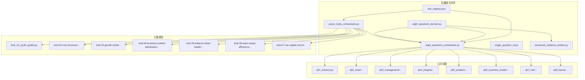
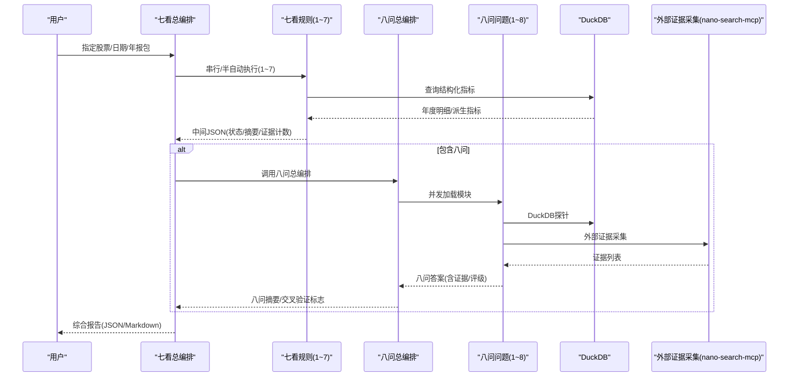
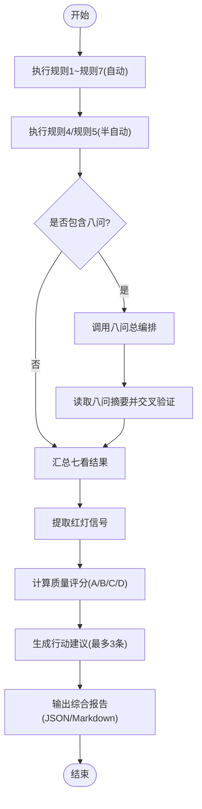
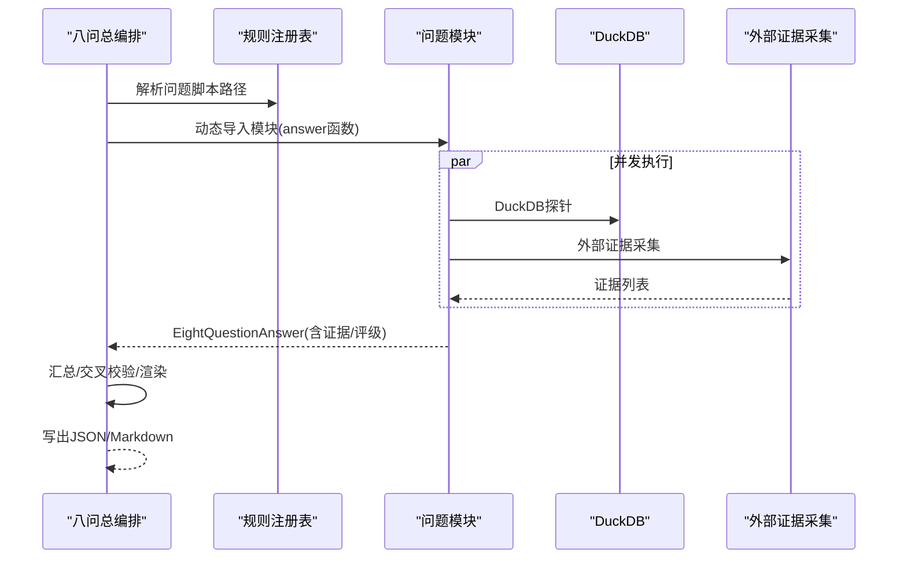
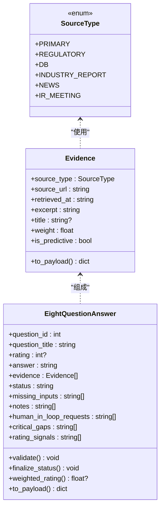
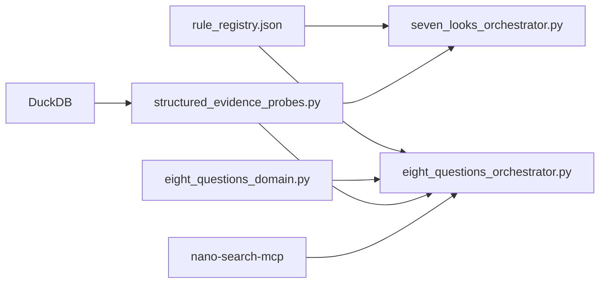

# 2分钟公司分析系统

<cite>
**本文档引用的文件**
- [2min-company-analysis/README.md](file://2min-company-analysis/README.md)
- [seven-look-eight-question/scripts/seven_looks_orchestrator.py](file://2min-company-analysis/seven-look-eight-question/scripts/seven_looks_orchestrator.py)
- [seven-look-eight-question/scripts/eight_questions_orchestrator.py](file://2min-company-analysis/seven-look-eight-question/scripts/eight_questions_orchestrator.py)
- [seven-look-eight-question/scripts/eight_questions_domain.py](file://2min-company-analysis/seven-look-eight-question/scripts/eight_questions_domain.py)
- [seven-look-eight-question/scripts/single_question_cli.py](file://2min-company-analysis/seven-look-eight-question/scripts/single_question_cli.py)
- [seven-look-eight-question/scripts/structured_evidence_probes.py](file://2min-company-analysis/seven-look-eight-question/scripts/structured_evidence_probes.py)
- [seven-look-eight-question/assets/rule_registry.json](file://2min-company-analysis/seven-look-eight-question/assets/rule_registry.json)
- [seven-look-eight-question/SKILL.md](file://2min-company-analysis/seven-look-eight-question/SKILL.md)
- [seven-look-eight-question/references/evidence-playbook.md](file://2min-company-analysis/seven-look-eight-question/references/evidence-playbook.md)
- [look-01-profit-quality/scripts/look_01_profit_quality.py](file://2min-company-analysis/look-01-profit-quality/scripts/look_01_profit_quality.py)
- [ask-q1-industry-prospect/scripts/q01_industry.py](file://2min-company-analysis/ask-q1-industry-prospect/scripts/q01_industry.py)
</cite>

## 目录
1. [简介](#简介)
2. [项目结构](#项目结构)
3. [核心组件](#核心组件)
4. [架构总览](#架构总览)
5. [详细组件分析](#详细组件分析)
6. [依赖关系分析](#依赖关系分析)
7. [性能考量](#性能考量)
8. [故障排除指南](#故障排除指南)
9. [结论](#结论)
10. [附录](#附录)

## 简介
2分钟公司分析系统围绕“七看八问”分析框架构建，旨在对A股非金融类公司进行结构化、可复核的快速基本面体检。系统分为两大能力域：
- 七看（定量规则）：基于DuckDB结构化财务指标，快速扫描利润质量、成本结构、增长趋势、业务构成、资产负债健康度、投入产出效率、ROE与资本回报等七个维度。
- 八问（定性证据）：通过外部证据采集与内部结构化证据探针，围绕行业前景、竞争优势、管理层、财务真实性、市场地位、业务模式、风险因素、未来规划八个问题，形成可溯源的证据链与评级。

系统提供统一的总编排协调器，既可独立执行七看，也可并入八问，最终输出JSON/Markdown综合报告，支持落盘与下游复用。

## 项目结构
系统采用“功能域+脚本化执行”的组织方式，核心目录与职责如下：
- seven-look-eight-question/scripts：总编排与共享领域模型、证据规范、单问CLI与证据探针
- seven-look-eight-question/assets：规则注册表（rule_registry.json），统一登记七看与八问的实现、数据依赖与派生指标
- seven-look-eight-question/references：证据采集与来源模板、数据覆盖范围等参考文档
- look-01-profit-quality/.../ask-q1-industry-prospect/...：各子规则与问题的独立脚本，遵循统一的输入输出契约与证据规范

图表来源
- [seven-look-eight-question/scripts/seven_looks_orchestrator.py:62-119](file://2min-company-analysis/seven-look-eight-question/scripts/seven_looks_orchestrator.py#L62-L119)
- [seven-look-eight-question/scripts/eight_questions_orchestrator.py:41-100](file://2min-company-analysis/seven-look-eight-question/scripts/eight_questions_orchestrator.py#L41-L100)
- [seven-look-eight-question/assets/rule_registry.json:1-410](file://2min-company-analysis/seven-look-eight-question/assets/rule_registry.json#L1-L410)

章节来源
- [2min-company-analysis/README.md:19-56](file://2min-company-analysis/README.md#L19-L56)
- [seven-look-eight-question/SKILL.md:18-40](file://2min-company-analysis/seven-look-eight-question/SKILL.md#L18-L40)

## 核心组件
- 总编排协调器（七看）：统一调度七看规则，收集中间结果，汇总质量评分与行动建议，支持并入八问摘要与交叉验证。
- 总编排协调器（八问）：动态加载八问子模块，按规则注册表并发执行，统一渲染与落盘，支持交叉校验与证据权重加权评级。
- 共享领域模型与证据规范：定义证据单元、来源类型与权重、答案状态与校验、加权评级与摘要渲染。
- 结构化证据探针：封装DuckDB查询，将结构化结果转换为Evidence，确保每条结论均有可溯源的事实来源。
- 规则注册表：统一登记七看与八问的实现脚本、数据依赖、派生指标与测试状态，保障跨模块一致性与可追溯性。

章节来源
- [seven-look-eight-question/scripts/seven_looks_orchestrator.py:1-120](file://2min-company-analysis/seven-look-eight-question/scripts/seven_looks_orchestrator.py#L1-L120)
- [seven-look-eight-question/scripts/eight_questions_orchestrator.py:1-120](file://2min-company-analysis/seven-look-eight-question/scripts/eight_questions_orchestrator.py#L1-L120)
- [seven-look-eight-question/scripts/eight_questions_domain.py:26-121](file://2min-company-analysis/seven-look-eight-question/scripts/eight_questions_domain.py#L26-L121)
- [seven-look-eight-question/scripts/structured_evidence_probes.py:1-80](file://2min-company-analysis/seven-look-eight-question/scripts/structured_evidence_probes.py#L1-L80)
- [seven-look-eight-question/assets/rule_registry.json:1-410](file://2min-company-analysis/seven-look-eight-question/assets/rule_registry.json#L1-L410)

## 架构总览
系统采用“规则注册+动态加载+并发执行+统一渲染”的架构，确保：
- 可插拔：通过rule_registry.json声明式注册规则与脚本，新增规则只需遵循契约即可被编排器发现。
- 可复核：所有结论必须有Evidence支撑，证据来源类型与权重明确，支持溯源与交叉验证。
- 可扩展：八问可选接入，不影响七看评分体系，最终报告统一落盘。

图表来源
- [seven-look-eight-question/scripts/seven_looks_orchestrator.py:170-245](file://2min-company-analysis/seven-look-eight-question/scripts/seven_looks_orchestrator.py#L170-L245)
- [seven-look-eight-question/scripts/eight_questions_orchestrator.py:119-164](file://2min-company-analysis/seven-look-eight-question/scripts/eight_questions_orchestrator.py#L119-L164)
- [ask-q1-industry-prospect/scripts/q01_industry.py:52-147](file://2min-company-analysis/ask-q1-industry-prospect/scripts/q01_industry.py#L52-L147)

## 详细组件分析

### 七看总编排协调器
- 执行阶段
  - Phase 1（自动）：执行规则1~规则7中纯数据库的脚本（规则1~规则7，除规则4/规则5需要年报文本外）。
  - Phase 2（半自动）：执行规则4/规则5，若未提供年报文本包则标记human-in-loop。
  - Phase 2.5（可选）：当启用八问时，调用八问总编排，读取八问输出并补充交叉验证标志。
  - Phase 3（汇总）：合并七看中间结果，提取红灯预警，计算质量评分。
  - Phase 4（评语）：生成量化评语与最多三条行动建议。
- 红灯提取与评分
  - 从各规则结果中抽取红灯信号，按严重程度扣分，最终映射到A/B/C/D等级。
- 人类介入清单
  - 汇总规则4/规则5的人工补充请求，以及八问汇总的阻塞请求，形成统一的待办清单。
- 行动建议
  - 基于规则状态与质量评分，生成优先级建议（补充年报、深入排查、分析资本结构、评估收入恢复可能性、进入估值分析）。

图表来源
- [seven-look-eight-question/scripts/seven_looks_orchestrator.py:6-12](file://2min-company-analysis/seven-look-eight-question/scripts/seven_looks_orchestrator.py#L6-L12)
- [seven-look-eight-question/scripts/seven_looks_orchestrator.py:458-652](file://2min-company-analysis/seven-look-eight-question/scripts/seven_looks_orchestrator.py#L458-L652)
- [seven-look-eight-question/scripts/seven_looks_orchestrator.py:655-687](file://2min-company-analysis/seven-look-eight-question/scripts/seven_looks_orchestrator.py#L655-L687)
- [seven-look-eight-question/scripts/seven_looks_orchestrator.py:693-774](file://2min-company-analysis/seven-look-eight-question/scripts/seven_looks_orchestrator.py#L693-L774)

章节来源
- [seven-look-eight-question/scripts/seven_looks_orchestrator.py:1-120](file://2min-company-analysis/seven-look-eight-question/scripts/seven_looks_orchestrator.py#L1-L120)
- [seven-look-eight-question/SKILL.md:58-104](file://2min-company-analysis/seven-look-eight-question/SKILL.md#L58-L104)

### 八问总编排协调器
- 动态加载与并发执行
  - 从规则注册表解析问题脚本路径，动态导入模块，按问题ID并发执行。
  - 单个问题执行异常会被捕获并降级为“证据不足”，不影响其他问题。
- 汇总与交叉校验
  - 统计问题数量、状态分布、平均评级与加权平均评级。
  - 交叉校验：例如当规则1的净现比均值较低且问题4评级偏低时，标记强化财务真实性信号。
- 渲染与落盘
  - 支持Markdown渲染，突出人工介入请求与关键证据缺口。
  - 输出JSON与Markdown文件，便于下游消费与归档。

图表来源
- [seven-look-eight-question/scripts/eight_questions_orchestrator.py:41-100](file://2min-company-analysis/seven-look-eight-question/scripts/eight_questions_orchestrator.py#L41-L100)
- [seven-look-eight-question/scripts/eight_questions_orchestrator.py:119-164](file://2min-company-analysis/seven-look-eight-question/scripts/eight_questions_orchestrator.py#L119-L164)
- [seven-look-eight-question/scripts/eight_questions_orchestrator.py:171-201](file://2min-company-analysis/seven-look-eight-question/scripts/eight_questions_orchestrator.py#L171-L201)
- [seven-look-eight-question/scripts/eight_questions_orchestrator.py:304-319](file://2min-company-analysis/seven-look-eight-question/scripts/eight_questions_orchestrator.py#L304-L319)

章节来源
- [seven-look-eight-question/scripts/eight_questions_orchestrator.py:1-120](file://2min-company-analysis/seven-look-eight-question/scripts/eight_questions_orchestrator.py#L1-L120)
- [seven-look-eight-question/scripts/eight_questions_orchestrator.py:304-319](file://2min-company-analysis/seven-look-eight-question/scripts/eight_questions_orchestrator.py#L304-L319)

### 共享领域模型与证据规范
- 来源类型与权重
  - primary/regulatory/db权重为1.0；industry_report为0.6；ir_meeting为0.5；news为0.4。
  - 预测/公司口径来源在Markdown中自动打标签，便于人工识别。
- Evidence与EightQuestionAnswer
  - Evidence强校验：必须有URL与摘录，时间戳符合ISO格式；提供权重与是否预测属性。
  - EightQuestionAnswer：状态必须在预定义集合内；ready状态下必须有证据且评级在1~5之间；finalize_status按缺失证据与人工介入请求自动降级。
- 加权评级
  - weighted_rating = rating × 平均证据权重，用于衡量结论强度与证据质量。

图表来源
- [seven-look-eight-question/scripts/eight_questions_domain.py:26-121](file://2min-company-analysis/seven-look-eight-question/scripts/eight_questions_domain.py#L26-L121)
- [seven-look-eight-question/scripts/eight_questions_domain.py:123-213](file://2min-company-analysis/seven-look-eight-question/scripts/eight_questions_domain.py#L123-L213)

章节来源
- [seven-look-eight-question/scripts/eight_questions_domain.py:26-121](file://2min-company-analysis/seven-look-eight-question/scripts/eight_questions_domain.py#L26-L121)
- [seven-look-eight-question/scripts/eight_questions_domain.py:123-213](file://2min-company-analysis/seven-look-eight-question/scripts/eight_questions_domain.py#L123-L213)

### 结构化证据探针
- 设计原则
  - 所有探针返回(rows, Evidence)，rows用于上层评级逻辑，Evidence以duckdb://table?q=...为URL，excerpt为关键字段摘要。
  - 连接必须只读，失败时返回([], None)。
- 典型探针
  - 公司概况、高管、薪酬与股东结构等DB事实探针。
  - 名称历史、净现比等财务真实性探针。
- 与八问协作
  - 八问各问题脚本通过探针获取结构化证据，配合外部证据采集，形成完整的证据链。

章节来源
- [seven-look-eight-question/scripts/structured_evidence_probes.py:1-80](file://2min-company-analysis/seven-look-eight-question/scripts/structured_evidence_probes.py#L1-L80)
- [seven-look-eight-question/scripts/structured_evidence_probes.py:58-157](file://2min-company-analysis/seven-look-eight-question/scripts/structured_evidence_probes.py#L58-L157)

### 规则注册表与契约
- 规则注册表
  - 统一登记规则ID、脚本路径、数据表依赖、派生指标、缺失数据、测试与评审状态。
  - 七看与八问分别以look-xx与question-xx命名，便于编排器解析与加载。
- 契约与边界
  - 七看独立执行，输出标准化摘要与原始明细；八问独立执行，输出统一payload并可被七问总编排读取。
  - 八问不改变七看评分体系，仅作为扩展字段并入最终报告。

章节来源
- [seven-look-eight-question/assets/rule_registry.json:1-410](file://2min-company-analysis/seven-look-eight-question/assets/rule_registry.json#L1-L410)
- [seven-look-eight-question/SKILL.md:74-104](file://2min-company-analysis/seven-look-eight-question/SKILL.md#L74-L104)

### 实战案例与使用场景
- 七看独立执行
  - 场景：快速筛查某公司财务质量，无需外部证据。
  - 流程：指定股票与分析日期，执行七看总编排，查看质量评分与行动建议。
- 七看+八问并行
  - 场景：需要行业前景、管理层、财务真实性等定性证据。
  - 流程：启用八问开关，系统并发执行八问问题，读取八问摘要并进行交叉验证，最终输出综合报告。
- 单独执行某规则或问题
  - 场景：调试规则口径、复核SQL、实测样本。
  - 流程：直接调用对应脚本，遵循统一输入输出契约。

章节来源
- [2min-company-analysis/README.md:80-94](file://2min-company-analysis/README.md#L80-L94)
- [seven-look-eight-question/SKILL.md:18-40](file://2min-company-analysis/seven-look-eight-question/SKILL.md#L18-L40)

## 依赖关系分析
- 组件耦合
  - 七看与八问通过统一的规则注册表解耦，各自独立演进。
  - 共享领域模型与证据规范是跨模块契约，确保输出一致性。
- 外部依赖
  - DuckDB：七看与八问的结构化证据来源。
  - 外部证据采集（nano-search-mcp）：八问问题在需要时调用，用于行业研报、产业政策、IR会议等证据采集。
- 潜在循环依赖
  - 通过动态导入与规则注册表避免硬编码依赖，降低循环依赖风险。

图表来源
- [seven-look-eight-question/assets/rule_registry.json:1-410](file://2min-company-analysis/seven-look-eight-question/assets/rule_registry.json#L1-L410)
- [seven-look-eight-question/scripts/seven_looks_orchestrator.py:51-60](file://2min-company-analysis/seven-look-eight-question/scripts/seven_looks_orchestrator.py#L51-L60)
- [seven-look-eight-question/scripts/eight_questions_orchestrator.py:38-39](file://2min-company-analysis/seven-look-eight-question/scripts/eight_questions_orchestrator.py#L38-L39)

章节来源
- [seven-look-eight-question/scripts/seven_looks_orchestrator.py:51-60](file://2min-company-analysis/seven-look-eight-question/scripts/seven_looks_orchestrator.py#L51-L60)
- [seven-look-eight-question/scripts/eight_questions_orchestrator.py:38-39](file://2min-company-analysis/seven-look-eight-question/scripts/eight_questions_orchestrator.py#L38-L39)

## 性能考量
- 并发执行
  - 八问采用线程池并发执行，提升整体吞吐；单个问题失败不影响其他问题。
- I/O优化
  - DuckDB连接只读，避免锁竞争；探针统一返回(rows, Evidence)，减少重复查询。
- 输出落盘
  - 中间文件与最终报告统一落盘，避免下游重复拼接，降低错误率。

章节来源
- [seven-look-eight-question/scripts/eight_questions_orchestrator.py:153-163](file://2min-company-analysis/seven-look-eight-question/scripts/eight_questions_orchestrator.py#L153-L163)
- [seven-look-eight-question/scripts/structured_evidence_probes.py:28-31](file://2min-company-analysis/seven-look-eight-question/scripts/structured_evidence_probes.py#L28-L31)

## 故障排除指南
- 证据不足与人工介入
  - 八问：当缺少primary/regulatory/db证据或外部采集失败时，状态降级为“证据不足”或“需要人工介入”，并在报告中标注具体请求。
  - 七问：规则4/规则5依赖年报文本时，若未提供则标记human-in-loop，建议补充文本包后重试。
- 校验失败
  - EightQuestionAnswer.validate在ready状态下必须满足证据与评级约束；若违反，自动降级并记录notes。
- 数据库不可访问
  - DuckDB文件不存在或连接失败时，相应问题将记录critical_gaps并降级。
- 外部工具异常
  - 外部证据采集工具抛异常或返回unavailable时，对应证据槽位留空，追加missing_inputs并禁止用模型常识替代。

章节来源
- [seven-look-eight-question/scripts/eight_questions_orchestrator.py:132-151](file://2min-company-analysis/seven-look-eight-question/scripts/eight_questions_orchestrator.py#L132-L151)
- [seven-look-eight-question/scripts/eight_questions_domain.py:140-167](file://2min-company-analysis/seven-look-eight-question/scripts/eight_questions_domain.py#L140-L167)
- [ask-q1-industry-prospect/scripts/q01_industry.py:62-105](file://2min-company-analysis/ask-q1-industry-prospect/scripts/q01_industry.py#L62-L105)
- [seven-look-eight-question/references/evidence-playbook.md:9-13](file://2min-company-analysis/seven-look-eight-question/references/evidence-playbook.md#L9-L13)

## 结论
2分钟公司分析系统通过“七看八问”框架实现了定量与定性分析的有机融合：七看提供稳健的财务体检，八问补齐行业、管理层、风险与战略证据。系统以规则注册表为契约，以共享领域模型与证据规范为基石，以总编排协调器为核心，确保可插拔、可复核、可扩展与可落地。通过统一的输出与落盘机制，系统为分析师提供了高质量、可追溯、可复现的综合报告。

## 附录
- 报告生成规范
  - JSON：面向程序消费，包含标准化汇总视图、原始透传视图、八问摘要与交叉验证标志。
  - Markdown：面向人工阅读，突出质量评分、红灯预警、人类介入请求、行动建议与证据表格。
- 解读指南
  - 质量评分：起始100分，严重红旗扣15分，警示扣5分；A(≥80)、B(60-79)、C(40-59)、D(<40)。
  - 加权评级：结合评级与证据权重，反映结论强度与证据质量。
  - 证据来源：优先primary/regulatory/db，其次industry_report/ir_meeting，最后news；预测/公司口径来源需标注。

章节来源
- [seven-look-eight-question/SKILL.md:180-201](file://2min-company-analysis/seven-look-eight-question/SKILL.md#L180-L201)
- [seven-look-eight-question/scripts/eight_questions_domain.py:96-195](file://2min-company-analysis/seven-look-eight-question/scripts/eight_questions_domain.py#L96-L195)