# ROE资本回报 (look-07)

<cite>
**本文档引用的文件**
- [look_07_roe_capital_return.py](file://2min-company-analysis/look-07-roe-capital-return/scripts/look_07_roe_capital_return.py)
- [common.py](file://2min-company-analysis/look-07-roe-capital-return/scripts/common.py)
- [SKILL.md](file://2min-company-analysis/look-07-roe-capital-return/SKILL.md)
- [README.md](file://2min-company-analysis/README.md)
- [rule_registry.json](file://2min-company-analysis/seven-look-eight-question/assets/rule_registry.json)
- [single_question_cli.py](file://2min-company-analysis/seven-look-eight-question/scripts/single_question_cli.py)
- [README.md](file://tushare-duckdb-sync/README.md)
</cite>

## 目录
1. [简介](#简介)
2. [项目结构](#项目结构)
3. [核心组件](#核心组件)
4. [架构概览](#架构概览)
5. [详细组件分析](#详细组件分析)
6. [依赖关系分析](#依赖关系分析)
7. [性能考虑](#性能考虑)
8. [故障排除指南](#故障排除指南)
9. [结论](#结论)
10. [附录](#附录)

## 简介

ROE资本回报分析模块（look-07）是"七看八问"财务分析框架中的第七个定量规则，专注于净资产收益率（ROE）的深度分析。该模块通过杜邦分析法对ROE进行三因素分解，识别ROE的驱动因素，评估ROE质量，并提供与行业标杆的对比分析。

本模块的核心价值在于：
- **杜邦三因素分解**：将ROE分解为销售净利润率、资产周转率和权益乘数三个关键驱动因素
- **ROE质量评估**：区分盈利驱动、杠杆驱动、周转驱动等不同类型
- **异常波动识别**：建立阈值规则识别ROE异常波动及其原因
- **多维度分析**：结合DuckDB数据库进行跨期对比和行业基准分析

## 项目结构

ROE分析模块位于2min-company-analysis项目的独立目录中，采用清晰的模块化设计：

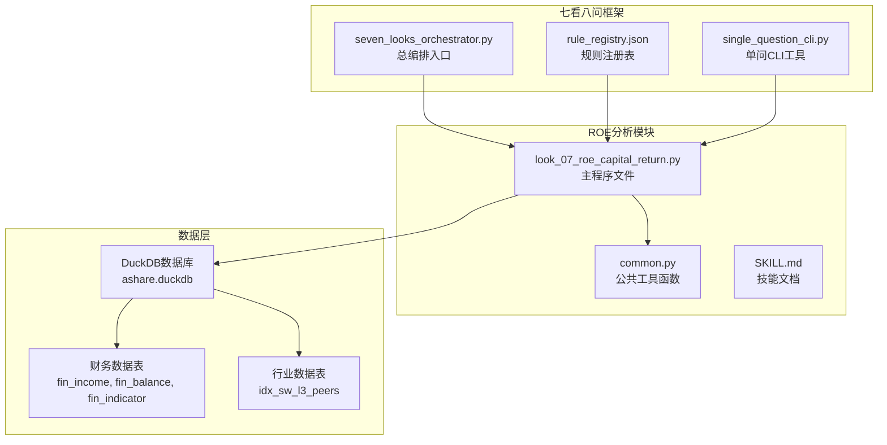

**图表来源**
- [look_07_roe_capital_return.py:1-794](file://2min-company-analysis/look-07-roe-capital-return/scripts/look_07_roe_capital_return.py#L1-L794)
- [common.py:1-154](file://2min-company-analysis/look-07-roe-capital-return/scripts/common.py#L1-L154)

**章节来源**
- [README.md:1-132](file://2min-company-analysis/README.md#L1-L132)
- [rule_registry.json:191-217](file://2min-company-analysis/seven-look-eight-question/assets/rule_registry.json#L191-L217)

## 核心组件

### 1. 杜邦分析引擎

杜邦分析法是ROE分析的核心算法，将ROE分解为三个相互关联的因素：

**ROE = NPM × AT × EM**

其中：
- **NPM（销售净利润率）** = 净利润 ÷ 营业收入
- **AT（资产周转率）** = 营业收入 ÷ 平均总资产  
- **EM（权益乘数）** = 平均总资产 ÷ 平均净资产

### 2. 驱动因素分类系统

模块采用启发式阈值对ROE驱动因素进行分类：

| 驱动类型 | 分类条件 | 特征描述 |
|---------|---------|---------|
| 盈利驱动 | NPM > 10% 且 EM < 4.0 | 高销售净利润率，适度杠杆，最健康类型 |
| 杠杆驱动 | EM > 5.0 且 NPM < 8% | 高杠杆低盈利，需关注财务风险 |
| 周转驱动 | AT > 1.0 且 NPM < 8% | 高资产周转率，薄利多销模式 |
| 混合型 | 其他情况 | 多因素均衡，无明显主导特征 |

### 3. 异常状态检测

系统能够识别以下异常状态：
- **负ROE状态**：公司处于亏损状态
- **负净资产**：资不抵债的极端财务风险
- **数据不足**：无法进行有效分析的状态

**章节来源**
- [look_07_roe_capital_return.py:19-428](file://2min-company-analysis/look-07-roe-capital-return/scripts/look_07_roe_capital_return.py#L19-L428)
- [SKILL.md:50-67](file://2min-company-analysis/look-07-roe-capital-return/SKILL.md#L50-L67)

## 架构概览

ROE分析模块采用分层架构设计，确保功能的模块化和可维护性：

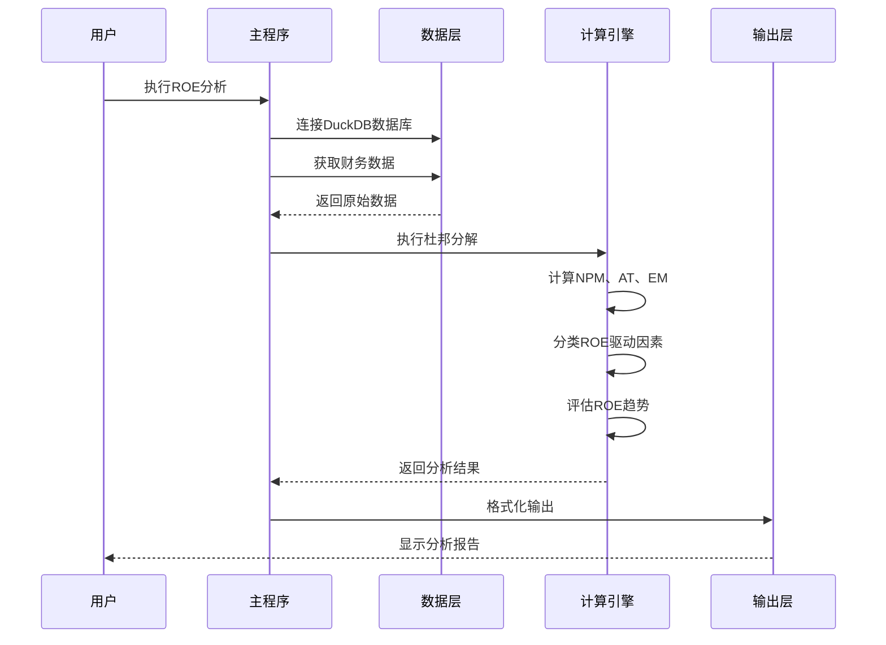

**图表来源**
- [look_07_roe_capital_return.py:719-794](file://2min-company-analysis/look-07-roe-capital-return/scripts/look_07_roe_capital_return.py#L719-L794)

### 数据流架构

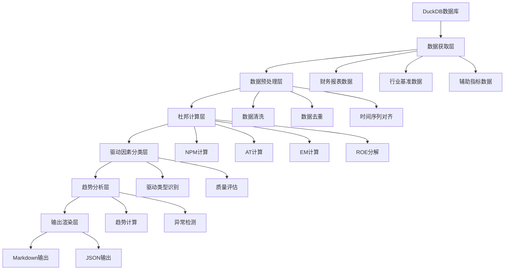

**图表来源**
- [look_07_roe_capital_return.py:58-197](file://2min-company-analysis/look-07-roe-capital-return/scripts/look_07_roe_capital_return.py#L58-L197)

## 详细组件分析

### 1. 数据获取与处理组件

#### 财务数据获取

模块从多个DuckDB表中获取必要的财务数据：

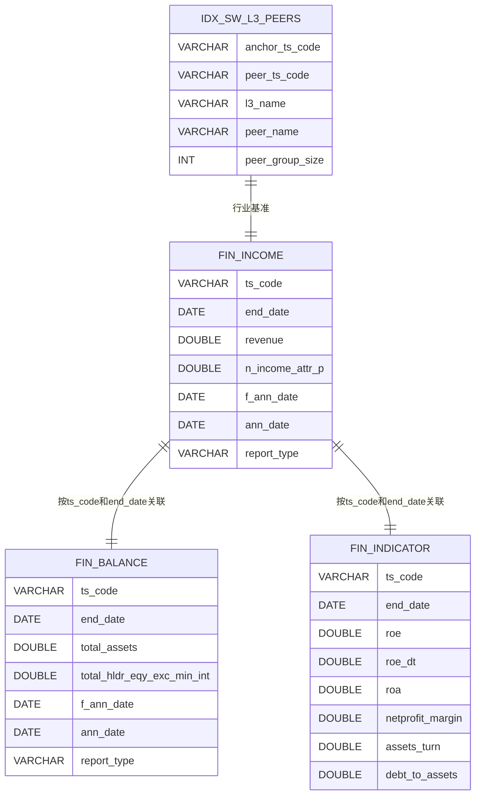

**图表来源**
- [look_07_roe_capital_return.py:68-197](file://2min-company-analysis/look-07-roe-capital-return/scripts/look_07_roe_capital_return.py#L68-L197)

#### 数据预处理流程

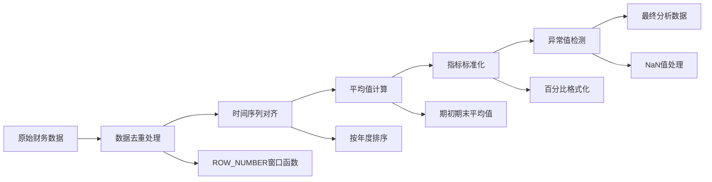

**图表来源**
- [look_07_roe_capital_return.py:105-143](file://2min-company-analysis/look-07-roe-capital-return/scripts/look_07_roe_capital_return.py#L105-L143)

**章节来源**
- [look_07_roe_capital_return.py:58-197](file://2min-company-analysis/look-07-roe-capital-return/scripts/look_07_roe_capital_return.py#L58-L197)

### 2. 杜邦分析计算组件

#### 核心计算公式

杜邦分析的核心计算逻辑如下：

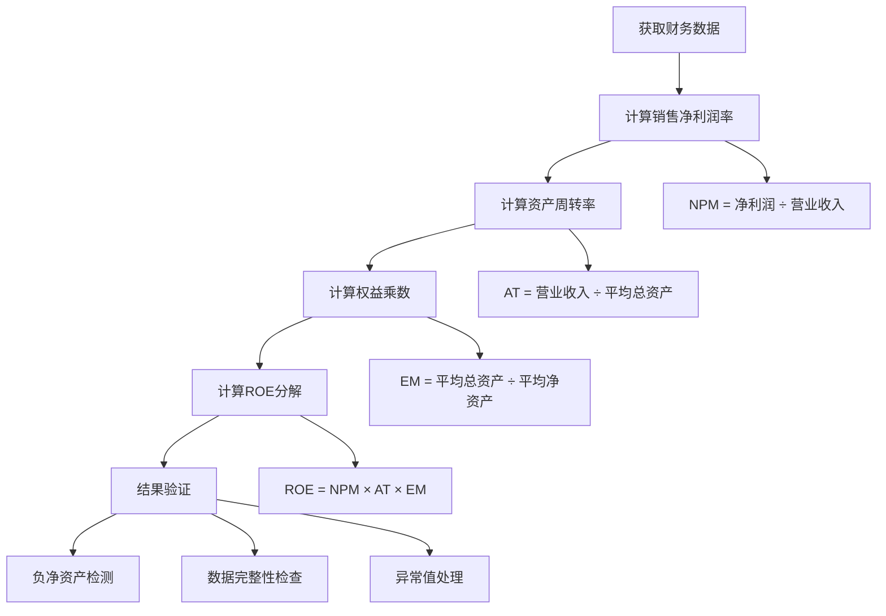

**图表来源**
- [look_07_roe_capital_return.py:301-388](file://2min-company-analysis/look-07-roe-capital-return/scripts/look_07_roe_capital_return.py#L301-L388)

#### 计算精度控制

系统实现了多层次的精度控制机制：

| 指标类型 | 计算方法 | 精度控制 | 异常处理 |
|---------|---------|---------|---------|
| NPM | 净利润 ÷ 营业收入 | 保留6位小数 | NaN检查 |
| AT | 营业收入 ÷ 平均总资产 | 保留4位小数 | 除零保护 |
| EM | 平均总资产 ÷ 平均净资产 | 保留4位小数 | 负值标记 |
| ROE | NPM × AT × EM | 保留4位小数 | 负数检测 |

**章节来源**
- [look_07_roe_capital_return.py:301-388](file://2min-company-analysis/look-07-roe-capital-return/scripts/look_07_roe_capital_return.py#L301-L388)

### 3. 驱动因素分类组件

#### 分类决策树

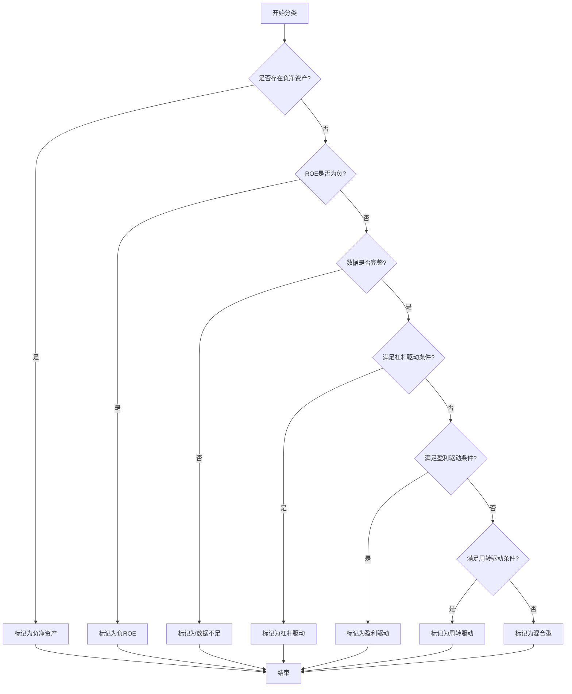

**图表来源**
- [look_07_roe_capital_return.py:395-428](file://2min-company-analysis/look-07-roe-capital-return/scripts/look_07_roe_capital_return.py#L395-L428)

#### 分类阈值配置

分类系统使用可配置的阈值参数：

| 驱动类型 | 杠杆驱动阈值 | 盈利驱动阈值 | 周转驱动阈值 |
|---------|-------------|-------------|-------------|
| EM条件 | EM > 5.0 | EM < 4.0 | - |
| NPM条件 | NPM < 8% | NPM > 10% | NPM < 8% |
| AT条件 | - | - | AT > 1.0 |

**章节来源**
- [look_07_roe_capital_return.py:19-23](file://2min-company-analysis/look-07-roe-capital-return/scripts/look_07_roe_capital_return.py#L19-L23)
- [look_07_roe_capital_return.py:395-428](file://2min-company-analysis/look-07-roe-capital-return/scripts/look_07_roe_capital_return.py#L395-L428)

### 4. 趋势分析组件

#### ROE趋势评估

系统采用相对变化率的方法评估ROE趋势：

```mermaid
flowchart LR
A[获取历史ROE数据] --> B[计算变化率]
B --> C{变化率阈值判断}
C --> |> 15%| D[标记为改善]
C --> |< -15%| E[标记为恶化]
C --> |±15%内| F[标记为稳定]
C --> |基期为0| G{新值是否为0}
G --> |是| H[标记为稳定]
G --> |否| I[标记为波动]
B --> B1[变化率 = (最新值 - 最早值) ÷ |最早值|]
```

**图表来源**
- [look_07_roe_capital_return.py:430-449](file://2min-company-analysis/look-07-roe-capital-return/scripts/look_07_roe_capital_return.py#L430-L449)

#### 趋势分析参数

| 参数 | 阈值 | 说明 |
|------|------|-----|
| 改善阈值 | +15% | ROE显著提升 |
| 恶化阈值 | -15% | ROE明显下降 |
| 稳定范围 | ±15% | ROE相对稳定 |
| 基期检测 | 0值处理 | 避免除零错误 |

**章节来源**
- [look_07_roe_capital_return.py:430-449](file://2min-company-analysis/look-07-roe-capital-return/scripts/look_07_roe_capital_return.py#L430-L449)

### 5. 行业基准对比组件

#### 基准选择策略

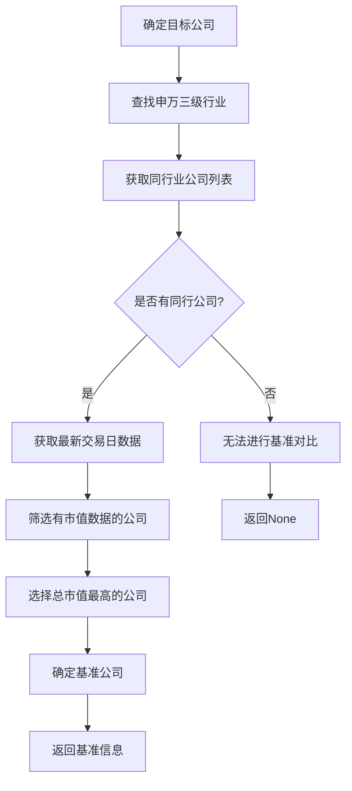

**图表来源**
- [look_07_roe_capital_return.py:204-268](file://2min-company-analysis/look-07-roe-capital-return/scripts/look_07_roe_capital_return.py#L204-L268)

#### 基准对比分析

系统提供多维度的对比分析：

| 对比维度 | 目标公司指标 | 基准公司指标 | 分析意义 |
|---------|-------------|-------------|---------|
| ROE | 目标公司ROE | 基准公司ROE | 整体回报水平对比 |
| NPM | 目标公司NPM | 基准公司NPM | 盈利能力对比 |
| AT | 目标公司AT | 基准公司AT | 经营效率对比 |
| EM | 目标公司EM | 基准公司EM | 杠杆水平对比 |

**章节来源**
- [look_07_roe_capital_return.py:204-268](file://2min-company-analysis/look-07-roe-capital-return/scripts/look_07_roe_capital_return.py#L204-L268)

## 依赖关系分析

### 1. 外部依赖

ROE分析模块依赖以下外部组件：

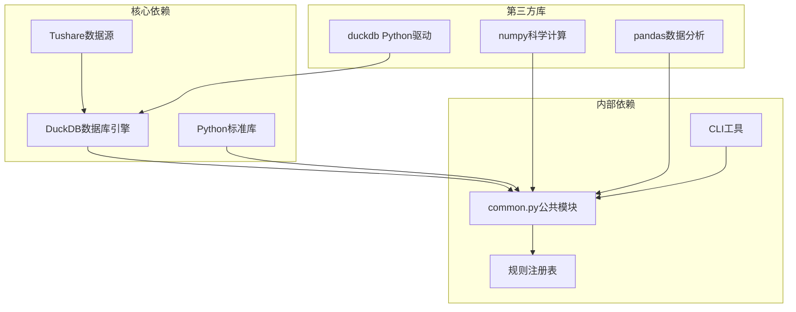

**图表来源**
- [look_07_roe_capital_return.py:10](file://2min-company-analysis/look-07-roe-capital-return/scripts/look_07_roe_capital_return.py#L10)
- [common.py:1-8](file://2min-company-analysis/look-07-roe-capital-return/scripts/common.py#L1-L8)

### 2. 内部模块依赖

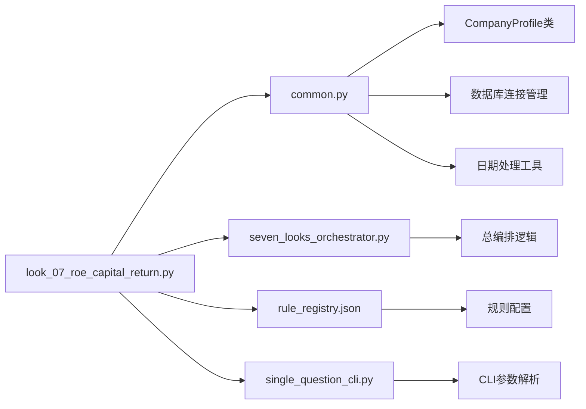

**图表来源**
- [look_07_roe_capital_return.py:12-15](file://2min-company-analysis/look-07-roe-capital-return/scripts/look_07_roe_capital_return.py#L12-L15)
- [common.py:28-60](file://2min-company-analysis/look-07-roe-capital-return/scripts/common.py#L28-L60)

**章节来源**
- [look_07_roe_capital_return.py:12-15](file://2min-company-analysis/look-07-roe-capital-return/scripts/look_07_roe_capital_return.py#L12-L15)
- [common.py:11-13](file://2min-company-analysis/look-07-roe-capital-return/scripts/common.py#L11-L13)

## 性能考虑

### 1. 查询优化

系统采用多种查询优化策略：

- **索引利用**：充分利用DuckDB的索引机制，特别是按ts_code和end_date的复合索引
- **分区裁剪**：通过WHERE条件限制数据扫描范围
- **窗口函数优化**：使用ROW_NUMBER()进行高效的数据去重和排序
- **CTE重用**：通过公用表表达式减少重复计算

### 2. 内存管理

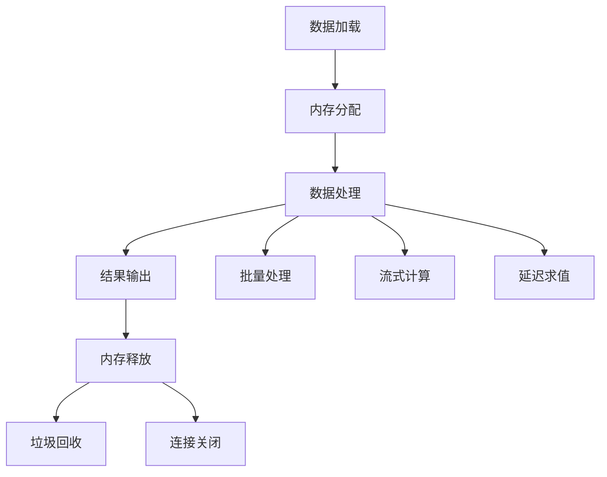

### 3. 缓存策略

系统实现了智能缓存机制：
- **连接缓存**：复用DuckDB连接减少初始化开销
- **查询结果缓存**：对重复查询的结果进行缓存
- **中间结果缓存**：缓存计算过程中的中间结果

## 故障排除指南

### 1. 常见错误类型

#### 数据访问错误

| 错误类型 | 症状 | 解决方案 |
|---------|------|---------|
| DuckDB文件不存在 | FileNotFoundError | 检查数据库路径配置 |
| 权限不足 | AccessDeniedError | 确保数据库文件可读权限 |
| 连接超时 | TimeoutError | 检查网络连接和数据库状态 |

#### 数据质量问题

| 问题类型 | 症状 | 解决方案 |
|---------|------|---------|
| 缺失数据 | None值或NaN | 检查数据同步状态 |
| 数据重复 | 重复记录 | 实施数据去重逻辑 |
| 时间错位 | 日期不匹配 | 实施时间序列对齐 |

#### 计算错误

| 错误类型 | 症状 | 解决方案 |
|---------|------|---------|
| 除零错误 | ZeroDivisionError | 添加分母为零检查 |
| 负数开方 | ValueError | 检查数据合理性 |
| 类型转换错误 | TypeError | 实施类型验证 |

### 2. 调试工具

系统提供了多种调试工具：

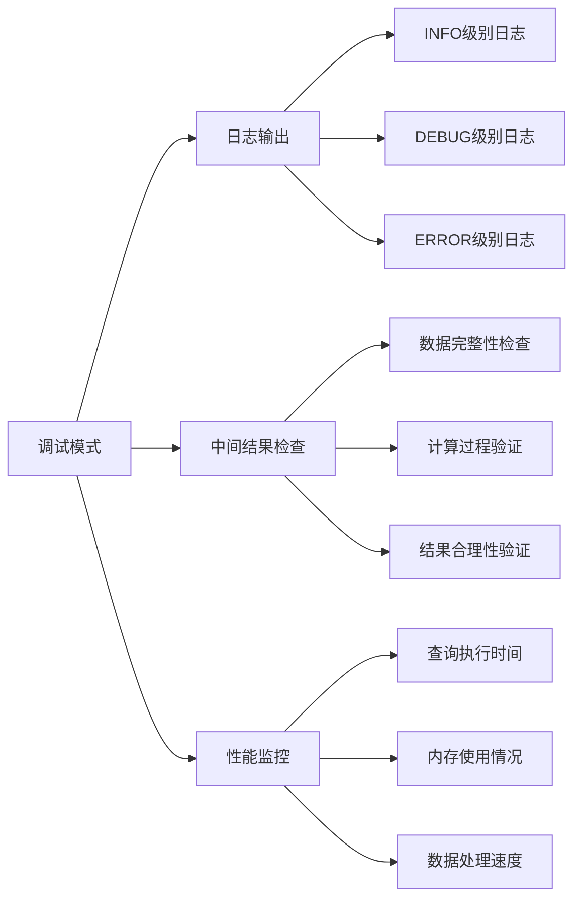

### 3. 性能诊断

#### 查询性能分析

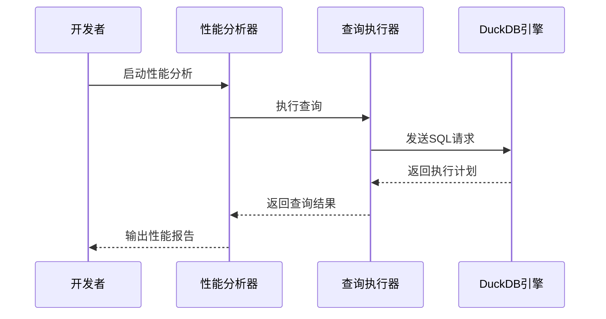

**章节来源**
- [look_07_roe_capital_return.py:76-79](file://2min-company-analysis/look-07-roe-capital-return/scripts/look_07_roe_capital_return.py#L76-L79)

## 结论

ROE资本回报分析模块（look-07）是一个功能完整、设计合理的财务分析工具。其主要特点包括：

### 核心优势

1. **算法严谨性**：基于经典的杜邦分析法，确保分析结果的学术权威性
2. **实用性导向**：提供明确的分类阈值和判断标准，便于实际投资决策
3. **数据完整性**：全面的数据来源和质量控制机制
4. **可扩展性**：模块化的架构设计支持功能扩展和定制

### 技术特色

- **多维度分析**：从盈利能力、运营效率、财务杠杆三个角度全面评估ROE
- **异常检测**：内置负净资产、负ROE等异常状态的自动识别
- **基准对比**：提供行业基准对比，增强分析的参考价值
- **趋势分析**：支持跨期趋势分析，识别ROE的变化轨迹

### 应用价值

该模块为投资者提供了：
- **决策支持**：通过ROE驱动因素分析指导投资决策
- **风险识别**：及时发现潜在的财务风险信号
- **比较工具**：与行业标杆进行横向对比分析
- **跟踪工具**：长期跟踪公司财务表现的变化趋势

## 附录

### 1. 使用示例

#### 基本使用

```bash
python look_07_roe_capital_return.py \
  --stock 000002.SZ \
  --as-of-date 2025-04-30 \
  --lookback-years 5 \
  --format markdown
```

#### JSON格式输出

```bash
python look_07_roe_capital_return.py \
  --stock 000002.SZ \
  --format json
```

### 2. 配置参数

| 参数 | 类型 | 默认值 | 描述 |
|------|------|--------|------|
| --stock | 必需 | - | 股票代码 |
| --as-of-date | 可选 | 当天 | 分析截止日期 |
| --lookback-years | 可选 | 5 | 回看年数 |
| --db-path | 可选 | 默认数据库路径 | DuckDB文件路径 |
| --format | 可选 | markdown | 输出格式 |

### 3. 数据质量保证

系统实施了多层次的数据质量控制：

- **数据完整性检查**：确保所有必需字段都有有效值
- **逻辑一致性验证**：检查财务指标之间的逻辑关系
- **异常值检测**：识别可能的数据录入错误
- **时间序列完整性**：确保年度数据的连续性

### 4. 维护建议

- **定期更新**：定期同步最新的财务数据
- **阈值调整**：根据市场变化调整分类阈值
- **算法优化**：持续改进计算算法和性能
- **文档更新**：及时更新使用文档和技术说明