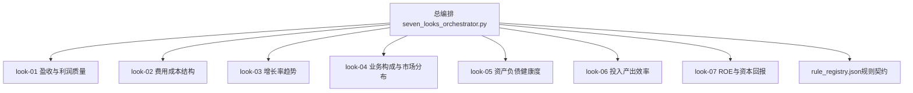
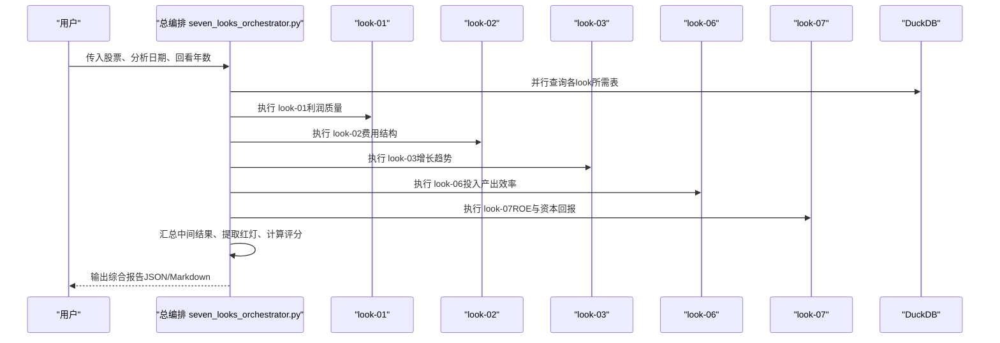
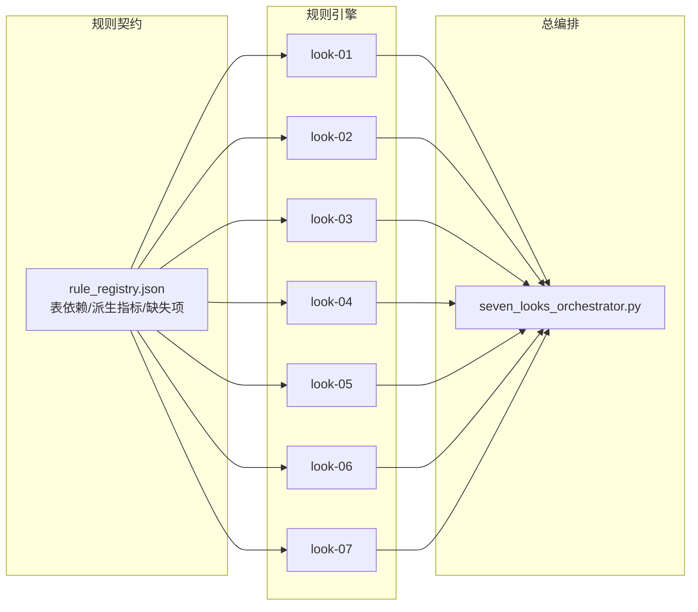

# 七看定量分析

<cite>
**本文引用的文件**
- [README.md](file://2min-company-analysis/README.md)
- [SKILL.md](file://2min-company-analysis/seven-look-eight-question/SKILL.md)
- [seven_looks_orchestrator.py](file://2min-company-analysis/seven-look-eight-question/scripts/seven_looks_orchestrator.py)
- [rule_registry.json](file://2min-company-analysis/seven-look-eight-question/assets/rule_registry.json)
- [look_01_profit_quality.py](file://2min-company-analysis/look-01-profit-quality/scripts/look_01_profit_quality.py)
- [look_02_cost_structure.py](file://2min-company-analysis/look-02-cost-structure/scripts/look_02_cost_structure.py)
- [look_03_growth_trend.py](file://2min-company-analysis/look-03-growth-trend/scripts/look_03_growth_trend.py)
- [look_04_business_market_distribution.py](file://2min-company-analysis/look-04-business-market-distribution/scripts/look_04_business_market_distribution.py)
- [look_05_balance_sheet_health.py](file://2min-company-analysis/look-05-balance-sheet-health/scripts/look_05_balance_sheet_health.py)
- [look_06_input_output_efficiency.py](file://2min-company-analysis/look-06-input-output-efficiency/scripts/look_06_input_output_efficiency.py)
- [look_07_roe_capital_return.py](file://2min-company-analysis/look-07-roe-capital-return/scripts/look_07_roe_capital_return.py)
</cite>

## 目录
1. [简介](#简介)
2. [项目结构](#项目结构)
3. [核心组件](#核心组件)
4. [架构总览](#架构总览)
5. [详细组件分析](#详细组件分析)
6. [依赖分析](#依赖分析)
7. [性能考虑](#性能考虑)
8. [故障排除指南](#故障排除指南)
9. [结论](#结论)
10. [附录](#附录)

## 简介
本文件面向“七看定量分析系统”，系统性阐述七个定量分析维度的理论依据、计算逻辑与判断标准，详解每个look模块的数据来源、算法实现与阈值设定，解释财务质量体检的评分体系与预警机制，并提供各维度的解读指南、异常信号识别与风险提示。同时给出SQL查询思路与数据处理流程，展示如何将定量分析结果整合为综合财务质量报告。

## 项目结构
七看模块位于“2min-company-analysis”目录下，采用“按维度分技能”的组织方式：
- seven-look-eight-question：总编排与汇总，负责串联七个look与八问，生成综合报告与评分。
- look-01 到 look-07：七个独立的定量分析技能，分别聚焦不同财务质量维度。
- assets/rule_registry.json：规则契约与派生指标清单，定义每个look的数据表依赖、派生指标与缺失项。
- README.md：总体说明、使用路径与能力边界。

图表来源
- [seven_looks_orchestrator.py:62-119](file://2min-company-analysis/seven-look-eight-question/scripts/seven_looks_orchestrator.py#L62-L119)
- [rule_registry.json:1-410](file://2min-company-analysis/seven-look-eight-question/assets/rule_registry.json#L1-L410)

章节来源
- [README.md:1-132](file://2min-company-analysis/README.md#L1-L132)
- [SKILL.md:1-201](file://2min-company-analysis/seven-look-eight-question/SKILL.md#L1-L201)

## 核心组件
- 总编排与汇总：统一执行七个look，收集中间结果，汇总红灯预警与质量评分，生成最终报告。
- 七看规则引擎：每个look独立封装数据查询、派生指标计算、趋势与异常识别、人类介入请求与输出格式化。
- 规则契约：通过rule_registry.json明确每个look的数据表依赖、派生指标、缺失项与脚本位置，确保跨模块一致性。

章节来源
- [seven_looks_orchestrator.py:62-119](file://2min-company-analysis/seven-look-eight-question/scripts/seven_looks_orchestrator.py#L62-L119)
- [rule_registry.json:1-410](file://2min-company-analysis/seven-look-eight-question/assets/rule_registry.json#L1-L410)

## 架构总览
七看系统以“总编排-规则引擎-契约管理”三层架构运行：
- 总编排层：解析参数、并行执行各look、汇总结果、生成评分与建议。
- 规则引擎层：每个look独立完成数据拉取、指标计算、异常识别与输出。
- 契约管理层：统一定义数据表、派生指标与缺失项，保障规则一致性与可审计性。

图表来源
- [seven_looks_orchestrator.py:170-244](file://2min-company-analysis/seven-look-eight-question/scripts/seven_looks_orchestrator.py#L170-L244)

## 详细组件分析

### look-01 盈收与利润质量
- 理论依据：以“利润是否落地为现金”为核心，结合扣非利润、经营/自由现金流、毛利率趋势等，评估盈利质量与可持续性。
- 数据来源：fin_income、fin_indicator、fin_cashflow。
- 计算逻辑：
  - 选择主/备利润率字段（去重年报后择优），计算净现比（OCF/归母净利润）与自由现金流（OCF-购建固定资产支付）。
  - 统计正向年数：扣非利润、经营现金流、自由现金流。
  - 毛利率趋势：按末期>中期>初期判定连续下滑（至少3年非空正值）。
- 判断标准：
  - 净现比均值<0.5：利润未落地为现金，警示。
  - 毛利率连续≥3年下滑：警示。
  - 扣非利润/经营现金流/自由现金流连续为负：严重警示。
- SQL要点（示意）：
  - 以年末报表为基准，按end_date月=12日=31筛选，去重同一日期多条披露记录。
  - 计算net_profit_cash_ratio与fcf，统计正向年数与趋势。
- 异常信号与风险提示：
  - 利润含金量不足、盈利可持续性弱、自由现金流长期失血。
- 解读指南：
  - 结合look-07 ROE质量（是否存在杠杆驱动）与look-05杠杆趋势，综合判断盈利质量。

章节来源
- [look_01_profit_quality.py:81-123](file://2min-company-analysis/look-01-profit-quality/scripts/look_01_profit_quality.py#L81-L123)
- [look_01_profit_quality.py:126-287](file://2min-company-analysis/look-01-profit-quality/scripts/look_01_profit_quality.py#L126-L287)
- [look_01_profit_quality.py:312-378](file://2min-company-analysis/look-01-profit-quality/scripts/look_01_profit_quality.py#L312-L378)
- [rule_registry.json:14-38](file://2min-company-analysis/seven-look-eight-question/assets/rule_registry.json#L14-L38)

### look-02 费用成本结构
- 理论依据：费用增长与营收增长的匹配度决定费用效率与增长质量。
- 数据来源：fin_income、fin_indicator。
- 计算逻辑：
  - 计算销售/管理/财务/研发费用率及其同比。
  - 识别“费用增长但营收未增长”的不匹配次数。
- 判断标准：
  - 销售费用增长但营收未增长：警示。
- SQL要点（示意）：
  - 以年末报表为基准，计算费用率与同比，识别不匹配信号。
- 异常信号与风险提示：
  - 费用扩张快于收入扩张，费用效率下降。
- 解读指南：
  - 结合look-01利润质量，关注费用扩张是否带来利润改善。

章节来源
- [look_02_cost_structure.py:41-233](file://2min-company-analysis/look-02-cost-structure/scripts/look_02_cost_structure.py#L41-L233)
- [look_02_cost_structure.py:258-302](file://2min-company-analysis/look-02-cost-structure/scripts/look_02_cost_structure.py#L258-L302)
- [rule_registry.json:48-63](file://2min-company-analysis/seven-look-eight-question/assets/rule_registry.json#L48-L63)

### look-03 增长率趋势
- 理论依据：区分内生增长与并购驱动增长，评估增长可持续性与质量。
- 数据来源：fin_income、fin_balance、fin_cashflow。
- 计算逻辑：
  - 计算营收与归母净利润CAGR。
  - 识别商誉增长与取得子公司现金支出，作为并购驱动信号。
- 判断标准：
  - 营收CAGR为负：严重警示。
  - 归母净利润CAGR大幅为负：严重警示。
  - 存在并购代理信号：警示。
- SQL要点（示意）：
  - 以年末报表为基准，计算YOY与CAGR，识别商誉与处置子公司收到现金。
- 异常信号与风险提示：
  - 收入与利润双缩，增长依赖并购。
- 解读指南：
  - 结合look-04业务构成，判断增长来源是否清晰与可持续。

章节来源
- [look_03_growth_trend.py:41-198](file://2min-company-analysis/look-03-growth-trend/scripts/look_03_growth_trend.py#L41-L198)
- [look_03_growth_trend.py:241-301](file://2min-company-analysis/look-03-growth-trend/scripts/look_03_growth_trend.py#L241-L301)
- [rule_registry.json:73-89](file://2min-company-analysis/seven-look-eight-question/assets/rule_registry.json#L73-L89)

### look-04 业务构成与市场分布
- 理论依据：通过年报文本抽取业务构成、海外销售与客户集中度证据，评估业务多样性与风险集中度。
- 数据来源：年报全文（文本）、申万三级同行池（结构化）。
- 计算逻辑：
  - 关键词匹配：主营业务、海外/境外销售、单一客户/前五大客户。
  - 统计证据数量与缺失维度，生成人类介入请求。
- 判断标准：
  - 缺少年报全文：半自动（human-in-loop）。
  - 证据不足：部分证据（partial）。
- SQL要点（示意）：
  - 文本抽取与关键词匹配，不依赖结构化SQL。
- 异常信号与风险提示：
  - 海外销售占比低或集中度高、单一客户依赖强。
- 解读指南：
  - 与look-05资产负债健康度联动，关注海外资产与或有负债。

章节来源
- [look_04_business_market_distribution.py:18-77](file://2min-company-analysis/look-04-business-market-distribution/scripts/look_04_business_market_distribution.py#L18-L77)
- [look_04_business_market_distribution.py:282-298](file://2min-company-analysis/look-04-business-market-distribution/scripts/look_04_business_market_distribution.py#L282-L298)
- [look_04_business_market_distribution.py:301-341](file://2min-company-analysis/look-04-business-market-distribution/scripts/look_04_business_market_distribution.py#L301-L341)
- [rule_registry.json:98-121](file://2min-company-analysis/seven-look-eight-question/assets/rule_registry.json#L98-L121)

### look-05 资产负债健康度
- 理论依据：以现金流覆盖、杠杆与偿债能力为核心，评估企业流动性与债务风险。
- 数据来源：fin_balance、fin_cashflow、fin_indicator。
- 计算逻辑：
  - 现金流覆盖：OCF覆盖投资活动、OCF覆盖资本开支、净现金流变化。
  - 杠杆趋势：以资产/权益趋势衡量上升/下降/稳定。
  - 隐性负债：通过年报附注关键词抽取证据。
- 判断标准：
  - 资产负债率>80：严重警示。
  - 近N年OCF无法覆盖资本开支：严重警示。
  - 杠杆水平持续恶化：警示。
- SQL要点（示意）：
  - 并表年末报表，计算interestdebt（若缺少明细则按字段求和），评估各类偿债比率。
- 异常信号与风险提示：
  - 高杠杆、现金流紧张、隐性负债未披露。
- 解读指南：
  - 结合look-01利润质量与look-07 ROE质量，评估偿债来源与质量。

章节来源
- [look_05_balance_sheet_health.py:108-219](file://2min-company-analysis/look-05-balance-sheet-health/scripts/look_05_balance_sheet_health.py#L108-L219)
- [look_05_balance_sheet_health.py:347-383](file://2min-company-analysis/look-05-balance-sheet-health/scripts/look_05_balance_sheet_health.py#L347-L383)
- [look_05_balance_sheet_health.py:526-605](file://2min-company-analysis/look-05-balance-sheet-health/scripts/look_05_balance_sheet_health.py#L526-L605)
- [rule_registry.json:129-153](file://2min-company-analysis/seven-look-eight-question/assets/rule_registry.json#L129-L153)

### look-06 投入产出效率
- 理论依据：以营运资金/收入、固定资产/收入、人均效率等指标评估资源配置效率。
- 数据来源：fin_income、fin_balance、fin_cashflow、fin_indicator、申万三级同行池、股票因子。
- 计算逻辑：
  - WC/收入、固定资产/收入、单位劳动成本产出（收入/人工成本、利润/人工成本）。
  - 人均指标（营收/人数、利润/人数）需用户提供真实员工数。
  - WC趋势：以最新/最老窗口比较判断改善/恶化/稳定。
- 判断标准：
  - WC/收入>1：警示。
  - WC趋势恶化：警示。
  - 人均指标缺失：半自动（human-in-loop）。
- SQL要点（示意）：
  - 以年末报表为基准，计算各项效率指标，按end_date降序取回看窗口。
- 异常信号与风险提示：
  - 资产占用高、人均效率低、员工数缺失。
- 解读指南：
  - 与look-07 ROE联动，关注资产回报与效率提升路径。

章节来源
- [look_06_input_output_efficiency.py:109-227](file://2min-company-analysis/look-06-input-output-efficiency/scripts/look_06_input_output_efficiency.py#L109-L227)
- [look_06_input_output_efficiency.py:385-463](file://2min-company-analysis/look-06-input-output-efficiency/scripts/look_06_input_output_efficiency.py#L385-L463)
- [look_06_input_output_efficiency.py:470-531](file://2min-company-analysis/look-06-input-output-efficiency/scripts/look_06_input_output_efficiency.py#L470-L531)
- [rule_registry.json:162-189](file://2min-company-analysis/seven-look-eight-question/assets/rule_registry.json#L162-L189)

### look-07 ROE与资本回报
- 理论依据：基于杜邦分解（ROE=NPM×AT×EM）识别ROE驱动因素，评估盈利能力、资产效率与杠杆水平。
- 数据来源：fin_income、fin_balance、fin_indicator。
- 计算逻辑：
  - 杜邦分解：NPM、AT、EM，以及roe_dupont。
  - 驱动分类：基于阈值判断“盈利能力驱动/杠杆驱动/周转驱动/混合/负权益/负ROE”。
  - ROE趋势：以最新与最早窗口比较变化幅度。
- 判断标准：
  - 负权益：极端警示。
  - 负ROE：警示。
  - 杠杆驱动：警示。
  - ROE持续恶化：警示。
- SQL要点（示意）：
  - 以年末报表为基准，计算平均总资产与平均净资产，避免单期波动。
- 异常信号与风险提示：
  - 高杠杆支撑的ROE、负资产回报、ROE波动剧烈。
- 解读指南：
  - 结合look-01利润质量与look-05杠杆趋势，评估ROE质量与可持续性。

章节来源
- [look_07_roe_capital_return.py:58-143](file://2min-company-analysis/look-07-roe-capital-return/scripts/look_07_roe_capital_return.py#L58-L143)
- [look_07_roe_capital_return.py:301-388](file://2min-company-analysis/look-07-roe-capital-return/scripts/look_07_roe_capital_return.py#L301-L388)
- [look_07_roe_capital_return.py:395-450](file://2min-company-analysis/look-07-roe-capital-return/scripts/look_07_roe_capital_return.py#L395-L450)
- [rule_registry.json:198-216](file://2min-company-analysis/seven-look-eight-question/assets/rule_registry.json#L198-L216)

## 依赖分析
- DuckDB表依赖：各look根据rule_registry.json声明的表与派生指标进行查询。
- 人类介入链路：look-04与look-05在缺少年报文本时进入human-in-loop，生成具体请求。
- 总编排耦合：seven_looks_orchestrator.py统一收集各look结果，提取红灯、计算评分与生成建议。

图表来源
- [rule_registry.json:1-410](file://2min-company-analysis/seven-look-eight-question/assets/rule_registry.json#L1-L410)
- [seven_looks_orchestrator.py:62-119](file://2min-company-analysis/seven-look-eight-question/scripts/seven_looks_orchestrator.py#L62-L119)

章节来源
- [rule_registry.json:1-410](file://2min-company-analysis/seven-look-eight-question/assets/rule_registry.json#L1-L410)
- [seven_looks_orchestrator.py:170-244](file://2min-company-analysis/seven-look-eight-question/scripts/seven_looks_orchestrator.py#L170-L244)

## 性能考虑
- 并行执行：总编排对look-01/02/03/06/07采用并行子进程执行，缩短整体耗时。
- 查询优化：各look均以年末报表（end_date月=12日=31）与去重策略减少冗余记录。
- 采样限制：文本抽取（look-04/05）对命中片段与数值候选做上限控制，避免过度扫描。
- 人类介入控制：仅在必要时触发human-in-loop，避免无效等待。

## 故障排除指南
- 金融类公司不适用：当公司类型为金融（银行/保险/证券）时，各look返回“not-applicable”，需改走金融分析路径。
- DuckDB连接失败：检查db-path与文件存在性。
- 无数据/部分数据：查看各look的“missing_counts”与“status”，确认数据覆盖范围。
- 人类介入请求：根据human_in_loop_requests逐项补充年报/附注文本或员工数。

章节来源
- [seven_looks_orchestrator.py:455-652](file://2min-company-analysis/seven-look-eight-question/scripts/seven_looks_orchestrator.py#L455-L652)
- [look_01_profit_quality.py:570-575](file://2min-company-analysis/look-01-profit-quality/scripts/look_01_profit_quality.py#L570-L575)
- [look_02_cost_structure.py:477-483](file://2min-company-analysis/look-02-cost-structure/scripts/look_02_cost_structure.py#L477-L483)
- [look_03_growth_trend.py:469-475](file://2min-company-analysis/look-03-growth-trend/scripts/look_03_growth_trend.py#L469-L475)
- [look_06_input_output_efficiency.py:777-799](file://2min-company-analysis/look-06-input-output-efficiency/scripts/look_06_input_output_efficiency.py#L777-L799)
- [look_07_roe_capital_return.py:739-761](file://2min-company-analysis/look-07-roe-capital-return/scripts/look_07_roe_capital_return.py#L739-L761)

## 结论
七看定量分析系统通过七大维度的结构化指标与阈值，形成对财务质量的快速体检。总编排统一汇总各维度结果，提取红灯并计算质量评分，辅以人类介入与跨维度交叉验证，最终输出可复核的综合报告。建议在实际应用中结合八问与外部证据，持续完善证据链与阈值体系。

## 附录

### 财务质量体检评分体系与预警机制
- 起始分数：100分。
- 严重红灯（critical）：扣15分/项。
- 警示（warning）：扣5分/项。
- 等级划分：
  - A（≥80）：财务质量良好
  - B（60-79）：财务质量一般，存在部分隐患
  - C（40-59）：财务质量较差，多项红灯预警
  - D（<40）：财务质量极差，建议高度警惕
- 红灯提取：由各look内置规则提取，汇总后计算扣分。

章节来源
- [seven_looks_orchestrator.py:655-686](file://2min-company-analysis/seven-look-eight-question/scripts/seven_looks_orchestrator.py#L655-L686)
- [seven_looks_orchestrator.py:455-652](file://2min-company-analysis/seven-look-eight-question/scripts/seven_looks_orchestrator.py#L455-L652)

### 综合财务质量报告生成流程
- 步骤：
  1) 并行执行look-01/02/03/06/07（纯数据库）。
  2) 执行look-04/05（若未提供年报文本包则标记human-in-loop）。
  3) 汇总7份中间JSON，提取红灯并计算质量评分。
  4) 生成行动建议与量化评语。
  5) 可选：并入八问摘要，输出最终报告（JSON/Markdown）。
- 输出契约：
  - results/look_results：标准化汇总视图（最小信息集）。
  - raw_results：原始透传视图（明细与证据）。
  - eight_questions/critical_gaps：八问扩展字段（可选）。

章节来源
- [SKILL.md:58-95](file://2min-company-analysis/seven-look-eight-question/SKILL.md#L58-L95)
- [seven_looks_orchestrator.py:1-80](file://2min-company-analysis/seven-look-eight-question/scripts/seven_looks_orchestrator.py#L1-L80)