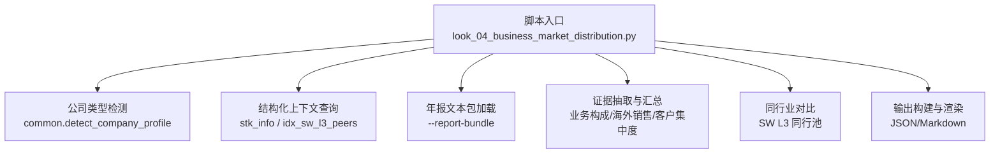
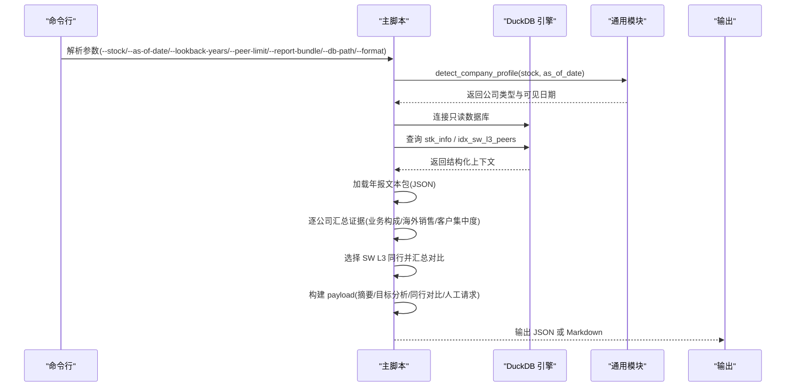
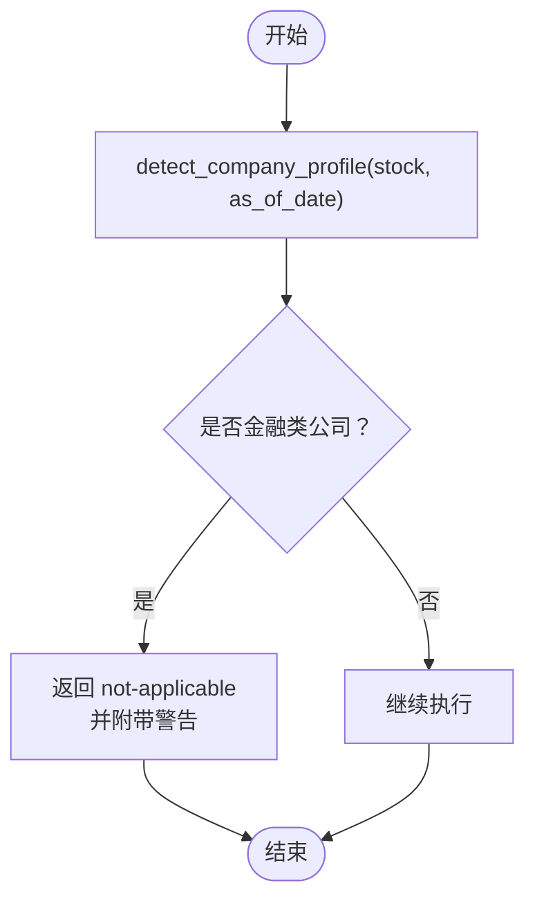
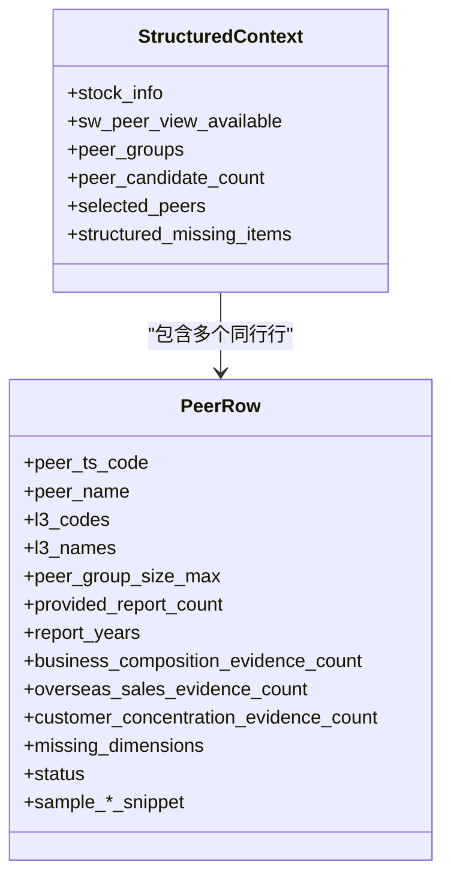
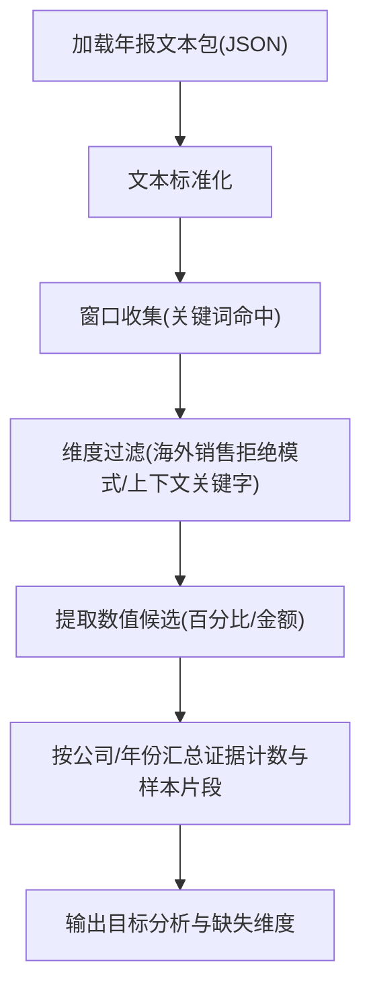
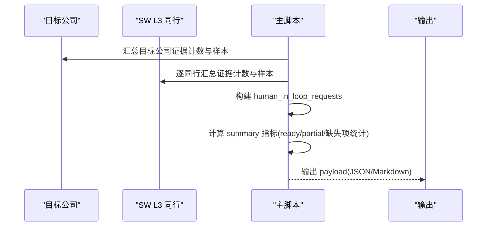
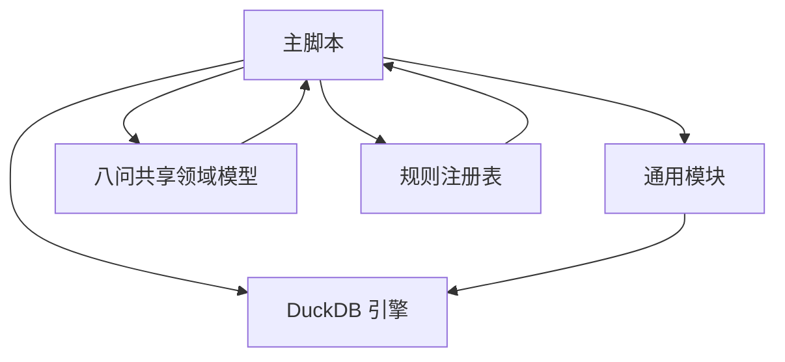

# 业务构成分析 (look-04)

<cite>
**本文引用的文件**
- [common.py](file://2min-company-analysis/look-04-business-market-distribution/scripts/common.py)
- [look_04_business_market_distribution.py](file://2min-company-analysis/look-04-business-market-distribution/scripts/look_04_business_market_distribution.py)
- [SKILL.md](file://2min-company-analysis/look-04-business-market-distribution/SKILL.md)
- [eight_questions_domain.py](file://2min-company-analysis/seven-look-eight-question/scripts/eight_questions_domain.py)
- [rule_registry.json](file://2min-company-analysis/seven-look-eight-question/assets/rule_registry.json)
</cite>

## 目录
1. [简介](#简介)
2. [项目结构](#项目结构)
3. [核心组件](#核心组件)
4. [架构总览](#架构总览)
5. [详细组件分析](#详细组件分析)
6. [依赖关系分析](#依赖关系分析)
7. [性能考量](#性能考量)
8. [故障排除指南](#故障排除指南)
9. [结论](#结论)
10. [附录](#附录)

## 简介
本文件面向“look-04 业务构成与市场分布”分析模块，系统化阐述其在“七看八问”框架中的定位、数据口径、证据抽取策略、稳定性评估指标与风险识别方法，并提供基于 DuckDB 的多业务板块对比与趋势跟踪实践指南。该模块聚焦于：
- 主营业务收入占比与业务分布合理性
- 海外/境外销售占比与区域风险
- 单一客户/前五大客户集中度
- 同行业（申万 L3）横向对比
- 从年报全文中抽取上述维度的证据，形成“结构化上下文 + 人工取证”的工作流

## 项目结构
look-04 所属目录位于“2min-company-analysis/look-04-business-market-distribution”，核心文件包括：
- scripts/common.py：通用工具与公司类型检测
- scripts/look_04_business_market_distribution.py：主分析脚本
- SKILL.md：技能说明与执行规范
- seven-look-eight-question/scripts/eight_questions_domain.py：八问共享领域模型与证据规范
- seven-look-eight-question/assets/rule_registry.json：规则注册表，定义 look-04 的数据状态与缺失项

图表来源
- [look_04_business_market_distribution.py:463-558](file://2min-company-analysis/look-04-business-market-distribution/scripts/look_04_business_market_distribution.py#L463-L558)
- [common.py:82-154](file://2min-company-analysis/look-04-business-market-distribution/scripts/common.py#L82-L154)

章节来源
- [SKILL.md:1-99](file://2min-company-analysis/look-04-business-market-distribution/SKILL.md#L1-L99)
- [rule_registry.json:91-121](file://2min-company-analysis/seven-look-eight-question/assets/rule_registry.json#L91-L121)

## 核心组件
- 公司类型检测与前置过滤：识别金融类公司并直接判定不适用，避免口径不一致。
- 结构化上下文：从 DuckDB 读取股票基础信息与 SW L3 同行池。
- 年报文本包：支持 JSON 格式年报全文，自动解析 ts_code/year/url/text。
- 证据抽取：基于关键词窗口匹配，抽取业务构成、海外销售、客户集中度相关原文片段与数值候选。
- 同行对比：按 SW L3 分类选取前若干只可比公司，统一维度对比。
- 输出构建：生成摘要、目标分析、同行对比行与人工取证请求。

章节来源
- [common.py:82-154](file://2min-company-analysis/look-04-business-market-distribution/scripts/common.py#L82-L154)
- [look_04_business_market_distribution.py:18-81](file://2min-company-analysis/look-04-business-market-distribution/scripts/look_04_business_market_distribution.py#L18-L81)
- [look_04_business_market_distribution.py:188-216](file://2min-company-analysis/look-04-business-market-distribution/scripts/look_04_business_market_distribution.py#L188-L216)
- [look_04_business_market_distribution.py:301-342](file://2min-company-analysis/look-04-business-market-distribution/scripts/look_04_business_market_distribution.py#L301-L342)
- [look_04_business_market_distribution.py:344-384](file://2min-company-analysis/look-04-business-market-distribution/scripts/look_04_business_market_distribution.py#L344-L384)
- [look_04_business_market_distribution.py:386-426](file://2min-company-analysis/look-04-business-market-distribution/scripts/look_04_business_market_distribution.py#L386-L426)

## 架构总览
整体流程分为“结构化上下文 + 文本取证 + 同行对比 + 输出渲染”四个阶段，采用 DuckDB 作为数据引擎，支持只读连接与跨模块共享。

图表来源
- [look_04_business_market_distribution.py:463-558](file://2min-company-analysis/look-04-business-market-distribution/scripts/look_04_business_market_distribution.py#L463-L558)
- [common.py:82-154](file://2min-company-analysis/look-04-business-market-distribution/scripts/common.py#L82-L154)

## 详细组件分析

### 1) 公司类型检测与前置过滤
- 目的：排除金融类公司（银行/保险/证券），因其业务构成与市场分布口径不同于一般工商业。
- 实现：通过联合 fin_income/fin_balance/fin_cashflow 的可见日期与报告类型筛选，确定 comp_type 与 source_table，并提供警告信息。
- 影响：若为金融类，直接返回 not-applicable 状态，避免后续分析误导。

图表来源
- [common.py:82-154](file://2min-company-analysis/look-04-business-market-distribution/scripts/common.py#L82-L154)

章节来源
- [common.py:18-48](file://2min-company-analysis/look-04-business-market-distribution/scripts/common.py#L18-L48)
- [common.py:82-154](file://2min-company-analysis/look-04-business-market-distribution/scripts/common.py#L82-L154)
- [look_04_business_market_distribution.py:483-502](file://2min-company-analysis/look-04-business-market-distribution/scripts/look_04_business_market_distribution.py#L483-L502)

### 2) 结构化上下文与同行池
- 结构化上下文：
  - 股票基础信息：stk_info（ts_code/symbol/name/area/industry/market/list_date/act_name/act_ent_type）
  - 同行池：idx_sw_l3_peers（锚定公司 ts_code 下的 SW L3 同行组，含 l1/l2/l3 代码与名称、同行组大小等）
- 同行选择策略：按 anchor_ts_code 获取所有 SW L3 同行，取前 peer_limit 个作为对比样本。

图表来源
- [look_04_business_market_distribution.py:515-522](file://2min-company-analysis/look-04-business-market-distribution/scripts/look_04_business_market_distribution.py#L515-L522)
- [look_04_business_market_distribution.py:529-547](file://2min-company-analysis/look-04-business-market-distribution/scripts/look_04_business_market_distribution.py#L529-L547)

章节来源
- [look_04_business_market_distribution.py:117-136](file://2min-company-analysis/look-04-business-market-distribution/scripts/look_04_business_market_distribution.py#L117-L136)
- [look_04_business_market_distribution.py:138-186](file://2min-company-analysis/look-04-business-market-distribution/scripts/look_04_business_market_distribution.py#L138-L186)
- [look_04_business_market_distribution.py:503-522](file://2min-company-analysis/look-04-business-market-distribution/scripts/look_04_business_market_distribution.py#L503-L522)

### 3) 年报文本包与证据抽取
- 文本包格式：支持对象或数组两种顶层结构，每条记录包含 ts_code/name/year/url/text。
- 关键词维度：
  - 业务构成：主营业务、业务构成、收入构成、分产品、分地区、分行业、按产品、按地区等
  - 海外销售：境外、海外、国外、外销、出口、国际市场、海外收入、境外收入、境内外等
  - 客户集中度：前五大客户、前五名客户、单一客户、客户集中度、第一大客户、销售总额比例等
- 证据抽取流程：
  - 文本标准化与窗口收集
  - 命中关键词与数值候选提取（百分比、金额单位）
  - 维度过滤（海外销售维度加入拒绝模式与上下文关键字校验）

图表来源
- [look_04_business_market_distribution.py:188-216](file://2min-company-analysis/look-04-business-market-distribution/scripts/look_04_business_market_distribution.py#L188-L216)
- [look_04_business_market_distribution.py:240-299](file://2min-company-analysis/look-04-business-market-distribution/scripts/look_04_business_market_distribution.py#L240-L299)
- [look_04_business_market_distribution.py:218-234](file://2min-company-analysis/look-04-business-market-distribution/scripts/look_04_business_market_distribution.py#L218-L234)

章节来源
- [SKILL.md:40-72](file://2min-company-analysis/look-04-business-market-distribution/SKILL.md#L40-L72)
- [look_04_business_market_distribution.py:18-59](file://2min-company-analysis/look-04-business-market-distribution/scripts/look_04_business_market_distribution.py#L18-L59)
- [look_04_business_market_distribution.py:240-299](file://2min-company-analysis/look-04-business-market-distribution/scripts/look_04_business_market_distribution.py#L240-L299)

### 4) 同行对比与稳定性评估
- 同行对比：基于 SW L3 同行池，按目标公司所在 L3 分类选取前 peer_limit 只公司，统一维度对比证据数量与样本片段。
- 稳定性评估指标（基于证据计数与样本片段）：
  - 主营业务收入占比与业务分布合理性：通过“业务构成证据计数”与样本片段判断披露充分性与一致性
  - 海外/境外销售占比与区域风险：通过“海外销售证据计数”与数值候选判断披露范围与趋势
  - 单一客户/前五大客户集中度：通过“客户集中度证据计数”与样本片段判断是否存在过度依赖
- 状态与请求：
  - status：ready/partial/human-in-loop-required/not-applicable
  - human_in_loop_requests：明确列出缺失输入与补充请求

图表来源
- [look_04_business_market_distribution.py:301-342](file://2min-company-analysis/look-04-business-market-distribution/scripts/look_04_business_market_distribution.py#L301-L342)
- [look_04_business_market_distribution.py:344-384](file://2min-company-analysis/look-04-business-market-distribution/scripts/look_04_business_market_distribution.py#L344-L384)
- [look_04_business_market_distribution.py:386-426](file://2min-company-analysis/look-04-business-market-distribution/scripts/look_04_business_market_distribution.py#L386-L426)

章节来源
- [look_04_business_market_distribution.py:301-342](file://2min-company-analysis/look-04-business-market-distribution/scripts/look_04_business_market_distribution.py#L301-L342)
- [look_04_business_market_distribution.py:344-384](file://2min-company-analysis/look-04-business-market-distribution/scripts/look_04_business_market_distribution.py#L344-L384)
- [look_04_business_market_distribution.py:386-426](file://2min-company-analysis/look-04-business-market-distribution/scripts/look_04_business_market_distribution.py#L386-L426)

### 5) 业务结构对财务表现的影响与风险识别
- 收入稳定性：通过业务构成证据计数与样本片段，评估披露是否覆盖主要产品/地区，减少“单一业务依赖”风险
- 盈利能力：结合海外销售证据与数值候选，识别高毛利/低毛利区域与产品，辅助判断盈利弹性
- 风险识别：
  - 客户集中度高：前五大客户/单一客户证据计数高且数值占比显著，提示“客户依赖”风险
  - 海外销售波动：若海外销售证据计数少或披露模糊，提示“区域风险”与“汇率/地缘政治风险”
  - 业务结构失衡：某产品/地区长期占比过高且缺乏增长动力，提示“增长瓶颈”

章节来源
- [SKILL.md:29-39](file://2min-company-analysis/look-04-business-market-distribution/SKILL.md#L29-L39)
- [look_04_business_market_distribution.py:18-59](file://2min-company-analysis/look-04-business-market-distribution/scripts/look_04_business_market_distribution.py#L18-L59)

### 6) DuckDB 多业务板块对比与趋势跟踪
- 数据准备：确保 DuckDB 中存在 ashare.duckdb，并包含必要的结构化表/视图（stk_info、idx_sw_l3_peers 等）
- 对比分析步骤：
  - 选择目标公司与若干 SW L3 同行
  - 从年报文本包中抽取各维度证据，按年份与公司组织
  - 使用 SQL 将“业务构成/海外销售/客户集中度”证据计数与样本片段合并，形成对比表
- 趋势跟踪：
  - 按年份排序，观察证据计数与数值候选的变化趋势
  - 对比目标公司与同行的证据计数差异，识别偏离常态的信号

章节来源
- [look_04_business_market_distribution.py:84-98](file://2min-company-analysis/look-04-business-market-distribution/scripts/look_04_business_market_distribution.py#L84-L98)
- [look_04_business_market_distribution.py:365-384](file://2min-company-analysis/look-04-business-market-distribution/scripts/look_04_business_market_distribution.py#L365-L384)

## 依赖关系分析
- 内部依赖：
  - 主脚本依赖通用模块进行公司类型检测与 DuckDB 连接
  - 共享领域模型提供证据权重与状态校验逻辑，确保输出符合“证据驱动”的原则
- 外部依赖：
  - DuckDB：只读连接 ashare.duckdb
  - 申万 L3 同行视图：idx_sw_l3_peers
  - 年报文本包：JSON 格式，包含 ts_code/year/url/text

图表来源
- [look_04_business_market_distribution.py:12-16](file://2min-company-analysis/look-04-business-market-distribution/scripts/look_04_business_market_distribution.py#L12-L16)
- [eight_questions_domain.py:26-47](file://2min-company-analysis/seven-look-eight-question/scripts/eight_questions_domain.py#L26-L47)
- [rule_registry.json:91-121](file://2min-company-analysis/seven-look-eight-question/assets/rule_registry.json#L91-L121)

章节来源
- [eight_questions_domain.py:26-47](file://2min-company-analysis/seven-look-eight-question/scripts/eight_questions_domain.py#L26-L47)
- [rule_registry.json:91-121](file://2min-company-analysis/seven-look-eight-question/assets/rule_registry.json#L91-L121)

## 性能考量
- DuckDB 只读连接：避免写操作开销，提升并发安全性
- 文本抽取窗口限制：通过窗口大小与命中上限控制内存与 CPU 开销
- 同行池限制：peer_limit 控制对比样本数量，平衡准确性与性能
- 建议：
  - 在大规模样本上运行时，适当降低 peer_limit 与 lookback_years
  - 对文本包进行分批处理，避免一次性加载过多年报全文

## 故障排除指南
- DuckDB 文件不存在：检查 db-path 是否正确，确保 ashare.duckdb 存在
- 无 SW L3 同行视图：确认 idx_sw_l3_peers 已创建并同步
- 无年报全文：返回 human-in-loop-required，按请求补充最近 N 年年报全文或全文地址
- 金融类公司：直接返回 not-applicable，无需进一步分析
- 缺失披露：返回 partial，列出缺失维度与补充请求

章节来源
- [look_04_business_market_distribution.py:94-98](file://2min-company-analysis/look-04-business-market-distribution/scripts/look_04_business_market_distribution.py#L94-L98)
- [look_04_business_market_distribution.py:344-362](file://2min-company-analysis/look-04-business-market-distribution/scripts/look_04_business_market_distribution.py#L344-L362)
- [look_04_business_market_distribution.py:483-502](file://2min-company-analysis/look-04-business-market-distribution/scripts/look_04_business_market_distribution.py#L483-L502)

## 结论
look-04 业务构成与市场分布分析模块通过“结构化上下文 + 文本取证 + 同行对比”的组合，有效识别企业是否存在业务/市场单一化风险。其关键价值在于：
- 明确的证据抽取与状态管理，避免主观臆断
- 基于 SW L3 同行池的横向对比，提供基准参照
- 以 DuckDB 为核心的高效数据访问与多维度对比能力
建议在实际应用中：
- 优先补齐年报全文，减少 human-in-loop 请求
- 结合其他规则（如 look-01/look-05/look-07）进行综合财务质量评估
- 对异常信号建立预警阈值与跟踪机制

## 附录

### A. 业务分类标准与数据提取方法
- 业务分类标准：
  - 申万三级行业（SW L3）：通过 idx_sw_l3_peers 获取锚定公司所在 L3 分类及同行组
- 数据提取方法：
  - 结构化数据：stk_info（基础画像）、idx_sw_l3_peers（同行池）
  - 文本数据：年报全文（JSON 格式），包含 ts_code/year/url/text

章节来源
- [look_04_business_market_distribution.py:117-136](file://2min-company-analysis/look-04-business-market-distribution/scripts/look_04_business_market_distribution.py#L117-L136)
- [look_04_business_market_distribution.py:138-186](file://2min-company-analysis/look-04-business-market-distribution/scripts/look_04_business_market_distribution.py#L138-L186)
- [SKILL.md:40-72](file://2min-company-analysis/look-04-business-market-distribution/SKILL.md#L40-L72)

### B. 分析流程与输出规范
- 分析流程：
  - 参数解析 → 公司类型检测 → DuckDB 连接与上下文查询 → 文本包加载 → 证据抽取与汇总 → 同行对比 → 输出构建
- 输出规范：
  - JSON/Markdown 两种格式
  - 包含 status、summary、target_analysis、peer_comparison_rows、human_in_loop_requests、rows 等字段

章节来源
- [look_04_business_market_distribution.py:463-558](file://2min-company-analysis/look-04-business-market-distribution/scripts/look_04_business_market_distribution.py#L463-L558)
- [look_04_business_market_distribution.py:429-461](file://2min-company-analysis/look-04-business-market-distribution/scripts/look_04_business_market_distribution.py#L429-L461)