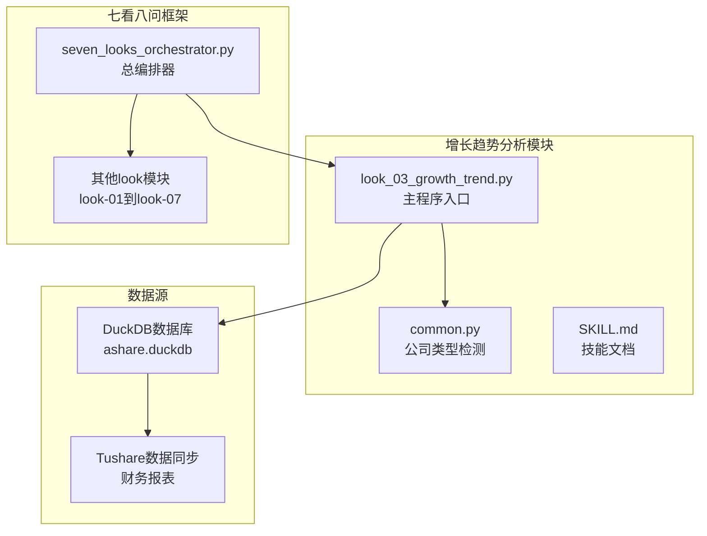
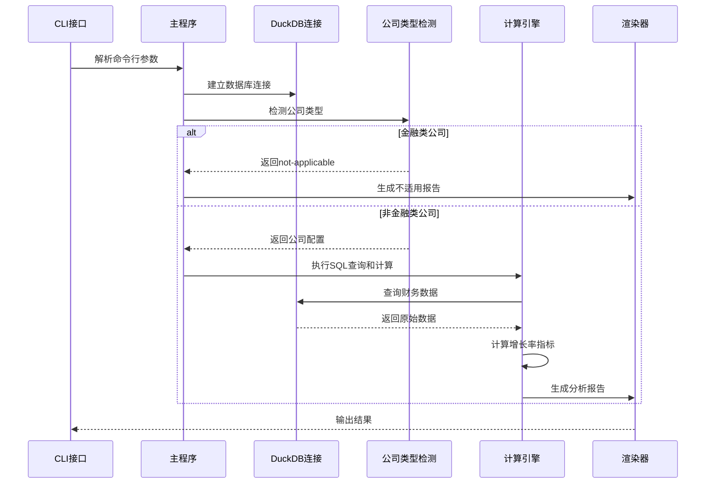
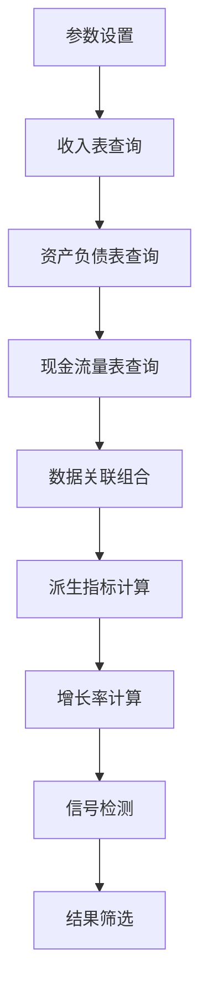
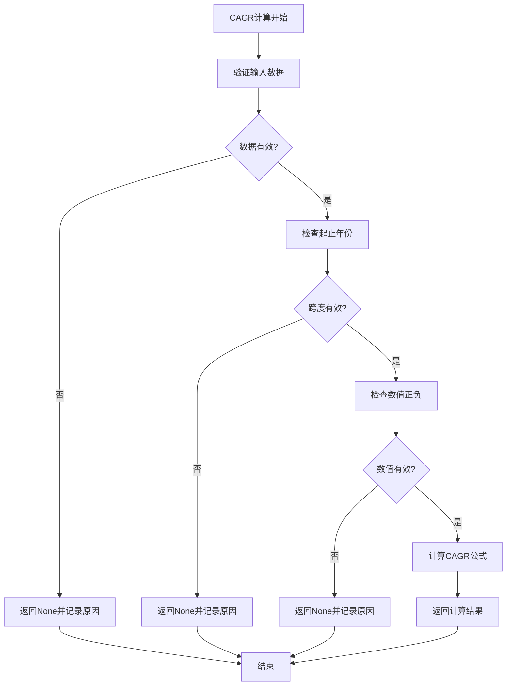
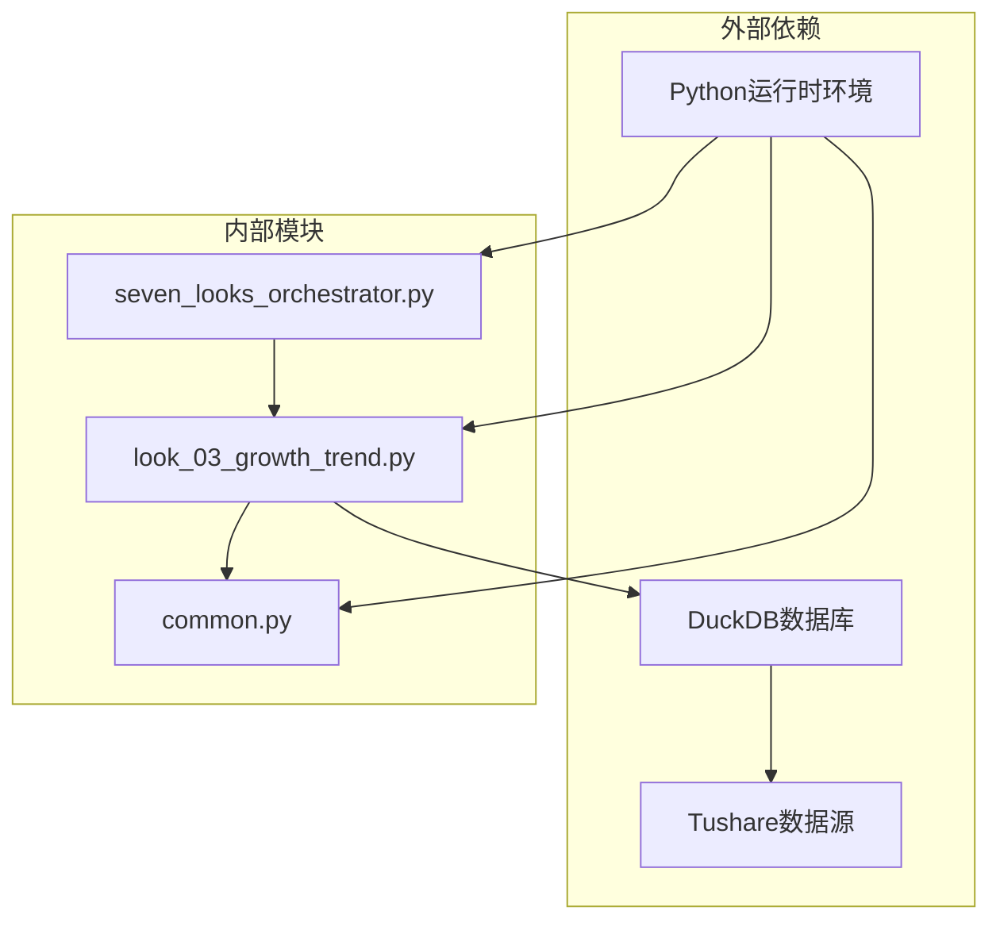
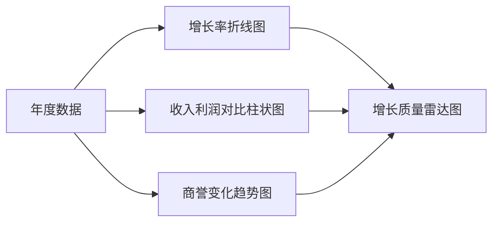

# 增长趋势分析 (look-03)

<cite>
**本文引用的文件**
- [look_03_growth_trend.py](file://2min-company-analysis/look-03-growth-trend/scripts/look_03_growth_trend.py)
- [common.py](file://2min-company-analysis/look-03-growth-trend/scripts/common.py)
- [SKILL.md](file://2min-company-analysis/look-03-growth-trend/SKILL.md)
- [README.md](file://2min-company-analysis/README.md)
- [seven_looks_orchestrator.py](file://2min-company-analysis/seven-look-eight-question/scripts/seven_looks_orchestrator.py)
- [table_metadata.md](file://tushare-duckdb-sync/templates/table_metadata.md)
- [mapping_registry.json](file://tushare-duckdb-sync/templates/mapping_registry.json)
</cite>

## 目录
1. [简介](#简介)
2. [项目结构](#项目结构)
3. [核心组件](#核心组件)
4. [架构概览](#架构概览)
5. [详细组件分析](#详细组件分析)
6. [依赖关系分析](#依赖关系分析)
7. [性能考虑](#性能考虑)
8. [故障排除指南](#故障排除指南)
9. [结论](#结论)
10. [附录](#附录)

## 简介
增长趋势分析（look-03）是"七看八问"财务分析框架中的第三个关键维度，专注于评估企业的营业收入增长率和归属净利润增长率的协同关系。该模块通过DuckDB数据库进行多维度增长趋势分析，提供可持续增长识别、增长质量判断和异常识别策略，帮助投资者和分析师全面理解企业的增长本质和质量。

本模块特别关注内生增长与外延扩张的区别，通过商誉变化和并购现金流量等代理信号来区分不同的增长模式，为企业价值评估提供重要参考。

## 项目结构
增长趋势分析模块采用清晰的分层架构，包含独立的技能实现、共享的公司类型检测逻辑和完整的文档规范。



**图表来源**
- [look_03_growth_trend.py:1-486](file://2min-company-analysis/look-03-growth-trend/scripts/look_03_growth_trend.py#L1-L486)
- [common.py:1-153](file://2min-company-analysis/look-03-growth-trend/scripts/common.py#L1-L153)
- [seven_looks_orchestrator.py:1051-1132](file://2min-company-analysis/seven-look-eight-question/scripts/seven_looks_orchestrator.py#L1051-L1132)

**章节来源**
- [README.md:1-132](file://2min-company-analysis/README.md#L1-L132)
- [SKILL.md:1-65](file://2min-company-analysis/look-03-growth-trend/SKILL.md#L1-L65)

## 核心组件
增长趋势分析模块包含三个核心组件：数据获取与处理、增长质量评估和输出渲染系统。

### 数据获取与处理组件
该组件负责从DuckDB数据库中提取和处理财务数据，包括收入、利润、资产和现金流等关键指标。

### 增长质量评估组件
基于提取的数据，该组件计算各种增长率指标，包括CAGR（复合年增长率）和YOY（同比增长率），并评估增长质量。

### 输出渲染组件
提供Markdown和JSON两种输出格式，生成结构化的分析报告和机器可读的数据。

**章节来源**
- [look_03_growth_trend.py:41-198](file://2min-company-analysis/look-03-growth-trend/scripts/look_03_growth_trend.py#L41-L198)
- [look_03_growth_trend.py:241-309](file://2min-company-analysis/look-03-growth_trend/scripts/look_03_growth_trend.py#L241-L309)
- [look_03_growth_trend.py:388-407](file://2min-company-analysis/look-03-growth-trend/scripts/look_03_growth_trend.py#L388-L407)

## 架构概览
增长趋势分析采用"查询-计算-渲染"的三层架构模式，确保了模块的高内聚低耦合特性。



**图表来源**
- [look_03_growth_trend.py:453-482](file://2min-company-analysis/look_03_growth_trend/scripts/look_03_growth_trend.py#L453-L482)
- [common.py:82-153](file://2min-company-analysis/look-03-growth-trend/scripts/common.py#L82-L153)

## 详细组件分析

### 数据查询与处理组件
该组件通过复杂的SQL查询从DuckDB数据库中提取所需的财务数据，包括收入、利润、资产和现金流等关键指标。

#### SQL查询架构
查询采用CTE（公用表表达式）的方式，分步骤构建完整的数据集：



**图表来源**
- [look_03_growth_trend.py:47-192](file://2min-company-analysis/look-03-growth_trend/scripts/look_03_growth_trend.py#L47-L192)

#### 关键数据指标
模块计算的主要财务指标包括：
- **营业收入增长率 (TR_YOY)**：基于营业收入的同比增长率
- **归属净利润增长率 (DT_NETPROFIT_YOY)**：基于归属净利润的同比增长率
- **商誉变化 (GOODWILL_CHANGE)**：反映并购活动的财务指标
- **收购现金比率 (ACQUISITION_CASH_TO_REVENUE)**：衡量并购资金来源的指标

**章节来源**
- [look_03_growth_trend.py:149-166](file://2min-company-analysis/look-03-growth-trend/scripts/look_03_growth_trend.py#L149-L166)

### 增长质量评估组件
该组件负责计算各种增长率指标并评估增长质量，主要包含CAGR计算和增长模式识别。

#### CAGR计算逻辑
复合年增长率（CAGR）的计算遵循严格的数学公式和数据质量检查：



**图表来源**
- [look_03_growth_trend.py:223-238](file://2min-company-analysis/look-03-growth-trend/scripts/look_03_growth_trend.py#L223-L238)

#### 增长模式识别
模块通过多种代理信号来识别不同的增长模式：

| 代理信号 | 定义 | 增长模式 |
|---------|------|----------|
| 商誉增长 | GOODWILL_CHANGE > 0 | 外延扩张 |
| 收购现金流出 | N_DISP_SUBS_OTH_BIZ > 0 | 外延扩张 |
| 无代理信号 | 以上条件均不满足 | 内生增长 |

**章节来源**
- [look_03_growth_trend.py:270-276](file://2min-company-analysis/look-03-growth-trend/scripts/look_03_growth_trend.py#L270-L276)

### 输出渲染组件
该组件提供两种输出格式，满足不同用户的需求。

#### Markdown格式输出
Markdown格式提供人类可读的分析报告，包含：
- 基本信息概览
- 年度证据表格
- 增长质量分析
- 可视化建议

#### JSON格式输出
JSON格式提供机器可读的数据结构，便于集成到更大的分析系统中。

**章节来源**
- [look_03_growth_trend.py:312-385](file://2min-company-analysis/look-03-growth-trend/scripts/look_03_growth_trend.py#L312-L385)
- [look_03_growth_trend.py:388-407](file://2min-company-analysis/look-03-growth-trend/scripts/look_03_growth_trend.py#L388-L407)

## 依赖关系分析
增长趋势分析模块的依赖关系相对简单，主要依赖于DuckDB数据库和共享的公司类型检测逻辑。



**图表来源**
- [look_03_growth_trend.py:10](file://2min-company-analysis/look-03-growth-trend/scripts/look_03_growth_trend.py#L10)
- [common.py:8](file://2min-company-analysis/look-03-growth-trend/scripts/common.py#L8)

### 数据库表结构
模块依赖以下核心财务报表表：

| 表名 | 用途 | 关键字段 |
|------|------|----------|
| fin_income | 利润表 | revenue, n_income_attr_p, end_date |
| fin_balance | 资产负债表 | goodwill, total_assets, end_date |
| fin_cashflow | 现金流量表 | n_disp_subs_oth_biz, end_date |

**章节来源**
- [table_metadata.md:1-73](file://tushare-duckdb-sync/templates/table_metadata.md#L1-L73)

## 性能考虑
增长趋势分析模块在设计时充分考虑了性能优化，主要体现在以下几个方面：

### 查询优化策略
- **索引利用**：通过WHERE条件中的ts_code、report_type、end_date等字段充分利用数据库索引
- **窗口函数**：使用LAG函数进行高效的时间序列计算，避免多次扫描数据
- **CTE分层**：将复杂查询分解为多个CTE，提高查询可读性和执行效率

### 内存管理
- **流式处理**：使用fetchall()逐行处理查询结果，避免一次性加载大量数据
- **数据类型优化**：合理使用DuckDB的数据类型，减少内存占用

### 执行效率
- **单次连接**：在整个分析过程中复用数据库连接，避免频繁建立连接
- **批量操作**：将多个计算步骤合并到一个SQL查询中执行

## 故障排除指南

### 常见问题及解决方案

#### 数据库连接失败
**症状**：DuckDB文件不存在或无法连接
**解决方案**：
1. 检查DuckDB文件路径是否正确
2. 确认文件权限设置
3. 验证数据库文件完整性

#### 金融类公司不适用
**症状**：返回not-applicable状态
**原因**：comp_type属于银行、保险、证券类别
**解决方案**：该行为符合预期设计，无需特殊处理

#### 数据缺失问题
**症状**：某些年份缺少财务数据
**解决方案**：
1. 检查as_of_date参数是否过早
2. 增大lookback_years参数
3. 验证数据同步是否完整

#### CAGR计算异常
**症状**：CAGR显示为null
**原因**：起点或终点数值非正数
**解决方案**：检查财务报表数据质量和时间窗口设置

**章节来源**
- [look_03_growth_trend.py:35-38](file://2min-company-analysis/look-03-growth-trend/scripts/look_03_growth_trend.py#L35-L38)
- [look_03_growth_trend.py:231-238](file://2min-company-analysis/look-03-growth-trend/scripts/look_03_growth_trend.py#L231-L238)

## 结论
增长趋势分析（look-03）模块为财务分析提供了系统化的方法论和工具支持。通过精确的增长率计算、严格的质量评估和清晰的模式识别，该模块能够帮助分析师准确判断企业的增长本质和可持续性。

模块的主要优势包括：
- **标准化口径**：统一的年报选择和增长率计算方法
- **质量导向**：通过多种代理信号评估增长质量
- **模式识别**：区分内生增长和外延扩张的不同特征
- **可扩展性**：模块化设计便于功能扩展和定制

在未来的发展中，可以考虑增加更多维度的财务指标、引入机器学习算法进行异常检测，以及提供更丰富的可视化功能。

## 附录

### 增长质量判断标准

#### 收入增长与利润增长匹配度分析
- **高度匹配**：收入和利润同步增长，增长质量优秀
- **收入超预期**：收入快速增长但利润增长缓慢，可能存在成本压力
- **利润超预期**：利润快速增长但收入增长有限，可能存在一次性收益
- **双降模式**：收入和利润同时下降，增长质量较差

#### 可持续增长识别指标
- **增长率稳定性**：连续多年保持正增长，波动幅度较小
- **一致性**：各年份增长率呈现递增或递减趋势
- **质量支撑**：经营活动现金流持续为正
- **资源保障**：应收账款周转率和存货周转率改善

### 增长模式的财务含义

#### 内生增长（likely-endogenous）
- **特征**：主要依靠自身经营能力实现增长
- **财务表现**：收入和利润同步增长，资产规模适度扩张
- **风险**：增长速度相对较慢，但可持续性强
- **适用场景**：成熟行业和稳定企业

#### 外延扩张（acquisition-assisted-or-mixed）
- **特征**：通过并购等方式实现快速增长
- **财务表现**：收入快速增长但利润增长有限，商誉大幅增加
- **风险**：整合风险较高，可能存在商誉减值风险
- **适用场景**：成长期企业和行业整合阶段

### 可视化分析方法

#### 增长趋势可视化


#### 异常识别策略
- **统计异常**：偏离历史均值超过2倍标准差的异常值
- **趋势异常**：增长率突然大幅波动或逆转
- **结构异常**：收入和利润增长不匹配的情况
- **周期异常**：季节性或周期性特征的异常变化

### 数据质量控制方法

#### 数据完整性检查
- **缺失值检测**：检查关键财务指标的缺失情况
- **逻辑一致性验证**：验证财务报表之间的勾稽关系
- **时间序列完整性**：确保年度数据的连续性

#### 数据准确性验证
- **跨表一致性**：验证同一指标在不同报表中的准确性
- **异常值识别**：通过统计方法识别异常数据点
- **趋势合理性检查**：验证增长率趋势的合理性

### DuckDB多维度分析实践

#### 基础查询示例
```sql
-- 基本增长率查询
SELECT 
    ts_code,
    end_date,
    revenue,
    n_income_attr_p,
    LAG(revenue) OVER (PARTITION BY ts_code ORDER BY end_date) as prev_revenue,
    (revenue - LAG(revenue) OVER (PARTITION BY ts_code ORDER BY end_date)) / 
    ABS(LAG(revenue) OVER (PARTITION BY ts_code ORDER BY end_date)) * 100 as revenue_yoy
FROM fin_income 
WHERE report_type = '1' 
AND EXTRACT(MONTH FROM end_date) = 12 
AND EXTRACT(DAY FROM end_date) = 31
ORDER BY ts_code, end_date;
```

#### 多维度对比分析
```sql
-- 行业对比分析
WITH industry_avg AS (
    SELECT 
        industry,
        AVG(revenue_yoy) as avg_revenue_yoy,
        AVG(net_profit_yoy) as avg_net_profit_yoy
    FROM financial_data fd
    JOIN stock_info si ON fd.ts_code = si.ts_code
    GROUP BY industry
)
SELECT 
    fd.ts_code,
    si.industry,
    fd.revenue_yoy,
    fd.net_profit_yoy,
    ia.avg_revenue_yoy,
    ia.avg_net_profit_yoy,
    CASE 
        WHEN fd.revenue_yoy > ia.avg_revenue_yoy AND fd.net_profit_yoy > ia.avg_net_profit_yoy 
        THEN '优于行业平均水平'
        WHEN fd.revenue_yoy < ia.avg_revenue_yoy AND fd.net_profit_yoy < ia.avg_net_profit_yoy 
        THEN '低于行业平均水平'
        ELSE '混合表现'
    END as performance_category
FROM financial_data fd
JOIN stock_info si ON fd.ts_code = si.ts_code
JOIN industry_avg ia ON si.industry = ia.industry;
```

**章节来源**
- [look_03_growth_trend.py:47-192](file://2min-company-analysis/look-03-growth-trend/scripts/look_03_growth_trend.py#L47-L192)
- [common.py:82-153](file://2min-company-analysis/look-03-growth-trend/scripts/common.py#L82-L153)