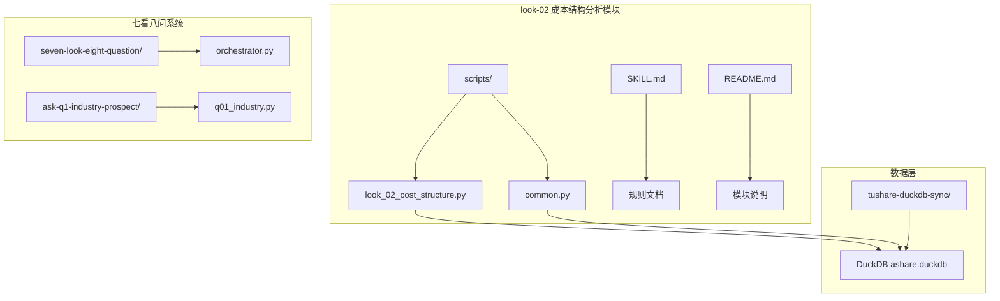
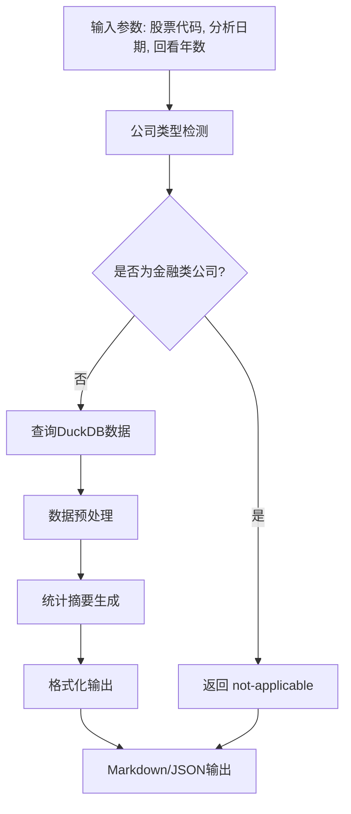
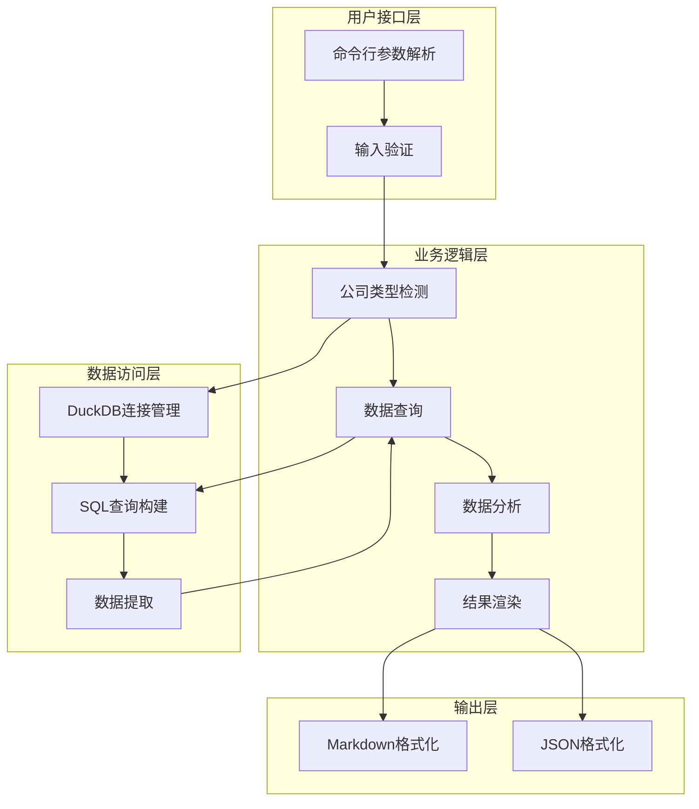
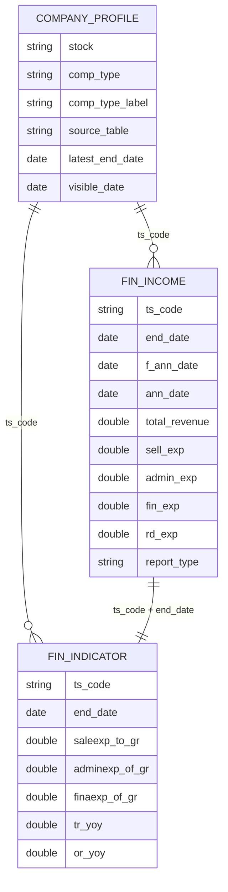
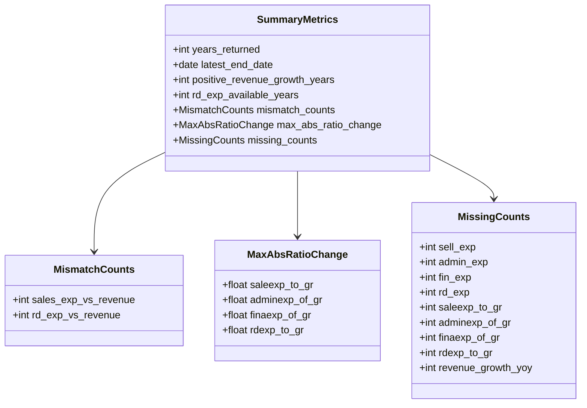
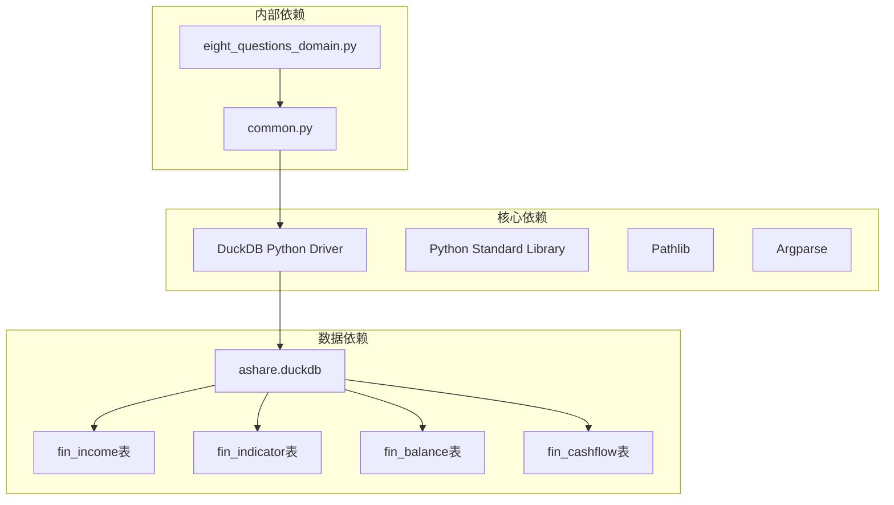
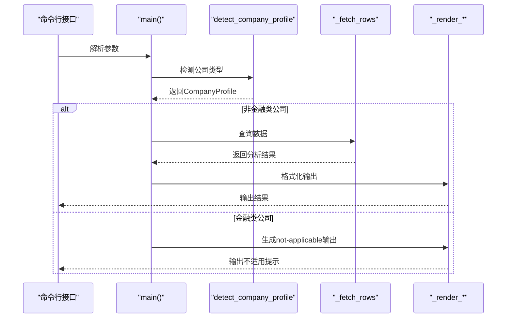

# 成本结构分析 (look-02)

<cite>
**本文档引用的文件**
- [look_02_cost_structure.py](file://2min-company-analysis/look-02-cost-structure/scripts/look_02_cost_structure.py)
- [common.py](file://2min-company-analysis/look-02-cost-structure/scripts/common.py)
- [SKILL.md](file://2min-company-analysis/look-02-cost-structure/SKILL.md)
- [README.md](file://2min-company-analysis/README.md)
- [eight_questions_domain.py](file://2min-company-analysis/seven-look-eight-question/scripts/eight_questions_domain.py)
- [table_metadata.md](file://tushare-duckdb-sync/templates/table_metadata.md)
- [mapping_registry.json](file://tushare-duckdb-sync/templates/mapping_registry.json)
</cite>

## 目录
1. [简介](#简介)
2. [项目结构](#项目结构)
3. [核心组件](#核心组件)
4. [架构概览](#架构概览)
5. [详细组件分析](#详细组件分析)
6. [依赖关系分析](#依赖关系分析)
7. [性能考虑](#性能考虑)
8. [故障排除指南](#故障排除指南)
9. [结论](#结论)

## 简介

look-02 成本结构分析模块是"七看八问"能力系统中的第二个规则模块，专门用于分析上市公司的费用成本结构。该模块通过DuckDB数据库进行时间序列分析，重点关注营业成本占营业收入比例的变化趋势，提供成本粘性分析、固定成本与变动成本识别逻辑，以及成本结构稳定性指标评估。

该模块的核心目标是稳定地产出四大费用率与业务增长匹配度的结构化证据，便于单独排查、迭代和实测。模块特别关注销售费用、管理费用、财务费用和研发费用的成本结构分析，并通过费用与业务增长的匹配度来识别潜在的经营问题。

## 项目结构

look-02 成本结构分析模块位于 `2min-company-analysis/look-02-cost-structure/` 目录下，采用标准的Python模块结构：



**图表来源**
- [look_02_cost_structure.py:1-50](file://2min-company-analysis/look-02-cost-structure/scripts/look_02_cost_structure.py#L1-L50)
- [common.py:1-30](file://2min-company-analysis/look-02-cost-structure/scripts/common.py#L1-L30)

**章节来源**
- [README.md:1-132](file://2min-company-analysis/README.md#L1-L132)
- [SKILL.md:1-64](file://2min-company-analysis/look-02-cost-structure/SKILL.md#L1-L64)

## 核心组件

### 主要功能组件

look-02 模块包含以下核心组件：

1. **查询执行器** (`_fetch_rows`): 负责从DuckDB数据库中提取成本结构相关数据
2. **数据预处理器** (`_build_summary`): 生成统计摘要和关键指标
3. **渲染器** (`_render_markdown`, `_render_json`): 将分析结果格式化输出
4. **公司类型检测器** (`detect_company_profile`): 识别公司类型并应用相应的分析规则
5. **数据库连接器** (`_connect`, `_default_db_path`): 管理DuckDB数据库连接

### 数据流处理



**图表来源**
- [look_02_cost_structure.py:461-494](file://2min-company-analysis/look-02-cost-structure/scripts/look_02_cost_structure.py#L461-L494)
- [common.py:82-153](file://2min-company-analysis/look-02-cost-structure/scripts/common.py#L82-L153)

**章节来源**
- [look_02_cost_structure.py:41-233](file://2min-company-analysis/look-02-cost-structure/scripts/look_02_cost_structure.py#L41-L233)
- [common.py:28-153](file://2min-company-analysis/look-02-cost-structure/scripts/common.py#L28-L153)

## 架构概览

### 整体架构设计



**图表来源**
- [look_02_cost_structure.py:461-494](file://2min-company-analysis/look-02-cost-structure/scripts/look_02_cost_structure.py#L461-L494)
- [common.py:76-153](file://2min-company-analysis/look-02-cost-structure/scripts/common.py#L76-L153)

### 数据模型关系



**图表来源**
- [look_02_cost_structure.py:47-233](file://2min-company-analysis/look-02-cost-structure/scripts/look_02_cost_structure.py#L47-L233)
- [common.py:82-153](file://2min-company-analysis/look-02-cost-structure/scripts/common.py#L82-L153)

## 详细组件分析

### 查询执行器组件

查询执行器是模块的核心，负责从DuckDB数据库中提取和处理成本结构相关数据。其主要功能包括：

#### 数据提取逻辑

查询执行器通过复杂的SQL查询从多个表中提取所需数据：

1. **收入数据提取** (`income_yearly` CTE): 从 `fin_income` 表提取年度收入数据
2. **指标数据去重** (`indicator_yearly_dedup` CTE): 从 `fin_indicator` 表提取年度指标数据
3. **历史数据整合** (`history` CTE): 将收入和指标数据进行关联
4. **窗口函数计算** (`prepared` CTE): 使用LAG函数计算前一年数据
5. **增长率计算** (`scored` CTE): 计算各项费用的增长率和变化量

#### 关键计算公式

模块实现了多种财务比率和增长率计算：

```mermaid
flowchart LR
A[原始数据] --> B[费用率计算]
B --> C[saleexp_to_gr = sell_exp/total_revenue × 100]
B --> D[adminexp_of_gr = admin_exp/total_revenue × 100]
B --> E[finaexp_of_gr = fin_exp/total_revenue × 100]
B --> F[rdexp_to_gr = rd_exp/total_revenue × 100]
A --> G[增长率计算]
G --> H[sell_exp_yoy = (sell_exp - prev_sell_exp)/|prev_sell_exp| × 100]
G --> I[admin_exp_yoy = (admin_exp - prev_admin_exp)/|prev_admin_exp| × 100]
G --> J[fin_exp_yoy = (fin_exp - prev_fin_exp)/|prev_fin_exp| × 100]
G --> K[rd_exp_yoy = (rd_exp - prev_rd_exp)/|prev_rd_exp| × 100]
A --> L[匹配度分析]
L --> M[sales_growth_mismatch = (sell_exp_yoy > 0 AND revenue_growth_yoy ≤ 0) ? TRUE : FALSE]
L --> N[rd_growth_mismatch = (rd_exp_yoy > 0 AND revenue_growth_yoy ≤ 0) ? TRUE : FALSE]
```

**图表来源**
- [look_02_cost_structure.py:112-192](file://2min-company-analysis/look_02-cost-structure/scripts/look_02_cost_structure.py#L112-L192)

#### 异常处理机制

查询执行器包含了完善的异常处理机制：

1. **空值处理**: 使用 `_is_missing` 函数检测和处理空值
2. **除零保护**: 在增长率计算中检查分母是否为零
3. **数据完整性**: 确保所有必要的字段都存在
4. **日期处理**: 使用 `_parse_date` 函数统一处理日期格式

**章节来源**
- [look_02_cost_structure.py:41-233](file://2min-company-analysis/look-02-cost-structure/scripts/look_02_cost_structure.py#L41-L233)

### 数据分析组件

数据分析组件负责生成统计摘要和关键指标，主要包括：

#### 统计指标计算



**图表来源**
- [look_02_cost_structure.py:258-302](file://2min-company-analysis/look-02-cost-structure/scripts/look_02_cost_structure.py#L258-L302)

#### 成本结构稳定性分析

模块提供了多种稳定性指标来评估成本结构的变化：

1. **最大绝对变化量** (`max_abs_ratio_change`): 检测费用率的最大波动幅度
2. **匹配度统计** (`mismatch_counts`): 统计费用增长与收入增长不匹配的年份数
3. **缺失数据统计** (`missing_counts`): 跟踪各字段的缺失情况

**章节来源**
- [look_02_cost_structure.py:258-302](file://2min-company-analysis/look-02-cost-structure/scripts/look_02_cost_structure.py#L258-L302)

### 渲染组件

渲染组件负责将分析结果格式化为用户友好的输出格式：

#### Markdown 输出格式

Markdown格式提供了详细的年度证据表格，包含以下字段：

- 年度财务数据：营业收入、各项费用原值
- 费用率指标：销售费用率、管理费用率、财务费用率、研发费用率
- 增长率指标：各项费用同比增长率、收入增长率
- 变化量指标：费用率年度变化量
- 匹配度信号：费用增长与收入增长不匹配的标记

#### JSON 输出格式

JSON格式提供了结构化的数据输出，便于程序化处理：

```json
{
    "rule_id": "look-02",
    "stock": "000001.SZ",
    "as_of_date": "2025-04-30",
    "lookback_years": 3,
    "company_profile": {
        "stock": "000001.SZ",
        "comp_type": "1",
        "comp_type_label": "一般工商业",
        "source_table": "fin_income",
        "latest_end_date": "2024-12-31",
        "visible_date": "2025-04-30",
        "is_financial": false
    },
    "report_type": "1",
    "annual_rule": {"month": 12, "day": 31},
    "expense_ratio_fields": ["saleexp_to_gr", "adminexp_of_gr", "finaexp_of_gr", "rdexp_to_gr"],
    "revenue_growth_field": "COALESCE(tr_yoy, or_yoy)",
    "summary": {
        "years_returned": 3,
        "latest_end_date": "2024-12-31",
        "positive_revenue_growth_years": 2,
        "rd_exp_available_years": 3,
        "mismatch_counts": {
            "sales_exp_vs_revenue": 1,
            "rd_exp_vs_revenue": 0
        },
        "max_abs_ratio_change": {
            "saleexp_to_gr": 2.34,
            "adminexp_of_gr": 1.56,
            "finaexp_of_gr": 0.89,
            "rdexp_to_gr": 3.21
        },
        "missing_counts": {
            "sell_exp": 0,
            "admin_exp": 0,
            "fin_exp": 0,
            "rd_exp": 0,
            "saleexp_to_gr": 0,
            "adminexp_of_gr": 0,
            "finaexp_of_gr": 0,
            "rdexp_to_gr": 0,
            "revenue_growth_yoy": 0
        }
    },
    "rows": []
}
```

**章节来源**
- [look_02_cost_structure.py:313-415](file://2min-company-analysis/look-02-cost-structure/scripts/look_02_cost_structure.py#L313-L415)

## 依赖关系分析

### 外部依赖



**图表来源**
- [look_02_cost_structure.py:10-16](file://2min-company-analysis/look-02-cost-structure/scripts/look_02_cost_structure.py#L10-L16)
- [common.py:8](file://2min-company-analysis/look-02-cost-structure/scripts/common.py#L8)

### 内部模块依赖



**图表来源**
- [look_02_cost_structure.py:461-494](file://2min-company-analysis/look-02-cost-structure/scripts/look_02_cost_structure.py#L461-L494)
- [common.py:82-153](file://2min-company-analysis/look-02-cost-structure/scripts/common.py#L82-L153)

**章节来源**
- [look_02_cost_structure.py:10-16](file://2min-company-analysis/look-02-cost-structure/scripts/look_02_cost_structure.py#L10-L16)
- [common.py:11-15](file://2min-company-analysis/look-02-cost-structure/scripts/common.py#L11-L15)

## 性能考虑

### 查询优化策略

1. **索引利用**: 查询中使用了适当的WHERE条件和ORDER BY子句，确保能够有效利用DuckDB的查询优化器
2. **窗口函数**: 使用LAG函数进行高效的时间序列计算，避免多次表扫描
3. **CTE分解**: 将复杂查询分解为多个CTE，提高查询的可读性和维护性
4. **数据类型优化**: 使用合适的DuckDB数据类型存储财务数据

### 内存使用优化

1. **流式处理**: 查询结果通过fetchall一次性获取，然后逐行处理
2. **数据类型转换**: 在Python层面进行必要的数据类型转换，减少数据库端的处理负担
3. **缓存策略**: 通过合理的参数传递避免重复计算

### 扩展性考虑

1. **参数化查询**: 所有动态参数都通过参数绑定传递，避免SQL注入风险
2. **错误处理**: 完善的异常处理机制确保系统在各种情况下都能稳定运行
3. **日志记录**: 通过标准输出提供基本的执行信息

## 故障排除指南

### 常见问题及解决方案

#### DuckDB连接失败

**问题症状**: 程序抛出文件不存在异常

**可能原因**:
1. DuckDB文件路径不正确
2. 数据库文件被删除或移动
3. 权限问题导致无法访问文件

**解决步骤**:
1. 验证数据库文件路径
2. 检查文件是否存在且可读
3. 确认DuckDB同步模块正常工作

#### 公司类型检测失败

**问题症状**: 返回未知公司类型或检测不到数据

**可能原因**:
1. 股票代码无效
2. 数据库中缺少相关记录
3. 报告类型或日期条件不匹配

**解决步骤**:
1. 验证股票代码格式
2. 检查数据库中是否存在对应记录
3. 调整分析日期参数

#### 数据缺失问题

**问题症状**: 某些字段显示为null或缺失

**可能原因**:
1. 数据源中缺少相应字段
2. 数据质量不佳
3. 报告披露不完整

**解决步骤**:
1. 检查数据源完整性
2. 查看缺失数据统计
3. 考虑使用其他数据源补充

**章节来源**
- [look_02_cost_structure.py:35-38](file://2min-company-analysis/look-02-cost-structure/scripts/look_02_cost_structure.py#L35-L38)
- [common.py:76-79](file://2min-company-analysis/look-02-cost-structure/scripts/common.py#L76-L79)

### 调试技巧

1. **逐步验证**: 从简单的查询开始，逐步增加复杂度
2. **参数检查**: 验证所有输入参数的有效性
3. **中间结果**: 检查CTE的中间结果以定位问题
4. **日志输出**: 利用标准输出查看执行过程

## 结论

look-02 成本结构分析模块是一个设计精良的财务分析工具，具有以下特点：

### 技术优势

1. **模块化设计**: 清晰的组件分离使得代码易于维护和扩展
2. **数据驱动**: 基于DuckDB的高效数据处理能力
3. **标准化输出**: 提供统一的Markdown和JSON输出格式
4. **完整性保障**: 完善的异常处理和数据验证机制

### 应用价值

1. **成本结构洞察**: 通过费用率分析揭示企业的成本结构特征
2. **增长匹配度评估**: 识别费用增长与收入增长的协调性
3. **异常检测**: 通过统计指标发现潜在的经营问题
4. **跨年度比较**: 提供时间序列分析能力

### 改进建议

1. **阈值设定**: 可以考虑引入行业基准阈值进行更精确的评估
2. **可视化支持**: 添加图表生成功能提升结果的可读性
3. **批量处理**: 支持多股票同时分析以提高效率
4. **实时监控**: 添加异常预警功能

该模块为财务分析师和投资者提供了强大的成本结构分析工具，通过科学的统计方法和严谨的数据处理流程，帮助用户深入理解企业的经营状况和成本控制能力。