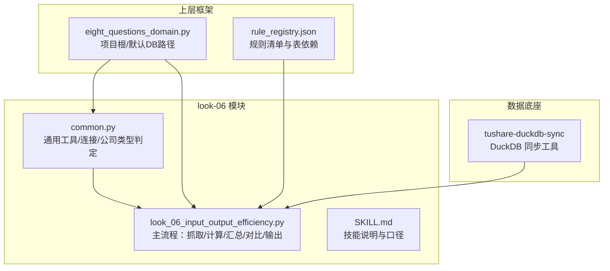
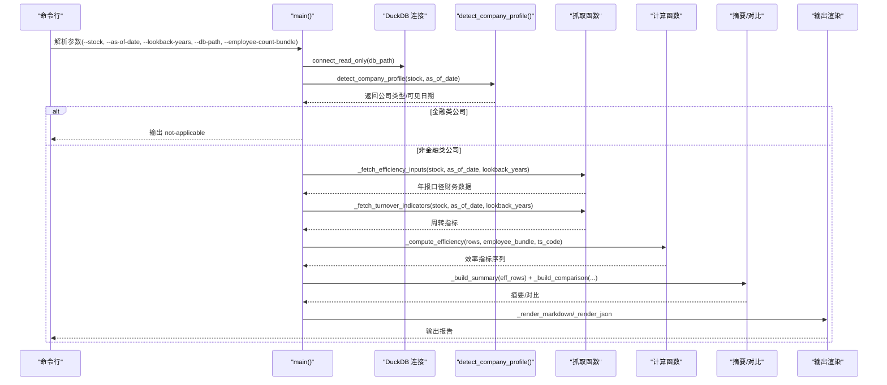
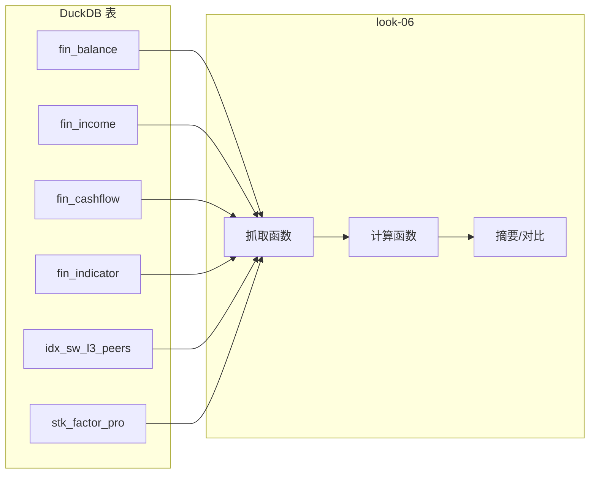

# 投入产出效率 (look-06)

<cite>
**本文引用的文件**
- [common.py](file://2min-company-analysis/look-06-input-output-efficiency/scripts/common.py)
- [look_06_input_output_efficiency.py](file://2min-company-analysis/look-06-input-output-efficiency/scripts/look_06_input_output_efficiency.py)
- [SKILL.md](file://2min-company-analysis/look-06-input-output-efficiency/SKILL.md)
- [README.md](file://2min-company-analysis/README.md)
- [eight_questions_domain.py](file://2min-company-analysis/seven-look-eight-question/scripts/eight_questions_domain.py)
- [rule_registry.json](file://2min-company-analysis/seven-look-eight-question/assets/rule_registry.json)
- [README.md](file://tushare-duckdb-sync/README.md)
- [table_metadata.md](file://tushare-duckdb-sync/templates/table_metadata.md)
</cite>

## 目录
1. [简介](#简介)
2. [项目结构](#项目结构)
3. [核心组件](#核心组件)
4. [架构总览](#架构总览)
5. [详细组件分析](#详细组件分析)
6. [依赖关系分析](#依赖关系分析)
7. [性能考量](#性能考量)
8. [故障排查指南](#故障排查指南)
9. [结论](#结论)
10. [附录](#附录)

## 简介
本文件为“投入产出效率分析”（look-06）模块的技术文档，系统阐述基于 DuckDB 的运营效率分析框架，重点覆盖：
- 资产使用效率评估：营运资金效率（WC/收入）、固定资产效率（固定资产/收入）、资产周转率（应收账款、固定资产、总资产、流动资产）等
- 投入产出比衡量：单位人力成本产出（收入/人力成本）、单位人力成本盈利（利润/人力成本）
- 人均投入产出：人均营收、人均利润、人均人力成本（需用户提供真实员工总数）
- 行业标杆对比：基于申万三级行业，选取市值最大公司作为对标
- 异常值检测与稳健性：缺失值处理、趋势判断、状态标注
- DuckDB 跨公司、跨行业对比与趋势跟踪：SQL 查询与跨表联结

本模块面向非金融类公司，金融类公司（银行/保险/证券）不适用。

## 项目结构
- look-06 模块位于 2min-company-analysis/look-06-input-output-efficiency，包含：
  - scripts/common.py：通用工具与 DuckDB 连接、公司类型判定、日期解析、连接器
  - scripts/look_06_input_output_efficiency.py：核心分析流程（数据抓取、指标计算、汇总、对比、输出）
  - SKILL.md：技能说明与口径文档
- 上层框架：
  - seven-look-eight-question/scripts/eight_questions_domain.py：项目根路径与 DuckDB 默认路径解析
  - seven-look-eight-question/assets/rule_registry.json：规则清单与表依赖
- 数据底座：
  - tushare-duckdb-sync：结构化财务/因子数据同步至 DuckDB

图表来源
- [common.py:62-68](file://2min-company-analysis/look-06-input-output-efficiency/scripts/common.py#L62-L68)
- [look_06_input_output_efficiency.py:739-852](file://2min-company-analysis/look-06-input-output-efficiency/scripts/look_06_input_output_efficiency.py#L739-L852)
- [eight_questions_domain.py:285-314](file://2min-company-analysis/seven-look-eight-question/scripts/eight_questions_domain.py#L285-L314)
- [rule_registry.json:155-190](file://2min-company-analysis/seven-look-eight-question/assets/rule_registry.json#L155-L190)
- [README.md:1-173](file://tushare-duckdb-sync/README.md#L1-L173)

章节来源
- [README.md:1-132](file://2min-company-analysis/README.md#L1-L132)
- [SKILL.md:1-136](file://2min-company-analysis/look-06-input-output-efficiency/SKILL.md#L1-L136)

## 核心组件
- 通用工具与 DuckDB 连接
  - 项目根路径与默认 DuckDB 路径解析
  - 只读连接 DuckDB
  - 日期解析与容错
  - 公司类型判定与金融类公司拦截
- 数据抓取
  - 年报口径：合并报表、年末（12月31日）、可见性约束
  - 营运资金组件：应收账款、存货、预付款项、应付账款、预收款项、合同负债
  - 资产与收入：固定资产、总资产、营业收入、归母净利润
  - 现金支付给职工薪酬（人力成本）
  - 辅助周转指标：应收账款周转率、固定资产周转率、总资产周转率、流动资产周转率
- 指标计算
  - 营运资金/收入：WC/收入
  - 固定资产/收入：固定资产/收入
  - 单位人力成本产出：收入/人力成本、利润/人力成本
  - 人均指标（需用户提供真实员工总数）：人均营收、人均利润、人均人力成本
  - 趋势判断：WC/收入趋势（改善/恶化/稳定/数据不足）
- 行业标杆对比
  - 基于申万三级行业，选取市值最大非自身公司作为标杆
  - 对标公司计算完全相同的效率指标
- 输出
  - Markdown/JSON 两种格式
  - 包含摘要、效率指标表、周转指标表、标杆对比、人类介入请求

章节来源
- [common.py:62-154](file://2min-company-analysis/look-06-input-output-efficiency/scripts/common.py#L62-L154)
- [look_06_input_output_efficiency.py:109-280](file://2min-company-analysis/look-06-input-output-efficiency/scripts/look_06_input_output_efficiency.py#L109-L280)
- [look_06_input_output_efficiency.py:385-560](file://2min-company-analysis/look-06-input-output-efficiency/scripts/look_06_input_output_efficiency.py#L385-L560)
- [look_06_input_output_efficiency.py:591-733](file://2min-company-analysis/look-06-input-output-efficiency/scripts/look_06_input_output_efficiency.py#L591-L733)
- [SKILL.md:42-104](file://2min-company-analysis/look-06-input-output-efficiency/SKILL.md#L42-L104)

## 架构总览
整体流程：参数解析 → DuckDB 连接 → 公司类型判定 → 数据抓取 → 指标计算 → 摘要构建 → 标杆对比 → 输出渲染

图表来源
- [look_06_input_output_efficiency.py:739-852](file://2min-company-analysis/look-06-input-output-efficiency/scripts/look_06_input_output_efficiency.py#L739-L852)
- [common.py:82-154](file://2min-company-analysis/look-06-input-output-efficiency/scripts/common.py#L82-L154)

## 详细组件分析

### 通用工具与 DuckDB 连接
- 项目根路径与默认 DuckDB 路径解析，便于在不同工作区定位数据文件
- 只读连接 DuckDB，避免意外修改
- 日期解析与容错，支持空日期默认为今日
- 公司类型判定：基于财务表可见日期与报告类型，自动识别公司类型并标注金融类公司警告

章节来源
- [common.py:62-154](file://2min-company-analysis/look-06-input-output-efficiency/scripts/common.py#L62-L154)

### 数据抓取与清洗
- 年报口径约束：仅取合并报表（report_type='1'），仅取年末（12月31日），仅取分析日之前可见的数据
- 营运资金组件：应收账款、存货、预付款项、应付账款、预收款项、合同负债
- 资产与收入：固定资产、总资产、营业收入、归母净利润
- 现金支付给职工薪酬：作为人力成本的现金流口径
- 辅助周转指标：应收账款周转率、固定资产周转率、总资产周转率、流动资产周转率
- 去重与排序：按可见日期与期末日期去重，保证最新可用数据优先

章节来源
- [look_06_input_output_efficiency.py:109-280](file://2min-company-analysis/look-06-input-output-efficiency/scripts/look_06_input_output_efficiency.py#L109-L280)

### 指标计算与异常值处理
- 营运资金/收入：WC = (应收账款 + 存货 + 预付款项 - 应付账款 - 预收款项 - 合同负债) / 营业收入
- 固定资产/收入：固定资产/营业收入
- 单位人力成本产出：收入/人力成本、利润/人力成本（仅用于衡量人力成本投入性价比）
- 人均指标（需用户提供真实员工总数）：人均营收、人均利润、人均人力成本
- 缺失值处理：NaN/None 统一视为缺失，避免除零与错误传播
- 趋势判断：基于最近与最早窗口的 WC/收入比值，设定阈值判断改善/恶化/稳定/数据不足

章节来源
- [look_06_input_output_efficiency.py:385-464](file://2min-company-analysis/look-06-input-output-efficiency/scripts/look_06_input_output_efficiency.py#L385-L464)
- [look_06_input_output_efficiency.py:470-532](file://2min-company-analysis/look-06-input-output-efficiency/scripts/look_06_input_output_efficiency.py#L470-L532)

### 行业标杆对比与跨公司对比
- 标杆选择：基于申万三级行业，选取市值最大非自身公司作为标杆
- 对标口径：对标杆公司执行完全相同的指标计算
- 输出：对比表与摘要，便于逐项分析优劣

章节来源
- [look_06_input_output_efficiency.py:286-352](file://2min-company-analysis/look-06-input-output-efficiency/scripts/look_06_input_output_efficiency.py#L286-L352)
- [look_06_input_output_efficiency.py:534-560](file://2min-company-analysis/look-06-input-output-efficiency/scripts/look_06_input_output_efficiency.py#L534-L560)

### 输出与人类介入
- Markdown/JSON 两种输出格式
- 人类介入请求：当人均指标缺失时，列出缺数年份并要求用户提供真实员工总数
- 状态标注：ready/partial/not-applicable/no-data

章节来源
- [look_06_input_output_efficiency.py:591-733](file://2min-company-analysis/look-06-input-output-efficiency/scripts/look_06_input_output_efficiency.py#L591-L733)
- [look_06_input_output_efficiency.py:818-847](file://2min-company-analysis/look-06-input-output-efficiency/scripts/look_06_input_output_efficiency.py#L818-L847)

## 依赖关系分析
- look-06 依赖 DuckDB 中的 fin_balance、fin_income、fin_cashflow、fin_indicator、idx_sw_l3_peers、stk_factor_pro 等表
- 与上层框架的集成：通过项目根路径解析与默认 DuckDB 路径，确保跨模块一致性
- 与规则体系的集成：在 rule_registry.json 中登记 look-06 的表依赖与派生指标

图表来源
- [rule_registry.json:155-190](file://2min-company-analysis/seven-look-eight-question/assets/rule_registry.json#L155-L190)
- [look_06_input_output_efficiency.py:109-280](file://2min-company-analysis/look-06-input-output-efficiency/scripts/look_06_input_output_efficiency.py#L109-L280)

章节来源
- [rule_registry.json:155-190](file://2min-company-analysis/seven-look-eight-question/assets/rule_registry.json#L155-L190)
- [eight_questions_domain.py:285-314](file://2min-company-analysis/seven-look-eight-question/scripts/eight_questions_domain.py#L285-L314)

## 性能考量
- DuckDB 查询优化
  - 年报口径限定：仅取年末与合并报表，减少无关记录
  - 去重与排序：ROW_NUMBER() 去重，按可见日期与期末日期排序，避免重复与过期数据
  - 参数化查询：使用参数绑定，提高缓存命中与执行计划复用
- I/O 与内存
  - 只读连接 DuckDB，避免写锁竞争
  - 逐表抓取与左连接，避免笛卡尔积
- 可扩展性
  - 通过 --lookback-years 控制回看窗口，平衡精度与性能
  - 通过 --employee-count-bundle 控制是否启用真实人均指标，避免不必要的二次抓取

[本节为通用性能讨论，不直接分析具体文件]

## 故障排查指南
- DuckDB 文件不存在
  - 现象：抛出文件未找到异常
  - 处理：确认 --db-path 指向正确的 DuckDB 文件，或使用默认路径
- 金融类公司
  - 现象：返回 not-applicable
  - 处理：金融类公司不适用本模块，需更换目标公司
- 缺少员工总数导致的人均指标缺失
  - 现象：per_capita_status 为 human-in-loop-required/partial
  - 处理：提供真实员工总数（来自年报“员工情况”章节在岗员工数合计），格式见 SKILL.md
- 数据不足
  - 现象：status=no-data 或 wc_trend=insufficient-data
  - 处理：扩大 --lookback-years 或检查数据同步状态
- 行业标杆缺失
  - 现象：benchmark: not available
  - 处理：确认 idx_sw_l3_peers 与 stk_factor_pro 是否存在且有数据

章节来源
- [common.py:76-79](file://2min-company-analysis/look-06-input-output-efficiency/scripts/common.py#L76-L79)
- [look_06_input_output_efficiency.py:777-800](file://2min-company-analysis/look-06-input-output-efficiency/scripts/look_06_input_output_efficiency.py#L777-L800)
- [SKILL.md:14-15](file://2min-company-analysis/look-06-input-output-efficiency/SKILL.md#L14-L15)

## 结论
- look-06 通过 DuckDB 实现对非金融类公司投入产出效率的结构化分析，覆盖营运资金效率、固定资产效率、单位人力成本产出与人均指标（需用户提供真实员工总数）
- 采用年报口径与可见性约束，确保分析数据的时效性与可靠性
- 通过行业标杆对比与趋势判断，帮助识别效率差异与优化方向
- 建议在使用时结合 tushare-duckdb-sync 完善数据底座，并在需要时提供真实员工总数以启用完整的人均指标

[本节为总结性内容，不直接分析具体文件]

## 附录

### 指标定义与计算公式
- 营运资金/收入
  - WC = (应收账款 + 存货 + 预付款项 - 应付账款 - 预收款项 - 合同负债) / 营业收入
- 固定资产/收入
  - 固定资产/营业收入
- 单位人力成本产出
  - 收入/人力成本、利润/人力成本
- 人均指标（需用户提供真实员工总数）
  - 人均营收 = 营业收入 / 员工总数
  - 人均利润 = 归母净利润 / 员工总数
  - 人均人力成本 = 人力成本 / 员工总数
- 趋势判断
  - 基于最近与最早窗口的 WC/收入比值，设定阈值判断改善/恶化/稳定/数据不足

章节来源
- [SKILL.md:42-75](file://2min-company-analysis/look-06-input-output-efficiency/SKILL.md#L42-L75)

### 数据处理流程（SQL 级）
- 年报口径筛选：report_type='1'，end_date 为 12 月 31 日，可见日期 ≤ as_of_date
- 去重策略：按 ts_code+end_date 分组，按可见日期降序取第一条
- 左连接：将资产负债表、利润表、现金流表与指标表按年份对齐
- 排序与限制：按 end_date 降序取前 N 年

章节来源
- [look_06_input_output_efficiency.py:116-227](file://2min-company-analysis/look-06-input-output-efficiency/scripts/look_06_input_output_efficiency.py#L116-L227)
- [look_06_input_output_efficiency.py:237-279](file://2min-company-analysis/look-06-input-output-efficiency/scripts/look_06_input_output_efficiency.py#L237-L279)

### 异常值检测方法
- 缺失值处理：NaN/None 统一视为缺失，避免参与计算
- 除零保护：分母为 0 或 None 时返回 None
- 趋势阈值：基于最近与最早窗口比值，设定 5% 上下浮动阈值判断趋势

章节来源
- [look_06_input_output_efficiency.py:25-39](file://2min-company-analysis/look-06-input-output-efficiency/scripts/look_06_input_output_efficiency.py#L25-L39)
- [look_06_input_output_efficiency.py:488-505](file://2min-company-analysis/look-06-input-output-efficiency/scripts/look_06_input_output_efficiency.py#L488-L505)

### DuckDB 跨公司、跨行业对比与趋势跟踪
- 跨公司对比：通过目标公司与标杆公司分别执行相同的抓取与计算流程，输出对比表
- 跨行业对比：基于 idx_sw_l3_peers 获取申万三级行业，按市值排序选择标杆
- 趋势跟踪：通过 --lookback-years 控制回看窗口，观察指标随时间的变化

章节来源
- [look_06_input_output_efficiency.py:286-352](file://2min-company-analysis/look-06-input-output-efficiency/scripts/look_06_input_output_efficiency.py#L286-L352)
- [look_06_input_output_efficiency.py:534-560](file://2min-company-analysis/look-06-input-output-efficiency/scripts/look_06_input_output_efficiency.py#L534-L560)

### 与上层框架与数据底座的关系
- 上层框架：通过项目根路径解析与默认 DuckDB 路径，确保模块间一致性
- 数据底座：tushare-duckdb-sync 将 Tushare 数据同步至 DuckDB，提供结构化财务/因子数据

章节来源
- [eight_questions_domain.py:285-314](file://2min-company-analysis/seven-look-eight-question/scripts/eight_questions_domain.py#L285-L314)
- [README.md:1-173](file://tushare-duckdb-sync/README.md#L1-L173)