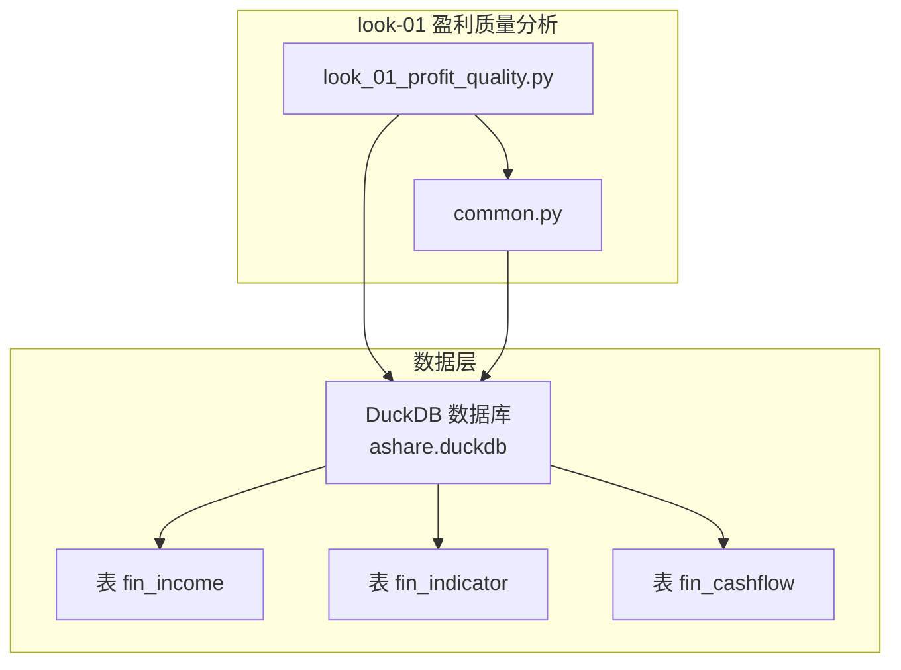
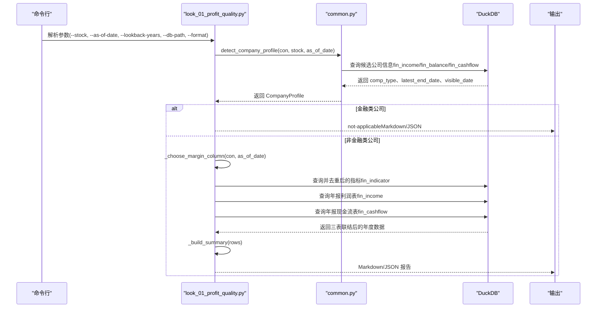
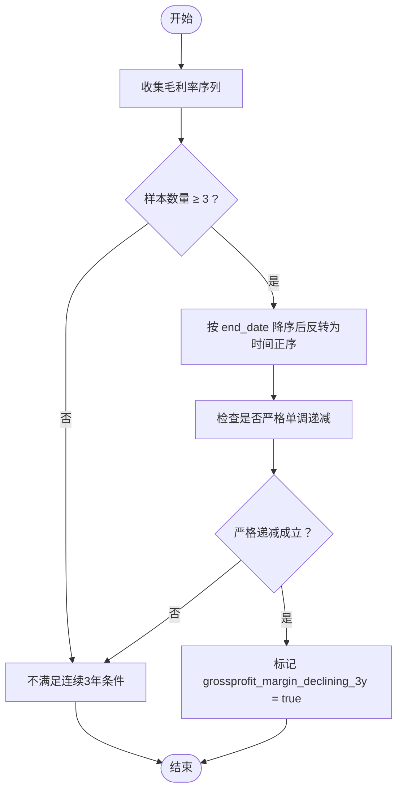
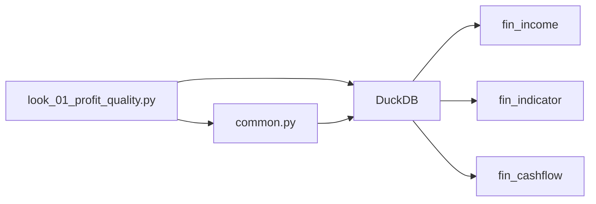

# 盈利质量分析 (look-01)

<cite>
**本文引用的文件**
- [look_01_profit_quality.py](file://2min-company-analysis/look-01-profit-quality/scripts/look_01_profit_quality.py)
- [common.py](file://2min-company-analysis/look-01-profit-quality/scripts/common.py)
- [SKILL.md](file://2min-company-analysis/look-01-profit-quality/SKILL.md)
- [README.md](file://2min-company-analysis/README.md)
- [README.md](file://tushare-duckdb-sync/README.md)
</cite>

## 目录
1. [简介](#简介)
2. [项目结构](#项目结构)
3. [核心组件](#核心组件)
4. [架构总览](#架构总览)
5. [详细组件分析](#详细组件分析)
6. [依赖关系分析](#依赖关系分析)
7. [性能考量](#性能考量)
8. [故障排查指南](#故障排查指南)
9. [结论](#结论)
10. [附录](#附录)

## 简介
本技术文档围绕“盈利质量分析（look-01）”展开，系统阐述其核心理念与实现：通过多维度指标评估公司盈利质量的真实性和可持续性。重点包括：
- 净利润现金比率（OCF/归母净利润）的计算逻辑与判断标准
- 自由现金流（FCF）的财务意义与计算方法
- 毛利率趋势分析的算法实现，特别是严格单调递减的判定条件
- 毛利质量体检的指标体系（利润剔除质量、经营性现金流、自由现金流等）
- 从 DuckDB 中提取与处理财务数据的 SQL 查询思路与数据流
- 异常信号识别与风险提示，帮助用户理解盈利质量的财务含义

## 项目结构
look-01 盈利质量分析位于“七看八问”能力模块中，作为独立的规则 skill 运行。其主要文件与职责如下：
- scripts/look_01_profit_quality.py：规则主程序，负责连接 DuckDB、选择合适净利率字段、拼接财务数据、构建摘要与证据表，并输出 Markdown/JSON。
- scripts/common.py：公司类型检测与通用连接、日期解析、数据库连接等共享逻辑。
- SKILL.md：规则口径、证据清单、执行说明与输出要求。
- README.md（2min-company-analysis）：模块定位、适用范围、使用路径与与其他子模块的关系。
- README.md（tushare-duckdb-sync）：数据来源与同步工具说明，确保 DuckDB 中存在 fin_income、fin_indicator、fin_cashflow 等表。

图表来源
- [look_01_profit_quality.py:75-78](file://2min-company-analysis/look-01-profit-quality/scripts/look_01_profit_quality.py#L75-L78)
- [common.py:76-79](file://2min-company-analysis/look-01-profit-quality/scripts/common.py#L76-L79)

章节来源
- [README.md:1-132](file://2min-company-analysis/README.md#L1-L132)
- [SKILL.md:1-69](file://2min-company-analysis/look-01-profit-quality/SKILL.md#L1-L69)

## 核心组件
- 公司类型检测与前置过滤：根据 comp_type 判断是否为金融类公司，若是则直接返回 not-applicable。
- 净利率字段选择策略：优先使用 netprofit_margin，若覆盖率更差则回退至 profit_to_gr；行级缺失时允许 fallback。
- 年报数据抽取与去重：仅取 report_type='1' 的合并报表，end_date 为每年 12 月 31 日，基于可见性日期（COALESCE(f_ann_date, ann_date, end_date) ≤ as_of_date）筛选。
- 关键派生指标计算：净利润现金比率（OCF/归母净利润）、自由现金流（FCF）。
- 摘要统计：扣非利润为正年数、经营现金流为正年数、FCF 为正年数、净利润现金比率均值与低于 1 的年数、毛利率严格单调下降（≥3 年）标志。
- 输出：Markdown/JSON 两种格式，包含数据质量摘要、逐年证据表、缺失统计与摘要指标。

章节来源
- [look_01_profit_quality.py:82-123](file://2min-company-analysis/look-01-profit-quality/scripts/look_01_profit_quality.py#L82-L123)
- [look_01_profit_quality.py:126-287](file://2min-company-analysis/look-01-profit-quality/scripts/look_01_profit_quality.py#L126-L287)
- [look_01_profit_quality.py:312-378](file://2min-company-analysis/look-01-profit-quality/scripts/look_01_profit_quality.py#L312-L378)
- [common.py:82-153](file://2min-company-analysis/look-01-profit-quality/scripts/common.py#L82-L153)

## 架构总览
下图展示了从 DuckDB 读取财务数据到生成盈利质量分析报告的整体流程。

图表来源
- [look_01_profit_quality.py:553-583](file://2min-company-analysis/look-01-profit-quality/scripts/look_01_profit_quality.py#L553-L583)
- [common.py:82-153](file://2min-company-analysis/look-01-profit-quality/scripts/common.py#L82-L153)

## 详细组件分析

### 净利润现金比率（OCF/归母净利润）
- 定义与计算：净利润现金比率 = 经营活动产生的现金流量净额（n_cashflow_act）/ 归属于母公司股东的净利润（n_income_attr_p）。
- 计算逻辑要点：
  - 仅在归母净利润为正的年份纳入计算，亏损年份无经济含义。
  - 汇总时计算平均值与低于 1 的年数，用于衡量“账面利润落地为现金”的程度。
- 判断标准：
  - 理想值 ≥ 1，表示利润质量较好；持续低于 1 可能意味着利润含金量不足或存在应计费用、资产减值等非现金消耗。
- 实现位置与参考路径：
  - 净现比计算与汇总逻辑见 [look_01_profit_quality.py:230-239](file://2min-company-analysis/look-01-profit-quality/scripts/look_01_profit_quality.py#L230-L239) 与 [look_01_profit_quality.py:324-337](file://2min-company-analysis/look-01-profit-quality/scripts/look_01_profit_quality.py#L324-L337)。

章节来源
- [look_01_profit_quality.py:230-239](file://2min-company-analysis/look-01-profit-quality/scripts/look_01_profit_quality.py#L230-L239)
- [look_01_profit_quality.py:324-337](file://2min-company-analysis/look-01-profit-quality/scripts/look_01_profit_quality.py#L324-L337)
- [SKILL.md:35-36](file://2min-company-analysis/look-01-profit-quality/SKILL.md#L35-L36)

### 自由现金流（FCF）
- 定义与计算：自由现金流 = 经营活动产生的现金流量净额（n_cashflow_act）− 购建固定资产、无形资产和其他长期资产支付的现金（c_pay_acq_const_fiolta）。
- 财务意义：
  - FCF 反映公司在满足再投资需求后可自由支配的现金流，是衡量企业真实盈利能力与自由度的关键指标。
  - 持续为正且增长，通常表明公司具备较强的内生增长能力和抗风险能力。
- 实现位置与参考路径：
  - FCF 计算与汇总逻辑见 [look_01_profit_quality.py:235-239](file://2min-company-analysis/look-01-profit-quality/scripts/look_01_profit_quality.py#L235-L239) 与 [look_01_profit_quality.py:339-339](file://2min-company-analysis/look-01-profit-quality/scripts/look_01_profit_quality.py#L339-L339)。

章节来源
- [look_01_profit_quality.py:235-239](file://2min-company-analysis/look-01-profit-quality/scripts/look_01_profit_quality.py#L235-L239)
- [look_01_profit_quality.py:339-339](file://2min-company-analysis/look-01-profit-quality/scripts/look_01_profit_quality.py#L339-L339)
- [SKILL.md:36-37](file://2min-company-analysis/look-01-profit-quality/SKILL.md#L36-L37)

### 毛利率趋势分析（严格单调递减）
- 目标：判断毛利率是否呈现严格单调下降趋势，作为“毛利质量体检”的一项关键信号。
- 算法实现：
  - 将数据按 end_date 降序排列，反转后得到时间正序序列。
  - 若序列长度 ≥ 3，且相邻元素满足 a > b（严格单调递减），则标记为“连续 3 年下滑”。
- 判定条件：
  - 至少 3 个非空正值样本；严格单调递减（最老 > 中间 > 最新）。
- 实现位置与参考路径：
  - 毛利率趋势判定逻辑见 [look_01_profit_quality.py:341-353](file://2min-company-analysis/look-01-profit-quality/scripts/look_01_profit_quality.py#L341-L353)。

图表来源
- [look_01_profit_quality.py:341-353](file://2min-company-analysis/look-01-profit-quality/scripts/look_01_profit_quality.py#L341-L353)

章节来源
- [look_01_profit_quality.py:341-353](file://2min-company-analysis/look-01-profit-quality/scripts/look_01_profit_quality.py#L341-L353)
- [SKILL.md:37-38](file://2min-company-analysis/look-01-profit-quality/SKILL.md#L37-L38)

### 毛利质量体检指标体系
- 利润剔除质量：关注扣除非经常性损益后的利润（profit_dedt）是否为正，体现主营业务的持续盈利能力。
- 经营性现金流：n_cashflow_act 是否为正，反映主营业务的现金生成能力。
- 自由现金流：FCF 是否为正，体现企业在维持再投资后的自由现金流状况。
- 净利润现金比率：平均值与低于 1 的年数，衡量利润转化为现金的质量。
- 毛利率趋势：严格单调递减（≥3 年）可能预示产品竞争力下降或定价权弱化。
- 实现位置与参考路径：
  - 摘要统计与指标计算见 [look_01_profit_quality.py:312-378](file://2min-company-analysis/look-01-profit-quality/scripts/look_01_profit_quality.py#L312-L378)。

章节来源
- [look_01_profit_quality.py:312-378](file://2min-company-analysis/look-01-profit-quality/scripts/look_01_profit_quality.py#L312-L378)
- [SKILL.md:40-46](file://2min-company-analysis/look-01-profit-quality/SKILL.md#L40-L46)

### DuckDB 数据提取与处理流程
- 数据来源：DuckDB 中的 fin_income（利润表）、fin_indicator（财务指标）、fin_cashflow（现金流表）。
- 年报口径：仅取 report_type='1' 的合并报表，end_date 为每年 12 月 31 日。
- 可见性控制：使用 COALESCE(f_ann_date, ann_date, end_date) ≤ as_of_date，确保分析使用“截至某日已公开”的数据。
- 去重策略：对 fin_indicator 按 end_date 分组，使用 COALESCE(ann_date_key, ann_date, end_date) 与 ann_date 排序去重，保留最新披露版本。
- 关键派生指标：在 SQL 中直接计算净利润现金比率与 FCF，并按 end_date 降序返回最近 N 年数据。
- 实现位置与参考路径：
  - 年报数据抽取与派生指标计算见 [look_01_profit_quality.py:126-287](file://2min-company-analysis/look-01-profit-quality/scripts/look_01_profit_quality.py#L126-L287)。
  - 公司类型检测与可见性日期控制见 [common.py:82-153](file://2min-company-analysis/look-01-profit-quality/scripts/common.py#L82-L153)。

章节来源
- [look_01_profit_quality.py:126-287](file://2min-company-analysis/look-01-profit-quality/scripts/look_01_profit_quality.py#L126-L287)
- [common.py:82-153](file://2min-company-analysis/look-01-profit-quality/scripts/common.py#L82-L153)
- [SKILL.md:27-34](file://2min-company-analysis/look-01-profit-quality/SKILL.md#L27-L34)

### SQL 查询示例（概念性说明）
以下为从 DuckDB 中提取与处理财务数据的概念性 SQL 流程（不直接展示具体代码内容）：
- 选择净利率字段：优先使用 netprofit_margin，若缺失则回退至 profit_to_gr；行级缺失时允许 fallback。
- 年报过滤：report_type='1'，end_date 为每年 12 月 31 日，可见性日期 ≤ as_of_date。
- 去重：按 ts_code、end_date 分组，使用 COALESCE(ann_date_key, ann_date, end_date) 与 ann_date 排序去重。
- 派生指标：计算净利润现金比率（OCF/归母净利润）与自由现金流（FCF）。
- 排序与限制：按 end_date 降序，返回最近 N 年数据。

章节来源
- [look_01_profit_quality.py:82-123](file://2min-company-analysis/look-01-profit-quality/scripts/look_01_profit_quality.py#L82-L123)
- [look_01_profit_quality.py:126-287](file://2min-company-analysis/look-01-profit-quality/scripts/look_01_profit_quality.py#L126-L287)

### 输出与可视化
- Markdown 输出：包含数据质量摘要、逐年证据表、缺失统计与摘要指标，便于人工核查与进一步分析。
- JSON 输出：结构化数据，便于下游系统集成与自动化处理。
- 实现位置与参考路径：
  - Markdown 渲染见 [look_01_profit_quality.py:389-474](file://2min-company-analysis/look-01-profit-quality/scripts/look_01_profit_quality.py#L389-L474)。
  - JSON 渲染见 [look_01_profit_quality.py:477-507](file://2min-company-analysis/look-01-profit-quality/scripts/look_01_profit_quality.py#L477-L507)。

章节来源
- [look_01_profit_quality.py:389-474](file://2min-company-analysis/look-01-profit-quality/scripts/look_01_profit_quality.py#L389-L474)
- [look_01_profit_quality.py:477-507](file://2min-company-analysis/look-01-profit-quality/scripts/look_01_profit_quality.py#L477-L507)

## 依赖关系分析
- 组件耦合与内聚：
  - look_01_profit_quality.py 与 common.py 通过 CompanyProfile 与 detect_company_profile 解耦公司类型检测逻辑。
  - SQL 查询集中在单文件中，便于复核与审计。
- 外部依赖：
  - DuckDB：作为数据存储与查询引擎。
  - tushare-duckdb-sync：提供结构化财务数据的同步与质量保障。
- 潜在循环依赖：未发现循环依赖。
- 接口契约：
  - 输入：股票代码、分析日期、回看年数、DuckDB 路径、输出格式。
  - 输出：Markdown/JSON 报告，包含数据质量摘要、逐年证据表、缺失统计与摘要指标。

图表来源
- [look_01_profit_quality.py:75-78](file://2min-company-analysis/look-01-profit-quality/scripts/look_01_profit_quality.py#L75-L78)
- [common.py:76-79](file://2min-company-analysis/look-01-profit-quality/scripts/common.py#L76-L79)

章节来源
- [look_01_profit_quality.py:553-583](file://2min-company-analysis/look-01-profit-quality/scripts/look_01_profit_quality.py#L553-L583)
- [common.py:82-153](file://2min-company-analysis/look-01-profit-quality/scripts/common.py#L82-L153)

## 性能考量
- DuckDB 查询优化：
  - 使用 CTE 与窗口函数进行去重与排序，减少中间结果集大小。
  - 通过 WHERE 子句提前过滤（report_type、end_date、可见性日期）以缩小扫描范围。
- I/O 与内存：
  - 仅在必要列上进行计算与投影，避免不必要的列加载。
  - 输出前进行序列化与格式化，注意大样本下的内存占用。
- 可扩展性：
  - 通过参数化（stock、as_of_date、lookback_years）支持不同规模与时间跨度的分析。
  - JSON 输出便于与下游系统对接，支持批量处理与自动化集成。

## 故障排查指南
- 数据库连接失败：
  - 确认 DuckDB 文件路径存在且可读；默认路径为项目根目录下的 data/ashare.duckdb。
  - 参考路径：[look_01_profit_quality.py:75-78](file://2min-company-analysis/look-01-profit-quality/scripts/look_01_profit_quality.py#L75-L78)、[common.py:76-79](file://2min-company-analysis/look-01-profit-quality/scripts/common.py#L76-L79)。
- 金融类公司不适用：
  - 若 comp_type 属于银行、保险、证券，系统将直接返回 not-applicable。
  - 参考路径：[common.py:38-39](file://2min-company-analysis/look-01-profit-quality/scripts/common.py#L38-L39)、[look_01_profit_quality.py:570-575](file://2min-company-analysis/look-01-profit-quality/scripts/look_01_profit_quality.py#L570-L575)。
- 净利率字段缺失：
  - 若 netprofit_margin 覆盖率更差，系统会回退至 profit_to_gr；请检查数据质量。
  - 参考路径：[look_01_profit_quality.py:108-123](file://2min-company-analysis/look-01-profit-quality/scripts/look_01_profit_quality.py#L108-L123)。
- 毛利率趋势判定：
  - 仅在样本数 ≥ 3 且严格单调递减时标记为“连续 3 年下滑”。
  - 参考路径：[look_01_profit_quality.py:341-353](file://2min-company-analysis/look-01-profit-quality/scripts/look_01_profit_quality.py#L341-L353)。
- 净利润现金比率异常：
  - 仅在归母净利润为正的年份纳入计算；亏损年份不计入平均。
  - 参考路径：[look_01_profit_quality.py:324-337](file://2min-company-analysis/look-01-profit-quality/scripts/look_01_profit_quality.py#L324-L337)。

章节来源
- [look_01_profit_quality.py:75-78](file://2min-company-analysis/look-01-profit-quality/scripts/look_01_profit_quality.py#L75-L78)
- [common.py:38-39](file://2min-company-analysis/look-01-profit-quality/scripts/common.py#L38-L39)
- [look_01_profit_quality.py:108-123](file://2min-company-analysis/look-01-profit-quality/scripts/look_01_profit_quality.py#L108-L123)
- [look_01_profit_quality.py:341-353](file://2min-company-analysis/look-01-profit-quality/scripts/look_01_profit_quality.py#L341-L353)
- [look_01_profit_quality.py:324-337](file://2min-company-analysis/look-01-profit-quality/scripts/look_01_profit_quality.py#L324-L337)

## 结论
look-01 盈利质量分析通过严谨的数据口径与多维指标组合，系统性地评估公司盈利质量的真实性和可持续性。其核心在于：
- 以“已公开”数据为基准，确保分析的时效性与客观性；
- 以净利润现金比率与自由现金流为核心抓手，衡量利润转化为现金的能力；
- 以毛利率严格单调递减作为毛利质量体检的警示信号；
- 以结构化输出支撑人工核查与自动化集成。

对于金融类公司，系统明确不适用，避免口径不匹配导致的误判。建议在实际应用中结合行业背景与外部证据，进行综合判断。

## 附录
- 使用路径与参数：
  - 单独执行：参考 [README.md:80-86](file://2min-company-analysis/README.md#L80-L86)。
  - 总编排执行：参考 [README.md:62-78](file://2min-company-analysis/README.md#L62-L78)。
- 数据来源与同步：
  - DuckDB 数据同步与质量检查：参考 [README.md:1-173](file://tushare-duckdb-sync/README.md#L1-L173)。
- 规则口径与证据清单：
  - 参考 [SKILL.md:27-63](file://2min-company-analysis/look-01-profit-quality/SKILL.md#L27-L63)。