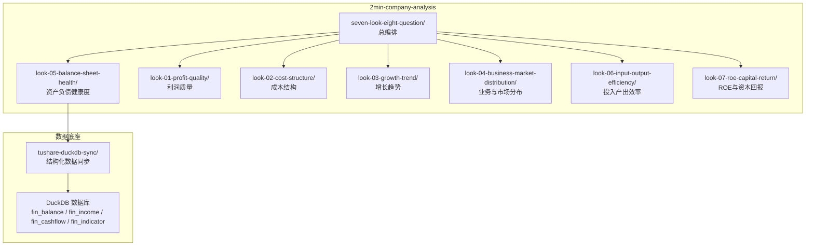
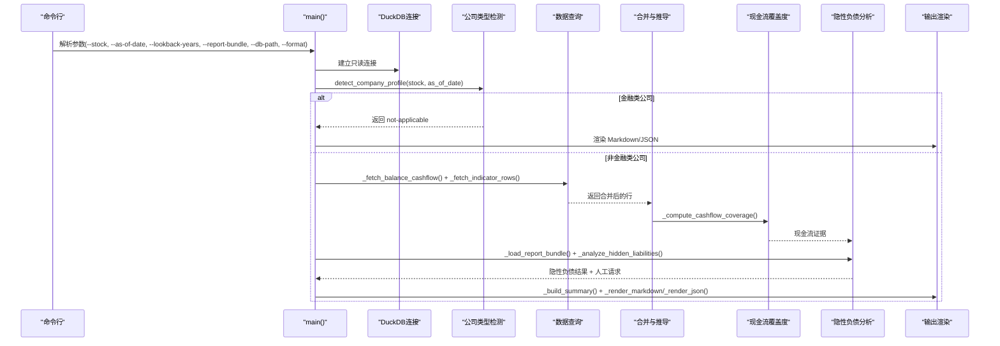
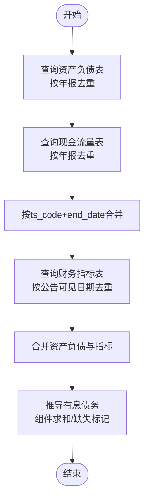
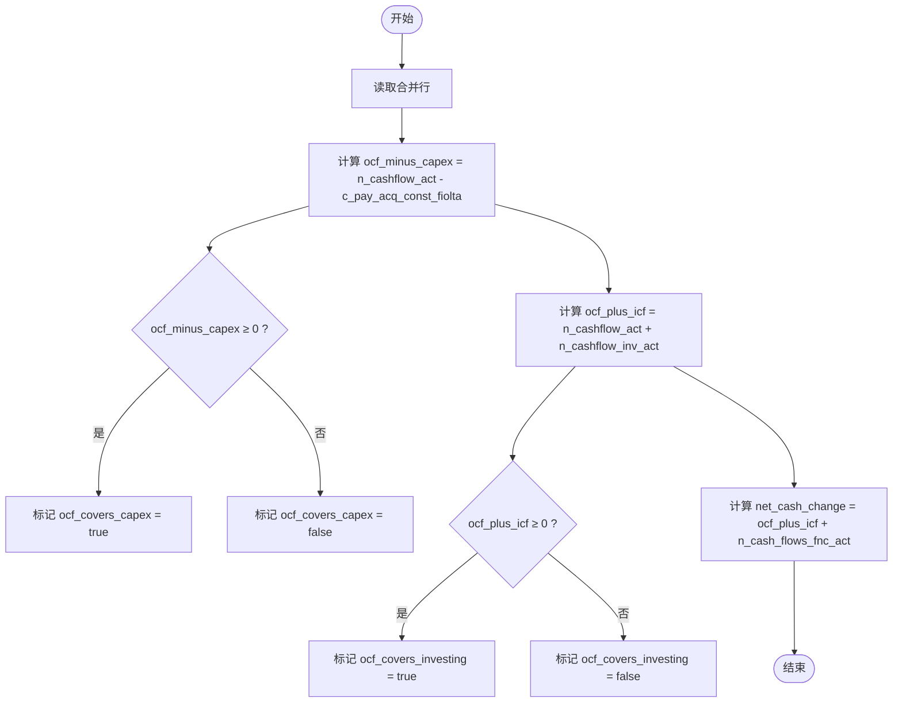
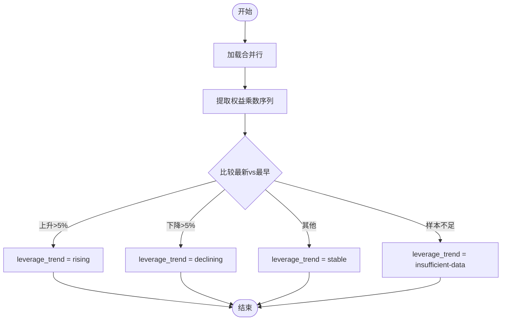
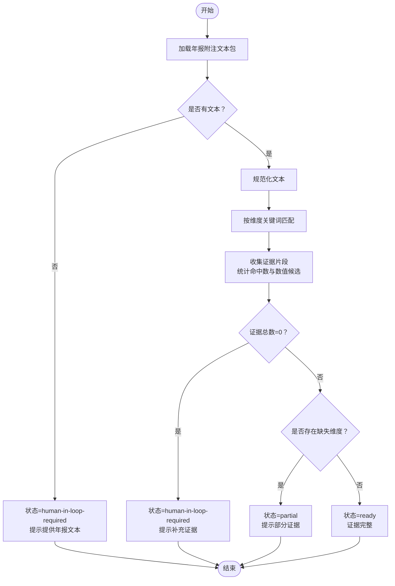
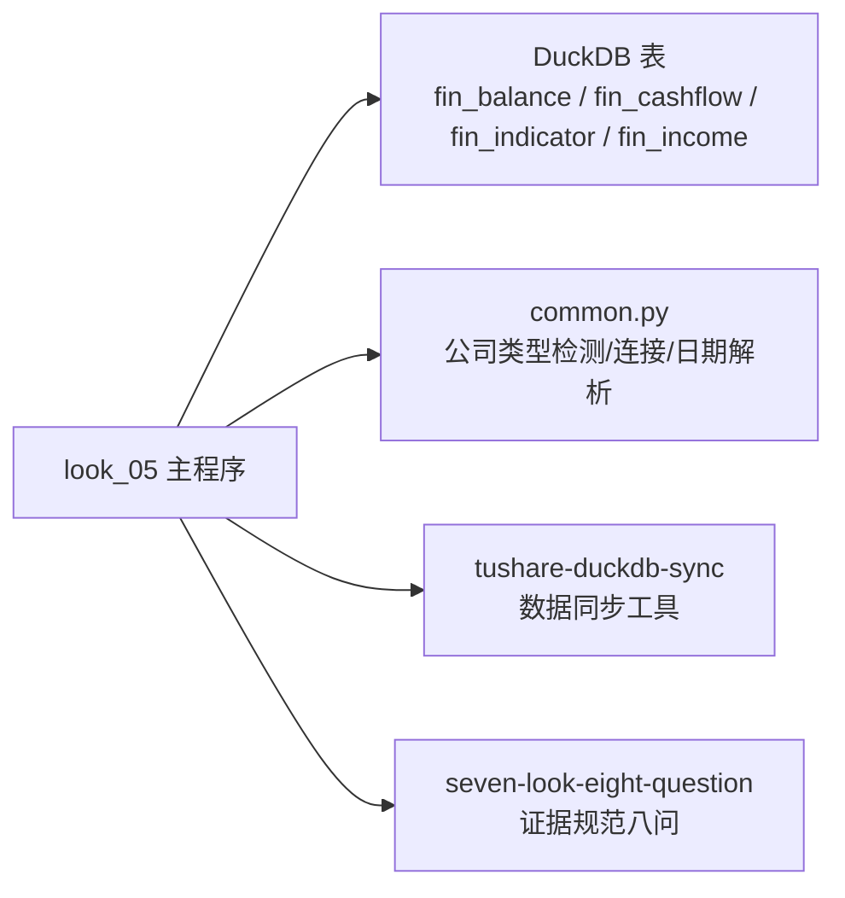

# 资产负债分析（look-05）

<cite>
**本文引用的文件**
- [look_05_balance_sheet_health.py](file://2min-company-analysis/look-05-balance-sheet-health/scripts/look_05_balance_sheet_health.py)
- [common.py](file://2min-company-analysis/look-05-balance-sheet-health/scripts/common.py)
- [SKILL.md](file://2min-company-analysis/look-05-balance-sheet-health/SKILL.md)
- [README.md](file://2min-company-analysis/README.md)
- [eight_questions_domain.py](file://2min-company-analysis/seven-look-eight-question/scripts/eight_questions_domain.py)
- [README.md](file://tushare-duckdb-sync/README.md)
</cite>

## 目录
1. [简介](#简介)
2. [项目结构](#项目结构)
3. [核心组件](#核心组件)
4. [架构概览](#架构概览)
5. [详细组件分析](#详细组件分析)
6. [依赖分析](#依赖分析)
7. [性能考虑](#性能考虑)
8. [故障排除指南](#故障排除指南)
9. [结论](#结论)
10. [附录](#附录)

## 简介
本文件为资产负债分析模块（look-05）的详细技术文档，基于仓库中的实现代码进行系统化梳理。该模块专注于评估企业的财务稳健性，围绕资产负债率、流动比率等关键偿债能力指标展开，同时结合现金流覆盖度、有息负债水平、杠杆趋势以及隐性负债识别等维度，构建一套面向A股非金融类公司的资产负债健康度分析框架。

本模块的核心价值在于：
- 以DuckDB为数据底座，通过SQL查询整合资产负债表、利润表、现金流量表与财务指标表，形成结构化证据链
- 采用自动化与人工协作相结合的方式，既保证客观指标的可复核性，又能在年报附注层面挖掘隐性负债证据
- 提供时间序列分析能力，识别杠杆趋势与流动性风险信号，辅助动态监测与预警

## 项目结构
look-05位于“七看八问”能力体系中的“七看”系列，作为独立规则模块与其他规则并行工作。其目录组织遵循“按规则功能划分”的原则，便于单独迭代与实测。

图表来源
- [README.md:29-56](file://2min-company-analysis/README.md#L29-L56)
- [README.md:1-12](file://tushare-duckdb-sync/README.md#L1-L12)

章节来源
- [README.md:1-132](file://2min-company-analysis/README.md#L1-L132)

## 核心组件
- 数据访问与合并
  - 从资产负债表、现金流量表与财务指标表中抽取年报口径数据，按报告期末去重并合并
  - 自动推导有息债务（当指标表未直接提供时，基于资产负债表组件求和）
- 现金流覆盖度分析
  - 计算经营现金流、投资现金流、筹资现金流的合计与差额，评估对资本支出与整体现金流变动的覆盖能力
  - 识别“自有现金流覆盖资本支出”的年度样本
- 偿债能力与杠杆趋势
  - 偿债能力指标：流动比率、速动比率、现金比率、资产负债率、权益乘数、利息保障倍数
  - 杠杆趋势：通过“权益乘数”（资产/净资产）的时间序列变化判断上升、下降或稳定
- 隐性负债证据提取
  - 基于关键词匹配策略，从年报附注文本中提取对外担保、或有事项、表外安排、售后回租、应收账款转让、明股实债等证据
  - 生成“人工介入请求”，指导用户补充缺失证据
- 输出与状态管理
  - 提供Markdown与JSON两种输出格式，包含摘要、证据表、隐性负债证据与人工请求
  - 根据数据完整性与人工证据情况，自动判定状态（ready/partial/human-in-loop-required/no-data/not-applicable）

章节来源
- [look_05_balance_sheet_health.py:108-220](file://2min-company-analysis/look-05-balance-sheet-health/scripts/look_05_balance_sheet_health.py#L108-L220)
- [look_05_balance_sheet_health.py:222-299](file://2min-company-analysis/look-05-balance-sheet-health/scripts/look_05_balance_sheet_health.py#L222-L299)
- [look_05_balance_sheet_health.py:302-340](file://2min-company-analysis/look-05-balance-sheet-health/scripts/look_05_balance_sheet_health.py#L302-L340)
- [look_05_balance_sheet_health.py:347-383](file://2min-company-analysis/look-05-balance-sheet-health/scripts/look_05_balance_sheet_health.py#L347-L383)
- [look_05_balance_sheet_health.py:526-605](file://2min-company-analysis/look-05-balance-sheet-health/scripts/look_05_balance_sheet_health.py#L526-L605)
- [look_05_balance_sheet_health.py:662-764](file://2min-company-analysis/look-05-balance-sheet-health/scripts/look_05_balance_sheet_health.py#L662-L764)
- [look_05_balance_sheet_health.py:803-882](file://2min-company-analysis/look-05-balance-sheet-health/scripts/look_05_balance_sheet_health.py#L803-L882)

## 架构概览
look-05的整体执行流程如下：解析输入参数 → 连接DuckDB → 检测公司类型（金融类不适用）→ 查询资产负债与指标数据 → 合并与推导有息债务 → 计算现金流覆盖度 → 隐性负债证据提取 → 生成摘要与输出。

图表来源
- [look_05_balance_sheet_health.py:803-882](file://2min-company-analysis/look-05-balance-sheet-health/scripts/look_05_balance_sheet_health.py#L803-L882)
- [look_05_balance_sheet_health.py:826-862](file://2min-company-analysis/look-05-balance-sheet-health/scripts/look_05_balance_sheet_health.py#L826-L862)
- [common.py:82-153](file://2min-company-analysis/look-05-balance-sheet-health/scripts/common.py#L82-L153)

## 详细组件分析

### 数据查询与合并
- 资产负债与现金流查询
  - 限定合并报表（report_type='1'），仅取年报（end_date为12月31日）
  - 以“公告可见日期”为过滤条件，确保分析日之前的公开数据
  - 将资产负债表与现金流量表按报告期合并，去除重复记录
- 指标查询
  - 从财务指标表中提取偿债能力、现金流质量、杠杆等指标
  - 对重复记录按公告可见日期排序去重
- 有息债务推导
  - 当指标表未提供interestdebt时，基于短期借款、长期借款、应付债券、租赁负债等资产负债表组件求和
  - 记录推导状态与缺失组件清单，便于后续人工核查

图表来源
- [look_05_balance_sheet_health.py:108-220](file://2min-company-analysis/look-05-balance-sheet-health/scripts/look_05_balance_sheet_health.py#L108-L220)
- [look_05_balance_sheet_health.py:222-299](file://2min-company-analysis/look-05-balance-sheet-health/scripts/look_05_balance_sheet_health.py#L222-L299)
- [look_05_balance_sheet_health.py:302-340](file://2min-company-analysis/look-05-balance-sheet-health/scripts/look_05_balance_sheet_health.py#L302-L340)

章节来源
- [look_05_balance_sheet_health.py:108-220](file://2min-company-analysis/look-05-balance-sheet-health/scripts/look_05_balance_sheet_health.py#L108-L220)
- [look_05_balance_sheet_health.py:222-299](file://2min-company-analysis/look-05-balance-sheet-health/scripts/look_05_balance_sheet_health.py#L222-L299)
- [look_05_balance_sheet_health.py:302-340](file://2min-company-analysis/look-05-balance-sheet-health/scripts/look_05_balance_sheet_health.py#L302-L340)

### 现金流覆盖度分析
- 指标定义
  - 经营现金流净额（n_cashflow_act）
  - 投资活动现金流净额（n_cashflow_inv_act）
  - 筹资活动现金流净额（n_cash_flows_fnc_act）
  - 自由现金流（free_cashflow）
  - 资本支出（c_pay_acq_const_fiolta）
  - 自由现金流覆盖度：ocf_minus_capex = n_cashflow_act - c_pay_acq_const_fiolta；若≥0标记为“覆盖”
  - 经营现金流对投资的覆盖：ocf_plus_icf = n_cashflow_act + n_cashflow_inv_act；若≥0标记为“覆盖”
  - 经营现金流对全部活动的覆盖：net_cash_change = ocf_plus_icf + n_cash_flows_fnc_act
- 统计摘要
  - 计算正向覆盖的年份数与样本数，用于趋势与稳定性评估

图表来源
- [look_05_balance_sheet_health.py:347-383](file://2min-company-analysis/look-05-balance-sheet-health/scripts/look_05_balance_sheet_health.py#L347-L383)

章节来源
- [look_05_balance_sheet_health.py:347-383](file://2min-company-analysis/look-05-balance-sheet-health/scripts/look_05_balance_sheet_health.py#L347-L383)

### 偿债能力与杠杆趋势
- 偿债能力指标
  - 流动比率 = 流动资产 / 流动负债
  - 速动比率 = （流动资产 - 存货）/ 流动负债
  - 现金比率 = （货币资金 + 交易性金融资产）/ 流动负债
  - 资产负债率 = 总负债 / 总资产
  - 权益乘数 = 总资产 / 归属于母公司股东的权益
  - 利息保障倍数 = 息税前利润 / 利息费用
- 现金流质量指标
  - 现金流量债务比 = 经营活动现金流净额 / 总负债
  - 现金流量短期债务比 = 经营活动现金流净额 / 流动负债
  - 现金流量利息债务比 = 经营活动现金流净额 / 利息债务
- 杠杆趋势判断
  - 基于“权益乘数”（资产/净资产）的时间序列，若最新值较最早值增长超过5%，判定为“上升”；下降超过5%为“下降”；否则为“稳定”；样本不足时为“数据不足”

图表来源
- [look_05_balance_sheet_health.py:558-575](file://2min-company-analysis/look-05-balance-sheet-health/scripts/look_05_balance_sheet_health.py#L558-L575)

章节来源
- [look_05_balance_sheet_health.py:558-575](file://2min-company-analysis/look-05-balance-sheet-health/scripts/look_05_balance_sheet_health.py#L558-L575)

### 隐性负债证据提取
- 关键词维度
  - 对外担保、担保余额、担保总额、被担保方
  - 或有事项、或有负债、潜在义务、未决诉讼、未决仲裁
  - 表外安排、表外融资、表外业务
  - 售后回租、融资租赁
  - 应收账款转让、保理、出表、应收票据贴现、应收账款融资
  - 明股实债、有限合伙、SPV、结构化主体、特殊目的实体
- 文本处理与证据收集
  - 规范化文本（去除多余空白、全角转半角）
  - 基于关键词的滑动窗口匹配，提取上下文片段
  - 统计命中关键词数量与数值候选（百分比、金额单位）
- 状态与人工请求
  - 未提供年报文本：提示“需要人工介入”
  - 提供文本但未匹配到证据：提示“部分维度缺失”
  - 完整匹配：状态“就绪”
  - 生成针对缺失维度的人工请求，指导补充年报附注相关内容

图表来源
- [look_05_balance_sheet_health.py:398-423](file://2min-company-analysis/look-05-balance-sheet-health/scripts/look_05_balance_sheet_health.py#L398-L423)
- [look_05_balance_sheet_health.py:430-467](file://2min-company-analysis/look-05-balance-sheet-health/scripts/look_05_balance_sheet_health.py#L430-L467)
- [look_05_balance_sheet_health.py:470-519](file://2min-company-analysis/look-05-balance-sheet-health/scripts/look_05_balance_sheet_health.py#L470-L519)
- [look_05_balance_sheet_health.py:612-631](file://2min-company-analysis/look-05-balance-sheet-health/scripts/look_05_balance_sheet_health.py#L612-L631)

章节来源
- [look_05_balance_sheet_health.py:398-423](file://2min-company-analysis/look-05-balance-sheet-health/scripts/look_05_balance_sheet_health.py#L398-L423)
- [look_05_balance_sheet_health.py:430-467](file://2min-company-analysis/look-05-balance-sheet-health/scripts/look_05_balance_sheet_health.py#L430-L467)
- [look_05_balance_sheet_health.py:470-519](file://2min-company-analysis/look-05-balance-sheet-health/scripts/look_05_balance_sheet_health.py#L470-L519)
- [look_05_balance_sheet_health.py:612-631](file://2min-company-analysis/look-05-balance-sheet-health/scripts/look_05_balance_sheet_health.py#L612-L631)

### 输出与状态管理
- 输出格式
  - Markdown：包含摘要、现金流覆盖表、债务与偿债能力表、隐性负债证据、人工请求
  - JSON：包含状态、公司画像、摘要、证据行、隐性负债分析、人工请求
- 状态判定
  - 金融类公司：not-applicable
  - 无数据：no-data
  - 有数据但缺少关键指标：partial
  - 有数据且指标完整：ready
  - 缺少年报附注证据：human-in-loop-required

章节来源
- [look_05_balance_sheet_health.py:662-764](file://2min-company-analysis/look-05-balance-sheet-health/scripts/look_05_balance_sheet_health.py#L662-L764)
- [look_05_balance_sheet_health.py:767-796](file://2min-company-analysis/look-05-balance-sheet-health/scripts/look_05_balance_sheet_health.py#L767-L796)
- [look_05_balance_sheet_health.py:829-851](file://2min-company-analysis/look-05-balance-sheet-health/scripts/look_05_balance_sheet_health.py#L829-L851)

## 依赖分析
- DuckDB与数据表
  - fin_balance：资产负债表（合并报表、年报口径）
  - fin_cashflow：现金流量表（合并报表、年报口径）
  - fin_indicator：财务指标表（合并报表、年报口径）
  - fin_income：利润表（合并报表、年报口径）
- 外部依赖
  - tushare-duckdb-sync：结构化数据同步工具，提供上述表的本地DuckDB镜像
  - seven-look-eight-question：总编排模块，提供证据规范与权重体系（用于八问模块，但对look-05的证据来源与格式无直接影响）
- 内部依赖
  - common.py：公司类型检测、数据库连接、日期解析等通用工具

图表来源
- [look_05_balance_sheet_health.py:13-16](file://2min-company-analysis/look-05-balance-sheet-health/scripts/look_05_balance_sheet_health.py#L13-L16)
- [common.py:11-15](file://2min-company-analysis/look-05-balance-sheet-health/scripts/common.py#L11-L15)
- [README.md:1-12](file://tushare-duckdb-sync/README.md#L1-L12)

章节来源
- [look_05_balance_sheet_health.py:13-16](file://2min-company-analysis/look-05-balance-sheet-health/scripts/look_05_balance_sheet_health.py#L13-L16)
- [common.py:11-15](file://2min-company-analysis/look-05-balance-sheet-health/scripts/common.py#L11-L15)
- [README.md:1-12](file://tushare-duckdb-sync/README.md#L1-L12)

## 性能考虑
- DuckDB查询优化
  - 使用CROSS JOIN params与ROW_NUMBER去重，减少重复扫描
  - 仅选择年报口径（end_date为12月31日），限制数据规模
  - 以公告可见日期过滤，避免跨期数据干扰
- 内存与IO
  - 采用只读连接，避免写操作带来的锁竞争
  - 合并与推导在内存中完成，建议控制回看年数与样本量
- 可扩展性
  - 隐性负债关键词匹配为O(N)文本扫描，建议对大文本分段处理或引入更高效的NLP工具
  - 可考虑将关键词匹配结果缓存，减少重复计算

## 故障排除指南
- DuckDB文件不存在
  - 现象：抛出文件未找到异常
  - 处理：确认--db-path指向正确的DuckDB文件，或使用默认路径
- 金融类公司不适用
  - 现象：返回not-applicable并提示原因
  - 处理：金融类公司（银行/保险/证券）不在本规则适用范围内
- 无数据或数据不足
  - 现象：状态为no-data或partial
  - 处理：检查股票代码、分析日期与回看年数；确认DuckDB中是否存在对应年报数据
- 隐性负债证据缺失
  - 现象：状态为human-in-loop-required或partial
  - 处理：提供年报附注文本包（JSON格式），包含ts_code、year、text字段；补充缺失维度的证据
- 输出格式问题
  - 现象：Markdown/JSON输出不符合预期
  - 处理：确认--format参数为markdown或json；检查输出路径与权限

章节来源
- [look_05_balance_sheet_health.py:88-91](file://2min-company-analysis/look-05-balance-sheet-health/scripts/look_05_balance_sheet_health.py#L88-L91)
- [look_05_balance_sheet_health.py:829-851](file://2min-company-analysis/look-05-balance-sheet-health/scripts/look_05_balance_sheet_health.py#L829-L851)
- [look_05_balance_sheet_health.py:840-851](file://2min-company-analysis/look-05-balance-sheet-health/scripts/look_05_balance_sheet_health.py#L840-L851)

## 结论
look-05通过结构化数据与非结构化证据的结合，构建了覆盖偿债能力、现金流质量、杠杆趋势与隐性负债识别的资产负债健康度分析框架。其以DuckDB为数据底座，具备良好的可复核性与可扩展性，适合在总编排模块中与其他规则协同工作，形成全面的财务质量体检。

## 附录

### 财务比率计算方法与行业对比标准
- 偿债能力指标
  - 流动比率：衡量短期偿债能力，通常行业区间差异较大，建议结合行业均值与趋势分析
  - 速动比率：剔除存货后的短期偿债能力，更严格
  - 现金比率：仅以货币资金与交易性金融资产衡量，最保守
  - 资产负债率：衡量长期偿债能力与财务风险，不同行业合理区间差异显著
  - 权益乘数：衡量财务杠杆程度，与ROE分解密切相关
  - 利息保障倍数：衡量盈利能力对利息费用的覆盖能力
- 现金流质量指标
  - 现金流量债务比、现金流量短期债务比、现金流量利息债务比：衡量经营活动现金流对各类债务的覆盖能力
- 行业对比与时间序列
  - 建议结合行业基准（如申万一级/二级行业）进行横向对比
  - 时间序列分析可用于识别杠杆趋势（上升/下降/稳定/数据不足），并结合ROE分解进行驱动因素分析

章节来源
- [SKILL.md:29-42](file://2min-company-analysis/look-05-balance-sheet-health/SKILL.md#L29-L42)
- [look_05_balance_sheet_health.py:558-575](file://2min-company-analysis/look-05-balance-sheet-health/scripts/look_05_balance_sheet_health.py#L558-L575)

### 利润质量与ROE分解的关联
- ROE驱动因素
  - 杜邦分解：ROE = 净利润率 × 总资产周转 × 权益乘数
  - 驱动类型：杠杆驱动、盈利驱动、周转驱动
  - 与look-05的衔接：关注资产负债率与权益乘数的变化趋势，结合现金流覆盖度评估财务稳健性

章节来源
- [look_07_roe_capital_return.py:18-23](file://2min-company-analysis/look-07-roe-capital-return/scripts/look_07_roe_capital_return.py#L18-L23)

### 隐性负债识别与预警机制
- 关键词匹配策略
  - 多维度关键词集合，覆盖对外担保、或有事项、表外安排、售后回租、应收账款转让、明股实债等
  - 滑动窗口提取上下文，统计命中数与数值候选，提升证据可信度
- 预警机制
  - 状态分级：ready/partial/human-in-loop-required/no-data/not-applicable
  - 人工请求：针对缺失维度生成具体补充请求，指导用户完善年报附注证据
  - 与总编排模块的证据规范对接，确保来源标注与权重一致

章节来源
- [look_05_balance_sheet_health.py:470-519](file://2min-company-analysis/look-05-balance-sheet-health/scripts/look_05_balance_sheet_health.py#L470-L519)
- [look_05_balance_sheet_health.py:612-631](file://2min-company-analysis/look-05-balance-sheet-health/scripts/look_05_balance_sheet_health.py#L612-L631)
- [eight_questions_domain.py:26-56](file://2min-company-analysis/seven-look-eight-question/scripts/eight_questions_domain.py#L26-L56)

### DuckDB动态监测与风险评估实践
- 数据准备
  - 使用tushare-duckdb-sync同步结构化财务数据至本地DuckDB
  - 确保fin_balance、fin_cashflow、fin_indicator、fin_income等表的完整性与时效性
- 动态监测
  - 定期运行look-05，观察杠杆趋势、现金流覆盖度与隐性负债证据状态变化
  - 结合行业政策与外部证据（如公告、研报、IR纪要）进行交叉验证
- 风险评估
  - 将look-05输出纳入总编排模块的综合评分与预警体系
  - 对状态为partial或human-in-loop-required的样本，建立跟踪与回访机制

章节来源
- [README.md:1-12](file://tushare-duckdb-sync/README.md#L1-L12)
- [README.md:103-132](file://2min-company-analysis/README.md#L103-L132)