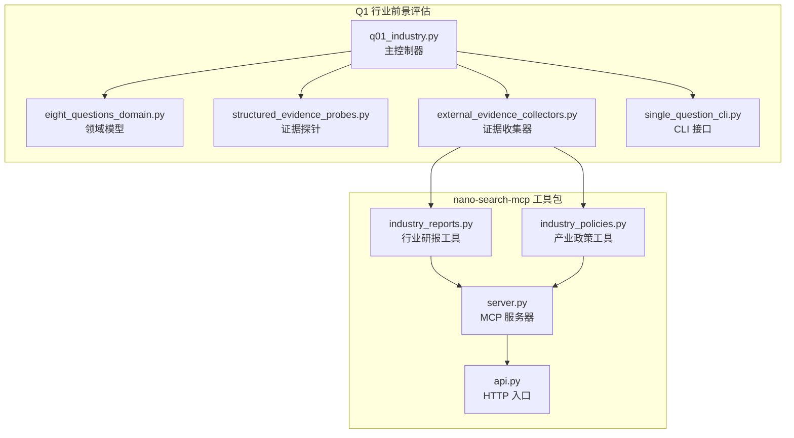
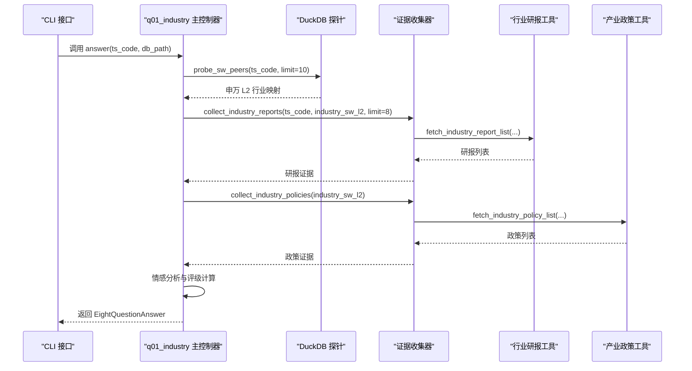
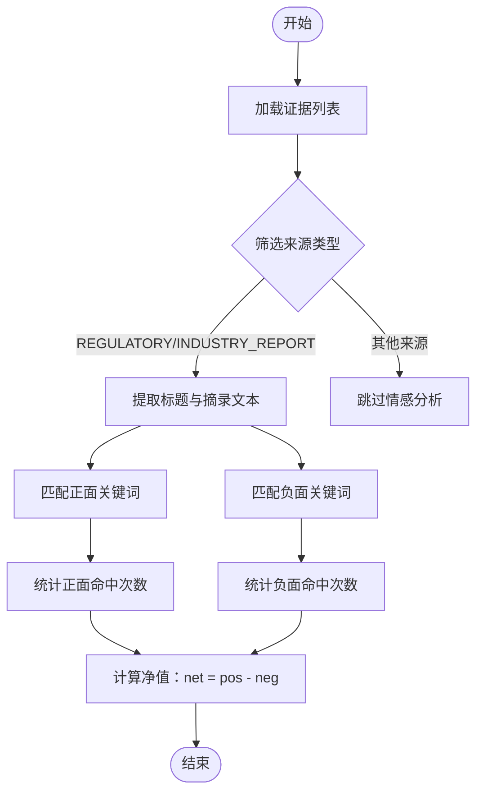
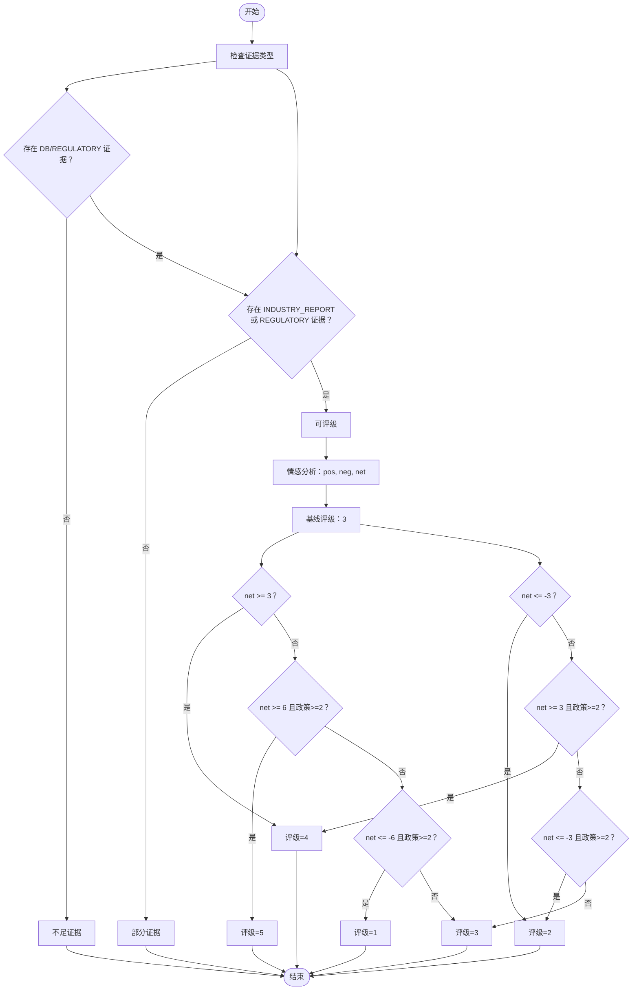
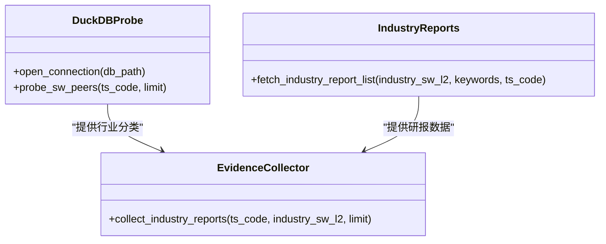
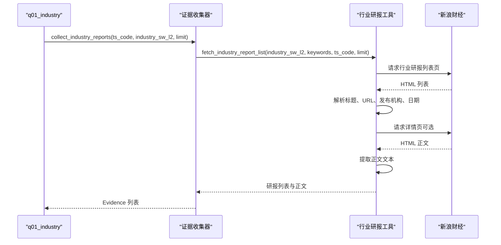
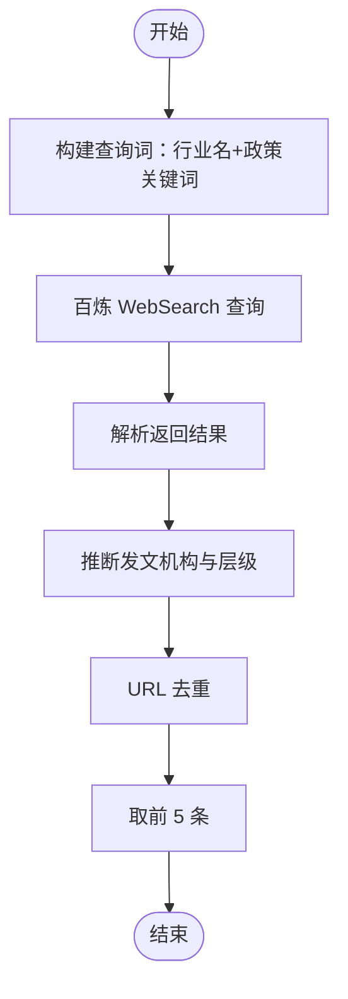
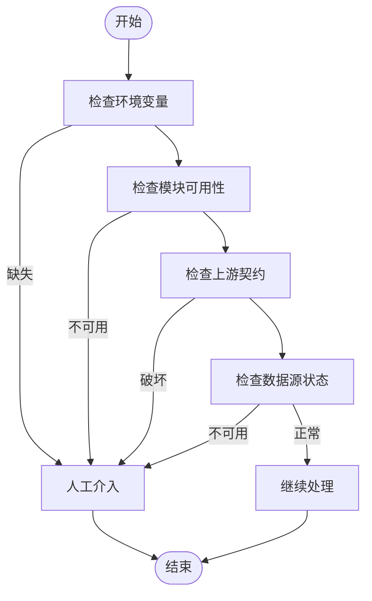
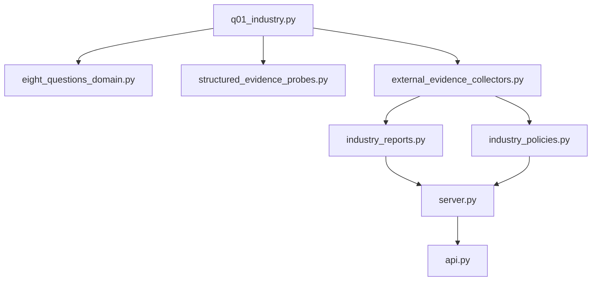

# Q1 行业前景评估

<cite>
**本文档引用的文件**
- [q01_industry.py](file://2min-company-analysis/ask-q1-industry-prospect/scripts/q01_industry.py)
- [eight_questions_domain.py](file://2min-company-analysis/seven-look-eight-question/scripts/eight_questions_domain.py)
- [structured_evidence_probes.py](file://2min-company-analysis/seven-look-eight-question/scripts/structured_evidence_probes.py)
- [external_evidence_collectors.py](file://2min-company-analysis/seven-look-eight-question/scripts/external_evidence_collectors.py)
- [single_question_cli.py](file://2min-company-analysis/seven-look-eight-question/scripts/single_question_cli.py)
- [industry_reports.py](file://nano-search-mcp/src/nano_search_mcp/tools/industry_reports.py)
- [industry_policies.py](file://nano-search-mcp/src/nano_search_mcp/tools/industry_policies.py)
- [sina_reports.py](file://nano-search-mcp/src/nano_search_mcp/tools/sina_reports.py)
- [server.py](file://nano-search-mcp/src/nano_search_mcp/server.py)
- [api.py](file://nano-search-mcp/src/nano_search_mcp/api.py)
</cite>

## 目录
1. [简介](#简介)
2. [项目结构](#项目结构)
3. [核心组件](#核心组件)
4. [架构概览](#架构概览)
5. [详细组件分析](#详细组件分析)
6. [依赖关系分析](#依赖关系分析)
7. [性能考虑](#性能考虑)
8. [故障排除指南](#故障排除指南)
9. [结论](#结论)
10. [附录](#附录)

## 简介
本文件为 Q1 行业前景评估模块的技术文档，深入解释了行业前景评估的设计理念、证据收集策略、申万行业分类体系应用、行业研报获取流程、产业政策分析方法、情感分析算法实现细节、评级计算公式与信号强度判断机制，以及证据质量评估标准和人类在环路触发条件。文档还提供了实际代码示例路径和最佳实践指导，帮助读者快速理解并部署该模块。

## 项目结构
Q1 行业前景评估模块位于 `2min-company-analysis/ask-q1-industry-prospect/scripts/` 目录下，主要文件为 `q01_industry.py`。该模块通过统一的证据收集框架 `external_evidence_collectors.py` 调用 `nano-search-mcp` 工具包，实现行业研报和产业政策的自动化采集，并结合本地 DuckDB 数据库进行申万行业分类映射。

**图表来源**
- [q01_industry.py:1-157](file://2min-company-analysis/ask-q1-industry-prospect/scripts/q01_industry.py#L1-L157)
- [external_evidence_collectors.py:1-524](file://2min-company-analysis/seven-look-eight-question/scripts/external_evidence_collectors.py#L1-L524)
- [industry_reports.py:1-495](file://nano-search-mcp/src/nano_search_mcp/tools/industry_reports.py#L1-L495)
- [industry_policies.py:1-246](file://nano-search-mcp/src/nano_search_mcp/tools/industry_policies.py#L1-L246)
- [server.py:1-91](file://nano-search-mcp/src/nano_search_mcp/server.py#L1-L91)
- [api.py:1-12](file://nano-search-mcp/src/nano_search_mcp/api.py#L1-L12)

**章节来源**
- [q01_industry.py:1-157](file://2min-company-analysis/ask-q1-industry-prospect/scripts/q01_industry.py#L1-L157)
- [external_evidence_collectors.py:1-524](file://2min-company-analysis/seven-look-eight-question/scripts/external_evidence_collectors.py#L1-L524)

## 核心组件
本模块的核心组件包括：
- **主控制器**：负责证据收集、情感分析、评级计算与状态管理
- **证据收集器**：封装 `nano-search-mcp` 工具，统一返回结构
- **领域模型**：定义证据类型、权重、评级状态等
- **证据探针**：从 DuckDB 获取申万行业分类映射
- **CLI 接口**：提供命令行运行与输出渲染

关键职责分配：
- 证据收集：通过 `collect_industry_reports` 和 `collect_industry_policies` 获取研报与政策
- 事实映射：通过 `probe_sw_peers` 获取申万 L2 行业分类
- 情感分析：基于关键词匹配计算正负情绪得分
- 评级计算：根据情感得分与证据数量动态调整评级

**章节来源**
- [q01_industry.py:52-147](file://2min-company-analysis/ask-q1-industry-prospect/scripts/q01_industry.py#L52-L147)
- [external_evidence_collectors.py:269-523](file://2min-company-analysis/seven-look-eight-question/scripts/external_evidence_collectors.py#L269-L523)
- [structured_evidence_probes.py:246-271](file://2min-company-analysis/seven-look-eight-question/scripts/structured_evidence_probes.py#L246-L271)
- [eight_questions_domain.py:26-120](file://2min-company-analysis/seven-look-eight-question/scripts/eight_questions_domain.py#L26-L120)

## 架构概览
Q1 行业前景评估采用“证据驱动”的架构设计，遵循以下原则：
- **证据来源分类**：事实（PRIMARY/REGULATORY/DB）、观点（INDUSTRY_REPORT）、新闻（NEWS）、IR（IR_MEETING）
- **统一证据模型**：所有证据必须包含来源类型、URL、获取时间、摘录与标题
- **权重与置信度**：不同来源具有不同权重，最终评级通过加权平均体现置信度
- **人类在环路**：当环境变量缺失、模块不可用或上游契约破坏时，自动触发人工介入

**图表来源**
- [q01_industry.py:52-147](file://2min-company-analysis/ask-q1-industry-prospect/scripts/q01_industry.py#L52-L147)
- [external_evidence_collectors.py:269-523](file://2min-company-analysis/seven-look-eight-question/scripts/external_evidence_collectors.py#L269-L523)
- [industry_reports.py:273-370](file://nano-search-mcp/src/nano_search_mcp/tools/industry_reports.py#L273-L370)
- [industry_policies.py:170-182](file://nano-search-mcp/src/nano_search_mcp/tools/industry_policies.py#L170-L182)

## 详细组件分析

### 证据收集策略与情感分析算法
- **证据收集策略**：
  - 事实证据：通过 DuckDB 获取申万 L2 行业分类映射
  - 观点证据：通过行业研报工具获取券商预测性观点
  - 事实证据：通过产业政策工具获取政府机构发布的行业政策
- **情感分析算法**：
  - 正面关键词集合：支持、鼓励、扶持、利好、高景气、持续增长、龙头、升级、加快发展
  - 负面关键词集合：限制、去产能、替代、萎缩、衰退、过剩、下行、淘汰、严控
  - 计算规则：仅对 REGULATORY 与 INDUSTRY_REPORT 类证据进行情感分析，统计正负关键词命中次数，计算净值（pos - neg）

**图表来源**
- [q01_industry.py:40-49](file://2min-company-analysis/ask-q1-industry-prospect/scripts/q01_industry.py#L40-L49)

**章节来源**
- [q01_industry.py:36-49](file://2min-company-analysis/ask-q1-industry-prospect/scripts/q01_industry.py#L36-L49)

### 评级计算公式与信号强度判断机制
- **评级门槛**：必须同时具备 DB（事实）与至少一条 INDUSTRY_REPORT 或 REGULATORY（事实）
- **基线评级**：3 分
- **信号调整规则**：
  - 净值 ≥ 3：评级提升至 4
  - 净值 ≤ -3：评级降至 2
  - 净值 ≥ 6 且政策数量 ≥ 2：评级提升至 5
  - 净值 ≤ -6 且政策数量 ≥ 2：评级降至 1
- **信号强度**：研报数量与政策数量共同影响评级上限与下限，数据充分性越高，评级可达到更高水平

**图表来源**
- [q01_industry.py:107-131](file://2min-company-analysis/ask-q1-industry-prospect/scripts/q01_industry.py#L107-L131)

**章节来源**
- [q01_industry.py:9-14](file://2min-company-analysis/ask-q1-industry-prospect/scripts/q01_industry.py#L9-L14)

### 申万行业分类体系的应用
- **分类映射**：通过 DuckDB 表 `idx_sw_l3_peers` 获取公司所属申万 L1/L2/L3 分类
- **同行比较**：获取同行池大小与样例，辅助判断行业景气度
- **自动路由**：行业研报工具支持通过 ts_code 自动路由至公司所属申万二级行业

**图表来源**
- [structured_evidence_probes.py:246-271](file://2min-company-analysis/seven-look-eight-question/scripts/structured_evidence_probes.py#L246-L271)
- [industry_reports.py:273-370](file://nano-search-mcp/src/nano_search_mcp/tools/industry_reports.py#L273-L370)
- [external_evidence_collectors.py:269-319](file://2min-company-analysis/seven-look-eight-question/scripts/external_evidence_collectors.py#L269-L319)

**章节来源**
- [structured_evidence_probes.py:246-271](file://2min-company-analysis/seven-look-eight-question/scripts/structured_evidence_probes.py#L246-L271)
- [industry_reports.py:68-96](file://nano-search-mcp/src/nano_search_mcp/tools/industry_reports.py#L68-L96)

### 行业研报获取流程
- **自动路由**：通过个股页面提取申万二级代码与 t1 参数，自动定位行业研报
- **关键词过滤**：支持标题关键词白名单过滤，提高相关性
- **时间范围**：默认返回近一年内的研报，支持自定义起止日期
- **缓存策略**：列表页与详情页分别设置 TTL，减少重复抓取

**图表来源**
- [external_evidence_collectors.py:269-319](file://2min-company-analysis/seven-look-eight-question/scripts/external_evidence_collectors.py#L269-L319)
- [industry_reports.py:273-381](file://nano-search-mcp/src/nano_search_mcp/tools/industry_reports.py#L273-L381)

**章节来源**
- [industry_reports.py:273-370](file://nano-search-mcp/src/nano_search_mcp/tools/industry_reports.py#L273-L370)
- [external_evidence_collectors.py:269-319](file://2min-company-analysis/seven-look-eight-question/scripts/external_evidence_collectors.py#L269-L319)

### 产业政策分析方法
- **搜索策略**：以申万二级行业名 + 产业政策关键词构造 site:gov.cn 查询
- **机构层级推断**：根据 URL 域名推断发文机构与层级（中央/部委/地方）
- **去重合并**：对多查询结果进行 URL 去重，返回最新 5 条
- **环境依赖**：依赖百炼 WebSearch，需配置 DASHSCOPE_API_KEY

**图表来源**
- [industry_policies.py:72-182](file://nano-search-mcp/src/nano_search_mcp/tools/industry_policies.py#L72-L182)

**章节来源**
- [industry_policies.py:72-182](file://nano-search-mcp/src/nano_search_mcp/tools/industry_policies.py#L72-L182)
- [external_evidence_collectors.py:457-523](file://2min-company-analysis/seven-look-eight-question/scripts/external_evidence_collectors.py#L457-L523)

### 证据质量评估标准与人类在环路触发条件
- **证据质量评估**：
  - 必须包含来源类型、URL、获取时间、摘录与标题
  - 摘录长度限制为 600 字符，防止整篇年报塞入 JSON
  - 不得伪造证据，所有证据均经过强校验
- **人类在环路触发条件**：
  - 环境变量缺失（如 DASHSCOPE_API_KEY）
  - 模块不可用（nano_search_mcp 未安装）
  - 上游契约破坏（MCP 返回结构异常）
  - 数据源永久不可用（上游接口被下线）
  - 需要人工补充证据（如研报/政策缺失）

**图表来源**
- [external_evidence_collectors.py:95-133](file://2min-company-analysis/seven-look-eight-question/scripts/external_evidence_collectors.py#L95-L133)
- [external_evidence_collectors.py:457-523](file://2min-company-analysis/seven-look-eight-question/scripts/external_evidence_collectors.py#L457-L523)

**章节来源**
- [eight_questions_domain.py:72-111](file://2min-company-analysis/seven-look-eight-question/scripts/eight_questions_domain.py#L72-L111)
- [external_evidence_collectors.py:95-133](file://2min-company-analysis/seven-look-eight-question/scripts/external_evidence_collectors.py#L95-L133)

## 依赖关系分析
模块间的依赖关系如下：
- `q01_industry` 依赖 `eight_questions_domain` 的领域模型与状态管理
- `q01_industry` 依赖 `structured_evidence_probes` 的 DuckDB 探针
- `q01_industry` 依赖 `external_evidence_collectors` 的证据收集器
- `external_evidence_collectors` 依赖 `industry_reports` 与 `industry_policies` 工具
- `industry_reports` 与 `industry_policies` 依赖 `server.py` 提供的 MCP 服务

**图表来源**
- [q01_industry.py:26-29](file://2min-company-analysis/ask-q1-industry-prospect/scripts/q01_industry.py#L26-L29)
- [external_evidence_collectors.py:269-523](file://2min-company-analysis/seven-look-eight-question/scripts/external_evidence_collectors.py#L269-L523)
- [server.py:1-91](file://nano-search-mcp/src/nano_search_mcp/server.py#L1-L91)

**章节来源**
- [q01_industry.py:26-29](file://2min-company-analysis/ask-q1-industry-prospect/scripts/q01_industry.py#L26-L29)
- [external_evidence_collectors.py:269-523](file://2min-company-analysis/seven-look-eight-question/scripts/external_evidence_collectors.py#L269-L523)

## 性能考虑
- **缓存策略**：行业研报列表页与详情页分别设置 TTL，减少重复抓取
- **请求节流**：限制请求间隔，避免触发目标站点的反爬虫机制
- **重试与退避**：对网络异常进行指数退避重试，提高成功率
- **数据截断**：证据摘录长度限制为 600 字符，控制 JSON 输出体积
- **并发优化**：MCP 服务支持流式 HTTP 传输，便于扩展并发能力

## 故障排除指南
- **环境变量缺失**：确保设置 DASHSCOPE_API_KEY，否则产业政策工具无法工作
- **模块不可用**：确认已安装 nano_search_mcp 模块，否则证据收集器会返回人工介入提示
- **上游契约破坏**：当 MCP 返回结构异常时，需人工修复上游工具
- **网络超时**：检查网络连接与代理设置，适当增加重试次数
- **无研报/政策**：检查行业分类映射与关键词过滤条件，必要时放宽条件或人工补充

**章节来源**
- [external_evidence_collectors.py:95-133](file://2min-company-analysis/seven-look-eight-question/scripts/external_evidence_collectors.py#L95-L133)
- [industry_policies.py:94-167](file://nano-search-mcp/src/nano_search_mcp/tools/industry_policies.py#L94-L167)

## 结论
Q1 行业前景评估模块通过统一的证据收集框架与情感分析算法，实现了对行业景气度的自动化评估。模块严格遵循证据驱动原则，结合申万行业分类体系与产业政策分析，提供可追溯、可解释的评级结果。通过合理的缓存策略、请求节流与人类在环路机制，模块在保证准确性的同时兼顾了性能与可靠性。

## 附录
- **最佳实践**：
  - 在运行前确保 DuckDB 数据库可访问
  - 配置 DASHSCOPE_API_KEY 以启用产业政策工具
  - 使用 CLI 接口进行批量测试与输出渲染
  - 定期更新关键词库以提高情感分析准确性
  - 对于无研报/政策的情况，建议人工补充证据并标注理由

**章节来源**
- [single_question_cli.py:126-157](file://2min-company-analysis/seven-look-eight-question/scripts/single_question_cli.py#L126-L157)
- [q01_industry.py:150-155](file://2min-company-analysis/ask-q1-industry-prospect/scripts/q01_industry.py#L150-L155)