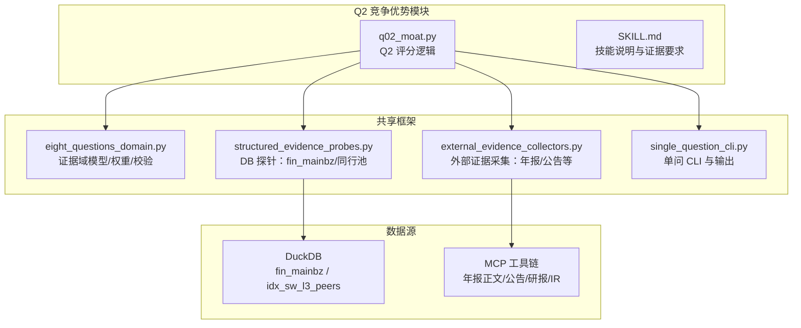
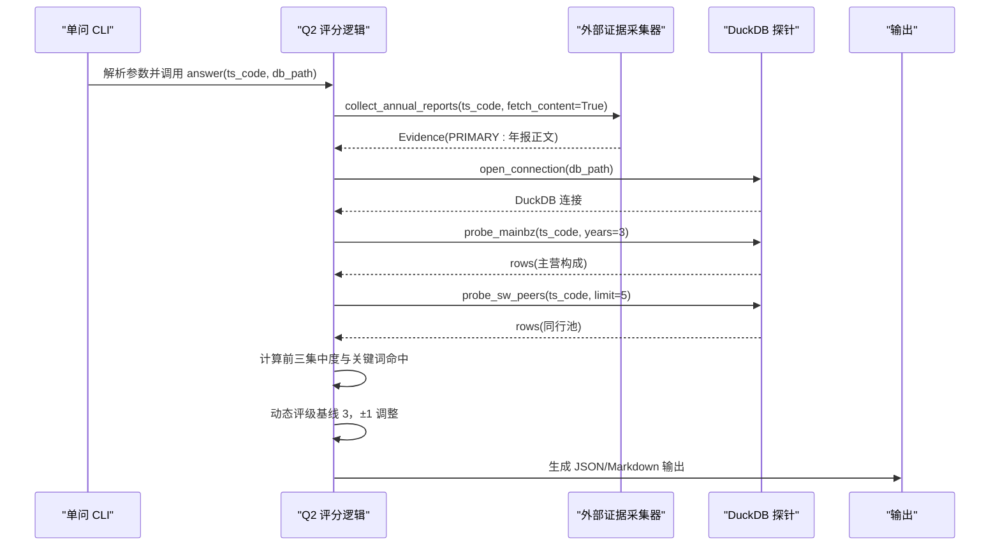
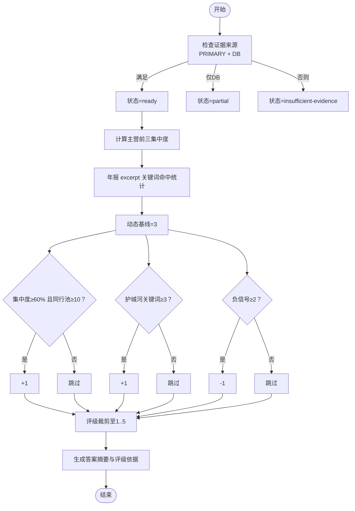
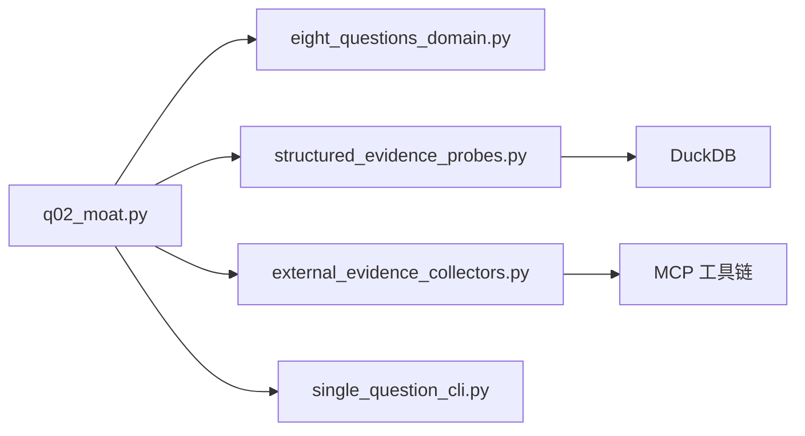

# Q2 竞争优势评估

<cite>
**本文档引用的文件**
- [q02_moat.py](file://2min-company-analysis/ask-q2-moat/scripts/q02_moat.py)
- [SKILL.md](file://2min-company-analysis/ask-q2-moat/SKILL.md)
- [eight_questions_domain.py](file://2min-company-analysis/seven-look-eight-question/scripts/eight_questions_domain.py)
- [structured_evidence_probes.py](file://2min-company-analysis/seven-look-eight-question/scripts/structured_evidence_probes.py)
- [external_evidence_collectors.py](file://2min-company-analysis/seven-look-eight-question/scripts/external_evidence_collectors.py)
- [single_question_cli.py](file://2min-company-analysis/seven-look-eight-question/scripts/single_question_cli.py)
- [README.md](file://2min-company-analysis/README.md)
- [rule_registry.json](file://2min-company-analysis/seven-look-eight-question/assets/rule_registry.json)
</cite>

## 目录
1. [简介](#简介)
2. [项目结构](#项目结构)
3. [核心组件](#核心组件)
4. [架构总览](#架构总览)
5. [详细组件分析](#详细组件分析)
6. [依赖关系分析](#依赖关系分析)
7. [性能考量](#性能考量)
8. [故障排除指南](#故障排除指南)
9. [结论](#结论)
10. [附录](#附录)

## 简介
本文件为 Q2 竞争优势评估模块的技术文档，系统阐述竞争优势评估的理论基础、评估维度与方法论，并结合代码实现细节，说明护城河识别、品牌优势、技术壁垒、网络效应等关键要素的分析流程，以及竞争对手分析与替代品威胁评估的实现方式。文档还提供竞争优势强度量化方法与评级标准，并包含实际案例分析与代码实现细节的定位路径。

## 项目结构
Q2 竞争优势评估模块位于 `2min-company-analysis/ask-q2-moat` 目录，采用“单问独立运行”的设计，通过共享的八问框架进行证据采集、评分与输出。其核心依赖包括：
- 八问领域模型与证据规范：统一证据来源类型、权重与校验规则
- DuckDB 结构化证据探针：从 fin_mainbz 与 idx_sw_l3_peers 查询主营构成与同行池
- 外部证据采集器：从 MCP 工具链抓取年报正文与相关公告
- 单问 CLI：封装参数解析、输出渲染与标准化产物

**图表来源**
- [q02_moat.py:1-129](file://2min-company-analysis/ask-q2-moat/scripts/q02_moat.py#L1-L129)
- [eight_questions_domain.py:1-324](file://2min-company-analysis/seven-look-eight-question/scripts/eight_questions_domain.py#L1-L324)
- [structured_evidence_probes.py:1-386](file://2min-company-analysis/seven-look-eight-question/scripts/structured_evidence_probes.py#L1-L386)
- [external_evidence_collectors.py:1-524](file://2min-company-analysis/seven-look-eight-question/scripts/external_evidence_collectors.py#L1-L524)
- [single_question_cli.py:1-158](file://2min-company-analysis/seven-look-eight-question/scripts/single_question_cli.py#L1-L158)

**章节来源**
- [README.md:1-132](file://2min-company-analysis/README.md#L1-L132)
- [SKILL.md:1-64](file://2min-company-analysis/ask-q2-moat/SKILL.md#L1-L64)

## 核心组件
- Q2 评分逻辑与评级信号
  - 动态评级基线为 3，基于以下信号调整：
    - 主营前 3 项集中度 ≥60% 且同行池规模 ≥10：+1
    - 年报 excerpt 命中“自主研发/专利/品牌/龙头/行业领先/核心技术/独家”等护城河关键词 ≥3 次：+1
    - 年报 excerpt 命中“毛利率下降/竞争加剧/价格战/替代/受冲击/依赖许可/依赖行政”等负信号 ≥2 次：-1
  - 评级范围限制在 1..5
  - 输出包含“评级依据”与“答案摘要”，提示进一步判断护城河类型（品牌/技术/规模/渠道/许可）

- 证据采集与状态判定
  - 必须同时具备“年报正文证据（PRIMARY）”与“DuckDB 主营数据（DB）”才可进入 ready 状态
  - 仅有 DB 证据：partial（提示补年报全文）
  - 无 PRIMARY 证据：insufficient-evidence
  - 人工介入情形：当外部证据采集失败且需人类补证时，记录 human_in_loop_requests

- 关键数据源
  - DuckDB fin_mainbz：主营构成与收入/利润/成本明细，用于计算前三集中度
  - DuckDB idx_sw_l3_peers：申万三级行业分类与同行池规模
  - 年报正文（PRIMARY）：MD&A 段落，用于关键词命中分析

**章节来源**
- [q02_moat.py:1-129](file://2min-company-analysis/ask-q2-moat/scripts/q02_moat.py#L1-L129)
- [SKILL.md:25-64](file://2min-company-analysis/ask-q2-moat/SKILL.md#L25-L64)

## 架构总览
Q2 模块遵循“证据驱动 + 规则评分”的流水线式处理：
1. 参数解析与初始化：通过单问 CLI 获取 ts_code、DuckDB 路径、输出格式等
2. 外部证据采集：调用外部证据采集器抓取年报正文与相关公告
3. 结构化证据探针：连接 DuckDB，查询 fin_mainbz 与 idx_sw_l3_peers
4. 评分与状态判定：根据关键词命中与集中度计算动态评级
5. 输出标准化：生成 JSON 与 Markdown，包含证据、评级依据与状态

**图表来源**
- [q02_moat.py:46-120](file://2min-company-analysis/ask-q2-moat/scripts/q02_moat.py#L46-L120)
- [external_evidence_collectors.py:140-194](file://2min-company-analysis/seven-look-eight-question/scripts/external_evidence_collectors.py#L140-L194)
- [structured_evidence_probes.py:215-271](file://2min-company-analysis/seven-look-eight-question/scripts/structured_evidence_probes.py#L215-L271)
- [single_question_cli.py:126-158](file://2min-company-analysis/seven-look-eight-question/scripts/single_question_cli.py#L126-L158)

## 详细组件分析

### 组件 A：Q2 评分与评级信号
- 关键函数与职责
  - `_mainbz_concentration(rows)`：计算主营前三集中度
  - `answer(ts_code, db_path)`：主流程，整合证据、计算信号并生成评级
  - `main(argv)`：单问 CLI 入口

- 评级信号计算流程

**图表来源**
- [q02_moat.py:36-120](file://2min-company-analysis/ask-q2-moat/scripts/q02_moat.py#L36-L120)

**章节来源**
- [q02_moat.py:1-129](file://2min-company-analysis/ask-q2-moat/scripts/q02_moat.py#L1-L129)

### 组件 B：证据域模型与权重
- SourceType 定义与权重
  - PRIMARY/REGULATORY/DB/INDUSTRY_REPORT/NEWS/IR_MEETING
  - 权重：PRIMARY/REGULATORY=1.0，DB=1.0，INDUSTRY_REPORT=0.6，NEWS=0.4，IR_MEETING=0.5
- Evidence 校验
  - 必须提供 source_url 与非空 excerpt
  - 支持预测性来源标记（研报/IR）
- EightQuestionAnswer
  - 统一承载 question_id/title/rating/status/evidence 等字段
  - finalize_status 自动降级逻辑：优先 human-in-loop，其次 partial，最后保留原状态
  - weighted_rating 基于证据权重的加权评级

**章节来源**
- [eight_questions_domain.py:26-213](file://2min-company-analysis/seven-look-eight-question/scripts/eight_questions_domain.py#L26-L213)

### 组件 C：结构化证据探针（DuckDB）
- 主营业务构成探针
  - 查询 fin_mainbz 最近 N 年主营构成，返回 rows 与 Evidence
  - 计算最新年度前三占比摘要
- 同行池探针
  - 查询 idx_sw_l3_peers 获取申万三级分类与同行池规模
  - 返回 rows 与 Evidence

**章节来源**
- [structured_evidence_probes.py:215-271](file://2min-company-analysis/seven-look-eight-question/scripts/structured_evidence_probes.py#L215-L271)

### 组件 D：外部证据采集器（MCP）
- 年报正文采集
  - 通过 sina_reports 抓取年报 listing，支持按需 fetch_content
  - 统一包装为 Evidence(PRIMARY)，并进行强校验
- 错误分类与降级策略
  - env_missing/module_missing/upstream_contract_break/source_disabled：必须人工介入
  - network_fail/not_found：可降级为 partial 或 insufficient-evidence
- 其他采集器（公告/研报/IR/监管处罚）在 Q2 中不直接使用，但框架已预留

**章节来源**
- [external_evidence_collectors.py:140-194](file://2min-company-analysis/seven-look-eight-question/scripts/external_evidence_collectors.py#L140-L194)
- [external_evidence_collectors.py:199-261](file://2min-company-analysis/seven-look-eight-question/scripts/external_evidence_collectors.py#L199-L261)
- [external_evidence_collectors.py:269-320](file://2min-company-analysis/seven-look-eight-question/scripts/external_evidence_collectors.py#L269-L320)
- [external_evidence_collectors.py:327-377](file://2min-company-analysis/seven-look-eight-question/scripts/external_evidence_collectors.py#L327-L377)
- [external_evidence_collectors.py:384-449](file://2min-company-analysis/seven-look-eight-question/scripts/external_evidence_collectors.py#L384-L449)
- [external_evidence_collectors.py:457-524](file://2min-company-analysis/seven-look-eight-question/scripts/external_evidence_collectors.py#L457-L524)

### 组件 E：单问 CLI 与输出
- 参数解析：--ts-code/--duckdb-path/--as-of-date/--output-dir/--format
- 输出：JSON 与 Markdown，包含证据表格、评级依据、缺失输入与备注
- 标准化 payload：包含 generated_at/ts_code/as_of_date/question_id/title/answer

**章节来源**
- [single_question_cli.py:126-158](file://2min-company-analysis/seven-look-eight-question/scripts/single_question_cli.py#L126-L158)
- [single_question_cli.py:36-124](file://2min-company-analysis/seven-look-eight-question/scripts/single_question_cli.py#L36-L124)

## 依赖关系分析
- 模块内依赖
  - q02_moat.py 依赖 shared 框架：eight_questions_domain、structured_evidence_probes、external_evidence_collectors、single_question_cli
- 外部依赖
  - DuckDB：fin_mainbz、idx_sw_l3_peers
  - MCP 工具链：sina_reports 等（可选，未安装时会提示人工介入）

**图表来源**
- [q02_moat.py:18-25](file://2min-company-analysis/ask-q2-moat/scripts/q02_moat.py#L18-L25)
- [structured_evidence_probes.py:1-386](file://2min-company-analysis/seven-look-eight-question/scripts/structured_evidence_probes.py#L1-L386)
- [external_evidence_collectors.py:1-524](file://2min-company-analysis/seven-look-eight-question/scripts/external_evidence_collectors.py#L1-L524)

**章节来源**
- [rule_registry.json:240-262](file://2min-company-analysis/seven-look-eight-question/assets/rule_registry.json#L240-L262)

## 性能考量
- DuckDB 查询优化
  - fin_mainbz 与 idx_sw_l3_peers 查询均为等值过滤与排序，建议确保相关列建立索引（如 ts_code、end_date）
  - 限制 years/limit 以减少扫描范围
- 外部证据采集
  - 年报正文 fetch_content 成本较高，建议按需开启
  - MCP 调用失败时自动降级，避免阻塞整体流程
- 证据权重与加权评级
  - 通过证据权重计算加权评级，提升评级置信度

[本节为通用性能建议，无需特定文件引用]

## 故障排除指南
- DuckDB 不可访问
  - 现象：FileNotFoundError，critical_gaps 提示 DuckDB 不可访问
  - 处理：检查 db_path 与数据文件是否存在
- 年报采集失败
  - 现象：requires_human 或 error_type=network_fail/env_missing/module_missing
  - 处理：安装 nano-search-mcp 并配置 DASHSCOPE_API_KEY；或手动提供年报 URL
- 证据不足导致无法 ready
  - 现象：仅 DB 或仅 PRIMARY，状态为 partial/insufficient-evidence
  - 处理：补全年报全文或等待更多 DB 数据
- 评级异常或验证失败
  - 现象：validate 失败，状态降级为 insufficient-evidence
  - 处理：检查证据完整性与评分逻辑一致性

**章节来源**
- [q02_moat.py:66-70](file://2min-company-analysis/ask-q2-moat/scripts/q02_moat.py#L66-L70)
- [external_evidence_collectors.py:150-194](file://2min-company-analysis/seven-look-eight-question/scripts/external_evidence_collectors.py#L150-L194)
- [single_question_cli.py:25-34](file://2min-company-analysis/seven-look-eight-question/scripts/single_question_cli.py#L25-L34)

## 结论
Q2 竞争优势评估模块通过“证据驱动 + 规则评分”的方式，将年报正文与 DuckDB 主营数据相结合，形成可复核、可追踪的评级体系。其核心在于：
- 护城河关键词与负信号的量化统计
- 主营集中度与同行池规模的结构化指标
- 严格的证据来源与权重管理
- 可扩展的外部证据采集与人工介入机制

该模块既可用于独立运行，也可融入“七看八问”总编排，为后续的市场地位、业务模式与未来规划等问题提供基础支撑。

[本节为总结性内容，无需特定文件引用]

## 附录

### 实际案例分析（方法论与步骤）
- 案例目标：评估某公司 Q2 竞争优势强度与护城河类型
- 步骤
  1. 准备数据：确保 DuckDB 中 fin_mainbz 与 idx_sw_l3_peers 数据完整
  2. 运行 Q2 单问：提供 ts_code 与 DuckDB 路径，选择输出格式
  3. 查看输出：JSON/Markdown 中包含证据、评级依据与答案摘要
  4. 人工复核：根据答案提示，进一步判断护城河类型（品牌/技术/规模/渠道/许可）
- 代码定位
  - 单问运行入口：[q02_moat.py:123-129](file://2min-company-analysis/ask-q2-moat/scripts/q02_moat.py#L123-L129)
  - 输出渲染：[single_question_cli.py:51-124](file://2min-company-analysis/seven-look-eight-question/scripts/single_question_cli.py#L51-L124)

**章节来源**
- [q02_moat.py:1-129](file://2min-company-analysis/ask-q2-moat/scripts/q02_moat.py#L1-L129)
- [single_question_cli.py:1-158](file://2min-company-analysis/seven-look-eight-question/scripts/single_question_cli.py#L1-L158)

### 竞争优势强度量化与评级标准
- 评级基线：3
- 正向信号
  - 主营前三集中度 ≥60% 且同行池规模 ≥10：+1
  - 年报 excerpt 命中护城河关键词 ≥3 次：+1
- 负向信号
  - 年报 excerpt 命中负信号 ≥2 次：-1
- 评级范围：1..5，最终评级经裁剪

**章节来源**
- [q02_moat.py:5-10](file://2min-company-analysis/ask-q2-moat/scripts/q02_moat.py#L5-L10)
- [q02_moat.py:94-101](file://2min-company-analysis/ask-q2-moat/scripts/q02_moat.py#L94-L101)

### 护城河识别方法论与判断标准
- 方法论
  - 关键词命中：自主研发/专利/品牌/龙头/行业领先/核心技术/独家
  - 负信号识别：毛利率下降/竞争加剧/价格战/替代/受冲击/依赖许可/依赖行政
- 判断标准
  - 仅当 PRIMARY 与 DB 证据同时满足时，方可进入 ready 状态
  - 人工复核：根据 MD&A 片段判断护城河类型（品牌/技术/规模/渠道/许可）

**章节来源**
- [q02_moat.py:32-33](file://2min-company-analysis/ask-q2-moat/scripts/q02_moat.py#L32-L33)
- [q02_moat.py:86-112](file://2min-company-analysis/ask-q2-moat/scripts/q02_moat.py#L86-L112)
- [SKILL.md:25-30](file://2min-company-analysis/ask-q2-moat/SKILL.md#L25-L30)

### 品牌优势、技术壁垒、网络效应分析流程
- 品牌优势
  - 关注“品牌/龙头/市占率第一/行业领先”等关键词
  - 结合主营集中度与同行池规模验证市场领导地位
- 技术壁垒
  - 关注“自主研发/专利/核心技术/独家”等关键词
  - 结合毛利率趋势与负信号识别技术替代风险
- 网络效应
  - 通过年报 MD&A 中的客户集中度、市场分布与协同效应描述进行识别
  - 与“业务构成与市场分布”规则联动

**章节来源**
- [q02_moat.py:32-33](file://2min-company-analysis/ask-q2-moat/scripts/q02_moat.py#L32-L33)
- [q02_moat.py:88-112](file://2min-company-analysis/ask-q2-moat/scripts/q02_moat.py#L88-L112)
- [rule_registry.json:91-121](file://2min-company-analysis/seven-look-eight-question/assets/rule_registry.json#L91-L121)

### 竞争对手分析与替代品威胁评估
- 竞争对手分析
  - 通过 idx_sw_l3_peers 获取同行池规模与样例公司，辅助判断竞争格局
- 替代品威胁评估
  - 关注年报 excerpt 中“替代/受冲击”等负信号
  - 与毛利率趋势、费用结构等指标联动分析

**章节来源**
- [structured_evidence_probes.py:246-271](file://2min-company-analysis/seven-look-eight-question/scripts/structured_evidence_probes.py#L246-L271)
- [q02_moat.py](file://2min-company-analysis/ask-q2-moat/scripts/q02_moat.py#L33)
- [q02_moat.py:99-100](file://2min-company-analysis/ask-q2-moat/scripts/q02_moat.py#L99-L100)