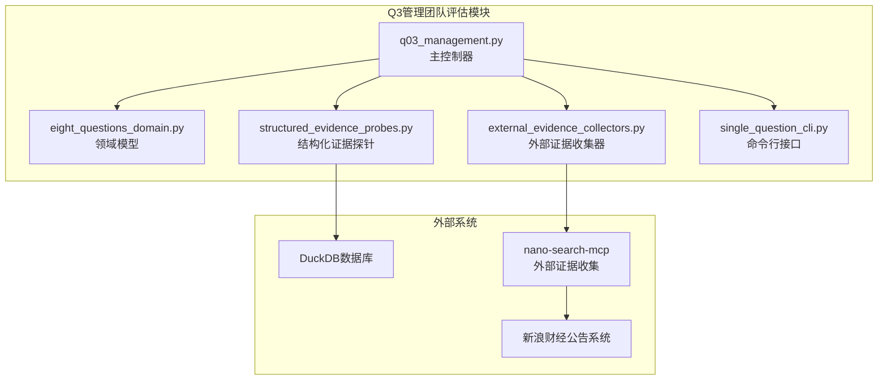
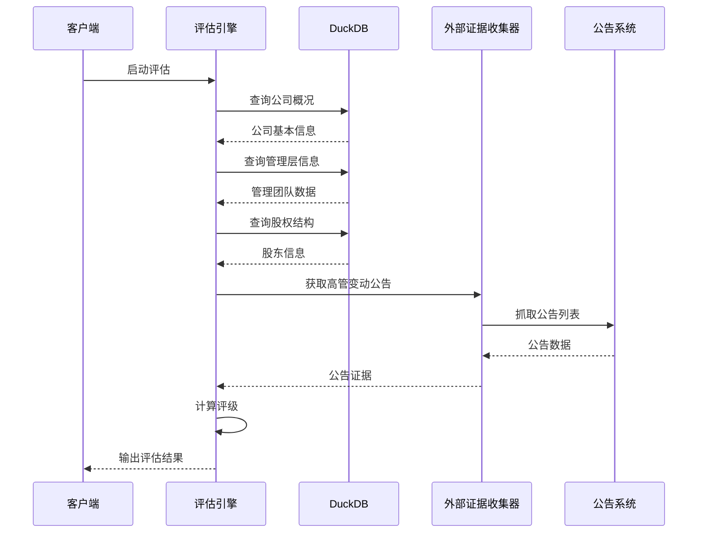
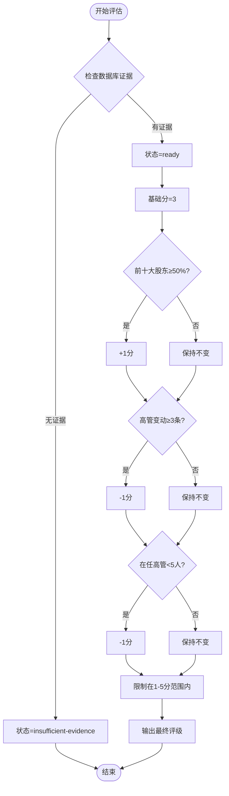
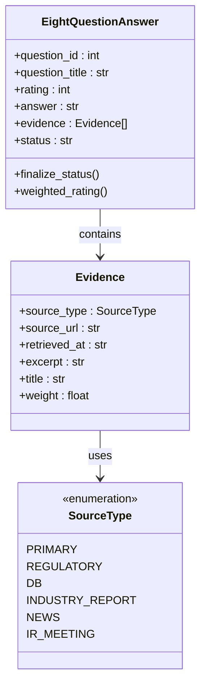
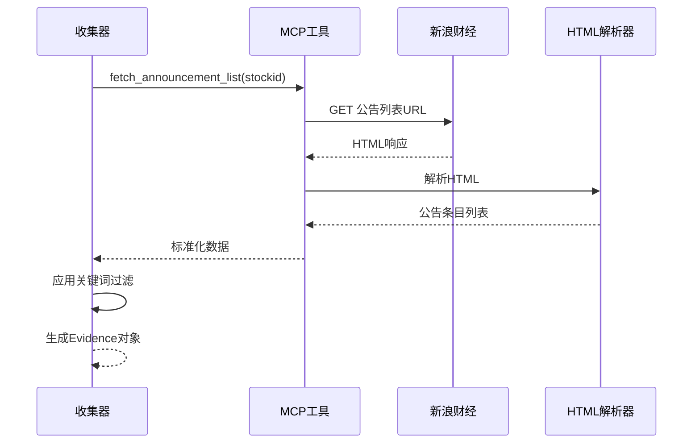
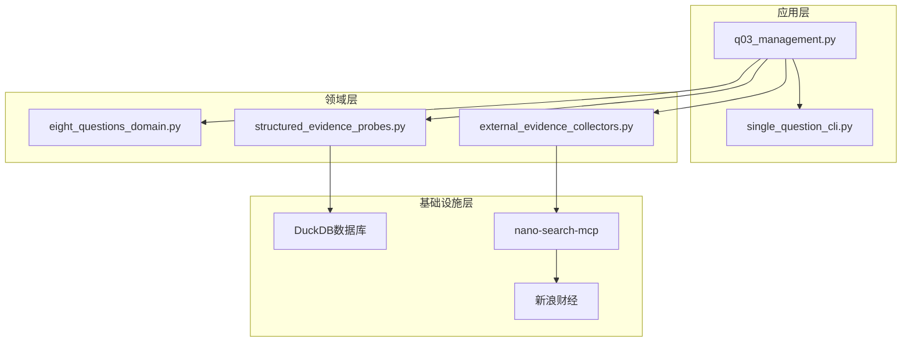

# Q3 管理团队评估

<cite>
**本文档引用的文件**
- [q03_management.py](file://2min-company-analysis/ask-q3-management/scripts/q03_management.py)
- [SKILL.md](file://2min-company-analysis/ask-q3-management/SKILL.md)
- [eight_questions_domain.py](file://2min-company-analysis/seven-look-eight-question/scripts/eight_questions_domain.py)
- [structured_evidence_probes.py](file://2min-company-analysis/seven-look-eight-question/scripts/structured_evidence_probes.py)
- [external_evidence_collectors.py](file://2min-company-analysis/seven-look-eight-question/scripts/external_evidence_collectors.py)
- [single_question_cli.py](file://2min-company-analysis/seven-look-eight-question/scripts/single_question_cli.py)
- [announcements.py](file://nano-search-mcp/src/nano_search_mcp/tools/announcements.py)
- [README.md](file://2min-company-analysis/README.md)
</cite>

## 目录
1. [简介](#简介)
2. [项目结构](#项目结构)
3. [核心组件](#核心组件)
4. [架构概览](#架构概览)
5. [详细组件分析](#详细组件分析)
6. [依赖关系分析](#依赖关系分析)
7. [性能考虑](#性能考虑)
8. [故障排除指南](#故障排除指南)
9. [结论](#结论)

## 简介

Q3管理团队评估模块是"七看八问"分析框架中的关键组成部分，专门用于评估上市公司管理层的管理质量、战略眼光和执行能力。该模块通过结构化的方法论，结合内部数据库证据和外部公告信息，为管理层评估提供客观、可追溯的量化指标。

该模块的核心目标是：
- 评估管理层背景、经验和能力
- 分析管理团队稳定性
- 评估股权结构合理性
- 识别潜在治理风险
- 提供可量化的管理质量评级

## 项目结构

Q3管理团队评估模块采用模块化设计，主要包含以下核心组件：

**图表来源**
- [q03_management.py:1-129](file://2min-company-analysis/ask-q3-management/scripts/q03_management.py#L1-L129)
- [eight_questions_domain.py:1-324](file://2min-company-analysis/seven-look-eight-question/scripts/eight_questions_domain.py#L1-L324)

**章节来源**
- [README.md:1-132](file://2min-company-analysis/README.md#L1-L132)

## 核心组件

### 管理团队评估引擎

管理团队评估引擎是整个模块的核心，负责协调各个子组件完成完整的评估流程。其主要职责包括：

- **证据收集协调**：统一管理内部数据库证据和外部公告证据
- **评分计算**：基于预定义规则计算管理质量评级
- **状态管理**：跟踪评估过程中的各种状态变化
- **报告生成**：输出标准化的评估报告

### 证据收集系统

证据收集系统负责从多个数据源获取支持评估的信息：

- **内部数据库证据**：来自DuckDB的结构化数据
- **外部公告证据**：通过MCP工具收集的最新公告信息
- **证据验证**：确保所有证据的真实性和完整性

### 评级算法

评级算法采用动态评分机制，根据不同的评估维度进行加减分：

- **基础分**：3分（动态评级基线）
- **加分项**：前十大股东集中度≥50%
- **减分项**：高管变动公告≥3条、在任高管数<5人

**章节来源**
- [q03_management.py:38-120](file://2min-company-analysis/ask-q3-management/scripts/q03_management.py#L38-L120)

## 架构概览

Q3管理团队评估模块采用分层架构设计，确保各组件之间的松耦合和高内聚：

**图表来源**
- [q03_management.py:44-120](file://2min-company-analysis/ask-q3-management/scripts/q03_management.py#L44-L120)
- [external_evidence_collectors.py:201-261](file://2min-company-analysis/seven-look-eight-question/scripts/external_evidence_collectors.py#L201-L261)

## 详细组件分析

### 管理团队评估核心算法

管理团队评估采用多维度评分机制，具体算法如下：

**图表来源**
- [q03_management.py:96-111](file://2min-company-analysis/ask-q3-management/scripts/q03_management.py#L96-L111)

### 证据收集流程

证据收集流程确保评估的全面性和准确性：

**图表来源**
- [eight_questions_domain.py:72-111](file://2min-company-analysis/seven-look-eight-question/scripts/eight_questions_domain.py#L72-L111)
- [eight_questions_domain.py:123-212](file://2min-company-analysis/seven-look-eight-question/scripts/eight_questions_domain.py#L123-L212)

### 结构化证据探针

结构化证据探针负责从DuckDB数据库中提取关键的管理团队相关信息：

| 探针名称 | 数据表 | 关键字段 | 用途 |
|---------|--------|----------|------|
| probe_company_overview | stk_company | ts_code, com_name, chairman, manager, secretary | 公司基本信息 |
| probe_managers | stk_managers | name, title, lev, begin_date, end_date | 管理团队成员信息 |
| probe_rewards | stk_rewards | name, title, reward, hold_vol | 薪酬和持股信息 |
| probe_top_holders | fin_top10_holders | holder_name, hold_ratio, end_date | 股权结构分析 |

**章节来源**
- [structured_evidence_probes.py:58-156](file://2min-company-analysis/seven-look-eight-question/scripts/structured_evidence_probes.py#L58-L156)

### 外部证据收集器

外部证据收集器负责从外部数据源获取最新的公告信息：

**图表来源**
- [external_evidence_collectors.py:201-261](file://2min-company-analysis/seven-look-eight-question/scripts/external_evidence_collectors.py#L201-L261)

**章节来源**
- [announcements.py:146-178](file://nano-search-mcp/src/nano_search_mcp/tools/announcements.py#L146-L178)

## 依赖关系分析

Q3管理团队评估模块的依赖关系呈现清晰的层次结构：

**图表来源**
- [q03_management.py:18-31](file://2min-company-analysis/ask-q3-management/scripts/q03_management.py#L18-L31)
- [external_evidence_collectors.py:29-33](file://2min-company-analysis/seven-look-eight-question/scripts/external_evidence_collectors.py#L29-L33)

### 核心依赖关系

1. **内部依赖**：
   - q03_management.py 依赖 eight_questions_domain.py 提供的统一数据模型
   - 结构化证据探针依赖 DuckDB 连接进行数据查询
   - 外部证据收集器依赖 MCP 工具进行网络数据获取

2. **外部依赖**：
   - DuckDB 数据库提供结构化数据存储
   - nano-search-mcp 提供外部证据收集能力
   - 新浪财经提供公告数据源

**章节来源**
- [q03_management.py:18-31](file://2min-company-analysis/ask-q3-management/scripts/q03_management.py#L18-L31)

## 性能考虑

### 数据查询优化

- **索引利用**：确保DuckDB查询使用适当的索引
- **查询限制**：合理设置查询结果数量限制，避免大数据量查询
- **连接复用**：复用数据库连接减少连接开销

### 网络请求优化

- **缓存机制**：利用MCP工具的缓存机制减少重复请求
- **请求限流**：实现合理的请求频率控制
- **错误重试**：实现指数退避的错误重试机制

### 内存管理

- **流式处理**：对于大量数据采用流式处理方式
- **及时释放**：及时释放不再使用的资源
- **批量操作**：尽量使用批量操作减少内存占用

## 故障排除指南

### 常见问题及解决方案

| 问题类型 | 症状 | 可能原因 | 解决方案 |
|---------|------|----------|----------|
| 数据库连接失败 | FileNotFoundError异常 | DuckDB文件不存在或权限不足 | 检查数据库路径和文件权限 |
| 外部证据获取失败 | 网络超时或连接错误 | 网络不稳定或MCP工具未安装 | 检查网络连接和MCP安装状态 |
| 证据验证失败 | Evidence.__post_init__异常 | 证据内容为空或格式不正确 | 检查证据数据源和格式 |
| 评级计算异常 | 评级不在1-5范围内 | 评分逻辑错误或数据异常 | 检查评分算法和输入数据 |

### 调试技巧

1. **日志记录**：启用详细的日志记录以便追踪问题
2. **单元测试**：编写针对关键组件的单元测试
3. **断点调试**：使用断点调试定位问题所在
4. **数据验证**：验证输入数据的完整性和正确性

**章节来源**
- [q03_management.py:44-50](file://2min-company-analysis/ask-q3-management/scripts/q03_management.py#L44-L50)
- [external_evidence_collectors.py:119-133](file://2min-company-analysis/seven-look-eight-question/scripts/external_evidence_collectors.py#L119-L133)

## 结论

Q3管理团队评估模块通过结构化的方法论和自动化工具，为管理层评估提供了科学、客观的分析框架。该模块的主要优势包括：

1. **全面性**：同时考虑内部数据库证据和外部公告信息
2. **可追溯性**：所有评估决策都有明确的证据支撑
3. **可扩展性**：模块化设计便于功能扩展和维护
4. **自动化程度高**：减少人工干预，提高评估效率

该模块为投资决策提供了重要的参考信息，特别是在评估管理层质量、识别治理风险方面具有重要作用。通过持续的优化和改进，该模块将继续为投资者提供有价值的投资洞察。