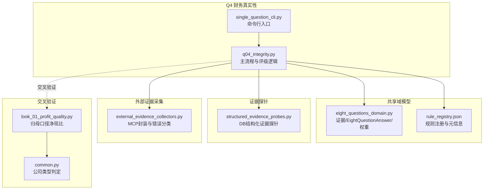
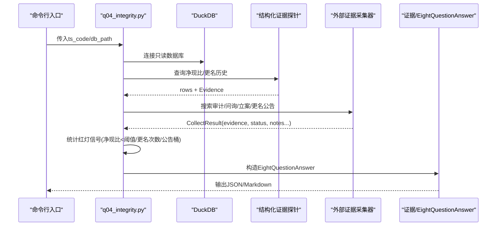
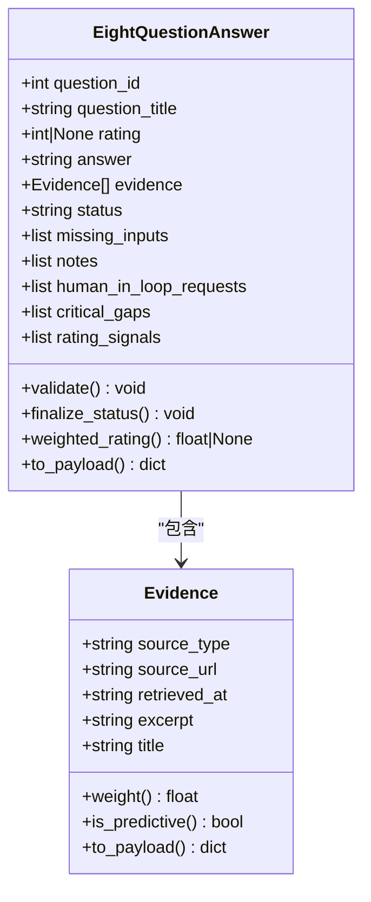
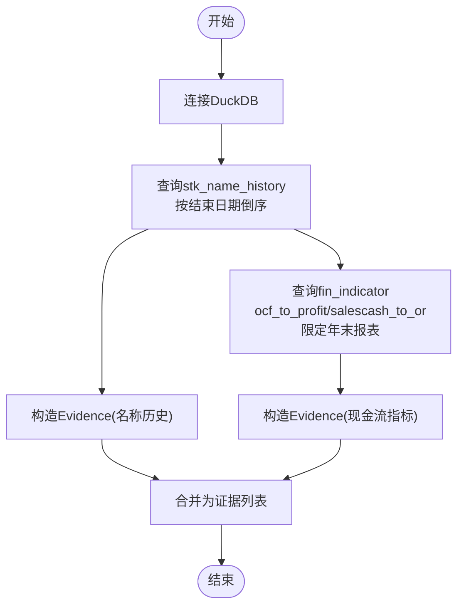
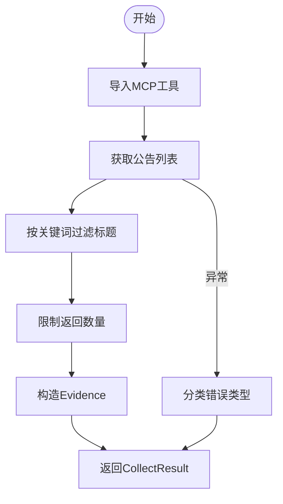
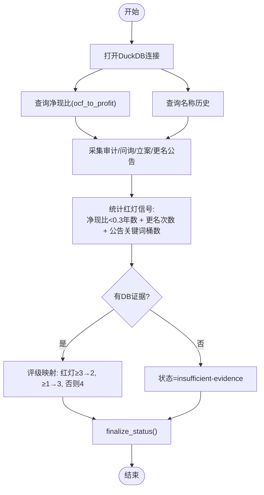
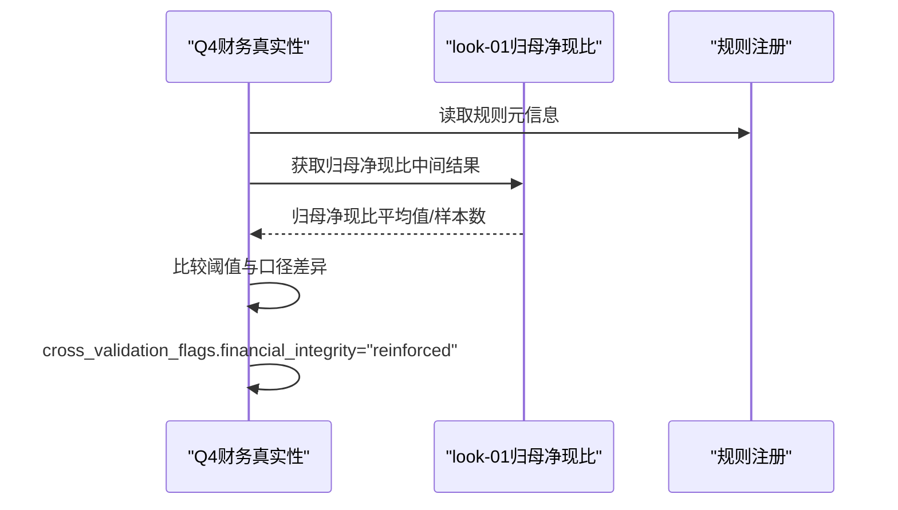
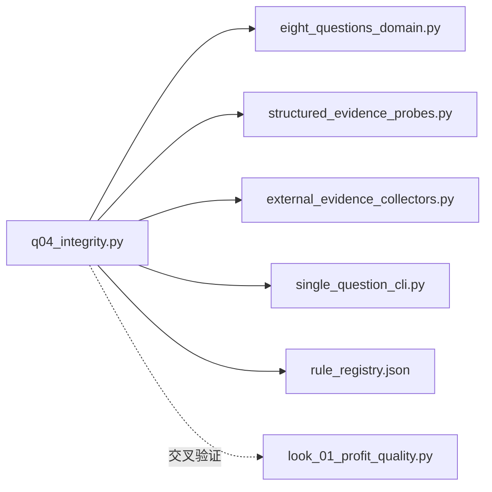

# Q4 财务真实性评估

<cite>
**本文档引用的文件**
- [q04_integrity.py](file://2min-company-analysis/ask-q4-financial-integrity/scripts/q04_integrity.py)
- [SKILL.md](file://2min-company-analysis/ask-q4-financial-integrity/SKILL.md)
- [eight_questions_domain.py](file://2min-company-analysis/seven-look-eight-question/scripts/eight_questions_domain.py)
- [structured_evidence_probes.py](file://2min-company-analysis/seven-look-eight-question/scripts/structured_evidence_probes.py)
- [external_evidence_collectors.py](file://2min-company-analysis/seven-look-eight-question/scripts/external_evidence_collectors.py)
- [single_question_cli.py](file://2min-company-analysis/seven-look-eight-question/scripts/single_question_cli.py)
- [rule_registry.json](file://2min-company-analysis/seven-look-eight-question/assets/rule_registry.json)
- [look_01_profit_quality.py](file://2min-company-analysis/look-01-profit-quality/scripts/look_01_profit_quality.py)
- [common.py](file://2min-company-analysis/look-01-profit-quality/scripts/common.py)
</cite>

## 目录
1. [简介](#简介)
2. [项目结构](#项目结构)
3. [核心组件](#核心组件)
4. [架构总览](#架构总览)
5. [详细组件分析](#详细组件分析)
6. [依赖关系分析](#依赖关系分析)
7. [性能考量](#性能考量)
8. [故障排查指南](#故障排查指南)
9. [结论](#结论)
10. [附录](#附录)

## 简介
本文件面向Q4财务真实性评估模块，系统化阐述财务真实性评估的重要性、评估方法与关键信号，以及在本仓库中的实现细节。财务真实性评估旨在识别财务造假的早期迹象，包括但不限于审计非标意见、频繁更名、净现比偏低、监管问询/立案等异常信号，并结合结构化指标与外部证据进行交叉验证，最终形成可追溯、可复核的评级与风险等级划分。

## 项目结构
Q4财务真实性评估位于“七看八问”框架下的独立Skill中，采用“单问脚本 + 共享域模型 + 结构化证据探针 + 外部证据采集器”的分层设计，确保证据来源可追溯、评级逻辑可复用、输出格式统一。

图表来源
- [q04_integrity.py:1-131](file://2min-company-analysis/ask-q4-financial-integrity/scripts/q04_integrity.py#L1-L131)
- [single_question_cli.py:126-158](file://2min-company-analysis/seven-look-eight-question/scripts/single_question_cli.py#L126-L158)
- [eight_questions_domain.py:1-324](file://2min-company-analysis/seven-look-eight-question/scripts/eight_questions_domain.py#L1-L324)
- [structured_evidence_probes.py:164-208](file://2min-company-analysis/seven-look-eight-question/scripts/structured_evidence_probes.py#L164-L208)
- [external_evidence_collectors.py:201-262](file://2min-company-analysis/seven-look-eight-question/scripts/external_evidence_collectors.py#L201-L262)
- [rule_registry.json:288-310](file://2min-company-analysis/seven-look-eight-question/assets/rule_registry.json#L288-L310)
- [look_01_profit_quality.py:1-587](file://2min-company-analysis/look-01-profit-quality/scripts/look_01_profit_quality.py#L1-L587)
- [common.py:1-153](file://2min-company-analysis/look-01-profit-quality/scripts/common.py#L1-L153)

章节来源
- [q04_integrity.py:1-131](file://2min-company-analysis/ask-q4-financial-integrity/scripts/q04_integrity.py#L1-L131)
- [SKILL.md:1-77](file://2min-company-analysis/ask-q4-financial-integrity/SKILL.md#L1-L77)
- [rule_registry.json:288-310](file://2min-company-analysis/seven-look-eight-question/assets/rule_registry.json#L288-L310)

## 核心组件
- 证据与评级域模型：统一证据来源类型、权重、校验与序列化，保证输出可复核、可加权。
- 结构化证据探针：从DuckDB读取财务指标与历史更名记录，构造标准化证据。
- 外部证据采集器：封装MCP工具，统一返回形状与错误分类，支持“失败即降级”策略。
- 单问CLI：提供统一的命令行入口，生成JSON与Markdown报告。
- 交叉验证：与look-01归母口径净现比联动，强化财务真实性判断。

章节来源
- [eight_questions_domain.py:26-213](file://2min-company-analysis/seven-look-eight-question/scripts/eight_questions_domain.py#L26-L213)
- [structured_evidence_probes.py:164-208](file://2min-company-analysis/seven-look-eight-question/scripts/structured_evidence_probes.py#L164-L208)
- [external_evidence_collectors.py:47-76](file://2min-company-analysis/seven-look-eight-question/scripts/external_evidence_collectors.py#L47-L76)
- [single_question_cli.py:126-158](file://2min-company-analysis/seven-look-eight-question/scripts/single_question_cli.py#L126-L158)
- [look_01_profit_quality.py:312-378](file://2min-company-analysis/look-01-profit-quality/scripts/look_01_profit_quality.py#L312-L378)

## 架构总览
Q4财务真实性评估遵循“证据驱动 + 规则初评 + 交叉验证 + 人工审阅”的闭环流程。主流程从DuckDB读取净现比与更名历史，同时采集审计/问询/立案等外部公告，综合形成红灯信号数量并映射为评级。

图表来源
- [q04_integrity.py:35-122](file://2min-company-analysis/ask-q4-financial-integrity/scripts/q04_integrity.py#L35-L122)
- [structured_evidence_probes.py:183-208](file://2min-company-analysis/seven-look-eight-question/scripts/structured_evidence_probes.py#L183-L208)
- [external_evidence_collectors.py:201-262](file://2min-company-analysis/seven-look-eight-question/scripts/external_evidence_collectors.py#L201-L262)
- [eight_questions_domain.py:123-213](file://2min-company-analysis/seven-look-eight-question/scripts/eight_questions_domain.py#L123-L213)

## 详细组件分析

### 1) 证据与评级域模型
- Evidence：强制校验source_url与excerpt非空，支持权重、预测标记与序列化。
- EightQuestionAnswer：统一状态机（ready/partial/insufficient-evidence/human-in-loop-required），支持finalize_status自动降级与validate校验。
- SourceType与权重：PRIMARY/REGULATORY/DB/INDUSTRY_REPORT/NEWS/IR_MEETING，用于加权评级。

图表来源
- [eight_questions_domain.py:72-213](file://2min-company-analysis/seven-look-eight-question/scripts/eight_questions_domain.py#L72-L213)

章节来源
- [eight_questions_domain.py:26-213](file://2min-company-analysis/seven-look-eight-question/scripts/eight_questions_domain.py#L26-L213)

### 2) 结构化证据探针（DB）
- 名称历史探针：查询stk_name_history，返回最近更名记录与原因，构造Evidence。
- 现金流比率探针：查询fin_indicator的ocf_to_profit、salescash_to_or等，限定年末报表，构造Evidence。

图表来源
- [structured_evidence_probes.py:164-208](file://2min-company-analysis/seven-look-eight-question/scripts/structured_evidence_probes.py#L164-L208)

章节来源
- [structured_evidence_probes.py:164-208](file://2min-company-analysis/seven-look-eight-question/scripts/structured_evidence_probes.py#L164-L208)

### 3) 外部证据采集器（MCP）
- 统一返回CollectResult，包含evidence/status/missing_inputs/error/error_type。
- 错误分类：env_missing/network_fail/not_found/module_missing/upstream_contract_break/source_disabled。
- 关键工具：公告列表采集（审计/问询/立案/更名），按关键词过滤并限制数量。

图表来源
- [external_evidence_collectors.py:201-262](file://2min-company-analysis/seven-look-eight-question/scripts/external_evidence_collectors.py#L201-L262)

章节来源
- [external_evidence_collectors.py:47-76](file://2min-company-analysis/seven-look-eight-question/scripts/external_evidence_collectors.py#L47-L76)
- [external_evidence_collectors.py:201-262](file://2min-company-analysis/seven-look-eight-question/scripts/external_evidence_collectors.py#L201-L262)

### 4) Q4主流程与评级逻辑
- 输入：ts_code、db_path（可选）。
- 处理步骤：
  1) 连接DuckDB，查询最近N年净现比与更名历史。
  2) 采集审计/问询/立案/更名公告，按关键词桶去重。
  3) 计算红灯信号：净现比<0.3的年数、更名≥3次、命中公告关键词桶数。
  4) 评级映射：红灯信号≥3→2级，≥1→3级，否则4级；无DB证据→insufficient-evidence。
  5) finalize_status自动降级，输出JSON/Markdown。

图表来源
- [q04_integrity.py:35-122](file://2min-company-analysis/ask-q4-financial-integrity/scripts/q04_integrity.py#L35-L122)

章节来源
- [q04_integrity.py:35-122](file://2min-company-analysis/ask-q4-financial-integrity/scripts/q04_integrity.py#L35-L122)
- [SKILL.md:29-66](file://2min-company-analysis/ask-q4-financial-integrity/SKILL.md#L29-L66)

### 5) 交叉验证：与look-01归母口径净现比联动
- 口径差异：Q4使用tushare通用口径ocf_to_profit（分母含少数股东），look-01使用归母口径n_cashflow_act/n_income_attr_p。
- 阈值差异：Q4阈值0.3（更宽松，方向性信号），look-01阈值0.5（指向利润含金量不足）。
- 交叉验证：当二者同时触发时，orchestrator可将financial_integrity标记为reinforced。

图表来源
- [SKILL.md:59-66](file://2min-company-analysis/ask-q4-financial-integrity/SKILL.md#L59-L66)
- [look_01_profit_quality.py:312-378](file://2min-company-analysis/look-01-profit-quality/scripts/look_01_profit_quality.py#L312-L378)
- [common.py:38-48](file://2min-company-analysis/look-01-profit-quality/scripts/common.py#L38-L48)

章节来源
- [SKILL.md:59-66](file://2min-company-analysis/ask-q4-financial-integrity/SKILL.md#L59-L66)
- [look_01_profit_quality.py:312-378](file://2min-company-analysis/look-01-profit-quality/scripts/look_01_profit_quality.py#L312-L378)
- [common.py:38-48](file://2min-company-analysis/look-01-profit-quality/scripts/common.py#L38-L48)

## 依赖关系分析
- Q4主流程依赖：
  - eight_questions_domain：证据/EightQuestionAnswer/权重/校验。
  - structured_evidence_probes：DB探针（名称历史、现金流指标）。
  - external_evidence_collectors：MCP封装与错误分类。
  - single_question_cli：命令行入口与输出渲染。
  - rule_registry：规则注册与元信息。
  - look-01：交叉验证（归母口径净现比）。

图表来源
- [q04_integrity.py:19-22](file://2min-company-analysis/ask-q4-financial-integrity/scripts/q04_integrity.py#L19-L22)
- [eight_questions_domain.py:1-324](file://2min-company-analysis/seven-look-eight-question/scripts/eight_questions_domain.py#L1-L324)
- [structured_evidence_probes.py:1-386](file://2min-company-analysis/seven-look-eight-question/scripts/structured_evidence_probes.py#L1-L386)
- [external_evidence_collectors.py:1-524](file://2min-company-analysis/seven-look-eight-question/scripts/external_evidence_collectors.py#L1-L524)
- [single_question_cli.py:1-158](file://2min-company-analysis/seven-look-eight-question/scripts/single_question_cli.py#L1-L158)
- [rule_registry.json:288-310](file://2min-company-analysis/seven-look-eight-question/assets/rule_registry.json#L288-L310)
- [look_01_profit_quality.py:1-587](file://2min-company-analysis/look-01-profit-quality/scripts/look_01_profit_quality.py#L1-L587)

章节来源
- [q04_integrity.py:19-22](file://2min-company-analysis/ask-q4-financial-integrity/scripts/q04_integrity.py#L19-L22)
- [rule_registry.json:288-310](file://2min-company-analysis/seven-look-eight-question/assets/rule_registry.json#L288-L310)

## 性能考量
- DuckDB查询优化：限定年末报表（12月31日）与年数上限，减少扫描范围。
- MCP调用控制：限制公告数量与关键词过滤，避免过度抓取。
- 错误降级策略：网络失败/上游接口异常时自动降级为partial或insufficient-evidence，避免阻塞整体流程。
- 输出缓存：CLI支持生成JSON/Markdown，便于后续批处理与归档。

## 故障排查指南
- 证据不足：检查DuckDB路径是否存在、fin_indicator与stk_name_history是否有数据。
- MCP失败：检查DASHSCOPE_API_KEY等环境变量，确认nano_search_mcp模块可用性。
- 上游接口变更：遇到upstream_contract_break错误，需人工介入修正采集器适配。
- 评级异常：检查红灯信号统计逻辑与阈值设置，必要时调整关键词桶与年数参数。

章节来源
- [external_evidence_collectors.py:119-133](file://2min-company-analysis/seven-look-eight-question/scripts/external_evidence_collectors.py#L119-L133)
- [external_evidence_collectors.py:150-168](file://2min-company-analysis/seven-look-eight-question/scripts/external_evidence_collectors.py#L150-L168)
- [q04_integrity.py:44-48](file://2min-company-analysis/ask-q4-financial-integrity/scripts/q04_integrity.py#L44-L48)

## 结论
Q4财务真实性评估模块通过“结构化指标 + 外部公告 + 交叉验证”的组合拳，构建了可追溯、可复核、可降级的财务真实性评估体系。其规则初评与人工审阅相结合，既保证了覆盖面，又兼顾了准确性与稳健性。建议在实际应用中持续完善关键词桶、阈值与跨模块联动，以提升对财务造假的识别能力。

## 附录

### A. 评估方法与关键信号
- 审计非标意见：保留意见、无法表示、否定意见。
- 监管负面信号：问询函、立案调查、会计差错更正、更名。
- 财务指标异常：净现比长期偏低（Q4阈值0.3，方向性信号）。
- 名称历史异常：频繁更名（≥3次）。

章节来源
- [q04_integrity.py:29-32](file://2min-company-analysis/ask-q4-financial-integrity/scripts/q04_integrity.py#L29-L32)
- [SKILL.md:29-33](file://2min-company-analysis/ask-q4-financial-integrity/SKILL.md#L29-L33)

### B. 异常财务指标检测与阈值
- 净现比（ocf_to_profit）：Q4使用tushare通用口径，阈值0.3；look-01使用归母口径，阈值0.5。
- 销售现金流/营业收入：辅助判断回款质量与经营性现金流结构。

章节来源
- [SKILL.md:55-66](file://2min-company-analysis/ask-q4-financial-integrity/SKILL.md#L55-L66)
- [structured_evidence_probes.py:183-208](file://2min-company-analysis/seven-look-eight-question/scripts/structured_evidence_probes.py#L183-L208)

### C. 审计意见解读与财务透明度评估
- 审计意见：非标意见直接触发评级上限≤2。
- 透明度评估：公告关键词桶（问询/立案/更正/保留意见/非标）用于量化透明度缺口。

章节来源
- [SKILL.md:71-71](file://2min-company-analysis/ask-q4-financial-integrity/SKILL.md#L71-L71)
- [q04_integrity.py:87-96](file://2min-company-analysis/ask-q4-financial-integrity/scripts/q04_integrity.py#L87-L96)

### D. 实际检测案例与异常识别示例
- 案例1：某公司连续3年ocf_to_profit<0.3，且命中“更正”“立案”公告关键词桶，红灯信号≥3，评级2级。
- 案例2：某公司ocf_to_profit波动但均≥0.3，更名1次，未命中负面公告，评级4级。
- 案例3：某公司ocf_to_profit<0.3但仅1年，更名0次，命中“问询”关键词桶1次，评级3级。

章节来源
- [q04_integrity.py:78-111](file://2min-company-analysis/ask-q4-financial-integrity/scripts/q04_integrity.py#L78-L111)