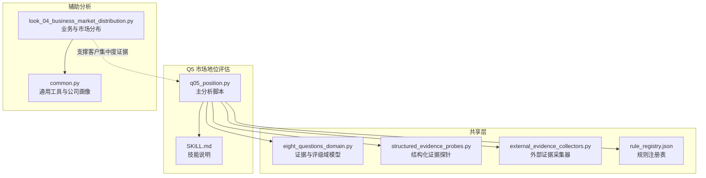
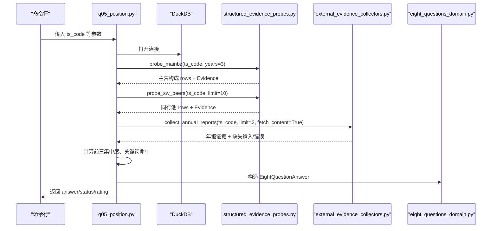
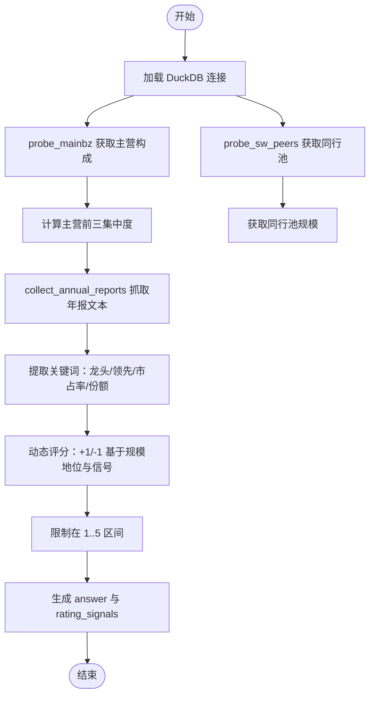
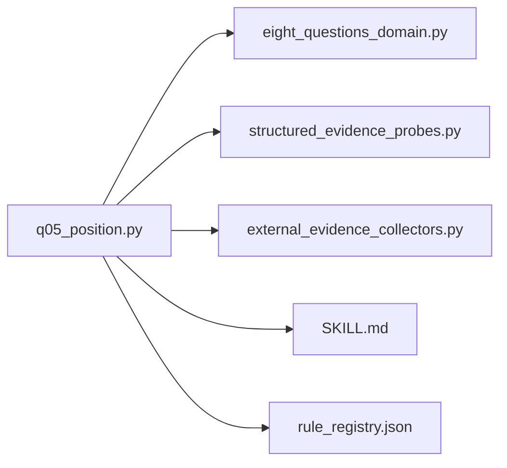

# Q5 市场地位评估

<cite>
**本文档引用的文件**
- [q05_position.py](file://2min-company-analysis/ask-q5-market-position/scripts/q05_position.py)
- [SKILL.md](file://2min-company-analysis/ask-q5-market-position/SKILL.md)
- [eight_questions_domain.py](file://2min-company-analysis/seven-look-eight-question/scripts/eight_questions_domain.py)
- [structured_evidence_probes.py](file://2min-company-analysis/seven-look-eight-question/scripts/structured_evidence_probes.py)
- [external_evidence_collectors.py](file://2min-company-analysis/seven-look-eight-question/scripts/external_evidence_collectors.py)
- [rule_registry.json](file://2min-company-analysis/seven-look-eight-question/assets/rule_registry.json)
- [look_04_business_market_distribution.py](file://2min-company-analysis/look-04-business-market-distribution/scripts/look_04_business_market_distribution.py)
- [common.py](file://2min-company-analysis/look-04-business-market-distribution/scripts/common.py)
</cite>

## 目录
1. [简介](#简介)
2. [项目结构](#项目结构)
3. [核心组件](#核心组件)
4. [架构总览](#架构总览)
5. [详细组件分析](#详细组件分析)
6. [依赖关系分析](#依赖关系分析)
7. [性能考虑](#性能考虑)
8. [故障排除指南](#故障排除指南)
9. [结论](#结论)
10. [附录](#附录)

## 简介
本文件为 Q5 市场地位评估模块的技术文档，聚焦于企业市场地位的量化评估与分析框架。该模块基于“七看八问”框架，围绕市场份额、品牌影响力、客户集中度等关键指标，结合行业排名与竞争格局，构建动态评级体系，并提供可复现的分析流程与证据规范。文档同时涵盖指标计算方法、竞争优劣势分析、领导地位识别标准及实际案例的数据处理思路。

## 项目结构
Q5 市场地位评估模块位于 `2min-company-analysis/ask-q5-market-position` 目录，采用“技能（Skill）”形式独立运行，与其他八问模块同级。其核心文件包括：
- q05_position.py：主分析脚本，负责读取数据库结构化证据与年报文本证据，生成评级与证据信号。
- SKILL.md：技能说明文档，定义合格证据、反面信号、输入输出与真实视图约束。
- seven-look-eight-question/scripts：共享领域模型与证据规范，提供统一的证据结构、来源类型与评级框架。
- look-04-business-market-distribution：提供业务构成与市场分布的证据收集与分析能力，为 Q5 的客户集中度与市场分布提供支撑。

**图表来源**
- [q05_position.py:1-129](file://2min-company-analysis/ask-q5-market-position/scripts/q05_position.py#L1-L129)
- [SKILL.md:1-65](file://2min-company-analysis/ask-q5-market-position/SKILL.md#L1-L65)
- [eight_questions_domain.py:1-324](file://2min-company-analysis/seven-look-eight-question/scripts/eight_questions_domain.py#L1-L324)
- [structured_evidence_probes.py:1-386](file://2min-company-analysis/seven-look-eight-question/scripts/structured_evidence_probes.py#L1-L386)
- [external_evidence_collectors.py:1-524](file://2min-company-analysis/seven-look-eight-question/scripts/external_evidence_collectors.py#L1-L524)
- [rule_registry.json:311-333](file://2min-company-analysis/seven-look-eight-question/assets/rule_registry.json#L311-L333)
- [look_04_business_market_distribution.py:1-558](file://2min-company-analysis/look-04-business-market-distribution/scripts/look_04_business_market_distribution.py#L1-L558)
- [common.py:1-154](file://2min-company-analysis/look-04-business-market-distribution/scripts/common.py#L1-L154)

**章节来源**
- [q05_position.py:1-129](file://2min-company-analysis/ask-q5-market-position/scripts/q05_position.py#L1-L129)
- [SKILL.md:1-65](file://2min-company-analysis/ask-q5-market-position/SKILL.md#L1-L65)

## 核心组件
- 证据与评级域模型（eight_questions_domain.py）
  - 定义证据来源类型（PRIMARY、REGULATORY、DB、INDUSTRY_REPORT、NEWS、IR_MEETING）及其权重。
  - 统一的 EightQuestionAnswer 结构，支持证据集合、状态、缺失输入、人工介入请求与动态评级信号。
- 结构化证据探针（structured_evidence_probes.py）
  - 提供从 DuckDB 查询 fin_mainbz（主营构成）与 idx_sw_l3_peers（申万三级同行池）的能力，并生成证据单元。
- 外部证据采集器（external_evidence_collectors.py）
  - 统一封装外部 MCP 工具，采集年报、公告、行业研报、IR 会议纪要等，返回标准化的 CollectResult。
- Q5 主分析脚本（q05_position.py）
  - 聚合结构化证据与年报文本证据，计算前三集中度、关键词命中数，动态调整评级，输出证据信号与最终答案。

**章节来源**
- [eight_questions_domain.py:26-212](file://2min-company-analysis/seven-look-eight-question/scripts/eight_questions_domain.py#L26-L212)
- [structured_evidence_probes.py:215-272](file://2min-company-analysis/seven-look-eight-question/scripts/structured_evidence_probes.py#L215-L272)
- [external_evidence_collectors.py:140-194](file://2min-company-analysis/seven-look-eight-question/scripts/external_evidence_collectors.py#L140-L194)
- [q05_position.py:46-120](file://2min-company-analysis/ask-q5-market-position/scripts/q05_position.py#L46-L120)

## 架构总览
Q5 的分析流程遵循“证据驱动”的原则：先通过结构化探针获取主营构成与同行池，再通过外部证据采集器获取年报文本证据，最后在主分析脚本中完成指标计算与评级。

**图表来源**
- [q05_position.py:46-120](file://2min-company-analysis/ask-q5-market-position/scripts/q05_position.py#L46-L120)
- [structured_evidence_probes.py:215-272](file://2min-company-analysis/seven-look-eight-question/scripts/structured_evidence_probes.py#L215-L272)
- [external_evidence_collectors.py:140-194](file://2min-company-analysis/seven-look-eight-question/scripts/external_evidence_collectors.py#L140-L194)
- [eight_questions_domain.py:123-212](file://2min-company-analysis/seven-look-eight-question/scripts/eight_questions_domain.py#L123-L212)

## 详细组件分析

### 指标体系与分析框架
- 市场份额与规模地位
  - 通过“同行池规模 ≥20 且 主营前3集中度 ≥60%”作为规模地位的动态加分项，反映头部集中度与行业集中度。
- 品牌影响力与市场认知
  - 通过年报文本中“龙头/行业领先/市占率第一/市场第一/份额领先”等关键词命中数进行正向激励。
- 竞争压力与落后信号
  - 通过“份额下降/客户流失/竞争激烈/份额萎缩”等关键词命中数进行负面扣分，抑制伪龙头评级。
- 评级基线与范围
  - 基线为3分，上限5分，下限1分，综合规模地位、品牌信号与竞争信号得出最终评级。

**图表来源**
- [q05_position.py:36-107](file://2min-company-analysis/ask-q5-market-position/scripts/q05_position.py#L36-L107)
- [structured_evidence_probes.py:215-272](file://2min-company-analysis/seven-look-eight-question/scripts/structured_evidence_probes.py#L215-L272)
- [external_evidence_collectors.py:140-194](file://2min-company-analysis/seven-look-eight-question/scripts/external_evidence_collectors.py#L140-L194)

**章节来源**
- [q05_position.py:32-107](file://2min-company-analysis/ask-q5-market-position/scripts/q05_position.py#L32-L107)
- [SKILL.md:24-34](file://2min-company-analysis/ask-q5-market-position/SKILL.md#L24-L34)

### 关键指标计算方法
- 主营前三集中度
  - 计算逻辑：取最新期末主营构成，对前三大主营项销售额求和，除以总销售额，得到前三集中度。
  - 适用场景：衡量企业核心业务集中度，集中度过高可能带来单一业务风险，过低可能缺乏规模效应。
- 同行池规模
  - 通过 idx_sw_l3_peers 视图返回的 peer_group_size 表征行业规模，用于判断是否具备足够的可比性。
- 品牌影响力关键词
  - 关键词集合包括“市占率第一”“龙头”“行业领先”“市场第一”“份额领先”等，用于识别年报中对自身市场地位的表述。
- 竞争压力关键词
  - 关键词集合包括“份额下降”“客户流失”“竞争激烈”“份额萎缩”等，用于识别年报中对市场不利因素的表述。

**章节来源**
- [q05_position.py:36-99](file://2min-company-analysis/ask-q5-market-position/scripts/q05_position.py#L36-L99)
- [structured_evidence_probes.py:246-272](file://2min-company-analysis/seven-look-eight-question/scripts/structured_evidence_probes.py#L246-L272)
- [SKILL.md:29-33](file://2min-company-analysis/ask-q5-market-position/SKILL.md#L29-L33)

### 行业排名分析与竞争格局评估
- 行业分类与可比公司筛选
  - 使用 idx_sw_l3_peers 视图，按申万三级行业分类筛选可比公司，返回同行池规模与样例公司清单。
- 竞争格局评估
  - 通过同行池规模与主营前三集中度共同判断企业是否具备“规模地位”；若同行池规模较小或集中度不足，则需谨慎评估其市场领导力。
- 反面信号与风险控制
  - 若年报中出现“份额下降/客户流失/竞争激烈”等信号，将下调评级，避免将“伪龙头”误判为“真龙头”。

**章节来源**
- [structured_evidence_probes.py:246-272](file://2min-company-analysis/seven-look-eight-question/scripts/structured_evidence_probes.py#L246-L272)
- [SKILL.md:29-33](file://2min-company-analysis/ask-q5-market-position/SKILL.md#L29-L33)

### 市场集中度测量与领导地位识别
- 市场集中度测量
  - 以“主营前三集中度 ≥60%”作为集中度阈值，结合“同行池规模 ≥20”作为可比性门槛，综合判定企业是否具备显著的市场集中度优势。
- 领导地位识别标准
  - 正向信号：年报中出现“龙头/行业领先/市占率第一/市场第一/份额领先”等关键词。
  - 反向信号：出现“份额下降/客户流失/竞争激烈/份额萎缩”等关键词。
  - 动态评分：满足规模地位条件 + 正向信号命中 ≥1，额外加分；反向信号命中 ≥2，额外减分。

**章节来源**
- [q05_position.py:96-102](file://2min-company-analysis/ask-q5-market-position/scripts/q05_position.py#L96-L102)
- [SKILL.md:29-33](file://2min-company-analysis/ask-q5-market-position/SKILL.md#L29-L33)

### 市场地位评级方法与竞争优劣势分析
- 评级方法
  - 基线：3 分
  - 加分项：同行池规模 ≥20 且 主营前三集中度 ≥60%
  - 正向信号：年报关键词命中 ≥1
  - 反向信号：年报关键词命中 ≥2
  - 评分范围：1..5，最终评级经 clamp 限制。
- 竞争优劣势分析
  - 优势：规模地位突出、品牌信号强、客户集中度合理、行业排名靠前。
  - 劣势：客户过度集中、年报披露存在负面信号、行业竞争加剧。
  - 建议：结合 look-04 的客户集中度证据与海外/区域销售证据，进一步验证“伪龙头”风险。

**章节来源**
- [q05_position.py:95-112](file://2min-company-analysis/ask-q5-market-position/scripts/q05_position.py#L95-L112)
- [look_04_business_market_distribution.py:18-77](file://2min-company-analysis/look-04-business-market-distribution/scripts/look_04_business_market_distribution.py#L18-L77)

### 实际分析案例与数据处理示例
- 案例流程
  - 输入：股票代码 ts_code，可选分析日期与输出目录。
  - 步骤：连接 DuckDB → 获取主营构成与同行池 → 抓取年报文本 → 计算指标 → 生成评级与证据信号 → 输出 answer。
- 数据处理要点
  - 证据来源必须可追溯：PRIMARY（年报）、DB（结构化指标）、REGULATORY（监管披露）、INDUSTRY_REPORT（券商观点）、NEWS（新闻舆情）、IR_MEETING（公司口径）。
  - 缺少年报文本证据时，状态降级为 partial 或 human-in-loop-required，不得自行编造市占率。
  - 人工介入请求优先级最高，将导致状态直接降级为 human-in-loop-required。

**章节来源**
- [SKILL.md:35-65](file://2min-company-analysis/ask-q5-market-position/SKILL.md#L35-L65)
- [eight_questions_domain.py:168-186](file://2min-company-analysis/seven-look-eight-question/scripts/eight_questions_domain.py#L168-L186)

## 依赖关系分析
Q5 模块依赖关系如下：
- q05_position.py 依赖：
  - eight_questions_domain.py：证据与评级域模型。
  - structured_evidence_probes.py：结构化证据探针（主营构成、同行池）。
  - external_evidence_collectors.py：外部证据采集器（年报文本）。
  - SKILL.md：技能说明与证据要求。
  - rule_registry.json：规则注册表，体现 Q5 的派生指标与数据状态。

**图表来源**
- [q05_position.py:22-25](file://2min-company-analysis/ask-q5-market-position/scripts/q05_position.py#L22-L25)
- [eight_questions_domain.py:1-324](file://2min-company-analysis/seven-look-eight-question/scripts/eight_questions_domain.py#L1-L324)
- [structured_evidence_probes.py:1-386](file://2min-company-analysis/seven-look-eight-question/scripts/structured_evidence_probes.py#L1-L386)
- [external_evidence_collectors.py:1-524](file://2min-company-analysis/seven-look-eight-question/scripts/external_evidence_collectors.py#L1-L524)
- [rule_registry.json:311-333](file://2min-company-analysis/seven-look-eight-question/assets/rule_registry.json#L311-L333)

**章节来源**
- [rule_registry.json:311-333](file://2min-company-analysis/seven-look-eight-question/assets/rule_registry.json#L311-L333)

## 性能考虑
- DuckDB 查询优化
  - 仅查询最新几年的 fin_mainbz 数据，减少扫描范围。
  - 合理使用索引与视图（idx_sw_l3_peers）提升同行池查询效率。
- 外部证据采集
  - 默认不下载年报正文，仅抓取列表，必要时再按需拉取正文，平衡成本与效果。
- 证据校验与降级
  - 严格校验证据来源与内容长度，避免无效证据影响评级稳定性。
  - 通过 finalize_status 自动降级策略，确保状态与证据一致性。

[本节为通用指导，无需特定文件来源]

## 故障排除指南
- DuckDB 文件不可访问
  - 现象：连接失败，返回“DuckDB 不可访问”。
  - 处理：检查 db_path 是否正确，确认数据文件存在。
- 年报采集失败
  - 现象：requires_human 为真，返回错误类型与缺失输入提示。
  - 处理：根据 error_type 分类处理（网络失败可降级为 partial；环境变量缺失需人工介入）。
- 缺少年报文本证据
  - 现象：状态为 partial，提示需要最新年报全文以提取客户/市占率。
  - 处理：补充年报文本证据或升级到更高层级行业对比。
- 人工介入请求
  - 现象：human_in_loop_requests 非空，状态直接降级为 human-in-loop-required。
  - 处理：优先解决人工请求，再重新运行分析。

**章节来源**
- [q05_position.py:52-82](file://2min-company-analysis/ask-q5-market-position/scripts/q05_position.py#L52-L82)
- [external_evidence_collectors.py:119-133](file://2min-company-analysis/seven-look-eight-question/scripts/external_evidence_collectors.py#L119-L133)
- [eight_questions_domain.py:168-186](file://2min-company-analysis/seven-look-eight-question/scripts/eight_questions_domain.py#L168-L186)

## 结论
Q5 市场地位评估模块通过“证据驱动”的方法，将结构化指标与年报文本证据相结合，构建了包含规模地位、品牌影响力与竞争压力的动态评级体系。模块在保证证据可追溯与状态一致性的同时，提供了明确的反面信号与人工介入机制，有效降低了“伪龙头”误判的风险。建议在实际应用中结合 look-04 的客户集中度证据与海外/区域销售证据，进一步完善竞争优劣势分析。

[本节为总结性内容，无需特定文件来源]

## 附录
- 关键词集合
  - 正向信号：市占率第一、龙头、行业领先、市场第一、份额领先
  - 反向信号：份额下降、客户流失、竞争激烈、份额萎缩
- 派生指标与数据状态
  - 派生指标：top3_concentration、peer_group_size、leader_keyword_hits
  - 数据状态：mixed-evidence，依赖 fin_mainbz、idx_sw_l3_peers 与年报文本证据

**章节来源**
- [SKILL.md:24-34](file://2min-company-analysis/ask-q5-market-position/SKILL.md#L24-L34)
- [rule_registry.json:318-329](file://2min-company-analysis/seven-look-eight-question/assets/rule_registry.json#L318-L329)