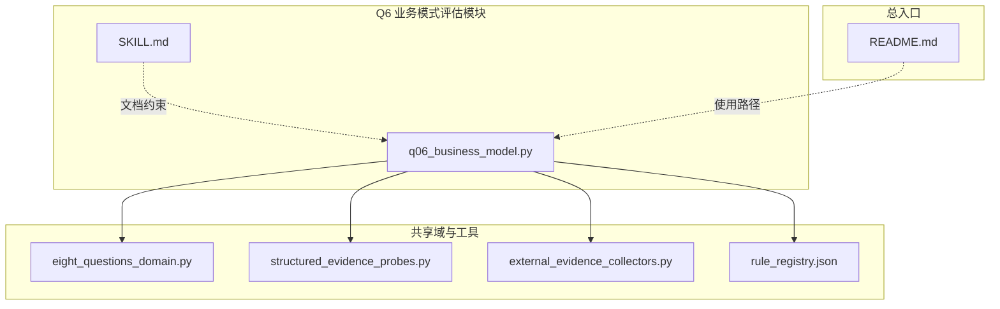
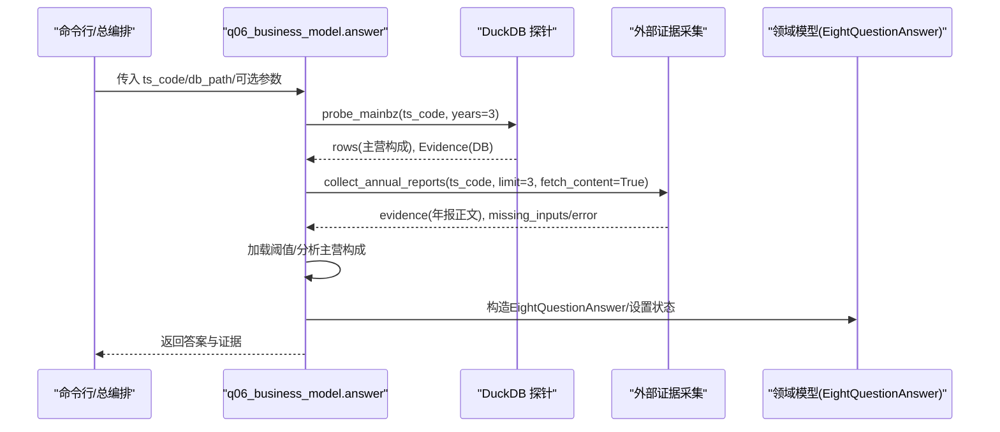
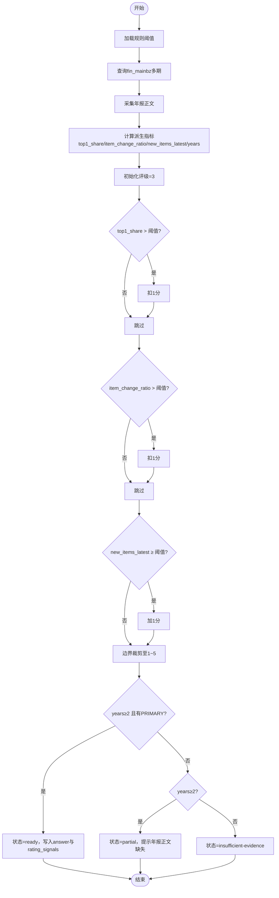
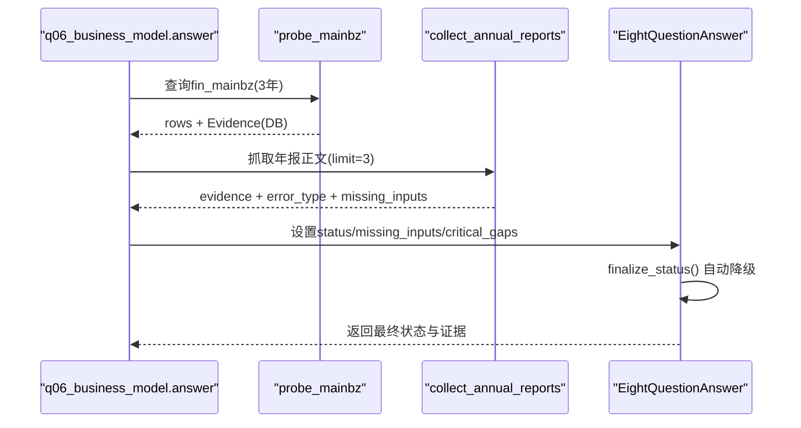
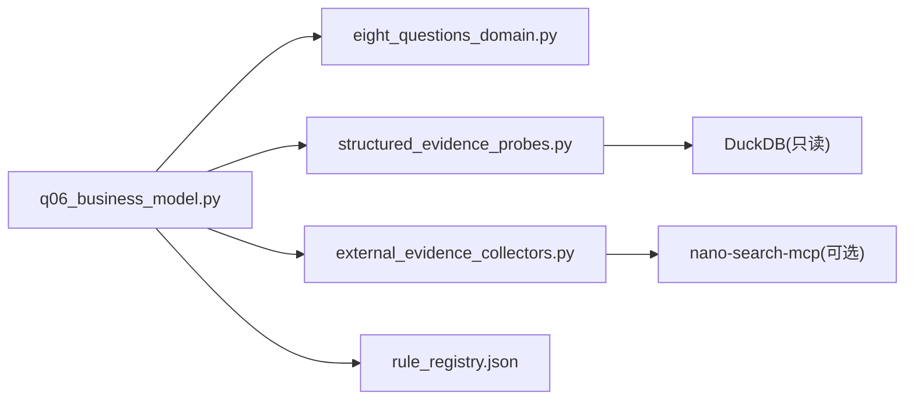

# Q6 业务模式评估

<cite>
**本文引用的文件**
- [q06_business_model.py](file://2min-company-analysis/ask-q6-business-model/scripts/q06_business_model.py)
- [SKILL.md](file://2min-company-analysis/ask-q6-business-model/SKILL.md)
- [eight_questions_domain.py](file://2min-company-analysis/seven-look-eight-question/scripts/eight_questions_domain.py)
- [structured_evidence_probes.py](file://2min-company-analysis/seven-look-eight-question/scripts/structured_evidence_probes.py)
- [external_evidence_collectors.py](file://2min-company-analysis/seven-look-eight-question/scripts/external_evidence_collectors.py)
- [rule_registry.json](file://2min-company-analysis/seven-look-eight-question/assets/rule_registry.json)
- [README.md](file://2min-company-analysis/README.md)
</cite>

## 目录
1. [简介](#简介)
2. [项目结构](#项目结构)
3. [核心组件](#核心组件)
4. [架构总览](#架构总览)
5. [详细组件分析](#详细组件分析)
6. [依赖关系分析](#依赖关系分析)
7. [性能考量](#性能考量)
8. [故障排查指南](#故障排查指南)
9. [结论](#结论)
10. [附录](#附录)

## 简介
本文件面向“七看八问”框架下的Q6业务模式评估模块，系统化阐述其技术实现、数据流与决策逻辑，并结合仓库现有能力，给出商业模式评估的理论基础、分析维度与实践方法。重点包括：
- 业务模式稳定性与第二曲线识别
- 收入结构与单一依赖风险评估
- 成本结构与运营效率的协同分析
- 外部证据（年报正文、行业政策、研报、IR纪要等）的采集与整合
- 评级信号与置信度控制
- 实战案例与评估框架示例

## 项目结构
Q6业务模式评估位于“ask-q6-business-model”子模块，采用“独立技能（skill）”形式，可单独运行，亦可并入“七看八问”总编排流程。其核心文件与职责如下：
- q06_business_model.py：业务模式评估主逻辑，负责加载阈值、分析主营构成、生成评级与证据信号
- SKILL.md：技能说明文档，定义输入输出、证据要求与执行方式
- eight_questions_domain.py：八问共享领域模型（证据、来源类型、答案容器等）
- structured_evidence_probes.py：结构化证据探针（DuckDB查询封装，提供fin_mainbz等）
- external_evidence_collectors.py：外部证据采集器（年报、公告、研报、IR、监管处罚等）
- rule_registry.json：规则注册表，定义Q6阈值、派生指标与脚本映射
- README.md：模块总体说明与使用路径

图表来源
- [q06_business_model.py:1-165](file://2min-company-analysis/ask-q6-business-model/scripts/q06_business_model.py#L1-L165)
- [eight_questions_domain.py:1-324](file://2min-company-analysis/seven-look-eight-question/scripts/eight_questions_domain.py#L1-L324)
- [structured_evidence_probes.py:1-386](file://2min-company-analysis/seven-look-eight-question/scripts/structured_evidence_probes.py#L1-L386)
- [external_evidence_collectors.py:1-524](file://2min-company-analysis/seven-look-eight-question/scripts/external_evidence_collectors.py#L1-L524)
- [rule_registry.json:334-360](file://2min-company-analysis/seven-look-eight-question/assets/rule_registry.json#L334-L360)
- [README.md:1-132](file://2min-company-analysis/README.md#L1-L132)

章节来源
- [README.md:1-132](file://2min-company-analysis/README.md#L1-L132)
- [SKILL.md:1-61](file://2min-company-analysis/ask-q6-business-model/SKILL.md#L1-L61)

## 核心组件
- 证据与来源类型
  - 来源类型枚举与权重：PRIMARY（定期报告/法定披露）、REGULATORY（监管披露）、DB（结构化数据库）、INDUSTRY_REPORT（券商研报）、NEWS（新闻/舆情）、IR_MEETING（IR/调研纪要）
  - Evidence数据类：强制校验excerpt非空、ISO时间格式、权重与预测标记
- 答案容器EightQuestionAnswer：承载评级、证据、状态、缺失输入、人工介入请求、关键缺口与动态信号
- 结构化证据探针probe_mainbz：从fin_mainbz多期查询主营构成，返回rows与Evidence
- 外部证据采集collect_annual_reports：抓取年报列表与正文，返回证据与错误分类
- Q6主逻辑answer：加载阈值、分析主营构成、生成评级与信号、决定状态

章节来源
- [eight_questions_domain.py:26-120](file://2min-company-analysis/seven-look-eight-question/scripts/eight_questions_domain.py#L26-L120)
- [eight_questions_domain.py:123-213](file://2min-company-analysis/seven-look-eight-question/scripts/eight_questions_domain.py#L123-L213)
- [structured_evidence_probes.py:215-244](file://2min-company-analysis/seven-look-eight-question/scripts/structured_evidence_probes.py#L215-L244)
- [external_evidence_collectors.py:140-194](file://2min-company-analysis/seven-look-eight-question/scripts/external_evidence_collectors.py#L140-L194)
- [q06_business_model.py:34-59](file://2min-company-analysis/ask-q6-business-model/scripts/q06_business_model.py#L34-L59)
- [q06_business_model.py:91-156](file://2min-company-analysis/ask-q6-business-model/scripts/q06_business_model.py#L91-L156)

## 架构总览
Q6业务模式评估遵循“证据驱动”的闭环：从结构化数据与外部证据采集开始，经过规则阈值与派生指标计算，形成评级与信号，最终输出到总报告。

图表来源
- [q06_business_model.py:91-156](file://2min-company-analysis/ask-q6-business-model/scripts/q06_business_model.py#L91-L156)
- [structured_evidence_probes.py:215-244](file://2min-company-analysis/seven-look-eight-question/scripts/structured_evidence_probes.py#L215-L244)
- [external_evidence_collectors.py:140-194](file://2min-company-analysis/seven-look-eight-question/scripts/external_evidence_collectors.py#L140-L194)
- [eight_questions_domain.py:123-213](file://2min-company-analysis/seven-look-eight-question/scripts/eight_questions_domain.py#L123-L213)

## 详细组件分析

### 组件A：业务模式稳定性与第二曲线识别
- 派生指标
  - top1_share：最新一年主营第一大项目的销售收入占比
  - item_change_ratio：最新与最早年份主营条目集合的对称差分比例
  - new_items_latest：最新年新增主营条目数量
  - years：可比会计年度数
- 评级基线与阈值
  - 基线：动态评级3分
  - 扣分条件：top1_share > 阈值（默认0.8）→ -1
  - 扣分条件：item_change_ratio > 阈值（默认0.5）→ -1
  - 加分条件：new_items_latest ≥ 阈值（默认1）→ +1
  - 最终评级：限制在1~5之间
- 合格证据
  - 至少3年fin_mainbz快照
  - 年报正文（业务概览/分部披露）以确认商业模式类型与稳定性
- 状态判定
  - 有PRIMARY证据且years≥2：ready
  - years≥2但缺少年报正文：partial
  - 否则：insufficient-evidence

图表来源
- [q06_business_model.py:34-59](file://2min-company-analysis/ask-q6-business-model/scripts/q06_business_model.py#L34-L59)
- [q06_business_model.py:62-88](file://2min-company-analysis/ask-q6-business-model/scripts/q06_business_model.py#L62-L88)
- [q06_business_model.py:127-156](file://2min-company-analysis/ask-q6-business-model/scripts/q06_business_model.py#L127-L156)
- [rule_registry.json:350-354](file://2min-company-analysis/seven-look-eight-question/assets/rule_registry.json#L350-L354)

章节来源
- [q06_business_model.py:62-88](file://2min-company-analysis/ask-q6-business-model/scripts/q06_business_model.py#L62-L88)
- [q06_business_model.py:127-156](file://2min-company-analysis/ask-q6-business-model/scripts/q06_business_model.py#L127-L156)
- [SKILL.md:24-61](file://2min-company-analysis/ask-q6-business-model/SKILL.md#L24-L61)
- [rule_registry.json:350-354](file://2min-company-analysis/seven-look-eight-question/assets/rule_registry.json#L350-L354)

### 组件B：证据采集与整合
- 结构化证据
  - fin_mainbz：主营构成多期快照，提供bz_item、bz_sales、bz_profit、bz_cost等字段
- 外部证据
  - 年报正文：fetch_reports(annual)，支持limit与按需fetch_content
  - 公告、研报、IR会议、监管处罚等：按需采集，统一包装为Evidence
- 错误分类与降级策略
  - env_missing/module_missing/upstream_contract_break/source_disabled：必须人工介入
  - network_fail/not_found：可降级为partial/insufficient-evidence
- 状态收敛
  - EightQuestionAnswer.finalize_status：根据missing_inputs与human_in_loop_requests自动降级

图表来源
- [structured_evidence_probes.py:215-244](file://2min-company-analysis/seven-look-eight-question/scripts/structured_evidence_probes.py#L215-L244)
- [external_evidence_collectors.py:140-194](file://2min-company-analysis/seven-look-eight-question/scripts/external_evidence_collectors.py#L140-L194)
- [eight_questions_domain.py:168-186](file://2min-company-analysis/seven-look-eight-question/scripts/eight_questions_domain.py#L168-L186)

章节来源
- [structured_evidence_probes.py:215-244](file://2min-company-analysis/seven-look-eight-question/scripts/structured_evidence_probes.py#L215-L244)
- [external_evidence_collectors.py:140-194](file://2min-company-analysis/seven-look-eight-question/scripts/external_evidence_collectors.py#L140-L194)
- [eight_questions_domain.py:168-186](file://2min-company-analysis/seven-look-eight-question/scripts/eight_questions_domain.py#L168-L186)

### 组件C：评级信号与置信度
- 评级信号
  - years/top1_share/item_change_ratio/new_items_latest → rating
  - 用于审计追溯与复核
- 置信度
  - weighted_rating = rating × 平均证据权重（Evidence.weight）
  - 证据权重来自SourceType权重表

章节来源
- [q06_business_model.py:138-142](file://2min-company-analysis/ask-q6-business-model/scripts/q06_business_model.py#L138-L142)
- [eight_questions_domain.py:187-194](file://2min-company-analysis/seven-look-eight-question/scripts/eight_questions_domain.py#L187-L194)
- [eight_questions_domain.py:35-47](file://2min-company-analysis/seven-look-eight-question/scripts/eight_questions_domain.py#L35-L47)

### 组件D：与总编排与七看的关系
- Q6作为八问之一，可独立运行，也可并入“七看八问”总编排
- 总编排统一输出JSON/Markdown，Q6结果作为扩展字段合并
- 七看独立于Q6，Q6不依赖七看指标

章节来源
- [README.md:58-101](file://2min-company-analysis/README.md#L58-L101)

## 依赖关系分析
- 内部依赖
  - q06_business_model.py 依赖 eight_questions_domain.py（答案容器、证据、来源类型）、structured_evidence_probes.py（fin_mainbz探针）、external_evidence_collectors.py（年报采集）、rule_registry.json（阈值）
- 外部依赖
  - DuckDB：只读连接，查询fin_mainbz
  - nano-search-mcp：可选外部证据采集（年报、公告、研报、IR、监管处罚）

图表来源
- [q06_business_model.py:19-26](file://2min-company-analysis/ask-q6-business-model/scripts/q06_business_model.py#L19-L26)
- [structured_evidence_probes.py:28-31](file://2min-company-analysis/seven-look-eight-question/scripts/structured_evidence_probes.py#L28-L31)
- [external_evidence_collectors.py:150-157](file://2min-company-analysis/seven-look-eight-question/scripts/external_evidence_collectors.py#L150-L157)

章节来源
- [q06_business_model.py:19-26](file://2min-company-analysis/ask-q6-business-model/scripts/q06_business_model.py#L19-L26)
- [structured_evidence_probes.py:28-31](file://2min-company-analysis/seven-look-eight-question/scripts/structured_evidence_probes.py#L28-L31)
- [external_evidence_collectors.py:150-157](file://2min-company-analysis/seven-look-eight-question/scripts/external_evidence_collectors.py#L150-L157)

## 性能考量
- DuckDB查询
  - 仅查询fin_mainbz必要字段，按end_date降序与bz_sales排序，限制years期，避免全表扫描
- 外部采集
  - 默认不下载年报正文内容，减少网络与存储开销；按需fetch_content
  - 对MCP调用失败进行错误分类，避免重复重试导致资源浪费
- 答案收敛
  - finalize_status自动降级，避免无效等待，提升整体吞吐

章节来源
- [structured_evidence_probes.py:215-244](file://2min-company-analysis/seven-look-eight-question/scripts/structured_evidence_probes.py#L215-L244)
- [external_evidence_collectors.py:140-194](file://2min-company-analysis/seven-look-eight-question/scripts/external_evidence_collectors.py#L140-L194)
- [eight_questions_domain.py:168-186](file://2min-company-analysis/seven-look-eight-question/scripts/eight_questions_domain.py#L168-L186)

## 故障排查指南
- DuckDB不可访问
  - 现象：FileNotFoundError → critical_gaps + 状态=insufficient-evidence
  - 处理：检查db_path与文件权限
- 年报采集失败
  - 现象：error_type分类（env_missing/network_fail/upstream_contract_break/module_missing/source_disabled）
  - 处理：按错误类型采取人工介入或降级策略
- 证据不足
  - 现象：years<2 或缺少PRIMARY证据 → status=partial/insufficient-evidence
  - 处理：补充年报正文与fin_mainbz多期数据
- 评级置信度低
  - 现象：证据权重较低 → weighted_rating下降
  - 处理：增加高质量证据（PRIMARY/DB），减少预测/新闻类证据

章节来源
- [q06_business_model.py:98-104](file://2min-company-analysis/ask-q6-business-model/scripts/q06_business_model.py#L98-L104)
- [external_evidence_collectors.py:119-133](file://2min-company-analysis/seven-look-eight-question/scripts/external_evidence_collectors.py#L119-L133)
- [eight_questions_domain.py:168-186](file://2min-company-analysis/seven-look-eight-question/scripts/eight_questions_domain.py#L168-L186)

## 结论
Q6业务模式评估模块以“结构化数据+外部证据”为核心，通过阈值驱动的派生指标与评级信号，实现对业务稳定性与第二曲线的量化评估。其设计强调证据可追溯、状态可收敛与置信度可控，既可独立运行，也可无缝并入“七看八问”总编排。建议在实际应用中：
- 明确阈值参数，结合行业特性调整warning/bonus阈值
- 强化年报正文与分部披露的证据采集，提升稳定性判断准确性
- 将Q6结果与其他维度（如成本结构、增长趋势、风险因素）联动分析，形成更全面的商业模式画像

## 附录

### 附录A：评估框架示例（概念性）
以下为通用评估框架，用于指导实务分析与报告撰写（概念性，非代码映射）：
- 收入模式
  - 收入构成：主营条目占比、区域/客户集中度、产品线贡献
  - 收入确认：时点法/履约义务法、预收款与合同资产
- 成本结构
  - 直接/间接成本拆分、固定/变动成本占比、人工效率
- 价值主张
  - 客户痛点解决、差异化定位、护城河验证
- 盈利模式可持续性
  - 毛利率趋势、费用粘性、自由现金流与ROIC
- 客户获取成本与生命周期价值
  - 营销费用/收入、获客成本/用户数、LTV/CAC比值
- 平台经济与订阅模式
  - 网络效应、双边/多边市场、锁定效应、续费率与ARPU
- 商业模式创新与风险
  - 新业务披露、技术迭代风险、政策与监管风险

[本节为概念性内容，无需图表来源]