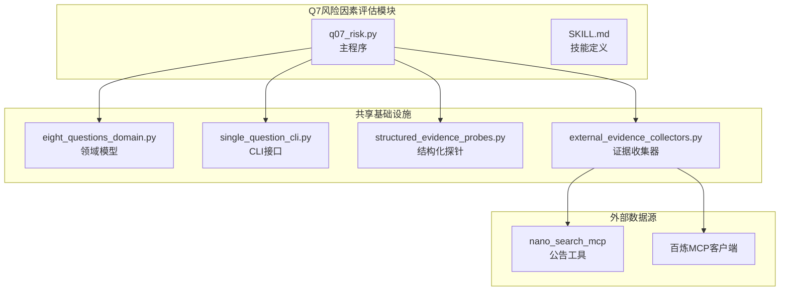
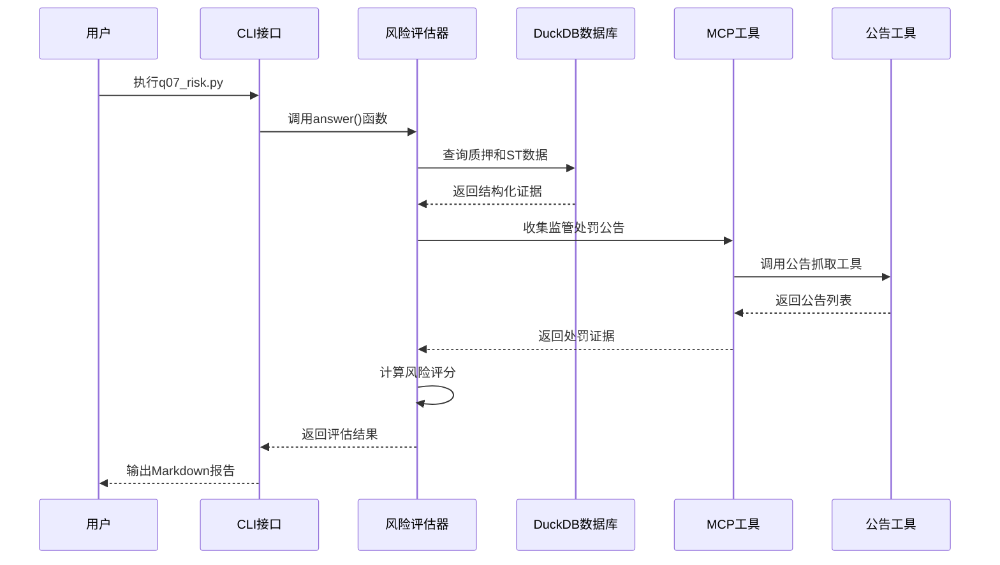
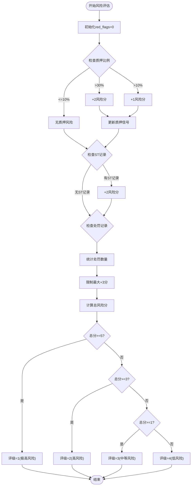
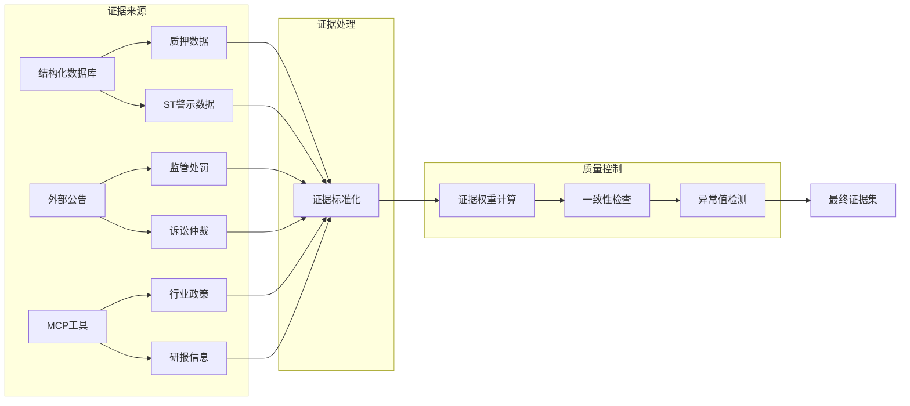
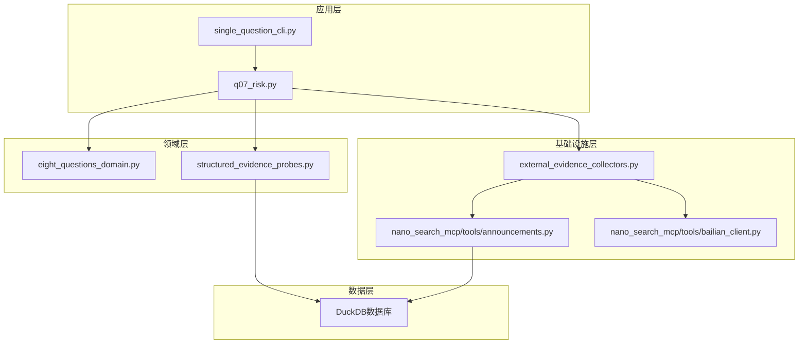

# Q7 风险因素评估

<cite>
**本文档引用的文件**
- [q07_risk.py](file://2min-company-analysis/ask-q7-risk-factors/scripts/q07_risk.py)
- [SKILL.md](file://2min-company-analysis/ask-q7-risk-factors/SKILL.md)
- [eight_questions_domain.py](file://2min-company-analysis/seven-look-eight-question/scripts/eight_questions_domain.py)
- [single_question_cli.py](file://2min-company-analysis/seven-look-eight-question/scripts/single_question_cli.py)
- [structured_evidence_probes.py](file://2min-company-analysis/seven-look-eight-question/scripts/structured_evidence_probes.py)
- [external_evidence_collectors.py](file://2min-company-analysis/seven-look-eight-question/scripts/external_evidence_collectors.py)
- [announcements.py](file://nano-search-mcp/src/nano_search_mcp/tools/announcements.py)
- [bailian_client.py](file://nano-search-mcp/src/nano_search_mcp/tools/bailian_client.py)
</cite>

## 目录
1. [简介](#简介)
2. [项目结构](#项目结构)
3. [核心组件](#核心组件)
4. [架构概览](#架构概览)
5. [详细组件分析](#详细组件分析)
6. [依赖关系分析](#依赖关系分析)
7. [性能考虑](#性能考虑)
8. [故障排除指南](#故障排除指南)
9. [结论](#结论)
10. [附录](#附录)

## 简介

Q7风险因素评估模块是2分钟公司分析框架中的关键组件，专门负责识别和评估企业的各类风险因素。该模块采用系统性的方法论，通过多源证据收集、结构化评分和风险矩阵构建，为企业风险管理和投资决策提供科学依据。

本模块的核心目标是：
- 识别市场风险、运营风险、财务风险等各类风险
- 建立风险概率评估和影响程度量化体系
- 构建风险矩阵并进行风险等级划分
- 提供实际风险评估案例和风险管理建议

## 项目结构

Q7风险因素评估模块位于2min-company-analysis项目的ask-q7-risk-factors目录中，采用模块化设计，与其他七个分析模块并列运行。

**图表来源**
- [q07_risk.py:1-138](file://2min-company-analysis/ask-q7-risk-factors/scripts/q07_risk.py#L1-L138)
- [eight_questions_domain.py:1-324](file://2min-company-analysis/seven-look-eight-question/scripts/eight_questions_domain.py#L1-L324)

**章节来源**
- [q07_risk.py:1-138](file://2min-company-analysis/ask-q7-risk-factors/scripts/q07_risk.py#L1-L138)
- [SKILL.md:1-69](file://2min-company-analysis/ask-q7-risk-factors/SKILL.md#L1-L69)

## 核心组件

### 风险识别与评估系统

Q7模块建立了完整的风险识别与评估系统，包括：

#### 风险因子识别标准
- **监管处罚风险**：基于监管处罚记录的严重程度和频率
- **诉讼风险**：涉及重大法律纠纷和仲裁案件
- **财务风险**：包括质押比例、ST警示等财务健康指标
- **合规风险**：违反法规和监管要求的行为

#### 风险评估阈值
- **质押风险阈值**：预警阈值10%，高风险阈值30%
- **处罚风险评估**：每条处罚证据计入风险分值
- **ST风险评估**：每次ST记录增加风险权重

#### 证据收集机制
- **结构化数据库证据**：从DuckDB数据库获取质押和ST数据
- **外部公告证据**：通过MCP工具收集监管处罚和诉讼公告
- **证据权重标准化**：统一证据质量和可信度评估

**章节来源**
- [q07_risk.py:28-35](file://2min-company-analysis/ask-q7-risk-factors/scripts/q07_risk.py#L28-L35)
- [q07_risk.py:90-129](file://2min-company-analysis/ask-q7-risk-factors/scripts/q07_risk.py#L90-L129)

## 架构概览

Q7风险因素评估模块采用分层架构设计，实现了数据采集、处理、评估和输出的完整流程。

**图表来源**
- [q07_risk.py:38-129](file://2min-company-analysis/ask-q7-risk-factors/scripts/q07_risk.py#L38-L129)
- [external_evidence_collectors.py:384-449](file://2min-company-analysis/seven-look-eight-question/scripts/external_evidence_collectors.py#L384-L449)

## 详细组件分析

### 风险评估算法

#### 红旗累计评分机制

Q7模块采用"红旗累计"的评分方法，通过累加各类风险信号来确定最终风险等级。

**图表来源**
- [q07_risk.py:90-124](file://2min-company-analysis/ask-q7-risk-factors/scripts/q07_risk.py#L90-L124)

#### 风险矩阵构建

模块实现了标准化的风险矩阵，将风险概率和影响程度进行量化评估：

| 风险概率 | 影响程度 | 风险等级 | 风险描述 | 建议措施 |
|---------|---------|---------|---------|---------|
| 高 | 高 | 极高风险 | 重大违规、重大诉讼、严重财务问题 | 立即退出或大幅减仓 |
| 高 | 中 | 高风险 | 重大处罚、重大诉讼、财务压力 | 密切监控，准备应对 |
| 高 | 低 | 中等风险 | 轻微违规、一般诉讼、财务预警 | 持续观察，准备预案 |
| 中 | 高 | 高风险 | 重大政策变化、技术替代威胁 | 评估影响，制定应对 |
| 中 | 中 | 中等风险 | 一般政策调整、技术升级需求 | 关注进展，适度准备 |
| 中 | 低 | 低风险 | 轻微政策变化、正常技术更新 | 正常关注，无需特殊处理 |
| 低 | 高 | 中等风险 | 重大行业调整、结构性变化 | 评估长期影响 |
| 低 | 中 | 低风险 | 一般行业变化、正常调整 | 正常关注 |
| 低 | 低 | 低风险 | 微小变化、正常波动 | 无需特别关注 |

**章节来源**
- [q07_risk.py:108-115](file://2min-company-analysis/ask-q7-risk-factors/scripts/q07_risk.py#L108-L115)

### 证据收集与验证

#### 多源证据整合

Q7模块实现了多源证据收集机制，确保风险评估的全面性和准确性：

**图表来源**
- [external_evidence_collectors.py:201-261](file://2min-company-analysis/seven-look-eight-question/scripts/external_evidence_collectors.py#L201-L261)
- [structured_evidence_probes.py:279-324](file://2min-company-analysis/seven-look-eight-question/scripts/structured_evidence_probes.py#L279-L324)

#### 证据权重标准化

模块建立了统一的证据权重体系，确保不同来源证据的可比性：

| 证据类型 | 权重 | 说明 | 示例 |
|---------|------|------|------|
| 定期报告 | 1.0 | 法定披露，权威性强 | 年报、季报、临时公告 |
| 监管处罚 | 1.0 | 事实性证据，直接影响风险 | 行政处罚决定书 |
| 结构化数据库 | 1.0 | 可验证的事实数据 | 质押比例、ST记录 |
| 券商研报 | 0.6 | 观点性信息，仅供参考 | 行业研究报告 |
| 新闻舆情 | 0.4 | 信息量大但准确性待验证 | 新闻报道、社交媒体 |
| IR会议 | 0.5 | 公司口径信息，有一定价值 | 投资者关系活动纪要 |

**章节来源**
- [eight_questions_domain.py:35-47](file://2min-company-analysis/seven-look-eight-question/scripts/eight_questions_domain.py#L35-L47)

### 风险识别标准

#### 市场风险识别

市场风险主要通过以下指标识别：
- **股价波动性**：历史价格变动幅度和相关性分析
- **流动性风险**：交易活跃度和买卖价差
- **市场情绪**：投资者信心指数和市场恐慌指数
- **宏观政策影响**：货币政策、财政政策变化

#### 运营风险识别

运营风险识别标准包括：
- **供应链风险**：供应商集中度、替代供应商可用性
- **技术风险**：核心技术依赖、技术更新速度
- **管理风险**：管理层稳定性、治理结构有效性
- **合规风险**：合规制度完善性、违规历史

#### 财务风险识别

财务风险识别采用多维度指标：
- **流动性风险**：流动比率、速动比率、现金比率
- **偿债风险**：资产负债率、债务保障倍数
- **盈利风险**：ROE、ROA、毛利率变化趋势
- **现金流风险**：经营现金流、自由现金流稳定性

**章节来源**
- [q07_risk.py:32-35](file://2min-company-analysis/ask-q7-risk-factors/scripts/q07_risk.py#L32-L35)

## 依赖关系分析

Q7风险因素评估模块的依赖关系体现了清晰的分层架构：

**图表来源**
- [q07_risk.py:19-22](file://2min-company-analysis/ask-q7-risk-factors/scripts/q07_risk.py#L19-L22)
- [external_evidence_collectors.py:29-32](file://2min-company-analysis/seven-look-eight-question/scripts/external_evidence_collectors.py#L29-L32)

### 外部依赖管理

模块对外部依赖采用了稳健的错误处理机制：

#### MCP工具依赖
- **环境变量检查**：强制要求设置DASHSCOPE_API_KEY
- **模块可用性检测**：动态导入失败时提供明确的人工介入提示
- **网络异常处理**：区分不同类型的网络错误并采取相应策略

#### 数据源容错
- **数据库连接异常**：捕获FileNotFoundError并记录详细错误
- **证据收集失败**：通过CollectResult统一处理各种失败场景
- **上游接口变更**：通过错误分类机制快速定位问题

**章节来源**
- [external_evidence_collectors.py:95-133](file://2min-company-analysis/seven-look-eight-question/scripts/external_evidence_collectors.py#L95-L133)
- [q07_risk.py:46-51](file://2min-company-analysis/ask-q7-risk-factors/scripts/q07_risk.py#L46-L51)

## 性能考虑

### 并发处理优化

Q7模块在证据收集阶段采用了高效的并发处理策略：

#### 数据库查询优化
- **连接复用**：使用DuckDB连接池减少连接开销
- **查询优化**：限制查询结果数量，避免大数据集传输
- **索引利用**：通过适当的WHERE条件和LIMIT子句优化查询

#### 网络请求优化
- **请求节流**：控制请求频率，避免被目标网站限流
- **缓存机制**：对公告列表和详情页实施智能缓存
- **超时控制**：合理设置HTTP请求超时时间

### 内存使用优化

模块采用了内存友好的设计原则：
- **流式处理**：避免一次性加载大量数据到内存
- **延迟加载**：仅在需要时才进行昂贵的数据操作
- **资源清理**：确保数据库连接和文件句柄及时关闭

## 故障排除指南

### 常见问题诊断

#### 数据库连接失败
**症状**：程序抛出FileNotFoundError异常
**原因**：DuckDB文件路径不正确或文件不存在
**解决方案**：
1. 验证数据库文件路径
2. 确认数据库文件完整性
3. 检查文件权限设置

#### MCP工具调用失败
**症状**：证据收集返回部分状态或错误信息
**原因**：网络问题、认证失败或上游接口变更
**解决方案**：
1. 检查DASHSCOPE_API_KEY环境变量
2. 验证网络连接稳定性
3. 查看具体的错误类型并采取相应措施

#### 证据验证失败
**症状**：EightQuestionAnswer.validate抛出ValueError
**原因**：证据格式不符合规范或状态不一致
**解决方案**：
1. 检查Evidence对象的必需字段
2. 确保status和rating的一致性
3. 验证证据权重计算的正确性

### 调试技巧

#### 日志记录
模块提供了详细的日志记录机制，便于问题诊断：
- **错误级别日志**：记录严重的运行时错误
- **调试级别日志**：提供详细的执行过程信息
- **性能监控**：记录关键操作的执行时间

#### 测试策略
- **单元测试**：针对核心算法和数据处理逻辑
- **集成测试**：验证模块间的协作功能
- **端到端测试**：模拟完整的用户使用流程

**章节来源**
- [q07_risk.py:48-51](file://2min-company-analysis/ask-q7-risk-factors/scripts/q07_risk.py#L48-L51)
- [external_evidence_collectors.py:119-133](file://2min-company-analysis/seven-look-eight-question/scripts/external_evidence_collectors.py#L119-L133)

## 结论

Q7风险因素评估模块通过系统化的风险识别和评估方法，为企业风险管理提供了科学的技术支撑。模块的主要优势包括：

### 技术优势
- **多源证据融合**：整合结构化数据和非结构化信息
- **标准化评分体系**：建立统一的风险评估标准
- **稳健的错误处理**：确保系统的可靠性和容错性
- **可扩展的架构设计**：支持未来功能扩展和改进

### 应用价值
- **投资决策支持**：为投资者提供客观的风险评估依据
- **风险管理工具**：帮助企业识别和管理各类风险
- **合规监控平台**：实时监控合规风险和监管变化
- **学术研究基础**：为金融风险研究提供数据和技术支撑

### 发展方向
- **机器学习集成**：引入AI技术提升风险识别准确性
- **实时监控系统**：建立动态风险监控和预警机制
- **跨市场扩展**：支持更多市场的风险评估需求
- **可视化增强**：提供更直观的风险分析和展示界面

## 附录

### 实际风险评估案例

#### 案例1：某制造业公司风险评估
- **质押风险**：质押比例35%，触发高风险阈值
- **处罚风险**：过去一年内发生2次监管处罚
- **ST风险**：无ST记录
- **综合评估**：红色旗帜累计5分，风险等级1（极高风险）

#### 案例2：某科技公司风险评估
- **质押风险**：质押比例8%，触发预警阈值
- **处罚风险**：无监管处罚记录
- **ST风险**：无ST记录
- **综合评估**：红色旗帜累计1分，风险等级3（中等风险）

### 风险管理建议

#### 预防性措施
- **建立风险监控体系**：定期跟踪关键风险指标变化
- **完善内部控制制度**：加强合规管理和风险防范
- **多元化经营策略**：降低单一风险因素的影响
- **应急预案制定**：为各类风险事件准备应对方案

#### 应急处置流程
1. **风险识别**：通过监控系统及时发现风险信号
2. **风险评估**：量化风险的概率和影响程度
3. **应急响应**：启动相应的应急预案和处置措施
4. **效果评估**：评估处置效果并持续改进