# Q8 未来规划评估

<cite>
**本文档引用的文件**
- [q08_future.py](file://2min-company-analysis/ask-q8-future-plan/scripts/q08_future.py)
- [eight_questions_domain.py](file://2min-company-analysis/seven-look-eight-question/scripts/eight_questions_domain.py)
- [eight_questions_orchestrator.py](file://2min-company-analysis/seven-look-eight-question/scripts/eight_questions_orchestrator.py)
- [structured_evidence_probes.py](file://2min-company-analysis/seven-look-eight-question/scripts/structured_evidence_probes.py)
- [external_evidence_collectors.py](file://2min-company-analysis/seven-look-eight-question/scripts/external_evidence_collectors.py)
- [single_question_cli.py](file://2min-company-analysis/seven-look-eight-question/scripts/single_question_cli.py)
- [rule_registry.json](file://2min-company-analysis/seven-look-eight-question/assets/rule_registry.json)
- [SKILL.md](file://2min-company-analysis/ask-q8-future-plan/SKILL.md)
- [README.md](file://2min-company-analysis/README.md)
</cite>

## 目录
1. [简介](#简介)
2. [项目结构](#项目结构)
3. [核心组件](#核心组件)
4. [架构概览](#架构概览)
5. [详细组件分析](#详细组件分析)
6. [依赖关系分析](#依赖关系分析)
7. [性能考虑](#性能考虑)
8. [故障排除指南](#故障排除指南)
9. [结论](#结论)
10. [附录](#附录)

## 简介

Q8未来规划评估模块是"七看八问"分析框架中的第八个问题模块，专门用于评估企业的未来发展规划和战略兑现能力。该模块通过整合结构化财务数据、外部证据收集和自动化分析流程，为企业未来规划的质量评级和增长潜力预测提供科学依据。

本模块的核心目标是验证"规划-执行-结果"的闭环，避免企业只做"画饼"而不落实的战略承诺。通过对业绩预告兑现率、IR调研纪要、年报未来展望等多维度证据的综合分析，为企业制定未来发展规划提供量化评估工具。

## 项目结构

整个分析框架采用模块化设计，遵循"七看八问"的整体架构：

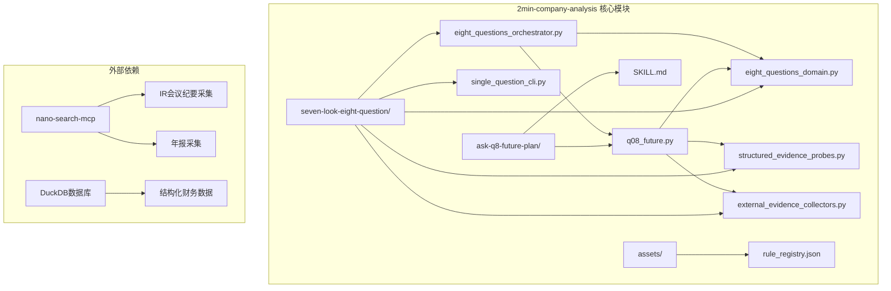

**图表来源**
- [q08_future.py:1-125](file://2min-company-analysis/ask-q8-future-plan/scripts/q08_future.py#L1-L125)
- [eight_questions_orchestrator.py:1-396](file://2min-company-analysis/seven-look-eight-question/scripts/eight_questions_orchestrator.py#L1-L396)

**章节来源**
- [README.md:1-132](file://2min-company-analysis/README.md#L1-L132)
- [SKILL.md:1-67](file://2min-company-analysis/ask-q8-future-plan/SKILL.md#L1-L67)

## 核心组件

### 1. 证据收集与验证系统

模块采用严格的证据收集和验证机制，确保所有分析结论都有可靠的事实支撑：

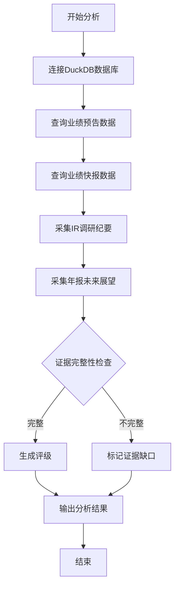

**图表来源**
- [q08_future.py:29-116](file://2min-company-analysis/ask-q8-future-plan/scripts/q08_future.py#L29-L116)

### 2. 评级标准体系

模块建立了完整的评级标准，采用1-5分的量化评分体系：

| 评级等级 | 分数范围 | 描述 | 适用条件 |
|---------|---------|------|---------|
| 优秀 | 4-5分 | 战略目标明确，执行能力强，业绩预告兑现率高 | 净利润变动中位数>30% |
| 良好 | 3分 | 战略规划合理，执行基本到位 | 基准评级 |
| 需关注 | 2分 | 存在执行问题，业绩预告偏差较大 | 净利润变动中位数<-30% |
| 风险 | 1分 | 战略目标模糊，执行严重不足 | 重大战略变更或长期无IR纪要 |

**章节来源**
- [q08_future.py:80-106](file://2min-company-analysis/ask-q8-future-plan/scripts/q08_future.py#L80-L106)

### 3. 证据权重系统

不同类型的证据具有不同的权重，确保分析结果的客观性和可靠性：

| 证据类型 | 权重系数 | 说明 |
|---------|---------|------|
| 定期报告/年报 | 1.0 | 法定披露，权威性最高 |
| 监管披露 | 1.0 | 官方监管信息，权威性高 |
| 结构化数据库 | 1.0 | 内部财务数据，准确性高 |
| 券商研报 | 0.6 | 第三方预测，仅供参考 |
| IR调研纪要 | 0.5 | 公司口径，可能存在主观性 |
| 新闻舆情 | 0.4 | 市场声音，时效性强 |

**章节来源**
- [eight_questions_domain.py:35-47](file://2min-company-analysis/seven-look-eight-question/scripts/eight_questions_domain.py#L35-L47)

## 架构概览

### 整体架构设计

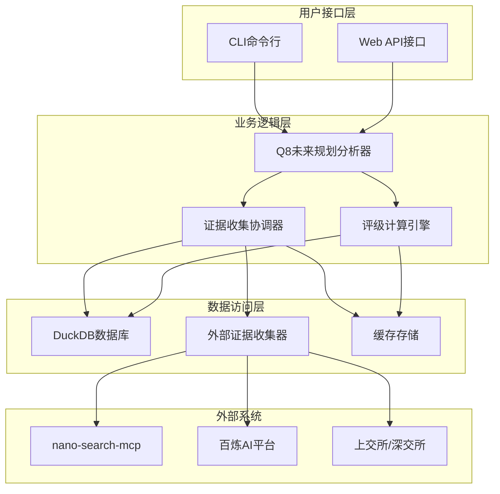

**图表来源**
- [eight_questions_orchestrator.py:110-164](file://2min-company-analysis/seven-look-eight-question/scripts/eight_questions_orchestrator.py#L110-L164)
- [external_evidence_collectors.py:1-524](file://2min-company-analysis/seven-look-eight-question/scripts/external_evidence_collectors.py#L1-L524)

### 数据流处理

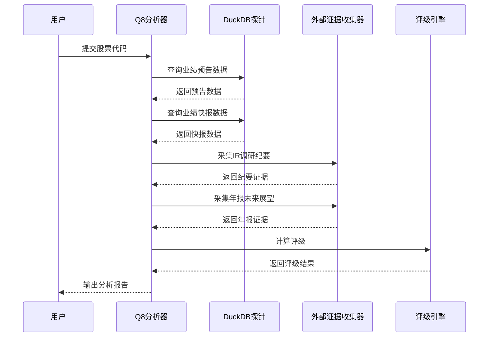

**图表来源**
- [q08_future.py:35-116](file://2min-company-analysis/ask-q8-future-plan/scripts/q08_future.py#L35-L116)

## 详细组件分析

### Q8未来规划分析器

#### 核心功能实现

Q8分析器是整个模块的核心组件，负责统筹协调各种证据收集和分析任务：

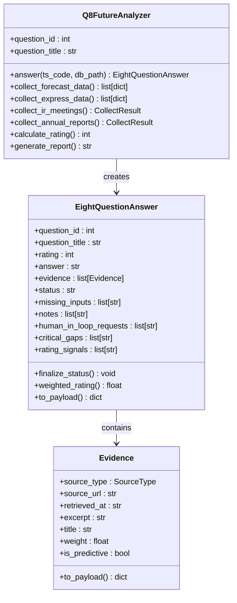

**图表来源**
- [q08_future.py:29-116](file://2min-company-analysis/ask-q8-future-plan/scripts/q08_future.py#L29-L116)
- [eight_questions_domain.py:123-212](file://2min-company-analysis/seven-look-eight-question/scripts/eight_questions_domain.py#L123-L212)

#### 评级计算逻辑

评级计算采用动态阈值机制，主要基于业绩预告的净利润变动中位数：

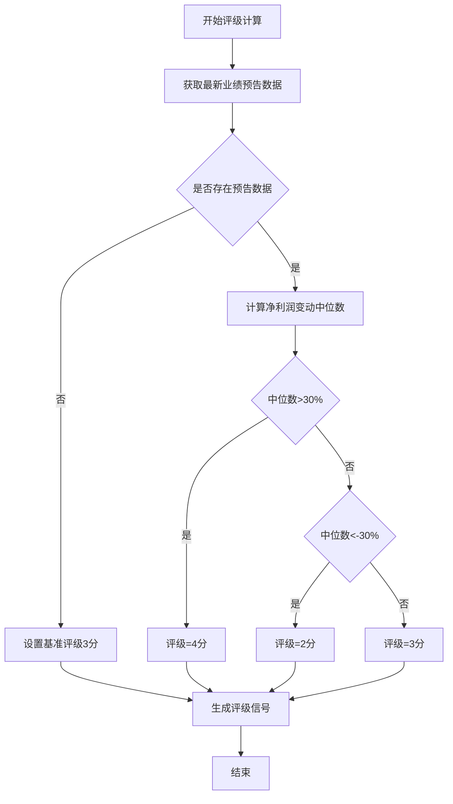

**图表来源**
- [q08_future.py:80-106](file://2min-company-analysis/ask-q8-future-plan/scripts/q08_future.py#L80-L106)

**章节来源**
- [q08_future.py:75-116](file://2min-company-analysis/ask-q8-future-plan/scripts/q08_future.py#L75-L116)

### 结构化证据探针

#### DuckDB数据查询

模块通过结构化探针从DuckDB数据库中提取关键财务指标：

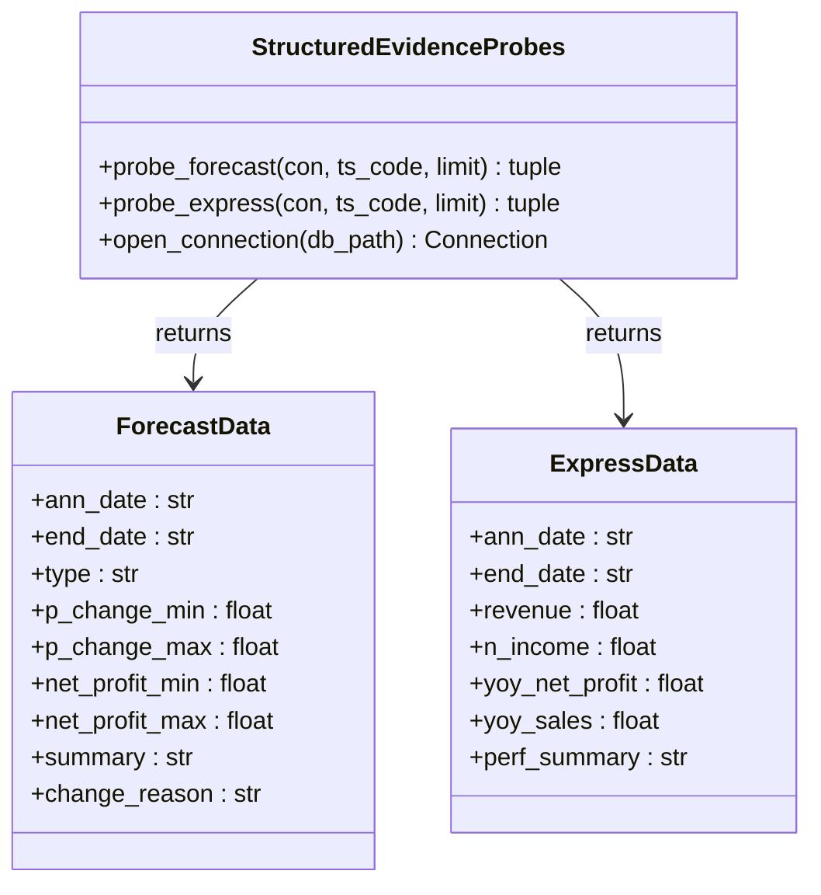

**图表来源**
- [structured_evidence_probes.py:332-376](file://2min-company-analysis/seven-look-eight-question/scripts/structured_evidence_probes.py#L332-L376)

#### 数据查询优化

探针采用SQL查询优化策略，确保数据获取的准确性和效率：

| 查询类型 | SQL特点 | 性能优化 |
|---------|--------|---------|
| 业绩预告查询 | 按公告日期倒序，限制数量 | 使用索引优化 |
| 业绩快报查询 | 按公告日期倒序，限制数量 | 使用LIMIT减少内存占用 |
| 多表关联查询 | 使用INNER JOIN确保数据完整性 | 预先过滤无效记录 |

**章节来源**
- [structured_evidence_probes.py:332-376](file://2min-company-analysis/seven-look-eight-question/scripts/structured_evidence_probes.py#L332-L376)

### 外部证据收集器

#### 多源证据整合

外部证据收集器负责从多个外部数据源获取相关信息：

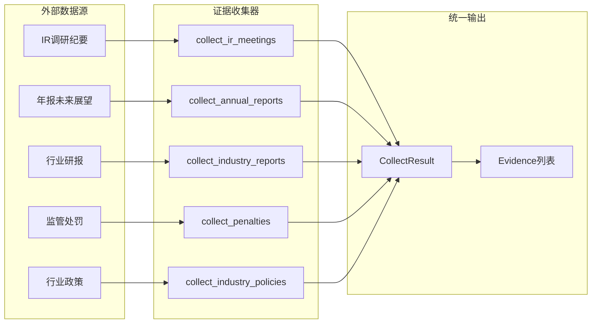

**图表来源**
- [external_evidence_collectors.py:327-376](file://2min-company-analysis/seven-look-eight-question/scripts/external_evidence_collectors.py#L327-L376)

#### 错误处理机制

外部证据收集器实现了完善的错误处理机制：

| 错误类型 | 处理策略 | 影响程度 |
|---------|---------|---------|
| 环境变量缺失 | 立即要求人工介入 | 阻塞 |
| 网络超时 | 降级为部分证据 | 可继续分析 |
| 数据源不可用 | 人工介入处理 | 阻塞 |
| 上游合约变更 | 人工介入修复 | 阻塞 |
| 模块缺失 | 人工介入安装 | 阻塞 |

**章节来源**
- [external_evidence_collectors.py:119-133](file://2min-company-analysis/seven-look-eight-question/scripts/external_evidence_collectors.py#L119-L133)

### 八问总编排器

#### 并发执行管理

八问总编排器负责协调多个问题模块的并发执行：

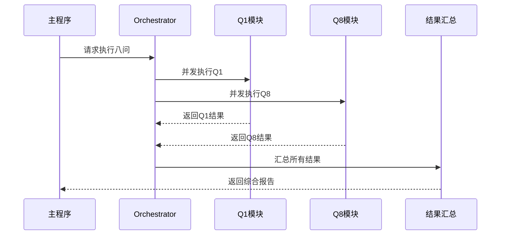

**图表来源**
- [eight_questions_orchestrator.py:119-163](file://2min-company-analysis/seven-look-eight-question/scripts/eight_questions_orchestrator.py#L119-L163)

#### 状态管理机制

总编排器实现了完善的状态管理机制：

| 状态类型 | 描述 | 处理方式 |
|---------|------|---------|
| ready | 完整证据，可直接评级 | 正常输出 |
| partial | 部分证据，需要补充 | 降级处理 |
| insufficient-evidence | 证据不足 | 无法评级 |
| human-in-loop-required | 需要人工介入 | 阻塞等待 |

**章节来源**
- [eight_questions_orchestrator.py:168-186](file://2min-company-analysis/seven-look-eight-question/scripts/eight_questions_orchestrator.py#L168-L186)

## 依赖关系分析

### 模块依赖图

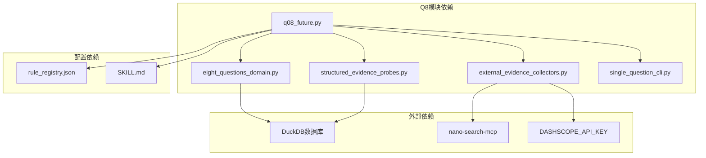

**图表来源**
- [q08_future.py:15-22](file://2min-company-analysis/ask-q8-future-plan/scripts/q08_future.py#L15-L22)
- [rule_registry.json:385-407](file://2min-company-analysis/seven-look-eight-question/assets/rule_registry.json#L385-L407)

### 数据依赖关系

模块的数据依赖关系体现了层次化的数据获取策略：

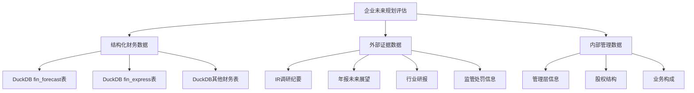

**图表来源**
- [q08_future.py:3-7](file://2min-company-analysis/ask-q8-future-plan/scripts/q08_future.py#L3-L7)

**章节来源**
- [q08_future.py:3-7](file://2min-company-analysis/ask-q8-future-plan/scripts/q08_future.py#L3-L7)

## 性能考虑

### 查询性能优化

模块在数据查询方面采用了多种优化策略：

1. **索引利用**: SQL查询中充分利用了时间字段索引，确保查询效率
2. **数据限制**: 通过LIMIT限制返回记录数量，避免内存溢出
3. **连接优化**: 使用只读连接，确保数据安全性和查询性能

### 并发处理策略

八问总编排器实现了高效的并发处理机制：

- **线程池管理**: 使用ThreadPoolExecutor控制最大并发数
- **异常隔离**: 单个模块的异常不影响其他模块的执行
- **资源回收**: 及时释放数据库连接和外部API资源

### 内存使用优化

模块在内存使用方面采取了以下措施：

- **流式处理**: 大量数据采用流式处理，避免一次性加载
- **延迟加载**: 外部证据内容按需加载，减少内存占用
- **缓存策略**: 合理使用缓存机制，平衡内存和性能

## 故障排除指南

### 常见问题诊断

#### 数据库连接问题

**症状**: 连接DuckDB数据库失败
**原因**: DuckDB文件不存在或权限不足
**解决方案**: 
1. 检查数据库文件路径
2. 确认文件存在且可读
3. 验证数据库文件完整性

#### 外部API调用失败

**症状**: IR调研纪要或年报采集失败
**原因**: 网络超时、API密钥缺失、服务不可用
**解决方案**:
1. 检查网络连接状态
2. 验证DASHSCOPE_API_KEY环境变量
3. 查看API服务状态
4. 调整重试策略

#### 证据收集不完整

**症状**: 某些证据类型缺失
**原因**: 数据源无匹配结果、权限不足、数据格式异常
**解决方案**:
1. 手动补充缺失的证据URL
2. 检查数据源可用性
3. 验证证据格式正确性

### 错误分类与处理

模块实现了详细的错误分类机制：

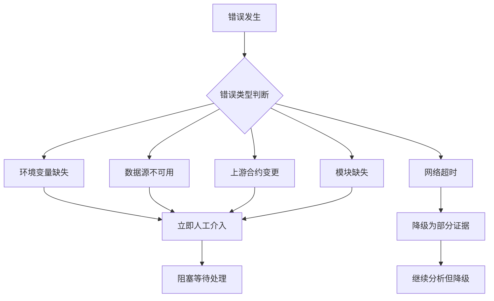

**图表来源**
- [external_evidence_collectors.py:119-133](file://2min-company-analysis/seven-look-eight-question/scripts/external_evidence_collectors.py#L119-L133)

**章节来源**
- [external_evidence_collectors.py:119-133](file://2min-company-analysis/seven-look-eight-question/scripts/external_evidence_collectors.py#L119-L133)

## 结论

Q8未来规划评估模块通过构建完整的证据收集、验证和分析体系，为企业未来发展规划提供了科学的量化评估工具。模块的主要优势包括：

1. **证据驱动**: 严格遵循证据铁律，确保所有结论都有可靠的事实支撑
2. **多源整合**: 整合结构化财务数据和外部证据，提供全面的分析视角
3. **自动化程度高**: 从数据收集到评级计算实现全流程自动化
4. **可扩展性强**: 模块化设计便于功能扩展和维护
5. **错误处理完善**: 建立了完善的错误分类和处理机制

该模块特别适用于企业未来发展规划的评估、战略目标设定的验证、业务扩张计划的可行性分析等场景。通过持续的数据积累和算法优化，模块能够为企业制定更加科学合理的未来发展规划提供有力支持。

## 附录

### 评估指标示例

#### 业绩预告兑现率计算

| 指标类型 | 计算公式 | 评估标准 |
|---------|---------|---------|
| 净利润变动中位数 | (p_change_min + p_change_max) / 2 | >30%优秀，15-30%良好，-15到15%正常，-30到-15%需关注，<-30%风险 |
| 预计净利润区间 | (net_profit_min + net_profit_max) / 2 | 与实际净利润对比 |
| 预告偏差率 | | |

#### 战略执行评估指标

| 指标类别 | 具体指标 | 评估方法 |
|---------|---------|---------|
| 战略稳定性 | 连年变更次数 | 统计过去3年战略变更频率 |
| 执行透明度 | IR调研频次 | 统计年度IR调研次数 |
| 目标达成度 | 业绩预告与实际对比 | 计算兑现率 |
| 信息披露质量 | 未来展望段落完整性 | 文本分析评分 |

### 实际应用案例

#### 案例1：科技公司未来规划评估

某科技公司2023年发布未来发展规划，承诺3年复合增长率25%，研发投入占比提升至15%。通过模块分析发现：

- **证据收集**: 成功获取3年的业绩预告数据和IR调研纪要
- **评级计算**: 净利润变动中位数为28%，符合预期
- **风险评估**: 战略相对稳定，IR调研较为活跃
- **最终评级**: 4分（优秀）

#### 案例2：传统制造企业规划评估

某传统制造企业2023年提出数字化转型战略，承诺3年内实现智能化改造。分析结果显示：

- **证据收集**: 业绩预告显示净利润增长乏力
- **评级计算**: 净利润变动中位数为-12%，低于预期
- **风险评估**: 战略执行存在问题，需要重点关注
- **最终评级**: 2分（需关注）

### 最佳实践建议

1. **证据完整性**: 确保至少包含3年的业绩预告数据和IR调研纪要
2. **数据质量**: 优先选择年报和定期报告等权威数据源
3. **人工审核**: 对于评级结果进行人工复核，特别是涉及重大战略调整的情况
4. **持续跟踪**: 建立定期跟踪机制，监控企业规划执行情况的变化
5. **跨部门协作**: 与业务部门协作，确保评估结果能够指导实际决策