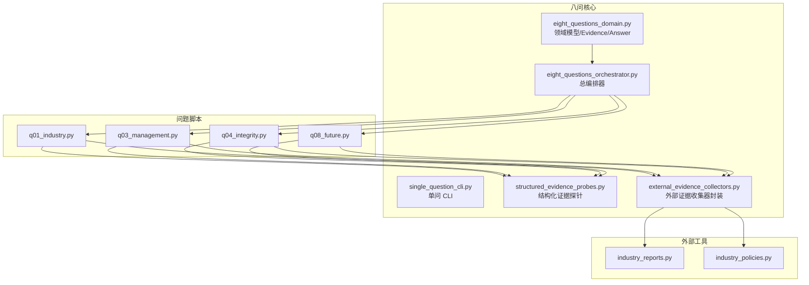
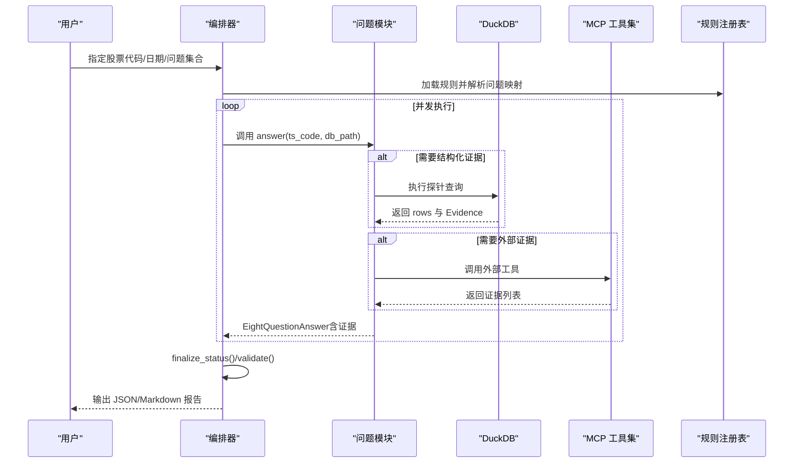
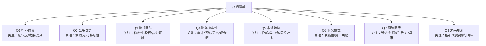
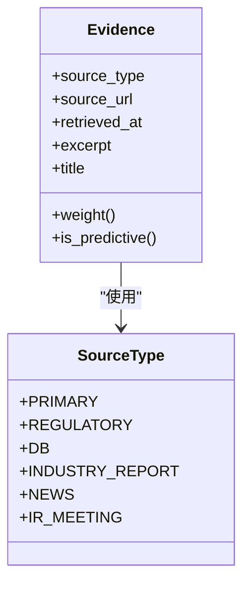
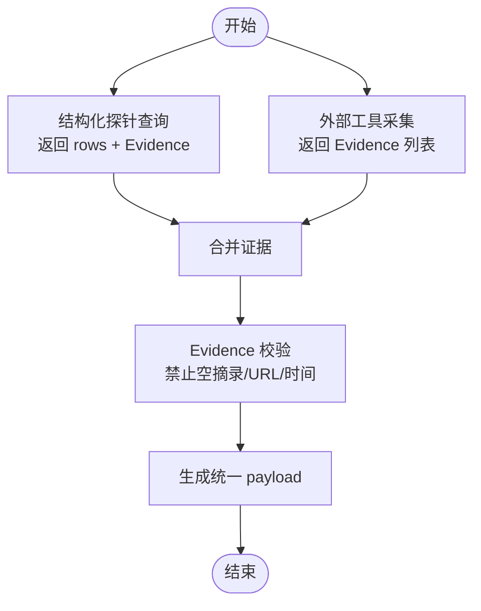
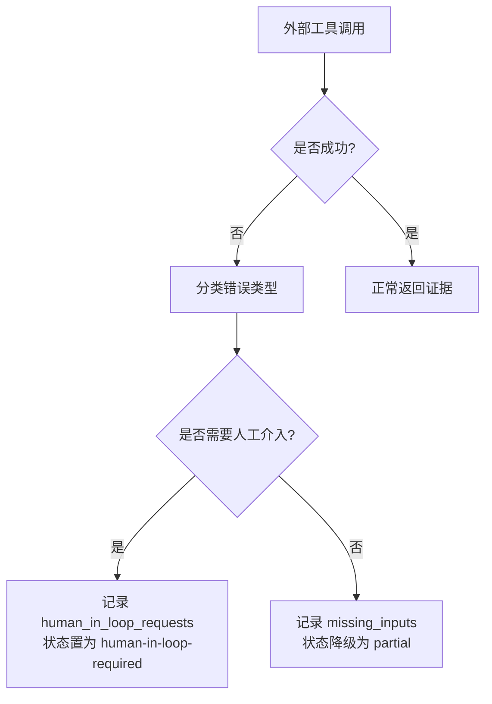
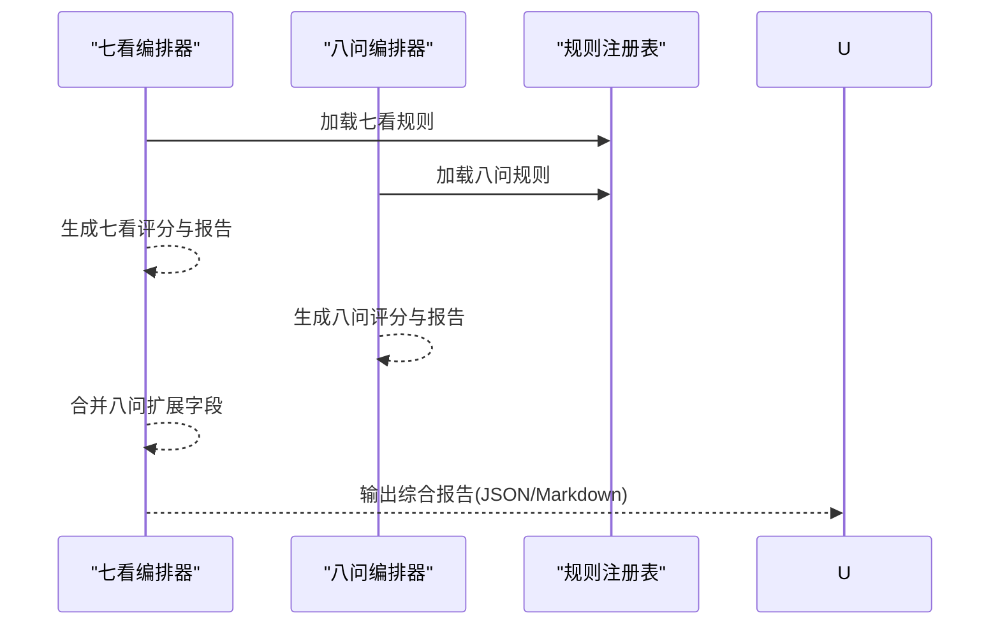
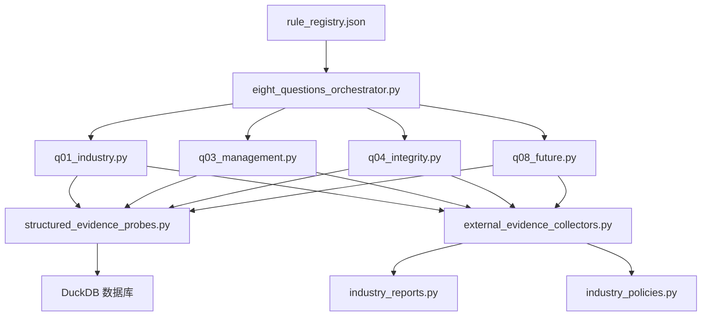

# 八问定性评估

<cite>
**本文档引用的文件**
- [eight_questions_domain.py](file://2min-company-analysis/seven-look-eight-question/scripts/eight_questions_domain.py)
- [eight_questions_orchestrator.py](file://2min-company-analysis/seven-look-eight-question/scripts/eight_questions_orchestrator.py)
- [single_question_cli.py](file://2min-company-analysis/seven-look-eight-question/scripts/single_question_cli.py)
- [structured_evidence_probes.py](file://2min-company-analysis/seven-look-eight-question/scripts/structured_evidence_probes.py)
- [external_evidence_collectors.py](file://2min-company-analysis/seven-look-eight-question/scripts/external_evidence_collectors.py)
- [rule_registry.json](file://2min-company-analysis/seven-look-eight-question/assets/rule_registry.json)
- [q01_industry.py](file://2min-company-analysis/ask-q1-industry-prospect/scripts/q01_industry.py)
- [q03_management.py](file://2min-company-analysis/ask-q3-management/scripts/q03_management.py)
- [q04_integrity.py](file://2min-company-analysis/ask-q4-financial-integrity/scripts/q04_integrity.py)
- [q08_future.py](file://2min-company-analysis/ask-q8-future-plan/scripts/q08_future.py)
- [industry_reports.py](file://nano-search-mcp/src/nano_search_mcp/tools/industry_reports.py)
- [industry_policies.py](file://nano-search-mcp/src/nano_search_mcp/tools/industry_policies.py)
- [README.md](file://2min-company-analysis/README.md)
</cite>

## 目录
1. [简介](#简介)
2. [项目结构](#项目结构)
3. [核心组件](#核心组件)
4. [架构总览](#架构总览)
5. [详细组件分析](#详细组件分析)
6. [依赖关系分析](#依赖关系分析)
7. [性能考量](#性能考量)
8. [故障排查指南](#故障排查指南)
9. [结论](#结论)
10. [附录](#附录)

## 简介
本文件面向“八问定性评估系统”的技术文档，围绕八个定性问题的设计理念、证据收集策略、评估维度与证据标准进行系统化梳理。文档重点说明：
- 八个问题的关注焦点与评估维度
- 外部证据的获取流程、验证机制与可信度评估
- 人类在环路（human-in-loop）的触发条件与处理方式
- 证据链构建的最佳实践与质量控制方法
- 与定量分析结果的整合策略与综合评分机制

## 项目结构
系统采用“七看八问”整体框架，八问作为定性补充模块，与七看定量模块并行运行并通过统一编排器输出综合报告。核心目录与职责如下：
- seven-look-eight-question/scripts：八问领域模型、编排器、单问 CLI、证据探针与外部证据收集器
- ask-q1-q8：每个问题的独立脚本，负责证据采集、评分与报告渲染
- nano-search-mcp：外部证据采集工具（可选依赖），提供研报、政策、公告、IR 等数据源
- tushare-duckdb-sync：结构化财务数据来源（DuckDB）

图表来源
- [eight_questions_orchestrator.py:1-396](file://2min-company-analysis/seven-look-eight-question/scripts/eight_questions_orchestrator.py#L1-L396)
- [eight_questions_domain.py:1-324](file://2min-company-analysis/seven-look-eight-question/scripts/eight_questions_domain.py#L1-L324)
- [structured_evidence_probes.py:1-386](file://2min-company-analysis/seven-look-eight-question/scripts/structured_evidence_probes.py#L1-L386)
- [external_evidence_collectors.py:1-524](file://2min-company-analysis/seven-look-eight-question/scripts/external_evidence_collectors.py#L1-L524)
- [q01_industry.py:1-157](file://2min-company-analysis/ask-q1-industry-prospect/scripts/q01_industry.py#L1-L157)
- [q03_management.py:1-129](file://2min-company-analysis/ask-q3-management/scripts/q03_management.py#L1-L129)
- [q04_integrity.py:1-131](file://2min-company-analysis/ask-q4-financial-integrity/scripts/q04_integrity.py#L1-L131)
- [q08_future.py:1-125](file://2min-company-analysis/ask-q8-future-plan/scripts/q08_future.py#L1-L125)
- [industry_reports.py:1-495](file://nano-search-mcp/src/nano_search_mcp/tools/industry_reports.py#L1-L495)
- [industry_policies.py:1-246](file://nano-search-mcp/src/nano_search_mcp/tools/industry_policies.py#L1-L246)

章节来源
- [README.md:1-132](file://2min-company-analysis/README.md#L1-L132)

## 核心组件
- 领域模型与证据规范
  - SourceType 枚举与权重表：定义证据来源类型与可信度权重，区分事实、监管、DB、研报、新闻、IR 等
  - Evidence：强校验的数据单元，禁止空引证，强制提供来源 URL、检索时间、摘录与标题
  - EightQuestionAnswer：每问回答载体，包含评级、状态、证据、缺失输入、人工介入请求、关键缺口、评级信号等
- 编排器
  - eight_questions_orchestrator：加载规则注册表，动态导入各问题模块，支持并发执行、汇总统计与 Markdown 渲染
- 单问 CLI
  - single_question_cli：为单个问题脚本提供统一 CLI、输出格式与标准化 payload
- 结构化证据探针
  - structured_evidence_probes：基于 DuckDB 的结构化证据探针，返回 rows 与 Evidence，统一来源 URL 与摘录
- 外部证据收集器封装
  - external_evidence_collectors：对 nano_search_mcp 工具的统一封装，提供统一返回结构、错误分类与人类在环路触发

章节来源
- [eight_questions_domain.py:26-110](file://2min-company-analysis/seven-look-eight-question/scripts/eight_questions_domain.py#L26-L110)
- [eight_questions_domain.py:72-110](file://2min-company-analysis/seven-look-eight-question/scripts/eight_questions_domain.py#L72-L110)
- [eight_questions_domain.py:123-212](file://2min-company-analysis/seven-look-eight-question/scripts/eight_questions_domain.py#L123-L212)
- [eight_questions_orchestrator.py:41-100](file://2min-company-analysis/seven-look-eight-question/scripts/eight_questions_orchestrator.py#L41-L100)
- [single_question_cli.py:25-48](file://2min-company-analysis/seven-look-eight-question/scripts/single_question_cli.py#L25-L48)
- [structured_evidence_probes.py:39-51](file://2min-company-analysis/seven-look-eight-question/scripts/structured_evidence_probes.py#L39-L51)
- [external_evidence_collectors.py:47-76](file://2min-company-analysis/seven-look-eight-question/scripts/external_evidence_collectors.py#L47-L76)

## 架构总览
八问系统通过规则注册表驱动，问题脚本按需调用结构化探针与外部工具，统一产出标准化的证据与回答。编排器负责并发执行、状态收敛与报告渲染。

图表来源
- [eight_questions_orchestrator.py:119-163](file://2min-company-analysis/seven-look-eight-question/scripts/eight_questions_orchestrator.py#L119-L163)
- [eight_questions_orchestrator.py:171-200](file://2min-company-analysis/seven-look-eight-question/scripts/eight_questions_orchestrator.py#L171-L200)
- [q01_industry.py:52-147](file://2min-company-analysis/ask-q1-industry-prospect/scripts/q01_industry.py#L52-L147)
- [q03_management.py:38-120](file://2min-company-analysis/ask-q3-management/scripts/q03_management.py#L38-L120)
- [q04_integrity.py:35-122](file://2min-company-analysis/ask-q4-financial-integrity/scripts/q04_integrity.py#L35-L122)
- [q08_future.py:29-116](file://2min-company-analysis/ask-q8-future-plan/scripts/q08_future.py#L29-L116)

## 详细组件分析

### 八问清单与评估维度
八问清单定义了八个问题的关注焦点与评估维度，每个问题都明确“原始问题”“关键要点”和“描述”，便于统一评估口径。

图表来源
- [eight_questions_domain.py:220-277](file://2min-company-analysis/seven-look-eight-question/scripts/eight_questions_domain.py#L220-L277)

章节来源
- [eight_questions_domain.py:220-277](file://2min-company-analysis/seven-look-eight-question/scripts/eight_questions_domain.py#L220-L277)

### 证据来源类型与权重
证据来源类型与权重体现了系统对不同证据的可信度分级，用于后续加权评级计算与报告标注。

图表来源
- [eight_questions_domain.py:26-47](file://2min-company-analysis/seven-look-eight-question/scripts/eight_questions_domain.py#L26-L47)
- [eight_questions_domain.py:72-110](file://2min-company-analysis/seven-look-eight-question/scripts/eight_questions_domain.py#L72-L110)

章节来源
- [eight_questions_domain.py:26-47](file://2min-company-analysis/seven-look-eight-question/scripts/eight_questions_domain.py#L26-L47)
- [eight_questions_domain.py:72-110](file://2min-company-analysis/seven-look-eight-question/scripts/eight_questions_domain.py#L72-L110)

### 证据链构建与质量控制
证据链由结构化探针与外部工具共同组成，系统通过强校验与统一 payload 输出确保证据可追溯、可复核。

图表来源
- [structured_evidence_probes.py:39-51](file://2min-company-analysis/seven-look-eight-question/scripts/structured_evidence_probes.py#L39-L51)
- [external_evidence_collectors.py:47-76](file://2min-company-analysis/seven-look-eight-question/scripts/external_evidence_collectors.py#L47-L76)
- [eight_questions_domain.py:72-110](file://2min-company-analysis/seven-look-eight-question/scripts/eight_questions_domain.py#L72-L110)

章节来源
- [structured_evidence_probes.py:39-51](file://2min-company-analysis/seven-look-eight-question/scripts/structured_evidence_probes.py#L39-L51)
- [external_evidence_collectors.py:47-76](file://2min-company-analysis/seven-look-eight-question/scripts/external_evidence_collectors.py#L47-L76)
- [eight_questions_domain.py:72-110](file://2min-company-analysis/seven-look-eight-question/scripts/eight_questions_domain.py#L72-L110)

### 人类在环路（Human-in-Loop）触发与处理
系统通过错误分类与状态收敛机制，将外部工具失败、环境缺失、上游契约变更等情况转化为“人工介入请求”或“部分证据”状态，确保报告质量与可解释性。

图表来源
- [external_evidence_collectors.py:119-133](file://2min-company-analysis/seven-look-eight-question/scripts/external_evidence_collectors.py#L119-L133)
- [eight_questions_orchestrator.py:168-186](file://2min-company-analysis/seven-look-eight-question/scripts/eight_questions_orchestrator.py#L168-L186)

章节来源
- [external_evidence_collectors.py:119-133](file://2min-company-analysis/seven-look-eight-question/scripts/external_evidence_collectors.py#L119-L133)
- [eight_questions_orchestrator.py:168-186](file://2min-company-analysis/seven-look-eight-question/scripts/eight_questions_orchestrator.py#L168-L186)

### 与定量分析结果的整合策略
编排器支持将八问结果作为扩展字段合并到七看输出，同时保留七看独立的评分体系，形成“定量+定性”的综合报告。

图表来源
- [eight_questions_orchestrator.py:304-318](file://2min-company-analysis/seven-look-eight-question/scripts/eight_questions_orchestrator.py#L304-L318)
- [README.md:96-101](file://2min-company-analysis/README.md#L96-L101)

章节来源
- [eight_questions_orchestrator.py:304-318](file://2min-company-analysis/seven-look-eight-question/scripts/eight_questions_orchestrator.py#L304-L318)
- [README.md:96-101](file://2min-company-analysis/README.md#L96-L101)

## 依赖关系分析
系统通过规则注册表驱动问题模块加载，外部工具依赖 nano-search-mcp，结构化证据依赖 DuckDB 数据库。

图表来源
- [rule_registry.json:1-410](file://2min-company-analysis/seven-look-eight-question/assets/rule_registry.json#L1-L410)
- [eight_questions_orchestrator.py:41-100](file://2min-company-analysis/seven-look-eight-question/scripts/eight_questions_orchestrator.py#L41-L100)
- [q01_industry.py:26-29](file://2min-company-analysis/ask-q1-industry-prospect/scripts/q01_industry.py#L26-L29)
- [q03_management.py:22-31](file://2min-company-analysis/ask-q3-management/scripts/q03_management.py#L22-L31)
- [q04_integrity.py:19-22](file://2min-company-analysis/ask-q4-financial-integrity/scripts/q04_integrity.py#L19-L22)
- [q08_future.py:19-22](file://2min-company-analysis/ask-q8-future-plan/scripts/q08_future.py#L19-L22)
- [industry_reports.py:1-495](file://nano-search-mcp/src/nano_search_mcp/tools/industry_reports.py#L1-L495)
- [industry_policies.py:1-246](file://nano-search-mcp/src/nano_search_mcp/tools/industry_policies.py#L1-L246)

章节来源
- [rule_registry.json:1-410](file://2min-company-analysis/seven-look-eight-question/assets/rule_registry.json#L1-L410)
- [eight_questions_orchestrator.py:41-100](file://2min-company-analysis/seven-look-eight-question/scripts/eight_questions_orchestrator.py#L41-L100)

## 性能考量
- 并发执行：编排器使用线程池并发执行多个问题，提升吞吐量
- DuckDB 只读连接：结构化探针使用只读连接，避免锁竞争
- 缓存与限流：外部工具实现缓存与请求间隔控制，减少重复抓取与风控
- 输出裁剪：证据摘录长度限制，避免大文本污染报告体积

章节来源
- [eight_questions_orchestrator.py:153-163](file://2min-company-analysis/seven-look-eight-question/scripts/eight_questions_orchestrator.py#L153-L163)
- [structured_evidence_probes.py:28-31](file://2min-company-analysis/seven-look-eight-question/scripts/structured_evidence_probes.py#L28-L31)
- [industry_reports.py:121-127](file://nano-search-mcp/src/nano_search_mcp/tools/industry_reports.py#L121-L127)
- [external_evidence_collectors.py:78-84](file://2min-company-analysis/seven-look-eight-question/scripts/external_evidence_collectors.py#L78-L84)

## 故障排查指南
- 外部工具不可用
  - 症状：返回 error_type 为 module_missing 或 upstream_contract_break
  - 处理：安装 nano-search-mcp 或等待上游修复契约
- 环境变量缺失
  - 症状：返回 error_type 为 env_missing（如 DASHSCOPE_API_KEY）
  - 处理：设置环境变量后重试
- 网络/超时
  - 症状：返回 error_type 为 network_fail
  - 处理：检查网络与代理，适当放宽重试策略
- 无匹配结果
  - 症状：返回 insufficient-evidence 或 partial
  - 处理：调整关键词或放宽时间窗口，必要时人工补充

章节来源
- [external_evidence_collectors.py:119-133](file://2min-company-analysis/seven-look-eight-question/scripts/external_evidence_collectors.py#L119-L133)
- [external_evidence_collectors.py:135-167](file://2min-company-analysis/seven-look-eight-question/scripts/external_evidence_collectors.py#L135-L167)

## 结论
八问定性评估系统通过统一的领域模型、严谨的证据规范与并发编排，实现了对八个关键定性问题的结构化评估。系统强调“证据铁律”，通过来源权重与人类在环路机制保障报告质量与可解释性，并与七看定量模块无缝整合，形成“定量+定性”的综合分析框架。

## 附录

### 八个定性问题的设计理念与证据策略
- Q1 行业前景
  - 关注焦点：行业景气度、政策与周期位置
  - 证据策略：结构化 SW 分类 + 行业研报（预测）+ 产业政策（事实）
  - 证据标准：至少一条事实证据 + 至少一条观点证据
- Q2 竞争优势
  - 关注焦点：护城河与可持续性
  - 证据策略：主营构成、同行池与年报 MD&A
  - 证据标准：结构化证据为主，必要时人工补充
- Q3 管理团队
  - 关注焦点：稳定性、股权结构与薪酬
  - 证据策略：公司概况、高管与薪酬、十大股东
  - 证据标准：必须有结构化证据才可评级
- Q4 财务真实性
  - 关注焦点：审计/问询/更名与现金流质量
  - 证据策略：净现比、名称历史与公告
  - 证据标准：结构化证据 + 公告关键词桶计数
- Q5 市场地位
  - 关注焦点：份额、集中度与同行对比
  - 证据策略：主营构成与 SW 同行池
  - 证据标准：结构化证据 + 年报文本证据
- Q6 业务模式
  - 关注焦点：单一性与第二曲线
  - 证据策略：主营构成与年报业务概览
  - 证据标准：多期主营构成 + 关键词信号
- Q7 风险因素
  - 关注焦点：诉讼、处罚、质押、ST/退市
  - 证据策略：质押统计、ST 记录与处罚公告
  - 证据标准：信号计数 + 人工复核
- Q8 未来规划
  - 关注焦点：指引、战略与执行闭环
  - 证据策略：业绩预告/快报、IR 纪要与年报
  - 证据标准：DB 指标 + 公司口径 + 年报文本

章节来源
- [q01_industry.py:1-14](file://2min-company-analysis/ask-q1-industry-prospect/scripts/q01_industry.py#L1-L14)
- [q03_management.py:1-11](file://2min-company-analysis/ask-q3-management/scripts/q03_management.py#L1-L11)
- [q04_integrity.py:1-7](file://2min-company-analysis/ask-q4-financial-integrity/scripts/q04_integrity.py#L1-L7)
- [q08_future.py:1-7](file://2min-company-analysis/ask-q8-future-plan/scripts/q08_future.py#L1-L7)

### 证据链构建最佳实践
- 强制证据：任何结论必须有 Evidence 支撑，禁止编造
- 来源标注：预测性/公司口径来源自动打标，便于读者识别
- 摘录规范：统一截断长度，避免大文本污染
- 状态收敛：finalize_status() 保证 ready/partial/human-in-loop 的一致性
- 质量控制：Evidence.__post_init__ 强校验，缺失字段直接报错

章节来源
- [eight_questions_domain.py:72-110](file://2min-company-analysis/seven-look-eight-question/scripts/eight_questions_domain.py#L72-L110)
- [eight_questions_domain.py:168-186](file://2min-company-analysis/seven-look-eight-question/scripts/eight_questions_domain.py#L168-L186)
- [eight_questions_orchestrator.py:233-234](file://2min-company-analysis/seven-look-eight-question/scripts/eight_questions_orchestrator.py#L233-L234)

### 与定量分析的整合与综合评分
- 七看独立评分：保持原有质量评分与维度汇总
- 八问扩展字段：作为附加信息合并到总输出
- 交叉校验：编排器提供 cross_validate，如 Q4 与 look-01 的现金流指标联动
- 报告渲染：Markdown 汇总展示状态分布、平均评级与人工介入请求

章节来源
- [eight_questions_orchestrator.py:304-318](file://2min-company-analysis/seven-look-eight-question/scripts/eight_questions_orchestrator.py#L304-L318)
- [eight_questions_orchestrator.py:216-296](file://2min-company-analysis/seven-look-eight-question/scripts/eight_questions_orchestrator.py#L216-L296)
- [README.md:96-101](file://2min-company-analysis/README.md#L96-L101)