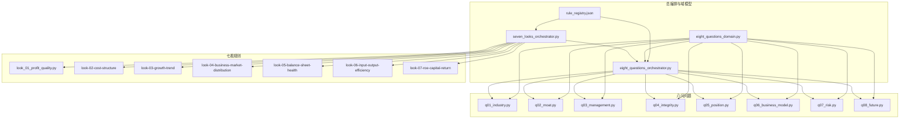
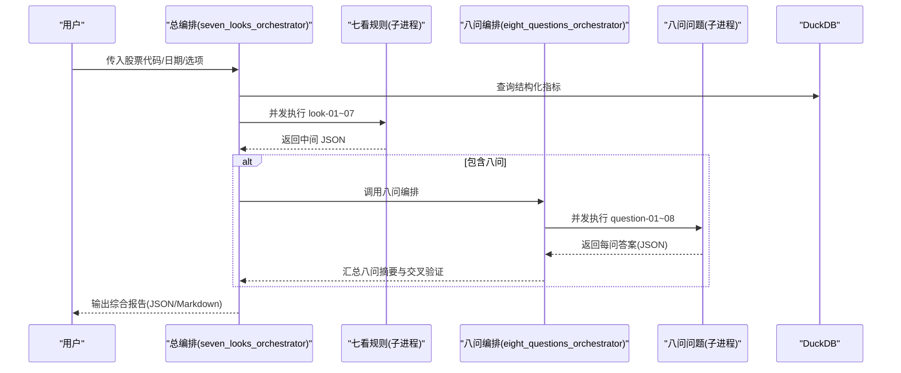
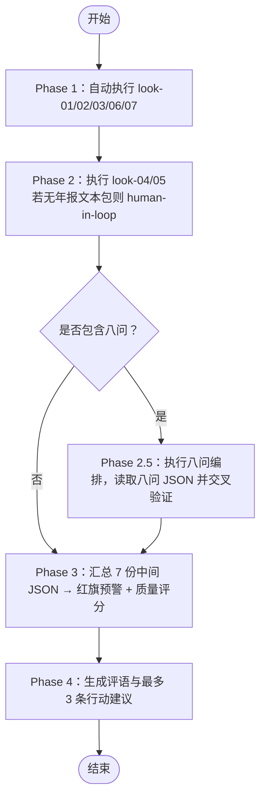
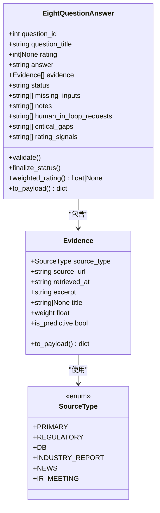
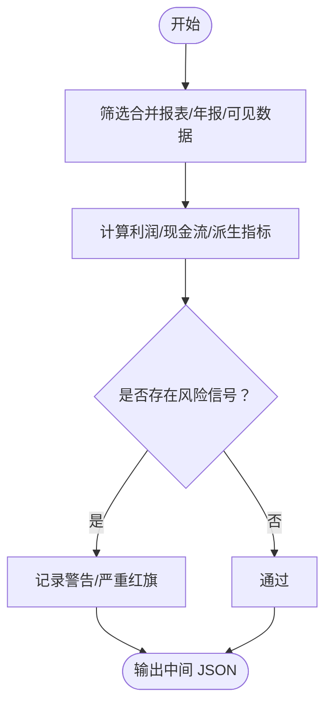
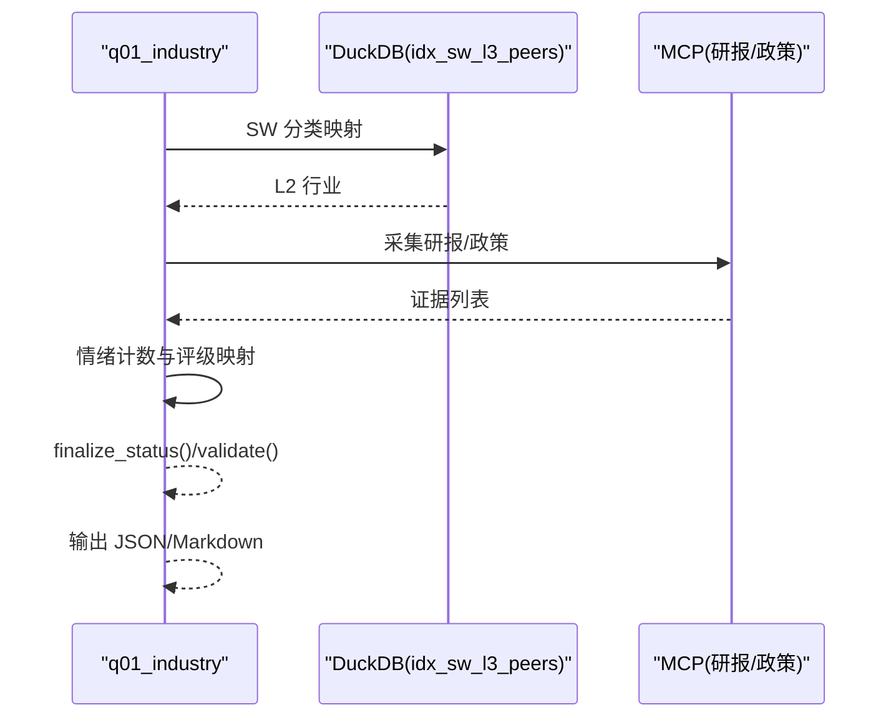
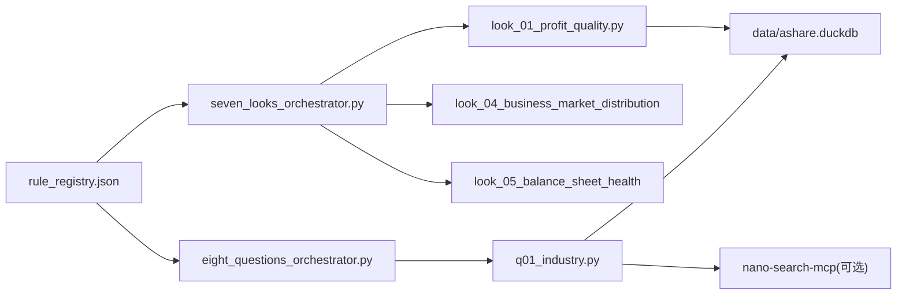

# 分析框架概览

<cite>
**本文引用的文件**
- [2min-company-analysis/README.md](file://2min-company-analysis/README.md)
- [seven-look-eight-question/SKILL.md](file://2min-company-analysis/seven-look-eight-question/SKILL.md)
- [seven-look-eight-question/scripts/seven_looks_orchestrator.py](file://2min-company-analysis/seven-look-eight-question/scripts/seven_looks_orchestrator.py)
- [seven-look-eight-question/scripts/eight_questions_orchestrator.py](file://2min-company-analysis/seven-look-eight-question/scripts/eight_questions_orchestrator.py)
- [seven-look-eight-question/scripts/eight_questions_domain.py](file://2min-company-analysis/seven-look-eight-question/scripts/eight_questions_domain.py)
- [seven-look-eight-question/scripts/single_question_cli.py](file://2min-company-analysis/seven-look-eight-question/scripts/single_question_cli.py)
- [seven-look-eight-question/assets/rule_registry.json](file://2min-company-analysis/seven-look-eight-question/assets/rule_registry.json)
- [look-01-profit-quality/SKILL.md](file://2min-company-analysis/look-01-profit-quality/SKILL.md)
- [ask-q1-industry-prospect/SKILL.md](file://2min-company-analysis/ask-q1-industry-prospect/SKILL.md)
- [look-01-profit-quality/scripts/look_01_profit_quality.py](file://2min-company-analysis/look-01-profit-quality/scripts/look_01_profit_quality.py)
- [ask-q1-industry-prospect/scripts/q01_industry.py](file://2min-company-analysis/ask-q1-industry-prospect/scripts/q01_industry.py)
</cite>

## 目录
1. [简介](#简介)
2. [项目结构](#项目结构)
3. [核心组件](#核心组件)
4. [架构总览](#架构总览)
5. [详细组件分析](#详细组件分析)
6. [依赖分析](#依赖分析)
7. [性能考虑](#性能考虑)
8. [故障排除指南](#故障排除指南)
9. [结论](#结论)
10. [附录](#附录)

## 简介
本文件为“2分钟公司分析框架”的综合性概览文档，系统阐述“七看八问”分析方法论的理论基础、实践价值与工程实现。框架通过“七看”（定量规则）快速体检财务质量，“八问”（定性证据）补齐行业、管理层、风险与战略证据，形成可复核、可落地的结构化报告。文档还覆盖适用范围、能力边界、局限性、三种使用路径（总编排、单独执行、混合模式）的选择策略，并提供分析流程图与决策树，帮助用户在不同阶段选择合适的分析组合。

## 项目结构
该模块采用“总编排 + 子规则/子问题”的分层设计：
- seven-look-eight-question：总编排与八问域模型
- look-01 ~ look-07：七看独立规则 skill
- ask-q1 ~ ask-q8：八问独立问答 skill
- assets：规则注册表与证据权重配置
- README：模块目标、能力边界、使用路径与依赖关系

图表来源
- [seven-look-eight-question/scripts/seven_looks_orchestrator.py:62-119](file://2min-company-analysis/seven-look-eight-question/scripts/seven_looks_orchestrator.py#L62-L119)
- [seven-look-eight-question/scripts/eight_questions_orchestrator.py:82-100](file://2min-company-analysis/seven-look-eight-question/scripts/eight_questions_orchestrator.py#L82-L100)
- [seven-look-eight-question/assets/rule_registry.json:5-407](file://2min-company-analysis/seven-look-eight-question/assets/rule_registry.json#L5-L407)

章节来源
- [2min-company-analysis/README.md:19-56](file://2min-company-analysis/README.md#L19-L56)
- [seven-look-eight-question/SKILL.md:18-40](file://2min-company-analysis/seven-look-eight-question/SKILL.md#L18-L40)

## 核心组件
- 七看（定量规则）：围绕利润质量、成本结构、增长趋势、业务与市场分布、资产负债健康度、投入产出效率、ROE与资本回报七个维度，基于 DuckDB 结构化指标与派生变量进行自动化体检。
- 八问（定性证据）：围绕行业前景、竞争优势、管理团队、财务真实性、市场地位、业务模式、风险因素、未来规划八个问题，构建证据采集与评级体系，支持并发执行与跨验证。
- 总编排：统一调度七看与八问，汇总质量评分、红绿灯预警、人类介入请求与行动建议，输出 JSON/Markdown 报告。

章节来源
- [2min-company-analysis/README.md:27-51](file://2min-company-analysis/README.md#L27-L51)
- [seven-look-eight-question/SKILL.md:10-16](file://2min-company-analysis/seven-look-eight-question/SKILL.md#L10-L16)

## 架构总览
整体架构遵循“规则/问题模块化 + 域模型共享 + 总编排统一输出”的设计。七看与八问分别通过各自的脚本独立执行，共享证据域模型（来源类型、证据单元、加权评级、状态机）与 CLI 工具，最终由总编排脚本合并输出。

图表来源
- [seven-look-eight-question/scripts/seven_looks_orchestrator.py:170-244](file://2min-company-analysis/seven-look-eight-question/scripts/seven_looks_orchestrator.py#L170-L244)
- [seven-look-eight-question/scripts/eight_questions_orchestrator.py:119-163](file://2min-company-analysis/seven-look-eight-question/scripts/eight_questions_orchestrator.py#L119-L163)

## 详细组件分析

### 七看总编排（seven_looks_orchestrator）
- 职责：按阶段顺序执行七看，收集中间 JSON，汇总质量评分与行动建议；可选接入八问并合并摘要。
- 阶段划分：
  - Phase 1（自动）：执行 look-01/02/03/06/07（纯数据库查询，无需外部输入）
  - Phase 2（半自动）：执行 look-04/05（若未提供年报文本包则标记 human-in-loop）
  - Phase 2.5（可选）：执行八问编排，从八问 JSON 回读 payload，补充 cross_validation_flags
  - Phase 3（汇总）：合并 7 份中间 JSON → 红旗预警 + 质量评分
  - Phase 4（评语）：附加量化评语 + 最多 3 条行动建议
- 输出契约：results/look_results/raw_results 三视图，八问以扩展字段并入，不改变七看评分体系。

图表来源
- [seven-look-eight-question/scripts/seven_looks_orchestrator.py:6-12](file://2min-company-analysis/seven-look-eight-question/scripts/seven_looks_orchestrator.py#L6-L12)
- [seven-look-eight-question/SKILL.md:58-64](file://2min-company-analysis/seven-look-eight-question/SKILL.md#L58-L64)

章节来源
- [seven-look-eight-question/SKILL.md:18-96](file://2min-company-analysis/seven-look-eight-question/SKILL.md#L18-L96)
- [seven-look-eight-question/scripts/seven_looks_orchestrator.py:624-652](file://2min-company-analysis/seven-look-eight-question/scripts/seven_looks_orchestrator.py#L624-L652)

### 八问域模型与编排（eight_questions_domain/eight_questions_orchestrator）
- 域模型（eight_questions_domain）：
  - 来源类型与权重：primary/regulatory/db（1.0）、industry_report（0.6）、news（0.4）、ir_meeting（0.5）
  - Evidence 证据单元：强校验，禁止空引证；自动标记预测/口径来源
  - EightQuestionAnswer：统一承载评级、证据、状态、缺失输入、人工介入请求、关键证据缺口与评级依据
  - 加权评级：avg_weighted_rating = rating × avg_evidence_weight，用于综合结论强度与证据质量
- 编排（eight_questions_orchestrator）：
  - 并发执行 question-01~08，失败不影响其它问题
  - 汇总状态分布、平均评级与加权平均评级、人类介入请求与关键证据缺口
  - 提供 Markdown 渲染与 payload 输出，支持 cross_validate 交叉验证

图表来源
- [seven-look-eight-question/scripts/eight_questions_domain.py:72-212](file://2min-company-analysis/seven-look-eight-question/scripts/eight_questions_domain.py#L72-L212)

章节来源
- [seven-look-eight-question/scripts/eight_questions_domain.py:26-57](file://2min-company-analysis/seven-look-eight-question/scripts/eight_questions_domain.py#L26-L57)
- [seven-look-eight-question/scripts/eight_questions_orchestrator.py:169-201](file://2min-company-analysis/seven-look-eight-question/scripts/eight_questions_orchestrator.py#L169-L201)

### 七看规则样例：利润质量（look-01）
- 关注点：扣非利润连续性、经营/自由现金流、净现比、毛利率趋势
- 数据口径：合并报表、年报、可见性控制、字段覆盖率回退策略
- 输出：年度证据表、缺失统计、核心派生指标与适用性判断

图表来源
- [look-01-profit-quality/SKILL.md:27-38](file://2min-company-analysis/look-01-profit-quality/SKILL.md#L27-L38)
- [look-01-profit-quality/scripts/look_01_profit_quality.py:126-200](file://2min-company-analysis/look-01-profit-quality/scripts/look_01_profit_quality.py#L126-L200)

章节来源
- [look-01-profit-quality/SKILL.md:27-69](file://2min-company-analysis/look-01-profit-quality/SKILL.md#L27-L69)

### 八问问题样例：行业前景（ask-q1）
- 证据策略：申万分类（事实）+ 行业研报（观点）+ 产业政策（事实）
- 评级门槛：至少 1 条 primary/regulatory/db + 1 条 industry_report
- 评分映射：基于情绪净值与政策密度的规则化映射

图表来源
- [ask-q1-industry-prospect/scripts/q01_industry.py:52-147](file://2min-company-analysis/ask-q1-industry-prospect/scripts/q01_industry.py#L52-L147)
- [ask-q1-industry-prospect/SKILL.md:57-86](file://2min-company-analysis/ask-q1-industry-prospect/SKILL.md#L57-L86)

章节来源
- [ask-q1-industry-prospect/SKILL.md:25-86](file://2min-company-analysis/ask-q1-industry-prospect/SKILL.md#L25-L86)

## 依赖分析
- 规则注册表（rule_registry.json）：统一登记七看/八问的规则 ID、脚本路径、数据表、派生指标与缺失数据，作为编排与测试的契约。
- DuckDB 数据：七看规则依赖结构化指标表；八问问题依赖 SW 分类与外部证据采集工具。
- 外部证据：nano-search-mcp 提供行业研报与产业政策检索，需按需安装与配置。

图表来源
- [seven-look-eight-question/assets/rule_registry.json:5-407](file://2min-company-analysis/seven-look-eight-question/assets/rule_registry.json#L5-L407)
- [2min-company-analysis/README.md:103-121](file://2min-company-analysis/README.md#L103-L121)

章节来源
- [seven-look-eight-question/assets/rule_registry.json:1-410](file://2min-company-analysis/seven-look-eight-question/assets/rule_registry.json#L1-L410)
- [2min-company-analysis/README.md:103-121](file://2min-company-analysis/README.md#L103-L121)

## 性能考虑
- 并行执行：七看与八问均采用并发执行（ThreadPoolExecutor），提升吞吐与响应速度。
- 子进程隔离：通过 subprocess 调用各规则/问题脚本，避免相互干扰，便于超时与错误隔离。
- 输出缓存：中间 JSON 与最终报告可落盘，减少重复计算；raw_results 仅用于审计与溯源。
- 证据权重：通过 SOURCE_WEIGHTS 与加权评级，平衡“结论高低”与“证据质量”。

[本节为通用指导，不直接分析具体文件]

## 故障排除指南
- 七看评分异常：检查 raw_results 与分项中间 JSON，核对派生指标口径与缺失数据；必要时调整 lookback 年数或数据可见性。
- 八问评级不稳定：核查证据来源类型与权重，确保 primary/regulatory/db 证据充足；关注预测/口径标记对评级的影响。
- 人类介入请求：优先处理八问中的“需要人工介入”与“关键证据缺口”，再回填相应证据后重新运行。
- 外部证据失败：确认 nano-search-mcp 安装与环境变量（如 DASHSCOPE_API_KEY）配置；检查网络与权限。

章节来源
- [seven-look-eight-question/SKILL.md:162-194](file://2min-company-analysis/seven-look-eight-question/SKILL.md#L162-L194)
- [ask-q1-industry-prospect/SKILL.md:96-101](file://2min-company-analysis/ask-q1-industry-prospect/SKILL.md#L96-L101)

## 结论
“七看八问”框架通过“定量体检 + 定性证据”的双轨并行，实现了对 A 股非金融类公司快速、可复核的基本面分析。七看提供稳健的财务质量快照，八问补齐行业、管理层、风险与战略证据，总编排统一输出报告并提供行动建议。建议在具备外部证据能力时优先启用八问，并结合规则注册表与域模型契约进行持续优化与回归测试。

[本节为总结性内容，不直接分析具体文件]

## 附录

### 使用路径与选择策略
- 总编排（推荐）：一键执行七看，可选并入八问，输出统一报告；适用于日常扫描与快速决策。
- 单独执行：针对特定规则/问题进行调试、复核与迭代；适用于专项排查与规则优化。
- 混合模式：先七看快速过滤，再按需对高风险维度执行八问，兼顾效率与深度。

章节来源
- [2min-company-analysis/README.md:58-95](file://2min-company-analysis/README.md#L58-L95)

### 评分与质量等级
- 起始 100 分，每个严重红旗（critical）扣 15 分，每个警示（warning）扣 5 分
- A（≥80）：财务质量良好
- B（60-79）：财务质量一般，存在部分隐患
- C（40-59）：财务质量较差，多项红旗预警
- D（<40）：财务质量极差，建议高度警惕

章节来源
- [seven-look-eight-question/SKILL.md:180-187](file://2min-company-analysis/seven-look-eight-question/SKILL.md#L180-L187)

### 证据权重与加权评级说明
- 来源权重：primary/regulatory/db（1.0）、industry_report（0.6）、news（0.4）、ir_meeting（0.5）
- 加权评级：avg_weighted_rating = rating × avg_evidence_weight，用于综合结论强度与证据质量

章节来源
- [seven-look-eight-question/SKILL.md:97-104](file://2min-company-analysis/seven-look-eight-question/SKILL.md#L97-L104)
- [seven-look-eight-question/scripts/eight_questions_domain.py:35-47](file://2min-company-analysis/seven-look-eight-question/scripts/eight_questions_domain.py#L35-L47)

### 实际案例演示与最佳实践
- 案例演示：建议以某周期性行业公司为例，先用七看识别利润质量与杠杆风险，再用八问验证行业前景与管理层稳定性，最后输出综合报告并制定行动建议。
- 最佳实践：
  - 先同步结构化数据（tushare-duckdb-sync），再执行总编排或单项规则
  - 在启用八问外部证据时，优先补齐年报文本包与外部证据采集链路
  - 对异常规则/问题进行单问/单规则调试，核对 raw_results 与中间 JSON
  - 定期回顾 rule_registry 与域模型契约，确保口径一致性与可追溯性

章节来源
- [2min-company-analysis/README.md:128-132](file://2min-company-analysis/README.md#L128-L132)
- [seven-look-eight-question/SKILL.md:188-201](file://2min-company-analysis/seven-look-eight-question/SKILL.md#L188-L201)