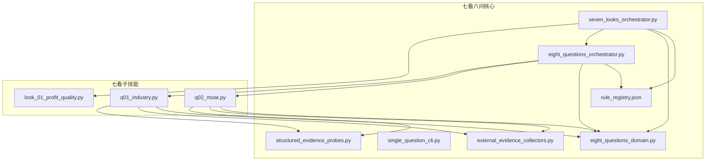
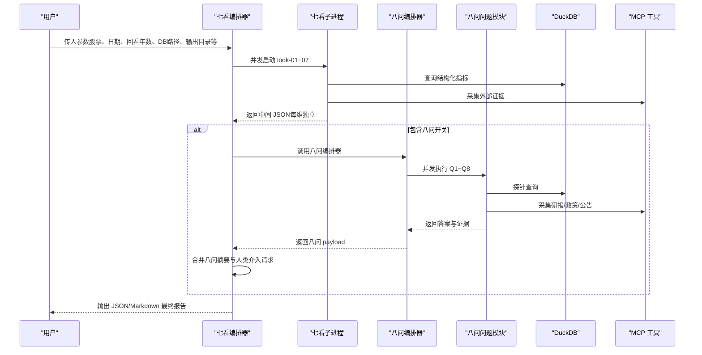
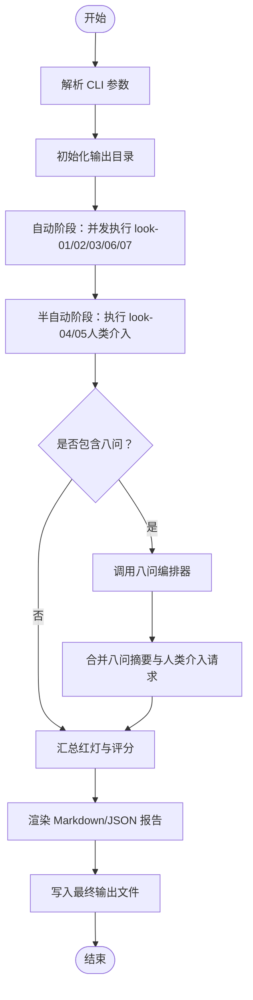
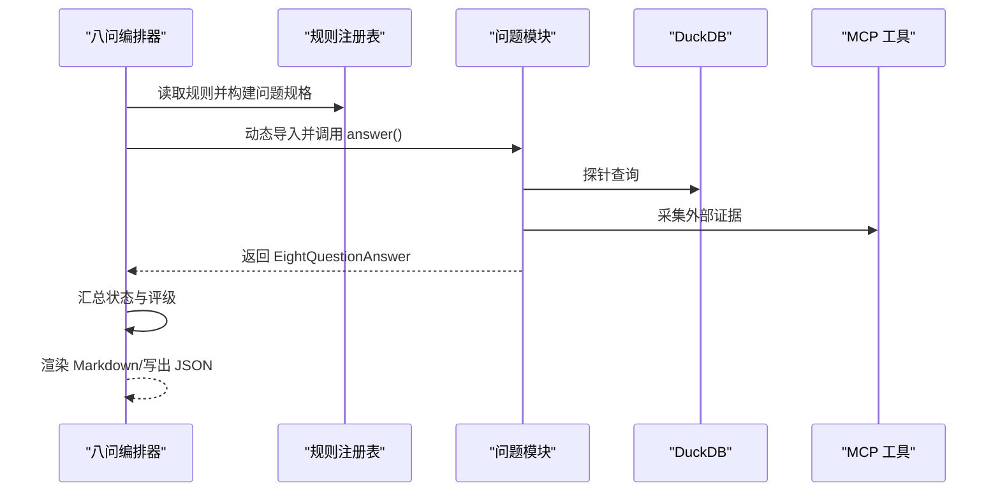
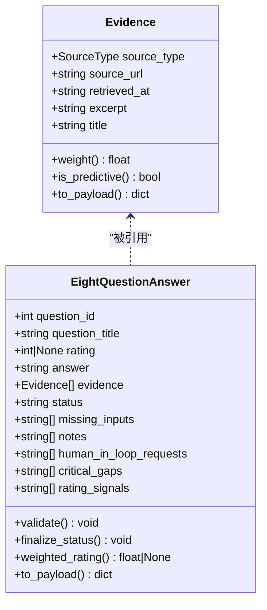
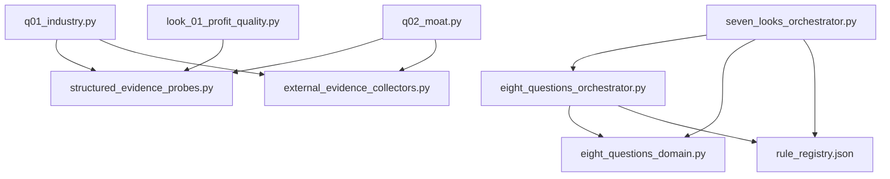

# 总编排协调器

<cite>
**本文引用的文件**   
- [seven_looks_orchestrator.py](file://2min-company-analysis/seven-look-eight-question/scripts/seven_looks_orchestrator.py)
- [eight_questions_orchestrator.py](file://2min-company-analysis/seven-look-eight-question/scripts/eight_questions_orchestrator.py)
- [eight_questions_domain.py](file://2min-company-analysis/seven-look-eight-question/scripts/eight_questions_domain.py)
- [single_question_cli.py](file://2min-company-analysis/seven-look-eight-question/scripts/single_question_cli.py)
- [structured_evidence_probes.py](file://2min-company-analysis/seven-look-eight-question/scripts/structured_evidence_probes.py)
- [external_evidence_collectors.py](file://2min-company-analysis/seven-look-eight-question/scripts/external_evidence_collectors.py)
- [rule_registry.json](file://2min-company-analysis/seven-look-eight-question/assets/rule_registry.json)
- [SKILL.md](file://2min-company-analysis/seven-look-eight-question/SKILL.md)
- [q01_industry.py](file://2min-company-analysis/ask-q1-industry-prospect/scripts/q01_industry.py)
- [q02_moat.py](file://2min-company-analysis/ask-q2-moat/scripts/q02_moat.py)
- [look_01_profit_quality.py](file://2min-company-analysis/look-01-profit-quality/scripts/look_01_profit_quality.py)
</cite>

## 目录
1. [简介](#简介)
2. [项目结构](#项目结构)
3. [核心组件](#核心组件)
4. [架构总览](#架构总览)
5. [详细组件分析](#详细组件分析)
6. [依赖关系分析](#依赖关系分析)
7. [性能考量](#性能考量)
8. [故障排查指南](#故障排查指南)
9. [结论](#结论)
10. [附录](#附录)

## 简介
本文件面向“总编排协调器”，系统化阐述“七看八问”的集成架构与工作流程，覆盖初始化、参数传递、状态管理、调度机制、证据收集并行策略与依赖关系、CLI 使用与配置、错误处理与重试、异常恢复策略，以及标准化 JSON/Markdown 报告输出。目标读者包括工程师、分析师与自动化平台使用者。

## 项目结构
七看八问位于“2min-company-analysis/seven-look-eight-question/scripts”目录下，核心由三个脚本组成：
- seven_looks_orchestrator.py：七看总入口与编排，负责并行执行 look-01~07、汇总与生成报告，并可选接入八问。
- eight_questions_orchestrator.py：八问总入口，基于规则注册表动态加载问题模块，进行并发执行与汇总。
- eight_questions_domain.py：八问领域模型与证据规范，定义来源类型、证据单元、答案结构与权重。
- single_question_cli.py：单问脚本的通用 CLI 辅助器，统一输出与渲染。
- structured_evidence_probes.py：DuckDB 结构化证据探针，提供数据库层证据抽取。
- external_evidence_collectors.py：外部证据采集器封装，统一 MCP 工具调用与错误分类。
- rule_registry.json：规则注册表，声明七看与八问的脚本路径、数据表、派生指标与人类介入需求。
- SKILL.md：七看八问总入口的使用说明与输出契约。

**图表来源**
- [seven_looks_orchestrator.py:1160-1352](file://2min-company-analysis/seven-look-eight-question/scripts/seven_looks_orchestrator.py#L1160-L1352)
- [eight_questions_orchestrator.py:346-396](file://2min-company-analysis/seven-look-eight-question/scripts/eight_questions_orchestrator.py#L346-L396)
- [eight_questions_domain.py:1-324](file://2min-company-analysis/seven-look-eight-question/scripts/eight_questions_domain.py#L1-L324)
- [single_question_cli.py:126-158](file://2min-company-analysis/seven-look-eight-question/scripts/single_question_cli.py#L126-L158)
- [structured_evidence_probes.py:1-386](file://2min-company-analysis/seven-look-eight-question/scripts/structured_evidence_probes.py#L1-L386)
- [external_evidence_collectors.py:1-200](file://2min-company-analysis/seven-look-eight-question/scripts/external_evidence_collectors.py#L1-L200)
- [rule_registry.json:1-410](file://2min-company-analysis/seven-look-eight-question/assets/rule_registry.json#L1-L410)

**章节来源**
- [SKILL.md:1-201](file://2min-company-analysis/seven-look-eight-question/SKILL.md#L1-L201)

## 核心组件
- 七看编排器（seven_looks_orchestrator.py）
  - 负责七看阶段的并行执行、中间文件落盘、汇总红灯与评分、生成行动建议、可选接入八问并合并结果。
  - 支持统一回看年数、数据库路径、人类介入数据包（年报文本）与输出目录等参数。
- 八问编排器（eight_questions_orchestrator.py）
  - 基于规则注册表动态导入问题模块，使用线程池并发执行，汇总状态与评级，渲染 Markdown 并写出 JSON。
- 领域模型与证据规范（eight_questions_domain.py）
  - 定义证据单元、来源类型与权重、答案状态与校验、加权评级、问题清单等。
- 单问 CLI 辅助（single_question_cli.py）
  - 统一单问脚本的 CLI 行为，构建 payload、渲染 Markdown。
- 结构化证据探针（structured_evidence_probes.py）
  - 通过 DuckDB 查询返回结构化证据与证据单元。
- 外部证据采集器（external_evidence_collectors.py）
  - 统一封装 MCP 工具调用，返回标准化采集结果，包含错误分类与降级策略。
- 规则注册表（rule_registry.json）
  - 描述七看/八问的脚本路径、数据表、派生指标、缺失数据与实现状态。

**章节来源**
- [seven_looks_orchestrator.py:1160-1352](file://2min-company-analysis/seven-look-eight-question/scripts/seven_looks_orchestrator.py#L1160-L1352)
- [eight_questions_orchestrator.py:346-396](file://2min-company-analysis/seven-look-eight-question/scripts/eight_questions_orchestrator.py#L346-L396)
- [eight_questions_domain.py:1-324](file://2min-company-analysis/seven-look-eight-question/scripts/eight_questions_domain.py#L1-L324)
- [single_question_cli.py:126-158](file://2min-company-analysis/seven-look-eight-question/scripts/single_question_cli.py#L126-L158)
- [structured_evidence_probes.py:1-386](file://2min-company-analysis/seven-look-eight-question/scripts/structured_evidence_probes.py#L1-L386)
- [external_evidence_collectors.py:1-200](file://2min-company-analysis/seven-look-eight-question/scripts/external_evidence_collectors.py#L1-L200)
- [rule_registry.json:1-410](file://2min-company-analysis/seven-look-eight-question/assets/rule_registry.json#L1-L410)

## 架构总览
七看八问采用“总入口编排 + 子任务并行执行 + 统一证据与状态治理”的架构：
- 总入口编排：七看与八问分别由独立脚本负责，七看编排器可选择性调用八问编排器。
- 并行执行：七看阶段使用线程池并发执行多个 look 子进程；八问阶段同样并发执行多个问题模块。
- 证据与状态：统一的证据单元与状态机确保“无证据不 ready”，并提供加权评级与人类介入请求。
- 输出契约：支持 JSON 与 Markdown 两种最终输出，JSON 作为程序消费，Markdown 便于人工审阅。

**图表来源**
- [seven_looks_orchestrator.py:1249-1352](file://2min-company-analysis/seven-look-eight-question/scripts/seven_looks_orchestrator.py#L1249-L1352)
- [eight_questions_orchestrator.py:119-164](file://2min-company-analysis/seven-look-eight-question/scripts/eight_questions_orchestrator.py#L119-L164)
- [structured_evidence_probes.py:384-386](file://2min-company-analysis/seven-look-eight-question/scripts/structured_evidence_probes.py#L384-L386)
- [external_evidence_collectors.py:140-194](file://2min-company-analysis/seven-look-eight-question/scripts/external_evidence_collectors.py#L140-L194)

## 详细组件分析

### 七看编排器（seven_looks_orchestrator.py）
- 初始化与参数传递
  - 解析 CLI 参数：股票代码、分析日期、统一回看年数、数据库路径、人类介入数据包、输出目录、最终输出、是否包含八问、并行度、单看超时、八问超时等。
  - 计算分析日期与输出目录，构造 extra_args 传递给 look-04/05/06 的人类介入数据包。
- 调度机制
  - 自动阶段（look-01/02/03/06/07）：纯数据库查询，无需外部输入，使用线程池并发执行。
  - 半自动阶段（look-04/05）：若未提供年报文本包，则标记为 human-in-loop-required 或 partial。
  - 可选阶段（look-08）：当传入 --include-eight-questions 时，调用八问编排器，读取八问输出文件并补充交叉校验标志。
- 状态管理与汇总
  - 从各 look 的 JSON 输出中提取状态、摘要与证据计数，汇总红灯（critical/warning）并计算质量评分。
  - 生成人类介入请求清单与关键证据缺口列表。
- 报告渲染
  - 生成 Markdown 或 JSON 报告，包含质量评分、红灯表、七看概览、人类介入清单、行动建议与量化评语。
  - 可将八问摘要与关键证据缺口并入最终输出。

**图表来源**
- [seven_looks_orchestrator.py:1249-1352](file://2min-company-analysis/seven-look-eight-question/scripts/seven_looks_orchestrator.py#L1249-L1352)

**章节来源**
- [seven_looks_orchestrator.py:1160-1352](file://2min-company-analysis/seven-look-eight-question/scripts/seven_looks_orchestrator.py#L1160-L1352)

### 八问编排器（eight_questions_orchestrator.py）
- 规则加载与模块导入
  - 从 rule_registry.json 中读取规则，筛选 category 为 question 的规则，解析脚本路径并动态导入模块。
  - 每个问题模块需暴露 answer(ts_code, db_path, ...) 方法，返回 EightQuestionAnswer。
- 并行执行与错误处理
  - 使用线程池并发执行指定问题 ID 集合；单个问题异常不影响其他问题。
  - 对异常进行分类（网络超时、模块缺失、上游契约变更、环境变量缺失、数据源禁用等），并降级为 insufficient-evidence 或 partial。
- 汇总与渲染
  - 统计状态分布、平均评级与加权平均评级，汇总人类介入请求与关键证据缺口。
  - 渲染 Markdown 报告并写出 JSON 文件；打印摘要到标准输出。

**图表来源**
- [eight_questions_orchestrator.py:41-100](file://2min-company-analysis/seven-look-eight-question/scripts/eight_questions_orchestrator.py#L41-L100)
- [eight_questions_orchestrator.py:119-164](file://2min-company-analysis/seven-look-eight-question/scripts/eight_questions_orchestrator.py#L119-L164)
- [eight_questions_orchestrator.py:171-201](file://2min-company-analysis/seven-look-eight-question/scripts/eight_questions_orchestrator.py#L171-L201)
- [eight_questions_orchestrator.py:346-396](file://2min-company-analysis/seven-look-eight-question/scripts/eight_questions_orchestrator.py#L346-L396)

**章节来源**
- [eight_questions_orchestrator.py:1-396](file://2min-company-analysis/seven-look-eight-question/scripts/eight_questions_orchestrator.py#L1-L396)
- [rule_registry.json:1-410](file://2min-company-analysis/seven-look-eight-question/assets/rule_registry.json#L1-L410)

### 领域模型与证据规范（eight_questions_domain.py）
- 来源类型与权重
  - primary/regulatory/db 权重为 1.0；industry_report 为 0.6；ir_meeting 为 0.5；news 为 0.4。
- Evidence 证据单元
  - 强校验：source_url 非空、excerpt 非空、retrieved_at 符合 ISO8601。
  - 提供 to_payload 与权重属性。
- EightQuestionAnswer 答案结构
  - 包含 question_id、question_title、rating、answer、evidence、status、missing_inputs、notes、human_in_loop_requests、critical_gaps、rating_signals。
  - finalize_status 自动降级逻辑：人类介入请求优先级最高，其次 partial，最后保留原状态。
  - weighted_rating 基于证据权重的加权评级。
- 工具函数
  - default_db_path、now_iso、stockid_from_ts_code 等辅助函数。

**图表来源**
- [eight_questions_domain.py:72-213](file://2min-company-analysis/seven-look-eight-question/scripts/eight_questions_domain.py#L72-L213)

**章节来源**
- [eight_questions_domain.py:1-324](file://2min-company-analysis/seven-look-eight-question/scripts/eight_questions_domain.py#L1-L324)

### 单问 CLI 辅助（single_question_cli.py）
- 统一单问脚本的 CLI 行为：解析参数、输出目录、格式（json/markdown/both）。
- 构建单问 payload 与 Markdown 渲染，调用问题模块 answer(...) 获取 EightQuestionAnswer。
- 对答案进行 finalize_status 与 validate，异常时自动降级并记录 notes。

**章节来源**
- [single_question_cli.py:126-158](file://2min-company-analysis/seven-look-eight-question/scripts/single_question_cli.py#L126-L158)

### 结构化证据探针（structured_evidence_probes.py）
- DuckDB 只读连接与查询封装，返回 rows 与 Evidence。
- 提供多类探针：公司概览、高管与薪酬、前十大股东、主营构成、申万同行、质押与 ST、业绩预告与快报等。
- 所有探针失败时返回空结果，避免上游崩溃。

**章节来源**
- [structured_evidence_probes.py:1-386](file://2min-company-analysis/seven-look-eight-question/scripts/structured_evidence_probes.py#L1-L386)

### 外部证据采集器（external_evidence_collectors.py）
- 统一封装 MCP 工具调用，返回 CollectResult，包含 evidence、status、missing_inputs、notes、error、error_type。
- 错误分类：env_missing、network_fail、not_found、module_missing、upstream_contract_break、source_disabled。
- 严格校验证据 excerpt 非空，防止伪造证据。

**章节来源**
- [external_evidence_collectors.py:1-200](file://2min-company-analysis/seven-look-eight-question/scripts/external_evidence_collectors.py#L1-L200)

### 规则注册表（rule_registry.json）
- 描述七看与八问的脚本路径、数据表、派生指标、缺失数据与实现状态。
- 七看：look-01~07，涉及 fin_income/fin_balance/fin_cashflow/fin_indicator 等表。
- 八问：question-01~08，涉及 idx_sw_l3_peers、stk_company、fin_mainbz、stk_pledge_stat 等表。
- 人类介入需求：部分 look/问题明确标注缺失数据需年报/附注/研报/政策等。

**章节来源**
- [rule_registry.json:1-410](file://2min-company-analysis/seven-look-eight-question/assets/rule_registry.json#L1-L410)

## 依赖关系分析
- 七看编排器依赖
  - seven_looks_orchestrator.py 依赖 eight_questions_orchestrator.py（可选）、eight_questions_domain.py、rule_registry.json。
  - 各 look 子脚本（如 look_01_profit_quality.py）独立运行，七看编排器通过子进程调用。
- 八问编排器依赖
  - eight_questions_orchestrator.py 依赖 eight_questions_domain.py、rule_registry.json、问题模块 answer(...)。
  - 问题模块通常依赖 structured_evidence_probes.py 与 external_evidence_collectors.py。
- 证据与状态治理
  - 全局统一的 Evidence 与 EightQuestionAnswer 确保跨模块一致性与可审计性。

**图表来源**
- [seven_looks_orchestrator.py:53-60](file://2min-company-analysis/seven-look-eight-question/scripts/seven_looks_orchestrator.py#L53-L60)
- [eight_questions_orchestrator.py:41-51](file://2min-company-analysis/seven-look-eight-question/scripts/eight_questions_orchestrator.py#L41-L51)
- [q01_industry.py:26-29](file://2min-company-analysis/ask-q1-industry-prospect/scripts/q01_industry.py#L26-L29)
- [q02_moat.py:22-25](file://2min-company-analysis/ask-q2-moat/scripts/q02_moat.py#L22-L25)

**章节来源**
- [seven_looks_orchestrator.py:1-1352](file://2min-company-analysis/seven-look-eight-question/scripts/seven_looks_orchestrator.py#L1-L1352)
- [eight_questions_orchestrator.py:1-396](file://2min-company-analysis/seven-look-eight-question/scripts/eight_questions_orchestrator.py#L1-L396)
- [eight_questions_domain.py:1-324](file://2min-company-analysis/seven-look-eight-question/scripts/eight_questions_domain.py#L1-L324)
- [structured_evidence_probes.py:1-386](file://2min-company-analysis/seven-look-eight-question/scripts/structured_evidence_probes.py#L1-L386)
- [external_evidence_collectors.py:1-200](file://2min-company-analysis/seven-look-eight-question/scripts/external_evidence_collectors.py#L1-L200)
- [rule_registry.json:1-410](file://2min-company-analysis/seven-look-eight-question/assets/rule_registry.json#L1-L410)

## 性能考量
- 并行策略
  - 七看阶段默认使用线程池并发执行，DuckDB 只读连接支持多连接，硬件条件允许时可显著提升吞吐。
  - 可通过 --max-workers 调整并行度；设为 1 退化为串行，便于调试。
- 超时控制
  - 单看超时（--per-look-timeout，默认 120 秒）与八问超时（--eight-questions-timeout，默认 180 秒）避免长时间阻塞。
- I/O 与中间文件
  - 每个 look 与八问问题均写出中间 JSON 文件，便于审计与断点重跑；最终报告可落盘到 --final-output。

**章节来源**
- [seven_looks_orchestrator.py:1204-1224](file://2min-company-analysis/seven-look-eight-question/scripts/seven_looks_orchestrator.py#L1204-L1224)
- [eight_questions_orchestrator.py:354-355](file://2min-company-analysis/seven-look-eight-question/scripts/eight_questions_orchestrator.py#L354-L355)

## 故障排查指南
- 环境与依赖
  - 缺少 DASHSCOPE_API_KEY：external_evidence_collectors.py 对百炼/WebSearch 工具进行硬拦截，需设置环境变量。
  - MCP 模块缺失：返回 module_missing，需安装 nano_search_mcp。
- 网络与上游契约
  - network_fail：MCP 调用失败/超时，可降级为 partial。
  - upstream_contract_break：上游返回结构异常，需人工修复规则或工具。
- 数据库与权限
  - DuckDB 文件不存在：抛出 FileNotFoundError，需检查 --db-path。
  - 证据为空：Evidence.__post_init__ 会拒绝空 excerpt，需检查探针与采集器。
- 人类介入与证据缺口
  - look-04/05 未提供年报文本包时，标记 human-in-loop-required/partial，需补充 --report-bundle-04/05。
  - 八问关键证据缺口（critical_gaps）会降低报告置信度，建议补齐。

**章节来源**
- [external_evidence_collectors.py:95-133](file://2min-company-analysis/seven-look-eight-question/scripts/external_evidence_collectors.py#L95-L133)
- [eight_questions_domain.py:82-91](file://2min-company-analysis/seven-look-eight-question/scripts/eight_questions_domain.py#L82-L91)
- [seven_looks_orchestrator.py:1227-1230](file://2min-company-analysis/seven-look-eight-question/scripts/seven_looks_orchestrator.py#L1227-L1230)

## 结论
总编排协调器通过“七看八问”的分层编排与统一证据治理，实现了从数据库与外部数据源的结构化采集、并发执行、状态与证据校验、到最终报告输出的完整流水线。其设计强调可扩展性（动态加载问题模块）、可审计性（Evidence 强校验与加权评级）、可恢复性（错误分类与降级策略）与可观测性（中间文件与最终报告）。对于使用者而言，只需正确配置参数与数据包，即可获得标准化的 JSON/Markdown 报告。

## 附录

### CLI 使用指南与参数配置
- 七看总入口（seven_looks_orchestrator.py）
  - 必填：--stock
  - 可选：--as-of-date、--lookback-years、--db-path、--report-bundle-04、--report-bundle-05、--employee-count-bundle-06、--output-dir、--final-output、--include-eight-questions、--format、--max-workers、--per-look-timeout、--eight-questions-timeout
- 八问总入口（eight_questions_orchestrator.py）
  - 必填：--ts-code
  - 可选：--duckdb-path、--as-of-date、--output-dir、--questions、--format、--max-workers
- 单问脚本（single_question_cli.py）
  - 必填：--ts-code
  - 可选：--duckdb-path、--as-of-date、--output-dir、--format

**章节来源**
- [SKILL.md:42-57](file://2min-company-analysis/seven-look-eight-question/SKILL.md#L42-L57)
- [seven_looks_orchestrator.py:1160-1225](file://2min-company-analysis/seven-look-eight-question/scripts/seven_looks_orchestrator.py#L1160-L1225)
- [eight_questions_orchestrator.py:346-355](file://2min-company-analysis/seven-look-eight-question/scripts/eight_questions_orchestrator.py#L346-L355)
- [single_question_cli.py:126-138](file://2min-company-analysis/seven-look-eight-question/scripts/single_question_cli.py#L126-L138)

### 输出契约与报告结构
- JSON 输出（程序消费）
  - 顶层稳定字段：framework、stock、as_of_date、lookback_years、quality_score、red_flags、commentary、human_in_loop_requests、recommendations、results、look_results、raw_results、intermediate_files。
  - 启用 --include-eight-questions 时，追加 eight_questions 与 critical_gaps。
- Markdown 输出（人工阅读）
  - 包含综合评分、红灯预警、七看概览、人类介入清单、行动建议、量化评语与分项原始分析透传章节。
- 八问摘要语义
  - avg_rating：结论高低；avg_weighted_rating：同时反映结论与证据质量。

**章节来源**
- [SKILL.md:74-115](file://2min-company-analysis/seven-look-eight-question/SKILL.md#L74-L115)
- [eight_questions_orchestrator.py:171-201](file://2min-company-analysis/seven-look-eight-question/scripts/eight_questions_orchestrator.py#L171-L201)