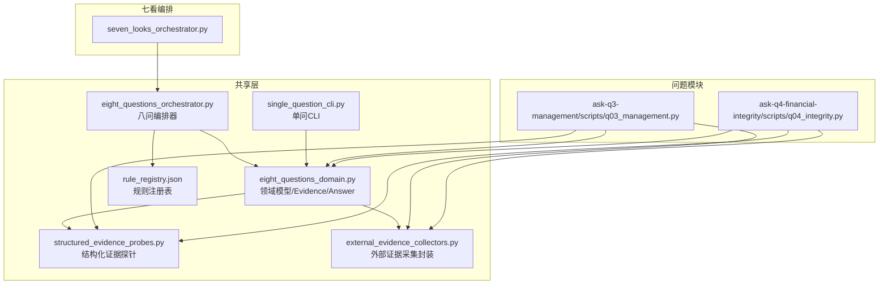
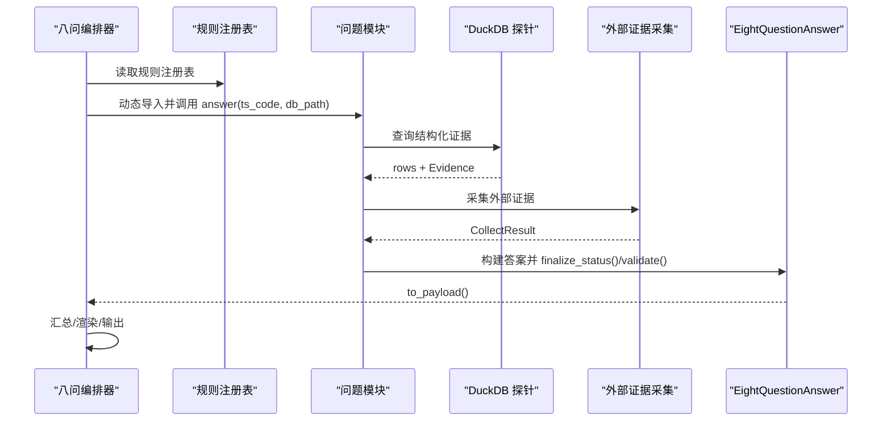
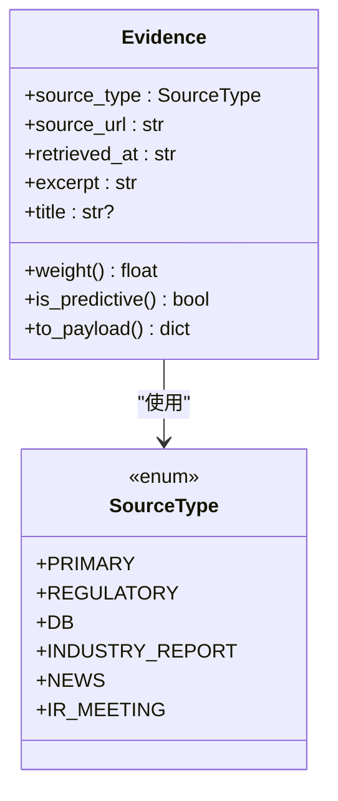
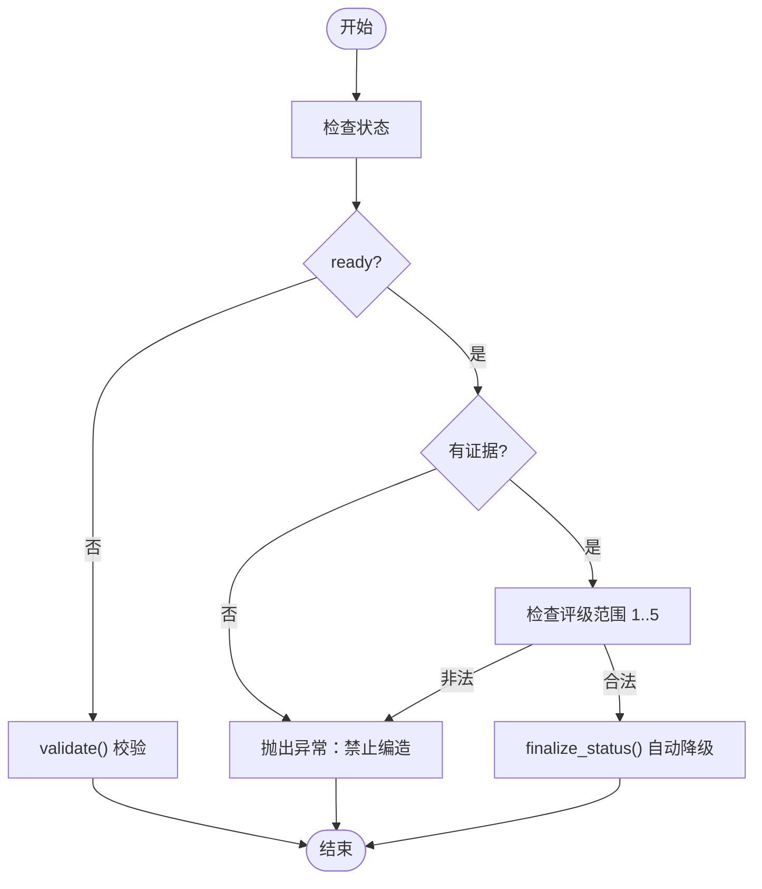
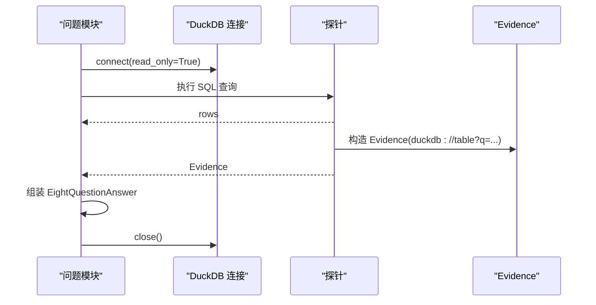
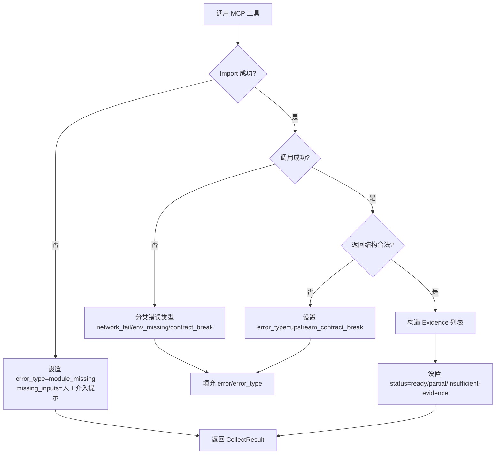
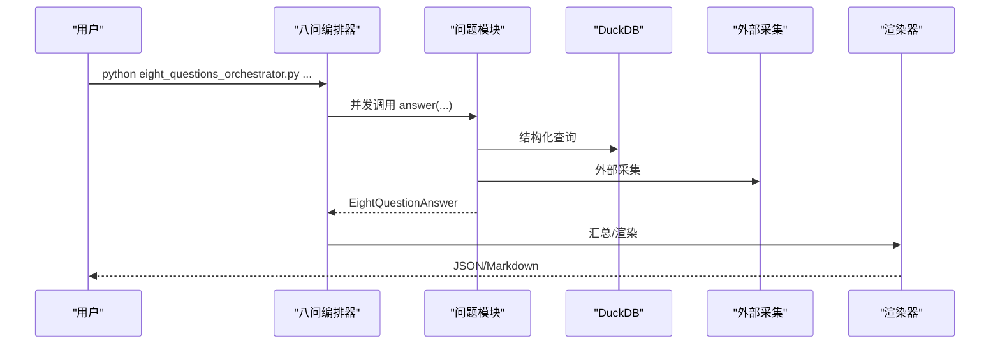
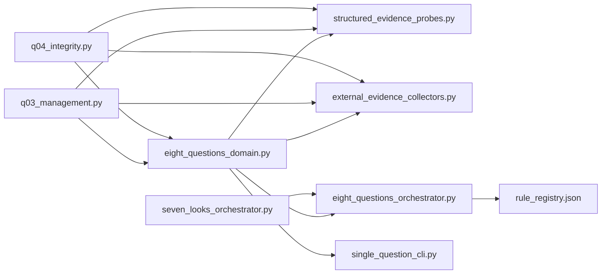

# 领域模型与证据规范

<cite>
**本文引用的文件**
- [eight_questions_domain.py](file://2min-company-analysis/seven-look-eight-question/scripts/eight_questions_domain.py)
- [structured_evidence_probes.py](file://2min-company-analysis/seven-look-eight-question/scripts/structured_evidence_probes.py)
- [eight_questions_orchestrator.py](file://2min-company-analysis/seven-look-eight-question/scripts/eight_questions_orchestrator.py)
- [single_question_cli.py](file://2min-company-analysis/seven-look-eight-question/scripts/single_question_cli.py)
- [external_evidence_collectors.py](file://2min-company-analysis/seven-look-eight-question/scripts/external_evidence_collectors.py)
- [rule_registry.json](file://2min-company-analysis/seven-look-eight-question/assets/rule_registry.json)
- [q03_management.py](file://2min-company-analysis/ask-q3-management/scripts/q03_management.py)
- [q04_integrity.py](file://2min-company-analysis/ask-q4-financial-integrity/scripts/q04_integrity.py)
- [seven_looks_orchestrator.py](file://2min-company-analysis/seven-look-eight-question/scripts/seven_looks_orchestrator.py)
</cite>

## 目录
1. [简介](#简介)
2. [项目结构](#项目结构)
3. [核心组件](#核心组件)
4. [架构总览](#架构总览)
5. [详细组件分析](#详细组件分析)
6. [依赖关系分析](#依赖关系分析)
7. [性能考量](#性能考量)
8. [故障排查指南](#故障排查指南)
9. [结论](#结论)
10. [附录](#附录)

## 简介
本文件系统化阐述“七看八问”财务分析框架中的共享领域模型与证据规范，重点包括：
- 共享数据模型的设计思路与实体关系
- Evidence 证据单元的结构定义、属性含义与生命周期管理
- CompanyProfile 公司档案的数据模型与更新机制
- EightQuestionAnswer 八问答案的数据结构与评分标准
- 证据收集的规范化流程与质量控制标准
- 数据验证规则、异常处理与一致性保证机制
- 如何在不同分析模块间共享与复用领域模型

## 项目结构
本项目围绕“七看八问”组织，核心位于 seven-look-eight-question/scripts 下，资产与规则注册位于 assets 目录，各问题模块位于 ask-qX-* 子目录中。整体采用“共享领域模型 + 规则注册 + 并行执行”的架构。

图表来源
- [eight_questions_domain.py:1-324](file://2min-company-analysis/seven-look-eight-question/scripts/eight_questions_domain.py#L1-L324)
- [structured_evidence_probes.py:1-386](file://2min-company-analysis/seven-look-eight-question/scripts/structured_evidence_probes.py#L1-L386)
- [eight_questions_orchestrator.py:1-396](file://2min-company-analysis/seven-look-eight-question/scripts/eight_questions_orchestrator.py#L1-L396)
- [single_question_cli.py:1-158](file://2min-company-analysis/seven-look-eight-question/scripts/single_question_cli.py#L1-L158)
- [external_evidence_collectors.py:1-200](file://2min-company-analysis/seven-look-eight-question/scripts/external_evidence_collectors.py#L1-L200)
- [rule_registry.json:1-410](file://2min-company-analysis/seven-look-eight-question/assets/rule_registry.json#L1-L410)
- [q03_management.py:1-129](file://2min-company-analysis/ask-q3-management/scripts/q03_management.py#L1-L129)
- [q04_integrity.py:1-131](file://2min-company-analysis/ask-q4-financial-integrity/scripts/q04_integrity.py#L1-L131)
- [seven_looks_orchestrator.py:1-800](file://2min-company-analysis/seven-look-eight-question/scripts/seven_looks_orchestrator.py#L1-L800)

章节来源
- [eight_questions_domain.py:1-324](file://2min-company-analysis/seven-look-eight-question/scripts/eight_questions_domain.py#L1-L324)
- [rule_registry.json:1-410](file://2min-company-analysis/seven-look-eight-question/assets/rule_registry.json#L1-L410)

## 核心组件
- 共享领域模型
  - SourceType 枚举与权重表：定义证据来源类型及其权重，支持主数据、监管、数据库、研报、新闻、IR 等类型。
  - Evidence 证据单元：强校验结构，包含来源类型、URL、抓取时间、摘录、标题等，禁止空证据。
  - EightQuestionAnswer 八问答案：包含问题编号、标题、评级、回答、证据列表、状态、缺失输入、人工介入请求、关键缺口、评级信号等。
- 结构化证据探针
  - 基于 DuckDB 的结构化查询探针，统一返回 rows 与 Evidence，确保每条证据可溯源。
- 外部证据采集封装
  - 统一封装外部 MCP 工具调用，返回标准化 CollectResult，严格区分错误类型并决定降级策略。
- 编排器与 CLI
  - 八问编排器负责并发执行各问题模块，汇总结果并渲染输出；单问 CLI 提供独立运行与输出格式化能力。
- 规则注册表
  - 统一登记“七看八问”各规则的实现脚本、数据依赖、缺失字段与测试状态，便于自动化加载与校验。

章节来源
- [eight_questions_domain.py:26-110](file://2min-company-analysis/seven-look-eight-question/scripts/eight_questions_domain.py#L26-L110)
- [eight_questions_domain.py:72-111](file://2min-company-analysis/seven-look-eight-question/scripts/eight_questions_domain.py#L72-L111)
- [eight_questions_domain.py:123-212](file://2min-company-analysis/seven-look-eight-question/scripts/eight_questions_domain.py#L123-L212)
- [structured_evidence_probes.py:1-386](file://2min-company-analysis/seven-look-eight-question/scripts/structured_evidence_probes.py#L1-L386)
- [external_evidence_collectors.py:1-200](file://2min-company-analysis/seven-look-eight-question/scripts/external_evidence_collectors.py#L1-L200)
- [eight_questions_orchestrator.py:1-396](file://2min-company-analysis/seven-look-eight-question/scripts/eight_questions_orchestrator.py#L1-L396)
- [single_question_cli.py:1-158](file://2min-company-analysis/seven-look-eight-question/scripts/single_question_cli.py#L1-L158)
- [rule_registry.json:1-410](file://2min-company-analysis/seven-look-eight-question/assets/rule_registry.json#L1-L410)

## 架构总览
整体架构遵循“共享领域模型 + 规则注册 + 并行执行 + 质量控制”的设计原则，确保证据可溯源、评级可解释、状态可追踪、异常可分级。

图表来源
- [eight_questions_orchestrator.py:119-163](file://2min-company-analysis/seven-look-eight-question/scripts/eight_questions_orchestrator.py#L119-L163)
- [eight_questions_orchestrator.py:171-200](file://2min-company-analysis/seven-look-eight-question/scripts/eight_questions_orchestrator.py#L171-L200)
- [eight_questions_orchestrator.py:216-296](file://2min-company-analysis/seven-look-eight-question/scripts/eight_questions_orchestrator.py#L216-L296)
- [q03_management.py:38-120](file://2min-company-analysis/ask-q3-management/scripts/q03_management.py#L38-L120)
- [q04_integrity.py:35-122](file://2min-company-analysis/ask-q4-financial-integrity/scripts/q04_integrity.py#L35-L122)
- [structured_evidence_probes.py:384-386](file://2min-company-analysis/seven-look-eight-question/scripts/structured_evidence_probes.py#L384-L386)
- [external_evidence_collectors.py:47-76](file://2min-company-analysis/seven-look-eight-question/scripts/external_evidence_collectors.py#L47-L76)

## 详细组件分析

### Evidence 证据单元
- 结构定义
  - 字段：来源类型、来源 URL、抓取时间（ISO8601）、摘录（非空）、标题（可选）。
  - 属性：权重 weight（来自 SourceType 权重表）、是否预测性 is_predictive（研报/IR）。
  - 方法：to_payload 序列化、__post_init__ 强校验。
- 生命周期
  - 创建：由结构化探针或外部采集器构造，严格校验非空摘录与合法时间格式。
  - 使用：加入 EightQuestionAnswer.evidence 列表，参与状态判定与加权评级。
  - 输出：to_payload 导出为报告/JSON。
- 质量控制
  - 禁止空证据；禁止空摘录；禁止非法时间格式；预测性来源自动标注。
- 与 SourceType 的关系
  - 权重与标签映射统一维护，便于跨模块一致性。

图表来源
- [eight_questions_domain.py:72-111](file://2min-company-analysis/seven-look-eight-question/scripts/eight_questions_domain.py#L72-L111)
- [eight_questions_domain.py:26-56](file://2min-company-analysis/seven-look-eight-question/scripts/eight_questions_domain.py#L26-L56)

章节来源
- [eight_questions_domain.py:72-111](file://2min-company-analysis/seven-look-eight-question/scripts/eight_questions_domain.py#L72-L111)
- [eight_questions_domain.py:35-47](file://2min-company-analysis/seven-look-eight-question/scripts/eight_questions_domain.py#L35-L47)

### EightQuestionAnswer 八问答案
- 结构定义
  - 包含问题编号、标题、评级（1..5 或 None）、回答、证据列表、状态、缺失输入、人工介入请求、关键缺口、评级信号等。
- 状态与降级
  - 状态集合：ready、partial、insufficient-evidence、human-in-loop-required。
  - finalize_status 自动降级规则：优先级最高为人工介入请求，其次为缺失输入导致的 partial，最后保留原状态。
- 评分与加权
  - 评级为整数（1..5），加权评级为 rating × 平均证据权重，保留三位小数。
- 校验与一致性
  - validate 强制校验状态与评级范围；ready 状态下必须有证据且评级有效，且缺失输入与人工请求为空。
- 输出
  - to_payload 导出完整答案，包含证据数量、是否有预测性来源、关键缺口与评级信号等。

图表来源
- [eight_questions_domain.py:140-167](file://2min-company-analysis/seven-look-eight-question/scripts/eight_questions_domain.py#L140-L167)
- [eight_questions_domain.py:168-186](file://2min-company-analysis/seven-look-eight-question/scripts/eight_questions_domain.py#L168-L186)

章节来源
- [eight_questions_domain.py:123-212](file://2min-company-analysis/seven-look-eight-question/scripts/eight_questions_domain.py#L123-L212)
- [eight_questions_domain.py:140-167](file://2min-company-analysis/seven-look-eight-question/scripts/eight_questions_domain.py#L140-L167)

### 结构化证据探针（DuckDB）
- 设计原则
  - 每个探针返回 (rows, Evidence)，rows 供上游评级逻辑使用，Evidence 以 duckdb://table?q=... 为 URL，excerpt 为关键字段摘要。
  - 连接必须 read_only；失败返回 (None, None)。
- 典型探针
  - 管理团队：公司概况、高管、薪酬、前十大股东。
  - 财务真实性：名称历史、净现比。
  - 主营业务与同行：主营构成、申万同行池。
  - 风险：质押统计、ST/退市警示。
  - 未来规划：业绩预告、业绩快报。
- 质量控制
  - 摘录长度限制，避免超大数据写入 JSON；非空摘录校验；统一标题与来源标签。

图表来源
- [structured_evidence_probes.py:28-31](file://2min-company-analysis/seven-look-eight-question/scripts/structured_evidence_probes.py#L28-L31)
- [structured_evidence_probes.py:39-50](file://2min-company-analysis/seven-look-eight-question/scripts/structured_evidence_probes.py#L39-L50)
- [structured_evidence_probes.py:58-80](file://2min-company-analysis/seven-look-eight-question/scripts/structured_evidence_probes.py#L58-L80)

章节来源
- [structured_evidence_probes.py:1-386](file://2min-company-analysis/seven-look-eight-question/scripts/structured_evidence_probes.py#L1-L386)

### 外部证据采集封装（MCP）
- 统一返回结构 CollectResult：包含 evidence、status、missing_inputs、notes、error、error_type。
- 错误分类与降级策略
  - env_missing/module_missing/upstream_contract_break/source_disabled：必须人工介入。
  - network_fail/not_found：可降级为 partial 或 insufficient-evidence。
- 环境校验
  - 百炼相关工具依赖 DASHSCOPE_API_KEY，缺则硬拦截并提示。
- 质量控制
  - 摘录截断、异常捕获、证据强校验，避免伪造证据。

图表来源
- [external_evidence_collectors.py:140-193](file://2min-company-analysis/seven-look-eight-question/scripts/external_evidence_collectors.py#L140-L193)
- [external_evidence_collectors.py:119-133](file://2min-company-analysis/seven-look-eight-question/scripts/external_evidence_collectors.py#L119-L133)
- [external_evidence_collectors.py:95-106](file://2min-company-analysis/seven-look-eight-question/scripts/external_evidence_collectors.py#L95-L106)

章节来源
- [external_evidence_collectors.py:1-200](file://2min-company-analysis/seven-look-eight-question/scripts/external_evidence_collectors.py#L1-L200)

### 八问编排器与单问 CLI
- 八问编排器
  - 动态加载规则注册表，按问题 ID 加载模块，支持并发执行，异常不影响其他问题。
  - 汇总状态分布、平均评级与加权平均评级，渲染 Markdown 报告。
  - 提供 cross_validate 与其他模块的交叉校验能力。
- 单问 CLI
  - 为每个问题模块提供独立运行入口，输出 JSON 与 Markdown，支持自定义输出目录与格式。

图表来源
- [eight_questions_orchestrator.py:346-391](file://2min-company-analysis/seven-look-eight-question/scripts/eight_questions_orchestrator.py#L346-L391)
- [eight_questions_orchestrator.py:119-163](file://2min-company-analysis/seven-look-eight-question/scripts/eight_questions_orchestrator.py#L119-L163)
- [single_question_cli.py:126-158](file://2min-company-analysis/seven-look-eight-question/scripts/single_question_cli.py#L126-L158)

章节来源
- [eight_questions_orchestrator.py:1-396](file://2min-company-analysis/seven-look-eight-question/scripts/eight_questions_orchestrator.py#L1-L396)
- [single_question_cli.py:1-158](file://2min-company-analysis/seven-look-eight-question/scripts/single_question_cli.py#L1-L158)

### 规则注册表与跨模块协作
- 规则注册表
  - 统一登记“七看八问”各规则的脚本路径、数据依赖、缺失字段、衍生指标与测试状态。
  - 八问编排器通过注册表动态构建问题模块映射，确保执行一致性。
- 与七看编排器的协作
  - 七看编排器在汇总阶段调用八问的 cross_validate，实现财务真实性与利润质量的交叉验证。

章节来源
- [rule_registry.json:1-410](file://2min-company-analysis/seven-look-eight-question/assets/rule_registry.json#L1-L410)
- [eight_questions_orchestrator.py:299-318](file://2min-company-analysis/seven-look-eight-question/scripts/eight_questions_orchestrator.py#L299-L318)
- [seven_looks_orchestrator.py:302-330](file://2min-company-analysis/seven-look-eight-question/scripts/seven_looks_orchestrator.py#L302-L330)

## 依赖关系分析

图表来源
- [eight_questions_domain.py:1-324](file://2min-company-analysis/seven-look-eight-question/scripts/eight_questions_domain.py#L1-L324)
- [structured_evidence_probes.py:1-386](file://2min-company-analysis/seven-look-eight-question/scripts/structured_evidence_probes.py#L1-L386)
- [external_evidence_collectors.py:1-200](file://2min-company-analysis/seven-look-eight-question/scripts/external_evidence_collectors.py#L1-L200)
- [eight_questions_orchestrator.py:1-396](file://2min-company-analysis/seven-look-eight-question/scripts/eight_questions_orchestrator.py#L1-L396)
- [single_question_cli.py:1-158](file://2min-company-analysis/seven-look-eight-question/scripts/single_question_cli.py#L1-L158)
- [q03_management.py:1-129](file://2min-company-analysis/ask-q3-management/scripts/q03_management.py#L1-L129)
- [q04_integrity.py:1-131](file://2min-company-analysis/ask-q4-financial-integrity/scripts/q04_integrity.py#L1-L131)
- [seven_looks_orchestrator.py:1-800](file://2min-company-analysis/seven-look-eight-question/scripts/seven_looks_orchestrator.py#L1-L800)

章节来源
- [eight_questions_orchestrator.py:82-100](file://2min-company-analysis/seven-look-eight-question/scripts/eight_questions_orchestrator.py#L82-L100)
- [q03_management.py:18-31](file://2min-company-analysis/ask-q3-management/scripts/q03_management.py#L18-L31)
- [q04_integrity.py:15-22](file://2min-company-analysis/ask-q4-financial-integrity/scripts/q04_integrity.py#L15-L22)

## 性能考量
- 并行执行
  - 八问编排器使用线程池并发执行问题模块，提升吞吐量，异常不影响其他任务。
- DuckDB 连接
  - 探针统一使用 read_only 连接，避免写操作带来的锁竞争与一致性问题。
- 输出裁剪
  - 摘录长度限制与时间戳格式化，减少 JSON 体积与渲染开销。
- 降级策略
  - 外部采集失败时按错误类型进行降级，避免阻塞整体流程。

章节来源
- [eight_questions_orchestrator.py:153-163](file://2min-company-analysis/seven-look-eight-question/scripts/eight_questions_orchestrator.py#L153-L163)
- [structured_evidence_probes.py:28-31](file://2min-company-analysis/seven-look-eight-question/scripts/structured_evidence_probes.py#L28-L31)
- [external_evidence_collectors.py:78-84](file://2min-company-analysis/seven-look-eight-question/scripts/external_evidence_collectors.py#L78-L84)

## 故障排查指南
- 常见问题与定位
  - DuckDB 文件不存在：探针连接失败，答案状态降为 insufficient-evidence，并记录 critical_gaps。
  - 外部采集失败：根据 error_type 决定降级；env_missing/module_missing 必须人工介入。
  - 答案校验失败：validate 抛错时强制降级为 insufficient-evidence，并记录 notes。
  - 证据为空：ready 状态下必须有证据，否则抛错。
- 建议处理步骤
  - 检查数据库路径与权限；确认 DuckDB 文件存在且可读。
  - 检查 MCP 环境变量（如 DASHSCOPE_API_KEY）与网络连通性。
  - 查看日志与 notes，确认缺失输入与人工介入请求。
  - 对于 cross_validation 场景，核对七看与八问之间的指标一致性。

章节来源
- [eight_questions_domain.py:140-167](file://2min-company-analysis/seven-look-eight-question/scripts/eight_questions_domain.py#L140-L167)
- [external_evidence_collectors.py:119-133](file://2min-company-analysis/seven-look-eight-question/scripts/external_evidence_collectors.py#L119-L133)
- [eight_questions_orchestrator.py:132-151](file://2min-company-analysis/seven-look-eight-question/scripts/eight_questions_orchestrator.py#L132-L151)

## 结论
本项目通过共享领域模型与严格的证据规范，实现了“七看八问”框架下的高质量财务分析。Evidence 的强校验与 SourceType 的权重体系确保了证据的可信度与可比性；EightQuestionAnswer 的状态机与加权评级提供了可解释的评分机制；规则注册表与编排器保障了模块化与可扩展性。外部证据采集封装与错误分类机制进一步提升了系统的鲁棒性与可维护性。

## 附录
- 八问清单（问题 ID、标题、描述、原始问题、关键点）
  - 1. 行业前景
  - 2. 竞争优势
  - 3. 管理团队
  - 4. 财务真实性
  - 5. 市场地位
  - 6. 业务模式
  - 7. 风险因素
  - 8. 未来规划

章节来源
- [eight_questions_domain.py:220-277](file://2min-company-analysis/seven-look-eight-question/scripts/eight_questions_domain.py#L220-L277)