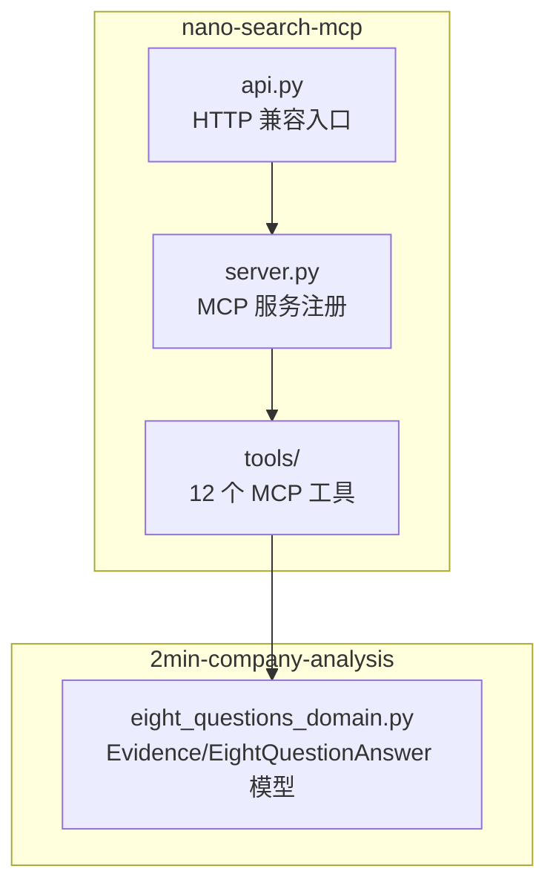
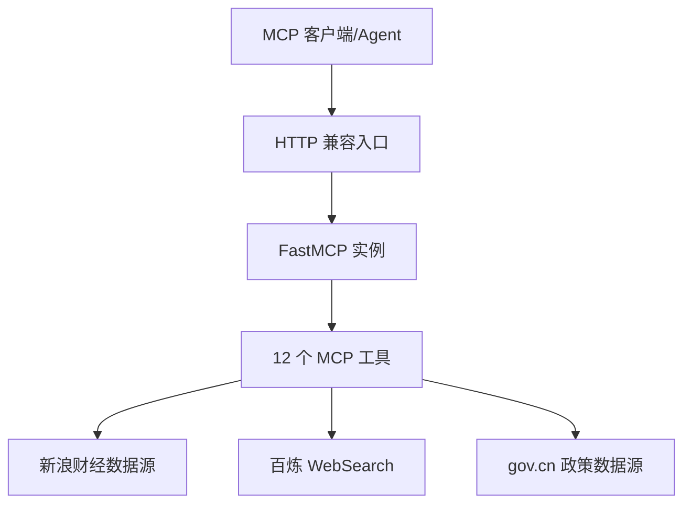
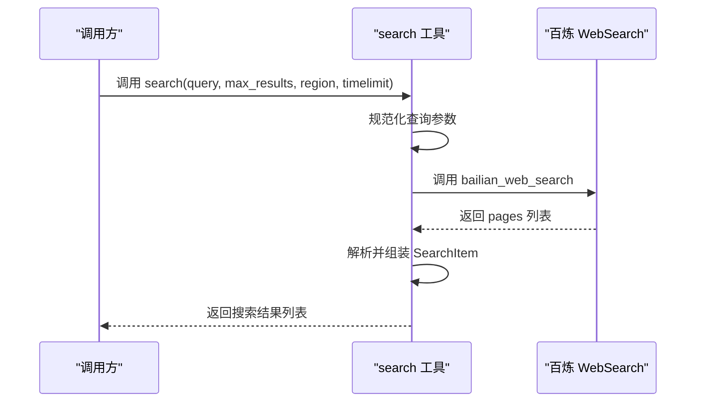
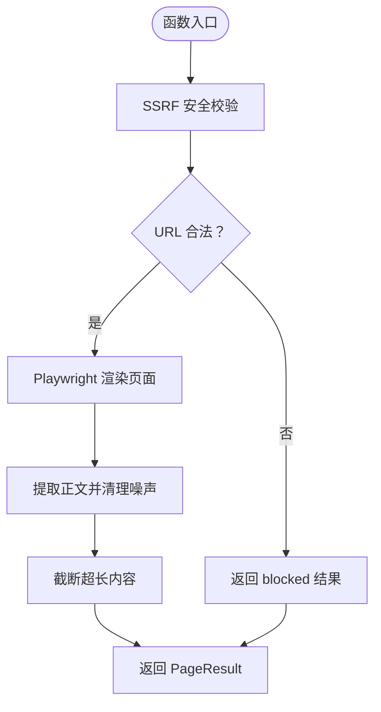
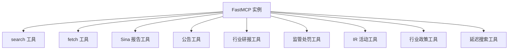

# API 参考文档

<cite>
**本文档引用的文件**
- [README.md](file://nano-search-mcp/README.md)
- [pyproject.toml](file://nano-search-mcp/pyproject.toml)
- [server.py](file://nano-search-mcp/src/nano_search_mcp/server.py)
- [api.py](file://nano-search-mcp/src/nano_search_mcp/api.py)
- [eight_questions_domain.py](file://2min-company-analysis/seven-look-eight-question/scripts/eight_questions_domain.py)
- [search.py](file://nano-search-mcp/src/nano_search_mcp/tools/search.py)
- [fetch.py](file://nano-search-mcp/src/nano_search_mcp/tools/fetch.py)
- [sina_reports.py](file://nano-search-mcp/src/nano_search_mcp/tools/sina_reports.py)
- [announcements.py](file://nano-search-mcp/src/nano_search_mcp/tools/announcements.py)
- [industry_reports.py](file://nano-search-mcp/src/nano_search_mcp/tools/industry_reports.py)
- [ir_meetings.py](file://nano-search-mcp/src/nano_search_mcp/tools/ir_meetings.py)
- [regulatory_penalties.py](file://nano-search-mcp/src/nano_search_mcp/tools/regulatory_penalties.py)
- [industry_policies.py](file://nano-search-mcp/src/nano_search_mcp/tools/industry_policies.py)
- [deferred_search.py](file://nano-search-mcp/src/nano_search_mcp/tools/deferred_search.py)
</cite>

## 目录
1. [简介](#简介)
2. [项目结构](#项目结构)
3. [核心组件](#核心组件)
4. [架构概览](#架构概览)
5. [详细组件分析](#详细组件分析)
6. [依赖关系分析](#依赖关系分析)
7. [性能考虑](#性能考虑)
8. [故障排除指南](#故障排除指南)
9. [结论](#结论)
10. [附录](#附录)

## 简介
本项目为 NanoQuant Skills 的数据搜索子模块，提供基于 MCP（Model Context Protocol）协议的搜索与抓取服务，专注于中国 A 股市场的外部证据采集。服务通过 12 个 MCP 工具覆盖通用检索、定期报告、临时公告、行业研报、监管处罚、投资者关系活动、行业政策等能力域，为“七看八问”分析框架提供结构化的外部证据链路。

## 项目结构
- nano-search-mcp：MCP 服务核心，包含工具注册与 HTTP 兼容入口
- 2min-company-analysis：外部证据采集与分析技能，依赖 MCP 工具输出 Evidence/EightQuestionAnswer 等领域模型

图表来源
- [server.py:19-70](file://nano-search-mcp/src/nano_search_mcp/server.py#L19-L70)
- [api.py:1-12](file://nano-search-mcp/src/nano_search_mcp/api.py#L1-L12)
- [eight_questions_domain.py:72-212](file://2min-company-analysis/seven-look-eight-question/scripts/eight_questions_domain.py#L72-L212)

章节来源
- [README.md:178-198](file://nano-search-mcp/README.md#L178-L198)
- [server.py:19-70](file://nano-search-mcp/src/nano_search_mcp/server.py#L19-L70)

## 核心组件
- MCP 服务实例：FastMCP，提供 streamable HTTP 接口与工具注册
- 12 个 MCP 工具：search、fetch_page、search_deferred_topic、get_company_report、list_announcements、get_announcement_text、list_industry_reports、get_report_text、list_regulatory_penalties、list_ir_meetings、get_ir_meeting_text、list_industry_policies
- HTTP 兼容入口：app = mcp.streamable_http_app()

章节来源
- [server.py:19-70](file://nano-search-mcp/src/nano_search_mcp/server.py#L19-L70)
- [api.py:1-12](file://nano-search-mcp/src/nano_search_mcp/api.py#L1-L12)
- [README.md:28-49](file://nano-search-mcp/README.md#L28-L49)

## 架构概览
MCP 服务通过 FastMCP 实例统一管理工具注册与生命周期，HTTP 兼容入口提供 streamable HTTP 接口，工具层负责具体的数据源抓取与解析。

图表来源
- [server.py:19-70](file://nano-search-mcp/src/nano_search_mcp/server.py#L19-L70)
- [api.py:1-12](file://nano-search-mcp/src/nano_search_mcp/api.py#L1-L12)
- [industry_policies.py:94-167](file://nano-search-mcp/src/nano_search_mcp/tools/industry_policies.py#L94-L167)
- [deferred_search.py:102-139](file://nano-search-mcp/src/nano_search_mcp/tools/deferred_search.py#L102-L139)

## 详细组件分析

### MCP 服务与工具注册
- 服务名称："NanoSearch"
- streamable HTTP 路径："/mcp"
- 工具注册：search、fetch、sina_reports、deferred_search、announcements、industry_reports、regulatory_penalties、ir_meetings、industry_policies
- 错误契约：search/get_company_report 在参数非法或网络彻底失败时抛异常；其余工具失败时返回 {source: "unavailable", error, fetch_time}

章节来源
- [server.py:19-70](file://nano-search-mcp/src/nano_search_mcp/server.py#L19-L70)
- [README.md:47-48](file://nano-search-mcp/README.md#L47-L48)

### HTTP 兼容入口
- app = mcp.streamable_http_app() 提供标准 MCP streamable HTTP 服务
- main() 兼容旧入口，实际调用 mcp.run(transport="streamable-http")

章节来源
- [api.py:1-12](file://nano-search-mcp/src/nano_search_mcp/api.py#L1-L12)

### 通用检索工具

#### search
- 功能：基于阿里云百炼 WebSearch 的网页搜索
- 参数
  - query: str（必填，非空）
  - max_results: int，默认 5，范围 [1, 30]
  - region: str，默认 "zh-cn"
  - timelimit: str | None，可选 "d"/"w"/"m"/"y"
- 返回：list[SearchItem]，包含 title/url/snippet
- 错误：RuntimeError（百炼 MCP 调用失败）

图表来源
- [search.py:17-70](file://nano-search-mcp/src/nano_search_mcp/tools/search.py#L17-L70)
- [search.py:79-119](file://nano-search-mcp/src/nano_search_mcp/tools/search.py#L79-L119)

章节来源
- [search.py:79-119](file://nano-search-mcp/src/nano_search_mcp/tools/search.py#L79-L119)

#### fetch_page
- 功能：抓取任意 HTTP/HTTPS 页面正文，自动清理导航/页脚/广告等噪声
- 参数：url: str（绝对 URL）
- 返回：PageResult，包含 url/content/method/truncated/error
- 安全性：SSRF 防护，拒绝 file://、loopback、RFC1918 私网、链路本地等
- 错误：返回 {"url","content","method":"playwright|blocked","truncated","error"}

图表来源
- [fetch.py:24-74](file://nano-search-mcp/src/nano_search_mcp/tools/fetch.py#L24-L74)
- [fetch.py:186-217](file://nano-search-mcp/src/nano_search_mcp/tools/fetch.py#L186-L217)

章节来源
- [fetch.py:186-245](file://nano-search-mcp/src/nano_search_mcp/tools/fetch.py#L186-L245)

#### search_deferred_topic
- 功能：基于主题模板或自由查询的百炼 WebSearch 检索，支持 context 变量填充
- 参数
  - topic_id: str（主题标识符）
  - query_override: str（覆盖模板的查询词）
  - max_results: int，默认 10，范围 [1, 30]
  - region: str，默认 "cn-zh"
  - context: dict[str,str] | None（模板变量）
- 返回：包含 topic_id/query/source/results/fetch_time 的字典
- 错误：返回 {"topic_id","source":"unavailable","error","fetch_time"}

章节来源
- [deferred_search.py:145-238](file://nano-search-mcp/src/nano_search_mcp/tools/deferred_search.py#L145-L238)

### 定期报告工具

#### get_company_report
- 功能：获取指定年份 A 股公司定期报告全文正文
- 参数
  - stockid: str（6 位数字，不含交易所前缀）
  - year: int（必须显式提供，四位年份）
  - report_type: str，默认 "annual"，可选 "annual"/"semi"/"q1"/"q3" 或中文别名
- 返回：报告正文（含标题、发布日期、来源链接）
- 错误：ValueError（参数非法/找不到报告）、RuntimeError（正文抓取失败）

章节来源
- [sina_reports.py:314-369](file://nano-search-mcp/src/nano_search_mcp/tools/sina_reports.py#L314-L369)

### 临时公告工具

#### list_announcements
- 功能：获取 A 股公司临时公告列表（来源：新浪财经 vCB_AllBulletin）
- 参数
  - ts_code: str（Tushare 格式，如 "688270.SH"）
  - start_date: str，默认当年 1 月 1 日（YYYY-MM-DD）
  - end_date: str，默认今日（YYYY-MM-DD）
  - ann_types: list[str] | None（过滤公告类型）
- 返回：包含 ts_code/source/announcements 的字典
- 错误：返回 {"ts_code","source":"unavailable","error","fetch_time"}

章节来源
- [announcements.py:404-490](file://nano-search-mcp/src/nano_search_mcp/tools/announcements.py#L404-L490)

#### get_announcement_text
- 功能：抓取单条公告全文正文
- 参数：source_url: str（来自 list_announcements 的 source_url）
- 返回：成功时包含 source_url/full_text/extracted_at，失败时 full_text 为空并附 error

章节来源
- [announcements.py:491-535](file://nano-search-mcp/src/nano_search_mcp/tools/announcements.py#L491-L535)

### 行业研报工具

#### list_industry_reports
- 功能：列出券商发布的行业研究报告（来源：新浪财经）
- 参数
  - industry_sw_l2: str（申万二级行业名）
  - keywords: list[str] | None（标题关键词白名单）
  - start_date: str，默认近 365 天
  - end_date: str，默认今日
  - limit: int，默认 50，范围 [1, 200]
  - ts_code: str（Tushare 格式，自动路由至所属申万行业）
- 返回：包含 industry_sw_l2/source/reports 的字典
- 错误：返回 {"industry_sw_l2","source":"unavailable","error","fetch_time"}

章节来源
- [industry_reports.py:384-457](file://nano-search-mcp/src/nano_search_mcp/tools/industry_reports.py#L384-L457)

#### get_report_text
- 功能：抓取单条行业研报全文正文
- 参数：source_url: str（来自 list_industry_reports 的 source_url）
- 返回：成功时包含 source_url/full_text/extracted_at，失败时 full_text 为空并附 error

章节来源
- [industry_reports.py:459-495](file://nano-search-mcp/src/nano_search_mcp/tools/industry_reports.py#L459-L495)

### 监管处罚工具

#### list_regulatory_penalties
- 功能：列出 A 股公司监管处罚/违规处理记录（来源：新浪财经违规处理专页）
- 参数
  - ts_code: str（Tushare 格式）
  - start_date: str（YYYY-MM-DD，默认不限）
  - end_date: str（YYYY-MM-DD，默认不限）
- 返回：包含 ts_code/source/penalties 的字典
- 错误：返回 {"ts_code","source":"unavailable","error","fetch_time"}

章节来源
- [regulatory_penalties.py:393-447](file://nano-search-mcp/src/nano_search_mcp/tools/regulatory_penalties.py#L393-L447)

### 投资者关系工具

#### list_ir_meetings
- 功能：获取 A 股公司投资者关系活动记录（来源：新浪财经临时公告 lsgg 分类）
- 参数
  - ts_code: str（Tushare 格式）
  - start_date: str，默认近 180 天
  - end_date: str，默认今日
  - meeting_types: list[str] | None（过滤会议类型）
- 返回：包含 ts_code/source/meetings 的字典
- 错误：返回 {"ts_code","source":"unavailable","error","fetch_time"}

章节来源
- [ir_meetings.py:489-568](file://nano-search-mcp/src/nano_search_mcp/tools/ir_meetings.py#L489-L568)

#### get_ir_meeting_text
- 功能：抓取单条 IR 纪要/调研记录表全文
- 参数：source_url: str（来自 list_ir_meetings 的 source_url）
- 返回：成功时包含 source_url/full_text/participants/extracted_at，失败时 full_text 为空并附 error

章节来源
- [ir_meetings.py:570-618](file://nano-search-mcp/src/nano_search_mcp/tools/ir_meetings.py#L570-L618)

### 行业政策工具

#### list_industry_policies
- 功能：检索政府机构（*.gov.cn）发布的行业政策文件
- 参数
  - industry_sw_l2: str（申万二级行业名）
  - keywords: list[str] | None（业务关键词）
- 返回：包含 industry_sw_l2/source/policies/fetch_time 的字典
- 错误：返回 {"industry_sw_l2","source":"unavailable","error","fetch_time"}

章节来源
- [industry_policies.py:185-246](file://nano-search-mcp/src/nano_search_mcp/tools/industry_policies.py#L185-L246)

### 数据模型定义

#### Evidence（证据单元）
- 字段
  - source_type: SourceType（主报告/监管/数据库/行业研报/新闻/IR）
  - source_url: str（http(s)://...、duckdb://table、file://path）
  - retrieved_at: str（ISO8601）
  - excerpt: str（原文/字段摘录，禁止空字符串）
  - title: str | None
- 方法
  - weight: float（按权重表计算）
  - is_predictive: bool（是否预测/口径标记）
  - to_payload(): dict（序列化为 API 输出格式）

章节来源
- [eight_questions_domain.py:72-111](file://2min-company-analysis/seven-look-eight-question/scripts/eight_questions_domain.py#L72-L111)

#### EightQuestionAnswer（每问回答）
- 字段
  - question_id: int（1..8）
  - question_title: str
  - rating: int | None（1..5，不足证据时为 None）
  - answer: str（文字回答，可为空）
  - evidence: list[Evidence]
  - status: AnswerStatus（"ready"/"partial"/"insufficient-evidence"/"human-in-loop-required"）
  - missing_inputs: list[str]
  - notes: list[str]
  - human_in_loop_requests: list[str]
  - critical_gaps: list[str]
  - rating_signals: list[str]
- 方法
  - validate(): None（验证状态与评分约束）
  - finalize_status(): None（按证据缺口自动降级）
  - weighted_rating(): float | None（加权评级）
  - to_payload(): dict（序列化为 API 输出格式）

章节来源
- [eight_questions_domain.py:123-212](file://2min-company-analysis/seven-look-eight-question/scripts/eight_questions_domain.py#L123-L212)

## 依赖关系分析

图表来源
- [server.py:61-69](file://nano-search-mcp/src/nano_search_mcp/server.py#L61-L69)

章节来源
- [server.py:61-69](file://nano-search-mcp/src/nano_search_mcp/server.py#L61-L69)

## 性能考虑
- Playwright 浏览器复用：惰性创建并复用 Chromium 实例，降低冷启动开销
- 指数退避重试：各数据源采用指数退避策略，降低对目标站点的压力
- 请求限频：各工具内置最小请求间隔，避免过于频繁的抓取
- 缓存策略：公告、研报、IR、处罚等工具具备本地缓存，减少重复抓取
- 内容截断：正文最大字符数限制，避免内存溢出

## 故障排除指南
- SSRF 安全错误：检查 URL 协议与目标地址，确保符合白名单要求
- 网络超时：适当增加超时时间，考虑目标站点的响应特性
- 参数校验失败：检查输入参数格式与取值范围，特别是日期格式
- 缓存问题：清理 ~/.cache/nano_search_mcp 目录下的缓存文件
- Playwright 依赖：确保已安装并初始化 Playwright 浏览器

章节来源
- [fetch.py:24-74](file://nano-search-mcp/src/nano_search_mcp/tools/fetch.py#L24-L74)
- [README.md:104-104](file://nano-search-mcp/README.md#L104-L104)

## 结论
本项目提供了完整的 MCP 搜索与抓取服务，覆盖 A 股市场的主要外部证据来源。通过标准化的工具接口与严格的数据模型，为上层分析框架提供可靠、可扩展的证据采集能力。建议在生产环境中合理设置超时与重试策略，并充分利用缓存机制以提升整体性能。

## 附录

### 认证机制
- 本服务未实现专用认证机制，建议通过反向代理或网关进行访问控制
- HTTP 层具备基础的限流与重试策略

章节来源
- [README.md:50-54](file://nano-search-mcp/README.md#L50-L54)

### 版本兼容性
- 项目版本：0.1.0
- Python 版本要求：>=3.10
- 依赖：mcp[cli]、httpx、pyyaml、uvicorn、playwright、beautifulsoup4、markdownify

章节来源
- [pyproject.toml:1-14](file://nano-search-mcp/pyproject.toml#L1-L14)

### SDK 使用示例与最佳实践
- 基础使用
  - 通过命令行启动：nano-search-mcp
  - 作为 Python 包导入：from nano_search_mcp.server import mcp
- 最佳实践
  - 合理设置超时时间，特别是 fetch_page 与 get_company_report
  - 利用缓存机制减少重复抓取
  - 对外部输入进行严格的参数校验
  - 在高并发场景下注意请求限频与资源复用

章节来源
- [README.md:106-124](file://nano-search-mcp/README.md#L106-L124)