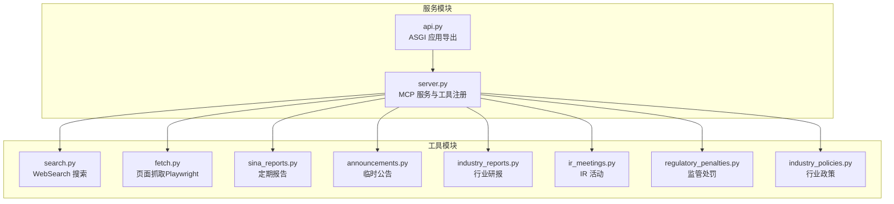
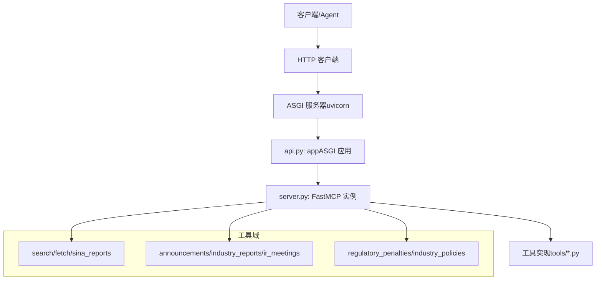
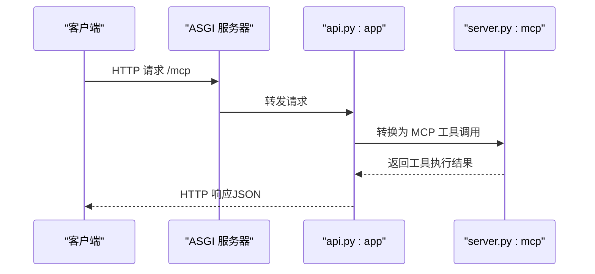
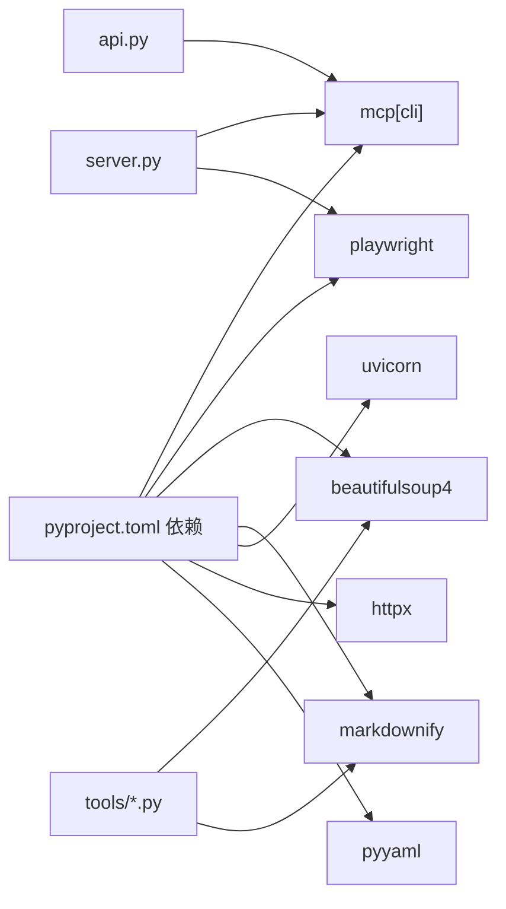

# HTTP REST API

<cite>
**本文引用的文件**
- [api.py](file://nano-search-mcp/src/nano_search_mcp/api.py)
- [server.py](file://nano-search-mcp/src/nano_search_mcp/server.py)
- [search.py](file://nano-search-mcp/src/nano_search_mcp/tools/search.py)
- [fetch.py](file://nano-search-mcp/src/nano_search_mcp/tools/fetch.py)
- [sina_reports.py](file://nano-search-mcp/src/nano_search_mcp/tools/sina_reports.py)
- [announcements.py](file://nano-search-mcp/src/nano_search_mcp/tools/announcements.py)
- [industry_reports.py](file://nano-search-mcp/src/nano_search_mcp/tools/industry_reports.py)
- [ir_meetings.py](file://nano-search-mcp/src/nano_search_mcp/tools/ir_meetings.py)
- [regulatory_penalties.py](file://nano-search_mcp/src/nano_search_mcp/tools/regulatory_penalties.py)
- [industry_policies.py](file://nano-search-mcp/src/nano_search_mcp/tools/industry_policies.py)
- [__init__.py](file://nano-search-mcp/src/nano_search_mcp/tools/__init__.py)
- [test_server.py](file://nano-search-mcp/tests/test_server.py)
- [README.md](file://nano-search-mcp/README.md)
- [pyproject.toml](file://nano-search-mcp/pyproject.toml)
</cite>

## 目录
1. [简介](#简介)
2. [项目结构](#项目结构)
3. [核心组件](#核心组件)
4. [架构总览](#架构总览)
5. [详细组件分析](#详细组件分析)
6. [依赖分析](#依赖分析)
7. [性能考虑](#性能考虑)
8. [故障排查指南](#故障排查指南)
9. [结论](#结论)
10. [附录](#附录)

## 简介
本文件为基于 Streamable HTTP 的 MCP（Model Context Protocol）服务的 HTTP REST API 文档。该服务面向中国 A 股市场，提供结构化文本检索与抓取能力，涵盖定期报告、临时公告、行业研报、监管处罚、投资者关系（IR）活动、行业政策等能力域。服务通过标准 MCP 工具注册机制暴露 12 个工具，统一以 Streamable HTTP 传输方式提供 REST 风格的调用入口。

- 默认监听地址与路径：http://127.0.0.1:8000/mcp
- 传输方式：Streamable HTTP（默认），也可切换为 stdio 以适配本地直连或某些 MCP 客户端
- 版本与兼容性：当前版本 0.1.0，遵循 MCP 协议规范，保持向后兼容

**章节来源**
- [README.md: 88](file://nano-search-mcp/README.md#L88)
- [server.py: 19-21:19-21](file://nano-search-mcp/src/nano_search_mcp/server.py#L19-L21)

## 项目结构
- 顶层模块：nano-search-mcp
  - 服务入口与工具注册：server.py
  - HTTP 兼容入口：api.py（导出 streamable HTTP ASGI 应用）
  - 工具模块：tools/ 下按能力域划分
  - 测试：tests/ 下包含服务契约与工具注册测试
  - 配置：pyproject.toml（项目元数据、依赖、脚本入口）

**图表来源**
- [server.py: 61-69:61-69](file://nano-search-mcp/src/nano_search_mcp/server.py#L61-L69)
- [api.py: 3-6:3-6](file://nano-search-mcp/src/nano_search_mcp/api.py#L3-L6)
- [__init__.py: 1-48:1-48](file://nano-search-mcp/src/nano_search_mcp/tools/__init__.py#L1-L48)

**章节来源**
- [pyproject.toml: 21-22:21-22](file://nano-search-mcp/pyproject.toml#L21-L22)
- [test_server.py: 49-83:49-83](file://nano-search-mcp/tests/test_server.py#L49-L83)

## 核心组件
- Streamable HTTP 应用
  - 由 MCP FastMCP 实例生成，路径为 /mcp
  - 通过 api.py 导出，供 ASGI 服务器（如 uvicorn）托管
- MCP 工具集合（12 个）
  - 通用检索：search、fetch_page、search_deferred_topic
  - 定期报告：get_company_report
  - 临时公告：list_announcements、get_announcement_text
  - 行业研报：list_industry_reports、get_report_text
  - 监管处罚：list_regulatory_penalties
  - 投资者关系：list_ir_meetings、get_ir_meeting_text
  - 行业政策：list_industry_policies
- 安全与稳定性
  - SSRF 防护（fetch_page、各抓取工具）
  - 指数退避重试与请求节流
  - 缓存策略（列表页与详情页 TTL）

**章节来源**
- [api.py: 6](file://nano-search-mcp/src/nano_search_mcp/api.py#L6)
- [server.py: 61-69:61-69](file://nano-search-mcp/src/nano_search_mcp/server.py#L61-L69)
- [README.md: 28-48:28-48](file://nano-search-mcp/README.md#L28-L48)

## 架构总览
服务采用 MCP FastMCP 核心，统一注册工具并通过 Streamable HTTP 暴露为 REST 风格的 /mcp 端点。客户端通过 HTTP 请求调用工具，服务内部转换为 MCP 工具执行，返回结构化结果。

**图表来源**
- [api.py: 6](file://nano-search-mcp/src/nano_search_mcp/api.py#L6)
- [server.py: 19-58:19-58](file://nano-search-mcp/src/nano_search_mcp/server.py#L19-L58)

## 详细组件分析

### HTTP 入口与传输
- 入口应用：api.py 导出 mcp.streamable_http_app() 生成的 ASGI 应用
- 默认监听：http://127.0.0.1:8000/mcp
- 传输切换：通过命令行参数 --transport 切换到 stdio

**图表来源**
- [api.py: 6](file://nano-search-mcp/src/nano_search_mcp/api.py#L6)
- [server.py: 83-86:83-86](file://nano-search-mcp/src/nano_search_mcp/server.py#L83-L86)
- [test_server.py: 30-33:30-33](file://nano-search-mcp/tests/test_server.py#L30-L33)

**章节来源**
- [README.md: 88](file://nano-search-mcp/README.md#L88)
- [test_server.py: 4-14:4-14](file://nano-search-mcp/tests/test_server.py#L4-L14)

### 工具注册与端点暴露
- 工具注册：server.py 中统一注册 12 个工具
- 端点路径：/mcp（Streamable HTTP）
- 工具清单（名称与能力域）：
  - 通用检索：search、fetch_page、search_deferred_topic
  - 定期报告：get_company_report
  - 临时公告：list_announcements、get_announcement_text
  - 行业研报：list_industry_reports、get_report_text
  - 监管处罚：list_regulatory_penalties
  - 投资者关系：list_ir_meetings、get_ir_meeting_text
  - 行业政策：list_industry_policies

**章节来源**
- [server.py: 61-69:61-69](file://nano-search-mcp/src/nano_search_mcp/server.py#L61-L69)
- [test_server.py: 49-83:49-83](file://nano-search-mcp/tests/test_server.py#L49-L83)

### 搜索工具（search）
- 功能：基于百炼 WebSearch 的网页搜索，返回标题、URL、摘要
- 参数要点：
  - query：必填，非空
  - max_results：1-30，默认 5
  - region：区域代码，常用 zh-cn/us-en/uk-en/wt-wt
  - timelimit：d/w/m/y 或 None
- 返回：列表，每项包含 title/url/snippet
- 错误：上游调用失败时抛异常

**章节来源**
- [search.py: 82-119:82-119](file://nano-search-mcp/src/nano_search_mcp/tools/search.py#L82-L119)

### 页面抓取工具（fetch_page）
- 功能：Playwright 渲染后提取正文，返回 Markdown
- 安全性：严格 SSRF 防护（仅 http/https，禁止 loopback/私网/云元数据等）
- 输出字段：url/content/method/truncated/error
- 失败：返回 {method:blocked/error}，不抛异常

**章节来源**
- [fetch.py: 244](file://nano-search-mcp/src/nano_search_mcp/tools/fetch.py#L244)
- [fetch.py: 186-217:186-217](file://nano-search-mcp/src/nano_search_mcp/tools/fetch.py#L186-L217)

### 定期报告工具（get_company_report）
- 功能：获取指定年份的年报/半年报/一季报/三季报全文正文
- 参数要点：
  - stockid：6 位数字
  - year：四位年份
  - report_type：annual/semi/q1/q3 或中文别名
- 错误：找不到目标报告或正文抓取失败时抛异常

**章节来源**
- [sina_reports.py: 317-369:317-369](file://nano-search-mcp/src/nano_search_mcp/tools/sina_reports.py#L317-L369)

### 临时公告工具（list_announcements、get_announcement_text）
- list_announcements：
  - 输入：ts_code、start_date、end_date、ann_types
  - 输出：包含公告列表，失败时返回 {source:unavailable,error,fetch_time}
- get_announcement_text：
  - 输入：source_url（来自 list 的条目）
  - 输出：full_text、extracted_at；失败时返回 {error}

**章节来源**
- [announcements.py: 407-490:407-490](file://nano-search-mcp/src/nano_search_mcp/tools/announcements.py#L407-L490)
- [announcements.py: 491-535:491-535](file://nano-search-mcp/src/nano_search_mcp/tools/announcements.py#L491-L535)

### 行业研报工具（list_industry_reports、get_report_text）
- list_industry_reports：
  - 输入：industry_sw_l2、keywords、start_date、end_date、limit、ts_code
  - 输出：报告列表；失败返回 {source:unavailable,error,fetch_time}
- get_report_text：
  - 输入：source_url
  - 输出：full_text、extracted_at；失败返回 {error}

**章节来源**
- [industry_reports.py: 384-457:384-457](file://nano-search-mcp/src/nano_search_mcp/tools/industry_reports.py#L384-L457)
- [industry_reports.py: 459-495:459-495](file://nano-search-mcp/src/nano_search_mcp/tools/industry_reports.py#L459-L495)

### 投资者关系工具（list_ir_meetings、get_ir_meeting_text）
- list_ir_meetings：
  - 输入：ts_code、start_date、end_date、meeting_types
  - 输出：会议列表（含 meeting_type/participants/summary/source_url）
- get_ir_meeting_text：
  - 输入：source_url
  - 输出：full_text、participants、extracted_at；失败返回 {error}

**章节来源**
- [ir_meetings.py: 489-568:489-568](file://nano-search-mcp/src/nano_search_mcp/tools/ir_meetings.py#L489-L568)
- [ir_meetings.py: 570-618:570-618](file://nano-search-mcp/src/nano_search_mcp/tools/ir_meetings.py#L570-L618)

### 监管处罚工具（list_regulatory_penalties）
- 输入：ts_code、start_date、end_date
- 输出：处罚记录列表（含 punish_date/event_type/title/reason/content/issuer/source_url）
- 失败：返回 {source:unavailable,error,fetch_time}

**章节来源**
- [regulatory_penalties.py: 393-447:393-447](file://nano-search-mcp/src/nano_search_mcp/tools/regulatory_penalties.py#L393-L447)

### 行业政策工具（list_industry_policies）
- 输入：industry_sw_l2、keywords
- 输出：政策列表（issuer/level/source_url/summary 等）
- 失败：返回 {source:unavailable,error,fetch_time}

**章节来源**
- [industry_policies.py: 185-246:185-246](file://nano-search-mcp/src/nano_search_mcp/tools/industry_policies.py#L185-L246)

## 依赖分析
- 外部依赖（关键）
  - mcp[cli]：MCP 协议与 FastMCP
  - httpx：HTTP 客户端（测试或扩展用途）
  - playwright：页面渲染与正文提取
  - beautifulsoup4/markdownify：HTML 解析与 Markdown 转换
  - uvicorn：ASGI 服务器
- 项目脚本
  - nano-search-mcp：命令行入口，启动 MCP 服务

**图表来源**
- [pyproject.toml: 6-14:6-14](file://nano-search-mcp/pyproject.toml#L6-L14)
- [api.py: 3-4:3-4](file://nano-search-mcp/src/nano_search_mcp/api.py#L3-L4)
- [server.py: 6-16:6-16](file://nano-search-mcp/src/nano_search_mcp/server.py#L6-L16)

**章节来源**
- [pyproject.toml: 6-14:6-14](file://nano-search-mcp/pyproject.toml#L6-L14)

## 性能考虑
- 请求节流与退避
  - 各抓取工具内置指数退避重试（最多 3 次）
  - 列表抓取工具设置最小请求间隔（如 1.0 秒）
- 缓存策略
  - 临时公告：列表页缓存 1 小时，详情页缓存 7 天
  - 行业研报：列表页缓存 1 小时，详情页缓存 7 天
  - IR 活动：列表页缓存 1 小时，详情页缓存 7 天
  - 监管处罚：列表页缓存 1 小时
- 资源复用
  - Playwright 浏览器实例惰性创建并复用，降低冷启动开销
- 超时与并发
  - 单次抓取超时建议覆盖最慢的 fetch_page/get_company_report
  - 建议在客户端进行并发控制与重试策略

**章节来源**
- [README.md: 104](file://nano-search-mcp/README.md#L104)
- [announcements.py: 74-76:74-76](file://nano-search-mcp/src/nano_search_mcp/tools/announcements.py#L74-L76)
- [industry_reports.py: 43-45:43-45](file://nano-search-mcp/src/nano_search_mcp/tools/industry_reports.py#L43-L45)
- [ir_meetings.py: 125-128:125-128](file://nano-search-mcp/src/nano_search_mcp/tools/ir_meetings.py#L125-L128)
- [regulatory_penalties.py: 55-57:55-57](file://nano-search-mcp/src/nano_search_mcp/tools/regulatory_penalties.py#L55-L57)
- [fetch.py: 133-142:133-142](file://nano-search-mcp/src/nano_search_mcp/tools/fetch.py#L133-L142)

## 故障排查指南
- 常见错误与返回结构
  - 失败统一返回：{"source":"unavailable","error":"...","fetch_time": "..."}
  - fetch_page 失败：{"method":"blocked"/"playwright","error":"..."}
- 定位步骤
  - 确认 /mcp 路径可达（默认 http://127.0.0.1:8000/mcp）
  - 检查工具名称是否在已注册列表中
  - 查看上游服务（百炼 WebSearch、新浪财经、gov.cn）可用性
  - 检查网络与防火墙策略（SSRF 防护会拒绝 loopback/私网等）
- 建议
  - 为长耗时工具预留充足超时
  - 使用缓存策略减少重复抓取
  - 对批量调用进行限速与重试

**章节来源**
- [test_server.py: 30-33:30-33](file://nano-search-mcp/tests/test_server.py#L30-L33)
- [announcements.py: 453-470:453-470](file://nano-search-mcp/src/nano_search_mcp/tools/announcements.py#L453-L470)
- [industry_reports.py: 436-451:436-451](file://nano-search-mcp/src/nano_search_mcp/tools/industry_reports.py#L436-L451)
- [ir_meetings.py: 537-556:537-556](file://nano-search-mcp/src/nano_search_mcp/tools/ir_meetings.py#L537-L556)
- [regulatory_penalties.py: 334-353:334-353](file://nano-search-mcp/src/nano_search_mcp/tools/regulatory_penalties.py#L334-L353)
- [fetch.py: 186-217:186-217](file://nano-search-mcp/src/nano_search_mcp/tools/fetch.py#L186-L217)

## 结论
本服务以 MCP 为核心，通过 Streamable HTTP 提供统一的 REST 风格 API，覆盖 A 股市场多类外部证据获取场景。其设计强调安全性（SSRF 防护）、稳定性（指数退避与缓存）与可维护性（工具注册契约）。客户端应遵循参数约束与错误返回约定，结合缓存与限速策略获得最佳体验。

[无章节来源——本节为总结性内容]

## 附录

### API 调用示例与 cURL 命令
- 启动服务（默认 streamable-http）
  - 命令：nano-search-mcp
  - 访问：http://127.0.0.1:8000/mcp
- 切换到 stdio 传输（便于本地直连）
  - 命令：nano-search-mcp --transport stdio
- 示例（概念性，非具体代码）
  - 使用 HTTP 客户端向 /mcp 发送请求，携带 MCP 工具调用负载
  - 依据各工具的参数与返回结构组织请求与解析响应

**章节来源**
- [README.md: 83-102:83-102](file://nano-search-mcp/README.md#L83-L102)

### 认证机制
- 本服务未内置 HTTP 层认证/鉴权机制
- 建议在反向代理或网关层添加认证（如 API Key、Token、IP 白名单等）

[无章节来源——本节为通用建议]

### 请求头与参数编码
- 传输层：HTTP/1.1 或 HTTP/2（由 ASGI 服务器与客户端协商）
- 编码：UTF-8（抓取与解析默认使用 UTF-8 或 GBK，视数据源而定）
- 参数编码：遵循 MCP 工具定义的 JSON 负载格式

**章节来源**
- [server.py: 19-21:19-21](file://nano-search-mcp/src/nano_search_mcp/server.py#L19-L21)

### 错误码与状态码
- HTTP 状态码
  - 200：成功
  - 4xx/5xx：服务端错误或上游不可用
- 工具错误返回
  - 成功：返回工具定义的数据结构
  - 失败：统一返回 {"source":"unavailable","error":"...","fetch_time":"ISO8601"}

**章节来源**
- [announcements.py: 453-470:453-470](file://nano-search-mcp/src/nano_search_mcp/tools/announcements.py#L453-L470)
- [industry_reports.py: 436-451:436-451](file://nano-search-mcp/src/nano_search_mcp/tools/industry_reports.py#L436-L451)
- [ir_meetings.py: 537-556:537-556](file://nano-search-mcp/src/nano_search_mcp/tools/ir_meetings.py#L537-L556)
- [regulatory_penalties.py: 334-353:334-353](file://nano-search-mcp/src/nano_search_mcp/tools/regulatory_penalties.py#L334-L353)

### 速率限制与缓存策略
- 速率限制
  - 列表抓取工具内置最小请求间隔（如 1.0 秒）
  - 建议客户端在批量调用时增加自定义节流
- 缓存策略
  - 临时公告：列表页 1 小时、详情页 7 天
  - 行业研报：列表页 1 小时、详情页 7 天
  - IR 活动：列表页 1 小时、详情页 7 天
  - 监管处罚：列表页 1 小时

**章节来源**
- [announcements.py: 48-51:48-51](file://nano-search-mcp/src/nano_search_mcp/tools/announcements.py#L48-L51)
- [industry_reports.py: 43-45:43-45](file://nano-search-mcp/src/nano_search_mcp/tools/industry_reports.py#L43-L45)
- [ir_meetings.py: 125-128:125-128](file://nano-search-mcp/src/nano_search_mcp/tools/ir_meetings.py#L125-L128)
- [regulatory_penalties.py: 55-57:55-57](file://nano-search-mcp/src/nano_search_mcp/tools/regulatory_penalties.py#L55-L57)

### 版本控制与兼容性
- 版本：0.1.0
- 兼容性：遵循 MCP 协议，保持工具注册契约稳定
- 建议：客户端以工具名称与参数契约为准，避免直接依赖内部实现细节

**章节来源**
- [pyproject.toml: 2-4:2-4](file://nano-search-mcp/pyproject.toml#L2-L4)
- [README.md: 124](file://nano-search-mcp/README.md#L124)