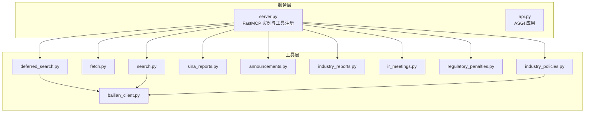
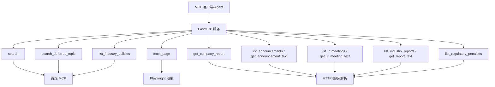
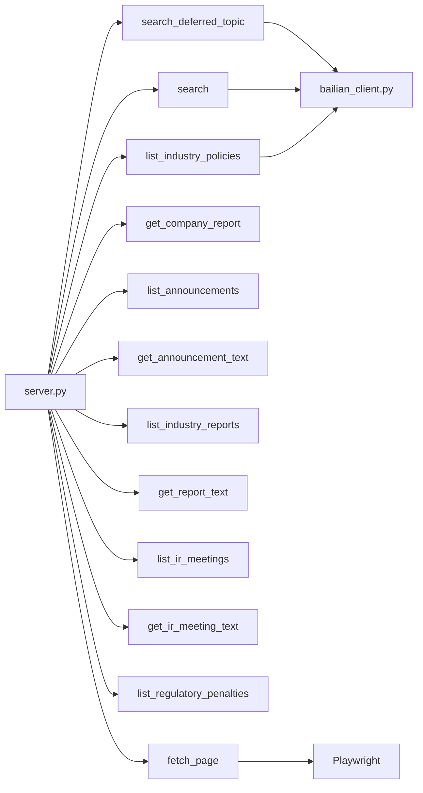
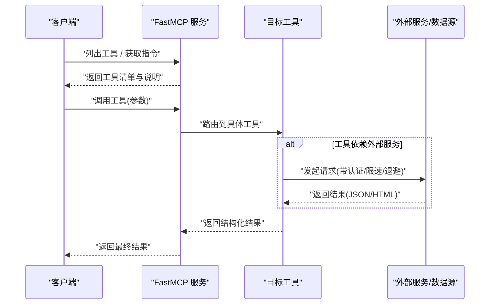
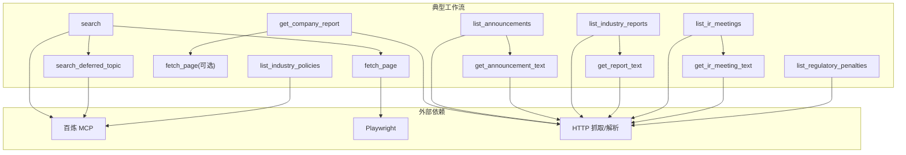

# MCP 工具 API

<cite>
**本文引用的文件**
- [README.md](file://README.md)
- [pyproject.toml](file://pyproject.toml)
- [server.py](file://nano-search-mcp/src/nano_search_mcp/server.py)
- [api.py](file://nano-search-mcp/src/nano_search_mcp/api.py)
- [__init__.py](file://nano-search-mcp/src/nano_search_mcp/tools/__init__.py)
- [bailian_client.py](file://nano-search-mcp/src/nano_search_mcp/tools/bailian_client.py)
- [search.py](file://nano-search-mcp/src/nano_search_mcp/tools/search.py)
- [fetch.py](file://nano-search-mcp/src/nano_search_mcp/tools/fetch.py)
- [deferred_search.py](file://nano-search-mcp/src/nano_search_mcp/tools/deferred_search.py)
- [announcements.py](file://nano-search-mcp/src/nano_search_mcp/tools/announcements.py)
- [industry_reports.py](file://nano-search-mcp/src/nano_search_mcp/tools/industry_reports.py)
- [regulatory_penalties.py](file://nano-search-mcp/src/nano_search_mcp/tools/regulatory_penalties.py)
- [ir_meetings.py](file://nano-search-mcp/src/nano_search_mcp/tools/ir_meetings.py)
- [industry_policies.py](file://nano-search-mcp/src/nano_search_mcp/tools/industry_policies.py)
- [sina_reports.py](file://nano-search-mcp/src/nano_search_mcp/tools/sina_reports.py)
- [test_server.py](file://nano-search-mcp/tests/test_server.py)
</cite>

## 目录
1. [简介](#简介)
2. [项目结构](#项目结构)
3. [核心组件](#核心组件)
4. [架构总览](#架构总览)
5. [详细组件分析](#详细组件分析)
6. [依赖分析](#依赖分析)
7. [性能考虑](#性能考虑)
8. [故障排查指南](#故障排查指南)
9. [结论](#结论)
10. [附录](#附录)

## 简介
本文件为 MCP 工具 API 的权威技术文档，覆盖 10 个核心 MCP 工具的接口规范、参数定义、返回值格式、调用示例、错误处理机制与安全基线。工具能力域包括：通用检索（search、fetch_page、search_deferred_topic）、定期报告（get_company_report）、临时公告（list_announcements、get_announcement_text）、行业研报（list_industry_reports、get_report_text）、监管与处罚（list_regulatory_penalties）、投资者关系（list_ir_meetings、get_ir_meeting_text）、行业政策（list_industry_policies）。文档还提供工具注册流程、调用序列图、工具间依赖关系与组合使用模式，帮助开发者正确理解与使用每个 MCP 工具。

## 项目结构
- 服务入口与注册：server.py 创建 FastMCP 实例并注册 12 个工具；api.py 提供兼容的 streamable HTTP ASGI 应用；__main__.py 提供命令行入口。
- 工具模块：tools/ 下按能力域划分具体工具实现，统一通过 tools/__init__.py 暴露公共 API。
- 外部依赖：基于 mcp[cli]、httpx、playwright、beautifulsoup4、markdownify、yaml 等库。
- 环境变量：BAILIAN_WEBSEARCH_ENDPOINT、DASHSCOPE_API_KEY、BAILIAN_MCP_TIMEOUT；另有 deferred-search 使用 docs/source-intake/deferred-tasks.md。

图表来源
- [server.py:19-69](file://nano-search-mcp/src/nano_search_mcp/server.py#L19-L69)
- [api.py:1-12](file://nano-search-mcp/src/nano_search_mcp/api.py#L1-L12)
- [__init__.py:1-48](file://nano-search-mcp/src/nano_search_mcp/tools/__init__.py#L1-L48)
- [bailian_client.py:12-21](file://nano-search-mcp/src/nano_search_mcp/tools/bailian_client.py#L12-L21)

章节来源
- [README.md:17-26](file://README.md#L17-L26)
- [pyproject.toml:1-44](file://pyproject.toml#L1-L44)
- [server.py:1-91](file://nano-search-mcp/src/nano_search_mcp/server.py#L1-L91)
- [api.py:1-12](file://nano-search-mcp/src/nano_search_mcp/api.py#L1-L12)
- [__init__.py:1-48](file://nano-search-mcp/src/nano_search_mcp/tools/__init__.py#L1-L48)

## 核心组件
- FastMCP 服务：统一承载工具注册、指令说明与传输方式（默认 streamable-http，支持 stdio）。
- 工具注册：server.py 在 mcp 实例上注册 12 个工具，覆盖通用检索、定期报告、公告、研报、IR、监管、行业政策等。
- 百炼客户端：bailian_client.py 封装 dashscope MCP 调用，负责认证、超时与错误解析。
- Playwright 抓取：fetch.py 基于 Playwright 异步渲染页面，提取正文并进行 SSRF 防护与内容清洗。
- 数据源抓取：各领域工具通过 HTTP 抓取新浪/政府网站，解析 HTML 并缓存结果。

章节来源
- [server.py:19-69](file://nano-search-mcp/src/nano_search_mcp/server.py#L19-L69)
- [bailian_client.py:12-93](file://nano-search-mcp/src/nano_search_mcp/tools/bailian_client.py#L12-L93)
- [fetch.py:1-245](file://nano-search-mcp/src/nano_search_mcp/tools/fetch.py#L1-L245)

## 架构总览
MCP 服务通过 FastMCP 暴露工具，工具内部根据职责分为三类：
- 依赖百炼 WebSearch 的工具：search、search_deferred_topic、list_industry_policies。
- 依赖 Playwright 的工具：fetch_page。
- 依赖 HTTP 抓取与解析的工具：get_company_report、list_announcements/get_announcement_text、list_industry_reports/get_report_text、list_ir_meetings/get_ir_meeting_text、list_regulatory_penalties。

图表来源
- [server.py:61-69](file://nano-search-mcp/src/nano_search_mcp/server.py#L61-L69)
- [bailian_client.py:63-93](file://nano-search-mcp/src/nano_search_mcp/tools/bailian_client.py#L63-L93)
- [fetch.py:133-176](file://nano-search-mcp/src/nano_search_mcp/tools/fetch.py#L133-L176)
- [sina_reports.py:249-265](file://nano-search-mcp/src/nano_search_mcp/tools/sina_reports.py#L249-L265)
- [announcements.py:312-398](file://nano-search-mcp/src/nano_search_mcp/tools/announcements.py#L312-L398)
- [industry_reports.py:273-382](file://nano-search-mcp/src/nano_search_mcp/tools/industry_reports.py#L273-L382)
- [ir_meetings.py:394-483](file://nano-search-mcp/src/nano_search_mcp/tools/ir_meetings.py#L394-L483)
- [regulatory_penalties.py:295-367](file://nano-search-mcp/src/nano_search_mcp/tools/regulatory_penalties.py#L295-L367)
- [industry_policies.py:94-183](file://nano-search-mcp/src/nano_search_mcp/tools/industry_policies.py#L94-L183)

## 详细组件分析

### 通用检索工具

#### search
- 功能：基于百炼 WebSearch 的网页搜索，返回标题、URL、摘要列表。
- 参数
  - query: 搜索关键词（必填）
  - max_results: 结果数量上限 [1,30]，默认 5
  - region: 搜索区域代码，如 zh-cn/us-en/uk-en/wt-wt
  - timelimit: 时间范围过滤 d/w/m/y 或 None
- 返回：列表，元素含 title/url/snippet 字段
- 错误：百炼 MCP 调用失败时抛出异常
- 备注：timelimit/region 通过查询提示词附加到 query，非原生参数

章节来源
- [search.py:79-119](file://nano-search-mcp/src/nano_search_mcp/tools/search.py#L79-L119)

#### fetch_page
- 功能：抓取任意 URL 正文（Markdown），Playwright 渲染 + HTML 清洗。
- 参数：url: 绝对 URL
- 返回：包含 url/content/method/truncated/error 的字典
- 错误：不抛异常，失败时返回 {method:blocked/error} 字段
- 安全：仅允许 http/https，拒绝 loopback/私网/云元数据端点等

章节来源
- [fetch.py:220-245](file://nano-search-mcp/src/nano_search_mcp/tools/fetch.py#L220-L245)

#### search_deferred_topic
- 功能：基于 deferred-tasks.md 模板或自由查询的百炼 WebSearch 检索，支持 context 变量填充。
- 参数
  - topic_id: 主题标识符（自由查询模式可传任意字符串）
  - query_override: 非空时覆盖模板
  - max_results: [1,30]，默认 10
  - region: 地区提示，默认 cn-zh
  - context: 模板变量字典
- 返回：成功包含 topic_id/query/source/results/fetch_time；失败返回 {source:unavailable,error,fetch_time}
- 错误：不抛异常，失败时返回字典

章节来源
- [deferred_search.py:145-238](file://nano-search-mcp/src/nano_search_mcp/tools/deferred_search.py#L145-L238)

### 定期报告工具

#### get_company_report
- 功能：获取指定年份的年报/半年报/一季报/三季报全文正文（新浪财经）。
- 参数
  - stockid: 6 位数字股票代码
  - year: 四位年份（必填）
  - report_type: annual/semi/q1/q3 或中文别名，默认 annual
- 返回：目标报告正文（含标题、发布日期、来源链接）
- 错误：参数非法或找不到报告时报错；正文抓取失败抛出异常

章节来源
- [sina_reports.py:314-369](file://nano-search-mcp/src/nano_search_mcp/tools/sina_reports.py#L314-L369)

### 临时公告工具

#### list_announcements
- 功能：列出 A 股公司临时公告条目，支持按公告类型过滤。
- 参数
  - ts_code: Tushare 格式股票代码
  - start_date/end_date: YYYY-MM-DD，默认当年 1 月 1 日 至 今日
  - ann_types: 过滤类型列表，如 inquiry/audit/accountant_change/litigation/penalty/restatement/other
- 返回：包含 ts_code/source/announcements 的字典；失败返回 {source:unavailable,error,fetch_time}

章节来源
- [announcements.py:404-490](file://nano-search-mcp/src/nano_search_mcp/tools/announcements.py#L404-L490)

#### get_announcement_text
- 功能：抓取单条公告全文正文。
- 参数：source_url（来自 list_announcements 的条目）
- 返回：包含 source_url/full_text/extracted_at 的字典；失败返回 {error,...}

章节来源
- [announcements.py:491-535](file://nano-search-mcp/src/nano_search_mcp/tools/announcements.py#L491-L535)

### 行业研报工具

#### list_industry_reports
- 功能：列出券商行业研报，支持 ts_code 自动路由至申万二级行业或直接指定行业+关键词。
- 参数
  - industry_sw_l2: 申万二级行业名
  - keywords: 标题关键词白名单
  - start_date/end_date: 默认近 1 年
  - limit: [1,200]，默认 50
  - ts_code: Tushare 格式股票代码
- 返回：包含 industry_sw_l2/source/reports 的字典；失败返回 {source:unavailable,error,fetch_time}

章节来源
- [industry_reports.py:384-458](file://nano-search-mcp/src/nano_search_mcp/tools/industry_reports.py#L384-L458)

#### get_report_text
- 功能：抓取单条行业研报全文正文。
- 参数：source_url（来自 list_industry_reports 的条目）
- 返回：包含 source_url/full_text/extracted_at 的字典；失败返回 {error,...}

章节来源
- [industry_reports.py:459-495](file://nano-search-mcp/src/nano_search_mcp/tools/industry_reports.py#L459-L495)

### 监管与处罚工具

#### list_regulatory_penalties
- 功能：列出公司监管处罚/违规处理记录。
- 参数
  - ts_code: Tushare 格式股票代码
  - start_date/end_date: YYYY-MM-DD（可选）
- 返回：包含 ts_code/source/penalties 的字典；失败返回 {source:unavailable,error,fetch_time}

章节来源
- [regulatory_penalties.py:393-447](file://nano-search-mcp/src/nano_search_mcp/tools/regulatory_penalties.py#L393-L447)

### 投资者关系工具

#### list_ir_meetings
- 功能：列出机构调研/业绩说明会等 IR 活动记录。
- 参数
  - ts_code: Tushare 格式股票代码
  - start_date/end_date: 默认近 6 个月 至 今日
  - meeting_types: 过滤类型 research/earnings_call/site_visit/other
- 返回：包含 ts_code/source/meetings 的字典；失败返回 {source:unavailable,error,fetch_time}

章节来源
- [ir_meetings.py:489-569](file://nano-search-mcp/src/nano_search_mcp/tools/ir_meetings.py#L489-L569)

#### get_ir_meeting_text
- 功能：抓取单条 IR 纪要正文并抽取参会机构。
- 参数：source_url（来自 list_ir_meetings 的条目）
- 返回：包含 source_url/full_text/participants/extracted_at 的字典；失败返回 {error,...}

章节来源
- [ir_meetings.py:570-618](file://nano-search-mcp/src/nano_search_mcp/tools/ir_meetings.py#L570-L618)

### 行业政策工具

#### list_industry_policies
- 功能：检索 *.gov.cn 近一年内发布的行业政策文件（最多 5 条）。
- 参数
  - industry_sw_l2: 申万二级行业名
  - keywords: 业务关键词列表
- 返回：包含 industry_sw_l2/source/policies/fetch_time 的字典；无结果时附 coverage_note；失败返回 {source:unavailable,error,fetch_time}

章节来源
- [industry_policies.py:185-246](file://nano-search-mcp/src/nano_search_mcp/tools/industry_policies.py#L185-L246)

## 依赖分析
- 工具注册依赖：server.py 在 mcp 实例上注册 12 个工具，确保工具清单与契约一致。
- 外部服务依赖：search、search_deferred_topic、list_industry_policies 依赖百炼 MCP；fetch_page 依赖 Playwright；其余工具依赖 HTTP 抓取与解析。
- 环境变量依赖：BAILIAN_WEBSEARCH_ENDPOINT、DASHSCOPE_API_KEY、BAILIAN_MCP_TIMEOUT；deferred-search 依赖 docs/source-intake/deferred-tasks.md。

图表来源
- [server.py:61-69](file://nano-search-mcp/src/nano_search_mcp/server.py#L61-L69)
- [bailian_client.py:12-21](file://nano-search-mcp/src/nano_search_mcp/tools/bailian_client.py#L12-L21)

章节来源
- [test_server.py:49-84](file://nano-search-mcp/tests/test_server.py#L49-L84)
- [server.py:61-69](file://nano-search-mcp/src/nano_search_mcp/server.py#L61-L69)

## 性能考虑
- 并发与资源复用：fetch_page 使用浏览器实例复用与锁保护，降低冷启动开销。
- 缓存策略：各领域工具普遍采用本地缓存（如公告/研报/IR/监管/政策），显著降低重复抓取成本。
- 限速与退避：HTTP 抓取普遍采用指数退避与请求间隔控制，提高成功率与稳定性。
- 结果裁剪：search_deferred_topic 与 list_industry_policies 对结果数量进行上限控制，避免超大返回。

## 故障排查指南
- 环境变量
  - 缺失 DASHSCOPE_API_KEY：百炼 MCP 调用会抛出异常
  - BAILIAN_WEBSEARCH_ENDPOINT 未设置：使用默认端点
  - BAILIAN_MCP_TIMEOUT：可调超时时间
- SSRF 防护
  - fetch_page 拒绝 file://、loopback、RFC1918 私网、云元数据端点等
  - 各领域工具对域名构造进行白名单校验
- 错误契约
  - search/get_company_report：参数非法或网络彻底失败时抛异常
  - 其余工具：失败时统一返回 {source:"unavailable", error, fetch_time}，不抛异常
- 常见问题
  - deferred-tasks.md 不存在：模板加载为空，工具按自由查询模式运行
  - 百炼服务不可用：list_industry_policies 在全部查询均失败时抛异常
  - Playwright 未安装：需执行 playwright install chromium

章节来源
- [bailian_client.py:24-93](file://nano-search-mcp/src/nano_search_mcp/tools/bailian_client.py#L24-L93)
- [fetch.py:24-75](file://nano-search-mcp/src/nano_search_mcp/tools/fetch.py#L24-L75)
- [README.md:47-54](file://README.md#L47-L54)
- [deferred_search.py:45-86](file://nano-search-mcp/src/nano_search_mcp/tools/deferred_search.py#L45-L86)
- [industry_policies.py:162-166](file://nano-search-mcp/src/nano_search_mcp/tools/industry_policies.py#L162-L166)

## 结论
本 MCP 工具集围绕 A 股公告与定期报告场景，提供从通用检索到专项抓取的完整能力谱系。工具遵循统一的错误契约与安全基线，具备良好的可维护性与可扩展性。开发者可按需组合使用工具，构建稳健的外部证据采集流水线。

## 附录

### 工具注册流程与调用序列图

图表来源
- [server.py:19-58](file://nano-search-mcp/src/nano_search_mcp/server.py#L19-L58)
- [bailian_client.py:63-93](file://nano-search-mcp/src/nano_search_mcp/tools/bailian_client.py#L63-L93)
- [fetch.py:163-176](file://nano-search-mcp/src/nano_search_mcp/tools/fetch.py#L163-L176)

### 工具间依赖关系与组合使用模式

图表来源
- [server.py:61-69](file://nano-search-mcp/src/nano_search_mcp/server.py#L61-L69)
- [bailian_client.py:12-21](file://nano-search-mcp/src/nano_search_mcp/tools/bailian_client.py#L12-L21)
- [fetch.py:133-176](file://nano-search-mcp/src/nano_search_mcp/tools/fetch.py#L133-L176)
- [sina_reports.py:249-265](file://nano-search-mcp/src/nano_search_mcp/tools/sina_reports.py#L249-L265)
- [announcements.py:312-398](file://nano-search-mcp/src/nano_search_mcp/tools/announcements.py#L312-L398)
- [industry_reports.py:273-382](file://nano-search-mcp/src/nano_search_mcp/tools/industry_reports.py#L273-L382)
- [ir_meetings.py:394-483](file://nano-search-mcp/src/nano_search_mcp/tools/ir_meetings.py#L394-L483)
- [regulatory_penalties.py:295-367](file://nano-search-mcp/src/nano_search_mcp/tools/regulatory_penalties.py#L295-L367)
- [industry_policies.py:94-183](file://nano-search-mcp/src/nano_search_mcp/tools/industry_policies.py#L94-L183)