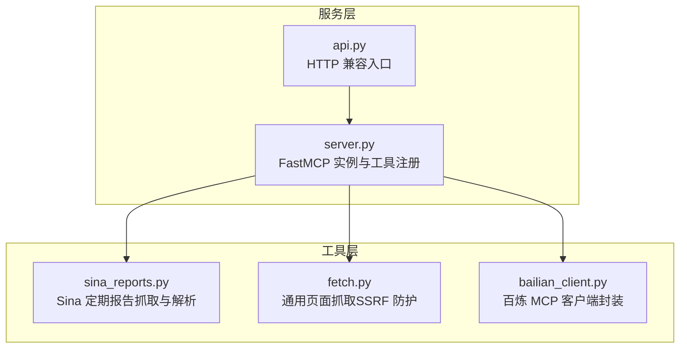
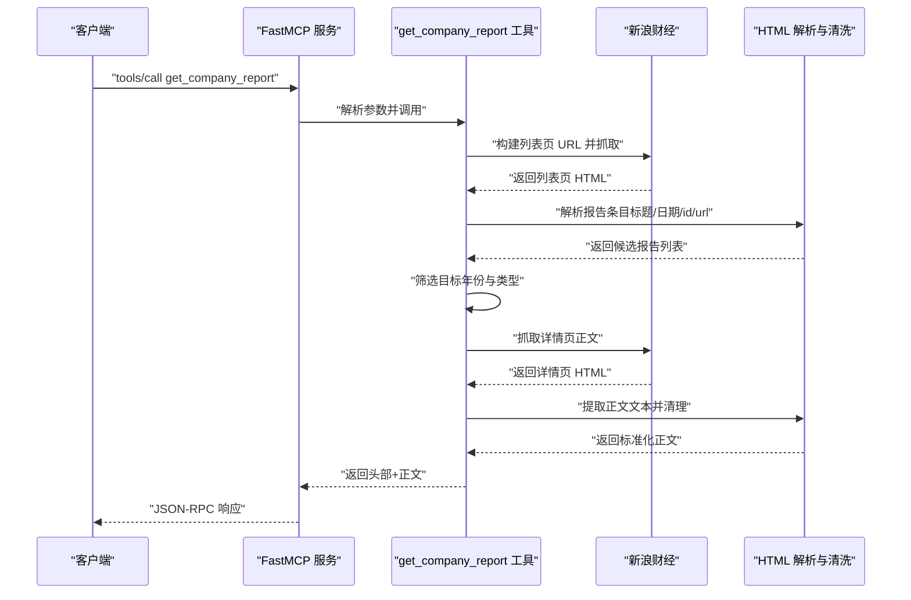
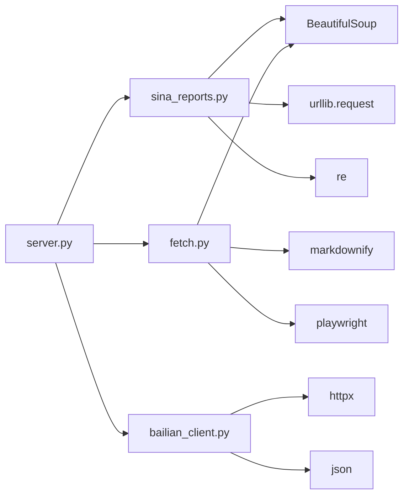

# 专业报告工具

<cite>
**本文引用的文件**
- [sina_reports.py](file://nano-search-mcp/src/nano_search_mcp/tools/sina_reports.py)
- [bailian_client.py](file://nano-search-mcp/src/nano_search_mcp/tools/bailian_client.py)
- [server.py](file://nano-search-mcp/src/nano_search_mcp/server.py)
- [api.py](file://nano-search-mcp/src/nano_search_mcp/api.py)
- [fetch.py](file://nano-search-mcp/src/nano_search_mcp/tools/fetch.py)
- [test_sina_reports.py](file://nano-search-mcp/tests/test_sina_reports.py)
- [README.md](file://nano-search-mcp/README.md)
- [pyproject.toml](file://nano-search-mcp/pyproject.toml)
</cite>

## 目录
1. [简介](#简介)
2. [项目结构](#项目结构)
3. [核心组件](#核心组件)
4. [架构总览](#架构总览)
5. [详细组件分析](#详细组件分析)
6. [依赖关系分析](#依赖关系分析)
7. [性能与可靠性](#性能与可靠性)
8. [故障排除指南](#故障排除指南)
9. [结论](#结论)
10. [附录](#附录)

## 简介
本文件为“专业报告工具”的详细API文档，聚焦于 Sina 股票研究报告工具的接口规范与实现细节，涵盖：
- Sina 报告工具：get_sina_report_list、get_sina_report_content 等方法的参数定义、数据格式与调用限制
- 安全验证机制：URL 白名单检查、SSRF 防护策略、域名验证规则
- 报告内容提取：HTML 解析流程、文本清理算法、格式标准化处理
- 数据质量保证与缓存策略
- 错误码与故障排除指南

本工具基于 MCP 协议提供服务，Sina 报告工具通过注册为 MCP 工具对外暴露，便于在智能体工作流中统一调用。

## 项目结构
- 服务入口与工具注册：server.py 负责创建 FastMCP 实例并注册各类工具，包括 sina_reports
- API 兼容入口：api.py 提供标准 MCP HTTP 应用，便于以 HTTP 方式接入
- 工具实现：
  - sina_reports.py：Sina 定期报告抓取与解析
  - fetch.py：通用页面抓取（含 SSRF 防护与内容清洗）
  - bailian_client.py：百炼 MCP 客户端封装（用于对接百炼平台）
- 文档与测试：README.md 提供使用说明与能力清单；tests 下包含单测覆盖

图表来源
- [server.py:18-69](file://nano-search-mcp/src/nano_search_mcp/server.py#L18-L69)
- [api.py:3-6](file://nano-search-mcp/src/nano_search_mcp/api.py#L3-L6)

章节来源
- [server.py:18-69](file://nano-search-mcp/src/nano_search_mcp/server.py#L18-L69)
- [api.py:3-6](file://nano-search-mcp/src/nano_search_mcp/api.py#L3-L6)
- [README.md:178-198](file://nano-search-mcp/README.md#L178-L198)

## 核心组件
- Sina 定期报告工具（MCP 工具）：get_company_report，用于获取指定 A 股公司指定年份的年报/半年报/一季报/三季报全文正文
- 页面抓取工具（MCP 工具）：fetch_page，提供 SSRF 防护与内容清洗
- 百炼 MCP 客户端：call_bailian_tool_sync，封装百炼平台认证与请求流程

章节来源
- [server.py:31-33](file://nano-search-mcp/src/nano_search_mcp/server.py#L31-L33)
- [README.md:28-46](file://nano-search-mcp/README.md#L28-L46)
- [bailian_client.py:63-92](file://nano-search-mcp/src/nano_search_mcp/tools/bailian_client.py#L63-L92)

## 架构总览
下图展示 MCP 服务如何注册并暴露 Sina 报告工具，以及工具内部的数据流与安全控制点。

图表来源
- [server.py:60-69](file://nano-search-mcp/src/nano_search_mcp/server.py#L60-L69)
- [sina_reports.py:249-369](file://nano-search-mcp/src/nano_search_mcp/tools/sina_reports.py#L249-L369)

## 详细组件分析

### Sina 定期报告工具 API 规范
- 工具名称：get_company_report
- 参数
  - stockid: str，6 位数字字符串，不含交易所前缀（如“600519”）
  - year: int，报告所属年份（四位数，如 2023）
  - report_type: str，默认 annual；可选值："annual"、"semi"、"q1"、"q3"，或对应中文别名（如“半年报”、“一季报”、“三季报”）
- 返回
  - str：包含标题、发布日期、来源链接与正文的完整文本
- 调用限制
  - 必须显式提供 year；不支持“最近一期”“最新报告”等模糊输入
  - 工具仅返回目标年份的一份中文完整版定期报告；若该年份不存在对应报告则报错
- 错误
  - ValueError：stockid 非法、year 非法、report_type 非法，或找不到目标年份报告
  - RuntimeError：找到目标报告但正文抓取失败

章节来源
- [sina_reports.py:314-369](file://nano-search-mcp/src/nano_search_mcp/tools/sina_reports.py#L314-L369)
- [test_sina_reports.py:26-32](file://nano-search-mcp/tests/test_sina_reports.py#L26-L32)
- [test_sina_reports.py:164-169](file://nano-search-mcp/tests/test_sina_reports.py#L164-L169)
- [test_sina_reports.py:171-192](file://nano-search-mcp/tests/test_sina_reports.py#L171-L192)

### URL 构建与抓取流程
- 列表页 URL 构建
  - 固定模板：https://vip.stock.finance.sina.com.cn/corp/go.php/{view}/stockid/{stockid}/page_type/{page_type}.phtml
  - report_type 映射：annual→vCB_Bulletin/ndbg，semi→vCB_BulletinZhong/zqbg，q1→vCB_BulletinYi/yjdbg，q3→vCB_BulletinSan/sjdbg
  - 校验：stockid 必须为 6 位数字，否则抛错
- 详情页 URL 构建
  - 固定模板：https://vip.stock.finance.sina.com.cn/corp/view/vCB_AllBulletinDetail.php?stockid={stockid}&id={id}
  - 校验：stockid 与 report_id 均需为数字字符串
- 抓取策略
  - 优先使用 HTTPS；若握手失败则回退 HTTP
  - 指数退避重试，最多尝试 3 次
  - 仅允许 sina 目标域，避免 SSRF

章节来源
- [sina_reports.py:103-114](file://nano-search-mcp/src/nano_search_mcp/tools/sina_reports.py#L103-L114)
- [sina_reports.py:117-154](file://nano-search-mcp/src/nano_search_mcp/tools/sina_reports.py#L117-L154)

### HTML 解析与文本清理
- 列表页解析
  - 使用 BeautifulSoup 查找详情页链接，提取 id、标题、日期，并生成规范化的详情页 URL
- 详情页正文提取
  - 优先容器：div#con02-7.tagmain；备选：div#allbulletin；兜底：body
  - 输出为纯文本，按换行分隔并去空白
- 文本清理
  - 将连续 3 行以上的空行压缩为 2 行，去除首尾空白，减少冗余换行

章节来源
- [sina_reports.py:156-191](file://nano-search-mcp/src/nano_search_mcp/tools/sina_reports.py#L156-L191)
- [sina_reports.py:194-209](file://nano-search-mcp/src/nano_search_mcp/tools/sina_reports.py#L194-L209)
- [sina_reports.py:307-312](file://nano-search-mcp/src/nano_search_mcp/tools/sina_reports.py#L307-L312)

### 报告筛选与格式化输出
- 报告类型别名映射：中文别名统一为内部英文 key
- 标题匹配规则：按报告类型预设正则匹配中文关键词，并确保标题包含目标年份
- 输出格式：标题、发布日期、来源链接与正文，正文前附带头部信息

章节来源
- [sina_reports.py:49-68](file://nano-search-mcp/src/nano_search_mcp/tools/sina_reports.py#L49-L68)
- [sina_reports.py:224-247](file://nano-search-mcp/src/nano_search_mcp/tools/sina_reports.py#L224-L247)
- [sina_reports.py:355-368](file://nano-search-mcp/src/nano_search_mcp/tools/sina_reports.py#L355-L368)

### 安全验证与 SSRF 防护
- URL 白名单检查
  - 仅允许 sina 目标域（https://vip.stock.finance.sina.com.cn/ 或 http://vip.stock.finance.sina.com.cn/）
  - 非目标域直接抛错
- 参数校验
  - stockid：必须为 6 位数字字符串
  - report_id：必须为纯数字字符串
- 抓取回退策略
  - HTTPS 失败时自动回退到 HTTP（仅一次）
- 通用页面抓取的 SSRF 防护（fetch_page）
  - 仅允许 http/https 协议
  - 拒绝 loopback、私网、链路本地、多播、保留地址等
  - 支持 DNS 解析后校验 IP 地址段

章节来源
- [sina_reports.py:124-125](file://nano-search-mcp/src/nano_search_mcp/tools/sina_reports.py#L124-L125)
- [sina_reports.py:78-82](file://nano-search-mcp/src/nano_search_mcp/tools/sina_reports.py#L78-L82)
- [sina_reports.py:85-88](file://nano-search-mcp/src/nano_search_mcp/tools/sina_reports.py#L85-L88)
- [sina_reports.py:144-147](file://nano-search-mcp/src/nano_search_mcp/tools/sina_reports.py#L144-L147)
- [fetch.py:24-74](file://nano-search-mcp/src/nano_search_mcp/tools/fetch.py#L24-L74)

### 数据质量保证与缓存策略
- 数据质量
  - 严格参数校验与 URL 白名单，避免注入与 SSRF
  - 指数退避重试，提升抓取稳定性
  - 标准化正文提取与文本压缩，减少冗余
- 缓存策略
  - 代码中未实现针对 Sina 报告的显式缓存逻辑
  - 建议在上层调用侧或业务层引入缓存（如内存缓存、Redis 缓存），以降低重复抓取成本
  - 可基于 stockid+year+report_type 组合作为缓存键

章节来源
- [sina_reports.py:127-153](file://nano-search-mcp/src/nano_search_mcp/tools/sina_reports.py#L127-L153)
- [sina_reports.py:307-312](file://nano-search-mcp/src/nano_search_mcp/tools/sina_reports.py#L307-L312)

### 百炼 MCP 客户端封装
- 功能概述
  - 读取环境变量 DASHSCOPE_API_KEY 进行鉴权
  - 构造 JSON-RPC 请求体，发送到 BAILIAN_WEBSEARCH_ENDPOINT
  - 解析响应，提取 result.content[0].text 并尝试解析为 JSON
- 错误处理
  - HTTP 状态码 ≥ 400 抛出异常
  - 响应非 JSON 或缺少 result/content/text 抛出异常
- 超时控制
  - 默认超时来自环境变量 BAILIAN_MCP_TIMEOUT，单位秒

章节来源
- [bailian_client.py:12-21](file://nano-search-mcp/src/nano_search_mcp/tools/bailian_client.py#L12-L21)
- [bailian_client.py:28-36](file://nano-search-mcp/src/nano_search_mcp/tools/bailian_client.py#L28-L36)
- [bailian_client.py:63-92](file://nano-search-mcp/src/nano_search_mcp/tools/bailian_client.py#L63-L92)

## 依赖关系分析
- 服务注册
  - server.py 注册 12 个工具，其中包含 sina_reports.register_sina_report_tools
- 工具依赖
  - sina_reports 依赖 BeautifulSoup、urllib.request、re、logging
  - fetch 依赖 BeautifulSoup、markdownify、playwright（异步）
  - bailian_client 依赖 httpx、json、os、uuid
- 运行时依赖
  - pyproject.toml 指定 mcp、httpx、beautifulsoup4、playwright 等

图表来源
- [server.py:60-69](file://nano-search-mcp/src/nano_search_mcp/server.py#L60-L69)
- [pyproject.toml:6-14](file://nano-search-mcp/pyproject.toml#L6-L14)

章节来源
- [server.py:60-69](file://nano-search-mcp/src/nano_search_mcp/server.py#L60-L69)
- [pyproject.toml:6-14](file://nano-search-mcp/pyproject.toml#L6-L14)

## 性能与可靠性
- 指数退避重试：抓取失败时按 2^attempt 的时间间隔重试，最多 3 次
- HTTPS 回退：首次 HTTPS 握手失败自动回退到 HTTP
- 内容长度限制：Sina 报告正文清理后进行空行压缩与去空白，减少冗余
- 并发与资源复用：fetch_page 使用 Playwright 浏览器复用，降低冷启动开销（适用于通用页面抓取）

章节来源
- [sina_reports.py:127-153](file://nano-search-mcp/src/nano_search_mcp/tools/sina_reports.py#L127-L153)
- [sina_reports.py:307-312](file://nano-search-mcp/src/nano_search_mcp/tools/sina_reports.py#L307-L312)
- [fetch.py:120-161](file://nano-search-mcp/src/nano_search_mcp/tools/fetch.py#L120-L161)

## 故障排除指南
- 常见错误与排查
  - stockid 非法：确保为 6 位数字字符串，不含前缀
  - report_type 不支持：仅支持 annual、semi、q1、q3 或对应中文别名
  - 未找到目标年份报告：确认股票代码、年份与报告类型是否正确
  - HTTPS 握手失败：工具会自动回退到 HTTP，若仍失败检查网络与目标站点可达性
  - 百炼 MCP 调用失败：检查 DASHSCOPE_API_KEY 是否设置，确认 BAILIAN_WEBSEARCH_ENDPOINT 可达
- 日志与可观测性
  - 工具内部使用 logging 记录抓取状态与警告信息，便于定位问题
- 单元测试参考
  - test_sina_reports.py 覆盖参数校验、URL 构造、报告筛选与错误路径

章节来源
- [sina_reports.py:78-82](file://nano-search-mcp/src/nano_search_mcp/tools/sina_reports.py#L78-L82)
- [sina_reports.py:85-88](file://nano-search-mcp/src/nano_search_mcp/tools/sina_reports.py#L85-L88)
- [sina_reports.py:244-246](file://nano-search-mcp/src/nano_search_mcp/tools/sina_reports.py#L244-L246)
- [sina_reports.py:144-147](file://nano-search-mcp/src/nano_search_mcp/tools/sina_reports.py#L144-L147)
- [bailian_client.py:28-36](file://nano-search-mcp/src/nano_search_mcp/tools/bailian_client.py#L28-L36)
- [test_sina_reports.py:194-203](file://nano-search-mcp/tests/test_sina_reports.py#L194-L203)

## 结论
本专业报告工具围绕 Sina 定期报告抓取与解析，提供了严格的参数校验、URL 白名单与 HTTPS 回退策略，以及稳健的 HTML 解析与文本清理流程。结合指数退避重试与内容标准化，显著提升了数据质量与稳定性。建议在上层引入缓存策略以进一步优化性能，并持续监控日志与错误路径以保障生产可用性。

## 附录

### API 定义与调用示例
- get_company_report
  - 参数：stockid（str，6 位数字）、year（int，四位年份）、report_type（str，默认 annual）
  - 返回：str（标题+日期+来源+正文）
  - 示例：参见 README 中的调用示例与说明
- fetch_page（通用页面抓取，含 SSRF 防护）
  - 参数：url（str，绝对 HTTP/HTTPS）
  - 返回：dict（包含 url、content、method、truncated、error）
- 百炼 MCP 工具调用
  - call_bailian_tool_sync：封装认证与请求，返回解析后的 JSON

章节来源
- [README.md:126-148](file://nano-search-mcp/README.md#L126-L148)
- [fetch.py:186-244](file://nano-search-mcp/src/nano_search_mcp/tools/fetch.py#L186-L244)
- [bailian_client.py:63-92](file://nano-search-mcp/src/nano_search_mcp/tools/bailian_client.py#L63-L92)

### 错误码与异常类型
- ValueError：参数非法（如 stockid 非法、report_type 不支持、year 非法）
- RuntimeError：网络/抓取失败（如找不到目标报告、正文抓取失败）
- BailianMCPError：百炼 MCP 请求失败（HTTP 状态码 ≥ 400、响应非 JSON、缺少字段等）

章节来源
- [sina_reports.py:81-82](file://nano-search-mcp/src/nano_search_mcp/tools/sina_reports.py#L81-L82)
- [sina_reports.py:98-99](file://nano-search-mcp/src/nano_search_mcp/tools/sina_reports.py#L98-L99)
- [sina_reports.py:151-153](file://nano-search-mcp/src/nano_search_mcp/tools/sina_reports.py#L151-L153)
- [bailian_client.py:24-26](file://nano-search-mcp/src/nano_search_mcp/tools/bailian_client.py#L24-L26)
- [bailian_client.py:82-92](file://nano-search-mcp/src/nano_search_mcp/tools/bailian_client.py#L82-L92)