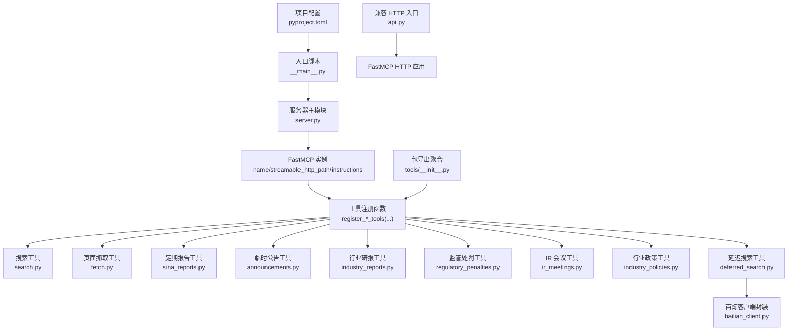
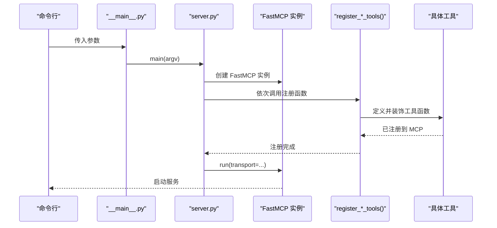
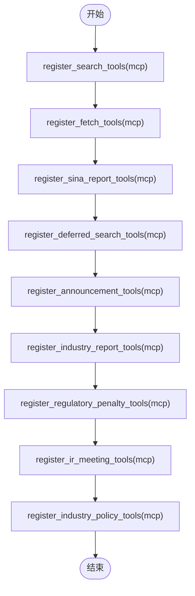
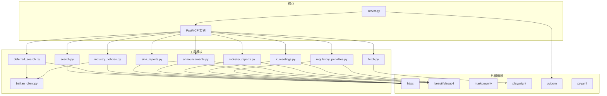

# 工具注册与管理

<cite>
**本文档引用的文件**
- [nano_search_mcp/__main__.py](file://nano-search-mcp/src/nano_search_mcp/__main__.py)
- [nano_search_mcp/server.py](file://nano-search-mcp/src/nano_search_mcp/server.py)
- [nano_search_mcp/api.py](file://nano-search-mcp/src/nano_search_mcp/api.py)
- [nano_search_mcp/tools/__init__.py](file://nano-search-mcp/src/nano_search_mcp/tools/__init__.py)
- [nano_search_mcp/tools/search.py](file://nano-search_mcp/src/nano_search_mcp/tools/search.py)
- [nano_search_mcp/tools/fetch.py](file://nano-search_mcp/src/nano_search_mcp/tools/fetch.py)
- [nano_search_mcp/tools/announcements.py](file://nano-search_mcp/src/nano_search_mcp/tools/announcements.py)
- [nano_search_mcp/tools/deferred_search.py](file://nano-search_mcp/src/nano_search_mcp/tools/deferred_search.py)
- [nano_search_mcp/tools/industry_reports.py](file://nano-search_mcp/src/nano_search_mcp/tools/industry_reports.py)
- [nano_search_mcp/tools/ir_meetings.py](file://nano-search_mcp/src/nano_search_mcp/tools/ir_meetings.py)
- [nano_search_mcp/tools/industry_policies.py](file://nano-search_mcp/src/nano_search_mcp/tools/industry_policies.py)
- [nano_search_mcp/tools/regulatory_penalties.py](file://nano-search_mcp/src/nano_search_mcp/tools/regulatory_penalties.py)
- [nano_search_mcp/tools/sina_reports.py](file://nano-search_mcp/src/nano_search_mcp/tools/sina_reports.py)
- [nano_search_mcp/tools/bailian_client.py](file://nano-search_mcp/src/nano_search_mcp/tools/bailian_client.py)
- [pyproject.toml](file://nano-search-mcp/pyproject.toml)
</cite>

## 目录
1. [简介](#简介)
2. [项目结构](#项目结构)
3. [核心组件](#核心组件)
4. [架构总览](#架构总览)
5. [详细组件分析](#详细组件分析)
6. [依赖分析](#依赖分析)
7. [性能考虑](#性能考虑)
8. [故障排查指南](#故障排查指南)
9. [结论](#结论)
10. [附录](#附录)

## 简介
本项目是一个基于 MCP（Model Context Protocol）协议的工具注册与管理系统，面向中国 A 股市场提供结构化的文本检索与信息抓取能力。系统通过 FastMCP 实例集中管理各类工具，包括网页搜索、页面抓取、定期报告、临时公告、行业研报、监管处罚、投资者关系（IR）会议与行业政策等。系统支持两种传输协议：streamable-http（默认）与 stdio，并提供统一的指令说明与错误契约。

## 项目结构
项目采用模块化组织，核心入口负责构建 FastMCP 实例并注册工具；各工具模块独立实现具体业务逻辑并通过注册函数挂载到 FastMCP 上。

图表来源
- [nano_search_mcp/server.py:18-70](file://nano-search-mcp/src/nano_search_mcp/server.py#L18-L70)
- [nano_search_mcp/tools/__init__.py:1-48](file://nano-search_mcp/src/nano_search_mcp/tools/__init__.py#L1-L48)
- [nano_search_mcp/tools/bailian_client.py:12-15](file://nano-search_mcp/src/nano_search_mcp/tools/bailian_client.py#L12-L15)

章节来源
- [nano_search_mcp/server.py:1-91](file://nano-search-mcp/src/nano_search_mcp/server.py#L1-L91)
- [nano_search_mcp/tools/__init__.py:1-48](file://nano-search_mcp/src/nano_search_mcp/tools/__init__.py#L1-L48)
- [pyproject.toml:1-44](file://nano-search-mcp/pyproject.toml#L1-L44)

## 核心组件
- FastMCP 实例：在服务器模块中创建，设置服务名称、HTTP 路径与指令说明。
- 工具注册函数：每个工具域提供 register_*_tools 函数，将工具方法注册到 FastMCP 实例。
- 传输协议：支持 streamable-http（默认）与 stdio，通过命令行参数选择。
- 百炼客户端：封装 dashscope MCP WebSearch 调用，提供认证、超时与错误处理。

章节来源
- [nano_search_mcp/server.py:18-87](file://nano-search-mcp/src/nano_search_mcp/server.py#L18-L87)
- [nano_search_mcp/tools/bailian_client.py:12-93](file://nano-search_mcp/src/nano_search_mcp/tools/bailian_client.py#L12-L93)

## 架构总览
系统启动流程如下：入口脚本调用服务器主模块，构建 FastMCP 实例，注册各类工具，然后根据传输参数启动服务。

图表来源
- [nano_search_mcp/__main__.py:9-14](file://nano-search-mcp/src/nano_search_mcp/__main__.py#L9-L14)
- [nano_search_mcp/server.py:83-87](file://nano-search_mcp/src/nano_search_mcp/server.py#L83-L87)

章节来源
- [nano_search_mcp/__main__.py:1-15](file://nano-search_mcp/src/nano_search_mcp/__main__.py#L1-L15)
- [nano_search_mcp/server.py:72-87](file://nano-search_mcp/src/nano_search_mcp/server.py#L72-L87)

## 详细组件分析

### MCP 服务初始化与 FastMCP 实例
- 实例创建：在服务器模块中创建 FastMCP 实例，设置 name、streamable_http_path 与 instructions。
- 指令说明：instructions 中明确列出各工具域的能力与参数约束，便于调用方理解。
- 传输协议：通过命令行参数选择 transport，支持 streamable-http 与 stdio。

章节来源
- [nano_search_mcp/server.py:18-58](file://nano-search_mcp/src/nano_search_mcp/server.py#L18-L58)
- [nano_search_mcp/server.py:72-87](file://nano-search_mcp/src/nano_search_mcp/server.py#L72-L87)

### 工具注册流程与调用顺序
注册顺序遵循“搜索 → 页面抓取 → 行业研报 → 延迟搜索 → 临时公告 → 行业研报 → 监管处罚 → IR 会议 → 行业政策”的顺序，确保依赖与上下文的合理衔接。

图表来源
- [nano_search_mcp/server.py:60-70](file://nano-search_mcp/src/nano_search_mcp/server.py#L60-L70)

章节来源
- [nano_search_mcp/server.py:60-70](file://nano-search_mcp/src/nano_search_mcp/server.py#L60-L70)

### 工具元数据管理
- 工具函数通过装饰器注册到 FastMCP 实例，元数据（名称、描述、参数）由工具函数签名与文档字符串共同决定。
- 工具模块导出聚合：tools/__init__.py 汇总各工具的公开接口，便于统一导入与使用。

章节来源
- [nano_search_mcp/tools/__init__.py:1-48](file://nano-search_mcp/src/nano_search_mcp/tools/__init__.py#L1-L48)

### 错误契约定义
- 搜索工具（search）：在百炼 WebSearch 调用失败时抛出异常。
- 定期报告工具（get_company_report）：在参数非法或网络失败时抛出异常。
- 其他工具：失败时返回包含 source、error 与 fetch_time 的字典，不抛异常，保证调用方的健壮性。

章节来源
- [nano_search_mcp/server.py:55-56](file://nano-search_mcp/src/nano_search_mcp/server.py#L55-L56)
- [nano_search_mcp/tools/search.py:88-118](file://nano-search_mcp/src/nano_search_mcp/tools/search.py#L88-L118)
- [nano_search_mcp/tools/sina_reports.py:318-368](file://nano-search_mcp/src/nano_search_mcp/tools/sina_reports.py#L318-L368)

### 传输协议选择（streamable-http vs stdio）
- 默认使用 streamable-http，适合与 MCP 客户端通过 HTTP 交互。
- 本地直连场景可选择 stdio，通过命令行参数 --transport stdio 切换。

章节来源
- [nano_search_mcp/server.py:72-87](file://nano-search_mcp/src/nano_search_mcp/server.py#L72-L87)

### 工具生命周期管理
- 工具注册：在 FastMCP 实例创建后立即注册，随服务启动生效。
- 运行时：工具函数在请求到达时执行，部分工具包含缓存与重试机制。
- 资源释放：页面抓取工具提供浏览器资源关闭接口，供测试或退出时调用。

章节来源
- [nano_search_mcp/server.py:60-70](file://nano-search_mcp/src/nano_search_mcp/server.py#L60-L70)
- [nano_search_mcp/tools/fetch.py:145-161](file://nano-search_mcp/src/nano_search_mcp/tools/fetch.py#L145-L161)

### 依赖关系处理
- 工具间依赖：延迟搜索工具依赖百炼 WebSearch；页面抓取工具依赖 Playwright；定期报告、公告、IR 会议、监管处罚工具依赖新浪/特定站点的 HTML 结构。
- 外部依赖：百炼 MCP 服务、HTTP 客户端、BeautifulSoup、markdownify、Playwright 等。

章节来源
- [nano_search_mcp/tools/deferred_search.py:23-27](file://nano-search_mcp/src/nano_search_mcp/tools/deferred_search.py#L23-L27)
- [nano_search_mcp/tools/fetch.py:12-14](file://nano-search_mcp/src/nano_search_mcp/tools/fetch.py#L12-L14)
- [pyproject.toml:6-14](file://nano-search-mcp/pyproject.toml#L6-L14)

### 运行时配置选项
- 传输协议：--transport，可选 streamable-http 或 stdio。
- 百炼 MCP 超时：BAILIAN_MCP_TIMEOUT（秒），默认 30.0。
- 百炼端点：BAILIAN_WEBSEARCH_ENDPOINT，默认 dashscope aliyuncs。
- DashScope API Key：DASHSCOPE_API_KEY，用于认证。

章节来源
- [nano_search_mcp/server.py:72-87](file://nano-search_mcp/src/nano_search_mcp/server.py#L72-L87)
- [nano_search_mcp/tools/bailian_client.py:12-21](file://nano-search_mcp/src/nano_search_mcp/tools/bailian_client.py#L12-L21)
- [pyproject.toml:21-22](file://nano-search-mcp/pyproject.toml#L21-L22)

### 工具注册函数详解

#### register_search_tools
- 功能：注册 search 工具，提供网页搜索能力。
- 参数：query、max_results、region、timelimit。
- 行为：对查询进行预处理，调用百炼 WebSearch，返回标题、URL、摘要列表。

章节来源
- [nano_search_mcp/tools/search.py:79-119](file://nano-search_mcp/src/nano_search_mcp/tools/search.py#L79-L119)

#### register_fetch_tools
- 功能：注册 fetch_page 工具，提供页面正文抓取能力。
- 参数：url。
- 行为：SSRF 校验、Playwright 渲染、正文提取、长度截断、错误返回。

章节来源
- [nano_search_mcp/tools/fetch.py:220-245](file://nano-search_mcp/src/nano_search_mcp/tools/fetch.py#L220-L245)

#### register_sina_report_tools
- 功能：注册 get_company_report 工具，提供定期报告全文抓取。
- 参数：stockid、year、report_type。
- 行为：列表页解析、正文提取、标题/日期/来源拼装、异常抛出。

章节来源
- [nano_search_mcp/tools/sina_reports.py:314-369](file://nano-search_mcp/src/nano_search_mcp/tools/sina_reports.py#L314-L369)

#### register_deferred_search_tools
- 功能：注册 search_deferred_topic 工具，提供延迟搜索与模板渲染。
- 参数：topic_id、query_override、max_results、region、context。
- 行为：加载任务模板、变量替换、百炼 WebSearch、指数退避重试、失败返回。

章节来源
- [nano_search_mcp/tools/deferred_search.py:145-238](file://nano-search_mcp/src/nano_search_mcp/tools/deferred_search.py#L145-L238)

#### register_announcement_tools
- 功能：注册 list_announcements 与 get_announcement_text。
- 参数：ts_code、start_date、end_date、ann_types；source_url。
- 行为：公告列表抓取与缓存、正文提取与缓存、失败返回字典。

章节来源
- [nano_search_mcp/tools/announcements.py:404-535](file://nano-search_mcp/src/nano_search_mcp/tools/announcements.py#L404-L535)

#### register_industry_report_tools
- 功能：注册 list_industry_reports 与 get_report_text。
- 参数：industry_sw_l2、keywords、start_date、end_date、limit、ts_code；source_url。
- 行为：行业研报列表抓取与缓存、正文提取与缓存、失败返回字典。

章节来源
- [nano_search_mcp/tools/industry_reports.py:384-495](file://nano-search_mcp/src/nano_search_mcp/tools/industry_reports.py#L384-L495)

#### register_regulatory_penalty_tools
- 功能：注册 list_regulatory_penalties。
- 参数：ts_code、start_date、end_date。
- 行为：监管处罚列表抓取与缓存、日期过滤、失败返回字典。

章节来源
- [nano_search_mcp/tools/regulatory_penalties.py:393-447](file://nano-search_mcp/src/nano_search_mcp/tools/regulatory_penalties.py#L393-L447)

#### register_ir_meeting_tools
- 功能：注册 list_ir_meetings 与 get_ir_meeting_text。
- 参数：ts_code、start_date、end_date、meeting_types；source_url。
- 行为：IR 会议列表抓取与缓存、正文提取、参会机构抽取、失败返回字典。

章节来源
- [nano_search_mcp/tools/ir_meetings.py:489-618](file://nano-search_mcp/src/nano_search_mcp/tools/ir_meetings.py#L489-L618)

#### register_industry_policy_tools
- 功能：注册 list_industry_policies。
- 参数：industry_sw_l2、keywords。
- 行为：gov.cn 政策搜索、去重、返回前 5 条、失败返回字典。

章节来源
- [nano_search_mcp/tools/industry_policies.py:185-246](file://nano-search_mcp/src/nano_search_mcp/tools/industry_policies.py#L185-L246)

## 依赖分析
系统依赖关系主要体现在工具模块对第三方库与外部服务的使用，以及工具之间的间接依赖（如延迟搜索依赖百炼）。

图表来源
- [nano_search_mcp/server.py:6-16](file://nano-search_mcp/src/nano_search_mcp/server.py#L6-L16)
- [nano_search_mcp/tools/bailian_client.py:10-10](file://nano-search_mcp/src/nano_search_mcp/tools/bailian_client.py#L10-L10)
- [pyproject.toml:6-14](file://nano-search-mcp/pyproject.toml#L6-L14)

章节来源
- [pyproject.toml:6-14](file://nano-search-mcp/pyproject.toml#L6-L14)
- [nano_search_mcp/server.py:6-16](file://nano-search_mcp/src/nano_search_mcp/server.py#L6-L16)

## 性能考虑
- 缓存策略：公告、行业研报、IR 会议、监管处罚等工具均实现本地缓存，降低重复抓取成本。
- 重试与退避：延迟搜索与各类抓取工具采用指数退避重试，提升稳定性。
- 并发与资源复用：页面抓取工具复用 Playwright 浏览器实例，减少冷启动开销。
- 输出裁剪：搜索结果数量限制、正文长度截断，控制响应体积。

## 故障排查指南
- 认证失败：检查 DASHSCOPE_API_KEY 是否设置，百炼端点与超时配置是否正确。
- SSRF/URL 校验失败：检查输入 URL 是否符合协议与域名白名单要求。
- 网络超时/不可达：检查网络连通性与代理设置，适当增大 BAILIAN_MCP_TIMEOUT。
- 工具返回 unavailable：查看返回字典中的 error 字段，定位具体错误原因。
- 服务启动失败：确认 --transport 参数与客户端对接方式一致。

章节来源
- [nano_search_mcp/tools/bailian_client.py:24-93](file://nano-search_mcp/src/nano_search_mcp/tools/bailian_client.py#L24-L93)
- [nano_search_mcp/tools/fetch.py:20-75](file://nano-search_mcp/src/nano_search_mcp/tools/fetch.py#L20-L75)
- [nano_search_mcp/server.py:72-87](file://nano-search_mcp/src/nano_search_mcp/server.py#L72-L87)

## 结论
本系统通过 FastMCP 实例统一管理多领域工具，提供从网页搜索到定期报告、公告、研报、监管与 IR 会议的全链路信息抓取能力。系统具备清晰的错误契约、灵活的传输协议选择与完善的缓存/重试机制，适合在 MCP 生态中稳定运行。

## 附录

### 启动参数说明
- --transport：选择传输协议，可选 streamable-http（默认）或 stdio。

章节来源
- [nano_search_mcp/server.py:72-87](file://nano-search_mcp/src/nano_search_mcp/server.py#L72-L87)

### 环境配置指南
- DASHSCOPE_API_KEY：百炼 MCP 认证密钥。
- BAILIAN_WEBSEARCH_ENDPOINT：百炼 MCP WebSearch 端点。
- BAILIAN_MCP_TIMEOUT：百炼 MCP 请求超时（秒），默认 30.0。

章节来源
- [nano_search_mcp/tools/bailian_client.py:12-21](file://nano-search_mcp/src/nano_search_mcp/tools/bailian_client.py#L12-L21)