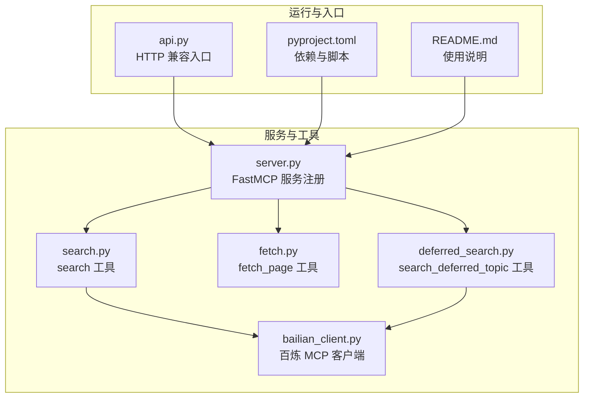
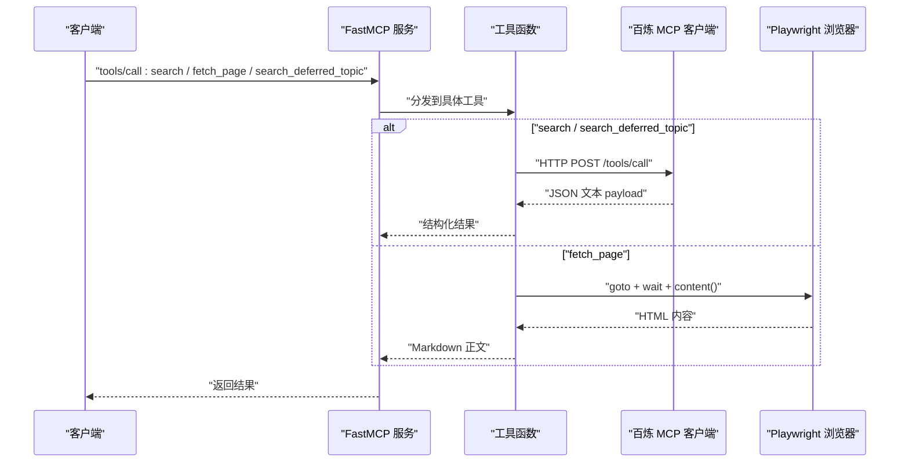
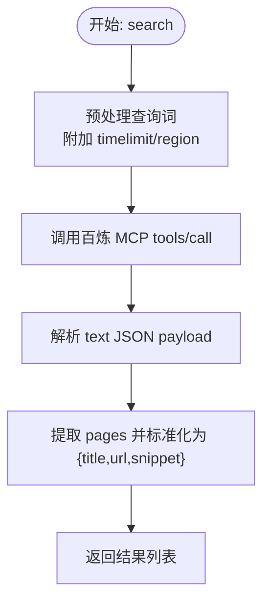
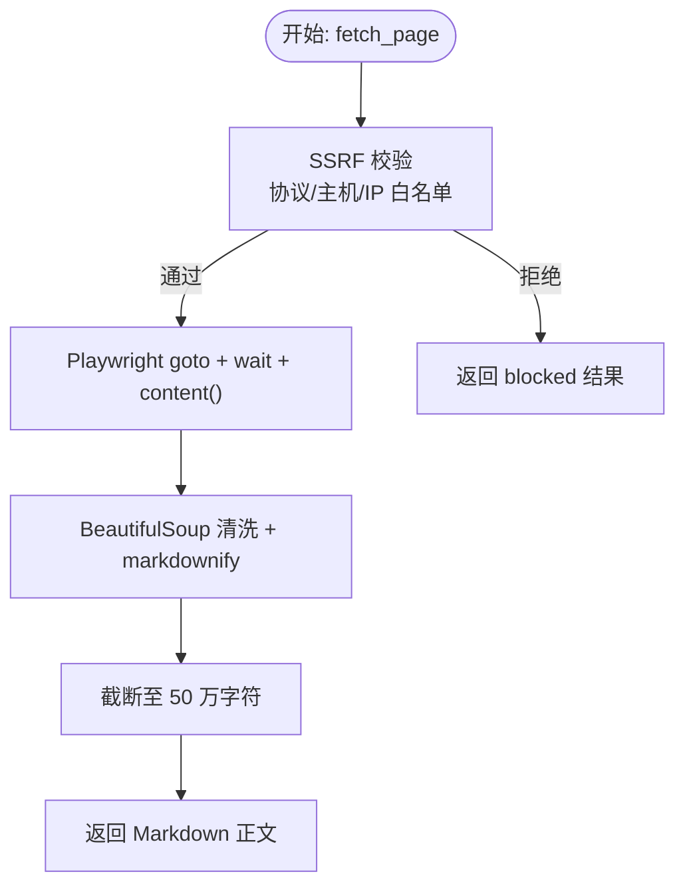
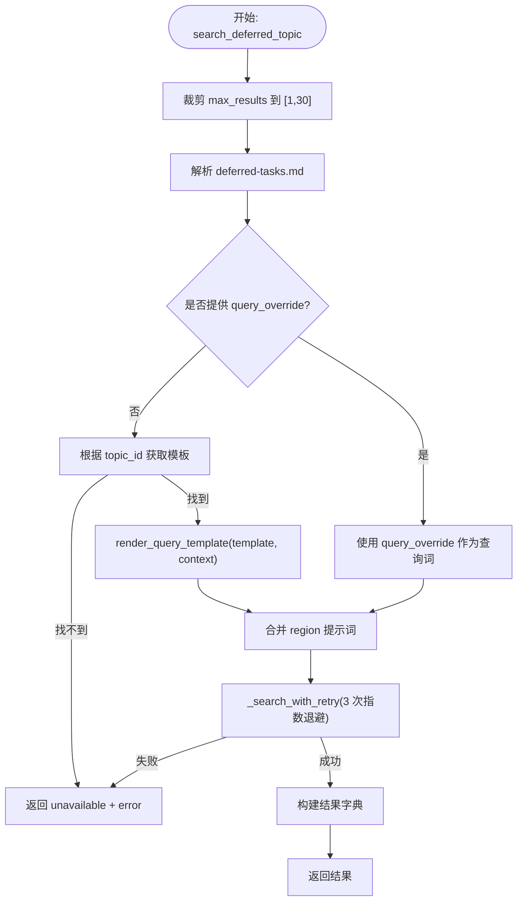
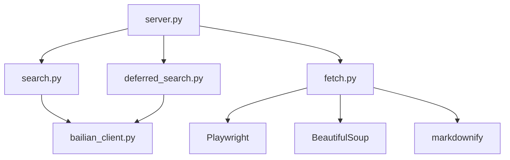
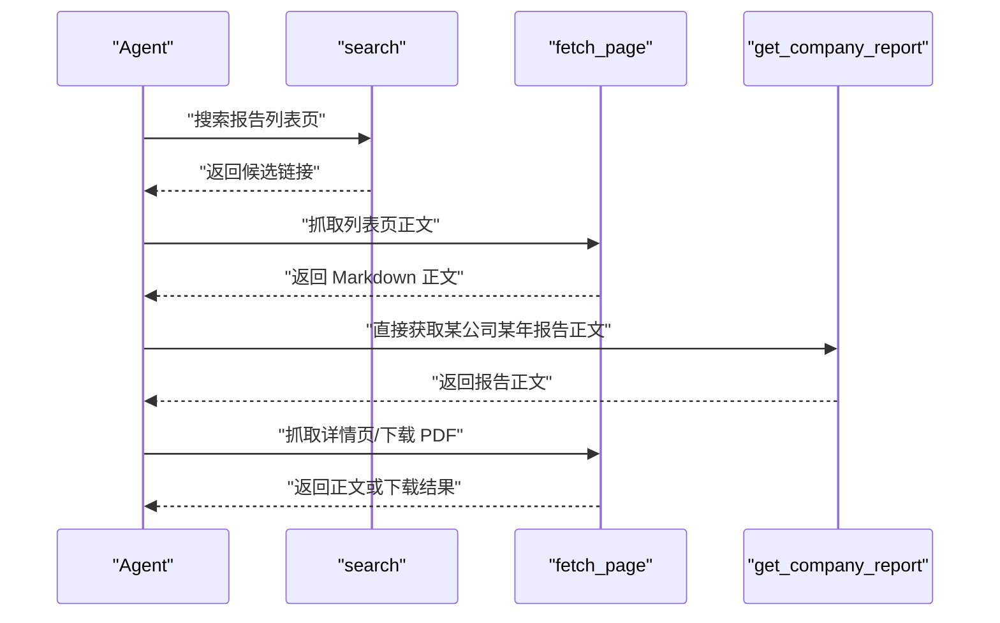

# 核心搜索工具

<cite>
**本文引用的文件**
- [search.py](file://nano-search-mcp/src/nano_search_mcp/tools/search.py)
- [fetch.py](file://nano-search-mcp/src/nano_search_mcp/tools/fetch.py)
- [deferred_search.py](file://nano-search-mcp/src/nano_search_mcp/tools/deferred_search.py)
- [bailian_client.py](file://nano-search-mcp/src/nano_search_mcp/tools/bailian_client.py)
- [server.py](file://nano-search-mcp/src/nano_search_mcp/server.py)
- [api.py](file://nano-search-mcp/src/nano_search_mcp/api.py)
- [README.md](file://nano-search-mcp/README.md)
- [pyproject.toml](file://nano-search-mcp/pyproject.toml)
- [test_fetch.py](file://nano-search-mcp/tests/test_fetch.py)
- [test_deferred_search.py](file://nano-search-mcp/tests/test_deferred_search.py)
</cite>

## 目录
1. [简介](#简介)
2. [项目结构](#项目结构)
3. [核心组件](#核心组件)
4. [架构总览](#架构总览)
5. [详细组件分析](#详细组件分析)
6. [依赖分析](#依赖分析)
7. [性能考量](#性能考量)
8. [故障排查指南](#故障排查指南)
9. [结论](#结论)
10. [附录](#附录)

## 简介
本文件聚焦于 NanoSearchMCP 的三大核心搜索工具：search、fetch_page、search_deferred_topic。文档详细说明它们的接口规范、参数定义、返回值格式、调用示例与错误处理策略，并补充百炼 WebSearch 的调用细节、fetch_page 的 URL 验证与 Playwright 渲染流程、以及延迟搜索模板工具的模板参数系统与命名模板使用方法。同时提供完整的调用流程图与最佳实践建议，帮助开发者与使用者快速、安全、可靠地集成与使用这些工具。

## 项目结构
- 服务入口与工具注册集中在 server.py，通过 FastMCP 注册多个工具，包括 search、fetch_page、search_deferred_topic 等。
- 工具实现位于 tools/ 目录，分别封装了搜索、页面抓取与延迟模板搜索的逻辑。
- 百炼 MCP 客户端封装在 bailian_client.py，负责 HTTP 调用、鉴权与响应解析。
- README.md 提供安装、启动与典型调用流程说明。
- pyproject.toml 描述依赖与可执行入口。

图表来源
- [server.py:19-69](file://nano-search-mcp/src/nano_search_mcp/server.py#L19-L69)
- [api.py:3-6](file://nano-search-mcp/src/nano_search_mcp/api.py#L3-L6)
- [pyproject.toml:1-44](file://nano-search-mcp/pyproject.toml#L1-L44)
- [README.md:1-198](file://nano-search-mcp/README.md#L1-L198)

章节来源
- [server.py:1-91](file://nano-search-mcp/src/nano_search_mcp/server.py#L1-L91)
- [api.py:1-12](file://nano-search-mcp/src/nano_search_mcp/api.py#L1-L12)
- [pyproject.toml:1-44](file://nano-search-mcp/pyproject.toml#L1-L44)
- [README.md:1-198](file://nano-search-mcp/README.md#L1-L198)

## 核心组件
- search：基于百炼 WebSearch 的网页搜索工具，返回标题、URL、摘要的列表。
- fetch_page：基于 Playwright 的页面抓取工具，提供 SSRF 防护、HTML 清洗与 Markdown 输出。
- search_deferred_topic：基于命名模板或自由查询的延迟搜索工具，支持模板变量替换与指数退避重试。

章节来源
- [search.py:79-119](file://nano-search-mcp/src/nano_search_mcp/tools/search.py#L79-L119)
- [fetch.py:220-245](file://nano-search-mcp/src/nano_search_mcp/tools/fetch.py#L220-L245)
- [deferred_search.py:145-238](file://nano-search-mcp/src/nano_search_mcp/tools/deferred_search.py#L145-L238)

## 架构总览
三大工具均通过 FastMCP 注册到服务中，search 与 search_deferred_topic 依赖百炼 MCP 客户端进行 HTTP 调用与响应解析；fetch_page 通过 Playwright 渲染页面并清洗 HTML 为 Markdown。

图表来源
- [server.py:19-69](file://nano-search-mcp/src/nano_search_mcp/server.py#L19-L69)
- [bailian_client.py:63-93](file://nano-search-mcp/src/nano_search_mcp/tools/bailian_client.py#L63-L93)
- [fetch.py:163-176](file://nano-search-mcp/src/nano_search_mcp/tools/fetch.py#L163-L176)

## 详细组件分析

### 百炼 WebSearch 搜索工具 search
- 接口定义
  - 函数签名：search(query, max_results=5, region="zh-cn", timelimit=None)
  - 参数
    - query: 搜索关键词（必填，非空字符串）
    - max_results: 最大返回结果数，取值范围 [1, 30]，默认 5；超出范围会被截断到边界
    - region: 搜索区域代码，常用值 "zh-cn"（中文）、"us-en"、"uk-en"、"wt-wt"（全球）；默认 "zh-cn"
    - timelimit: 时间范围过滤，可选 "d"/"w"/"m"/"y"；None 表示不限
  - 返回值：list[SearchItem]，每项包含 title/url/snippet 三个字段的字符串；无结果时返回空列表
  - 错误：当百炼 MCP 调用失败时抛出 RuntimeError
  - 说明：region/timelimit 不是百炼原生参数，工具将其降级为查询提示词附加到 query，精确度取决于上游模型理解
- 数据流与处理逻辑
  - 查询预处理：将 timelimit 映射为中文时间描述，将 region 附加到查询词
  - 调用百炼 MCP：构造工具调用负载，发送 HTTP 请求
  - 响应解析：从 text 字段解析 JSON，提取 pages 数组，标准化为 SearchItem 列表
- 调用示例（路径参考）
  - [search.py:82-119](file://nano-search-mcp/src/nano_search_mcp/tools/search.py#L82-L119)

图表来源
- [search.py:17-38](file://nano-search-mcp/src/nano_search_mcp/tools/search.py#L17-L38)
- [search.py:41-70](file://nano-search-mcp/src/nano_search_mcp/tools/search.py#L41-L70)
- [bailian_client.py:54-61](file://nano-search-mcp/src/nano_search_mcp/tools/bailian_client.py#L54-L61)

章节来源
- [search.py:79-119](file://nano-search-mcp/src/nano_search_mcp/tools/search.py#L79-L119)
- [bailian_client.py:12-21](file://nano-search-mcp/src/nano_search_mcp/tools/bailian_client.py#L12-L21)
- [bailian_client.py:63-93](file://nano-search-mcp/src/nano_search_mcp/tools/bailian_client.py#L63-L93)

### 页面抓取工具 fetch_page
- 接口定义
  - 函数签名：fetch_page(url)
  - 参数
    - url: 需要抓取的绝对 URL
  - 返回值：PageResult，包含 url/content/method/truncated/error
    - method: "playwright" | "blocked"
    - truncated: 是否因超长（>50 万字符）被截断
    - error: 失败时的错误信息（仅失败场景出现）
- URL 验证机制（SSRF 防护）
  - 仅允许 http/https 协议
  - 拒绝 file://、ftp://、gopher:// 等非 HTTP 协议
  - 拒绝 loopback、RFC1918 私网、链路本地、多播、保留段、未指定地址
  - 拒绝云元数据端点 169.254.169.254
  - 支持字面 IP 与 DNS 解析后的 IP 校验
- Playwright 渲染与正文提取
  - 复用浏览器实例，降低冷启开销
  - goto + domcontentloaded + 额外等待（2 秒）确保静态资源加载
  - 清理 header/footer/nav/aside 与广告、侧边栏、横幅、弹窗、Cookie、评论等噪声
  - 提取 article/main/body 或根节点，转换为 Markdown（ATX 样式）
  - 截断超过 50 万字符的内容
- 调用示例（路径参考）
  - [fetch.py:223-245](file://nano-search-mcp/src/nano_search_mcp/tools/fetch.py#L223-L245)

图表来源
- [fetch.py:24-74](file://nano-search-mcp/src/nano_search_mcp/tools/fetch.py#L24-L74)
- [fetch.py:163-176](file://nano-search-mcp/src/nano_search_mcp/tools/fetch.py#L163-L176)
- [fetch.py:100-111](file://nano-search-mcp/src/nano_search_mcp/tools/fetch.py#L100-L111)
- [fetch.py:113-118](file://nano-search-mcp/src/nano_search_mcp/tools/fetch.py#L113-L118)

章节来源
- [fetch.py:1-245](file://nano-search-mcp/src/nano_search_mcp/tools/fetch.py#L1-L245)
- [test_fetch.py:1-98](file://nano-search-mcp/tests/test_fetch.py#L1-L98)

### 延迟搜索模板工具 search_deferred_topic
- 接口定义
  - 函数签名：search_deferred_topic(topic_id, query_override="", max_results=10, region="cn-zh", context=None)
  - 参数
    - topic_id: 主题标识符；自由查询模式下可传任意字符串作为结果标签
    - query_override: 非空时覆盖主题模板，直接作为搜索词使用
    - max_results: 返回结果上限，取值范围 [1, 30]，默认 10；越界自动截断
    - region: 地区提示，默认 "cn-zh"（中文简体）；其它常用值 "wt-wt"/"us-en"/"uk-en"
    - context: 模板变量字典，用于填充主题查询模板中的占位符
  - 返回值：字典
    - 成功：包含 topic_id/query/source/results/fetch_time
    - 失败：包含 topic_id/source:"unavailable"/error/fetch_time
- 模板系统与变量替换
  - 从 deferred-tasks.md 中解析 YAML 代码块，构建 {id: {...}} 映射
  - 支持 status != "resolved" 的条目；跳过示例占位符 id 以 "<" 开头的条目
  - 模板变量替换：render_query_template(template, context)，将 {var} 替换为 context 中的值
- 搜索执行与重试
  - _search_with_retry：最多 3 次指数退避重试；失败时抛出 RuntimeError
  - region 作为提示词附加到最终查询词
- 调用示例（路径参考）
  - [deferred_search.py:148-238](file://nano-search-mcp/src/nano_search_mcp/tools/deferred_search.py#L148-L238)

图表来源
- [deferred_search.py:45-85](file://nano-search-mcp/src/nano_search_mcp/tools/deferred_search.py#L45-L85)
- [deferred_search.py:91-96](file://nano-search-mcp/src/nano_search_mcp/tools/deferred_search.py#L91-L96)
- [deferred_search.py:102-139](file://nano-search-mcp/src/nano_search_mcp/tools/deferred_search.py#L102-L139)
- [deferred_search.py:148-238](file://nano-search-mcp/src/nano_search_mcp/tools/deferred_search.py#L148-L238)

章节来源
- [deferred_search.py:1-238](file://nano-search-mcp/src/nano_search_mcp/tools/deferred_search.py#L1-L238)
- [test_deferred_search.py:1-282](file://nano-search-mcp/tests/test_deferred_search.py#L1-L282)

## 依赖分析
- 组件耦合
  - search 与 search_deferred_topic 依赖 bailian_client 进行百炼 MCP 调用
  - fetch_page 依赖 Playwright、BeautifulSoup、markdownify 进行渲染与清洗
  - server.py 统一注册工具，暴露给 FastMCP
- 外部依赖
  - httpx：HTTP 客户端
  - playwright：无头浏览器渲染
  - beautifulsoup4/markdownify：HTML 清洗与 Markdown 转换
  - pyyaml：解析 deferred-tasks.md 中的 YAML 块
- 错误契约
  - search 与 get_company_report 在参数非法或网络彻底失败时抛异常
  - 其余工具（包括 search_deferred_topic、fetch_page）在失败时统一返回 {source:"unavailable", error, fetch_time}

图表来源
- [server.py:8-16](file://nano-search-mcp/src/nano_search_mcp/server.py#L8-L16)
- [search.py:8-13](file://nano-search-mcp/src/nano_search_mcp/tools/search.py#L8-L13)
- [deferred_search.py:23-27](file://nano-search-mcp/src/nano_search_mcp/tools/deferred_search.py#L23-L27)
- [fetch.py:10-12](file://nano-search-mcp/src/nano_search_mcp/tools/fetch.py#L10-L12)

章节来源
- [pyproject.toml:6-14](file://nano-search-mcp/pyproject.toml#L6-L14)
- [server.py:55-56](file://nano-search-mcp/src/nano_search_mcp/server.py#L55-L56)

## 性能考量
- Playwright 复用：通过全局锁与惰性创建，复用 Chromium 实例，降低冷启动开销
- 渲染等待：默认等待 2 秒，平衡加载完整性与响应速度
- 内容截断：超过 50 万字符截断，避免内存与传输压力
- 指数退避：search_deferred_topic 的重试策略减少瞬时失败的影响
- 超时设置：百炼 MCP 客户端支持通过环境变量覆盖默认超时

章节来源
- [fetch.py:126-142](file://nano-search-mcp/src/nano_search_mcp/tools/fetch.py#L126-L142)
- [fetch.py:163-176](file://nano-search-mcp/src/nano_search_mcp/tools/fetch.py#L163-L176)
- [fetch.py:113-118](file://nano-search-mcp/src/nano_search_mcp/tools/fetch.py#L113-L118)
- [deferred_search.py:102-139](file://nano-search-mcp/src/nano_search_mcp/tools/deferred_search.py#L102-L139)
- [bailian_client.py:21](file://nano-search-mcp/src/nano_search_mcp/tools/bailian_client.py#L21)

## 故障排查指南
- 百炼 MCP 调用失败
  - 现象：search 或 search_deferred_topic 抛出 RuntimeError
  - 排查要点：检查 DASHSCOPE_API_KEY 是否设置；确认 BAILIAN_WEBSEARCH_ENDPOINT 可达；查看网络与超时配置
  - 参考路径：[bailian_client.py:28-36](file://nano-search-mcp/src/nano_search_mcp/tools/bailian_client.py#L28-L36), [bailian_client.py:82-92](file://nano-search-mcp/src/nano_search_mcp/tools/bailian_client.py#L82-L92)
- SSRF 拒绝
  - 现象：fetch_page 返回 method:"blocked"，error 包含 "unsafe_url"
  - 排查要点：确认 URL 协议为 http/https；检查主机是否为 loopback/私网/云元数据端点；DNS 解析结果是否命中黑名单
  - 参考路径：[fetch.py:24-74](file://nano-search-mcp/src/nano_search_mcp/tools/fetch.py#L24-L74), [test_fetch.py:48-66](file://nano-search-mcp/tests/test_fetch.py#L48-L66)
- 模板缺失或未知 topic_id
  - 现象：search_deferred_topic 返回 source:"unavailable" + error
  - 排查要点：确认 deferred-tasks.md 存在且包含有效 YAML 块；检查 topic_id 是否存在于映射中；确认模板字段存在
  - 参考路径：[deferred_search.py:195-229](file://nano-search-mcp/src/nano_search_mcp/tools/deferred_search.py#L195-L229), [test_deferred_search.py:201-221](file://nano-search-mcp/tests/test_deferred_search.py#L201-L221)
- 重试耗尽
  - 现象：search_deferred_topic 抛出 RuntimeError（连续 N 次失败）
  - 排查要点：检查网络连通性；适当增大超时或减少并发；观察指数退避日志
  - 参考路径：[deferred_search.py:102-139](file://nano-search-mcp/src/nano_search_mcp/tools/deferred_search.py#L102-L139)

章节来源
- [bailian_client.py:24-92](file://nano-search-mcp/src/nano_search_mcp/tools/bailian_client.py#L24-L92)
- [fetch.py:186-217](file://nano-search-mcp/src/nano_search_mcp/tools/fetch.py#L186-L217)
- [deferred_search.py:148-238](file://nano-search-mcp/src/nano_search_mcp/tools/deferred_search.py#L148-L238)

## 结论
search、fetch_page、search_deferred_topic 三大工具分别覆盖了“网页搜索”“页面抓取”“模板化延迟搜索”的核心需求。search 与 search_deferred_topic 通过百炼 MCP 提供稳定的 WebSearch 能力，并具备参数裁剪与错误处理；fetch_page 在保证安全的前提下，提供高质量的正文提取；search_deferred_topic 则通过模板与上下文变量实现了可复用的查询语义与兜底搜索策略。配合 FastMCP 的统一注册与 HTTP 兼容入口，这些工具可在多种运行环境中稳定集成与扩展。

## 附录
- 典型调用流程（基于 README 的定期报告场景）
  - 先用 search 搜索报告列表页
  - 用 fetch_page 抓取列表页正文，提取详情页链接
  - 如需直接获取某公司某年报告正文，优先调用 get_company_report
  - 对详情页或 PDF 链接继续 fetch_page 或进入 PDF 下载与解析流程

图表来源
- [README.md:149-158](file://nano-search-mcp/README.md#L149-L158)