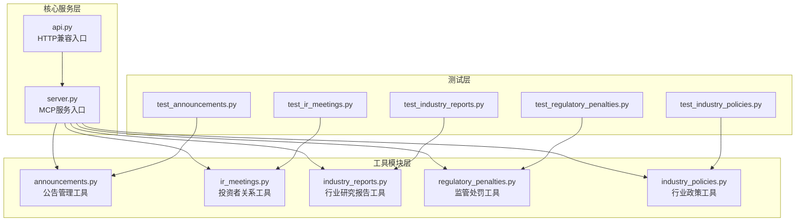
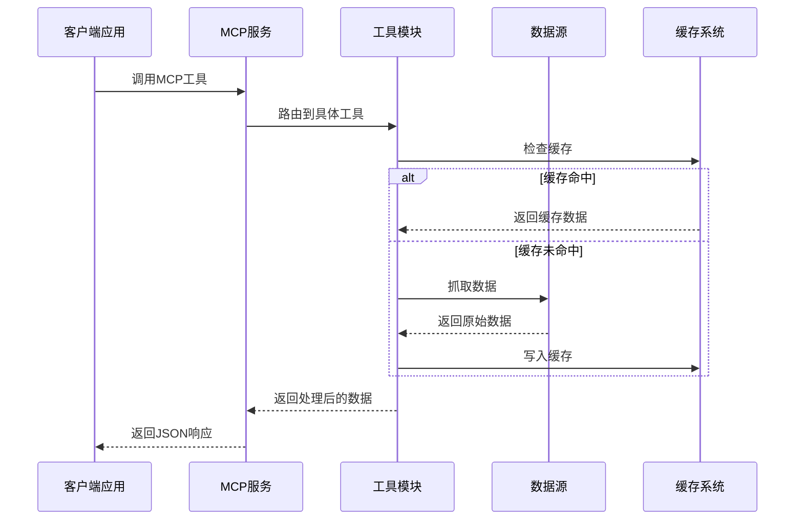
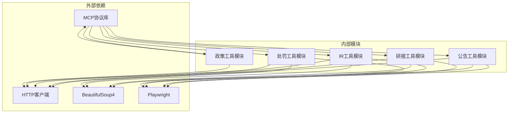

# 金融数据检索工具

<cite>
**本文档引用的文件**
- [announcements.py](file://nano-search-mcp/src/nano_search_mcp/tools/announcements.py)
- [industry_reports.py](file://nano-search-mcp/src/nano_search_mcp/tools/industry_reports.py)
- [regulatory_penalties.py](file://nano-search-mcp/src/nano_search_mcp/tools/regulatory_penalties.py)
- [ir_meetings.py](file://nano-search-mcp/src/nano_search_mcp/tools/ir_meetings.py)
- [industry_policies.py](file://nano-search-mcp/src/nano_search_mcp/tools/industry_policies.py)
- [server.py](file://nano-search-mcp/src/nano_search_mcp/server.py)
- [api.py](file://nano-search-mcp/src/nano_search_mcp/api.py)
- [README.md](file://nano-search-mcp/README.md)
- [test_announcements.py](file://nano-search-mcp/tests/test_announcements.py)
- [test_industry_reports.py](file://nano-search-mcp/tests/test_industry_reports.py)
- [test_regulatory_penalties.py](file://nano-search-mcp/tests/test_regulatory_penalties.py)
- [test_ir_meetings.py](file://nano-search-mcp/tests/test_ir_meetings.py)
- [test_industry_policies.py](file://nano-search-mcp/tests/test_industry_policies.py)
</cite>

## 目录
1. [简介](#简介)
2. [项目结构](#项目结构)
3. [核心组件](#核心组件)
4. [架构概览](#架构概览)
5. [详细组件分析](#详细组件分析)
6. [依赖关系分析](#依赖关系分析)
7. [性能考虑](#性能考虑)
8. [故障排除指南](#故障排除指南)
9. [结论](#结论)

## 简介

金融数据检索工具是一个基于MCP协议的综合API服务，专门用于获取中国A股市场的各类金融数据。该工具集成了多个数据源，包括新浪财经、政府网站等，为用户提供公告管理、行业研究报告、监管处罚、投资者关系活动和行业政策等多维度的数据检索能力。

该服务采用模块化设计，每个数据源都有独立的工具模块，支持参数化过滤、文本提取和缓存机制。所有工具都遵循统一的错误处理契约，在失败时返回结构化的错误信息而非抛出异常。

## 项目结构



**图表来源**
- [server.py:19-69](file://nano-search-mcp/src/nano_search_mcp/server.py#L19-L69)
- [api.py:1-12](file://nano-search-mcp/src/nano_search_mcp/api.py#L1-L12)

**章节来源**
- [server.py:1-91](file://nano-search-mcp/src/nano_search_mcp/server.py#L1-L91)
- [README.md:178-198](file://nano-search-mcp/README.md#L178-L198)

## 核心组件

金融数据检索工具包含以下核心组件：

### 1. 公告管理工具
- **list_announcements**: 获取A股上市公司临时公告列表
- **get_announcement_text**: 抓取单条公告全文

### 2. 行业研究报告工具
- **list_industry_reports**: 列出券商发布的行业研究报告
- **get_report_text**: 抓取单条行业研报全文

### 3. 监管处罚工具
- **list_regulatory_penalties**: 列出公司的监管处罚记录

### 4. 投资者关系工具
- **list_ir_meetings**: 列出机构调研记录、业绩说明会等IR活动
- **get_ir_meeting_text**: 抓取单条IR纪要正文及参会机构

### 5. 行业政策工具
- **list_industry_policies**: 检索政府机构发布的行业政策文件

**章节来源**
- [README.md:28-46](file://nano-search-mcp/README.md#L28-L46)
- [server.py:35-54](file://nano-search-mcp/src/nano_search_mcp/server.py#L35-L54)

## 架构概览



**图表来源**
- [server.py:19-58](file://nano-search-mcp/src/nano_search_mcp/server.py#L19-L58)
- [announcements.py:336-376](file://nano-search-mcp/src/nano_search_mcp/tools/announcements.py#L336-L376)
- [industry_reports.py:308-369](file://nano-search-mcp/src/nano_search_mcp/tools/industry_reports.py#L308-L369)

## 详细组件分析

### 公告管理工具 (list_announcements/get_announcement_text)

#### 参数规范

**list_announcements 参数**:
- `ts_code`: Tushare格式股票代码，如"688270.SH"
- `start_date`: 起始日期(含)，格式YYYY-MM-DD，默认当年1月1日
- `end_date`: 结束日期(含)，格式YYYY-MM-DD，默认今日
- `ann_types`: 公告类型过滤列表，默认全部返回

**公告类型分类**:
- `inquiry`: 问询函/监管工作函/关注函及其回复
- `audit`: 审计报告/审计意见/非标准审计意见/鉴证报告
- `accountant_change`: 会计师事务所变更/续聘/聘请
- `litigation`: 诉讼/仲裁/法律纠纷
- `penalty`: 行政处罚/纪律处分/监管措施/立案调查/警示函
- `restatement`: 差错更正/财报重述/追溯调整

**get_announcement_text 参数**:
- `source_url`: 由list_announcements返回条目的source_url

#### 返回格式

**list_announcements 返回**:
```json
{
  "ts_code": "688270.SH",
  "source": "sina",
  "announcements": [
    {
      "ann_date": "2025-04-15",
      "title": "关于...",
      "ann_type": "inquiry",
      "source_url": "http://vip.stock.finance.sina.com.cn/...",
      "pdf_url": null
    }
  ]
}
```

**get_announcement_text 返回**:
```json
{
  "source_url": "http://vip.stock.finance.sina.com.cn/...",
  "full_text": "公告正文内容",
  "extracted_at": "2025-04-15T10:30:00Z"
}
```

#### 文本提取机制

公告正文提取采用多层容器优先级策略：
1. `div#content` - 最精确的正文区域
2. `div#con02-7` - 外层包含正文的容器  
3. `div#box` - 备用容器
4. `body` - 最终兜底

**章节来源**
- [announcements.py:407-489](file://nano-search-mcp/src/nano_search_mcp/tools/announcements.py#L407-L489)
- [announcements.py:491-534](file://nano-search-mcp/src/nano_search_mcp/tools/announcements.py#L491-L534)
- [announcements.py:290-306](file://nano-search-mcp/src/nano_search_mcp/tools/announcements.py#L290-L306)

### 行业研究报告工具 (list_industry_reports/get_report_text)

#### 行业分类路由

**自动路由机制**:
- 支持通过`ts_code`参数自动路由至公司所属申万二级行业
- 内部通过解析新浪财经个股页面提取行业代码
- 兼容HTML转义和原生&两种分隔形式

**关键词匹配**:
- 标题关键词白名单过滤
- 支持重复关键词去重
- 忽略空白关键词

#### 时间范围筛选

- 默认返回近1年(365天)内发布的研报
- 支持自定义开始/结束日期范围
- 严格的时间边界检查

#### 关键参数

**list_industry_reports 参数**:
- `industry_sw_l2`: 申万二级行业名，如"汽车零部件"、"光伏设备"
- `keywords`: 标题关键词白名单
- `start_date/end_date`: 日期范围过滤
- `limit`: 返回条数上限(1-200，默认50)
- `ts_code`: Tushare格式股票代码

**get_report_text 参数**:
- `source_url`: 由list_industry_reports返回的source_url

#### 返回格式

**list_industry_reports 返回**:
```json
{
  "industry_sw_l2": "汽车零部件",
  "source": "sina",
  "reports": [
    {
      "report_date": "2025-04-15",
      "publisher": "中信证券",
      "title": "汽车玻璃行业深度报告",
      "industry_tags": ["汽车零部件", "玻璃"],
      "source_url": "https://stock.finance.sina.com.cn/...",
      "summary": ""
    }
  ]
}
```

**章节来源**
- [industry_reports.py:384-457](file://nano-search-mcp/src/nano_search_mcp/tools/industry_reports.py#L384-L457)
- [industry_reports.py:459-494](file://nano-search-mcp/src/nano_search_mcp/tools/industry_reports.py#L459-L494)
- [industry_reports.py:273-369](file://nano-search-mcp/src/nano_search_mcp/tools/industry_reports.py#L273-L369)

### 监管处罚工具 (list_regulatory_penalties)

#### 违规类型过滤

**处罚记录解析**:
- 从新浪财经违规处理页面解析处罚记录
- 支持多种违规类型的识别和分类
- 自动提取处罚日期、标题、原因、内容、处理机构

**处理机构标准化**:
- 上交所、深交所、北交所等交易所识别
- 各省证监局识别
- 证监会识别

#### 关键字段说明

**返回字段**:
- `punish_date`: 公告日期(YYYY-MM-DD)
- `event_type`: 来源页面原文(如"处罚决定"、"立案调查"、"警示")
- `title`: 违规事件标题
- `reason`: 批复原因
- `content`: 批复内容摘要
- `issuer`: 处理机构(标准化简称)
- `source_url`: 来源页面URL

#### 参数规范

**list_regulatory_penalties 参数**:
- `ts_code`: Tushare格式股票代码
- `start_date/end_date`: 日期范围过滤(可选)

**章节来源**
- [regulatory_penalties.py:393-446](file://nano-search-mcp/src/nano_search_mcp/tools/regulatory_penalties.py#L393-L446)
- [regulatory_penalties.py:295-366](file://nano-search-mcp/src/nano_search_mcp/tools/regulatory_penalties.py#L295-L366)

### 投资者关系工具 (list_ir_meetings/get_ir_meeting_text)

#### 调研活动类型

**会议类型分类**:
- `earnings_call`: 业绩说明会/业绩发布会/年度业绩交流
- `site_visit`: 实地调研/现场参观/参观
- `research`: 机构调研/投资者关系活动记录表
- `other`: 未归类的IR活动

**标题关键词识别**:
- 投资者关系活动记录表
- 投资者关系管理信息
- 业绩说明会/投资者说明会
- 调研活动信息表
- 投资者开放日/网上业绩说明会/电话会议

#### 参会机构识别

**机构提取算法**:
- 使用正则表达式匹配"参会/接待：机构A、机构B"
- 支持多种分隔符(、，,；;)
- 机构名称特征词过滤(证券/资本/基金/银行等)
- 噪声词过滤(其他/详见/附件/等机构)
- 去重和保序

#### 关键参数

**list_ir_meetings 参数**:
- `ts_code`: Tushare格式股票代码
- `start_date/end_date`: 日期范围(默认近6个月)
- `meeting_types`: 会议类型过滤列表

**get_ir_meeting_text 参数**:
- `source_url`: 由list_ir_meetings返回的source_url

#### 返回格式

**list_ir_meetings 返回**:
```json
{
  "ts_code": "000001.SZ",
  "source": "sina",
  "meetings": [
    {
      "meeting_date": "2026-03-20",
      "meeting_type": "research",
      "participants": ["中信证券", "高瓴资本"],
      "title": "投资者关系活动记录表",
      "summary": "",
      "source_url": "http://vip.stock.finance.sina.com.cn/..."
    }
  ]
}
```

**章节来源**
- [ir_meetings.py:489-568](file://nano-search-mcp/src/nano_search_mcp/tools/ir_meetings.py#L489-L568)
- [ir_meetings.py:570-617](file://nano-search-mcp/src/nano_search_mcp/tools/ir_meetings.py#L570-L617)
- [ir_meetings.py:394-462](file://nano-search-mcp/src/nano_search_mcp/tools/ir_meetings.py#L394-L462)

### 行业政策工具 (list_industry_policies)

#### 政策文件检索机制

**搜索引擎集成**:
- 基于百炼WebSearch(gov.cn)实现
- 支持申万二级行业名 + 产业政策关键词
- 自动添加"近一年"和"region:cn-zh"时间约束

**政府机构过滤**:
- 国家发展改革委、工业和信息化部等中央部委
- 地方政府机构识别
- 机构层级(level)分类(central/ministry/local)

#### 关键参数

**list_industry_policies 参数**:
- `industry_sw_l2`: 申万二级行业名
- `keywords`: 主营业务关键词列表

#### 返回格式

**list_industry_policies 返回**:
```json
{
  "industry_sw_l2": "汽车零部件",
  "source": "bailian_web_search_gov_cn",
  "policies": [
    {
      "pub_date": "2025-04-15",
      "issuer": "国家发展改革委",
      "title": "汽车产业政策",
      "level": "ministry",
      "source_url": "https://www.ndrc.gov.cn/...",
      "summary": "汽车产业政策内容摘要"
    }
  ],
  "fetch_time": "2025-04-15T10:30:00Z"
}
```

**章节来源**
- [industry_policies.py:185-245](file://nano-search-mcp/src/nano_search_mcp/tools/industry_policies.py#L185-L245)
- [industry_policies.py:170-182](file://nano-search-mcp/src/nano_search_mcp/tools/industry_policies.py#L170-L182)

## 依赖关系分析



**图表来源**
- [pyproject.toml:6-14](file://nano-search-mcp/pyproject.toml#L6-L14)
- [server.py:8-16](file://nano-search-mcp/src/nano_search_mcp/server.py#L8-L16)

**章节来源**
- [pyproject.toml:1-44](file://nano-search-mcp/pyproject.toml#L1-L44)
- [server.py:19-69](file://nano-search-mcp/src/nano_search_mcp/server.py#L19-L69)

## 性能考虑

### 缓存策略
- **列表页缓存**: 1小时有效期，减少重复抓取
- **详情页缓存**: 7天有效期，公告内容相对稳定
- **智能缓存命中**: 避免重复网络请求

### 请求优化
- **指数退避重试**: 最多重试3次，避免雪崩效应
- **请求限频**: 相邻请求至少间隔1秒
- **并发控制**: 单线程顺序处理，避免过度并发

### 数据处理优化
- **早停机制**: 按日期排序的列表可提前停止
- **增量更新**: 缓存系统支持增量更新
- **内存管理**: 大文本内容使用流式处理

## 故障排除指南

### 常见错误类型

**参数验证错误**:
- 股票代码格式错误
- 日期格式不正确
- URL格式不合法

**网络连接错误**:
- 数据源不可达
- DNS解析失败
- 超时问题

**解析错误**:
- 页面结构变更
- 编码问题
- HTML解析失败

### 错误处理策略

**统一错误响应**:
```json
{
  "source": "unavailable",
  "error": "错误描述",
  "fetch_time": "2025-04-15T10:30:00Z"
}
```

**重试机制**:
- 自动指数退避重试(2^attempt秒)
- 最多重试3次
- 记录最后一次错误

**章节来源**
- [announcements.py:453-470](file://nano-search-mcp/src/nano_search_mcp/tools/announcements.py#L453-L470)
- [industry_reports.py:436-451](file://nano-search-mcp/src/nano_search_mcp/tools/industry_reports.py#L436-L451)
- [regulatory_penalties.py:344-353](file://nano-search-mcp/src/nano_search_mcp/tools/regulatory_penalties.py#L344-L353)

## 结论

金融数据检索工具提供了完整的A股市场数据检索解决方案，具有以下特点：

**技术优势**:
- 模块化设计，易于扩展和维护
- 完善的错误处理和重试机制
- 智能缓存系统提升性能
- 统一的API契约和返回格式

**数据质量**:
- 多数据源交叉验证
- 严格的参数验证
- 版本化的数据结构

**使用建议**:
- 合理设置缓存策略
- 适当使用过滤参数
- 监控网络连接状态
- 定期更新依赖版本

该工具为量化分析、投资决策和风险评估提供了可靠的数据基础，特别适合在自动化投资策略和研究框架中集成使用。