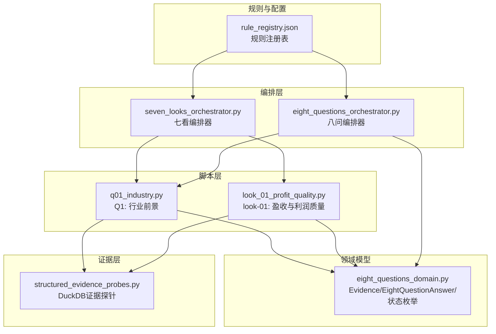
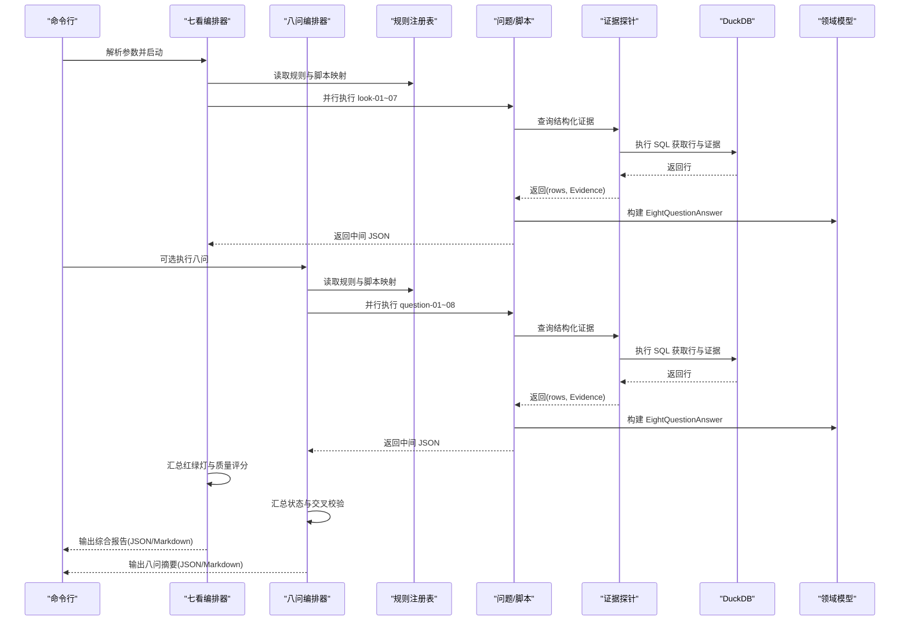
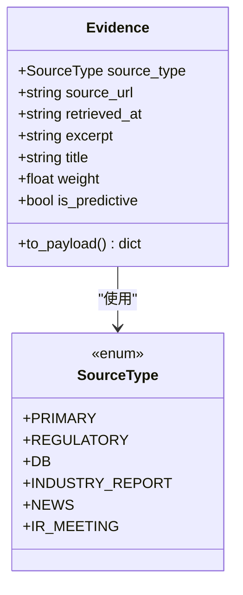
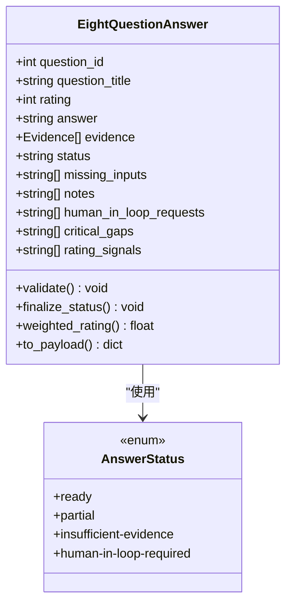
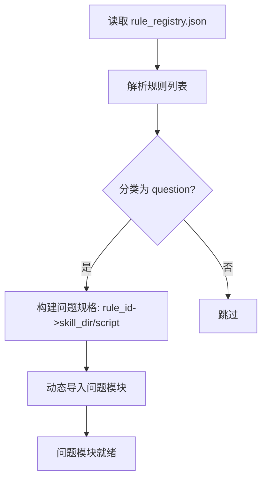
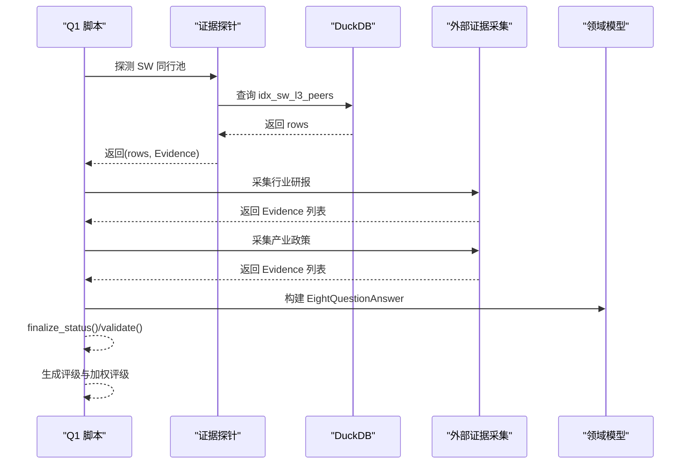
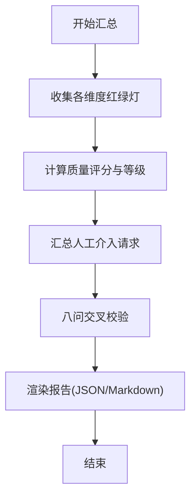
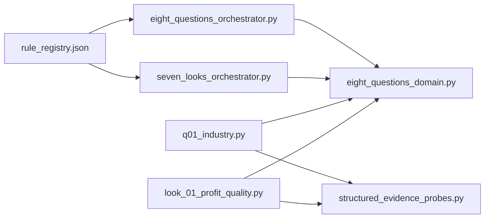

# 分析工作流模型

<cite>
**本文档引用的文件**
- [eight_questions_orchestrator.py](file://2min-company-analysis/seven-look-eight-question/scripts/eight_questions_orchestrator.py)
- [seven_looks_orchestrator.py](file://2min-company-analysis/seven-look-eight-question/scripts/seven_looks_orchestrator.py)
- [eight_questions_domain.py](file://2min-company-analysis/seven-look-eight-question/scripts/eight_questions_domain.py)
- [structured_evidence_probes.py](file://2min-company-analysis/seven-look-eight-question/scripts/structured_evidence_probes.py)
- [rule_registry.json](file://2min-company-analysis/seven-look-eight-question/assets/rule_registry.json)
- [q01_industry.py](file://2min-company-analysis/ask-q1-industry-prospect/scripts/q01_industry.py)
- [look_01_profit_quality.py](file://2min-company-analysis/look-01-profit-quality/scripts/look_01_profit_quality.py)
- [single_question_cli.py](file://2min-company-analysis/seven-look-eight-question/scripts/single_question_cli.py)
</cite>

## 目录
1. [简介](#简介)
2. [项目结构](#项目结构)
3. [核心组件](#核心组件)
4. [架构总览](#架构总览)
5. [详细组件分析](#详细组件分析)
6. [依赖关系分析](#依赖关系分析)
7. [性能考量](#性能考量)
8. [故障排除指南](#故障排除指南)
9. [结论](#结论)

## 简介
本文件系统化梳理“七看八问”分析框架的工作流数据模型，聚焦于证据收集、分析评分、结果汇总的完整流程。文档围绕 EvidenceCollection、AnalysisResult、ScoringModel 等工作流相关数据类，解释证据单元、答案容器、状态机与权重机制，并提供分析规则的结构化表示与动态配置机制，展示多步骤分析过程中的数据传递与转换规则。

## 项目结构
该项目采用“规则注册 + 脚本化执行 + 证据探针”的分层组织方式：
- 规则注册中心：通过 JSON 描述规则 ID、分类、脚本路径、所需表与派生指标，实现动态配置与版本化管理。
- 编排器：七看编排器负责并行执行 7 个独立分析脚本，收集中间 JSON，汇总质量评分与建议；八问编排器负责并行执行 8 个业务问题，汇总整体状态与交叉校验。
- 证据探针：基于 DuckDB 的结构化证据探针，统一返回“原始行+证据单元”，确保每条结论都有可溯源的事实来源。
- 领域模型：定义证据来源类型、证据单元、答案容器、状态与权重，形成统一的数据契约与校验约束。

图表来源
- [rule_registry.json:1-410](file://2min-company-analysis/seven-look-eight-question/assets/rule_registry.json#L1-L410)
- [seven_looks_orchestrator.py:1-1352](file://2min-company-analysis/seven-look-eight-question/scripts/seven_looks_orchestrator.py#L1-L1352)
- [eight_questions_orchestrator.py:1-396](file://2min-company-analysis/seven-look-eight-question/scripts/eight_questions_orchestrator.py#L1-L396)
- [eight_questions_domain.py:1-324](file://2min-company-analysis/seven-look-eight-question/scripts/eight_questions_domain.py#L1-L324)
- [structured_evidence_probes.py:1-386](file://2min-company-analysis/seven-look-eight-question/scripts/structured_evidence_probes.py#L1-L386)
- [q01_industry.py:1-157](file://2min-company-analysis/ask-q1-industry-prospect/scripts/q01_industry.py#L1-L157)
- [look_01_profit_quality.py:1-200](file://2min-company-analysis/look-01-profit-quality/scripts/look_01_profit_quality.py#L1-L200)

章节来源
- [seven_looks_orchestrator.py:1-1352](file://2min-company-analysis/seven-look-eight-question/scripts/seven_looks_orchestrator.py#L1-L1352)
- [eight_questions_orchestrator.py:1-396](file://2min-company-analysis/seven-look-eight-question/scripts/eight_questions_orchestrator.py#L1-L396)
- [rule_registry.json:1-410](file://2min-company-analysis/seven-look-eight-question/assets/rule_registry.json#L1-L410)

## 核心组件
本节聚焦工作流中的三大核心数据模型与它们之间的协作关系。

- Evidence（证据单元）
  - 职责：承载单条证据的来源类型、URL、检索时间、摘录与标题，提供权重与预测性标记。
  - 关键属性：source_type、source_url、retrieved_at、excerpt、title、weight、is_predictive。
  - 校验：禁止空摘录、URL 必填、时间格式 ISO8601。
  - 序列化：to_payload 输出标准化字段集，便于跨模块传递与渲染。

- EightQuestionAnswer（每问回答）
  - 职责：封装问题编号、标题、评级、文字回答、证据列表、状态、缺失输入、备注、人工介入请求、关键证据缺口、评级依据。
  - 状态机：ready/partial/insufficient-evidence/human-in-loop-required，finalize_status 按证据约束自动降级。
  - 评分：支持加权评级 weighted_rating，按证据权重平均计算。
  - 校验：validate 对状态、范围与一致性进行严格约束。

- ScoringModel（评分与汇总）
  - 七看质量评分：基于红绿灯提取器汇总各维度的严重/警告信号，按规则扣分得到分数与等级。
  - 八问汇总：统计问题数量、状态分布、平均评级与加权平均评级，汇总人工介入请求与关键证据缺口。
  - 交叉校验：基于 look-01 与 Q4 的评级与指标进行交叉验证，增强结论稳健性。

章节来源
- [eight_questions_domain.py:72-213](file://2min-company-analysis/seven-look-eight-question/scripts/eight_questions_domain.py#L72-L213)
- [eight_questions_orchestrator.py:169-201](file://2min-company-analysis/seven-look-eight-question/scripts/eight_questions_orchestrator.py#L169-L201)
- [seven_looks_orchestrator.py:655-687](file://2min-company-analysis/seven-look-eight-question/scripts/seven_looks_orchestrator.py#L655-L687)

## 架构总览
下图展示了从规则注册到最终报告输出的端到端数据流，包括证据采集、评分与汇总、状态管理与交叉校验。

图表来源
- [seven_looks_orchestrator.py:1250-1352](file://2min-company-analysis/seven-look-eight-question/scripts/seven_looks_orchestrator.py#L1250-L1352)
- [eight_questions_orchestrator.py:119-164](file://2min-company-analysis/seven-look-eight-question/scripts/eight_questions_orchestrator.py#L119-L164)
- [rule_registry.json:1-410](file://2min-company-analysis/seven-look-eight-question/assets/rule_registry.json#L1-L410)
- [structured_evidence_probes.py:1-386](file://2min-company-analysis/seven-look-eight-question/scripts/structured_evidence_probes.py#L1-L386)
- [eight_questions_domain.py:72-213](file://2min-company-analysis/seven-look-eight-question/scripts/eight_questions_domain.py#L72-L213)

## 详细组件分析

### 组件一：证据探针与证据单元（Evidence）
证据探针以“返回(rows, Evidence)”的契约统一证据采集流程，确保每条结论都有可溯源的事实来源。证据单元包含来源类型、URL、检索时间、摘录与标题，并提供权重与预测性标记。

图表来源
- [eight_questions_domain.py:26-111](file://2min-company-analysis/seven-look-eight-question/scripts/eight_questions_domain.py#L26-L111)

章节来源
- [structured_evidence_probes.py:39-51](file://2min-company-analysis/seven-look-eight-question/scripts/structured_evidence_probes.py#L39-L51)
- [eight_questions_domain.py:72-111](file://2min-company-analysis/seven-look-eight-question/scripts/eight_questions_domain.py#L72-L111)

### 组件二：每问回答与状态机（EightQuestionAnswer）
每问回答容器封装问题编号、标题、评级、文字回答、证据列表、状态、缺失输入、备注、人工介入请求、关键证据缺口、评级依据。状态机按证据约束自动降级，validate 强制校验，weighted_rating 提供加权评级。

图表来源
- [eight_questions_domain.py:123-213](file://2min-company-analysis/seven-look-eight-question/scripts/eight_questions_domain.py#L123-L213)

章节来源
- [eight_questions_domain.py:140-195](file://2min-company-analysis/seven-look-eight-question/scripts/eight_questions_domain.py#L140-L195)

### 组件三：规则注册与动态配置
规则注册表以 JSON 形式描述规则 ID、分类、标题、脚本路径、所需表、派生指标与缺失数据，支持动态加载与版本化管理。编排器通过解析注册表构建问题模块映射，实现“规则即配置”。

图表来源
- [eight_questions_orchestrator.py:54-100](file://2min-company-analysis/seven-look-eight-question/scripts/eight_questions_orchestrator.py#L54-L100)
- [rule_registry.json:1-410](file://2min-company-analysis/seven-look-eight-question/assets/rule_registry.json#L1-L410)

章节来源
- [eight_questions_orchestrator.py:54-100](file://2min-company-analysis/seven-look-eight-question/scripts/eight_questions_orchestrator.py#L54-L100)
- [rule_registry.json:1-410](file://2min-company-analysis/seven-look-eight-question/assets/rule_registry.json#L1-L410)

### 组件四：证据采集流程（以 Q1 为例）
Q1 行业前景脚本演示了“事实 + 观点”的证据采集与评级流程：先通过 DuckDB 探针获取 SW 分类事实，再通过外部工具采集研报与政策证据，最后按规则生成评级与加权评级。

图表来源
- [q01_industry.py:52-147](file://2min-company-analysis/ask-q1-industry-prospect/scripts/q01_industry.py#L52-L147)
- [structured_evidence_probes.py:246-272](file://2min-company-analysis/seven-look-eight-question/scripts/structured_evidence_probes.py#L246-L272)
- [eight_questions_domain.py:140-195](file://2min-company-analysis/seven-look-eight-question/scripts/eight_questions_domain.py#L140-L195)

章节来源
- [q01_industry.py:1-157](file://2min-company-analysis/ask-q1-industry-prospect/scripts/q01_industry.py#L1-L157)
- [structured_evidence_probes.py:246-272](file://2min-company-analysis/seven-look-eight-question/scripts/structured_evidence_probes.py#L246-L272)
- [eight_questions_domain.py:140-195](file://2min-company-analysis/seven-look-eight-question/scripts/eight_questions_domain.py#L140-L195)

### 组件五：七看与八问的汇总与交叉校验
七看编排器汇总各维度的红绿灯信号，计算质量评分与等级，并生成行动建议；八问编排器汇总问题状态、平均评级与加权平均评级，汇总人工介入请求与关键证据缺口，并支持交叉校验。

图表来源
- [seven_looks_orchestrator.py:635-775](file://2min-company-analysis/seven-look-eight-question/scripts/seven_looks_orchestrator.py#L635-L775)
- [eight_questions_orchestrator.py:171-201](file://2min-company-analysis/seven-look-eight-question/scripts/eight_questions_orchestrator.py#L171-L201)
- [eight_questions_orchestrator.py:304-319](file://2min-company-analysis/seven-look-eight-question/scripts/eight_questions_orchestrator.py#L304-L319)

章节来源
- [seven_looks_orchestrator.py:635-775](file://2min-company-analysis/seven-look-eight-question/scripts/seven_looks_orchestrator.py#L635-L775)
- [eight_questions_orchestrator.py:171-201](file://2min-company-analysis/seven-look-eight-question/scripts/eight_questions_orchestrator.py#L171-L201)
- [eight_questions_orchestrator.py:304-319](file://2min-company-analysis/seven-look-eight-question/scripts/eight_questions_orchestrator.py#L304-L319)

## 依赖关系分析
- 编排器依赖规则注册表进行动态模块加载与脚本映射。
- 问题脚本依赖证据探针与领域模型，统一证据采集与答案封装。
- 证据探针依赖 DuckDB 连接与 SQL 查询，返回结构化行与证据单元。
- 八问编排器与七看编排器相互独立，但共享领域模型与证据规范。

图表来源
- [rule_registry.json:1-410](file://2min-company-analysis/seven-look-eight-question/assets/rule_registry.json#L1-L410)
- [eight_questions_orchestrator.py:1-396](file://2min-company-analysis/seven-look-eight-question/scripts/eight_questions_orchestrator.py#L1-L396)
- [seven_looks_orchestrator.py:1-1352](file://2min-company-analysis/seven-look-eight-question/scripts/seven_looks_orchestrator.py#L1-L1352)
- [eight_questions_domain.py:1-324](file://2min-company-analysis/seven-look-eight-question/scripts/eight_questions_domain.py#L1-L324)
- [structured_evidence_probes.py:1-386](file://2min-company-analysis/seven-look-eight-question/scripts/structured_evidence_probes.py#L1-L386)
- [q01_industry.py:1-157](file://2min-company-analysis/ask-q1-industry-prospect/scripts/q01_industry.py#L1-L157)
- [look_01_profit_quality.py:1-200](file://2min-company-analysis/look-01-profit-quality/scripts/look_01_profit_quality.py#L1-L200)

章节来源
- [eight_questions_orchestrator.py:1-396](file://2min-company-analysis/seven-look-eight-question/scripts/eight_questions_orchestrator.py#L1-L396)
- [seven_looks_orchestrator.py:1-1352](file://2min-company-analysis/seven-look-eight-question/scripts/seven_looks_orchestrator.py#L1-L1352)
- [eight_questions_domain.py:1-324](file://2min-company-analysis/seven-look-eight-question/scripts/eight_questions_domain.py#L1-L324)
- [structured_evidence_probes.py:1-386](file://2min-company-analysis/seven-look-eight-question/scripts/structured_evidence_probes.py#L1-L386)
- [q01_industry.py:1-157](file://2min-company-analysis/ask-q1-industry-prospect/scripts/q01_industry.py#L1-L157)
- [look_01_profit_quality.py:1-200](file://2min-company-analysis/look-01-profit-quality/scripts/look_01_profit_quality.py#L1-L200)

## 性能考量
- 并行执行：七看编排器支持多线程池并行执行 7 个子进程，DuckDB 只读连接允许多路并发，显著提升吞吐。
- 超时控制：每个子进程设置超时时间，避免长时间阻塞影响整体进度。
- 中间文件：各维度输出中间 JSON，便于审计与重放，同时减少重复计算。
- 证据权重：通过证据权重对评级进行加权，提高结论稳健性。

章节来源
- [seven_looks_orchestrator.py:1286-1291](file://2min-company-analysis/seven-look-eight-question/scripts/seven_looks_orchestrator.py#L1286-L1291)
- [seven_looks_orchestrator.py:1214-1224](file://2min-company-analysis/seven-look-eight-question/scripts/seven_looks_orchestrator.py#L1214-L1224)
- [eight_questions_orchestrator.py:153-163](file://2min-company-analysis/seven-look-eight-question/scripts/eight_questions_orchestrator.py#L153-L163)

## 故障排除指南
- 证据缺失导致状态降级：当 EightQuestionAnswer.finalize_status() 发现 missing_inputs 或 human_in_loop_requests 非空时，会自动降级为 partial 或 human-in-loop-required。
- 校验失败：validate 对状态、范围与一致性进行严格约束，失败时会记录错误并强制降级为 insufficient-evidence。
- 外部采集失败：外部证据采集模块返回 requires_human 与错误类型，脚本将其写入 missing_inputs 与 human_in_loop_requests，保证状态一致性。
- 交叉校验异常：八问编排器提供 cross_validate，基于 look-01 与 Q4 的指标进行交叉验证，异常时返回标志字典。

章节来源
- [eight_questions_domain.py:168-186](file://2min-company-analysis/seven-look-eight-question/scripts/eight_questions_domain.py#L168-L186)
- [eight_questions_domain.py:140-167](file://2min-company-analysis/seven-look-eight-question/scripts/eight_questions_domain.py#L140-L167)
- [q01_industry.py:88-105](file://2min-company-analysis/ask-q1-industry-prospect/scripts/q01_industry.py#L88-L105)
- [eight_questions_orchestrator.py:304-319](file://2min-company-analysis/seven-look-eight-question/scripts/eight_questions_orchestrator.py#L304-L319)

## 结论
本工作流通过“规则注册 + 编排器 + 证据探针 + 领域模型”的分层设计，实现了可扩展、可审计、可并行的分析流水线。Evidence 与 EightQuestionAnswer 作为核心数据模型，确保每条结论都有可溯源的事实证据与明确的状态约束；规则注册表提供动态配置能力；七看与八问分别承担“财务质量评估”与“业务问题分析”的职责，并通过交叉校验增强结论稳健性。该体系既满足自动化需求，又为人工介入与深度验证留出空间，适合在复杂数据环境中稳定运行。