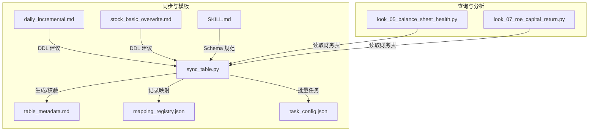
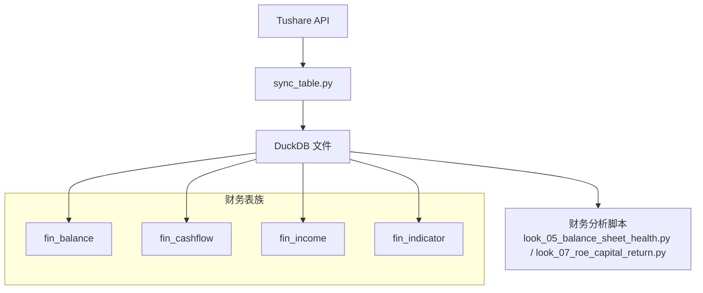
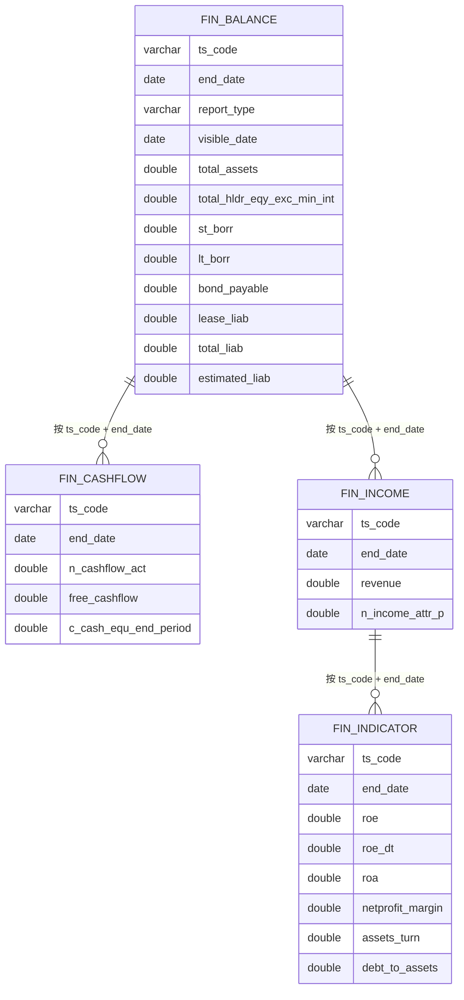
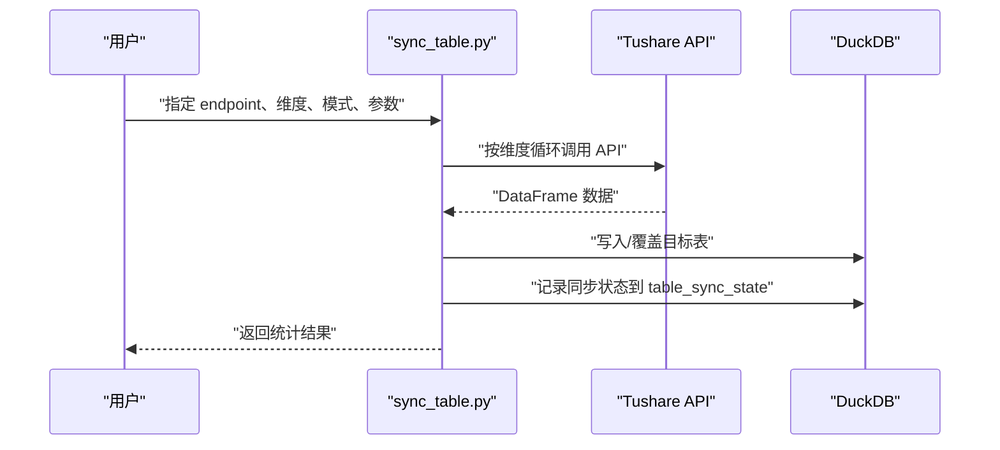
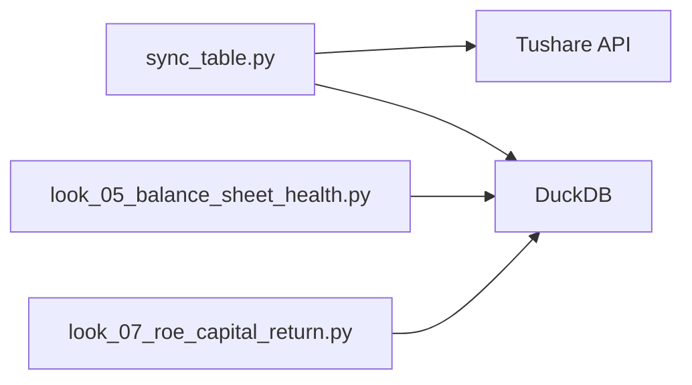

# 数据库模式

<cite>
**本文引用的文件**
- [sync_table.py](file://tushare-duckdb-sync/scripts/sync_table.py)
- [table_metadata.md](file://tushare-duckdb-sync/templates/table_metadata.md)
- [mapping_registry.json](file://tushare-duckdb-sync/templates/mapping_registry.json)
- [task_config.json](file://tushare-duckdb-sync/templates/task_config.json)
- [daily_incremental.md](file://tushare-duckdb-sync/examples/daily_incremental.md)
- [stock_basic_overwrite.md](file://tushare-duckdb-sync/examples/stock_basic_overwrite.md)
- [look_05_balance_sheet_health.py](file://2min-company-analysis/look-05-balance-sheet-health/scripts/look_05_balance_sheet_health.py)
- [look_07_roe_capital_return.py](file://2min-company-analysis/look-07-roe-capital-return/scripts/look_07_roe_capital_return.py)
- [SKILL.md](file://tushare-duckdb-sync/SKILL.md)
</cite>

## 目录
1. [简介](#简介)
2. [项目结构](#项目结构)
3. [核心组件](#核心组件)
4. [架构总览](#架构总览)
5. [详细组件分析](#详细组件分析)
6. [依赖分析](#依赖分析)
7. [性能考虑](#性能考虑)
8. [故障排查指南](#故障排查指南)
9. [结论](#结论)
10. [附录](#附录)

## 简介
本文件系统化梳理 DuckDB 数据库在本仓库中的模式设计与使用实践，覆盖数据来源（Tushare）、同步流程（增量/全量）、表结构定义（字段、类型、索引、约束）、表间关系与外键约束、数据字典与字段含义、查询模式与性能优化建议，以及数据迁移与版本管理策略。内容基于同步脚本、模板与示例文档提炼总结，并结合财务分析脚本中的查询模式给出落地实践。

## 项目结构
围绕 DuckDB 数据模式的关键目录与文件如下：
- 同步与模板
  - tushare-duckdb-sync/scripts/sync_table.py：单表同步脚本，支持全量覆盖与按维度增量同步，内置断点续传与状态记录。
  - tushare-duckdb-sync/templates/table_metadata.md：表元数据文档模板，用于生成每张表的字段详情、质量快照与同步记录。
  - tushare-duckdb-sync/templates/mapping_registry.json：表映射注册表，记录 Tushare 接口到 DuckDB 表的映射关系。
  - tushare-duckdb-sync/templates/task_config.json：批量任务配置模板，定义 endpoint、维度、模式、参数等。
  - tushare-duckdb-sync/examples/daily_incremental.md：按交易日增量同步的示例与 DDL 建议。
  - tushare-duckdb-sync/examples/stock_basic_overwrite.md：无维度全量覆盖示例与 DDL 建议。
  - tushare-duckdb-sync/SKILL.md：数据资产清单与 DuckDB Schema 设计规范。
- 查询与分析
  - 2min-company-analysis/.../scripts/look_05_balance_sheet_health.py：财务报表健康度分析，涉及 fin_balance、fin_cashflow、fin_income 等财务表。
  - 2min-company-analysis/.../scripts/look_07_roe_capital_return.py：杜邦分析所需数据读取，涉及 fin_balance、fin_income、fin_indicator 等财务表。

**图表来源**
- [sync_table.py:1-618](file://tushare-duckdb-sync/scripts/sync_table.py#L1-L618)
- [table_metadata.md:1-73](file://tushare-duckdb-sync/templates/table_metadata.md#L1-L73)
- [mapping_registry.json:1-16](file://tushare-duckdb-sync/templates/mapping_registry.json#L1-L16)
- [task_config.json:1-22](file://tushare-duckdb-sync/templates/task_config.json#L1-L22)
- [daily_incremental.md:1-163](file://tushare-duckdb-sync/examples/daily_incremental.md#L1-L163)
- [stock_basic_overwrite.md:1-146](file://tushare-duckdb-sync/examples/stock_basic_overwrite.md#L1-L146)
- [look_05_balance_sheet_health.py:1-200](file://2min-company-analysis/look-05-balance-sheet-health/scripts/look_05_balance_sheet_health.py#L1-L200)
- [look_07_roe_capital_return.py:1-200](file://2min-company-analysis/look-07-roe-capital-return/scripts/look_07_roe_capital_return.py#L1-L200)
- [SKILL.md:354-389](file://tushare-duckdb-sync/SKILL.md#L354-L389)

**章节来源**
- [sync_table.py:1-618](file://tushare-duckdb-sync/scripts/sync_table.py#L1-L618)
- [table_metadata.md:1-73](file://tushare-duckdb-sync/templates/table_metadata.md#L1-L73)
- [mapping_registry.json:1-16](file://tushare-duckdb-sync/templates/mapping_registry.json#L1-L16)
- [task_config.json:1-22](file://tushare-duckdb-sync/templates/task_config.json#L1-L22)
- [daily_incremental.md:1-163](file://tushare-duckdb-sync/examples/daily_incremental.md#L1-L163)
- [stock_basic_overwrite.md:1-146](file://tushare-duckdb-sync/examples/stock_basic_overwrite.md#L1-L146)
- [look_05_balance_sheet_health.py:1-200](file://2min-company-analysis/look-05-balance-sheet-health/scripts/look_05_balance_sheet_health.py#L1-L200)
- [look_07_roe_capital_return.py:1-200](file://2min-company-analysis/look-07-roe-capital-return/scripts/look_07_roe_capital_return.py#L1-L200)
- [SKILL.md:354-389](file://tushare-duckdb-sync/SKILL.md#L354-L389)

## 核心组件
- 同步脚本（sync_table.py）
  - 支持三种维度：none（全量覆盖）、trade_date（按交易日增量）、period（按报告期增量）。
  - 断点续传：通过 DuckDB 内部表 table_sync_state 记录同步状态，支持跳过已同步维度。
  - 安全截止：对 trade_date 维度默认采用 Asia/Shanghai 18:00 截止规则，避免发布前数据不稳定。
  - 写入策略：overwrite 模式下首次写入会先建表；append 模式下按目标表现有列对齐并插入。
  - 类型与日期：自动将 YYYYMMDD 字符串转换为 DATE 类型，NaN 统一转为 SQL NULL。
- 元数据模板（table_metadata.md）
  - 提供表中文名、基本信息、字段详情、列角色分类、特殊取值说明、Tushare↔DuckDB 差异、数据质量快照、同步记录等标准化结构。
- 映射注册表（mapping_registry.json）
  - 记录 source_table/target_table/endpoint/dimension_type/method/pk/doc_id/note 等映射信息，作为同步与文档生成的依据。
- 任务配置（task_config.json）
  - 批量任务 JSON 模板，包含 endpoint、source_table、target_table、mode、dimension_type、start_date/end_date、sync_all、sleep_seconds、publish_cutoff_hour、allow_empty_result、params 等字段。
- 示例文档（daily_incremental.md、stock_basic_overwrite.md）
  - 提供按交易日增量与无维度全量覆盖的完整示例，包含同步命令、DDL 建议（主键、索引）、质检命令与期望元数据文档。
- 查询脚本（财务分析）
  - 读取 fin_balance、fin_cashflow、fin_income、fin_indicator 等财务表，体现表间关联与查询模式。

**章节来源**
- [sync_table.py:1-618](file://tushare-duckdb-sync/scripts/sync_table.py#L1-L618)
- [table_metadata.md:1-73](file://tushare-duckdb-sync/templates/table_metadata.md#L1-L73)
- [mapping_registry.json:1-16](file://tushare-duckdb-sync/templates/mapping_registry.json#L1-L16)
- [task_config.json:1-22](file://tushare-duckdb-sync/templates/task_config.json#L1-L22)
- [daily_incremental.md:1-163](file://tushare-duckdb-sync/examples/daily_incremental.md#L1-L163)
- [stock_basic_overwrite.md:1-146](file://tushare-duckdb-sync/examples/stock_basic_overwrite.md#L1-L146)
- [look_05_balance_sheet_health.py:1-200](file://2min-company-analysis/look-05-balance-sheet-health/scripts/look_05_balance_sheet_health.py#L1-L200)
- [look_07_roe_capital_return.py:1-200](file://2min-company-analysis/look-07-roe-capital-return/scripts/look_07_roe_capital_return.py#L1-L200)

## 架构总览
DuckDB 数据模式围绕“财务数据 + 公司信息 + 分析结果”三层组织，同步脚本负责从 Tushare 拉取并写入 DuckDB，查询脚本基于财务表进行分析。

**图表来源**
- [sync_table.py:1-618](file://tushare-duckdb-sync/scripts/sync_table.py#L1-L618)
- [look_05_balance_sheet_health.py:1-200](file://2min-company-analysis/look-05-balance-sheet-health/scripts/look_05_balance_sheet_health.py#L1-L200)
- [look_07_roe_capital_return.py:1-200](file://2min-company-analysis/look-07-roe-capital-return/scripts/look_07_roe_capital_return.py#L1-L200)

## 详细组件分析

### 财务数据表族（fin_*）
- 表命名与用途
  - fin_balance：资产负债表，按 end_date 年报归集，report_type=1 表示年报。
  - fin_cashflow：现金流量表，按 end_date 年报归集。
  - fin_income：利润表，按 end_date 年报归集。
  - fin_indicator：财务指标表，包含 ROE、ROA、净利率、总资产周转率等。
- 字段与类型（概览）
  - 标识字段：ts_code（股票代码）。
  - 维度字段：end_date（报告期）、report_type（报告类型）、visible_date（可见日期，用于去重）。
  - 度量字段：各类财务数值（如总资产、净资产、营业收入、净利润、自由现金流等）。
  - 辅助字段：公告日期、报表日期等。
- 约束与索引
  - 主键：通常为 (ts_code, end_date)。
  - 索引：按 end_date 建独立索引，加速按报告期范围查询。
- 外键关系
  - 逻辑外键：各表均以 ts_code 关联至公司基本信息表（见下节）。
  - 时间维度：各表以 end_date 作为时间维度，配合 report_type 进行筛选。
- 查询模式
  - 年报筛选：EXTRACT(MONTH FROM end_date)=12 且 EXTRACT(DAY FROM end_date)=31。
  - 去重策略：按 ts_code+end_date 分组，取 visible_date 最近的一条记录。
  - 联结策略：LEFT JOIN 获取跨表指标，保证年份连续性。

**图表来源**
- [look_05_balance_sheet_health.py:114-200](file://2min-company-analysis/look-05-balance-sheet-health/scripts/look_05_balance_sheet_health.py#L114-L200)
- [look_07_roe_capital_return.py:68-140](file://2min-company-analysis/look-07-roe-capital-return/scripts/look_07_roe_capital_return.py#L68-L140)

**章节来源**
- [look_05_balance_sheet_health.py:114-200](file://2min-company-analysis/look-05-balance-sheet-health/scripts/look_05_balance_sheet_health.py#L114-L200)
- [look_07_roe_capital_return.py:68-140](file://2min-company-analysis/look-07-roe-capital-return/scripts/look_07_roe_capital_return.py#L68-L140)

### 公司基本信息表（stk_info）
- 表命名与用途
  - stk_info：A 股股票基本信息表，记录 ts_code、名称、行业、上市日期、是否沪深港通等。
- 字段与类型（概览）
  - 标识字段：ts_code。
  - 维度字段：list_date、delist_date、list_status、is_hs 等。
  - 辅助字段：name、area、industry、market、exchange、fullname、enname、cnspell、curr_type、act_name、act_ent_type 等。
- 约束与索引
  - 主键：(ts_code)。
  - 常用索引：按 list_date、industry 等维度建立索引，提升筛选效率。
- 同步模式
  - 使用 overwrite 模式全量覆盖，首次写入后由 Agent 生成并确认 DDL（主键、索引）。

**章节来源**
- [stock_basic_overwrite.md:41-56](file://tushare-duckdb-sync/examples/stock_basic_overwrite.md#L41-L56)

### 日线行情表（stk_daily）
- 表命名与用途
  - stk_daily：A 股日线行情表，记录 ts_code、trade_date、OHLCV 等。
- 字段与类型（概览）
  - 标识字段：ts_code。
  - 维度字段：trade_date。
  - 度量字段：open、high、low、close、pre_close、change、pct_chg、vol、amount 等。
- 约束与索引
  - 主键：(ts_code, trade_date)。
  - 索引：按 trade_date 建独立索引，加速按日期范围查询。
- 同步模式
  - 使用 append 模式按 trade_date 维度增量同步，遵循 Asia/Shanghai 18:00 安全截止规则。

**章节来源**
- [daily_incremental.md:70-78](file://tushare-duckdb-sync/examples/daily_incremental.md#L70-L78)

### 分析结果表（示例：财务指标表 fin_indicator）
- 表命名与用途
  - fin_indicator：财务指标表，包含 ROE、ROA、净利率、总资产周转率、资产负债率等。
- 字段与类型（概览）
  - 标识字段：ts_code。
  - 维度字段：end_date、report_type。
  - 度量字段：roe、roa、netprofit_margin、assets_turn、debt_to_assets 等。
- 约束与索引
  - 主键：(ts_code, end_date)。
  - 索引：按 end_date 建独立索引，便于按报告期范围查询。
- 查询模式
  - 年报筛选：EXTRACT(MONTH FROM end_date)=12 且 EXTRACT(DAY FROM end_date)=31。
  - 去重策略：按 ts_code+end_date 分组，取公告日期/可见日期最近的一条记录。

**章节来源**
- [look_07_roe_capital_return.py:153-194](file://2min-company-analysis/look-07-roe-capital-return/scripts/look_07_roe_capital_return.py#L153-L194)

### 同步流程与状态管理
- 断点续传
  - 通过 DuckDB 内部表 table_sync_state 记录 source_table、dimension_type、dimension_value、is_sync、error_message、updated_at。
  - 支持 sync_all 跳过已同步维度，继续处理剩余维度。
- 维度解析
  - trade_date：根据交易日历与安全截止规则确定有效窗口。
  - period：按季度末（12 月 31 日）生成报告期序列。
- 写入与对齐
  - 首次写入：CREATE TABLE AS SELECT。
  - 后续写入：按目标表列对齐，自动将 YYYYMMDD 字符串转换为 DATE，NaN 转为 NULL。

**图表来源**
- [sync_table.py:451-517](file://tushare-duckdb-sync/scripts/sync_table.py#L451-L517)

**章节来源**
- [sync_table.py:156-215](file://tushare-duckdb-sync/scripts/sync_table.py#L156-L215)
- [sync_table.py:265-287](file://tushare-duckdb-sync/scripts/sync_table.py#L265-L287)
- [sync_table.py:294-337](file://tushare-duckdb-sync/scripts/sync_table.py#L294-L337)
- [sync_table.py:405-444](file://tushare-duckdb-sync/scripts/sync_table.py#L405-L444)

## 依赖分析
- 组件耦合
  - 同步脚本与 DuckDB：通过 DuckDBPyConnection 读取表结构、写入数据、维护同步状态。
  - 同步脚本与 Tushare：通过 tushare pro API 拉取数据，支持 query 与特定方法调用。
  - 查询脚本与财务表：依赖 fin_balance、fin_cashflow、fin_income、fin_indicator 等表的结构与索引。
- 外部依赖
  - duckdb、pandas、loguru、tushare。
- 潜在环路
  - 无直接环路；查询脚本仅读取，不写入；同步脚本仅写入，不依赖查询脚本。

**图表来源**
- [sync_table.py:1-618](file://tushare-duckdb-sync/scripts/sync_table.py#L1-L618)
- [look_05_balance_sheet_health.py:1-200](file://2min-company-analysis/look-05-balance-sheet-health/scripts/look_05_balance_sheet_health.py#L1-L200)
- [look_07_roe_capital_return.py:1-200](file://2min-company-analysis/look-07-roe-capital-return/scripts/look_07_roe_capital_return.py#L1-L200)

**章节来源**
- [sync_table.py:1-618](file://tushare-duckdb-sync/scripts/sync_table.py#L1-L618)
- [look_05_balance_sheet_health.py:1-200](file://2min-company-analysis/look-05-balance-sheet-health/scripts/look_05_balance_sheet_health.py#L1-L200)
- [look_07_roe_capital_return.py:1-200](file://2min-company-analysis/look-07-roe-capital-return/scripts/look_07_roe_capital_return.py#L1-L200)

## 性能考虑
- 索引设计
  - 日期维度列（trade_date、end_date）必须建立独立索引，命名规范为 idx_{table}_{col}。
  - 常用过滤维度（如 list_date、industry）建议建立索引以提升筛选效率。
- 主键约束
  - 每张表必须有主键，通常为 (ts_code, trade_date) 或 (ts_code, end_date)，确保唯一性与去重。
- 数据类型
  - 日期列统一使用 DATE 类型，避免字符串比较；数值列使用 DOUBLE/BIGINT。
- 查询优化
  - 年报场景：先按 EXTRACT(MONTH)=12 与 EXTRACT(DAY)=31 过滤，再按 visible_date 去重。
  - 联结顺序：优先使用较小结果集驱动大表，减少内存压力。
- 同步策略
  - 增量同步：按维度逐批处理，结合 sleep 控制 API 调用频率，避免限流。
  - 断点续传：利用 table_sync_state 跳过已完成维度，提高整体吞吐。

[本节为通用性能建议，无需具体文件引用]

## 故障排查指南
- 常见错误与处理
  - 缺少 TUSHARE_TOKEN：环境变量缺失导致初始化失败，需设置令牌。
  - 无效日期格式：YYYYMMDD 或 YYYY-MM-DD 格式不正确，需修正。
  - 维度窗口为空：当未到发布截止时间或无可用交易日时，维度解析为空，需调整截止规则或显式传入 end_date。
  - 增量空结果：默认将空 payload 视为失败，避免误标记；如预期为 0 行，请使用 allow_empty_result。
  - 同步状态异常：检查 table_sync_state 是否存在，必要时重建。
- 质检与验证
  - 使用 check_quality.py 生成数据质量快照，关注 PK 重复数、NULL 数、度量列全 NULL 率等指标。
  - 对比 Tushare 文档与 DuckDB 字段差异，确保类型与语义一致。

**章节来源**
- [sync_table.py:72-78](file://tushare-duckdb-sync/scripts/sync_table.py#L72-L78)
- [sync_table.py:120-127](file://tushare-duckdb-sync/scripts/sync_table.py#L120-L127)
- [sync_table.py:234-262](file://tushare-duckdb-sync/scripts/sync_table.py#L234-L262)
- [sync_table.py:322-337](file://tushare-duckdb-sync/scripts/sync_table.py#L322-L337)
- [sync_table.py:156-186](file://tushare-duckdb-sync/scripts/sync_table.py#L156-L186)

## 结论
本仓库通过标准化的同步脚本、模板与示例文档，构建了清晰的 DuckDB 数据模式：以 fin_* 财务表族为核心，辅以公司信息表与日线行情表，形成完整的 A 股数据体系。遵循主键约束、索引设计与日期类型统一等规范，结合断点续传与安全截止策略，既保障了数据质量，也提升了查询与分析效率。建议在新增表时严格遵循模板与规范，持续完善元数据文档与同步记录。

[本节为总结性内容，无需具体文件引用]

## 附录

### 数据字典与字段含义（示例）
- 财务表（fin_balance、fin_cashflow、fin_income、fin_indicator）
  - 标识字段：ts_code（股票代码）。
  - 维度字段：end_date（报告期）、report_type（报告类型）、visible_date（可见日期）。
  - 度量字段：总资产、净资产、营业收入、净利润、自由现金流、ROE、ROA、净利率、总资产周转率、资产负债率等。
  - 辅助字段：公告日期、报表日期等。
- 公司信息表（stk_info）
  - 标识字段：ts_code。
  - 维度字段：list_date、delist_date、list_status、is_hs。
  - 辅助字段：name、area、industry、market、exchange、fullname、enname、cnspell、curr_type、act_name、act_ent_type。
- 日线行情表（stk_daily）
  - 标识字段：ts_code。
  - 维度字段：trade_date。
  - 度量字段：open、high、low、close、pre_close、change、pct_chg、vol、amount。

**章节来源**
- [table_metadata.md:20-48](file://tushare-duckdb-sync/templates/table_metadata.md#L20-L48)
- [stock_basic_overwrite.md:88-126](file://tushare-duckdb-sync/examples/stock_basic_overwrite.md#L88-L126)
- [daily_incremental.md:110-127](file://tushare-duckdb-sync/examples/daily_incremental.md#L110-L127)

### 数据迁移与版本管理策略
- 迁移策略
  - 全量覆盖：使用 overwrite 模式，首次写入后由 Agent 生成并确认 DDL（主键、索引）。
  - 增量同步：使用 append 模式，按维度逐批处理，支持断点续传。
- 版本管理
  - 元数据文档：每张表生成独立的 Markdown 文档，记录字段详情、质量快照与同步记录。
  - 映射注册表：维护 source_table/target_table/endpoint/dimension_type/method/pk/doc_id/note 等映射，便于追溯与审计。
  - 任务配置：通过 JSON 模板管理批量任务，统一参数与行为。

**章节来源**
- [mapping_registry.json:1-16](file://tushare-duckdb-sync/templates/mapping_registry.json#L1-L16)
- [task_config.json:1-22](file://tushare-duckdb-sync/templates/task_config.json#L1-L22)
- [stock_basic_overwrite.md:41-56](file://tushare-duckdb-sync/examples/stock_basic_overwrite.md#L41-L56)
- [daily_incremental.md:70-78](file://tushare-duckdb-sync/examples/daily_incremental.md#L70-L78)