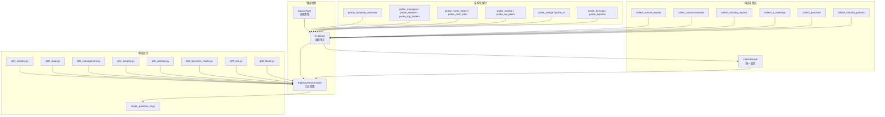
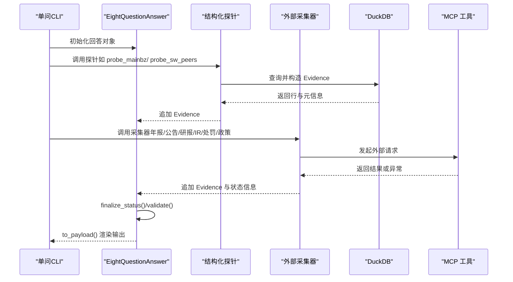
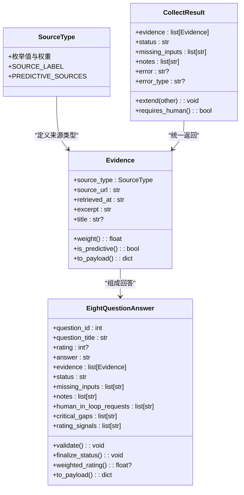

# 数据模型

<cite>
**本文引用的文件**
- [eight_questions_domain.py](file://2min-company-analysis/seven-look-eight-question/scripts/eight_questions_domain.py)
- [structured_evidence_probes.py](file://2min-company-analysis/seven-look-eight-question/scripts/structured_evidence_probes.py)
- [external_evidence_collectors.py](file://2min-company-analysis/seven-look-eight-question/scripts/external_evidence_collectors.py)
- [single_question_cli.py](file://2min-company-analysis/seven-look-eight-question/scripts/single_question_cli.py)
- [q01_industry.py](file://2min-company-analysis/ask-q1-industry-prospect/scripts/q01_industry.py)
- [q02_moat.py](file://2min-company-analysis/ask-q2-moat/scripts/q02_moat.py)
- [q03_management.py](file://2min-company-analysis/ask-q3-management/scripts/q03_management.py)
- [q04_integrity.py](file://2min-company-analysis/ask-q4-financial-integrity/scripts/q04_integrity.py)
- [q05_position.py](file://2min-company-analysis/ask-q5-market-position/scripts/q05_position.py)
- [q06_business_model.py](file://2min-company-analysis/ask-q6-business-model/scripts/q06_business_model.py)
- [q07_risk.py](file://2min-company-analysis/ask-q7-risk-factors/scripts/q07_risk.py)
- [q08_future.py](file://2min-company-analysis/ask-q8-future-plan/scripts/q08_future.py)
- [rule_registry.json](file://2min-company-analysis/seven-look-eight-question/assets/rule_registry.json)
</cite>

## 目录
1. [简介](#简介)
2. [项目结构](#项目结构)
3. [核心组件](#核心组件)
4. [架构总览](#架构总览)
5. [详细组件分析](#详细组件分析)
6. [依赖关系分析](#依赖关系分析)
7. [性能考量](#性能考量)
8. [故障排查指南](#故障排查指南)
9. [结论](#结论)
10. [附录](#附录)

## 简介
本文件系统化梳理“八问”数据模型与证据体系，聚焦以下关键实体：
- Evidence：证据单元，承载来源类型、URL、抓取时间、摘录内容、标题等字段，并内置强校验与权重/预测标记派生属性。
- EightQuestionAnswer：每问回答，包含问题编号、标题、评级、状态、证据集合及辅助字段（缺失输入、人工介入请求、关键缺口、评级信号等）。
- SourceType：证据来源枚举，定义事实/预测/监管/数据库/新闻/IR 等类型及其权重、标签与预测标记。
- CollectResult：外部证据采集统一返回结构，封装证据列表与状态迁移策略。

文档还提供字段约束、默认值、校验规则、字段映射关系、典型数据流与使用场景，确保模型一致性与完整性。

## 项目结构
围绕“八问”问答流程，代码采用“领域模型 + 结构化探针 + 外部采集器 + 单问 CLI”的分层组织：
- 领域模型层：定义 Evidence、EightQuestionAnswer、SourceType 及其行为。
- 结构化探针层：基于 DuckDB 查询，构造结构化证据。
- 外部采集器层：封装 MCP 工具调用，统一返回 CollectResult。
- 单问 CLI 层：标准化输出 JSON 与 Markdown，完成最终校验与渲染。

图表来源
- [eight_questions_domain.py:26-113](file://2min-company-analysis/seven-look-eight-question/scripts/eight_questions_domain.py#L26-L113)
- [structured_evidence_probes.py:58-386](file://2min-company-analysis/seven-look-eight-question/scripts/structured_evidence_probes.py#L58-L386)
- [external_evidence_collectors.py:47-524](file://2min-company-analysis/seven-look-eight-question/scripts/external_evidence_collectors.py#L47-L524)
- [single_question_cli.py:36-158](file://2min-company-analysis/seven-look-eight-question/scripts/single_question_cli.py#L36-L158)
- [q01_industry.py:52-147](file://2min-company-analysis/ask-q1-industry-prospect/scripts/q01_industry.py#L52-L147)
- [q02_moat.py:46-120](file://2min-company-analysis/ask-q2-moat/scripts/q02_moat.py#L46-L120)
- [q03_management.py:38-120](file://2min-company-analysis/ask-q3-management/scripts/q03_management.py#L38-L120)
- [q04_integrity.py:35-122](file://2min-company-analysis/ask-q4-financial-integrity/scripts/q04_integrity.py#L35-L122)
- [q05_position.py:46-120](file://2min-company-analysis/ask-q5-market-position/scripts/q05_position.py#L46-L120)
- [q06_business_model.py:91-156](file://2min-company-analysis/ask-q6-business-model/scripts/q06_business_model.py#L91-L156)
- [q07_risk.py:38-129](file://2min-company-analysis/ask-q7-risk-factors/scripts/q07_risk.py#L38-L129)
- [q08_future.py:29-116](file://2min-company-analysis/ask-q8-future-plan/scripts/q08_future.py#L29-L116)

章节来源
- [eight_questions_domain.py:1-324](file://2min-company-analysis/seven-look-eight-question/scripts/eight_questions_domain.py#L1-L324)
- [structured_evidence_probes.py:1-386](file://2min-company-analysis/seven-look-eight-question/scripts/structured_evidence_probes.py#L1-L386)
- [external_evidence_collectors.py:1-524](file://2min-company-analysis/seven-look-eight-question/scripts/external_evidence_collectors.py#L1-L524)
- [single_question_cli.py:1-158](file://2min-company-analysis/seven-look-eight-question/scripts/single_question_cli.py#L1-L158)

## 核心组件
本节聚焦三大核心数据实体：Evidence、EightQuestionAnswer、SourceType，以及统一返回结构 CollectResult。

- Evidence（证据单元）
  - 字段与类型
    - source_type: SourceType（枚举）
    - source_url: str（HTTP/HTTPS/duckdb/file 等 URL）
    - retrieved_at: str（ISO8601 时间）
    - excerpt: str（原文/字段摘录，不能为空）
    - title: str | None（标题，可选）
  - 约束与校验
    - source_url 非空
    - excerpt 非空且去除空白后非空
    - retrieved_at 符合 ISO8601 正则格式
  - 派生属性
    - weight：按 SourceType 查表得到权重
    - is_predictive：判断是否为预测/公司口径来源
  - 字段映射
    - to_payload() 输出包含 source_type.value、source_label、weight、is_predictive 等
  - 默认值
    - title 默认 None
  - 业务含义
    - 作为最小证据单元，贯穿“八问”各模块，用于评级与加权、来源标注与置信度评估。

- EightQuestionAnswer（八问回答）
  - 字段与类型
    - question_id: int（1..8）
    - question_title: str
    - rating: int | None（1..5；不足证据时为 None）
    - answer: str（文字回答，可为空）
    - evidence: list[Evidence]（证据列表，默认空）
    - status: AnswerStatus（默认 "insufficient-evidence"）
    - missing_inputs: list[str]（待补输入，默认空）
    - notes: list[str]（备注，默认空）
    - human_in_loop_requests: list[str]（人工介入请求，默认空）
    - critical_gaps: list[str]（关键证据缺口，默认空）
    - rating_signals: list[str]（评级依据，默认空）
  - 约束与校验
    - status 必须属于预定义集合
    - question_id ∈ [1..8]
    - status="ready" 时：
      - evidence 非空
      - rating ∈ [1..5]
      - missing_inputs 与 human_in_loop_requests 均为空（需先 finalize_status 降级）
  - 状态机与降级
    - finalize_status()：按优先级自动降级
      - 人工介入请求非空 → "human-in-loop-required"
      - 原为 "ready" 且 missing_inputs 非空 → "partial"
      - 否则保持原状态
  - 派生属性
    - weighted_rating()：按证据权重加权的评级（无证据或 rating 为空则返回 None）
    - to_payload()：输出包含 question_id、question_title、rating、weighted_rating、answer、status、evidence_count、has_predictive_sources、以及上述辅助字段
  - 默认值
    - rating=None、status="insufficient-evidence"、其余字段默认空列表
  - 业务含义
    - 承载每问的最终结论、证据与状态，支持加权评级与审计追溯。

- SourceType（来源类型）
  - 枚举值与权重
    - PRIMARY（法定披露）：权重 1.0
    - REGULATORY（监管披露）：权重 1.0
    - DB（本地 DuckDB 指标）：权重 1.0
    - INDUSTRY_REPORT（券商研报，含预测）：权重 0.6
    - NEWS（新闻/舆情）：权重 0.4
    - IR_MEETING（IR 调研纪要，公司口径）：权重 0.5
  - 标签与预测标记
    - SOURCE_LABEL：用于渲染与可视化
    - PREDICTIVE_SOURCES：判定 is_predictive 的集合
  - 业务含义
    - 统一证据来源分类，驱动权重与预测标记，保障“禁止编造、必标来源”。

- CollectResult（统一返回结构）
  - 字段与类型
    - evidence: list[Evidence]
    - status: str（默认 "insufficient-evidence"）
    - missing_inputs: list[str]
    - notes: list[str]
    - error: str | None
    - error_type: str | None（语义化错误分类）
  - 错误分类
    - env_missing、network_fail、not_found、module_missing、upstream_contract_break、source_disabled
  - 业务含义
    - 规范外部采集器返回形态，屏蔽异常，保证上游不崩溃；配合 qNN 决策进行降级。

章节来源
- [eight_questions_domain.py:26-113](file://2min-company-analysis/seven-look-eight-question/scripts/eight_questions_domain.py#L26-L113)
- [eight_questions_domain.py:123-212](file://2min-company-analysis/seven-look-eight-question/scripts/eight_questions_domain.py#L123-L212)
- [eight_questions_domain.py:220-277](file://2min-company-analysis/seven-look-eight-question/scripts/eight_questions_domain.py#L220-L277)
- [external_evidence_collectors.py:47-76](file://2min-company-analysis/seven-look-eight-question/scripts/external_evidence_collectors.py#L47-L76)

## 架构总览
下图展示“八问”数据模型在问答流程中的交互关系：单问脚本调用结构化探针与外部采集器，构建 Evidence 列表，填充 EightQuestionAnswer，再通过 CLI 输出 JSON/Markdown。

图表来源
- [single_question_cli.py:126-158](file://2min-company-analysis/seven-look-eight-question/scripts/single_question_cli.py#L126-L158)
- [q01_industry.py:52-147](file://2min-company-analysis/ask-q1-industry-prospect/scripts/q01_industry.py#L52-L147)
- [q02_moat.py:46-120](file://2min-company-analysis/ask-q2-moat/scripts/q02_moat.py#L46-L120)
- [q03_management.py:38-120](file://2min-company-analysis/ask-q3-management/scripts/q03_management.py#L38-L120)
- [q04_integrity.py:35-122](file://2min-company-analysis/ask-q4-financial-integrity/scripts/q04_integrity.py#L35-L122)
- [q05_position.py:46-120](file://2min-company-analysis/ask-q5-market-position/scripts/q05_position.py#L46-L120)
- [q06_business_model.py:91-156](file://2min-company-analysis/ask-q6-business-model/scripts/q06_business_model.py#L91-L156)
- [q07_risk.py:38-129](file://2min-company-analysis/ask-q7-risk-factors/scripts/q07_risk.py#L38-L129)
- [q08_future.py:29-116](file://2min-company-analysis/ask-q8-future-plan/scripts/q08_future.py#L29-L116)
- [structured_evidence_probes.py:58-386](file://2min-company-analysis/seven-look-eight-question/scripts/structured_evidence_probes.py#L58-L386)
- [external_evidence_collectors.py:140-524](file://2min-company-analysis/seven-look-eight-question/scripts/external_evidence_collectors.py#L140-L524)

## 详细组件分析

### Evidence 实体详解
- 字段定义与约束
  - source_type：枚举，决定权重与预测标记
  - source_url：必须非空，支持 http(s)、duckdb、file 等协议
  - retrieved_at：ISO8601 格式字符串
  - excerpt：必填，且去除空白后非空
  - title：可选
- 校验与派生
  - __post_init__ 强校验
  - weight/is_predictive 基于 SourceType 表与集合
- 使用场景
  - 结构化探针与外部采集器均构造 Evidence，统一进入 EightQuestionAnswer.evidence
- 字段映射
  - to_payload() 输出包含 source_type.value、source_label、weight、is_predictive 等

章节来源
- [eight_questions_domain.py:72-113](file://2min-company-analysis/seven-look-eight-question/scripts/eight_questions_domain.py#L72-L113)
- [structured_evidence_probes.py:39-51](file://2min-company-analysis/seven-look-eight-question/scripts/structured_evidence_probes.py#L39-L51)
- [external_evidence_collectors.py:177-188](file://2min-company-analysis/seven-look-eight-question/scripts/external_evidence_collectors.py#L177-L188)

### EightQuestionAnswer 实体详解
- 字段与默认值
  - question_id ∈ [1..8]，默认 "insufficient-evidence"
  - rating ∈ [1..5] 或 None
  - evidence 默认空列表
  - 辅助字段默认空列表
- 状态机与降级
  - finalize_status()：优先级人工介入 > 部分证据缺失 > 保持原状
- 校验规则
  - validate()：校验 status、question_id、ready 状态下的证据与评级约束
- 加权评级
  - weighted_rating()：按证据权重平均作为置信度，乘以 rating
- 输出
  - to_payload()：包含证据数量、是否有预测来源、评级信号等

章节来源
- [eight_questions_domain.py:123-212](file://2min-company-analysis/seven-look-eight-question/scripts/eight_questions_domain.py#L123-L212)

### SourceType 与权重/标签
- 权重表
  - PRIMARY/REGULATORY/DB：1.0
  - INDUSTRY_REPORT：0.6
  - NEWS：0.4
  - IR_MEETING：0.5
- 标签与预测标记
  - SOURCE_LABEL：用于渲染
  - PREDICTIVE_SOURCES：判定 is_predictive
- 业务意义
  - 统一证据来源分类，确保“禁止编造、必标来源”，并支持加权评级

章节来源
- [eight_questions_domain.py:26-57](file://2min-company-analysis/seven-look-eight-question/scripts/eight_questions_domain.py#L26-L57)

### CollectResult 与外部采集器
- 统一返回结构
  - evidence、status、missing_inputs、notes、error、error_type
- 错误分类与降级策略
  - env_missing/module_missing/upstream_contract_break/source_disabled：必须人工介入
  - network_fail/not_found：可降级为 partial/insufficient-evidence
- 采集器职责
  - 年报/公告/研报/IR/处罚/政策等，统一构造 Evidence 并返回 CollectResult

章节来源
- [external_evidence_collectors.py:47-76](file://2min-company-analysis/seven-look-eight-question/scripts/external_evidence_collectors.py#L47-L76)
- [external_evidence_collectors.py:140-524](file://2min-company-analysis/seven-look-eight-question/scripts/external_evidence_collectors.py#L140-L524)

### 八问问答与数据流（以 Q3-Q8 为例）
- Q3 管理团队
  - 结构化证据：公司概况、高管、薪酬、前十大股东
  - 外部证据：高管变动公告
  - 状态门槛：必须有 DB 结构化证据才给 ready
- Q4 财务真实性
  - 结构化证据：净现比、名称历史
  - 外部证据：审计/问询/立案公告
  - 红旗信号：低净现比、频繁更名、负面公告
- Q5 市场地位
  - 结构化证据：主营构成、申万同行池
  - 外部证据：年报正文（PRIMARY）
  - 状态门槛：PRIMARY + DB 才 ready
- Q6 业务模式
  - 结构化证据：主营构成（≥2 年）
  - 外部证据：年报正文（PRIMARY）
  - 阈值来自 rule_registry.json
- Q7 风险因素
  - 结构化证据：质押比例、ST 记录
  - 外部证据：处罚公告、风险公告
- Q8 未来规划
  - 结构化证据：业绩预告/快报
  - 外部证据：IR 调研纪要、年报正文（PRIMARY）

章节来源
- [q03_management.py:38-120](file://2min-company-analysis/ask-q3-management/scripts/q03_management.py#L38-L120)
- [q04_integrity.py:35-122](file://2min-company-analysis/ask-q4-financial-integrity/scripts/q04_integrity.py#L35-L122)
- [q05_position.py:46-120](file://2min-company-analysis/ask-q5-market-position/scripts/q05_position.py#L46-L120)
- [q06_business_model.py:91-156](file://2min-company-analysis/ask-q6-business-model/scripts/q06_business_model.py#L91-L156)
- [q07_risk.py:38-129](file://2min-company-analysis/ask-q7-risk-factors/scripts/q07_risk.py#L38-L129)
- [q08_future.py:29-116](file://2min-company-analysis/ask-q8-future-plan/scripts/q08_future.py#L29-L116)

## 依赖关系分析
- 组件耦合
  - EightQuestionAnswer 依赖 Evidence 与 SourceType
  - 单问脚本依赖结构化探针与外部采集器，统一产出 Evidence
  - CollectResult 作为采集器统一出口，屏蔽异常并驱动状态
- 外部依赖
  - DuckDB：结构化证据探针读取
  - MCP 工具：外部证据采集（年报、公告、研报、IR、处罚、政策）
- 规则与阈值
  - rule_registry.json 为 Q6 提供阈值参数，影响评级逻辑

图表来源
- [eight_questions_domain.py:26-113](file://2min-company-analysis/seven-look-eight-question/scripts/eight_questions_domain.py#L26-L113)
- [eight_questions_domain.py:123-212](file://2min-company-analysis/seven-look-eight-question/scripts/eight_questions_domain.py#L123-L212)
- [external_evidence_collectors.py:47-76](file://2min-company-analysis/seven-look-eight-question/scripts/external_evidence_collectors.py#L47-L76)

章节来源
- [eight_questions_domain.py:1-324](file://2min-company-analysis/seven-look-eight-question/scripts/eight_questions_domain.py#L1-L324)
- [external_evidence_collectors.py:1-524](file://2min-company-analysis/seven-look-eight-question/scripts/external_evidence_collectors.py#L1-L524)

## 性能考量
- DuckDB 查询
  - 探针使用 LIMIT 与排序优化，避免全表扫描；注意索引与分区策略（如 end_date/ann_date）可进一步提升性能
- 外部采集
  - MCP 请求带超时与重试策略，建议在上游缓存常用结果，减少重复抓取
- 输出渲染
  - 摘录长度限制（默认 600 字符），避免大文本 JSON 化带来的体积膨胀
- 状态降级
  - 通过 finalize_status() 与 validate() 控制状态迁移，避免无效计算

## 故障排查指南
- Evidence 校验失败
  - 现象：抛出“source_url 为空”“excerpt 为空”“retrieved_at 非 ISO8601”
  - 处理：检查上游构造逻辑，确保字段非空与格式正确
- EightQuestionAnswer 校验失败
  - 现象：status 非法、question_id 越界、ready 状态下证据或评级不满足约束
  - 处理：先调用 finalize_status() 降级，再 validate；确保 missing_inputs/human_in_loop_requests 清空
- 外部采集器异常
  - 现象：error_type 为 env_missing/module_missing/upstream_contract_break/source_disabled
  - 处理：根据错误类型采取人工介入或更换数据源
- 状态降级策略
  - network_fail/not_found：可降级为 partial/insufficient-evidence
  - env_missing：必须人工介入

章节来源
- [eight_questions_domain.py:82-91](file://2min-company-analysis/seven-look-eight-question/scripts/eight_questions_domain.py#L82-L91)
- [eight_questions_domain.py:140-167](file://2min-company-analysis/seven-look-eight-question/scripts/eight_questions_domain.py#L140-L167)
- [external_evidence_collectors.py:119-133](file://2min-company-analysis/seven-look-eight-question/scripts/external_evidence_collectors.py#L119-L133)
- [external_evidence_collectors.py:140-194](file://2min-company-analysis/seven-look-eight-question/scripts/external_evidence_collectors.py#L140-L194)

## 结论
本数据模型以 Evidence 为核心，通过 SourceType 统一来源与权重，借助 EightQuestionAnswer 完成状态机与加权评级，结合结构化探针与外部采集器形成闭环。规则与阈值（如 Q6）来自配置文件，确保模型可演进与可解释。通过强校验、状态降级与统一返回结构，系统在复杂外部环境下仍能保持一致性与完整性。

## 附录
- 字段映射与默认值速览
  - Evidence：source_type、source_url、retrieved_at、excerpt、title=None；to_payload 输出包含 source_type.value、source_label、weight、is_predictive
  - EightQuestionAnswer：question_id、question_title、rating=None、answer=""、evidence=[]、status="insufficient-evidence"、missing_inputs=[]、notes=[]、human_in_loop_requests=[]、critical_gaps=[]、rating_signals=[]
  - CollectResult：evidence、status、missing_inputs、notes、error、error_type

章节来源
- [eight_questions_domain.py:72-113](file://2min-company-analysis/seven-look-eight-question/scripts/eight_questions_domain.py#L72-L113)
- [eight_questions_domain.py:123-212](file://2min-company-analysis/seven-look-eight-question/scripts/eight_questions_domain.py#L123-L212)
- [external_evidence_collectors.py:47-76](file://2min-company-analysis/seven-look-eight-question/scripts/external_evidence_collectors.py#L47-L76)