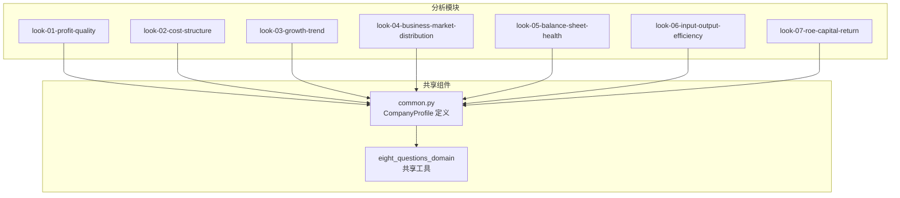
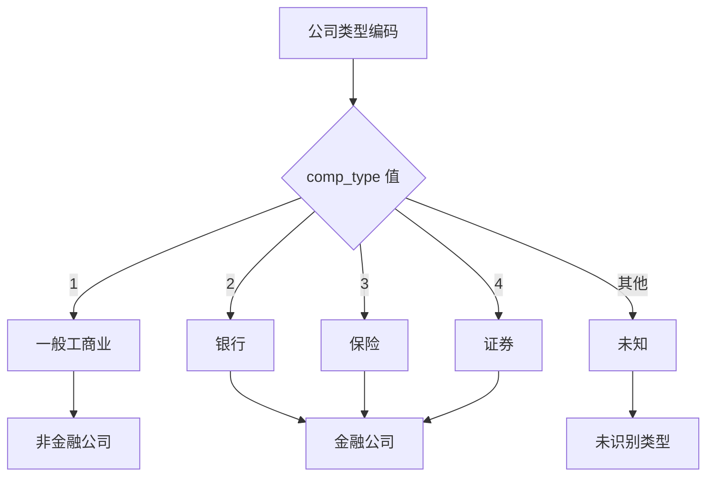
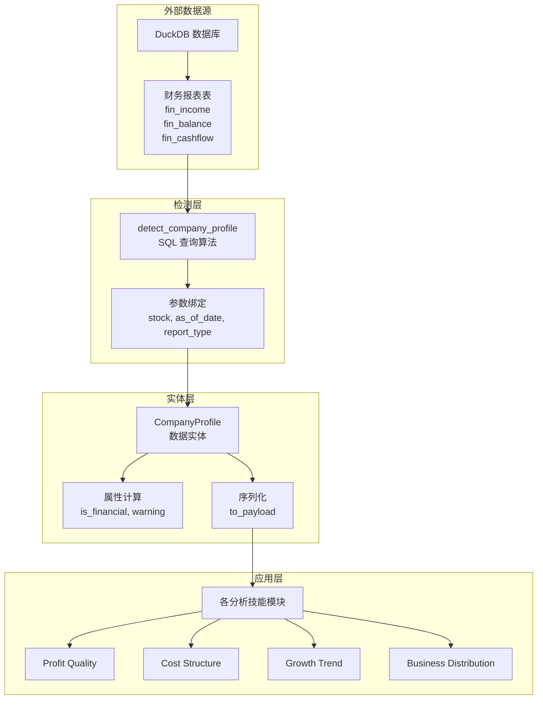
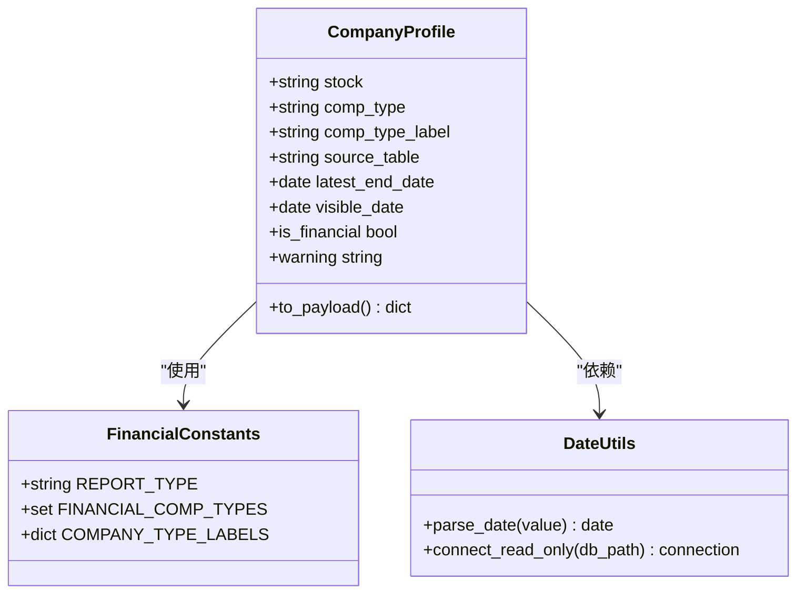
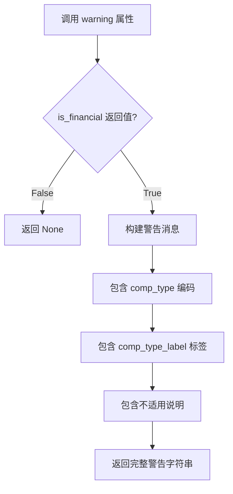
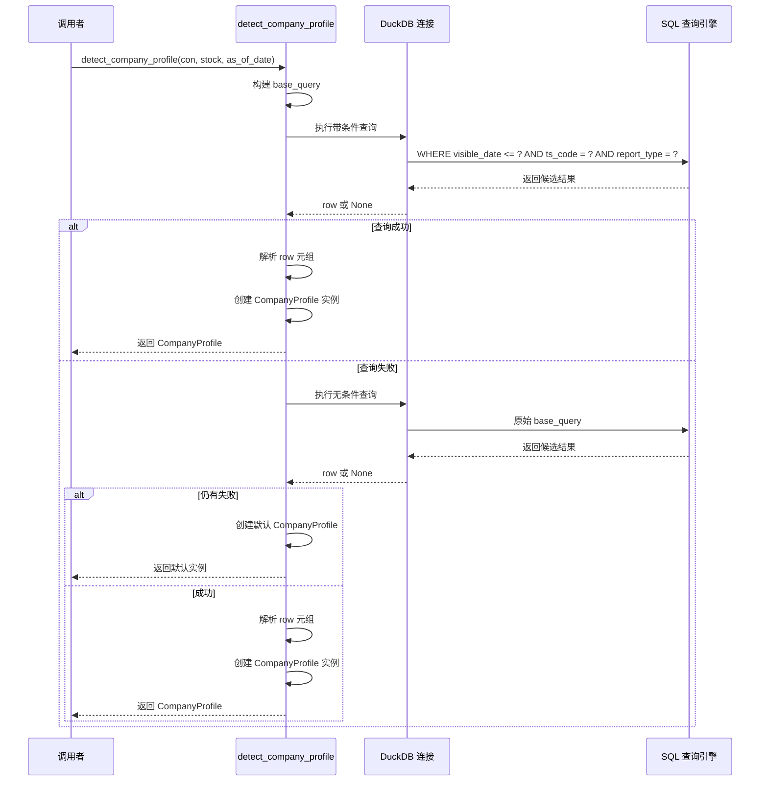
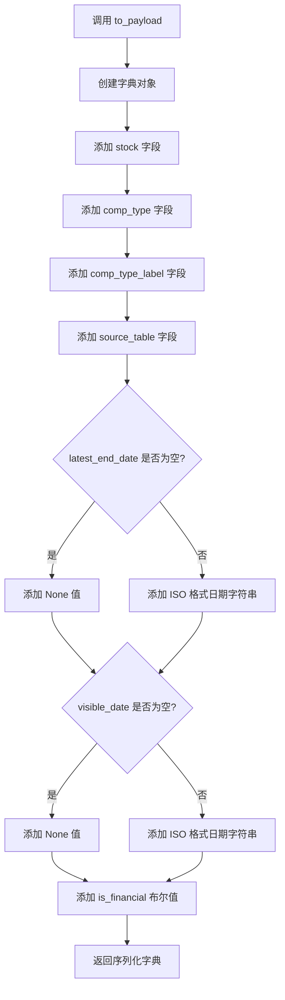
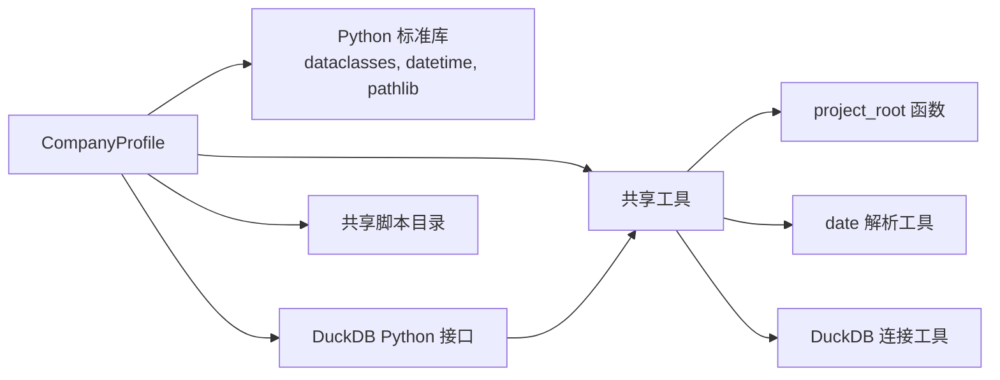

# 公司档案实体

<cite>
**本文档引用的文件**
- [common.py](file://2min-company-analysis/look-01-profit-quality/scripts/common.py)
- [look_01_profit_quality.py](file://2min-company-analysis/look-01-profit-quality/scripts/look_01_profit_quality.py)
- [look_02_cost_structure.py](file://2min-company-analysis/look-02-cost-structure/scripts/look_02_cost_structure.py)
</cite>

## 目录
1. [简介](#简介)
2. [项目结构](#项目结构)
3. [核心组件](#核心组件)
4. [架构概览](#架构概览)
5. [详细组件分析](#详细组件分析)
6. [依赖关系分析](#依赖关系分析)
7. [性能考虑](#性能考虑)
8. [故障排除指南](#故障排除指南)
9. [结论](#结论)

## 简介

CompanyProfile 是一个数据实体类，用于表示公司的基本档案信息。该实体在量化分析系统中扮演着核心角色，为各种财务分析技能提供标准化的公司信息载体。它包含了股票代码、公司类型、数据源表等关键字段，并提供了序列化方法和检测算法。

## 项目结构

CompanyProfile 实体在多个分析模块中被复用，体现了良好的代码复用设计：



**图表来源**
- [common.py:11-15](file://2min-company-analysis/look-01-profit-quality/scripts/common.py#L11-L15)

**章节来源**
- [common.py:1-153](file://2min-company-analysis/look-01-profit-quality/scripts/common.py#L1-L153)

## 核心组件

### CompanyProfile 数据实体

CompanyProfile 是一个使用 `@dataclass(frozen=True)` 装饰器定义的不可变数据类，包含以下核心字段：

#### 字段定义

| 字段名 | 数据类型 | 是否可空 | 默认值 | 业务含义 |
|--------|----------|----------|--------|----------|
| stock | str | 否 | 无 | 股票代码，如 "000001.SZ" |
| comp_type | str \| None | 是 | None | 公司类型编码 |
| comp_type_label | str | 否 | 无 | 公司类型中文标签 |
| source_table | str \| None | 是 | None | 数据源表名称 |
| latest_end_date | date \| None | 是 | None | 最新报告期末日期 |
| visible_date | date \| None | 是 | None | 报告可见日期 |

#### 公司类型映射



**图表来源**
- [common.py:18-25](file://2min-company-analysis/look-01-profit-quality/scripts/common.py#L18-L25)

**章节来源**
- [common.py:28-36](file://2min-company-analysis/look-01-profit-quality/scripts/common.py#L28-L36)

## 架构概览

CompanyProfile 在整个分析系统中的架构位置如下：



**图表来源**
- [common.py:82-153](file://2min-company-analysis/look-01-profit-quality/scripts/common.py#L82-L153)

## 详细组件分析

### CompanyProfile 类结构



**图表来源**
- [common.py:18-25](file://2min-company-analysis/look-01-profit-quality/scripts/common.py#L18-L25)
- [common.py:28-59](file://2min-company-analysis/look-01-profit-quality/scripts/common.py#L28-L59)

#### is_financial 属性判断逻辑

is_financial 属性通过简单的集合成员检查实现：

```mermaid
flowchart TD
A[接收 comp_type 值] --> B{comp_type 是否为空?}
B --> |是| C[返回 False]
B --> |否| D{comp_type 是否在 FINANCIAL_COMP_TYPES 中?}
D --> |是| E[返回 True]
D --> |否| F[返回 False]
G[FINANCIAL_COMP_TYPES = {"2", "3", "4"}] --> D
```

**图表来源**
- [common.py:18-19](file://2min-company-analysis/look-01-profit-quality/scripts/common.py#L18-L19)
- [common.py:37-39](file://2min-company-analysis/look-01-profit-quality/scripts/common.py#L37-L39)

#### warning 属性警告机制

warning 属性实现了条件警告逻辑：



**图表来源**
- [common.py:41-48](file://2min-company-analysis/look-01-profit-quality/scripts/common.py#L41-L48)

**章节来源**
- [common.py:28-59](file://2min-company-analysis/look-01-profit-quality/scripts/common.py#L28-L59)

### detect_company_profile 函数算法

detect_company_profile 函数实现了复杂的 SQL 查询算法：



**图表来源**
- [common.py:82-153](file://2min-company-analysis/look-01-profit-quality/scripts/common.py#L82-L153)

#### SQL 查询算法详解

查询算法包含三个主要步骤：

1. **候选数据收集**：从三个财务报表表中收集候选记录
2. **可见性过滤**：按可见日期进行时间过滤
3. **优先级排序**：按可见日期和报告期末日期排序

**章节来源**
- [common.py:82-153](file://2min-company-analysis/look-01-profit-quality/scripts/common.py#L82-L153)

### to_payload 序列化过程

to_payload 方法实现了标准化的数据序列化：



**图表来源**
- [common.py:50-59](file://2min-company-analysis/look-01-profit-quality/scripts/common.py#L50-L59)

**章节来源**
- [common.py:50-59](file://2min-company-analysis/look-01-profit-quality/scripts/common.py#L50-L59)

## 依赖关系分析

### 外部依赖



**图表来源**
- [common.py:1-8](file://2min-company-analysis/look-01-profit-quality/scripts/common.py#L1-L8)
- [common.py:11-15](file://2min-company-analysis/look-01-profit-quality/scripts/common.py#L11-L15)

### 内部依赖关系

```mermaid
graph TB
subgraph "常量定义"
A[REPORT_TYPE = "1"]
B[FINANCIAL_COMP_TYPES = {"2", "3", "4"}]
C[COMPANY_TYPE_LABELS 映射表]
end
subgraph "CompanyProfile 类"
D[stock 字段]
E[comp_type 字段]
F[comp_type_label 字段]
G[source_table 字段]
H[latest_end_date 字段]
I[visible_date 字段]
J[is_financial 属性]
K[warning 属性]
L[to_payload 方法]
end
subgraph "检测函数"
M[detect_company_profile 函数]
N[SQL 查询算法]
end
A --> J
B --> J
C --> F
D --> L
E --> L
F --> L
G --> L
H --> L
I --> L
J --> K
M --> N
```

**图表来源**
- [common.py:18-25](file://2min-company-analysis/look-01-profit-quality/scripts/common.py#L18-L25)
- [common.py:28-59](file://2min-company-analysis/look-01-profit-quality/scripts/common.py#L28-L59)
- [common.py:82-153](file://2min-company-analysis/look-01-profit-quality/scripts/common.py#L82-L153)

**章节来源**
- [common.py:1-153](file://2min-company-analysis/look-01-profit-quality/scripts/common.py#L1-L153)

## 性能考虑

### 查询优化策略

1. **索引利用**：SQL 查询使用了适当的 WHERE 条件来利用数据库索引
2. **UNION ALL 优化**：避免了 DISTINCT 操作的开销
3. **排序优化**：使用多列排序减少结果集大小
4. **分页策略**：LIMIT 1 确保查询效率

### 内存管理

- 使用 `@dataclass(frozen=True)` 确保数据不可变性
- 日期字段使用标准库 date 类型，内存占用最小化
- 序列化时仅传递必要字段

## 故障排除指南

### 常见问题及解决方案

#### 1. 数据库连接问题

**问题症状**：
- 连接 DuckDB 时抛出 FileNotFoundError
- 数据库文件路径错误

**解决方案**：
- 验证数据库文件存在性
- 检查文件路径权限
- 使用 default_db_path() 获取正确路径

#### 2. 公司档案检测失败

**问题症状**：
- detect_company_profile 返回默认值
- CompanyProfile 的 comp_type 为 None

**解决方案**：
- 检查股票代码格式是否正确
- 验证 as_of_date 参数的有效性
- 确认财务报表数据完整性

#### 3. 日期解析错误

**问题症状**：
- parse_date 函数抛出 ValueError
- 日期格式不匹配

**解决方案**：
- 确保输入日期字符串格式为 "YYYY-MM-DD"
- 提供 None 值时使用默认今天日期

#### 4. 金融公司警告

**问题症状**：
- warning 属性返回警告信息
- 分析结果标记为 not-applicable

**解决方案**：
- 金融类公司不适合某些分析技能
- 查看具体技能的适用范围说明

**章节来源**
- [common.py:70-79](file://2min-company-analysis/look-01-profit-quality/scripts/common.py#L70-L79)
- [look_01_profit_quality.py:510-550](file://2min-company-analysis/look-01-profit-quality/scripts/look_01_profit_quality.py#L510-L550)

## 结论

CompanyProfile 数据实体是一个设计精良的数据传输对象，具有以下特点：

1. **标准化设计**：统一的字段定义和序列化接口
2. **智能判断**：自动识别金融公司类型并提供警告机制
3. **高效查询**：优化的 SQL 检测算法确保性能
4. **易于扩展**：清晰的架构便于功能扩展
5. **强类型支持**：完整的类型注解提高代码质量

该实体为整个量化分析系统提供了稳定可靠的基础数据结构，支持多种财务分析技能的开发和维护。