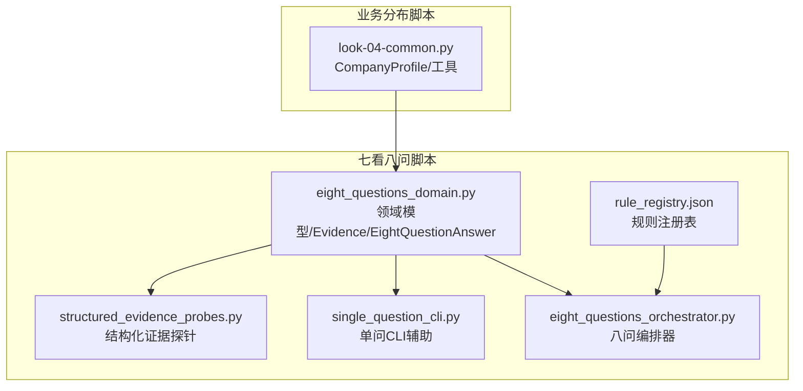
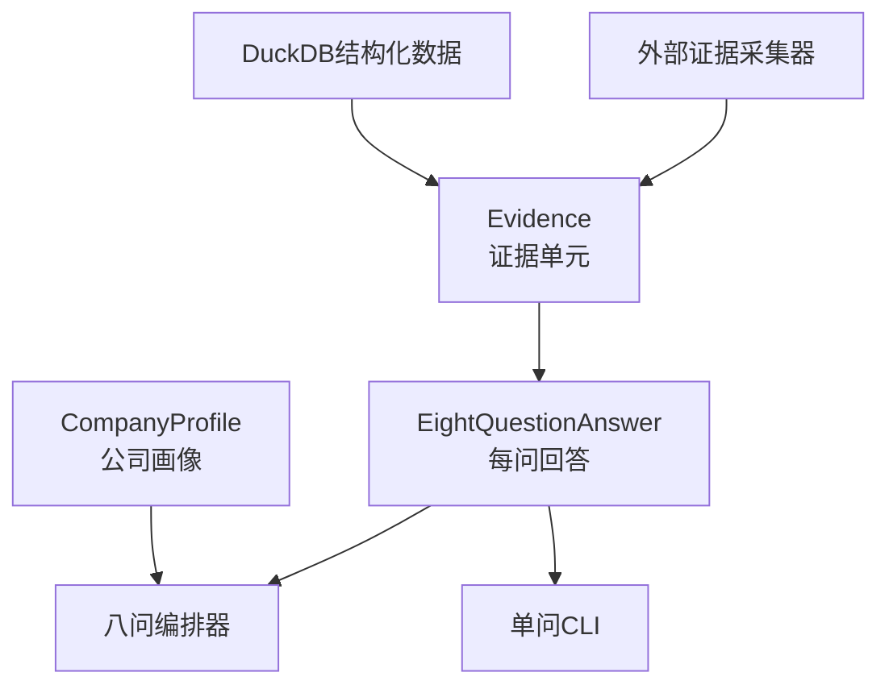
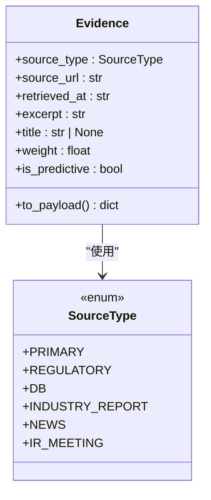
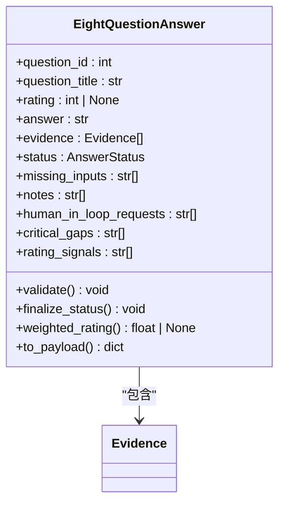
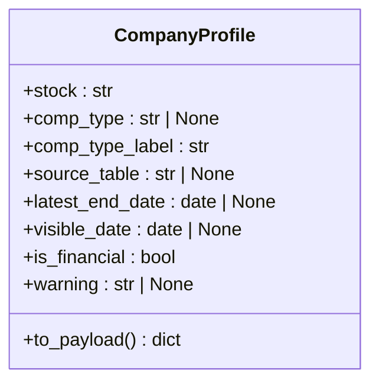
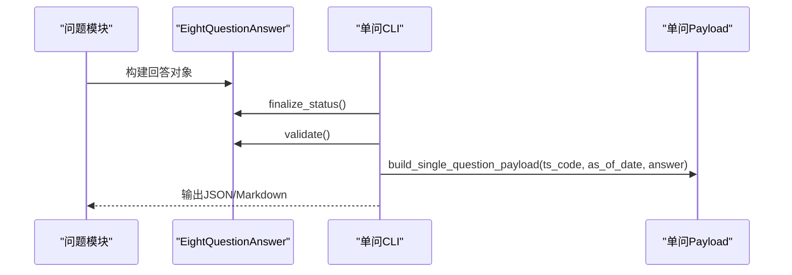
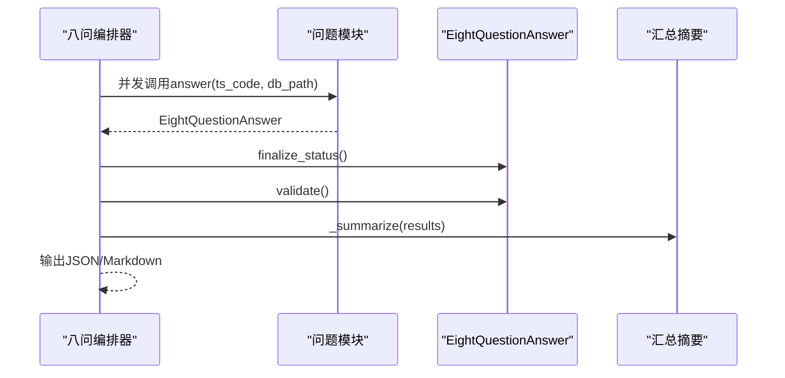
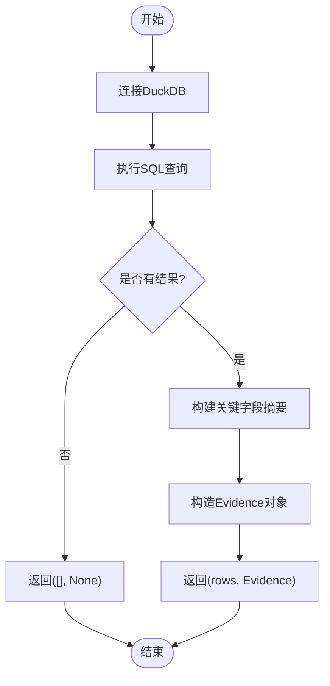
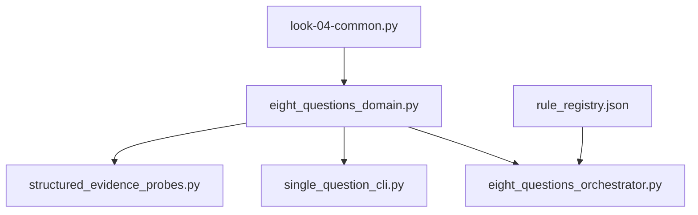

# 核心实体模型

<cite>
**本文档引用的文件**
- [eight_questions_domain.py](file://2min-company-analysis/seven-look-eight-question/scripts/eight_questions_domain.py)
- [structured_evidence_probes.py](file://2min-company-analysis/seven-look-eight-question/scripts/structured_evidence_probes.py)
- [single_question_cli.py](file://2min-company-analysis/seven-look-eight-question/scripts/single_question_cli.py)
- [eight_questions_orchestrator.py](file://2min-company-analysis/seven-look-eight-question/scripts/eight_questions_orchestrator.py)
- [common.py](file://2min-company-analysis/look-04-business-market-distribution/scripts/common.py)
- [rule_registry.json](file://2min-company-analysis/seven-look-eight-question/assets/rule_registry.json)
</cite>

## 目录
1. [简介](#简介)
2. [项目结构](#项目结构)
3. [核心组件](#核心组件)
4. [架构总览](#架构总览)
5. [详细组件分析](#详细组件分析)
6. [依赖分析](#依赖分析)
7. [性能考虑](#性能考虑)
8. [故障排除指南](#故障排除指南)
9. [结论](#结论)

## 简介
本文件聚焦于“八问”分析体系中的核心数据实体，系统梳理并解释以下关键数据类的完整定义与使用方式：
- CompanyProfile：公司画像与合规性标识
- Evidence：证据单元（强校验）
- EightQuestionAnswer：每问回答（必须带证据才可标记 ready）

文档将详细说明每个字段的数据类型、约束条件、业务含义、取值范围、字段验证规则、默认值设置、序列化方法，以及实体之间的关系与依赖。同时提供典型数据流转过程与使用场景，确保数据模型的一致性与完整性。

## 项目结构
围绕核心实体，相关代码主要分布在“七看八问”脚本目录与“业务分布”脚本目录中：
- seven-look-eight-question/scripts：包含领域模型、证据探针、单问CLI、八问编排器等
- look-04-business-market-distribution/scripts：包含CompanyProfile与通用工具
- seven-look-eight-question/assets：包含规则注册表，描述各模块的数据来源与派生指标

**图表来源**
- [eight_questions_domain.py:1-324](file://2min-company-analysis/seven-look-eight-question/scripts/eight_questions_domain.py#L1-L324)
- [structured_evidence_probes.py:1-386](file://2min-company-analysis/seven-look-eight-question/scripts/structured_evidence_probes.py#L1-L386)
- [single_question_cli.py:1-158](file://2min-company-analysis/seven-look-eight-question/scripts/single_question_cli.py#L1-L158)
- [eight_questions_orchestrator.py:1-396](file://2min-company-analysis/seven-look-eight-question/scripts/eight_questions_orchestrator.py#L1-L396)
- [common.py:1-154](file://2min-company-analysis/look-04-business-market-distribution/scripts/common.py#L1-L154)
- [rule_registry.json:1-410](file://2min-company-analysis/seven-look-eight-question/assets/rule_registry.json#L1-L410)

**章节来源**
- [eight_questions_domain.py:1-324](file://2min-company-analysis/seven-look-eight-question/scripts/eight_questions_domain.py#L1-L324)
- [structured_evidence_probes.py:1-386](file://2min-company-analysis/seven-look-eight-question/scripts/structured_evidence_probes.py#L1-L386)
- [single_question_cli.py:1-158](file://2min-company-analysis/seven-look-eight-question/scripts/single_question_cli.py#L1-L158)
- [eight_questions_orchestrator.py:1-396](file://2min-company-analysis/seven-look-eight-question/scripts/eight_questions_orchestrator.py#L1-L396)
- [common.py:1-154](file://2min-company-analysis/look-04-business-market-distribution/scripts/common.py#L1-L154)
- [rule_registry.json:1-410](file://2min-company-analysis/seven-look-eight-question/assets/rule_registry.json#L1-L410)

## 核心组件
本节对三大核心实体进行深入解析，包括字段定义、约束、默认值、序列化与典型使用场景。

### CompanyProfile 实体
- 文件位置：[common.py:28-59](file://2min-company-analysis/look-04-business-market-distribution/scripts/common.py#L28-L59)
- 作用：描述公司画像与合规性标识，用于判断是否适用于特定分析技能（如业务分布分析）。
- 字段与约束
  - stock: str
    - 类型：字符串
    - 约束：必填，股票代码
    - 默认值：无
    - 业务含义：目标公司TS代码
  - comp_type: str | None
    - 类型：字符串或空
    - 约束：可空；取值来自财务公司类型集合
    - 默认值：None
    - 业务含义：公司类型编码（1一般工商业；2银行；3保险；4证券）
  - comp_type_label: str
    - 类型：字符串
    - 约束：必填；由comp_type映射得到
    - 默认值：无
    - 业务含义：公司类型中文标签
  - source_table: str | None
    - 类型：字符串或空
    - 约束：可空；表示最近可用财报数据来源表
    - 默认值：None
    - 业务含义：用于定位最近可用的财务数据表
  - latest_end_date: date | None
    - 类型：日期或空
    - 约束：可空；最近可用财报的会计期末
    - 默认值：None
    - 业务含义：用于限定分析的时间窗口
  - visible_date: date | None
    - 类型：日期或空
    - 约束：可空；公告可见日期（以f_ann_date/ann_date/end_date为准）
    - 默认值：None
    - 业务含义：影响“以某日为截止”的数据可见性
- 计算属性
  - is_financial: bool
    - 规则：当comp_type属于金融类集合时为True
  - warning: str | None
    - 规则：当is_financial为True时返回警告提示
- 序列化方法
  - to_payload(): dict
    - 输出包含上述字段及is_financial布尔值
- 使用场景
  - 在业务分布等分析中，用于判断是否适用（金融公司不适用）并输出警告
  - 作为后续分析的上下文参数，限定数据时间边界

**章节来源**
- [common.py:28-59](file://2min-company-analysis/look-04-business-market-distribution/scripts/common.py#L28-L59)
- [common.py:82-153](file://2min-company-analysis/look-04-business-market-distribution/scripts/common.py#L82-L153)

### Evidence 实体
- 文件位置：[eight_questions_domain.py:72-111](file://2min-company-analysis/seven-look-eight-question/scripts/eight_questions_domain.py#L72-L111)
- 作用：单条证据单元，是“八问”体系中的最小证据颗粒，必须满足强校验。
- 字段与约束
  - source_type: SourceType
    - 类型：枚举
    - 约束：必填；取值包括primary、regulatory、db、industry_report、news、ir_meeting
    - 默认值：无
    - 业务含义：证据来源类型（决定权重与是否预测性）
  - source_url: str
    - 类型：字符串
    - 约束：必填；必须非空；支持http(s)、duckdb://、file://等协议
    - 默认值：无
    - 业务含义：证据来源链接或数据定位
  - retrieved_at: str
    - 类型：字符串（ISO8601）
    - 约束：必填；必须符合ISO8601格式
    - 默认值：无
    - 业务含义：证据抓取/生成时间
  - excerpt: str
    - 类型：字符串
    - 约束：必填；必须非空（去除空白后）
    - 默认值：无
    - 业务含义：原文/字段摘录（禁止空字符串）
  - title: str | None
    - 类型：字符串或空
    - 约束：可空
    - 默认值：None
    - 业务含义：证据标题
- 计算属性
  - weight: float
    - 规则：根据source_type映射权重表计算
  - is_predictive: bool
    - 规则：若source_type属于预测/口径来源集合，则为True
- 序列化方法
  - to_payload(): dict
    - 输出包含source_type、source_label、source_url、retrieved_at、excerpt、title、weight、is_predictive
- 使用场景
  - 作为EightQuestionAnswer.evidence列表的元素
  - 通过structured_evidence_probes从DuckDB构造，或通过外部采集器注入

**章节来源**
- [eight_questions_domain.py:72-111](file://2min-company-analysis/seven-look-eight-question/scripts/eight_questions_domain.py#L72-L111)
- [eight_questions_domain.py:26-56](file://2min-company-analysis/seven-look-eight-question/scripts/eight_questions_domain.py#L26-L56)
- [structured_evidence_probes.py:39-50](file://2min-company-analysis/seven-look-eight-question/scripts/structured_evidence_probes.py#L39-L50)

### EightQuestionAnswer 实体
- 文件位置：[eight_questions_domain.py:123-212](file://2min-company-analysis/seven-look-eight-question/scripts/eight_questions_domain.py#L123-L212)
- 作用：每问回答载体，承载评级、证据、状态与追踪信号。
- 字段与约束
  - question_id: int
    - 类型：整数
    - 约束：必填；范围1..8
    - 默认值：无
    - 业务含义：问题编号
  - question_title: str
    - 类型：字符串
    - 约束：必填
    - 默认值：无
    - 业务含义：问题标题
  - rating: int | None
    - 类型：整数或空
    - 约束：可空；当非空时范围1..5
    - 默认值：None
    - 业务含义：人工/规则给出的评级（1..5）
  - answer: str
    - 类型：字符串
    - 约束：可空；当status!=ready时可为空
    - 默认值：空字符串
    - 业务含义：文字回答
  - evidence: list[Evidence]
    - 类型：Evidence列表
    - 约束：可空；当status=ready时必须非空
    - 默认值：空列表
    - 业务含义：支撑评级的证据集合
  - status: AnswerStatus
    - 类型：字符串
    - 约束：取值集合{"ready","partial","insufficient-evidence","human-in-loop-required"}
    - 默认值："insufficient-evidence"
    - 业务含义：回答状态
  - missing_inputs: list[str]
    - 类型：字符串列表
    - 约束：可空；当status=ready时应为空
    - 默认值：空列表
    - 业务含义：待补输入项
  - notes: list[str]
    - 类型：字符串列表
    - 约束：可空
    - 默认值：空列表
    - 业务含义：备注信息
  - human_in_loop_requests: list[str]
    - 类型：字符串列表
    - 约束：可空；最高优先级，阻塞性
    - 默认值：空列表
    - 业务含义：需要人工介入的请求
  - critical_gaps: list[str]
    - 类型：字符串列表
    - 约束：可空；会降低置信度但不一定阻塞
    - 默认值：空列表
    - 业务含义：关键证据缺口
  - rating_signals: list[str]
    - 类型：字符串列表
    - 约束：可空；动态评级依据（审计追溯）
    - 默认值：空列表
    - 业务含义：评级决策信号
- 校验与状态管理
  - validate(): None
    - 校验status合法性、question_id范围、ready状态下rating与evidence约束、ready状态下missing_inputs与human_in_loop_requests必须为空
  - finalize_status(): None
    - 自动降级逻辑：优先级human_in_loop_requests非空→human-in-loop-required；其次ready且存在missing_inputs→partial；否则保持原状态
  - weighted_rating(): float | None
    - 计算公式：rating × 平均证据权重；无证据或rating为空则返回None
- 序列化方法
  - to_payload(): dict
    - 输出包含question_id、question_title、rating、weighted_rating、answer、status、evidence（序列化为字典列表）、evidence_count、has_predictive_sources、missing_inputs、notes、human_in_loop_requests、critical_gaps、rating_signals
- 使用场景
  - 每个问题模块返回该对象，随后被单问CLI与八问编排器消费与渲染

**章节来源**
- [eight_questions_domain.py:123-212](file://2min-company-analysis/seven-look-eight-question/scripts/eight_questions_domain.py#L123-L212)
- [eight_questions_domain.py:140-167](file://2min-company-analysis/seven-look-eight-question/scripts/eight_questions_domain.py#L140-L167)
- [eight_questions_domain.py:168-186](file://2min-company-analysis/seven-look-eight-question/scripts/eight_questions_domain.py#L168-L186)
- [eight_questions_domain.py:187-194](file://2min-company-analysis/seven-look-eight-question/scripts/eight_questions_domain.py#L187-L194)

## 架构总览
“八问”体系通过统一的领域模型与证据探针，将结构化数据库证据与外部采集证据融合，形成可追溯、可验证的分析闭环。

**图表来源**
- [eight_questions_domain.py:26-111](file://2min-company-analysis/seven-look-eight-question/scripts/eight_questions_domain.py#L26-L111)
- [eight_questions_domain.py:123-212](file://2min-company-analysis/seven-look-eight-question/scripts/eight_questions_domain.py#L123-L212)
- [structured_evidence_probes.py:28-50](file://2min-company-analysis/seven-look-eight-question/scripts/structured_evidence_probes.py#L28-L50)
- [eight_questions_orchestrator.py:119-163](file://2min-company-analysis/seven-look-eight-question/scripts/eight_questions_orchestrator.py#L119-L163)
- [single_question_cli.py:36-48](file://2min-company-analysis/seven-look-eight-question/scripts/single_question_cli.py#L36-L48)

## 详细组件分析

### Evidence 类设计与关系
- 设计要点
  - 使用dataclass(frozen=True)保证不可变性
  - __post_init__中进行强校验（source_url非空、excerpt非空、retrieved_at为ISO8601）
  - 通过SOURCE_WEIGHTS与PREDICTIVE_SOURCES提供权重与预测性标记
- 关系图

**图表来源**
- [eight_questions_domain.py:26-56](file://2min-company-analysis/seven-look-eight-question/scripts/eight_questions_domain.py#L26-L56)
- [eight_questions_domain.py:72-111](file://2min-company-analysis/seven-look-eight-question/scripts/eight_questions_domain.py#L72-L111)

**章节来源**
- [eight_questions_domain.py:26-56](file://2min-company-analysis/seven-look-eight-question/scripts/eight_questions_domain.py#L26-L56)
- [eight_questions_domain.py:72-111](file://2min-company-analysis/seven-look-eight-question/scripts/eight_questions_domain.py#L72-L111)

### EightQuestionAnswer 类设计与关系
- 设计要点
  - 使用dataclass，字段具备默认值与可空性
  - validate/finalize_status/weighted_rating提供状态与评分一致性保障
  - to_payload输出标准化报告字段
- 关系图

**图表来源**
- [eight_questions_domain.py:123-212](file://2min-company-analysis/seven-look-eight-question/scripts/eight_questions_domain.py#L123-L212)

**章节来源**
- [eight_questions_domain.py:123-212](file://2min-company-analysis/seven-look-eight-question/scripts/eight_questions_domain.py#L123-L212)

### CompanyProfile 类设计与关系
- 设计要点
  - 用于识别金融类公司并给出适用性警告
  - 提供to_payload便于序列化输出
- 关系图

**图表来源**
- [common.py:28-59](file://2min-company-analysis/look-04-business-market-distribution/scripts/common.py#L28-L59)

**章节来源**
- [common.py:28-59](file://2min-company-analysis/look-04-business-market-distribution/scripts/common.py#L28-L59)

### 数据流与典型使用场景

#### 场景一：单问执行与输出
- 流程
  - 问题模块构建EightQuestionAnswer
  - 单问CLI调用sanitize_answer进行finalize_status与validate
  - 生成单问payload并输出JSON/Markdown
- 序列图

**图表来源**
- [single_question_cli.py:25-48](file://2min-company-analysis/seven-look-eight-question/scripts/single_question_cli.py#L25-L48)
- [eight_questions_domain.py:140-167](file://2min-company-analysis/seven-look-eight-question/scripts/eight_questions_domain.py#L140-L167)

**章节来源**
- [single_question_cli.py:25-48](file://2min-company-analysis/seven-look-eight-question/scripts/single_question_cli.py#L25-L48)
- [eight_questions_domain.py:140-167](file://2min-company-analysis/seven-look-eight-question/scripts/eight_questions_domain.py#L140-L167)

#### 场景二：八问编排与汇总
- 流程
  - 编排器并发执行多个问题模块
  - 对每个答案调用finalize_status与validate
  - 汇总状态与评级，生成摘要与报告
- 序列图

**图表来源**
- [eight_questions_orchestrator.py:119-163](file://2min-company-analysis/seven-look-eight-question/scripts/eight_questions_orchestrator.py#L119-L163)
- [eight_questions_orchestrator.py:171-200](file://2min-company-analysis/seven-look-eight-question/scripts/eight_questions_orchestrator.py#L171-L200)

**章节来源**
- [eight_questions_orchestrator.py:119-163](file://2min-company-analysis/seven-look-eight-question/scripts/eight_questions_orchestrator.py#L119-L163)
- [eight_questions_orchestrator.py:171-200](file://2min-company-analysis/seven-look-eight-question/scripts/eight_questions_orchestrator.py#L171-L200)

#### 场景三：结构化证据探针
- 流程
  - 通过DuckDB连接获取原始行
  - 将关键字段摘要封装为Evidence
  - 返回(rows, Evidence)供上层评级逻辑使用
- 流程图

**图表来源**
- [structured_evidence_probes.py:28-50](file://2min-company-analysis/seven-look-eight-question/scripts/structured_evidence_probes.py#L28-L50)
- [structured_evidence_probes.py:58-80](file://2min-company-analysis/seven-look-eight-question/scripts/structured_evidence_probes.py#L58-L80)

**章节来源**
- [structured_evidence_probes.py:28-50](file://2min-company-analysis/seven-look-eight-question/scripts/structured_evidence_probes.py#L28-L50)
- [structured_evidence_probes.py:58-80](file://2min-company-analysis/seven-look-eight-question/scripts/structured_evidence_probes.py#L58-L80)

## 依赖分析
- 模块耦合
  - eight_questions_domain.py是核心，被single_question_cli.py与eight_questions_orchestrator.py广泛依赖
  - structured_evidence_probes.py依赖eight_questions_domain.py中的Evidence与Source类型
  - look-04-business-market-distribution/scripts/common.py提供CompanyProfile，被其自身脚本使用
- 外部依赖
  - DuckDB：用于结构化证据探针与公司画像检测
  - 规则注册表：指导问题模块加载与执行

**图表来源**
- [eight_questions_domain.py:1-324](file://2min-company-analysis/seven-look-eight-question/scripts/eight_questions_domain.py#L1-L324)
- [structured_evidence_probes.py:1-386](file://2min-company-analysis/seven-look-eight-question/scripts/structured_evidence_probes.py#L1-L386)
- [single_question_cli.py:1-158](file://2min-company-analysis/seven-look-eight-question/scripts/single_question_cli.py#L1-L158)
- [eight_questions_orchestrator.py:1-396](file://2min-company-analysis/seven-look-eight-question/scripts/eight_questions_orchestrator.py#L1-L396)
- [common.py:1-154](file://2min-company-analysis/look-04-business-market-distribution/scripts/common.py#L1-L154)
- [rule_registry.json:1-410](file://2min-company-analysis/seven-look-eight-question/assets/rule_registry.json#L1-L410)

**章节来源**
- [eight_questions_domain.py:1-324](file://2min-company-analysis/seven-look-eight-question/scripts/eight_questions_domain.py#L1-L324)
- [structured_evidence_probes.py:1-386](file://2min-company-analysis/seven-look-eight-question/scripts/structured_evidence_probes.py#L1-L386)
- [single_question_cli.py:1-158](file://2min-company-analysis/seven-look-eight-question/scripts/single_question_cli.py#L1-L158)
- [eight_questions_orchestrator.py:1-396](file://2min-company-analysis/seven-look-eight-question/scripts/eight_questions_orchestrator.py#L1-L396)
- [common.py:1-154](file://2min-company-analysis/look-04-business-market-distribution/scripts/common.py#L1-L154)
- [rule_registry.json:1-410](file://2min-company-analysis/seven-look-eight-question/assets/rule_registry.json#L1-L410)

## 性能考虑
- DuckDB连接与查询
  - 探针函数在每次调用时建立连接，建议在上层批量调用时复用连接或控制并发度，避免频繁打开/关闭连接
- 并发执行
  - 八问编排器使用ThreadPoolExecutor并发执行问题模块，合理设置max_workers以平衡吞吐与资源占用
- 序列化与I/O
  - to_payload输出为字典，注意避免重复序列化；输出文件时建议使用UTF-8编码与合适的缩进

## 故障排除指南
- 常见错误与处理
  - Evidence校验失败：检查source_url非空、excerpt非空、retrieved_at为ISO8601格式
  - EightQuestionAnswer.validate失败：检查status取值、question_id范围、ready状态下rating与evidence约束、missing_inputs与human_in_loop_requests是否为空
  - DuckDB文件不存在：确认db_path存在且可读
  - 规则注册表缺失：确认rule_registry.json存在且包含目标问题模块的脚本路径
- 建议
  - 在问题模块中捕获异常并设置status为“insufficient-evidence”，同时记录notes
  - 使用finalize_status与validate确保状态一致性

**章节来源**
- [eight_questions_domain.py:82-90](file://2min-company-analysis/seven-look-eight-question/scripts/eight_questions_domain.py#L82-L90)
- [eight_questions_domain.py:140-167](file://2min-company-analysis/seven-look-eight-question/scripts/eight_questions_domain.py#L140-L167)
- [eight_questions_orchestrator.py:132-151](file://2min-company-analysis/seven-look-eight-question/scripts/eight_questions_orchestrator.py#L132-L151)
- [single_question_cli.py:25-33](file://2min-company-analysis/seven-look-eight-question/scripts/single_question_cli.py#L25-L33)

## 结论
本文档系统梳理了“八问”分析体系中的核心数据实体：CompanyProfile、Evidence、EightQuestionAnswer。通过对字段定义、约束条件、默认值、序列化方法与典型使用场景的详细说明，明确了它们在数据模型中的职责与交互关系。结合规则注册表与证据探针，形成了从结构化数据库到外部证据的统一证据采集与评级闭环，确保分析结果的可追溯性与一致性。