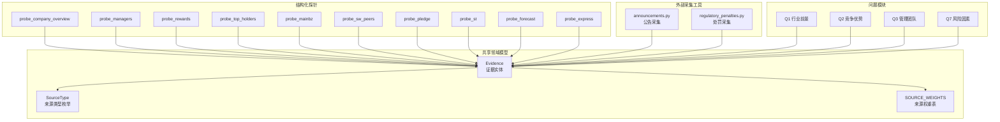
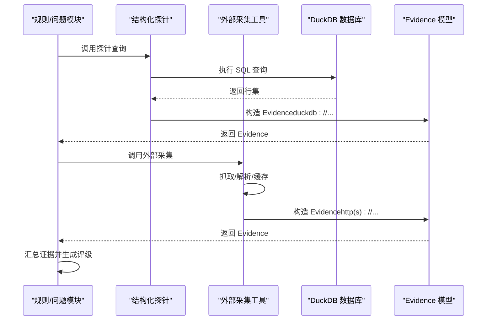
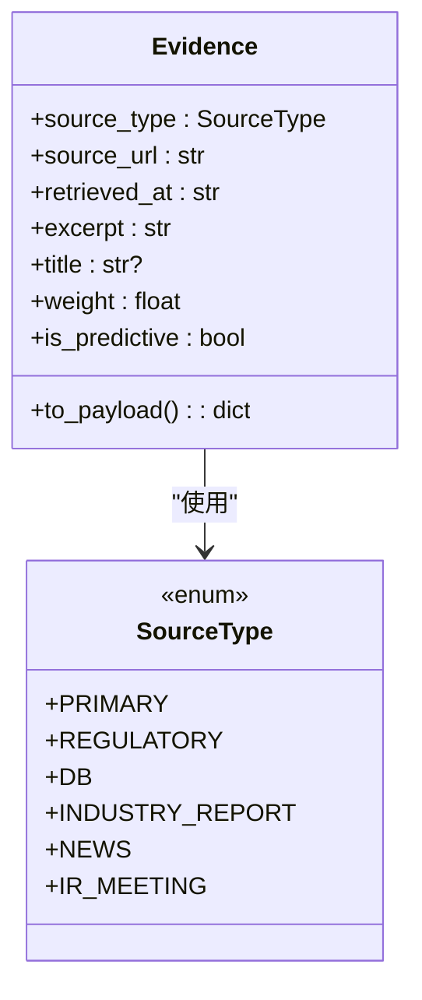
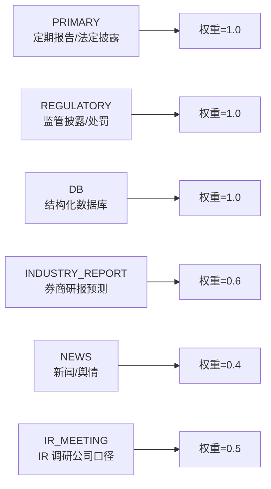
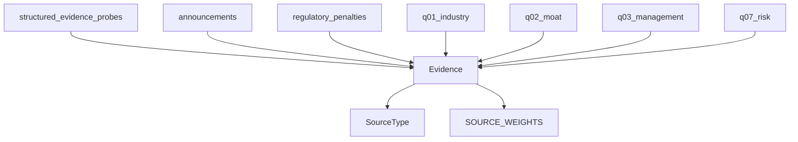

# 证据实体

<cite>
**本文引用的文件**
- [eight_questions_domain.py](file://2min-company-analysis/seven-look-eight-question/scripts/eight_questions_domain.py)
- [structured_evidence_probes.py](file://2min-company-analysis/seven-look-eight-question/scripts/structured_evidence_probes.py)
- [q01_industry.py](file://2min-company-analysis/ask-q1-industry-prospect/scripts/q01_industry.py)
- [q02_moat.py](file://2min-company-analysis/ask-q2-moat/scripts/q02_moat.py)
- [q03_management.py](file://2min-company-analysis/ask-q3-management/scripts/q03_management.py)
- [q07_risk.py](file://2min-company-analysis/ask-q7-risk-factors/scripts/q07_risk.py)
- [announcements.py](file://nano-search-mcp/src/nano_search_mcp/tools/announcements.py)
- [regulatory_penalties.py](file://nano-search-mcp/src/nano_search_mcp/tools/regulatory_penalties.py)
- [rule_registry.json](file://2min-company-analysis/seven-look-eight-question/assets/rule_registry.json)
</cite>

## 目录
1. [简介](#简介)
2. [项目结构](#项目结构)
3. [核心组件](#核心组件)
4. [架构总览](#架构总览)
5. [详细组件分析](#详细组件分析)
6. [依赖分析](#依赖分析)
7. [性能考量](#性能考量)
8. [故障排查指南](#故障排查指南)
9. [结论](#结论)
10. [附录](#附录)

## 简介
本文件系统化阐述“证据实体”的设计与使用，聚焦于证据数据的核心字段定义与业务语义：source_type（来源类型）、url（链接地址）、excerpt（内容摘录）、timestamp（时间戳）。文档还覆盖证据在公司分析中的作用、证据收集流程、验证机制、去重逻辑与质量控制标准，并给出证据类型分类、来源可信度评估与证据权重计算方法，以及最佳实践与常见陷阱。

## 项目结构
证据实体贯穿“七看八问”能力体系，统一在共享领域模型中定义，各问题模块通过结构化探针与外部采集工具汇聚证据，最终形成可复核的报告。

图表来源
- [eight_questions_domain.py:72-110](file://2min-company-analysis/seven-look-eight-question/scripts/eight_questions_domain.py#L72-L110)
- [structured_evidence_probes.py:39-50](file://2min-company-analysis/seven-look-eight-question/scripts/structured_evidence_probes.py#L39-L50)
- [announcements.py:404-446](file://nano-search-mcp/src/nano_search_mcp/tools/announcements.py#L404-L446)
- [regulatory_penalties.py:393-446](file://nano-search-mcp/src/nano_search_mcp/tools/regulatory_penalties.py#L393-L446)
- [q01_industry.py:52-147](file://2min-company-analysis/ask-q1-industry-prospect/scripts/q01_industry.py#L52-L147)
- [q02_moat.py:46-120](file://2min-company-analysis/ask-q2-moat/scripts/q02_moat.py#L46-L120)
- [q03_management.py:38-94](file://2min-company-analysis/ask-q3-management/scripts/q03_management.py#L38-L94)
- [q07_risk.py:44-129](file://2min-company-analysis/ask-q7-risk-factors/scripts/q07_risk.py#L44-L129)

章节来源
- [eight_questions_domain.py:1-324](file://2min-company-analysis/seven-look-eight-question/scripts/eight_questions_domain.py#L1-L324)
- [structured_evidence_probes.py:1-386](file://2min-company-analysis/seven-look-eight-question/scripts/structured_evidence_probes.py#L1-L386)
- [q01_industry.py:1-157](file://2min-company-analysis/ask-q1-industry-prospect/scripts/q01_industry.py#L1-L157)
- [q02_moat.py:1-129](file://2min-company-analysis/ask-q2-moat/scripts/q02_moat.py#L1-L129)
- [q03_management.py:1-94](file://2min-company-analysis/ask-q3-management/scripts/q03_management.py#L1-L94)
- [q07_risk.py:1-137](file://2min-company-analysis/ask-q7-risk-factors/scripts/q07_risk.py#L1-L137)
- [announcements.py:1-535](file://nano-search-mcp/src/nano_search_mcp/tools/announcements.py#L1-L535)
- [regulatory_penalties.py:1-447](file://nano-search-mcp/src/nano_search_mcp/tools/regulatory_penalties.py#L1-L447)
- [rule_registry.json:1-410](file://2min-company-analysis/seven-look-eight-question/assets/rule_registry.json#L1-L410)

## 核心组件
证据实体在共享领域模型中统一定义，具备严格的字段约束与序列化输出能力，确保“禁止空引证”的原则落地。

- 字段定义与约束
  - source_type：来源类型枚举，限定来源类别与可信度等级
  - source_url：证据来源链接，支持 http(s)、duckdb://、file:// 等
  - retrieved_at：证据抓取/生成的时间戳，采用 ISO8601 格式
  - excerpt：原文/字段摘录，禁止为空
  - title：证据标题，可选
  - 权重 weight：基于来源类型的静态权重
  - 预测标记 is_predictive：标识是否为预测/口径来源

- 关键行为
  - 强校验：禁止空 url、空 excerpt、非法 ISO8601 时间戳
  - 序列化：to_payload 输出包含来源标签、权重、预测标记等字段
  - 来源标签与权重：统一映射与权重表，便于跨模块一致性展示与评分

章节来源
- [eight_questions_domain.py:72-110](file://2min-company-analysis/seven-look-eight-question/scripts/eight_questions_domain.py#L72-L110)
- [eight_questions_domain.py:26-56](file://2min-company-analysis/seven-look-eight-question/scripts/eight_questions_domain.py#L26-L56)

## 架构总览
证据实体贯穿“七看八问”的结构化规则与定性问题模块，通过结构化探针与外部采集工具统一产出 Evidence，再由问题模块进行证据拼装与评级。

图表来源
- [structured_evidence_probes.py:39-50](file://2min-company-analysis/seven-look-eight-question/scripts/structured_evidence_probes.py#L39-L50)
- [announcements.py:312-376](file://nano-search-mcp/src/nano_search_mcp/tools/announcements.py#L312-L376)
- [regulatory_penalties.py:295-366](file://nano-search-mcp/src/nano_search_mcp/tools/regulatory_penalties.py#L295-L366)
- [eight_questions_domain.py:72-110](file://2min-company-analysis/seven-look-eight-question/scripts/eight_questions_domain.py#L72-L110)

## 详细组件分析

### 证据实体类图
Evidence 类型在共享领域模型中定义，具备强校验与序列化能力，统一服务于各问题模块。

图表来源
- [eight_questions_domain.py:72-110](file://2min-company-analysis/seven-look-eight-question/scripts/eight_questions_domain.py#L72-L110)
- [eight_questions_domain.py:26-56](file://2min-company-analysis/seven-look-eight-question/scripts/eight_questions_domain.py#L26-L56)

章节来源
- [eight_questions_domain.py:72-110](file://2min-company-analysis/seven-look-eight-question/scripts/eight_questions_domain.py#L72-L110)

### 字段定义与业务语义

- source_type（来源类型）
  - 数据类型：枚举（SourceType）
  - 业务含义：证据来源类别，决定可信度与用途
  - 存储格式：字符串值（枚举的 value）
  - 来源标签：统一映射为中文标签，便于报告展示
  - 权重：不同来源赋予不同权重，用于加权评级

- url（链接地址）
  - 数据类型：字符串
  - 业务含义：证据来源链接，支持多种协议
  - 存储格式：URL 字符串
  - 示例：http(s)://...、duckdb://table?q=...、file://path

- excerpt（内容摘录）
  - 数据类型：字符串
  - 业务含义：证据的原文片段或关键字段摘要
  - 存储格式：文本字符串，禁止为空
  - 截断策略：结构化探针对摘录长度进行截断，保证可读性与一致性

- timestamp（时间戳）
  - 数据类型：字符串
  - 业务含义：证据抓取/生成的时间戳
  - 存储格式：ISO8601（YYYY-MM-DD 或 YYYY-MM-DDTHH:MM:SS）
  - 校验：强校验，非法格式将触发异常

章节来源
- [eight_questions_domain.py:76-90](file://2min-company-analysis/seven-look-eight-question/scripts/eight_questions_domain.py#L76-L90)
- [eight_questions_domain.py:100-110](file://2min-company-analysis/seven-look-eight-question/scripts/eight_questions_domain.py#L100-L110)
- [structured_evidence_probes.py:39-50](file://2min-company-analysis/seven-look-eight-question/scripts/structured_evidence_probes.py#L39-L50)

### 证据类型分类与来源可信度评估
证据来源类型与权重如下所示：

图表来源
- [eight_questions_domain.py:35-42](file://2min-company-analysis/seven-look-eight-question/scripts/eight_questions_domain.py#L35-L42)

章节来源
- [eight_questions_domain.py:26-56](file://2min-company-analysis/seven-look-eight-question/scripts/eight_questions_domain.py#L26-L56)
- [eight_questions_domain.py:35-42](file://2min-company-analysis/seven-look-eight-question/scripts/eight_questions_domain.py#L35-L42)

### 证据权重计算方法
- 来源权重：来自权重表，直接映射到 Evidence.weight
- 加权评级：问题模块可使用 Evidence.weight 对评级进行加权，提升或降低置信度
- 平均权重：EightQuestionAnswer 提供按证据数量计算的平均权重，用于整体置信度评估

章节来源
- [eight_questions_domain.py:92-94](file://2min-company-analysis/seven-look-eight-question/scripts/eight_questions_domain.py#L92-L94)
- [eight_questions_domain.py:187-194](file://2min-company-analysis/seven-look-eight-question/scripts/eight_questions_domain.py#L187-L194)

### 证据收集流程
证据收集分为两类：结构化探针与外部采集工具。

- 结构化探针（DuckDB）
  - 通过 SQL 查询返回行集与 Evidence
  - source_url 采用 duckdb://table?q=... 形式
  - 摘录 excerpt 为关键字段摘要，长度截断
  - 适用于事实类证据（如公司概况、高管、股东、主营构成、同行池、质押、ST、业绩预告/快报等）

- 外部采集工具
  - 公告采集：抓取新浪财经临时公告列表与正文，支持按日期过滤与缓存
  - 处罚采集：抓取监管处罚记录，支持按日期过滤与缓存
  - 适用于事实类证据（监管披露、处罚、公告等）

- 问题模块集成
  - 各问题模块在运行时调用探针与外部采集工具，汇总 Evidence
  - 通过 finalize_status 自动降级策略，确保“禁止编造、必标来源”的原则

章节来源
- [structured_evidence_probes.py:39-50](file://2min-company-analysis/seven-look-eight-question/scripts/structured_evidence_probes.py#L39-L50)
- [announcements.py:312-376](file://nano-search-mcp/src/nano_search_mcp/tools/announcements.py#L312-L376)
- [regulatory_penalties.py:295-366](file://nano-search-mcp/src/nano_search_mcp/tools/regulatory_penalties.py#L295-L366)
- [q01_industry.py:52-147](file://2min-company-analysis/ask-q1-industry-prospect/scripts/q01_industry.py#L52-L147)
- [q02_moat.py:46-120](file://2min-company-analysis/ask-q2-moat/scripts/q02_moat.py#L46-L120)
- [q03_management.py:38-94](file://2min-company-analysis/ask-q3-management/scripts/q03_management.py#L38-L94)
- [q07_risk.py:44-129](file://2min-company-analysis/ask-q7-risk-factors/scripts/q07_risk.py#L44-L129)

### 验证机制与质量控制
- 强校验
  - source_url 非空
  - excerpt 非空且非空白
  - retrieved_at 符合 ISO8601 格式
- 状态校验
  - EightQuestionAnswer.validate：状态合法性、评级范围、ready 条件等
  - finalize_status：自动降级策略，优先级为“人工介入 > 部分证据缺失 > 保持原状”
- 文本规范化
  - sanitize_excerpt：对摘录进行换行与特殊字符替换，保证表格渲染一致性
- 外部采集质量
  - 缓存与退避重试：减少重复抓取与网络波动影响
  - SSRF 防护：严格校验域名与参数，防止注入攻击
  - 日期过滤：支持按起止日期过滤，避免无关噪声

章节来源
- [eight_questions_domain.py:82-90](file://2min-company-analysis/seven-look-eight-question/scripts/eight_questions_domain.py#L82-L90)
- [eight_questions_domain.py:140-166](file://2min-company-analysis/seven-look-eight-question/scripts/eight_questions_domain.py#L140-L166)
- [eight_questions_domain.py:168-186](file://2min-company-analysis/seven-look-eight-question/scripts/eight_questions_domain.py#L168-L186)
- [eight_questions_domain.py:59-61](file://2min-company-analysis/seven-look-eight-question/scripts/eight_questions_domain.py#L59-L61)
- [announcements.py:146-178](file://nano-search-mcp/src/nano_search_mcp/tools/announcements.py#L146-L178)
- [announcements.py:99-118](file://nano-search-mcp/src/nano_search_mcp/tools/announcements.py#L99-L118)
- [regulatory_penalties.py:98-132](file://nano-search-mcp/src/nano_search_mcp/tools/regulatory_penalties.py#L98-L132)

### 去重逻辑
- 列表页去重：在解析公告列表时使用集合记录已见过的 source_url，避免重复
- 缓存命中：列表页与详情页分别设置 TTL，命中缓存可避免重复抓取
- 日期过滤：按起止日期过滤，减少无效重复

章节来源
- [announcements.py:355-376](file://nano-search-mcp/src/nano_search_mcp/tools/announcements.py#L355-L376)
- [announcements.py:389-397](file://nano-search-mcp/src/nano_search_mcp/tools/announcements.py#L389-L397)
- [regulatory_penalties.py:334-366](file://nano-search-mcp/src/nano_search_mcp/tools/regulatory_penalties.py#L334-L366)

### 证据在公司分析中的作用
- 事实类证据（PRIMARY/REGULATORY/DB）：用于规则评分与基础判断
- 观点类证据（INDUSTRY_REPORT/IR_MEETING/NEWS）：用于辅助判断与景气度参考
- 证据权重：用于加权评级，提升或降低置信度
- 证据标签：统一中文标签，便于报告展示与溯源

章节来源
- [eight_questions_domain.py:26-56](file://2min-company-analysis/seven-look-eight-question/scripts/eight_questions_domain.py#L26-L56)
- [eight_questions_domain.py:92-94](file://2min-company-analysis/seven-look-eight-question/scripts/eight_questions_domain.py#L92-L94)

### 证据收集最佳实践
- 优先使用结构化探针（DB）获取事实类证据，确保权威性与一致性
- 外部采集工具需设置合理的日期范围，避免噪声
- 对研报与新闻等观点类证据，应标注来源并进行关键词情绪分析
- 使用 finalize_status 自动降级策略，确保“禁止编造、必标来源”的原则
- 对缺失证据与人工介入请求，及时记录并反馈

章节来源
- [q01_industry.py:107-147](file://2min-company-analysis/ask-q1-industry-prospect/scripts/q01_industry.py#L107-L147)
- [q02_moat.py:83-120](file://2min-company-analysis/ask-q2-moat/scripts/q02_moat.py#L83-L120)
- [q03_management.py:76-94](file://2min-company-analysis/ask-q3-management/scripts/q03_management.py#L76-L94)
- [q07_risk.py:66-129](file://2min-company-analysis/ask-q7-risk-factors/scripts/q07_risk.py#L66-L129)
- [eight_questions_domain.py:168-186](file://2min-company-analysis/seven-look-eight-question/scripts/eight_questions_domain.py#L168-L186)

### 常见陷阱与规避
- 陷阱：仅依赖预测/口径来源（研报/IR）进行评级
  - 规避：要求至少一条事实类证据（PRIMARY/REGULATORY/DB）方可 ready
- 陷阱：证据为空或摘录为空
  - 规避：强校验禁止空证据，必要时降级为 partial 或 insufficient-evidence
- 陷阱：时间戳格式错误
  - 规避：统一 ISO8601 格式，强校验失败将抛出异常
- 陷阱：外部采集失败导致证据缺失
  - 规避：记录 missing_inputs 与 human_in_loop_requests，自动降级并提示人工介入

章节来源
- [eight_questions_domain.py:82-90](file://2min-company-analysis/seven-look-eight-question/scripts/eight_questions_domain.py#L82-L90)
- [eight_questions_domain.py:168-186](file://2min-company-analysis/seven-look-eight-question/scripts/eight_questions_domain.py#L168-L186)
- [q01_industry.py:107-147](file://2min-company-analysis/ask-q1-industry-prospect/scripts/q01_industry.py#L107-L147)
- [q02_moat.py:83-120](file://2min-company-analysis/ask-q2-moat/scripts/q02_moat.py#L83-L120)

## 依赖分析
证据实体在多个模块中被广泛使用，依赖关系如下：

图表来源
- [eight_questions_domain.py:19-22](file://2min-company-analysis/seven-look-eight-question/scripts/eight_questions_domain.py#L19-L22)
- [structured_evidence_probes.py:19-22](file://2min-company-analysis/seven-look-eight-question/scripts/structured_evidence_probes.py#L19-L22)
- [announcements.py:1-10](file://nano-search-mcp/src/nano_search_mcp/tools/announcements.py#L1-L10)
- [regulatory_penalties.py:1-10](file://nano-search-mcp/src/nano_search_mcp/tools/regulatory_penalties.py#L1-L10)
- [q01_industry.py:22-30](file://2min-company-analysis/ask-q1-industry-prospect/scripts/q01_industry.py#L22-L30)
- [q02_moat.py:22-26](file://2min-company-analysis/ask-q2-moat/scripts/q02_moat.py#L22-L26)
- [q03_management.py:22-31](file://2min-company-analysis/ask-q3-management/scripts/q03_management.py#L22-L31)
- [q07_risk.py:30-31](file://2min-company-analysis/ask-q7-risk-factors/scripts/q07_risk.py#L30-L31)

章节来源
- [eight_questions_domain.py:19-22](file://2min-company-analysis/seven-look-eight-question/scripts/eight_questions_domain.py#L19-L22)
- [structured_evidence_probes.py:19-22](file://2min-company-analysis/seven-look-eight-question/scripts/structured_evidence_probes.py#L19-L22)
- [announcements.py:1-10](file://nano-search-mcp/src/nano_search_mcp/tools/announcements.py#L1-L10)
- [regulatory_penalties.py:1-10](file://nano-search-mcp/src/nano_search_mcp/tools/regulatory_penalties.py#L1-L10)
- [q01_industry.py:22-30](file://2min-company-analysis/ask-q1-industry-prospect/scripts/q01_industry.py#L22-L30)
- [q02_moat.py:22-26](file://2min-company-analysis/ask-q2-moat/scripts/q02_moat.py#L22-L26)
- [q03_management.py:22-31](file://2min-company-analysis/ask-q3-management/scripts/q03_management.py#L22-L31)
- [q07_risk.py:30-31](file://2min-company-analysis/ask-q7-risk-factors/scripts/q07_risk.py#L30-L31)

## 性能考量
- 缓存策略：外部采集工具对列表页与详情页分别设置 TTL，减少重复抓取
- 退避重试：网络异常时采用指数退避，提高成功率
- 请求节流：相邻请求间设置最小间隔，避免触发目标站点限流
- 数据截断：结构化探针对摘录长度进行截断，降低存储与传输压力

章节来源
- [announcements.py:74-77](file://nano-search-mcp/src/nano_search_mcp/tools/announcements.py#L74-L77)
- [announcements.py:146-178](file://nano-search-mcp/src/nano_search_mcp/tools/announcements.py#L146-L178)
- [announcements.py:389-397](file://nano-search-mcp/src/nano_search_mcp/tools/announcements.py#L389-L397)
- [regulatory_penalties.py:56-58](file://nano-search-mcp/src/nano_search_mcp/tools/regulatory_penalties.py#L56-L58)
- [regulatory_penalties.py:334-366](file://nano-search-mcp/src/nano_search_mcp/tools/regulatory_penalties.py#L334-L366)
- [structured_evidence_probes.py:48-49](file://2min-company-analysis/seven-look-eight-question/scripts/structured_evidence_probes.py#L48-L49)

## 故障排查指南
- 证据为空或校验失败
  - 检查 source_url 是否为空、excerpt 是否为空、retrieved_at 是否符合 ISO8601
  - 若为外部采集失败，查看返回字典中的 error 字段
- 外部采集网络错误
  - 查看日志中的网络错误信息，确认退避与重试是否生效
  - 检查域名白名单与参数校验是否通过
- 人工介入与证据缺失
  - 检查 missing_inputs 与 human_in_loop_requests，确认是否触发自动降级
  - 根据提示补充证据或安排人工复核

章节来源
- [eight_questions_domain.py:82-90](file://2min-company-analysis/seven-look-eight-question/scripts/eight_questions_domain.py#L82-L90)
- [announcements.py:453-470](file://nano-search-mcp/src/nano_search_mcp/tools/announcements.py#L453-L470)
- [announcements.py:510-527](file://nano-search-mcp/src/nano_search_mcp/tools/announcements.py#L510-L527)
- [regulatory_penalties.py:434-446](file://nano-search-mcp/src/nano_search_mcp/tools/regulatory_penalties.py#L434-L446)

## 结论
证据实体通过统一的字段定义、来源类型与权重、强校验与序列化机制，确保了“禁止空引证、必标来源”的原则在“七看八问”体系中的落地。结合结构化探针与外部采集工具，证据收集流程实现了自动化、可复核与可追溯。通过权重计算与自动降级策略，证据在公司分析中发挥着事实与观点互补的作用，提升了评级的准确性与置信度。

## 附录
- 证据类型与权重对照表
  - PRIMARY/REGULATORY/DB：1.0
  - INDUSTRY_REPORT：0.6
  - IR_MEETING：0.5
  - NEWS：0.4

章节来源
- [eight_questions_domain.py:35-42](file://2min-company-analysis/seven-look-eight-question/scripts/eight_questions_domain.py#L35-L42)