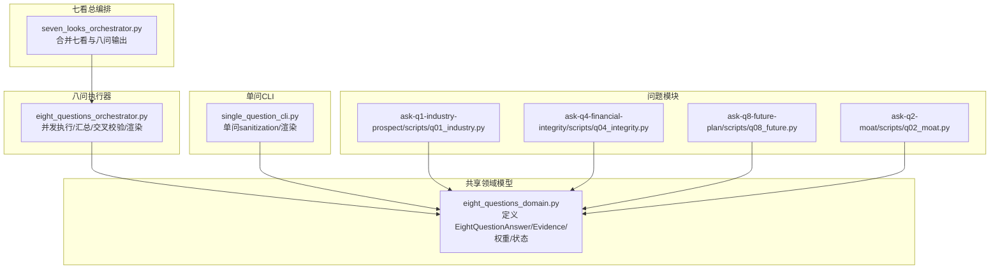
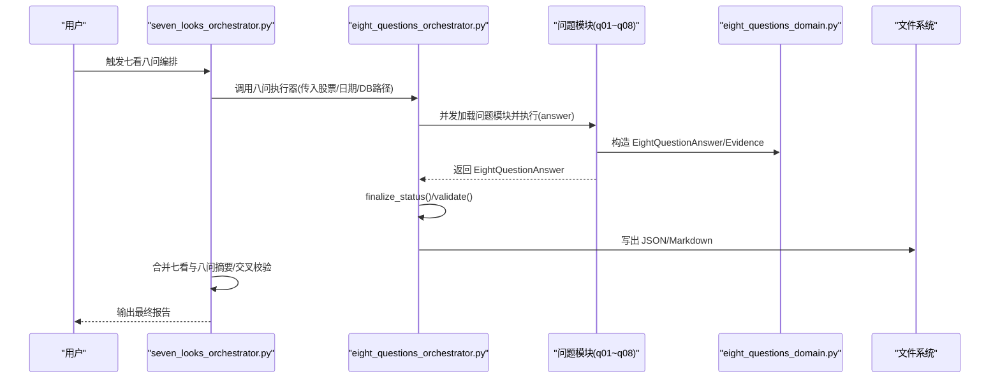
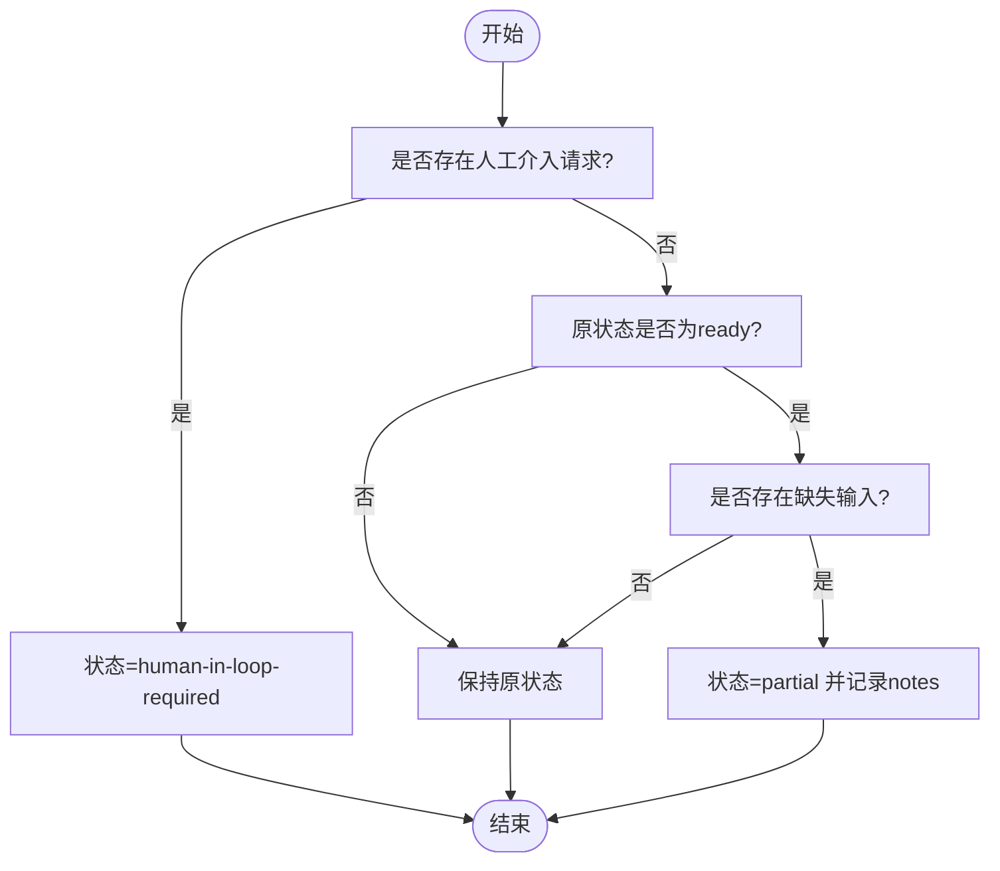
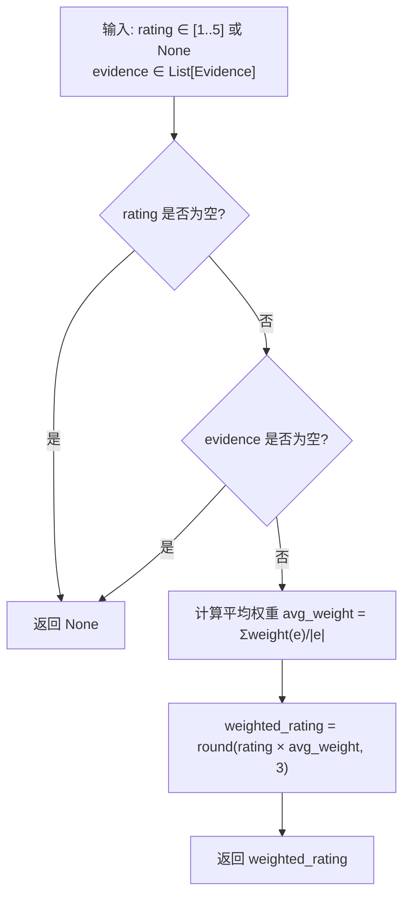
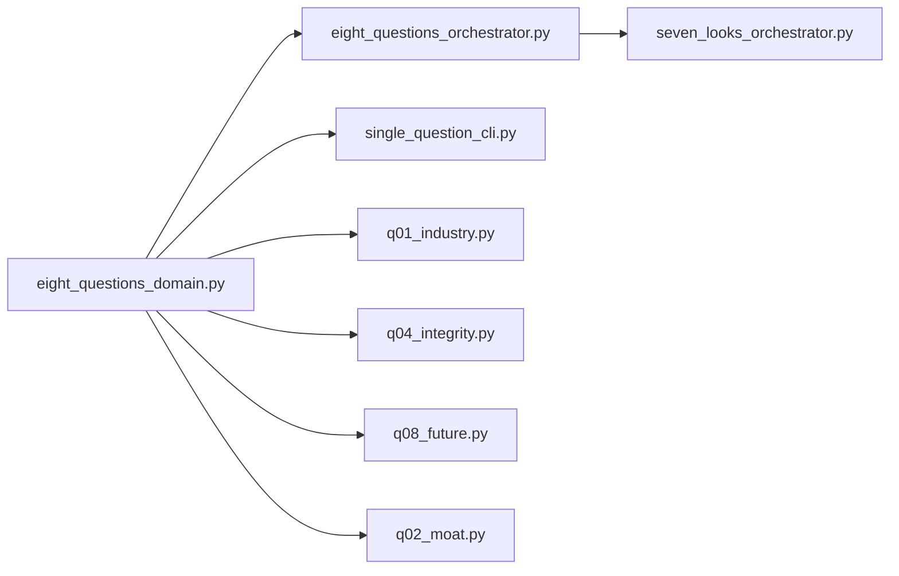
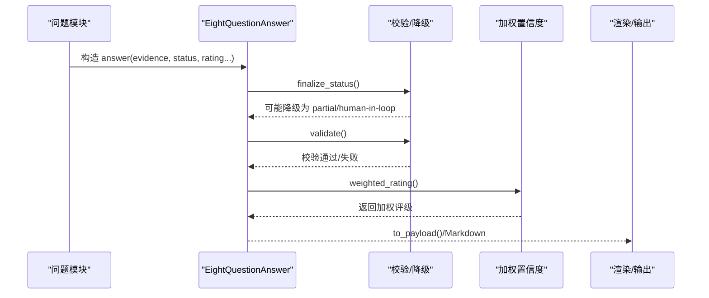
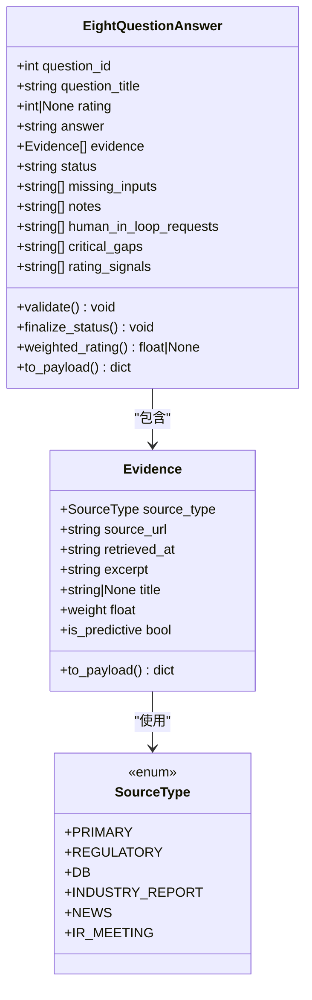

# 问答答案实体

<cite>
**本文引用的文件**
- [eight_questions_domain.py](file://2min-company-analysis/seven-look-eight-question/scripts/eight_questions_domain.py)
- [eight_questions_orchestrator.py](file://2min-company-analysis/seven-look-eight-question/scripts/eight_questions_orchestrator.py)
- [seven_looks_orchestrator.py](file://2min-company-analysis/seven-look-eight-question/scripts/seven_looks_orchestrator.py)
- [single_question_cli.py](file://2min-company-analysis/seven-look-eight-question/scripts/single_question_cli.py)
- [q01_industry.py](file://2min-company-analysis/ask-q1-industry-prospect/scripts/q01_industry.py)
- [q04_integrity.py](file://2min-company-analysis/ask-q4-financial-integrity/scripts/q04_integrity.py)
- [q08_future.py](file://2min-company-analysis/ask-q8-future-plan/scripts/q08_future.py)
- [q02_moat.py](file://2min-company-analysis/ask-q2-moat/scripts/q02_moat.py)
- [rule_registry.json](file://2min-company-analysis/seven-look-eight-question/assets/rule_registry.json)
</cite>

## 目录
1. [简介](#简介)
2. [项目结构](#项目结构)
3. [核心组件](#核心组件)
4. [架构总览](#架构总览)
5. [详细组件分析](#详细组件分析)
6. [依赖关系分析](#依赖关系分析)
7. [性能考量](#性能考量)
8. [故障排查指南](#故障排查指南)
9. [结论](#结论)
10. [附录](#附录)

## 简介
本文件系统化梳理“问答答案实体”的完整定义与差异，聚焦 EightQuestionAnswer 与 Evidence 的设计与使用，解释答案评级体系、证据权重计算与置信度评估算法，给出答案生成流程、质量控制标准与人工审核机制，并提供答案验证方法与错误修正指南。文档面向不同技术背景读者，既提供高层概览，也包含代码级细节与可视化图示。

## 项目结构
围绕“八问”（八个核心问题）的答案实体与工作流，相关代码集中在 seven-look-eight-question/scripts 与各问题子目录 scripts 下，采用“共享领域模型 + 问题模块化执行 + 总编排输出”的分层组织方式。

图表来源
- [eight_questions_domain.py:1-324](file://2min-company-analysis/seven-look-eight-question/scripts/eight_questions_domain.py#L1-L324)
- [eight_questions_orchestrator.py:1-396](file://2min-company-analysis/seven-look-eight-question/scripts/eight_questions_orchestrator.py#L1-L396)
- [single_question_cli.py:1-158](file://2min-company-analysis/seven-look-eight-question/scripts/single_question_cli.py#L1-L158)
- [q01_industry.py:1-157](file://2min-company-analysis/ask-q1-industry-prospect/scripts/q01_industry.py#L1-L157)
- [q04_integrity.py:1-131](file://2min-company-analysis/ask-q4-financial-integrity/scripts/q04_integrity.py#L1-L131)
- [q08_future.py:1-125](file://2min-company-analysis/ask-q8-future-plan/scripts/q08_future.py#L1-L125)
- [q02_moat.py:1-129](file://2min-company-analysis/ask-q2-moat/scripts/q02_moat.py#L1-L129)
- [seven_looks_orchestrator.py:1-800](file://2min-company-analysis/seven-look-eight-question/scripts/seven_looks_orchestrator.py#L1-L800)

章节来源
- [eight_questions_domain.py:1-324](file://2min-company-analysis/seven-look-eight-question/scripts/eight_questions_domain.py#L1-L324)
- [eight_questions_orchestrator.py:1-396](file://2min-company-analysis/seven-look-eight-question/scripts/eight_questions_orchestrator.py#L1-L396)
- [seven_looks_orchestrator.py:1-800](file://2min-company-analysis/seven-look-eight-question/scripts/seven_looks_orchestrator.py#L1-L800)

## 核心组件
- EightQuestionAnswer：每个问题的答案载体，包含问题标识、标题、评级、文字回答、证据列表、状态、缺失输入、备注、人工介入请求、关键证据缺口、动态评级信号等字段。
- Evidence：证据单元，包含来源类型、URL、抓取时间、摘录、标题等，内置严格校验与权重/预测标记属性。
- AnswerStatus：答案状态枚举，支持 ready/partial/insufficient-evidence/human-in-loop-required。
- SourceType 与权重：定义证据来源类别及对应权重，用于加权评级与置信度评估。

章节来源
- [eight_questions_domain.py:113-212](file://2min-company-analysis/seven-look-eight-question/scripts/eight_questions_domain.py#L113-L212)
- [eight_questions_domain.py:26-47](file://2min-company-analysis/seven-look-eight-question/scripts/eight_questions_domain.py#L26-L47)
- [eight_questions_domain.py:72-111](file://2min-company-analysis/seven-look-eight-question/scripts/eight_questions_domain.py#L72-L111)

## 架构总览
八问工作流自上而下分为：问题模块（每个问题独立脚本）→ 共享领域模型（答案/证据）→ 八问执行器（并发执行/汇总/交叉校验）→ 七看总编排（合并七看与八问输出）→ 输出（JSON/Markdown）。

图表来源
- [seven_looks_orchestrator.py:332-391](file://2min-company-analysis/seven-look-eight-question/scripts/seven_looks_orchestrator.py#L332-L391)
- [eight_questions_orchestrator.py:119-163](file://2min-company-analysis/seven-look-eight-question/scripts/eight_questions_orchestrator.py#L119-L163)
- [eight_questions_domain.py:123-212](file://2min-company-analysis/seven-look-eight-question/scripts/eight_questions_domain.py#L123-L212)

## 详细组件分析

### EightQuestionAnswer 字段与职责
- question_id：问题编号（1..8），用于定位与排序。
- question_title：问题标题，便于报告渲染与汇总。
- rating：整数评级（1..5），不足证据时为 None。
- answer：文字回答，可为空（status != ready 时）。
- evidence：证据列表（Evidence），必须非空且满足“证据铁律”（见下节）。
- status：答案状态，支持 ready/partial/insufficient-evidence/human-in-loop-required。
- missing_inputs：待补输入清单，触发 partial 状态。
- notes：内部备注，记录校验/降级/异常信息。
- human_in_loop_requests：人工介入请求，最高优先级，触发 human-in-loop-required。
- critical_gaps：关键证据缺口，降低置信度但不阻塞。
- rating_signals：动态评级打分依据，用于审计与追溯。

章节来源
- [eight_questions_domain.py:123-212](file://2min-company-analysis/seven-look-eight-question/scripts/eight_questions_domain.py#L123-L212)

### Evidence 证据单元
- source_type：来源类型（Primary/Regulatory/DB/IndustryReport/News/IRMeeting）。
- source_url：证据来源链接（HTTP/HTTPS/DuckDB/File）。
- retrieved_at：抓取时间（ISO8601）。
- excerpt：原文/字段摘录（不能为空）。
- title：标题（可选）。
- 属性与方法：weight（按来源类型查表）、is_predictive（预测/公司口径标记）。
- 校验：禁止空 URL、空摘录、非法 ISO 时间。

章节来源
- [eight_questions_domain.py:72-111](file://2min-company-analysis/seven-look-eight-question/scripts/eight_questions_domain.py#L72-L111)
- [eight_questions_domain.py:26-47](file://2min-company-analysis/seven-look-eight-question/scripts/eight_questions_domain.py#L26-L47)

### 答案状态与降级流程
- 有效状态集合：ready/partial/insufficient-evidence/human-in-loop-required。
- finalize_status() 自动降级策略：
  - 若存在 human_in_loop_requests → 置为 human-in-loop-required；
  - 若原状态为 ready 且存在 missing_inputs → 降为 partial；
  - 否则保持原状态。
- validate() 强约束：
  - status 必须在有效集合；
  - question_id 必须在 1..8；
  - ready 状态下必须有证据、rating 在 1..5，且 missing_inputs/human_in_loop_requests 必须为空；
  - rating 若非空必须在 1..5。

图表来源
- [eight_questions_domain.py:168-186](file://2min-company-analysis/seven-look-eight-question/scripts/eight_questions_domain.py#L168-L186)

章节来源
- [eight_questions_domain.py:115-167](file://2min-company-analysis/seven-look-eight-question/scripts/eight_questions_domain.py#L115-L167)

### 答案评级体系与置信度评估
- 评级（rating）：1..5 的整数，不足证据时为 None。
- 置信度（weighted_rating）：按证据权重加权的评级，公式为 rating × 平均证据权重，保留三位小数。
- 来源权重表：
  - Primary/Regulatory/DB：1.0
  - IndustryReport：0.6
  - News：0.4
  - IRMeeting：0.5
- 预测性标记：IndustryReport/IRMeeting 标记为预测/公司口径，用于渲染与交叉校验。

图表来源
- [eight_questions_domain.py:187-194](file://2min-company-analysis/seven-look-eight-question/scripts/eight_questions_domain.py#L187-L194)
- [eight_questions_domain.py:35-47](file://2min-company-analysis/seven-look-eight-question/scripts/eight_questions_domain.py#L35-L47)

章节来源
- [eight_questions_domain.py:187-212](file://2min-company-analysis/seven-look-eight-question/scripts/eight_questions_domain.py#L187-L212)

### 八问清单与问题模块
- EIGHT_QUESTIONS：定义 1..8 问题的标题、描述、原始问题与关键点。
- 规则注册：rule_registry.json 映射 rule_id 到问题模块脚本路径，八问执行器据此动态导入并调用 answer()。

章节来源
- [eight_questions_domain.py:220-277](file://2min-company-analysis/seven-look-eight-question/scripts/eight_questions_domain.py#L220-L277)
- [rule_registry.json:219-407](file://2min-company-analysis/seven-look-eight-question/assets/rule_registry.json#L219-L407)

### 八问执行器与汇总
- 并发执行：ThreadPoolExecutor 并行运行指定问题模块，失败不影响其他问题。
- 质量控制：每个结果执行 finalize_status() 与 validate()，异常统一降级为 insufficient-evidence。
- 汇总统计：计算平均评级、加权平均评级、状态分布、人工介入请求与关键证据缺口。
- 交叉校验：例如 Q4 财务真实性与 look-01 净现比指标联动，增强可信度。

章节来源
- [eight_questions_orchestrator.py:119-163](file://2min-company-analysis/seven-look-eight-question/scripts/eight_questions_orchestrator.py#L119-L163)
- [eight_questions_orchestrator.py:171-200](file://2min-company-analysis/seven-look-eight-question/scripts/eight_questions_orchestrator.py#L171-L200)
- [eight_questions_orchestrator.py:304-318](file://2min-company-analysis/seven-look-eight-question/scripts/eight_questions_orchestrator.py#L304-L318)

### 七看八问总编排
- 从八问执行器读取 JSON 输出，派生总体状态（ready/partial/human-in-loop/insufficient）。
- 合并七看与八问摘要，构建交叉校验标志（如财务真实性强化）。
- 生成最终 Markdown 报告，标注证据铁律与人工介入优先级。

章节来源
- [seven_looks_orchestrator.py:258-282](file://2min-company-analysis/seven-look-eight-question/scripts/seven_looks_orchestrator.py#L258-L282)
- [seven_looks_orchestrator.py:302-330](file://2min-company-analysis/seven-look-eight-question/scripts/seven_looks_orchestrator.py#L302-L330)
- [seven_looks_orchestrator.py:384-391](file://2min-company-analysis/seven-look-eight-question/scripts/seven_looks_orchestrator.py#L384-L391)

### 具体问题模块示例与字段使用
- Q1 行业前景：当缺乏政策证据时，添加 critical_gaps 以降低置信度。
- Q4 财务真实性：基于净现比与审计/问询/立案公告桶计数粗评 rating，并记录 rating_signals。
- Q8 未来规划：以业绩预告净利变动中位数为 proxy，动态调整 rating。
- Q2 竞争优势：主营收集中度与年报关键词命中决定 rating 基线。

章节来源
- [q01_industry.py:138-147](file://2min-company-analysis/ask-q1-industry-prospect/scripts/q01_industry.py#L138-L147)
- [q04_integrity.py:78-122](file://2min-company-analysis/ask-q4-financial-integrity/scripts/q04_integrity.py#L78-L122)
- [q08_future.py:78-116](file://2min-company-analysis/ask-q8-future-plan/scripts/q08_future.py#L78-L116)
- [q02_moat.py:86-120](file://2min-company-analysis/ask-q2-moat/scripts/q02_moat.py#L86-L120)

## 依赖关系分析
- 共享领域模型被所有问题模块与执行器依赖，确保答案结构与证据规范一致。
- 问题模块通过 shared scripts 导入 EightQuestionAnswer 与 SourceType，统一证据构造与状态管理。
- 执行器负责并发调度、质量控制与汇总输出，七看总编排负责跨维度整合。

图表来源
- [eight_questions_domain.py:1-324](file://2min-company-analysis/seven-look-eight-question/scripts/eight_questions_domain.py#L1-L324)
- [eight_questions_orchestrator.py:28-35](file://2min-company-analysis/seven-look-eight-question/scripts/eight_questions_orchestrator.py#L28-L35)
- [single_question_cli.py:11-17](file://2min-company-analysis/seven-look-eight-question/scripts/single_question_cli.py#L11-L17)
- [q01_industry.py:19-22](file://2min-company-analysis/ask-q1-industry-prospect/scripts/q01_industry.py#L19-L22)
- [q04_integrity.py:19-22](file://2min-company-analysis/ask-q4-financial-integrity/scripts/q04_integrity.py#L19-L22)
- [q08_future.py:19-22](file://2min-company-analysis/ask-q8-future-plan/scripts/q08_future.py#L19-L22)
- [q02_moat.py:22-25](file://2min-company-analysis/ask-q2-moat/scripts/q02_moat.py#L22-L25)
- [seven_looks_orchestrator.py:332-391](file://2min-company-analysis/seven-look-eight-question/scripts/seven_looks_orchestrator.py#L332-L391)

## 性能考量
- 并发执行：八问执行器使用线程池并发运行问题模块，提升吞吐并避免单点阻塞。
- 轻量序列化：答案实体提供 to_payload()，便于快速写出 JSON 与渲染 Markdown。
- 权重计算：加权评级仅涉及平均权重与 rating 的简单运算，复杂度低，适合批量计算。

章节来源
- [eight_questions_orchestrator.py:125-163](file://2min-company-analysis/seven-look-eight-question/scripts/eight_questions_orchestrator.py#L125-L163)
- [eight_questions_domain.py:196-212](file://2min-company-analysis/seven-look-eight-question/scripts/eight_questions_domain.py#L196-L212)

## 故障排查指南
- validate 失败：检查 status 是否在有效集合、question_id 是否在 1..8、ready 状态下是否满足证据与 rating 约束。
- finalize_status 降级：
  - 若出现 human_in_loop_requests，优先处理请求后再重新生成答案；
  - 若出现 missing_inputs，补齐证据后再将状态降级为 partial。
- 置信度偏低：
  - 检查 evidence 是否包含足够数量与来源权重高的证据；
  - 对于 IndustryReport/IRMeeting 等预测性来源，注意其权重较低，可能拉低加权评级。
- 交叉校验异常：
  - 例如 Q4 与 look-01 的指标联动，若指标异常需人工复核证据与评级依据。
- 单问调试：
  - 使用 single_question_cli 的 _sanitize_answer() 对答案进行 finalize_status()/validate()，并输出 Markdown 便于核对。

章节来源
- [eight_questions_domain.py:140-167](file://2min-company-analysis/seven-look-eight-question/scripts/eight_questions_domain.py#L140-L167)
- [eight_questions_domain.py:168-186](file://2min-company-analysis/seven-look-eight-question/scripts/eight_questions_domain.py#L168-L186)
- [eight_questions_orchestrator.py:304-318](file://2min-company-analysis/seven-look-eight-question/scripts/eight_questions_orchestrator.py#L304-L318)
- [single_question_cli.py:25-33](file://2min-company-analysis/seven-look-eight-question/scripts/single_question_cli.py#L25-L33)

## 结论
EightQuestionAnswer 通过严格的证据铁律、明确的状态机与加权置信度算法，实现了可审计、可交叉验证、可人工介入的高质量答案生成。配合问题模块化的实现与总编排的汇总能力，形成从证据采集到报告输出的闭环。实践中应重点关注证据完整性、状态降级触发条件与交叉校验信号，以确保答案可信度与可解释性。

## 附录

### 答案生成流程（端到端）

图表来源
- [eight_questions_domain.py:168-212](file://2min-company-analysis/seven-look-eight-question/scripts/eight_questions_domain.py#L168-L212)
- [eight_questions_orchestrator.py:119-163](file://2min-company-analysis/seven-look-eight-question/scripts/eight_questions_orchestrator.py#L119-L163)

### 答案实体类图

图表来源
- [eight_questions_domain.py:123-212](file://2min-company-analysis/seven-look-eight-question/scripts/eight_questions_domain.py#L123-L212)
- [eight_questions_domain.py:72-111](file://2min-company-analysis/seven-look-eight-question/scripts/eight_questions_domain.py#L72-L111)
- [eight_questions_domain.py:26-47](file://2min-company-analysis/seven-look-eight-question/scripts/eight_questions_domain.py#L26-L47)