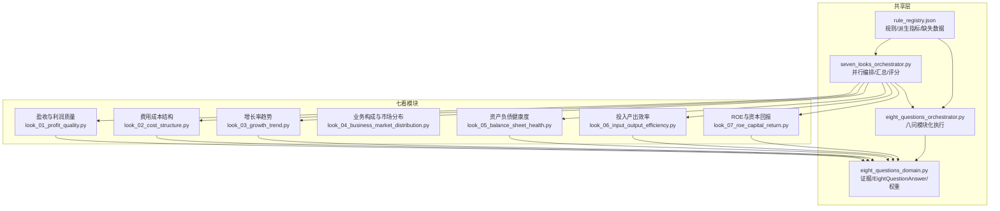
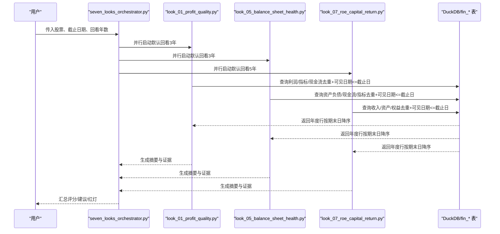
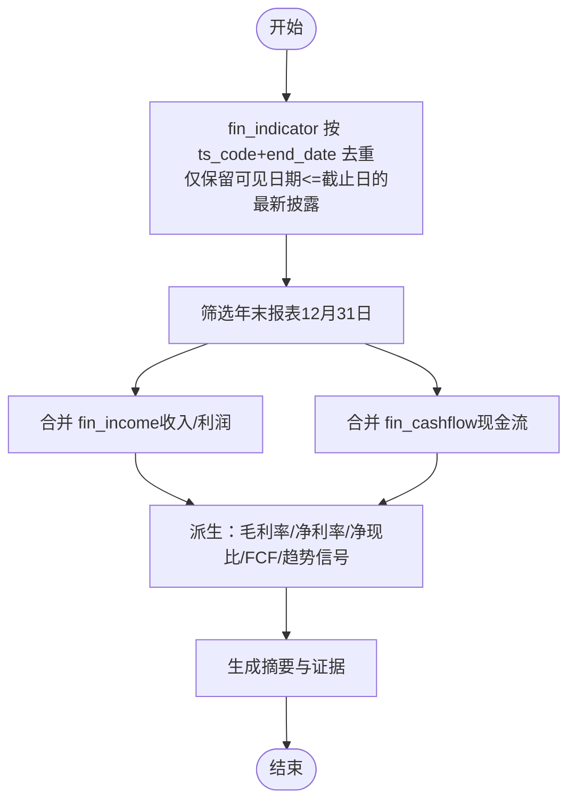
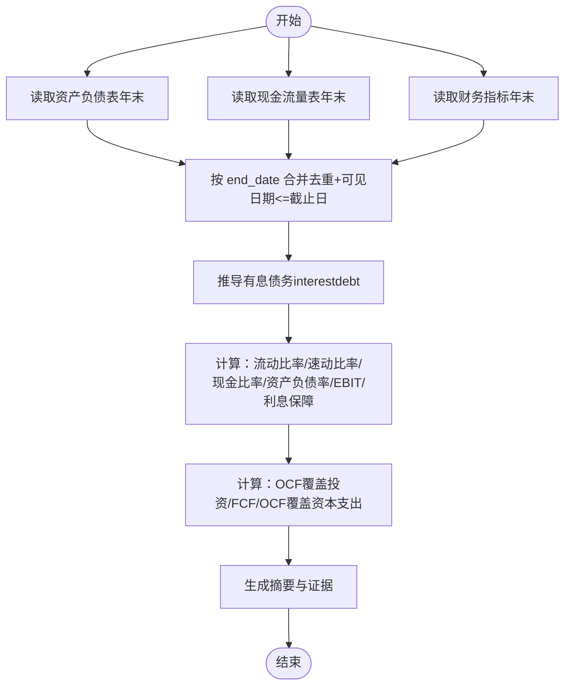
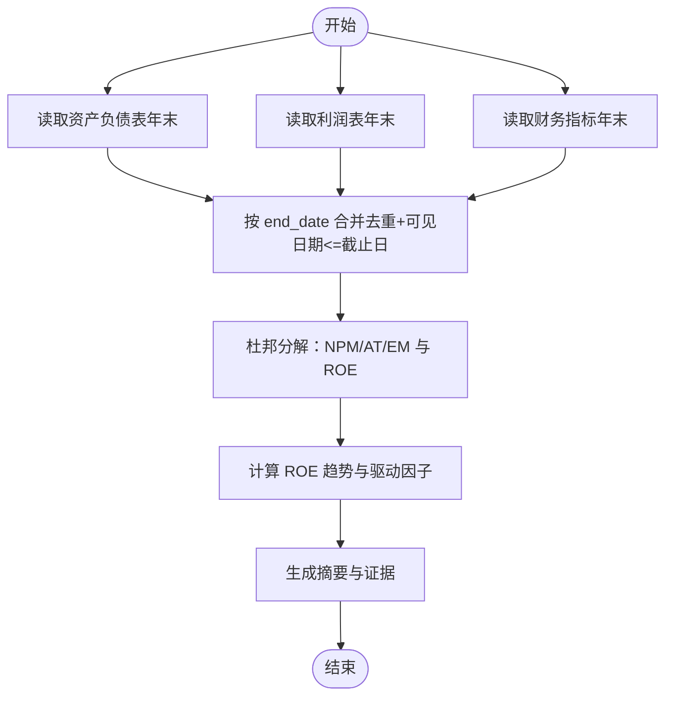
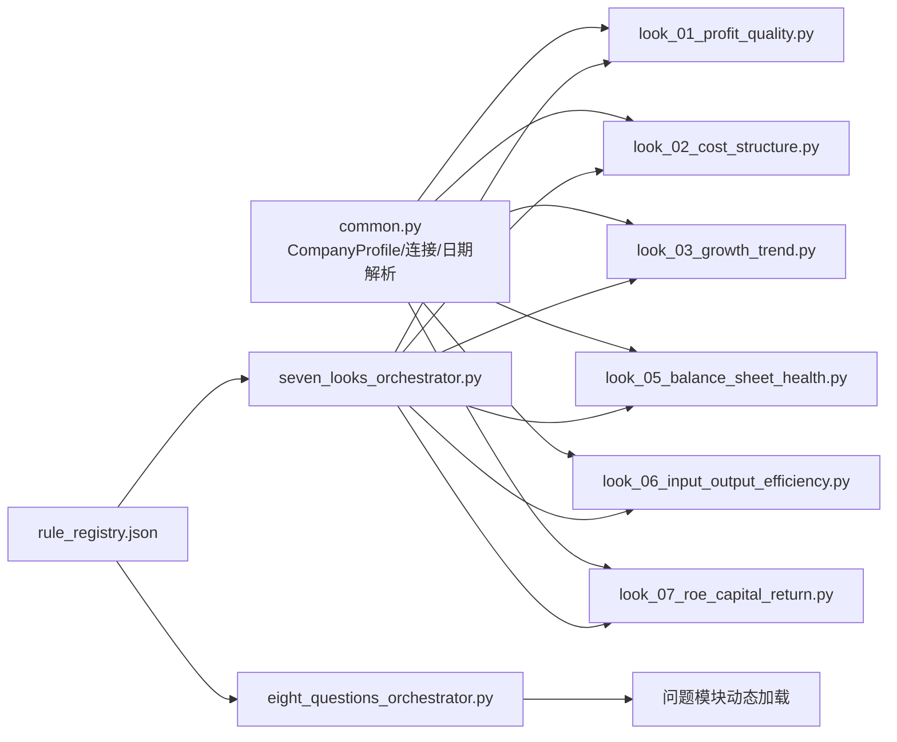

# 财务数据模型

<cite>
**本文档引用的文件**
- [common.py](file://2min-company-analysis/look-01-profit-quality/scripts/common.py)
- [common.py](file://2min-company-analysis/look-02-cost-structure/scripts/common.py)
- [common.py](file://2min-company-analysis/look-03-growth-trend/scripts/common.py)
- [common.py](file://2min-company-analysis/look-05-balance-sheet-health/scripts/common.py)
- [common.py](file://2min-company-analysis/look-06-input-output-efficiency/scripts/common.py)
- [common.py](file://2min-company-analysis/look-07-roe-capital-return/scripts/common.py)
- [eight_questions_domain.py](file://2min-company-analysis/seven-look-eight-question/scripts/eight_questions_domain.py)
- [seven_looks_orchestrator.py](file://2min-company-analysis/seven-look-eight-question/scripts/seven_looks_orchestrator.py)
- [eight_questions_orchestrator.py](file://2min-company-analysis/seven-look-eight-question/scripts/eight_questions_orchestrator.py)
- [rule_registry.json](file://2min-company-analysis/seven-look-eight-question/assets/rule_registry.json)
- [look_01_profit_quality.py](file://2min-company-analysis/look-01-profit-quality/scripts/look_01_profit_quality.py)
- [look_05_balance_sheet_health.py](file://2min-company-analysis/look-05-balance-sheet-health/scripts/look_05_balance_sheet_health.py)
- [look_07_roe_capital_return.py](file://2min-company-analysis/look-07-roe-capital-return/scripts/look_07_roe_capital_return.py)
</cite>

## 目录
1. [简介](#简介)
2. [项目结构](#项目结构)
3. [核心组件](#核心组件)
4. [架构总览](#架构总览)
5. [详细组件分析](#详细组件分析)
6. [依赖分析](#依赖分析)
7. [性能考虑](#性能考虑)
8. [故障排除指南](#故障排除指南)
9. [结论](#结论)
10. [附录](#附录)

## 简介
本文件系统性梳理仓库中财务数据模型与分析流程，聚焦于利润表、资产负债表、现金流量表等核心数据结构，明确财务指标计算字段、比率分析字段与趋势分析字段的定义与派生逻辑，总结财务数据验证规则与一致性检查机制，并展示时间序列处理与滚动窗口计算方法。同时，结合七看八问的使用模式，说明财务数据在不同分析场景中的应用。

## 项目结构
该仓库围绕“七看八问”财务分析框架组织，每个“看”对应一个独立的财务分析脚本，统一通过共享的领域模型与工具函数实现数据访问、公司画像检测与输出规范。核心目录与文件如下：
- 七看脚本：各 look-* 目录下的 scripts 子目录包含独立的分析脚本与通用 common.py。
- 共享领域模型：eight_questions_domain.py 定义证据单元、答案结构与权重体系。
- 编排器：seven_looks_orchestrator.py 负责并行执行七看脚本并汇总结果；eight_questions_orchestrator.py 负责八问模块化执行。
- 规则注册表：rule_registry.json 描述每个规则的数据来源、派生指标与缺失数据项。

图表来源
- [seven_looks_orchestrator.py:62-119](file://2min-company-analysis/seven-look-eight-question/scripts/seven_looks_orchestrator.py#L62-L119)
- [eight_questions_domain.py:26-111](file://2min-company-analysis/seven-look-eight-question/scripts/eight_questions_domain.py#L26-L111)
- [rule_registry.json:5-41](file://2min-company-analysis/seven-look-eight-question/assets/rule_registry.json#L5-L41)

章节来源
- [seven_looks_orchestrator.py:62-119](file://2min-company-analysis/seven-look-eight-question/scripts/seven_looks_orchestrator.py#L62-L119)
- [eight_questions_domain.py:26-111](file://2min-company-analysis/seven-look-eight-question/scripts/eight_questions_domain.py#L26-L111)
- [rule_registry.json:5-41](file://2min-company-analysis/seven-look-eight-question/assets/rule_registry.json#L5-L41)

## 核心组件
- CompanyProfile 数据模型：封装公司类型、最新财报期末日、可见日期等信息，支持金融类公司识别与警告提示。
- Evidence 与 EightQuestionAnswer：统一证据来源类型、权重与校验规则，确保“禁止编造、必标来源”的证据铁律。
- 规则注册表：定义每个 look 的数据表依赖、派生指标、缺失数据项与脚本路径，便于统一治理与测试。

章节来源
- [common.py:28-59](file://2min-company-analysis/look-01-profit-quality/scripts/common.py#L28-L59)
- [eight_questions_domain.py:26-111](file://2min-company-analysis/seven-look-eight-question/scripts/eight_questions_domain.py#L26-L111)
- [rule_registry.json:5-41](file://2min-company-analysis/seven-look-eight-question/assets/rule_registry.json#L5-L41)

## 架构总览
财务数据模型贯穿于各 look 的 SQL 查询与指标派生过程，统一通过 DuckDB 访问 fin_* 表，结合去重、可见日期过滤与滚动窗口计算，最终形成结构化摘要与证据链路。

图表来源
- [seven_looks_orchestrator.py:170-244](file://2min-company-analysis/seven-look-eight-question/scripts/seven_looks_orchestrator.py#L170-L244)
- [look_01_profit_quality.py:126-200](file://2min-company-analysis/look-01-profit-quality/scripts/look_01_profit_quality.py#L126-L200)
- [look_05_balance_sheet_health.py:108-192](file://2min-company-analysis/look-05-balance-sheet-health/scripts/look_05_balance_sheet_health.py#L108-L192)
- [look_07_roe_capital_return.py:58-144](file://2min-company-analysis/look-07-roe-capital-return/scripts/look_07_roe_capital_return.py#L58-L144)

## 详细组件分析

### 盈收与利润质量（look-01）
- 数据来源：fin_income、fin_indicator、fin_cashflow
- 时间序列与去重：按 end_date 且报告可见日期（COALESCE(f_ann_date, ann_date, end_date)）去重，仅取年末报表（12月31日）
- 关键派生指标（来自规则注册表）：
  - 利润质量：扣非净利润、毛利率、净利率、毛利/营收、经营活动现金流、归母净利润
  - 现金流质量：净现比、自由现金流、净现比均值、净现比低于1的年数、自由现金流为正的年数
  - 趋势信号：毛利率连续3年下滑
- 默认回看：3年
- 适用性：对金融类公司（银行/保险/证券）发出不适用警告

图表来源
- [look_01_profit_quality.py:82-124](file://2min-company-analysis/look-01-profit-quality/scripts/look_01_profit_quality.py#L82-L124)
- [look_01_profit_quality.py:126-200](file://2min-company-analysis/look-01-profit-quality/scripts/look_01_profit_quality.py#L126-L200)
- [rule_registry.json:19-33](file://2min-company-analysis/seven-look-eight-question/assets/rule_registry.json#L19-L33)

章节来源
- [look_01_profit_quality.py:82-124](file://2min-company-analysis/look-01-profit-quality/scripts/look_01_profit_quality.py#L82-L124)
- [look_01_profit_quality.py:126-200](file://2min-company-analysis/look-01-profit-quality/scripts/look_01_profit_quality.py#L126-L200)
- [rule_registry.json:19-33](file://2min-company-analysis/seven-look-eight-question/assets/rule_registry.json#L19-L33)
- [common.py:28-59](file://2min-company-analysis/look-01-profit-quality/scripts/common.py#L28-L59)

### 资产负债健康度（look-05）
- 数据来源：fin_balance、fin_cashflow、fin_indicator
- 关键派生指标（来自规则注册表）：
  - 现金流覆盖：OCF 覆盖投资、FCF、OCF-资本支出、OCF 覆盖资本支出年数
  - 偿债能力：短期/速动/现金比率、资产负债率、权益乘数、EBIT/利息保障
  - 债务结构：有息债务（显式 interestdebt 或由短期借款、长期借款、应付债券、租赁负债等合计推导）
- 默认回看：3年
- 隐性负债：依赖年报附注文本，缺失时标记 human-in-loop

图表来源
- [look_05_balance_sheet_health.py:108-192](file://2min-company-analysis/look-05-balance-sheet-health/scripts/look_05_balance_sheet_health.py#L108-L192)
- [look_05_balance_sheet_health.py:222-333](file://2min-company-analysis/look-05-balance-sheet-health/scripts/look_05_balance_sheet_health.py#L222-L333)
- [rule_registry.json:135-154](file://2min-company-analysis/seven-look-eight-question/assets/rule_registry.json#L135-L154)

章节来源
- [look_05_balance_sheet_health.py:108-192](file://2min-company-analysis/look-05-balance-sheet-health/scripts/look_05_balance_sheet_health.py#L108-L192)
- [look_05_balance_sheet_health.py:222-333](file://2min-company-analysis/look-05-balance-sheet-health/scripts/look_05_balance_sheet_health.py#L222-L333)
- [rule_registry.json:135-154](file://2min-company-analysis/seven-look-eight-question/assets/rule_registry.json#L135-L154)

### ROE 与资本回报（look-07）
- 数据来源：fin_income、fin_balance、fin_indicator
- 杜邦分解：ROE = 净利率 × 总资产周转 × 权益乘数（NPM × AT × EM）
- 关键派生指标（来自规则注册表）：
  - ROE 分解驱动因子：净利润/营收、总资产周转、权益乘数
  - ROE 趋势：多年 ROE 排序与趋势信号
- 默认回看：5年
- 驱动识别阈值：基于 NPM/AT/EM 的组合阈值识别“杠杆驱动/盈利驱动/周转驱动”

图表来源
- [look_07_roe_capital_return.py:58-144](file://2min-company-analysis/look-07-roe-capital-return/scripts/look_07_roe_capital_return.py#L58-L144)
- [look_07_roe_capital_return.py:146-198](file://2min-company-analysis/look-07-roe-capital-return/scripts/look_07_roe_capital_return.py#L146-L198)
- [rule_registry.json:204-217](file://2min-company-analysis/seven-look-eight-question/assets/rule_registry.json#L204-L217)

章节来源
- [look_07_roe_capital_return.py:58-144](file://2min-company-analysis/look-07-roe-capital-return/scripts/look_07_roe_capital_return.py#L58-L144)
- [look_07_roe_capital_return.py:146-198](file://2min-company-analysis/look-07-roe-capital-return/scripts/look_07_roe_capital_return.py#L146-L198)
- [rule_registry.json:204-217](file://2min-company-analysis/seven-look-eight-question/assets/rule_registry.json#L204-L217)

### 费用成本结构（look-02）
- 数据来源：fin_income、fin_indicator
- 关键派生指标（来自规则注册表）：
  - 四费率与费用同比：研发费用率、销售费用同比、管理费用同比、财务费用同比
- 关注点：费用增长与营收增长的匹配度，研发费用率的派生与回看

章节来源
- [rule_registry.json:52-64](file://2min-company-analysis/seven-look-eight-question/assets/rule_registry.json#L52-L64)

### 增长率趋势（look-03）
- 数据来源：fin_income、fin_balance、fin_cashflow
- 关键派生指标（来自规则注册表）：
  - 收入 CAGR、归母净利润 CAGR
  - 商誉/资产占比、并购现金/营收、增长模式信号（并购驱动/混合）

章节来源
- [rule_registry.json:78-90](file://2min-company-analysis/seven-look-eight-question/assets/rule_registry.json#L78-L90)

### 投入产出效率（look-06）
- 数据来源：fin_income、fin_balance、fin_cashflow、fin_indicator、申万三级同行、因子数据
- 关键派生指标（来自规则注册表）：
  - 营运资金/收入、固定资产/收入、人均效率（收入/员工、利润/员工、人均劳动成本）
  - 趋势：营运资金/收入趋势、人均状态与覆盖年数
- 缺失数据：员工数量，需 human-in-loop 补齐

章节来源
- [rule_registry.json:171-190](file://2min-company-analysis/seven-look-eight-question/assets/rule_registry.json#L171-L190)

### 业务构成与市场分布（look-04）
- 数据来源：stk_info、idx_sw_classify、idx_sw_member_all、idx_sw_l3_peers
- 关键派生指标（来自规则注册表）：
  - 同行候选数、业务构成证据数、海外销售证据数、客户集中度证据数
- 缺失数据：年报全文、分部收入拆分、区域销售拆分、单客户销售，需 human-in-loop

章节来源
- [rule_registry.json:105-121](file://2min-company-analysis/seven-look-eight-question/assets/rule_registry.json#L105-L121)

## 依赖分析
- 组件耦合与内聚：
  - 各 look 脚本通过共享 common.py 获取数据库连接、日期解析、公司画像检测与输出 payload。
  - seven_looks_orchestrator.py 统一管理并行执行、超时控制、错误捕获与汇总评分。
  - eight_questions_orchestrator.py 通过 rule_registry.json 动态加载问题模块，保证八问模块化与可扩展性。
- 外部依赖：
  - DuckDB：统一查询 fin_income、fin_balance、fin_cashflow、fin_indicator 等表。
  - 规则注册表：统一约束派生指标、缺失数据与脚本路径，便于回归与测试。

图表来源
- [common.py:28-59](file://2min-company-analysis/look-01-profit-quality/scripts/common.py#L28-L59)
- [seven_looks_orchestrator.py:62-119](file://2min-company-analysis/seven-look-eight-question/scripts/seven_looks_orchestrator.py#L62-L119)
- [eight_questions_orchestrator.py:41-100](file://2min-company-analysis/seven-look-eight-question/scripts/eight_questions_orchestrator.py#L41-L100)
- [rule_registry.json:5-41](file://2min-company-analysis/seven-look-eight-question/assets/rule_registry.json#L5-L41)

章节来源
- [common.py:28-59](file://2min-company-analysis/look-01-profit-quality/scripts/common.py#L28-L59)
- [seven_looks_orchestrator.py:62-119](file://2min-company-analysis/seven-look-eight-question/scripts/seven_looks_orchestrator.py#L62-L119)
- [eight_questions_orchestrator.py:41-100](file://2min-company-analysis/seven-look-eight-question/scripts/eight_questions_orchestrator.py#L41-L100)
- [rule_registry.json:5-41](file://2min-company-analysis/seven-look-eight-question/assets/rule_registry.json#L5-L41)

## 性能考虑
- 并行执行：seven_looks_orchestrator.py 使用线程池并行运行多个 look 脚本，显著缩短总耗时。
- DuckDB 查询优化：
  - 限制回看年数（默认3/5年），减少扫描行数。
  - 使用 ROW_NUMBER() 去重与可见日期过滤，避免重复披露导致的噪声。
  - 按 end_date 降序排序，配合 rn<=N 实现滚动窗口。
- I/O 与缓存：
  - 采用只读连接，避免写放大。
  - 输出统一为 JSON，便于后续编排器汇总与八问渲染。

## 故障排除指南
- 数据缺失与人类介入：
  - look-04/05 在缺失年报文本/附注时会标记 human-in-loop，需提供相应文本以提取业务构成、市场分布与隐性负债证据。
- 证据校验失败：
  - eight_questions_domain.py 对 Evidence 进行严格校验：source_url 非空、excerpt 非空、retrieved_at 符合 ISO8601；EightQuestionAnswer.validate() 强制状态与评级一致性。
- 数据一致性检查：
  - CompanyProfile.detect_company_profile() 通过 UNION ALL 从三张表中选择最新可见日期与期末日，确保时间一致性。
  - look-05 中 interestdebt 可由多个资产负债表字段合计推导，若存在缺失字段则标记为“推导”并记录缺失组件列表。

章节来源
- [seven_looks_orchestrator.py:542-585](file://2min-company-analysis/seven-look-eight-question/scripts/seven_looks_orchestrator.py#L542-L585)
- [eight_questions_domain.py:72-111](file://2min-company-analysis/seven-look-eight-question/scripts/eight_questions_domain.py#L72-L111)
- [eight_questions_domain.py:140-167](file://2min-company-analysis/seven-look-eight-question/scripts/eight_questions_domain.py#L140-L167)
- [common.py:82-153](file://2min-company-analysis/look-05-balance-sheet-health/scripts/common.py#L82-L153)
- [look_05_balance_sheet_health.py:302-333](file://2min-company-analysis/look-05-balance-sheet-health/scripts/look_05_balance_sheet_health.py#L302-L333)

## 结论
本仓库以“七看八问”为核心，构建了覆盖利润质量、资产负债健康度、ROE 分解与效率评估的财务数据模型。通过统一的共享层（CompanyProfile、Evidence、EightQuestionAnswer）与规则注册表，实现了指标派生、时间序列滚动窗口与跨模块交叉验证。金融类公司识别与人类介入机制确保了分析的稳健性与可解释性。建议在生产环境中：
- 明确各 look 的回看年数与派生指标边界，保持规则注册表同步更新。
- 对缺失数据建立标准化的人类介入流程与证据模板。
- 在高频分析场景中启用并行执行与缓存策略，提升整体吞吐。

## 附录
- 财务报表相关核心数据结构（字段映射与派生逻辑）
  - 利润表：收入、利润、费用、指标（来自 fin_income 与 fin_indicator）
  - 资产负债表：资产、负债、权益、指标（来自 fin_balance 与 fin_indicator）
  - 现金流量表：经营活动/投资/筹资现金流、自由现金流（来自 fin_cashflow）
- 指标计算字段与阈值
  - 利润质量：净现比、FCF、毛利率/净利率、趋势信号
  - 偿债与杠杆：流动比率/速动比率/现金比率、资产负债率、EBIT/利息保障
  - ROE 分解：NPM、AT、EM、ROE 趋势与驱动识别
- 时间序列与滚动窗口
  - 按年末报表去重与可见日期过滤，按 end_date 降序取最近 N 年
- 使用模式
  - 七看：自动/半自动并行执行，汇总评分与建议
  - 八问：模块化加载问题脚本，统一证据与权重