# 错误处理与状态码

<cite>
**本文档引用的文件**
- [server.py](file://nano-search-mcp/src/nano_search_mcp/server.py)
- [api.py](file://nano-search-mcp/src/nano_search_mcp/api.py)
- [fetch.py](file://nano-search-mcp/src/nano_search_mcp/tools/fetch.py)
- [bailian_client.py](file://nano-search-mcp/src/nano_search_mcp/tools/bailian_client.py)
- [search.py](file://nano-search-mcp/src/nano_search_mcp/tools/search.py)
- [deferred_search.py](file://nano-search-mcp/src/nano_search_mcp/tools/deferred_search.py)
- [industry_reports.py](file://nano-search-mcp/src/nano_search_mcp/tools/industry_reports.py)
- [announcements.py](file://nano-search-mcp/src/nano_search_mcp/tools/announcements.py)
- [regulatory_penalties.py](file://nano-search-mcp/src/nano_search_mcp/tools/regulatory_penalties.py)
- [ir_meetings.py](file://nano-search-mcp/src/nano_search_mcp/tools/ir_meetings.py)
- [sina_reports.py](file://nano-search-mcp/src/nano_search_mcp/tools/sina_reports.py)
- [test_fetch.py](file://nano-search-mcp/tests/test_fetch.py)
- [pyproject.toml](file://nano-search-mcp/pyproject.toml)
</cite>

## 目录
1. [简介](#简介)
2. [项目结构](#项目结构)
3. [核心组件](#核心组件)
4. [架构总览](#架构总览)
5. [详细组件分析](#详细组件分析)
6. [依赖分析](#依赖分析)
7. [性能考虑](#性能考虑)
8. [故障排查指南](#故障排查指南)
9. [结论](#结论)
10. [附录](#附录)

## 简介
本文件系统性梳理了本项目在错误处理与状态码方面的设计与实现，覆盖网络错误、API 调用失败、数据解析错误、权限错误、SSRF 防护、重试与退避、日志记录与调试信息格式等关键主题。文档旨在帮助开发者快速理解各工具模块的错误契约、恢复策略与最佳实践，确保系统的健壮性与可维护性。

## 项目结构
项目采用模块化组织，围绕 MCP 服务器与多个数据抓取工具模块构建。核心入口负责注册工具并对外提供统一的服务接口；各工具模块分别处理不同数据源的抓取、解析与缓存，并在失败时遵循统一的错误返回契约。

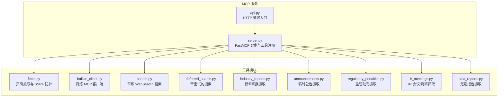

图表来源
- [server.py:19-69](file://nano-search-mcp/src/nano_search_mcp/server.py#L19-L69)
- [api.py:3-6](file://nano-search-mcp/src/nano_search_mcp/api.py#L3-L6)

章节来源
- [server.py:1-91](file://nano-search-mcp/src/nano_search_mcp/server.py#L1-L91)
- [api.py:1-12](file://nano-search-mcp/src/nano_search_mcp/api.py#L1-L12)

## 核心组件
- MCP 服务与工具注册：统一创建 FastMCP 实例，注册各类工具，提供指令说明与错误契约声明。
- 工具模块：每个工具模块独立实现抓取、解析、缓存与错误处理，遵循统一的返回契约。
- 客户端封装：百炼 MCP 客户端负责认证、请求与响应解析，统一错误类型与消息格式。
- SSRF 防护：在页面抓取与外部请求中实施严格的 URL 校验与域名限制。
- 重试与退避：在外部依赖失败时采用指数退避重试，控制抖动与突发流量。
- 日志记录：统一使用 Python logging，输出结构化的调试信息与错误上下文。

章节来源
- [server.py:19-69](file://nano-search-mcp/src/nano_search_mcp/server.py#L19-L69)
- [bailian_client.py:24-92](file://nano-search-mcp/src/nano_search_mcp/tools/bailian_client.py#L24-L92)
- [fetch.py:20-74](file://nano-search-mcp/src/nano_search_mcp/tools/fetch.py#L20-L74)
- [deferred_search.py:102-139](file://nano-search-mcp/src/nano_search_mcp/tools/deferred_search.py#L102-L139)

## 架构总览
MCP 服务通过 FastMCP 提供统一的工具接口，工具模块在内部进行网络请求、解析与缓存，失败时返回标准化的错误字典，避免异常传播到上层。

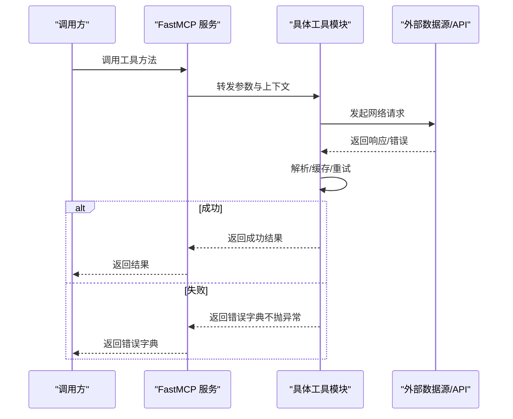

图表来源
- [server.py:61-69](file://nano-search-mcp/src/nano_search_mcp/server.py#L61-L69)
- [search.py:82-118](file://nano-search-mcp/src/nano_search_mcp/tools/search.py#L82-L118)
- [deferred_search.py:148-237](file://nano-search-mcp/src/nano_search_mcp/tools/deferred_search.py#L148-L237)

## 详细组件分析

### 页面抓取与 SSRF 防护（fetch_page）
- 功能概述：基于 Playwright 异步抓取任意 HTTP/HTTPS 页面，清洗导航/页脚/广告等噪声，返回 Markdown 正文。
- SSRF 防护：严格校验 URL 协议与目标主机，拒绝 loopback、私网、链路本地、保留地址等。
- 错误处理：SSRF 校验失败返回 blocked 结果与错误信息；Playwright 抛出异常时返回 error 字段。
- 日志记录：记录抓取开始、成功与失败的上下文信息，便于调试。

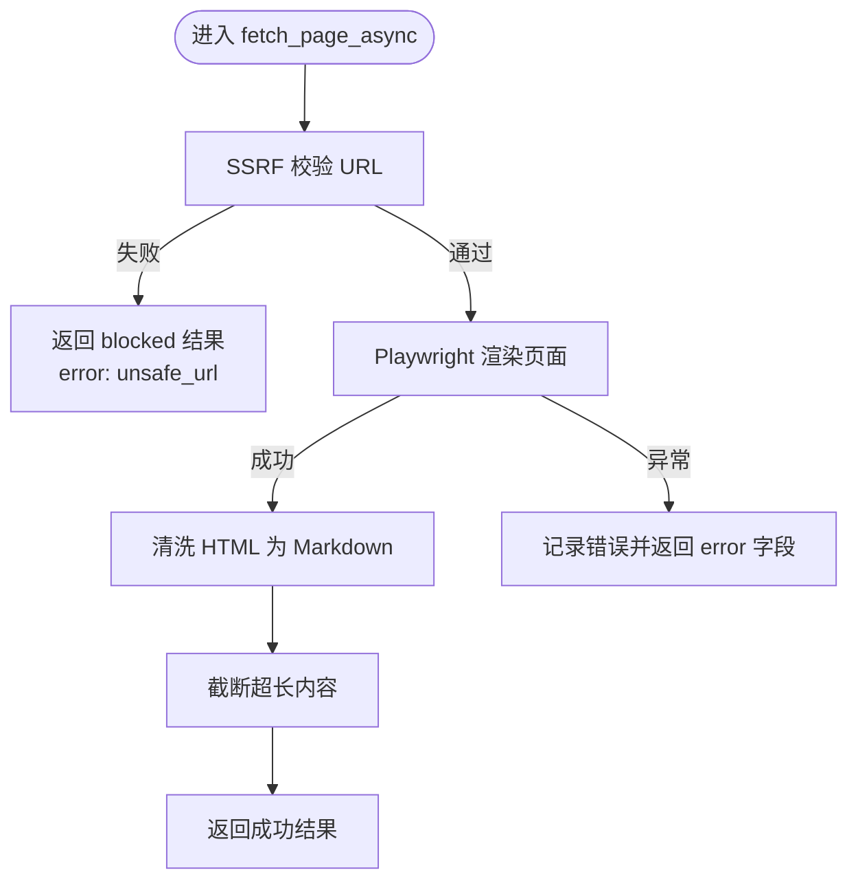

图表来源
- [fetch.py:186-217](file://nano-search-mcp/src/nano_search_mcp/tools/fetch.py#L186-L217)
- [fetch.py:24-74](file://nano-search-mcp/src/nano_search_mcp/tools/fetch.py#L24-L74)

章节来源
- [fetch.py:186-217](file://nano-search-mcp/src/nano_search_mcp/tools/fetch.py#L186-L217)
- [test_fetch.py:85-98](file://nano-search-mcp/tests/test_fetch.py#L85-L98)

### 百炼 MCP 客户端（BailianMCPError）
- 功能概述：封装百炼 MCP 的认证、请求与响应解析，统一错误类型与消息格式。
- 错误类型：BailianMCPError，涵盖认证缺失、HTTP 错误、JSON 解析失败、MCP 返回结构异常等。
- 错误消息：包含原始响应片段（截断），便于定位问题。
- 超时控制：支持环境变量配置默认超时，可按需覆盖。

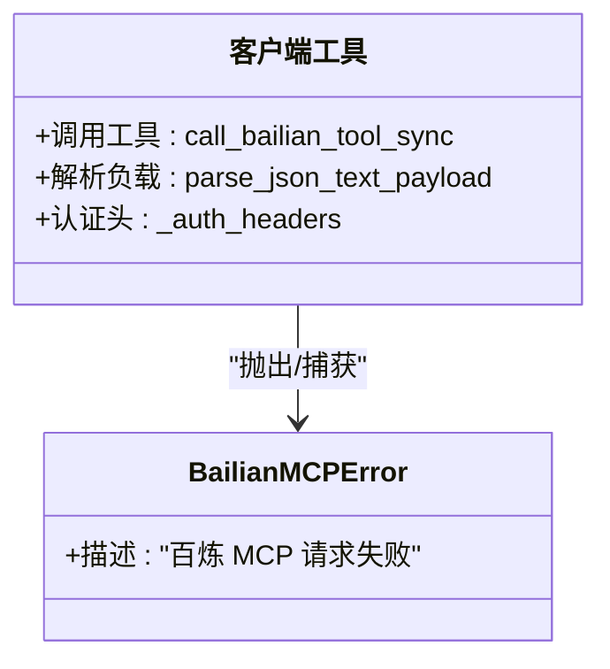

图表来源
- [bailian_client.py:24-92](file://nano-search-mcp/src/nano_search_mcp/tools/bailian_client.py#L24-L92)

章节来源
- [bailian_client.py:24-92](file://nano-search-mcp/src/nano_search_mcp/tools/bailian_client.py#L24-L92)

### 搜索工具（百炼 WebSearch）
- 功能概述：使用百炼 WebSearch 搜索网页，返回标题、URL 与摘要。
- 错误契约：search 工具在参数非法或网络彻底失败时抛出异常；其余工具返回包含 error 字段的结果字典。
- 参数处理：对 region/timelimit 进行查询提示词增强，提升检索稳定性。
- 失败处理：捕获百炼 MCP 错误并转换为运行时错误。

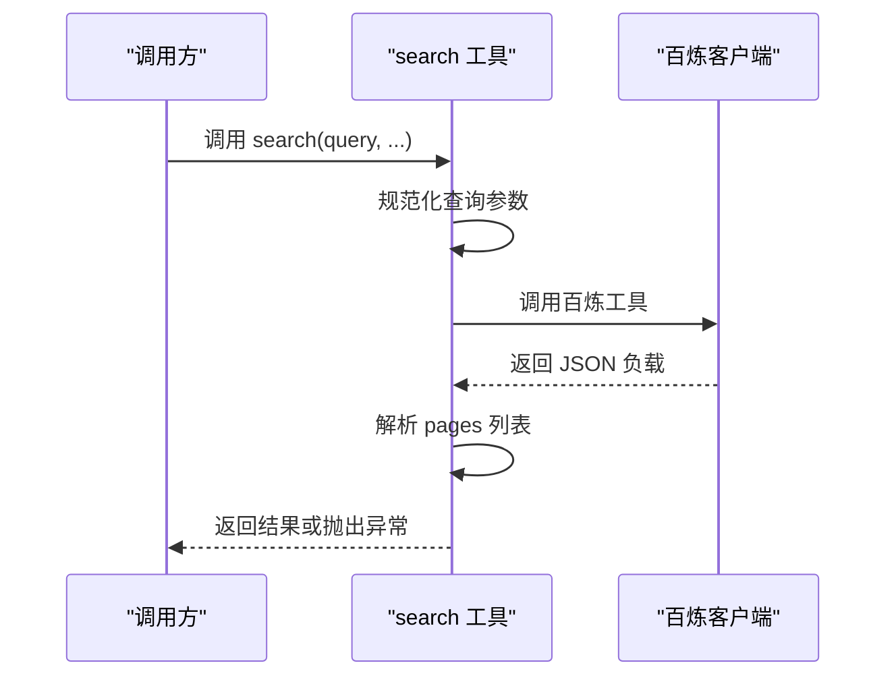

图表来源
- [search.py:82-118](file://nano-search-mcp/src/nano_search_mcp/tools/search.py#L82-L118)
- [search.py:41-70](file://nano-search-mcp/src/nano_search_mcp/tools/search.py#L41-L70)

章节来源
- [search.py:82-118](file://nano-search-mcp/src/nano_search_mcp/tools/search.py#L82-L118)

### 延迟搜索与重试（search_deferred_topic）
- 功能概述：支持主题模板与自由查询两种模式，内置指数退避重试，最多 3 次。
- 错误契约：不抛异常，失败时返回包含 error 字段的结果字典。
- 重试策略：每次重试按 2^attempt + 随机抖动计算退避时间，记录警告日志。
- 模板解析：从 deferred-tasks.md 中加载 YAML 块，支持上下文变量替换。

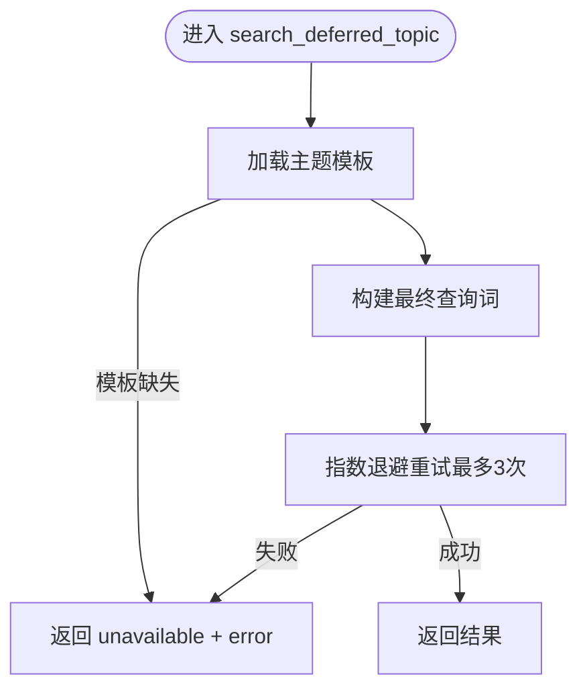

图表来源
- [deferred_search.py:148-237](file://nano-search-mcp/src/nano_search_mcp/tools/deferred_search.py#L148-L237)
- [deferred_search.py:102-139](file://nano-search-mcp/src/nano_search_mcp/tools/deferred_search.py#L102-L139)

章节来源
- [deferred_search.py:148-237](file://nano-search-mcp/src/nano_search_mcp/tools/deferred_search.py#L148-L237)

### 行业研报抓取（list_industry_reports/get_report_text）
- 功能概述：抓取新浪财经行业研报列表与正文，支持 ts_code 自动路由与关键词过滤。
- 错误契约：不抛异常，失败时返回包含 error 字典。
- 重试与退避：HTTP 请求采用指数退避，最多 3 次。
- 缓存策略：列表页缓存 1 小时，详情页缓存 7 天。
- 输入校验：严格校验日期格式、URL 前缀与编码。

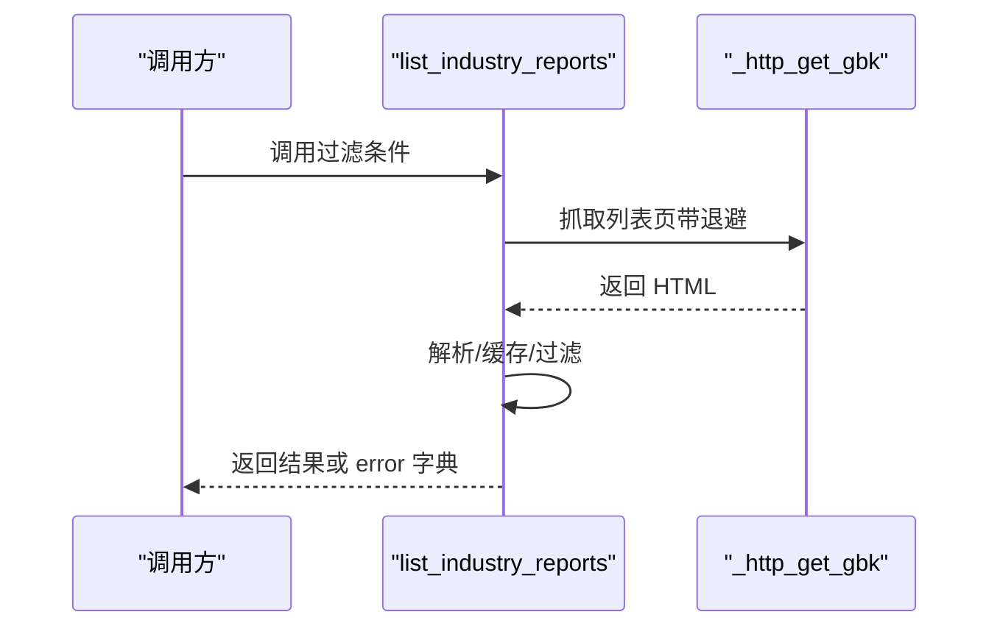

图表来源
- [industry_reports.py:436-457](file://nano-search-mcp/src/nano_search_mcp/tools/industry_reports.py#L436-L457)
- [industry_reports.py:129-158](file://nano-search-mcp/src/nano_search_mcp/tools/industry_reports.py#L129-L158)

章节来源
- [industry_reports.py:436-457](file://nano-search-mcp/src/nano_search_mcp/tools/industry_reports.py#L436-L457)

### 临时公告抓取（list_announcements/get_announcement_text）
- 功能概述：抓取新浪财经临时公告列表与正文，支持按公告类型过滤。
- 错误契约：不抛异常，失败时返回包含 error 字典。
- SSRF 防护：严格校验 URL 前缀与查询参数，防止 SSRF。
- 重试与退避：HTTP 请求采用指数退避，最多 3 次。
- 缓存策略：列表页缓存 1 小时，详情页缓存 7 天。

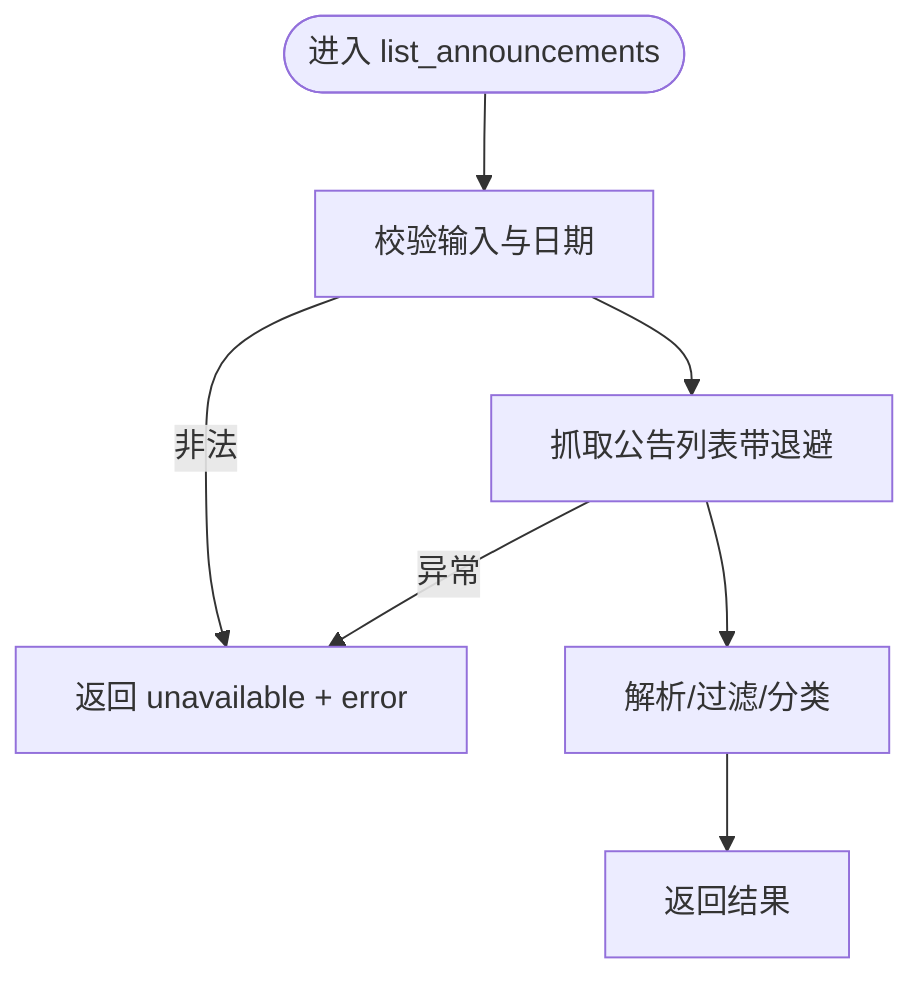

图表来源
- [announcements.py:453-489](file://nano-search-mcp/src/nano_search_mcp/tools/announcements.py#L453-L489)
- [announcements.py:146-178](file://nano-search-mcp/src/nano_search_mcp/tools/announcements.py#L146-L178)

章节来源
- [announcements.py:453-489](file://nano-search-mcp/src/nano_search_mcp/tools/announcements.py#L453-L489)

### 监管处罚抓取（list_regulatory_penalties）
- 功能概述：抓取新浪财经监管处罚记录，支持日期过滤。
- 错误契约：不抛异常，失败时返回包含 error 字典。
- 解析与缓存：解析 HTML 表格，缓存列表页，按日期过滤。
- 输入校验：严格校验 stockid 与日期格式。

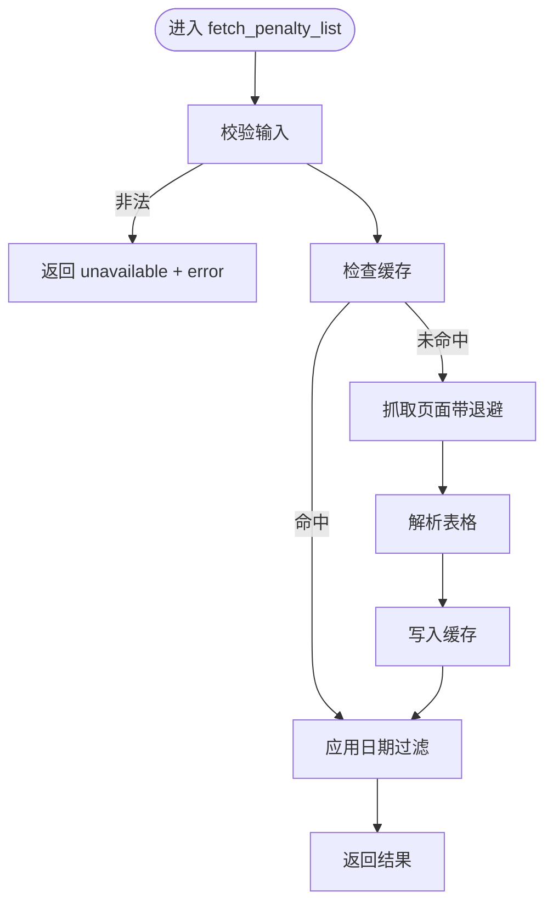

图表来源
- [regulatory_penalties.py:295-366](file://nano-search-mcp/src/nano_search_mcp/tools/regulatory_penalties.py#L295-L366)
- [regulatory_penalties.py:98-132](file://nano-search-mcp/src/nano_search_mcp/tools/regulatory_penalties.py#L98-L132)

章节来源
- [regulatory_penalties.py:295-366](file://nano-search-mcp/src/nano_search_mcp/tools/regulatory_penalties.py#L295-L366)

### IR 会议/调研抓取（list_ir_meetings/get_ir_meeting_text）
- 功能概述：抓取新浪财经 IR 会议/调研纪要，支持会议类型过滤与参会机构抽取。
- 错误契约：不抛异常，失败时返回包含 error 字典。
- 重试与退避：HTTP 请求采用指数退避，最多 3 次。
- 缓存策略：列表页缓存 1 小时，详情页缓存 7 天。
- 早停优化：根据页面最旧日期提前停止翻页。

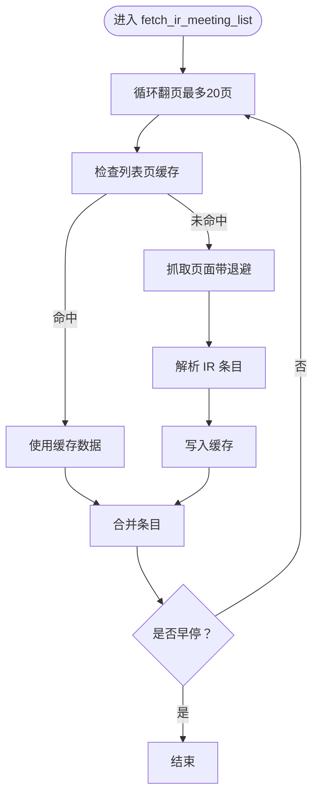

图表来源
- [ir_meetings.py:394-462](file://nano-search-mcp/src/nano_search_mcp/tools/ir_meetings.py#L394-L462)
- [ir_meetings.py:201-230](file://nano-search-mcp/src/nano_search_mcp/tools/ir_meetings.py#L201-L230)

章节来源
- [ir_meetings.py:394-462](file://nano-search-mcp/src/nano_search_mcp/tools/ir_meetings.py#L394-L462)

### 定期报告抓取（get_company_report）
- 功能概述：获取指定年份的定期报告全文，支持年报、半年报、一季报、三季报。
- 错误契约：不抛异常，失败时返回包含 error 字典。
- HTTPS 回退：HTTPS 握手失败时自动回退到 HTTP。
- 输入校验：严格校验 stockid、年份与报告类型，支持中文别名映射。

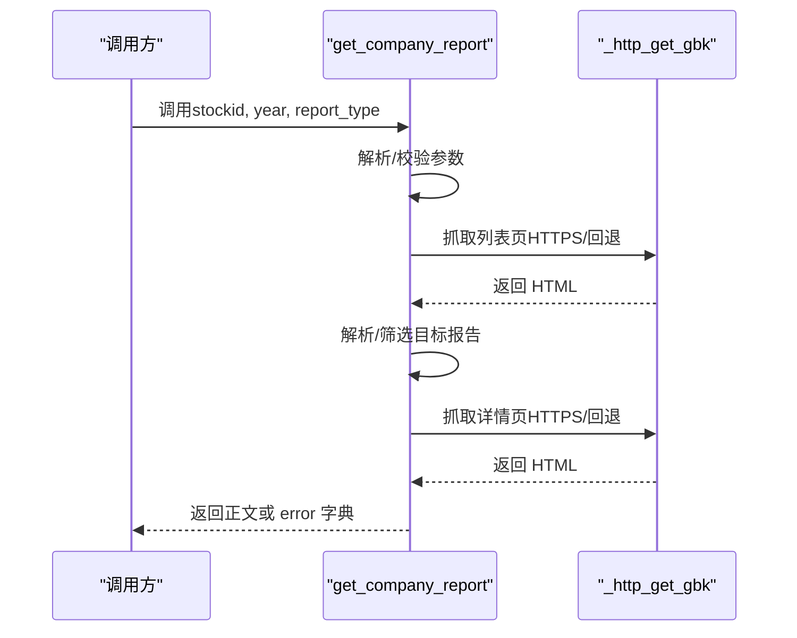

图表来源
- [sina_reports.py:317-368](file://nano-search-mcp/src/nano_search_mcp/tools/sina_reports.py#L317-L368)
- [sina_reports.py:117-153](file://nano-search-mcp/src/nano_search_mcp/tools/sina_reports.py#L117-L153)

章节来源
- [sina_reports.py:317-368](file://nano-search-mcp/src/nano_search_mcp/tools/sina_reports.py#L317-L368)

## 依赖分析
- 外部依赖：mcp、httpx、playwright、beautifulsoup4、markdownify、pyyaml、uvicorn。
- 内部耦合：工具模块通过 FastMCP 注册，共享错误契约与日志约定；客户端封装统一错误类型。
- 循环依赖：未发现循环导入；各模块职责清晰，通过接口契约交互。

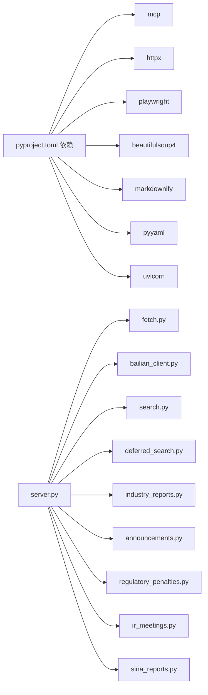

图表来源
- [pyproject.toml:6-14](file://nano-search-mcp/pyproject.toml#L6-L14)
- [server.py:8-69](file://nano-search-mcp/src/nano_search_mcp/server.py#L8-L69)

章节来源
- [pyproject.toml:1-44](file://nano-search-mcp/pyproject.toml#L1-L44)
- [server.py:8-69](file://nano-search-mcp/src/nano_search_mcp/server.py#L8-L69)

## 性能考虑
- 指数退避：统一采用 2^attempt + 随机抖动，降低重试风暴风险。
- 请求节流：各模块内置最小请求间隔，避免对目标站点造成压力。
- 缓存策略：列表页缓存 1 小时，详情页缓存 7 天，显著降低重复抓取成本。
- 截断与清理：页面抓取阶段清理噪声与超长内容，减少下游处理负担。
- 异步与复用：Playwright 浏览器实例惰性创建与复用，降低冷启动开销。

## 故障排查指南
- SSRF 相关
  - 现象：返回 blocked 结果且 error 包含 unsafe_url。
  - 排查：检查 URL 协议、主机是否为 loopback/私网/保留地址；确认 DNS 解析正常。
  - 参考：[fetch.py:186-217](file://nano-search-mcp/src/nano_search_mcp/tools/fetch.py#L186-L217)
- 百炼 MCP 调用失败
  - 现象：BailianMCPError，包含 HTTP 状态码与响应片段。
  - 排查：检查 DASHSCOPE_API_KEY 是否设置；确认 endpoint 可达；查看响应结构是否包含 result/content。
  - 参考：[bailian_client.py:24-92](file://nano-search-mcp/src/nano_search_mcp/tools/bailian_client.py#L24-L92)
- 外部站点不可达/不稳定
  - 现象：RuntimeError，包含“已重试 N 次”与最后错误。
  - 排查：检查网络连通性；观察日志中的退避时间；必要时增加重试次数或放宽超时。
  - 参考：[deferred_search.py:102-139](file://nano-search-mcp/src/nano_search_mcp/tools/deferred_search.py#L102-L139)
- 输入参数非法
  - 现象：ValueError，错误信息包含字段名与期望格式。
  - 排查：核对日期格式（YYYY-MM-DD）、股票代码（6 位数字）、报告类型别名。
  - 参考：[industry_reports.py:50-53](file://nano-search-mcp/src/nano_search_mcp/tools/industry_reports.py#L50-L53)
- 缓存问题
  - 现象：返回旧数据或解析失败。
  - 排查：检查缓存目录权限与磁盘空间；确认 TTL 设置合理；必要时清理缓存。
  - 参考：[industry_reports.py:171-184](file://nano-search-mcp/src/nano_search_mcp/tools/industry_reports.py#L171-L184)

章节来源
- [test_fetch.py:85-98](file://nano-search-mcp/tests/test_fetch.py#L85-L98)
- [bailian_client.py:24-92](file://nano-search-mcp/src/nano_search_mcp/tools/bailian_client.py#L24-L92)
- [deferred_search.py:102-139](file://nano-search-mcp/src/nano_search_mcp/tools/deferred_search.py#L102-L139)
- [industry_reports.py:50-53](file://nano-search-mcp/src/nano_search_mcp/tools/industry_reports.py#L50-L53)
- [industry_reports.py:171-184](file://nano-search-mcp/src/nano_search_mcp/tools/industry_reports.py#L171-L184)

## 结论
本项目在错误处理方面形成了统一的契约与实践：工具模块在失败时返回标准化错误字典，避免异常向上冒泡；通过 SSRF 防护、指数退避重试、请求节流与缓存策略，显著提升了系统的健壮性与性能。建议在后续迭代中进一步完善错误码枚举与日志结构化，以便于监控与自动化诊断。

## 附录

### 错误类型与消息格式
- BailianMCPError
  - 触发场景：认证缺失、HTTP 错误、JSON 解析失败、MCP 返回结构异常。
  - 消息格式：包含 HTTP 状态码与响应片段（截断），便于定位问题。
  - 参考：[bailian_client.py:24-92](file://nano-search-mcp/src/nano_search_mcp/tools/bailian_client.py#L24-L92)
- UnsafeURLError
  - 触发场景：SSRF 校验失败（协议非法、loopback/私网/保留地址、DNS 解析失败）。
  - 消息格式：明确指出禁止的协议或地址类型。
  - 参考：[fetch.py:20-74](file://nano-search-mcp/src/nano_search_mcp/tools/fetch.py#L20-L74)
- ValueError
  - 触发场景：输入参数格式非法（日期、股票代码、报告类型等）。
  - 消息格式：包含字段名与期望格式。
  - 参考：[industry_reports.py:50-53](file://nano-search-mcp/src/nano_search_mcp/tools/industry_reports.py#L50-L53)
- RuntimeError
  - 触发场景：外部站点抓取失败、解析异常、缓存写入失败。
  - 消息格式：包含“已重试 N 次”与最后错误，便于定位。
  - 参考：[deferred_search.py:102-139](file://nano-search-mcp/src/nano_search_mcp/tools/deferred_search.py#L102-L139)

### 错误恢复策略与重试机制
- 指数退避：退避时间 = 2^attempt + 随机抖动（0.2~0.8），最多 3 次。
- HTTPS 回退：抓取失败时自动回退到 HTTP。
- 早停优化：IR 抓取根据页面最旧日期提前停止翻页。
- 缓存命中：优先使用缓存，降低失败概率与请求压力。
- 参考：[deferred_search.py:102-139](file://nano-search-mcp/src/nano_search_mcp/tools/deferred_search.py#L102-L139)，[ir_meetings.py:452-457](file://nano-search-mcp/src/nano_search_mcp/tools/ir_meetings.py#L452-L457)，[sina_reports.py:117-153](file://nano-search-mcp/src/nano_search_mcp/tools/sina_reports.py#L117-L153)

### 日志记录规范与调试信息格式
- 日志级别：warning（重试与异常）、error（严重错误）、info（操作开始与完成）。
- 日志内容：包含模块标识、URL、错误类型与简要上下文。
- 参考：各工具模块中的 logger.warning/logger.error/logger.info 调用。