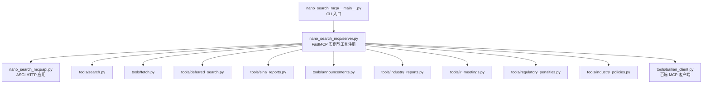
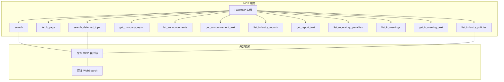
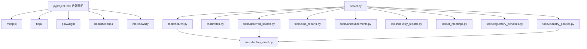

# API 接口参考

<cite>
**本文引用的文件**
- [api.py](file://nano-search-mcp/src/nano_search_mcp/api.py)
- [server.py](file://nano-search-mcp/src/nano_search_mcp/server.py)
- [__main__.py](file://nano-search-mcp/src/nano_search_mcp/__main__.py)
- [pyproject.toml](file://nano-search-mcp/pyproject.toml)
- [README.md](file://nano-search-mcp/README.md)
- [bailian_client.py](file://nano-search-mcp/src/nano_search_mcp/tools/bailian_client.py)
- [search.py](file://nano-search-mcp/src/nano_search_mcp/tools/search.py)
- [fetch.py](file://nano-search-mcp/src/nano_search_mcp/tools/fetch.py)
- [deferred_search.py](file://nano-search-mcp/src/nano_search_mcp/tools/deferred_search.py)
- [sina_reports.py](file://nano-search-mcp/src/nano_search_mcp/tools/sina_reports.py)
- [announcements.py](file://nano-search-mcp/src/nano_search_mcp/tools/announcements.py)
- [industry_reports.py](file://nano-search-mcp/src/nano_search_mcp/tools/industry_reports.py)
- [ir_meetings.py](file://nano-search-mcp/src/nano_search_mcp/tools/ir_meetings.py)
- [regulatory_penalties.py](file://nano-search-mcp/src/nano_search_mcp/tools/regulatory_penalties.py)
- [industry_policies.py](file://nano-search-mcp/src/nano_search_mcp/tools/industry_policies.py)
</cite>

## 目录
1. [简介](#简介)
2. [项目结构](#项目结构)
3. [核心组件](#核心组件)
4. [架构总览](#架构总览)
5. [详细组件分析](#详细组件分析)
6. [依赖分析](#依赖分析)
7. [性能考虑](#性能考虑)
8. [故障排查指南](#故障排查指南)
9. [结论](#结论)
10. [附录](#附录)

## 简介
本文件为 NanoSearch MCP 服务的完整接口参考，覆盖 12 个 MCP 工具的接口规范、请求参数、响应格式、错误契约与典型用法。服务基于 MCP 协议，提供 HTTP Streamable Transport 与 stdio 两种传输方式，适合作为外部证据采集与检索的可复用服务。

- 传输方式
  - HTTP Streamable Transport：默认监听 http://127.0.0.1:8000/mcp
  - stdio Transport：便于与 MCP 客户端直接对接
- 认证与安全
  - 百炼 WebSearch 依赖 DashScope API Key
  - 多处 SSRF 防护与域名白名单
- 错误契约
  - search 与 get_company_report 在参数非法或网络彻底失败时抛异常
  - 其余工具失败时返回统一的不可用结构，不抛异常

**章节来源**
- [server.py:18-58](file://nano-search-mcp/src/nano_search_mcp/server.py#L18-L58)
- [README.md:26-104](file://nano-search-mcp/README.md#L26-L104)

## 项目结构
- 包结构
  - nano_search_mcp.api：ASGI HTTP 应用入口
  - nano_search_mcp.server：MCP 服务主入口，注册 12 个工具
  - nano_search_mcp.tools.*：各工具实现与百炼客户端封装
- CLI 与安装
  - 通过命令行启动 MCP 服务，或以 Python 包导入使用

**图表来源**
- [__main__.py:6-11](file://nano-search-mcp/src/nano_search_mcp/__main__.py#L6-L11)
- [server.py:18-69](file://nano-search-mcp/src/nano_search_mcp/server.py#L18-L69)
- [api.py:3-11](file://nano-search-mcp/src/nano_search_mcp/api.py#L3-L11)

**章节来源**
- [pyproject.toml:1-44](file://nano-search-mcp/pyproject.toml#L1-L44)
- [README.md:178-198](file://nano-search-mcp/README.md#L178-L198)

## 核心组件
- FastMCP 实例与工具注册
  - 服务名称与指令说明
  - 工具注册顺序：搜索、抓取、行业研报、延迟检索、公告、研报、监管处罚、IR、行业政策
- HTTP 兼容入口
  - 通过 mcp.streamable_http_app() 提供标准 MCP HTTP 应用
- CLI 入口
  - 透传命令行参数，启动 MCP 服务

**章节来源**
- [server.py:18-86](file://nano-search-mcp/src/nano_search_mcp/server.py#L18-L86)
- [api.py:3-11](file://nano-search-mcp/src/nano_search_mcp/api.py#L3-L11)
- [__main__.py:6-11](file://nano-search-mcp/src/nano_search_mcp/__main__.py#L6-L11)

## 架构总览
- MCP 协议与传输
  - 服务通过 FastMCP 提供工具接口，支持 HTTP Streamable Transport 与 stdio
  - HTTP 默认路径 /mcp
- 工具域划分
  - 通用检索：search、fetch_page、search_deferred_topic
  - 定期报告：get_company_report
  - 临时公告：list_announcements、get_announcement_text
  - 行业研报：list_industry_reports、get_report_text
  - 监管处罚：list_regulatory_penalties
  - 投资者关系：list_ir_meetings、get_ir_meeting_text
  - 行业政策：list_industry_policies

**图表来源**
- [server.py:61-69](file://nano-search-mcp/src/nano_search_mcp/server.py#L61-L69)
- [bailian_client.py:12-15](file://nano-search-mcp/src/nano_search_mcp/tools/bailian_client.py#L12-L15)

**章节来源**
- [server.py:18-58](file://nano-search-mcp/src/nano_search_mcp/server.py#L18-L58)

## 详细组件分析

### 通用检索

#### 工具：search
- 功能：基于百炼 WebSearch 的网页搜索，返回标题、URL、摘要列表
- 请求参数
  - query: 关键词（必填）
  - max_results: 结果数量 [1,30]，默认 5
  - region: 搜索区域代码，默认 zh-cn
  - timelimit: 时间范围过滤 d/w/m/y 或 None
- 响应
  - 列表，每项包含 title/url/snippet
- 错误
  - 百炼 MCP 调用失败时抛异常
- 典型用法
  - 搜索关键词 + 限定时间范围 + 限定区域
- 示例
  - 请求：search(query="宁德时代 年报 site:sina.com.cn", max_results=5, region="zh-cn", timelimit="y")
  - 响应：包含若干条搜索结果

**章节来源**
- [search.py:82-118](file://nano-search-mcp/src/nano_search_mcp/tools/search.py#L82-L118)

#### 工具：fetch_page
- 功能：抓取任意 URL 正文（Markdown），Playwright 渲染 + HTML 清洗
- 请求参数
  - url: 绝对 URL（http/https）
- 响应
  - 字段：url/content/method/truncated/error
  - method: playwright 或 blocked
  - truncated: 是否截断（>50 万字符）
- 错误
  - 不抛异常；失败时返回 error 字段
- 安全
  - 严格 SSRF 防护：协议白名单、禁止 loopback/私网/云元数据等
- 示例
  - 请求：fetch_page(url="https://example.com/article")
  - 响应：content 为正文，truncated 标识是否截断

**章节来源**
- [fetch.py:223-244](file://nano-search-mcp/src/nano_search_mcp/tools/fetch.py#L223-L244)

#### 工具：search_deferred_topic
- 功能：基于预置主题模板或自由查询的百炼 WebSearch 检索，支持上下文变量填充
- 请求参数
  - topic_id: 主题标识符（自由查询模式可传任意字符串）
  - query_override: 覆盖模板的查询词（非空时忽略模板）
  - max_results: 结果数量 [1,30]，默认 10
  - region: 地区提示，默认 cn-zh
  - context: 模板变量字典（如行业、股票代码）
- 响应
  - 成功：包含 topic_id/query/source/results/fetch_time
  - 失败：包含 topic_id/source/unavailable/error/fetch_time
- 重试
  - 3 次指数退避重试
- 示例
  - 请求：search_deferred_topic(topic_id="policy-2026", query_override="", max_results=10, region="cn-zh", context={"industry":"光伏设备","ts_code":"600660.SH"})

**章节来源**
- [deferred_search.py:148-237](file://nano-search-mcp/src/nano_search_mcp/tools/deferred_search.py#L148-L237)

### 定期报告

#### 工具：get_company_report
- 功能：获取指定年份的年报/半年报/一季报/三季报全文正文（新浪财经）
- 请求参数
  - stockid: 6 位数字股票代码
  - year: 年份（必填，必须明确）
  - report_type: annual/semi/q1/q3 或中文别名，默认 annual
- 响应
  - 返回正文全文（含标题、发布日期、来源链接）
- 错误
  - 参数非法或找不到报告时报错；其余工具失败返回不可用结构
- 示例
  - 请求：get_company_report(stockid="300750", year=2023, report_type="q1")
  - 响应：包含报告正文

**章节来源**
- [sina_reports.py:317-368](file://nano-search-mcp/src/nano_search_mcp/tools/sina_reports.py#L317-L368)

### 临时公告

#### 工具：list_announcements
- 功能：列出指定公司临时公告条目（支持按公告类型过滤）
- 请求参数
  - ts_code: Tushare 格式股票代码（如 688270.SH）
  - start_date: 起始日期 YYYY-MM-DD，默认当年 1 月 1 日
  - end_date: 结束日期 YYYY-MM-DD，默认今日
  - ann_types: 过滤类型列表（inquiry/audit/accountant_change/litigation/penalty/restatement/other）
- 响应
  - 成功：ts_code/source/announcements[]
  - 失败：ts_code/source/unavailable/error/fetch_time
- 示例
  - 请求：list_announcements(ts_code="688270.SH", start_date="2025-01-01", end_date="2025-12-31", ann_types=["penalty"])

**章节来源**
- [announcements.py:407-489](file://nano-search-mcp/src/nano_search_mcp/tools/announcements.py#L407-L489)

#### 工具：get_announcement_text
- 功能：抓取单条公告全文正文
- 请求参数
  - source_url: list_announcements 返回的条目 source_url
- 响应
  - 成功：source_url/full_text/extracted_at
  - 失败：同结构，full_text 为空并附 error
- 示例
  - 请求：get_announcement_text(source_url="http://vip.stock.finance.sina.com.cn/...")

**章节来源**
- [announcements.py:491-534](file://nano-search-mcp/src/nano_search_mcp/tools/announcements.py#L491-L534)

### 行业研报

#### 工具：list_industry_reports
- 功能：列出券商发布的行业研究报告（支持按行业或关键词过滤）
- 请求参数
  - industry_sw_l2: 申万二级行业名
  - keywords: 标题关键词白名单
  - start_date: 起始日期 YYYY-MM-DD，默认近 1 年
  - end_date: 结束日期 YYYY-MM-DD，默认今日
  - limit: 返回条数 [1,200]，默认 50
  - ts_code: Tushare 格式股票代码（提供则自动路由至所属行业）
- 响应
  - 成功：industry_sw_l2/source/reports[]（含 report_date/publisher/title/industry_tags/source_url/summary）
  - 失败：industry_sw_l2/source/unavailable/error/fetch_time
- 示例
  - 请求：list_industry_reports(industry_sw_l2="光伏设备", keywords=["电池片"], start_date="2025-01-01", end_date="2025-12-31", limit=50, ts_code="600660.SH")

**章节来源**
- [industry_reports.py:384-457](file://nano-search-mcp/src/nano_search_mcp/tools/industry_reports.py#L384-L457)

#### 工具：get_report_text
- 功能：抓取单条行业研报全文正文
- 请求参数
  - source_url: list_industry_reports 返回的条目 source_url
- 响应
  - 成功：source_url/full_text/extracted_at
  - 失败：同结构，full_text 为空并附 error
- 示例
  - 请求：get_report_text(source_url="https://stock.finance.sina.com.cn/...")

**章节来源**
- [industry_reports.py:459-494](file://nano-search-mcp/src/nano_search_mcp/tools/industry_reports.py#L459-L494)

### 监管处罚

#### 工具：list_regulatory_penalties
- 功能：列出指定公司监管处罚/违规处理记录（新浪财经违规处理页）
- 请求参数
  - ts_code: Tushare 格式股票代码
  - start_date: 起始日期 YYYY-MM-DD（可选）
  - end_date: 结束日期 YYYY-MM-DD（可选）
- 响应
  - 成功：ts_code/source/penalties[]（含 punish_date/event_type/title/reason/content/issuer/source_url）
  - 失败：ts_code/source/unavailable/error/fetch_time
- 示例
  - 请求：list_regulatory_penalties(ts_code="688270.SH", start_date="2025-01-01", end_date="2025-12-31")

**章节来源**
- [regulatory_penalties.py:396-446](file://nano-search-mcp/src/nano_search_mcp/tools/regulatory_penalties.py#L396-L446)

### 投资者关系

#### 工具：list_ir_meetings
- 功能：列出机构调研/业绩说明会等 IR 活动记录
- 请求参数
  - ts_code: Tushare 格式股票代码
  - start_date: 起始日期 YYYY-MM-DD，默认近 6 个月
  - end_date: 结束日期 YYYY-MM-DD，默认今日
  - meeting_types: 过滤类型 research/earnings_call/site_visit/other
- 响应
  - 成功：ts_code/source/meetings[]（含 meeting_date/meeting_type/participants/title/summary/source_url）
  - 失败：ts_code/source/unavailable/error/fetch_time
- 示例
  - 请求：list_ir_meetings(ts_code="000001.SZ", start_date="2025-01-01", end_date="2025-12-31", meeting_types=["earnings_call"])

**章节来源**
- [ir_meetings.py:492-568](file://nano-search-mcp/src/nano_search_mcp/tools/ir_meetings.py#L492-L568)

#### 工具：get_ir_meeting_text
- 功能：抓取单条 IR 纪要/调研记录表全文，并抽取参会机构
- 请求参数
  - source_url: list_ir_meetings 返回的条目 source_url
- 响应
  - 成功：source_url/full_text/participants/extracted_at
  - 失败：同结构，full_text 为空并附 error
- 示例
  - 请求：get_ir_meeting_text(source_url="http://vip.stock.finance.sina.com.cn/...")

**章节来源**
- [ir_meetings.py:570-617](file://nano-search-mcp/src/nano_search_mcp/tools/ir_meetings.py#L570-L617)

### 行业政策

#### 工具：list_industry_policies
- 功能：检索 *.gov.cn 近一年内的行业政策文件
- 请求参数
  - industry_sw_l2: 申万二级行业名
  - keywords: 业务关键词列表
- 响应
  - 成功：industry_sw_l2/source/policies[]（含 pub_date/issuer/title/level/source_url/summary），fetch_time
  - 未命中：同上但 policies 为空并附 coverage_note
  - 失败：industry_sw_l2/source/unavailable/error/fetch_time
- 示例
  - 请求：list_industry_policies(industry_sw_l2="光伏设备", keywords=["电池片","储能"])

**章节来源**
- [industry_policies.py:188-245](file://nano-search-mcp/src/nano_search_mcp/tools/industry_policies.py#L188-L245)

## 依赖分析
- 外部依赖
  - mcp[cli]：MCP 协议与传输
  - httpx：HTTP 客户端
  - playwright：页面渲染与抓取
  - beautifulsoup4/markdownify：HTML 解析与 Markdown 转换
  - dashscope API Key：百炼 WebSearch 认证
- 内部依赖
  - tools/bailian_client：统一的百炼 MCP 客户端封装
  - server.py：注册 12 个工具到 FastMCP 实例

**图表来源**
- [pyproject.toml:6-14](file://nano-search-mcp/pyproject.toml#L6-L14)
- [server.py:8-16](file://nano-search-mcp/src/nano_search_mcp/server.py#L8-L16)

**章节来源**
- [pyproject.toml:6-14](file://nano-search-mcp/pyproject.toml#L6-L14)

## 性能考虑
- 请求超时
  - Playwright 抓取默认超时 30 秒
  - 百炼 MCP 默认超时 30 秒，可通过环境变量覆盖
- 限速与退避
  - 各数据源普遍采用指数退避重试（最多 3 次）
  - 请求间隔控制（如 1 秒），避免触发目标站点限流
- 缓存
  - 列表页缓存 1 小时，详情页缓存 7 天
- 建议
  - 在网关或反向代理设置足够长的超时，覆盖最慢的 fetch_page 或 get_company_report
  - 合理设置 max_results 与 limit，避免一次性返回过多数据

**章节来源**
- [README.md:104](file://nano-search-mcp/README.md#L104)
- [bailian_client.py:20-21](file://nano-search-mcp/src/nano_search_mcp/tools/bailian_client.py#L20-L21)
- [fetch.py:169](file://nano-search-mcp/src/nano_search_mcp/tools/fetch.py#L169)
- [announcements.py:48](file://nano-search-mcp/src/nano_search_mcp/tools/announcements.py#L48)
- [industry_reports.py:38](file://nano-search-mcp/src/nano_search_mcp/tools/industry_reports.py#L38)
- [ir_meetings.py:71](file://nano-search-mcp/src/nano_search_mcp/tools/ir_meetings.py#L71)
- [regulatory_penalties.py:49](file://nano-search-mcp/src/nano_search_mcp/tools/regulatory_penalties.py#L49)
- [industry_policies.py:28-31](file://nano-search-mcp/src/nano_search_mcp/tools/industry_policies.py#L28-L31)

## 故障排查指南
- 认证问题
  - 缺少 DASHSCOPE_API_KEY：百炼 MCP 调用会失败
  - 建议：设置环境变量 DASHSCOPE_API_KEY
- SSRF 防护
  - fetch_page 拒绝 file://、loopback、RFC1918 私网、云元数据端点等
  - 建议：仅使用 http/https 绝对 URL
- 参数校验
  - stockid 必须为 6 位数字；日期格式必须为 YYYY-MM-DD
  - 建议：在调用前进行格式与范围校验
- 网络与超时
  - 百炼 WebSearch 与各站点可能不稳定，工具内置重试
  - 建议：在网关设置足够长的超时，避免中途中断
- 错误返回
  - 失败时统一返回 source: "unavailable" + error + fetch_time
  - 建议：捕获并记录错误，必要时重试或降级

**章节来源**
- [bailian_client.py:28-36](file://nano-search-mcp/src/nano_search_mcp/tools/bailian_client.py#L28-L36)
- [fetch.py:24-74](file://nano-search-mcp/src/nano_search_mcp/tools/fetch.py#L24-L74)
- [announcements.py:85-124](file://nano-search-mcp/src/nano_search_mcp/tools/announcements.py#L85-L124)
- [industry_reports.py:50-96](file://nano-search-mcp/src/nano_search_mcp/tools/industry_reports.py#L50-L96)
- [ir_meetings.py:137-178](file://nano-search-mcp/src/nano_search_mcp/tools/ir_meetings.py#L137-L178)
- [regulatory_penalties.py:66-82](file://nano-search-mcp/src/nano_search_mcp/tools/regulatory_penalties.py#L66-L82)
- [industry_policies.py:94-167](file://nano-search-mcp/src/nano_search_mcp/tools/industry_policies.py#L94-L167)

## 结论
本接口参考文档系统梳理了 NanoSearch MCP 服务的 12 个工具，明确了参数、响应与错误契约，并提供了安全与性能方面的最佳实践。服务通过 MCP 协议提供统一的检索与抓取能力，适合在外部证据采集与研究场景中复用。

## 附录

### HTTP REST API 与 MCP 协议
- HTTP Streamable Transport
  - 默认路径：/mcp
  - 通过 mcp.streamable_http_app() 提供标准 MCP HTTP 应用
- stdio Transport
  - 适合与 MCP 客户端直接对接
- 认证
  - 百炼 WebSearch 依赖 DASHSCOPE_API_KEY
  - Authorization: Bearer ${DASHSCOPE_API_KEY}

**章节来源**
- [api.py:3-6](file://nano-search-mcp/src/nano_search_mcp/api.py#L3-L6)
- [server.py:72-86](file://nano-search-mcp/src/nano_search_mcp/server.py#L72-L86)
- [bailian_client.py:28-36](file://nano-search-mcp/src/nano_search_mcp/tools/bailian_client.py#L28-L36)

### 版本管理与向后兼容
- 版本
  - 包版本：0.1.0
- 兼容性
  - 服务按能力域提供工具，接口以 docstring 为准
  - 错误契约：search/get_company_report 抛异常；其余工具返回不可用结构
  - 建议：调用方遵循错误契约，避免强依赖特定错误码

**章节来源**
- [pyproject.toml:2-4](file://nano-search-mcp/pyproject.toml#L2-L4)
- [server.py:55-56](file://nano-search-mcp/src/nano_search_mcp/server.py#L55-L56)