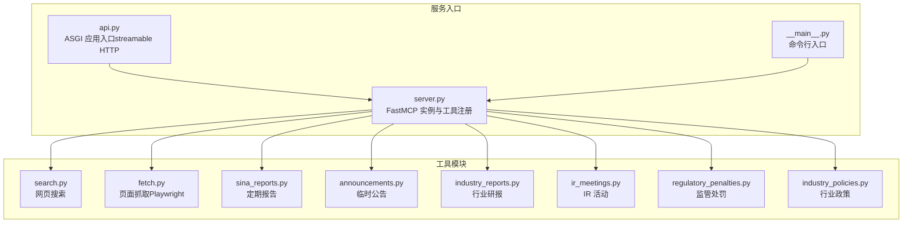
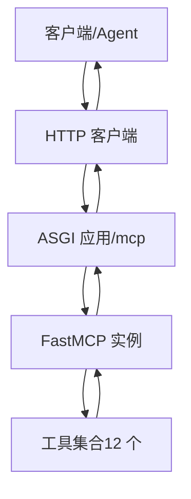
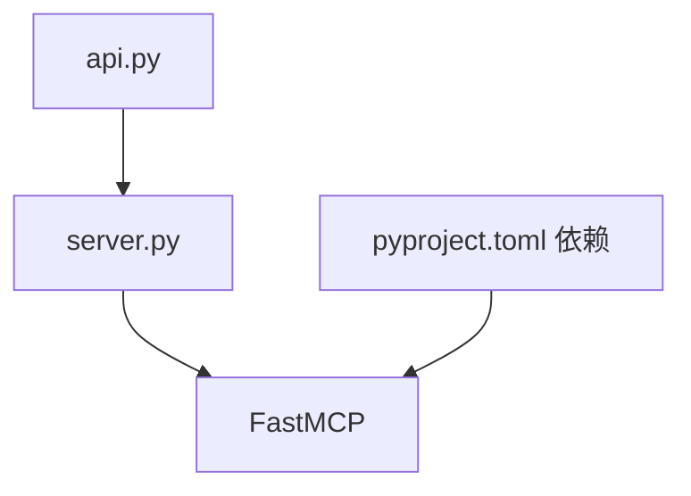

# HTTP REST API

<cite>
**本文引用的文件**
- [api.py](file://nano-search-mcp/src/nano_search_mcp/api.py)
- [server.py](file://nano-search-mcp/src/nano_search_mcp/server.py)
- [__main__.py](file://nano-search-mcp/src/nano_search-mcp/__main__.py)
- [pyproject.toml](file://nano-search-mcp/pyproject.toml)
- [README.md](file://nano-search-mcp/README.md)
- [search.py](file://nano-search-mcp/src/nano_search_mcp/tools/search.py)
- [fetch.py](file://nano-search-mcp/src/nano_search_mcp/tools/fetch.py)
- [sina_reports.py](file://nano-search-mcp/src/nano_search_mcp/tools/sina_reports.py)
- [announcements.py](file://nano-search-mcp/src/nano_search_mcp/tools/announcements.py)
- [industry_reports.py](file://nano-search-mcp/src/nano_search_mcp/tools/industry_reports.py)
- [ir_meetings.py](file://nano-search-mcp/src/nano_search_mcp/tools/ir_meetings.py)
- [regulatory_penalties.py](file://nano-search-mcp/src/nano_search_mcp/tools/regulatory_penalties.py)
- [industry_policies.py](file://nano-search-mcp/src/nano_search_mcp/tools/industry_policies.py)
</cite>

## 目录
1. [简介](#简介)
2. [项目结构](#项目结构)
3. [核心组件](#核心组件)
4. [架构总览](#架构总览)
5. [详细组件分析](#详细组件分析)
6. [依赖分析](#依赖分析)
7. [性能考量](#性能考量)
8. [故障排查指南](#故障排查指南)
9. [结论](#结论)
10. [附录](#附录)

## 简介
本文件为基于 Streamable HTTP 的 HTTP REST API 接口文档，面向 NanoSearch MCP 服务。该服务提供 12 个 MCP 工具，涵盖网页搜索、页面抓取、定期报告、临时公告、行业研报、监管处罚、投资者关系(IR)活动、行业政策等能力域。服务默认通过 streamable HTTP 监听路径 “/mcp”，并提供兼容的 ASGI 应用入口。

- 服务默认监听地址与路径：http://127.0.0.1:8000/mcp
- 传输方式：默认 streamable HTTP；亦支持 stdio 传输（用于与 MCP 客户端直连）

本接口文档将说明：
- 请求方法、URL 路径、请求头与请求体格式
- 响应状态码、响应体结构与错误格式
- 认证机制、CORS 配置与安全考虑
- API 版本控制与向后兼容性说明
- 完整调用示例（以工具维度）

## 项目结构
NanoSearch MCP 服务采用模块化设计，核心入口与工具注册集中在 server.py，HTTP 兼容入口在 api.py，命令行入口在 __main__.py。工具按能力域分布在 tools/ 目录下。

**图表来源**
- [server.py:19-70](file://nano-search-mcp/src/nano_search_mcp/server.py#L19-L70)
- [api.py:6-6](file://nano-search-mcp/src/nano_search_mcp/api.py#L6-L6)
- [__main__.py:9-12](file://nano-search-mcp/src/nano_search-mcp/__main__.py#L9-L12)

**章节来源**
- [server.py:1-91](file://nano-search-mcp/src/nano_search_mcp/server.py#L1-L91)
- [api.py:1-12](file://nano-search-mcp/src/nano_search_mcp/api.py#L1-L12)
- [__main__.py:1-15](file://nano-search-mcp/src/nano_search-mcp/__main__.py#L1-L15)

## 核心组件
- FastMCP 实例：负责注册工具、生成指令与元数据，提供 streamable HTTP 路径。
- ASGI 应用：通过 mcp.streamable_http_app() 获取，绑定到 /mcp。
- 命令行入口：支持以 stdio 或 streamable HTTP 启动服务。
- 工具集合：12 个 MCP 工具，覆盖搜索、抓取、报告、公告、研报、IR、监管、政策等。

**章节来源**
- [server.py:19-70](file://nano-search-mcp/src/nano_search_mcp/server.py#L19-L70)
- [api.py:6-6](file://nano-search-mcp/src/nano_search_mcp/api.py#L6-L6)
- [README.md:28-48](file://nano-search-mcp/README.md#L28-L48)

## 架构总览
NanoSearch MCP 服务基于 FastMCP，通过 streamable HTTP 提供统一的 HTTP REST 接口。客户端（Agent 或网关）通过 HTTP 请求调用 MCP 工具，服务端将请求映射到对应工具函数并返回结构化结果。

**图表来源**
- [server.py:19-70](file://nano-search-mcp/src/nano_search_mcp/server.py#L19-L70)
- [api.py:6-6](file://nano-search-mcp/src/nano_search_mcp/api.py#L6-L6)

## 详细组件分析

### 通用接口规范
- 基础路径：/mcp
- 请求方法：POST
- Content-Type：application/json
- Accept：application/json
- 身份认证：本服务未内置认证头或令牌校验，通常由前置网关或反向代理负责鉴权与授权。
- CORS：本服务未内置 CORS 处理，如需跨域访问，请在网关或反向代理层配置。

注意：由于服务未内置认证与 CORS，调用方应在部署层面确保：
- 仅在受信网络内暴露 /mcp
- 通过网关/反向代理设置 Access-Control-Allow-* 与鉴权头
- 限制请求超时，确保一次工具调用在超时内完成

**章节来源**
- [README.md:88-104](file://nano-search-mcp/README.md#L88-L104)

### 工具清单与调用方式
以下为 12 个 MCP 工具的调用方式与响应结构概览。每个工具均通过 HTTP POST /mcp 提交 JSON 请求体，请求体包含工具名与参数，响应体为工具返回的结构化数据。

- 工具：search
  - 方法：POST /mcp
  - 请求体字段：{
      "method": "search",
      "params": {
        "query": "字符串，必填",
        "max_results": "整数，1-30",
        "region": "字符串，如 zh-cn/us-en/uk-en/wt-wt",
        "timelimit": "可选，d/w/m/y"
      }
    }
  - 响应体：数组，元素为 {title, url, snippet}

- 工具：fetch_page
  - 方法：POST /mcp
  - 请求体字段：{
      "method": "fetch_page",
      "params": {
        "url": "字符串，HTTP/HTTPS 绝对 URL"
      }
    }
  - 响应体：{
      "url": "字符串",
      "content": "字符串（Markdown）",
      "method": "playwright|blocked",
      "truncated": "布尔",
      "error": "字符串（失败时存在）"
    }

- 工具：get_company_report
  - 方法：POST /mcp
  - 请求体字段：{
      "method": "get_company_report",
      "params": {
        "stockid": "字符串，6 位数字",
        "year": "整数，四位年份",
        "report_type": "字符串，annual/semi/q1/q3 或中文别名"
      }
    }
  - 响应体：字符串（报告正文，含标题、日期、来源）

- 工具：list_announcements
  - 方法：POST /mcp
  - 请求体字段：{
      "method": "list_announcements",
      "params": {
        "ts_code": "字符串，Tushare 格式，如 600519.SH",
        "start_date": "字符串，YYYY-MM-DD",
        "end_date": "字符串，YYYY-MM-DD",
        "ann_types": "数组，可选过滤类型"
      }
    }
  - 响应体：{
      "ts_code": "字符串",
      "source": "sina 或 unavailable",
      "announcements": "数组，元素为 {ann_date,title,ann_type,source_url,pdf_url}"
    }

- 工具：get_announcement_text
  - 方法：POST /mcp
  - 请求体字段：{
      "method": "get_announcement_text",
      "params": {
        "source_url": "字符串，来自 list_announcements 的 source_url"
      }
    }
  - 响应体：{
      "source_url": "字符串",
      "full_text": "字符串（正文）",
      "extracted_at": "ISO8601 UTC 时间戳",
      "error": "字符串（失败时存在）"
    }

- 工具：list_industry_reports
  - 方法：POST /mcp
  - 请求体字段：{
      "method": "list_industry_reports",
      "params": {
        "industry_sw_l2": "字符串，申万二级行业名",
        "keywords": "数组，关键词白名单",
        "start_date": "字符串，YYYY-MM-DD",
        "end_date": "字符串，YYYY-MM-DD",
        "limit": "整数，1-200",
        "ts_code": "字符串，Tushare 格式"
      }
    }
  - 响应体：{
      "industry_sw_l2": "字符串",
      "source": "sina 或 unavailable",
      "reports": "数组，元素为 {report_date,publisher,title,industry_tags,source_url,summary}"
    }

- 工具：get_report_text
  - 方法：POST /mcp
  - 请求体字段：{
      "method": "get_report_text",
      "params": {
        "source_url": "字符串，来自 list_industry_reports 的 source_url"
      }
    }
  - 响应体：{
      "source_url": "字符串",
      "full_text": "字符串（正文）",
      "extracted_at": "ISO8601 UTC 时间戳",
      "error": "字符串（失败时存在）"
    }

- 工具：list_ir_meetings
  - 方法：POST /mcp
  - 请求体字段：{
      "method": "list_ir_meetings",
      "params": {
        "ts_code": "字符串，Tushare 格式",
        "start_date": "字符串，YYYY-MM-DD",
        "end_date": "字符串，YYYY-MM-DD",
        "meeting_types": "数组，可选过滤类型"
      }
    }
  - 响应体：{
      "ts_code": "字符串",
      "source": "sina 或 unavailable",
      "meetings": "数组，元素为 {meeting_date,meeting_type,participants,title,summary,source_url}"
    }

- 工具：get_ir_meeting_text
  - 方法：POST /mcp
  - 请求体字段：{
      "method": "get_ir_meeting_text",
      "params": {
        "source_url": "字符串，来自 list_ir_meetings 的 source_url"
      }
    }
  - 响应体：{
      "source_url": "字符串",
      "full_text": "字符串（正文）",
      "participants": "数组（机构名称）",
      "extracted_at": "ISO8601 UTC 时间戳",
      "error": "字符串（失败时存在）"
    }

- 工具：list_regulatory_penalties
  - 方法：POST /mcp
  - 请求体字段：{
      "method": "list_regulatory_penalties",
      "params": {
        "ts_code": "字符串，Tushare 格式",
        "start_date": "字符串，YYYY-MM-DD",
        "end_date": "字符串，YYYY-MM-DD"
      }
    }
  - 响应体：{
      "ts_code": "字符串",
      "source": "sina 或 unavailable",
      "penalties": "数组，元素为 {punish_date,event_type,title,reason,content,issuer,source_url}"
    }

- 工具：list_industry_policies
  - 方法：POST /mcp
  - 请求体字段：{
      "method": "list_industry_policies",
      "params": {
        "industry_sw_l2": "字符串，申万二级行业名",
        "keywords": "数组，关键词列表"
      }
    }
  - 响应体：{
      "industry_sw_l2": "字符串",
      "source": "bailian_web_search_gov_cn 或 unavailable",
      "policies": "数组，元素为 {pub_date,issuer,title,level,source_url,summary}",
      "fetch_time": "ISO8601 UTC 时间戳",
      "coverage_note": "字符串（无结果时存在）"
    }

- 工具：search_deferred_topic
  - 方法：POST /mcp
  - 请求体字段：{
      "method": "search_deferred_topic",
      "params": {
        "template": "字符串，模板名或查询模板",
        "context": "对象，上下文变量"
      }
    }
  - 响应体：数组，元素为 {title,url,snippet}

说明：
- 所有工具均通过 HTTP POST /mcp 调用，请求体为标准 MCP JSON 结构。
- 失败时（除特定工具外），返回包含 source 与 error 的字典，不抛异常。
- 响应体字段与类型以各工具定义为准。

**章节来源**
- [server.py:18-70](file://nano-search-mcp/src/nano_search_mcp/server.py#L18-L70)
- [search.py:79-119](file://nano-search-mcp/src/nano_search_mcp/tools/search.py#L79-L119)
- [fetch.py:220-245](file://nano-search-mcp/src/nano_search_mcp/tools/fetch.py#L220-L245)
- [sina_reports.py:314-369](file://nano-search-mcp/src/nano_search_mcp/tools/sina_reports.py#L314-L369)
- [announcements.py:404-535](file://nano-search-mcp/src/nano_search_mcp/tools/announcements.py#L404-L535)
- [industry_reports.py:384-495](file://nano-search-mcp/src/nano_search_mcp/tools/industry_reports.py#L384-L495)
- [ir_meetings.py:489-618](file://nano-search-mcp/src/nano_search_mcp/tools/ir_meetings.py#L489-L618)
- [regulatory_penalties.py:393-447](file://nano-search-mcp/src/nano_search_mcp/tools/regulatory_penalties.py#L393-L447)
- [industry_policies.py:185-246](file://nano-search-mcp/src/nano_search_mcp/tools/industry_policies.py#L185-L246)

### 错误处理与响应格式
- 成功响应：返回工具定义的数据结构。
- 失败响应（非 search/get_company_report）：返回 {
    "source": "unavailable",
    "error": "字符串",
    "fetch_time": "ISO8601 UTC 时间戳"
  }。
- 失败响应（search/get_company_report）：抛出异常（由 MCP 层转换为标准错误响应）。
- 通用错误字段：
  - error：错误描述
  - fetch_time：UTC 时间戳（用于记录抓取时间）

**章节来源**
- [server.py:55-56](file://nano-search-mcp/src/nano_search_mcp/server.py#L55-L56)
- [announcements.py:456-470](file://nano-search-mcp/src/nano_search_mcp/tools/announcements.py#L456-L470)
- [industry_reports.py:445-451](file://nano-search-mcp/src/nano_search_mcp/tools/industry_reports.py#L445-L451)
- [ir_meetings.py:542-556](file://nano-search-mcp/src/nano_search_mcp/tools/ir_meetings.py#L542-L556)
- [regulatory_penalties.py:346-353](file://nano-search-mcp/src/nano_search_mcp/tools/regulatory_penalties.py#L346-L353)
- [industry_policies.py:226-233](file://nano-search-mcp/src/nano_search_mcp/tools/industry_policies.py#L226-L233)

### 安全与防护
- SSRF 防护：
  - fetch_page：仅允许 http/https，拒绝 file://、loopback、RFC1918、链路本地等。
  - 各抓取工具：严格限定域名白名单，拒绝非目标域访问。
- 速率限制与退避：各抓取工具内置指数退避与请求间隔，降低被封禁风险。
- 内容清洗：抓取后进行 HTML 清洗与正文提取，避免噪声干扰。
- 缓存：部分工具（公告、研报、IR、监管、政策）使用本地缓存，减少重复抓取。

**章节来源**
- [fetch.py:24-74](file://nano-search-mcp/src/nano_search_mcp/tools/fetch.py#L24-L74)
- [sina_reports.py:124-125](file://nano-search-mcp/src/nano_search_mcp/tools/sina_reports.py#L124-L125)
- [announcements.py:151-153](file://nano-search-mcp/src/nano_search_mcp/tools/announcements.py#L151-L153)
- [industry_reports.py:130-131](file://nano-search-mcp/src/nano_search_mcp/tools/industry_reports.py#L130-L131)
- [ir_meetings.py:203-205](file://nano-search-mcp/src/nano_search_mcp/tools/ir_meetings.py#L203-L205)
- [regulatory_penalties.py:106-107](file://nano-search-mcp/src/nano_search_mcp/tools/regulatory_penalties.py#L106-L107)

### API 调用示例（工具维度）
以下示例展示如何通过 HTTP POST /mcp 调用各工具。为避免泄露具体代码，示例以“请求体结构”与“响应体结构”形式给出。

- 示例：网页搜索（search）
  - 请求体：
    {
      "method": "search",
      "params": {
        "query": "关键词",
        "max_results": 5,
        "region": "zh-cn",
        "timelimit": "m"
      }
    }
  - 响应体：数组，元素为 {title, url, snippet}

- 示例：页面抓取（fetch_page）
  - 请求体：
    {
      "method": "fetch_page",
      "params": {
        "url": "https://example.com/page"
      }
    }
  - 响应体：{
      "url": "字符串",
      "content": "字符串（Markdown）",
      "method": "playwright|blocked",
      "truncated": "布尔",
      "error": "字符串（失败时存在）"
    }

- 示例：定期报告（get_company_report）
  - 请求体：
    {
      "method": "get_company_report",
      "params": {
        "stockid": "600519",
        "year": 2023,
        "report_type": "annual"
      }
    }
  - 响应体：字符串（报告正文）

- 示例：临时公告列表（list_announcements）
  - 请求体：
    {
      "method": "list_announcements",
      "params": {
        "ts_code": "600519.SH",
        "start_date": "2025-01-01",
        "end_date": "2025-04-01",
        "ann_types": ["inquiry","penalty"]
      }
    }
  - 响应体：{
      "ts_code": "600519.SH",
      "source": "sina",
      "announcements": [
        {
          "ann_date": "2025-03-15",
          "title": "关于...",
          "ann_type": "inquiry",
          "source_url": "http://vip.stock.finance.sina.com.cn/...",
          "pdf_url": null
        }
      ]
    }

- 示例：行业研报列表（list_industry_reports）
  - 请求体：
    {
      "method": "list_industry_reports",
      "params": {
        "industry_sw_l2": "汽车零部件",
        "keywords": ["锂电池","新能源"],
        "start_date": "2024-01-01",
        "end_date": "2025-01-01",
        "limit": 50,
        "ts_code": "603129.SH"
      }
    }
  - 响应体：{
      "industry_sw_l2": "汽车零部件",
      "source": "sina",
      "reports": [
        {
          "report_date": "2024-12-01",
          "publisher": "XXX 证券研究所",
          "title": "标题",
          "industry_tags": ["汽车零部件","锂电池"],
          "source_url": "https://stock.finance.sina.com.cn/...",
          "summary": ""
        }
      ]
    }

- 示例：IR 活动列表（list_ir_meetings）
  - 请求体：
    {
      "method": "list_ir_meetings",
      "params": {
        "ts_code": "000001.SZ",
        "start_date": "2025-01-01",
        "end_date": "2025-04-01",
        "meeting_types": ["earnings_call","research"]
      }
    }
  - 响应体：{
      "ts_code": "000001.SZ",
      "source": "sina",
      "meetings": [
        {
          "meeting_date": "2025-03-20",
          "meeting_type": "earnings_call",
          "participants": ["中信证券","高瓴资本"],
          "title": "投资者关系活动记录表",
          "summary": "",
          "source_url": "http://vip.stock.finance.sina.com.cn/..."
        }
      ]
    }

- 示例：监管处罚列表（list_regulatory_penalties）
  - 请求体：
    {
      "method": "list_regulatory_penalties",
      "params": {
        "ts_code": "600519.SH",
        "start_date": "2024-01-01",
        "end_date": "2025-01-01"
      }
    }
  - 响应体：{
      "ts_code": "600519.SH",
      "source": "sina",
      "penalties": [
        {
          "punish_date": "2024-12-15",
          "event_type": "处罚决定",
          "title": "违规事件标题",
          "reason": "批复原因",
          "content": "批复内容摘要",
          "issuer": "上交所",
          "source_url": "https://vip.stock.finance.sina.com.cn/..."
        }
      ]
    }

- 示例：行业政策（list_industry_policies）
  - 请求体：
    {
      "method": "list_industry_policies",
      "params": {
        "industry_sw_l2": "光伏设备",
        "keywords": ["补贴","碳中和"]
      }
    }
  - 响应体：{
      "industry_sw_l2": "光伏设备",
      "source": "bailian_web_search_gov_cn",
      "policies": [
        {
          "pub_date": "",
          "issuer": "国家能源局",
          "title": "标题",
          "level": "ministry",
          "source_url": "https://www.gov.cn/...",
          "summary": "摘要"
        }
      ],
      "fetch_time": "2025-04-01T12:00:00Z"
    }

**章节来源**
- [search.py:79-119](file://nano-search-mcp/src/nano_search_mcp/tools/search.py#L79-L119)
- [fetch.py:220-245](file://nano-search-mcp/src/nano_search_mcp/tools/fetch.py#L220-L245)
- [sina_reports.py:314-369](file://nano-search-mcp/src/nano_search_mcp/tools/sina_reports.py#L314-L369)
- [announcements.py:404-535](file://nano-search-mcp/src/nano_search_mcp/tools/announcements.py#L404-L535)
- [industry_reports.py:384-495](file://nano-search-mcp/src/nano_search_mcp/tools/industry_reports.py#L384-L495)
- [ir_meetings.py:489-618](file://nano-search-mcp/src/nano_search_mcp/tools/ir_meetings.py#L489-L618)
- [regulatory_penalties.py:393-447](file://nano-search-mcp/src/nano_search_mcp/tools/regulatory_penalties.py#L393-L447)
- [industry_policies.py:185-246](file://nano-search-mcp/src/nano_search_mcp/tools/industry_policies.py#L185-L246)

### 认证机制、CORS 与安全
- 认证：服务未内置认证头或令牌校验。建议通过前置网关或反向代理添加认证与授权。
- CORS：服务未内置 CORS 处理。如需跨域访问，请在网关/反向代理层配置。
- 安全基线：SSRF 防护、域名白名单、指数退避与限频、内容清洗与缓存。

**章节来源**
- [README.md:50-54](file://nano-search-mcp/README.md#L50-L54)
- [README.md:88-104](file://nano-search-mcp/README.md#L88-L104)

### API 版本控制与向后兼容性
- 版本：当前版本为 0.1.0（参见 pyproject.toml）。
- 兼容性：服务以工具注册方式提供能力，工具参数与返回结构以各工具 docstring 为准。建议调用方遵循工具契约，避免依赖内部实现细节。
- 升级建议：新增工具或修改现有工具参数时，建议通过版本号与工具名区分，保持向后兼容。

**章节来源**
- [pyproject.toml:2-4](file://nano-search-mcp/pyproject.toml#L2-L4)

## 依赖分析
服务依赖 FastMCP 与若干第三方库（HTTP、解析、Playwright 等）。工具间无直接耦合，通过 FastMCP 统一调度。

**图表来源**
- [server.py:6-6](file://nano-search-mcp/src/nano_search_mcp/server.py#L6-L6)
- [api.py:3-6](file://nano-search-mcp/src/nano_search_mcp/api.py#L3-L6)
- [pyproject.toml:6-14](file://nano-search-mcp/pyproject.toml#L6-L14)

**章节来源**
- [server.py:6-6](file://nano-search-mcp/src/nano_search_mcp/server.py#L6-L6)
- [api.py:3-6](file://nano-search-mcp/src/nano_search_mcp/api.py#L3-L6)
- [pyproject.toml:6-14](file://nano-search-mcp/pyproject.toml#L6-L14)

## 性能考量
- 请求超时：服务假设一次工具调用可在单次 HTTP 请求超时内完成，建议将超时时间设置为足够覆盖最慢的 fetch_page 或 get_company_report。
- 限频与退避：各抓取工具内置指数退避与请求间隔，避免被目标站点封禁。
- 缓存：公告、研报、IR、监管、政策等工具使用本地缓存，减少重复抓取。
- 并发：工具实现以同步为主，建议在网关/反向代理层控制并发与队列。

**章节来源**
- [README.md:104-104](file://nano-search-mcp/README.md#L104-L104)
- [announcements.py:49-51](file://nano-search-mcp/src/nano_search_mcp/tools/announcements.py#L49-L51)
- [industry_reports.py:37-39](file://nano-search-mcp/src/nano_search_mcp/tools/industry_reports.py#L37-L39)
- [ir_meetings.py:69-72](file://nano-search-mcp/src/nano_search_mcp/tools/ir_meetings.py#L69-L72)
- [regulatory_penalties.py:47-50](file://nano-search-mcp/src/nano_search_mcp/tools/regulatory_penalties.py#L47-L50)

## 故障排查指南
- 4xx/5xx 响应：检查请求体结构与参数合法性；确认目标域名在白名单内。
- 失败返回：查看 source 与 error 字段；必要时重试或放宽条件。
- 抓取失败：检查 URL 是否符合安全要求；确认网络可达与退避策略生效。
- 缓存问题：删除本地缓存目录后重试。

**章节来源**
- [announcements.py:456-470](file://nano-search-mcp/src/nano_search_mcp/tools/announcements.py#L456-L470)
- [industry_reports.py:445-451](file://nano-search-mcp/src/nano_search_mcp/tools/industry_reports.py#L445-L451)
- [ir_meetings.py:542-556](file://nano-search-mcp/src/nano_search_mcp/tools/ir_meetings.py#L542-L556)
- [regulatory_penalties.py:346-353](file://nano-search-mcp/src/nano_search_mcp/tools/regulatory_penalties.py#L346-L353)
- [industry_policies.py:226-233](file://nano-search-mcp/src/nano_search_mcp/tools/industry_policies.py#L226-L233)

## 结论
本接口文档基于 Streamable HTTP 提供了 NanoSearch MCP 服务的完整 HTTP REST API 规范，覆盖 12 个工具的调用方式、请求/响应结构与错误处理。服务强调安全基线与性能优化，建议在生产环境中通过网关/反向代理完善认证、CORS 与限流策略，并合理设置超时与并发。

## 附录
- 默认监听：http://127.0.0.1:8000/mcp
- 传输：streamable HTTP（默认）或 stdio
- 版本：0.1.0
- 工具总数：12