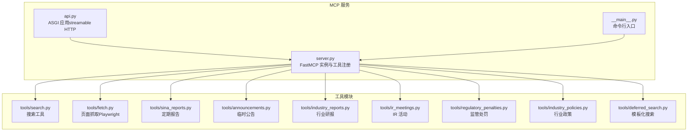
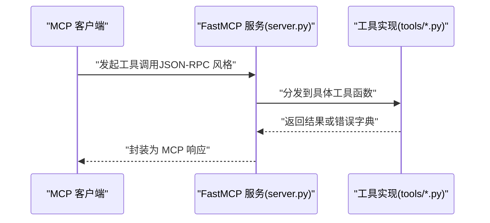
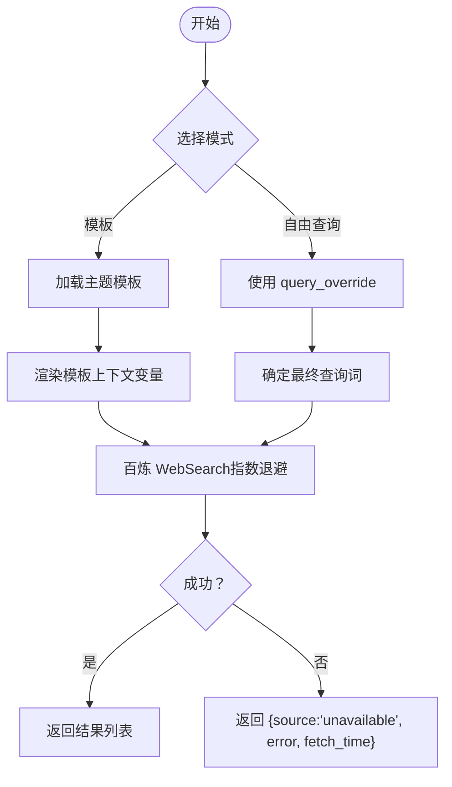
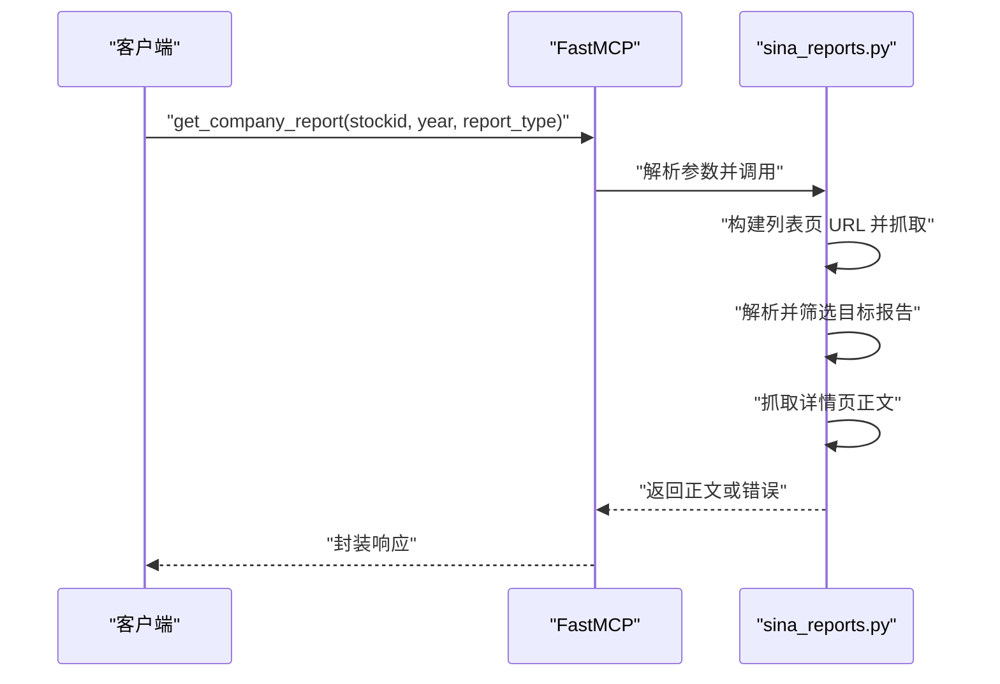
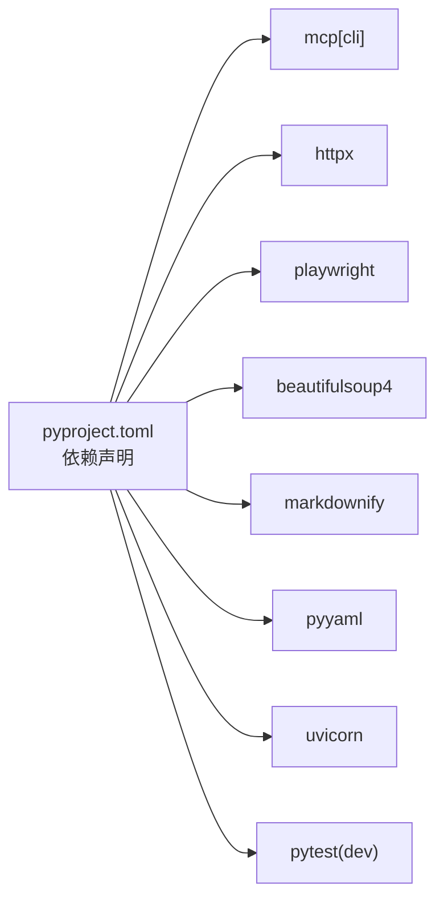

# MCP 协议接口

<cite>
**本文引用的文件**
- [README.md](file://nano-search-mcp/README.md)
- [pyproject.toml](file://nano-search-mcp/pyproject.toml)
- [__init__.py](file://nano-search-mcp/src/nano_search_mcp/__init__.py)
- [api.py](file://nano-search-mcp/src/nano_search_mcp/api.py)
- [server.py](file://nano-search-mcp/src/nano_search_mcp/server.py)
- [tools/__init__.py](file://nano-search-mcp/src/nano_search_mcp/tools/__init__.py)
- [tools/search.py](file://nano-search-mcp/src/nano_search_mcp/tools/search.py)
- [tools/fetch.py](file://nano-search-mcp/src/nano_search_mcp/tools/fetch.py)
- [tools/sina_reports.py](file://nano-search-mcp/src/nano_search_mcp/tools/sina_reports.py)
- [tools/announcements.py](file://nano-search-mcp/src/nano_search_mcp/tools/announcements.py)
- [tools/industry_reports.py](file://nano-search-mcp/src/nano_search_mcp/tools/industry_reports.py)
- [tools/ir_meetings.py](file://nano-search-mcp/src/nano_search_mcp/tools/ir_meetings.py)
- [tools/regulatory_penalties.py](file://nano-search-mcp/src/nano_search_mcp/tools/regulatory_penalties.py)
- [tools/industry_policies.py](file://nano-search-mcp/src/nano_search_mcp/tools/industry_policies.py)
- [tools/deferred_search.py](file://nano-search-mcp/src/nano_search_mcp/tools/deferred_search.py)
</cite>

## 目录
1. [简介](#简介)
2. [项目结构](#项目结构)
3. [核心组件](#核心组件)
4. [架构总览](#架构总览)
5. [详细组件分析](#详细组件分析)
6. [依赖分析](#依赖分析)
7. [性能考虑](#性能考虑)
8. [故障排查指南](#故障排查指南)
9. [结论](#结论)
10. [附录](#附录)

## 简介
本文件为 MCP（Model Context Protocol）协议接口的权威文档，面向使用 NanoSearch MCP 服务进行外部证据采集与分析的用户与开发者。文档系统阐述了 MCP 协议在本项目中的实现方式、工具注册流程、消息传递与响应结构、典型调用示例、协议版本与扩展机制，以及客户端集成的最佳实践。

- 服务定位：NanoSearch MCP 是面向中国 A 股市场的结构化文本检索服务，提供 12 个 MCP 工具，覆盖通用检索、定期报告、临时公告、行业研报、监管处罚、投资者关系（IR）活动、行业政策等能力域。
- 协议实现：基于 mcp[cli] 与 FastMCP，支持 streamable HTTP 与 stdio 两种传输方式，提供标准 MCP 工具注册与调用契约。
- 错误契约：除特定工具在参数非法或网络彻底失败时抛异常外，其余工具失败时统一返回包含 source、error、fetch_time 的字典，不抛异常，便于上层 Agent 稳健处理。

**章节来源**
- [README.md: 1-198:1-198](file://nano-search-mcp/README.md#L1-L198)
- [server.py: 18-58:18-58](file://nano-search-mcp/src/nano_search_mcp/server.py#L18-L58)

## 项目结构
nano-search-mcp 采用“包内模块 + 工具注册”的组织方式，核心入口负责创建 FastMCP 实例并注册各领域工具；工具模块各自实现具体抓取与解析逻辑，并通过装饰器注册为 MCP 工具。

**图表来源**
- [server.py: 19-69:19-69](file://nano-search-mcp/src/nano_search_mcp/server.py#L19-L69)
- [api.py: 3-6:3-6](file://nano-search-mcp/src/nano_search_mcp/api.py#L3-L6)
- [tools/__init__.py: 1-48:1-48](file://nano-search-mcp/src/nano_search_mcp/tools/__init__.py#L1-L48)

**章节来源**
- [server.py: 1-91:1-91](file://nano-search-mcp/src/nano_search_mcp/server.py#L1-L91)
- [api.py: 1-12:1-12](file://nano-search-mcp/src/nano_search_mcp/api.py#L1-L12)
- [tools/__init__.py: 1-48:1-48](file://nano-search-mcp/src/nano_search_mcp/tools/__init__.py#L1-L48)

## 核心组件
- FastMCP 实例：创建并配置 MCP 服务，设置 name、streamable HTTP 路径与 instructions（工具能力说明）。
- 工具注册：在 server.py 中集中注册 12 个工具，每个工具模块提供 register_*_tools 函数。
- 传输方式：默认 streamable HTTP（/mcp），支持通过参数切换为 stdio。
- 错误契约：部分工具在极端错误时抛异常，其余工具失败时返回统一结构的字典，包含 source、error、fetch_time。

**章节来源**
- [server.py: 19-86:19-86](file://nano-search-mcp/src/nano_search_mcp/server.py#L19-L86)
- [README.md: 47-48:47-48](file://nano-search-mcp/README.md#L47-L48)

## 架构总览
MCP 服务启动后，通过 FastMCP 注册工具，客户端可使用 streamable HTTP 或 stdio 与服务交互。工具实现遵循统一的参数与返回契约，失败路径统一处理，保障 Agent 的鲁棒性。

**图表来源**
- [server.py: 83-86:83-86](file://nano-search-mcp/src/nano_search_mcp/server.py#L83-L86)
- [api.py: 6](file://nano-search-mcp/src/nano_search_mcp/api.py#L6)

## 详细组件分析

### 通用检索工具
- search：基于百炼 WebSearch 的网页搜索，返回 [{title, url, snippet}] 列表。支持 region/timelimit 提示词增强，max_results 截断到 [1,30]。
- fetch_page：使用 Playwright 渲染页面，提取正文并清理噪声，返回 {url, content, method, truncated, error}。内置 SSRF 防护与长度截断。
- search_deferred_topic：支持主题模板与上下文变量的模板化搜索，或直接使用 query_override；失败时返回 source: "unavailable"。

**图表来源**
- [tools/deferred_search.py: 148-237:148-237](file://nano-search-mcp/src/nano_search_mcp/tools/deferred_search.py#L148-L237)
- [tools/search.py: 79-119:79-119](file://nano-search-mcp/src/nano_search_mcp/tools/search.py#L79-L119)
- [tools/fetch.py: 220-244:220-244](file://nano-search-mcp/src/nano_search_mcp/tools/fetch.py#L220-L244)

**章节来源**
- [tools/search.py: 17-119:17-119](file://nano-search-mcp/src/nano_search_mcp/tools/search.py#L17-L119)
- [tools/fetch.py: 163-244:163-244](file://nano-search-mcp/src/nano_search_mcp/tools/fetch.py#L163-L244)
- [tools/deferred_search.py: 45-237:45-237](file://nano-search-mcp/src/nano_search_mcp/tools/deferred_search.py#L45-L237)

### 定期报告工具
- get_company_report：按 stockid、year、report_type 获取 A 股公司指定年份的年报/半年报/一季报/三季报全文正文。调用方必须显式提供 year；失败时抛异常或返回 {source: "unavailable", error, fetch_time}。

**图表来源**
- [tools/sina_reports.py: 314-369:314-369](file://nano-search-mcp/src/nano_search_mcp/tools/sina_reports.py#L314-L369)

**章节来源**
- [tools/sina_reports.py: 314-369:314-369](file://nano-search-mcp/src/nano_search_mcp/tools/sina_reports.py#L314-L369)
- [README.md: 126-147:126-147](file://nano-search-mcp/README.md#L126-L147)

### 临时公告工具
- list_announcements：按 ts_code 与日期区间过滤，返回公告列表；支持按 ann_type 过滤；失败返回 {source: "unavailable", error, fetch_time}。
- get_announcement_text：抓取单条公告正文，返回 {source_url, full_text, extracted_at} 或错误字典。

**章节来源**
- [tools/announcements.py: 404-535:404-535](file://nano-search-mcp/src/nano_search_mcp/tools/announcements.py#L404-L535)

### 行业研报工具
- list_industry_reports：支持 ts_code 自动路由至申万二级行业或直接指定 industry_sw_l2 + 关键词；默认返回近 1 年内数据；失败返回 {source: "unavailable", error, fetch_time}。
- get_report_text：抓取单条研报正文，返回 {source_url, full_text, extracted_at} 或错误字典。

**章节来源**
- [tools/industry_reports.py: 384-495:384-495](file://nano-search-mcp/src/nano_search_mcp/tools/industry_reports.py#L384-L495)

### 投资者关系（IR）活动工具
- list_ir_meetings：按 ts_code 与日期区间过滤，支持 meeting_types 过滤；返回会议列表（含 meeting_type、参与者列表等）；失败返回 {source: "unavailable", error, fetch_time}。
- get_ir_meeting_text：抓取单条 IR 纪要正文并抽取参会机构，返回 {source_url, full_text, participants, extracted_at} 或错误字典。

**章节来源**
- [tools/ir_meetings.py: 489-618:489-618](file://nano-search-mcp/src/nano_search_mcp/tools/ir_meetings.py#L489-L618)

### 监管处罚工具
- list_regulatory_penalties：列出监管处罚/违规处理记录，返回标准化字段集合；失败返回 {source: "unavailable", error, fetch_time}。

**章节来源**
- [tools/regulatory_penalties.py: 393-447:393-447](file://nano-search-mcp/src/nano_search_mcp/tools/regulatory_penalties.py#L393-L447)

### 行业政策工具
- list_industry_policies：基于百炼 WebSearch 检索 gov.cn 近一年政策文件，返回最多 5 条；失败返回 {source: "unavailable", error, fetch_time}。

**章节来源**
- [tools/industry_policies.py: 185-246:185-246](file://nano-search-mcp/src/nano_search_mcp/tools/industry_policies.py#L185-L246)

## 依赖分析
- 运行时依赖：mcp[cli]、httpx、playwright、beautifulsoup4、markdownify、pyyaml、uvicorn。
- 可选开发依赖：pytest。
- 命令行入口：nano-search-mcp，支持 --transport 切换到 stdio。

**图表来源**
- [pyproject.toml: 6-14:6-14](file://nano-search-mcp/pyproject.toml#L6-L14)
- [pyproject.toml: 16-19:16-19](file://nano-search-mcp/pyproject.toml#L16-L19)
- [pyproject.toml: 21-22:21-22](file://nano-search-mcp/pyproject.toml#L21-L22)

**章节来源**
- [pyproject.toml: 1-44:1-44](file://nano-search-mcp/pyproject.toml#L1-L44)

## 性能考虑
- 并发与资源复用：fetch_page 使用 Playwright 异步浏览器实例并复用，降低冷启动开销；各工具模块内部实现异步/并发抓取与解析。
- 限流与退避：多数 HTTP 抓取实现内置指数退避与相邻请求间隔，缓解目标站点限流与抖动。
- 缓存策略：公告、研报、IR、监管处罚等模块具备本地缓存（按 TTL），显著降低重复请求成本。
- 输出裁剪：fetch_page 对正文长度进行上限控制，避免超长输出影响下游处理。

**章节来源**
- [tools/fetch.py: 120-161:120-161](file://nano-search-mcp/src/nano_search_mcp/tools/fetch.py#L120-L161)
- [tools/announcements.py: 184-208:184-208](file://nano-search-mcp/src/nano_search_mcp/tools/announcements.py#L184-L208)
- [tools/industry_reports.py: 161-184:161-184](file://nano-search-mcp/src/nano_search_mcp/tools/industry_reports.py#L161-L184)
- [tools/ir_meetings.py: 236-260:236-260](file://nano-search-mcp/src/nano_search_mcp/tools/ir_meetings.py#L236-L260)
- [tools/regulatory_penalties.py: 138-162:138-162](file://nano-search-mcp/src/nano_search_mcp/tools/regulatory_penalties.py#L138-L162)

## 故障排查指南
- SSRF 防护与 URL 校验：fetch_page 对 URL 协议与目标地址进行严格校验，拒绝 loopback、私网、云元数据等地址；如遇拒绝，返回 {method: "blocked", error: "..."}。
- 参数校验：各工具对输入参数进行强校验（如 stockid、report_type、日期格式等），非法参数将导致失败字典或异常。
- 网络错误：工具内部对网络异常进行指数退避重试；若重试耗尽仍未成功，返回 {source: "unavailable", error, fetch_time}。
- 缓存问题：如需强制刷新，可清理对应缓存目录（各模块自述缓存路径与 TTL）。

**章节来源**
- [tools/fetch.py: 24-74:24-74](file://nano-search-mcp/src/nano_search_mcp/tools/fetch.py#L24-L74)
- [tools/sina_reports.py: 78-100:78-100](file://nano-search-mcp/src/nano_search_mcp/tools/sina_reports.py#L78-L100)
- [tools/announcements.py: 85-124:85-124](file://nano-search-mcp/src/nano_search_mcp/tools/announcements.py#L85-L124)
- [tools/industry_reports.py: 50-53:50-53](file://nano-search-mcp/src/nano_search_mcp/tools/industry_reports.py#L50-L53)
- [tools/ir_meetings.py: 137-178:137-178](file://nano-search-mcp/src/nano_search_mcp/tools/ir_meetings.py#L137-L178)
- [tools/regulatory_penalties.py: 66-82:66-82](file://nano-search-mcp/src/nano_search_mcp/tools/regulatory_penalties.py#L66-L82)

## 结论
NanoSearch MCP 服务以 FastMCP 为核心，提供了覆盖 A 股市场关键证据域的 12 个工具，具备稳健的错误契约、完善的缓存与限流策略，以及清晰的工具注册与调用流程。通过 streamable HTTP 与 stdio 两种传输方式，可灵活适配不同客户端与部署环境。

## 附录

### MCP 工具清单与调用要点
- 通用检索
  - search：参数包含 query、max_results、region、timelimit；返回 [{title, url, snippet}]。
  - fetch_page：参数为 url；返回 {url, content, method, truncated, error}。
  - search_deferred_topic：支持 topic_id + context 或 query_override；返回 {topic_id, query, source, results, fetch_time}。
- 定期报告
  - get_company_report：参数 stockid、year、report_type；返回报告正文字符串。
- 临时公告
  - list_announcements：参数 ts_code、start_date、end_date、ann_types；返回 {ts_code, source, announcements}。
  - get_announcement_text：参数 source_url；返回 {source_url, full_text, extracted_at}。
- 行业研报
  - list_industry_reports：参数 industry_sw_l2、keywords、start_date、end_date、limit、ts_code；返回 {industry_sw_l2, source, reports}。
  - get_report_text：参数 source_url；返回 {source_url, full_text, extracted_at}。
- 监管处罚
  - list_regulatory_penalties：参数 ts_code、start_date、end_date；返回 {ts_code, source, penalties}。
- 投资者关系（IR）
  - list_ir_meetings：参数 ts_code、start_date、end_date、meeting_types；返回 {ts_code, source, meetings}。
  - get_ir_meeting_text：参数 source_url；返回 {source_url, full_text, participants, extracted_at}。
- 行业政策
  - list_industry_policies：参数 industry_sw_l2、keywords；返回 {industry_sw_l2, source, policies, fetch_time}。

**章节来源**
- [README.md: 28-48:28-48](file://nano-search-mcp/README.md#L28-L48)
- [server.py: 18-58:18-58](file://nano-search-mcp/src/nano_search_mcp/server.py#L18-L58)

### 协议版本与扩展机制
- 版本与依赖：项目基于 mcp[cli]，版本约束见 pyproject.toml。
- 扩展方式：新增工具只需在 tools/ 下实现函数并通过 register_*_tools 注册到 FastMCP 实例，即可无缝纳入 MCP 工具集。
- 兼容性：工具失败路径统一返回字典，不破坏现有调用方契约；新增工具建议遵循相同错误返回风格。

**章节来源**
- [pyproject.toml: 7](file://nano-search-mcp/pyproject.toml#L7)
- [server.py: 60-69:60-69](file://nano-search-mcp/src/nano_search_mcp/server.py#L60-L69)

### 客户端集成指南与最佳实践
- 启动服务
  - streamable HTTP：默认监听 http://127.0.0.1:8000/mcp。
  - stdio：通过 --transport stdio 或 python -m nano_search_mcp --transport stdio。
- 集成方式
  - 作为 MCP 服务：通过 streamable HTTP 或 stdio 与客户端对接。
  - 作为 Python 包：导入 mcp 对象或 app，按需嵌入上层应用。
- 最佳实践
  - 明确设置请求超时，覆盖最慢的 fetch_page 或 get_company_report 调用。
  - 使用 search + fetch_page 的组合流程：先搜索，再抓取详情页正文。
  - 对失败场景使用 source: "unavailable" 字段判断，避免异常中断。
  - 合理使用模板化搜索（search_deferred_topic）与关键词过滤，提高召回质量。

**章节来源**
- [README.md: 79-124:79-124](file://nano-search-mcp/README.md#L79-L124)
- [api.py: 9-12:9-12](file://nano-search-mcp/src/nano_search_mcp/api.py#L9-L12)
- [server.py: 72-86:72-86](file://nano-search-mcp/src/nano_search_mcp/server.py#L72-L86)