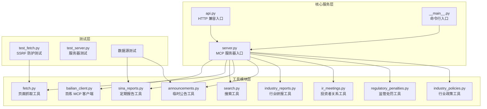
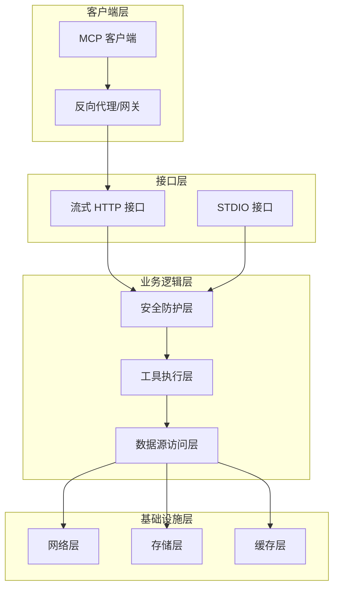
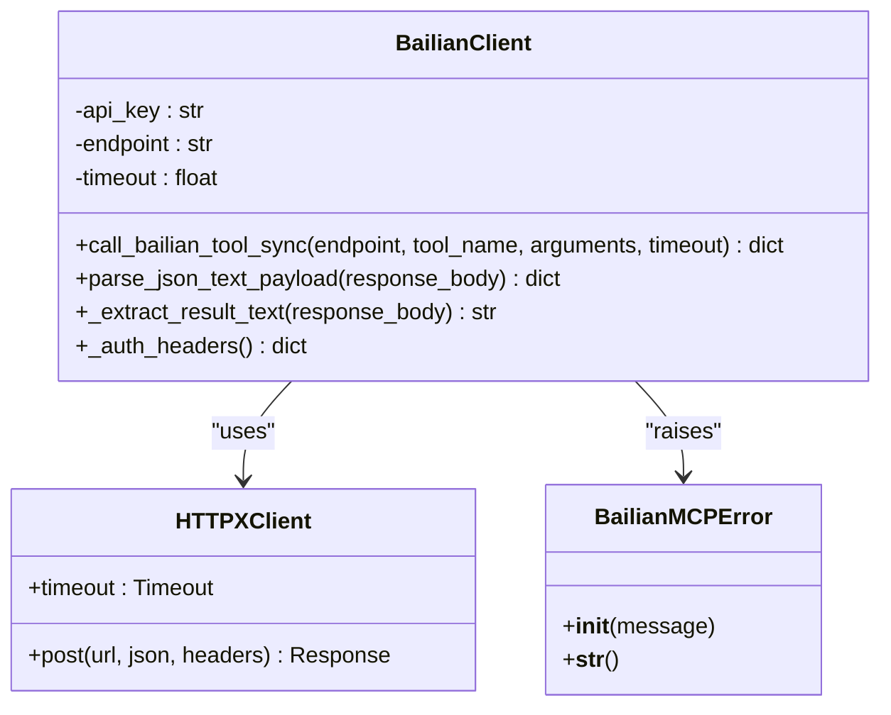
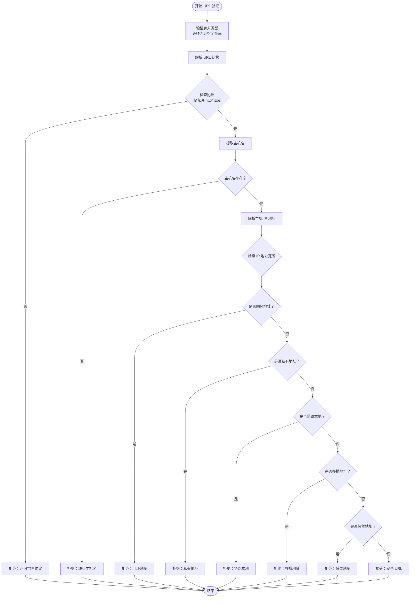
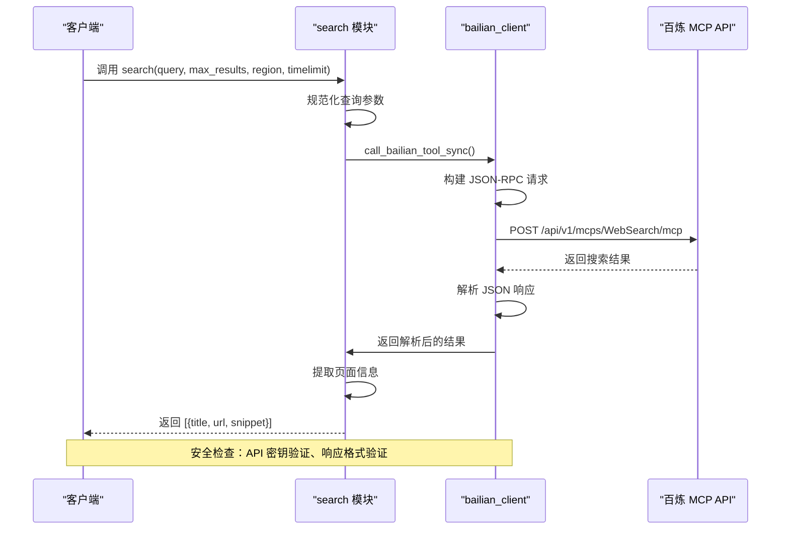
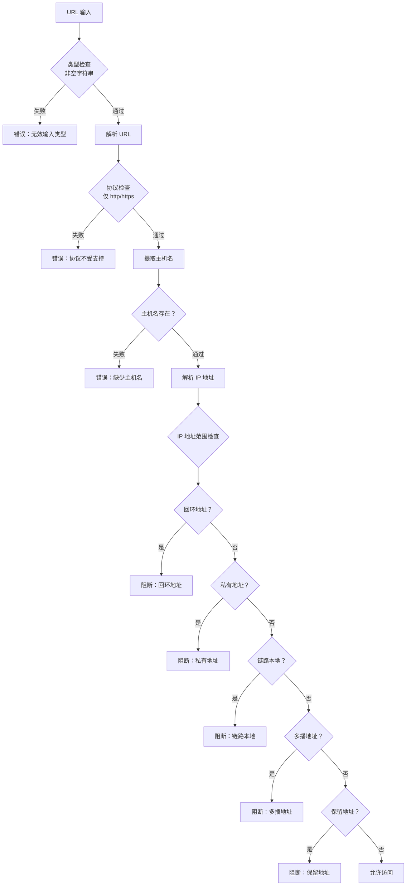
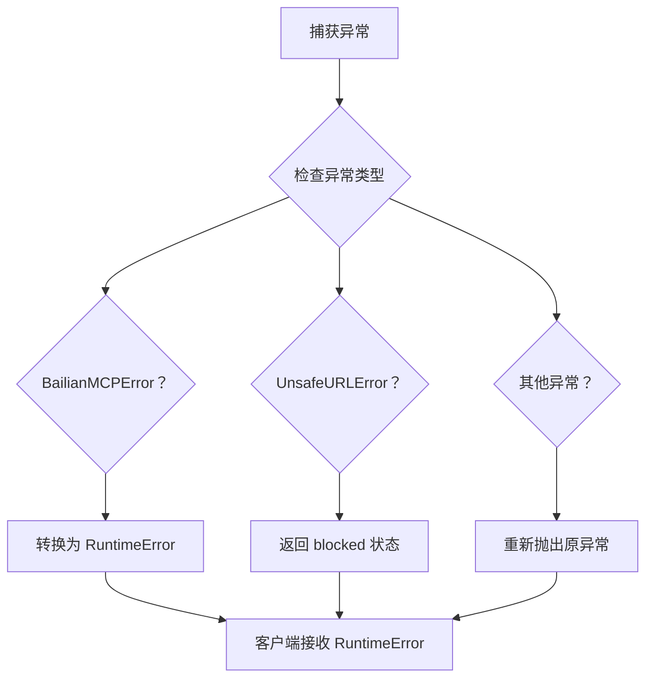
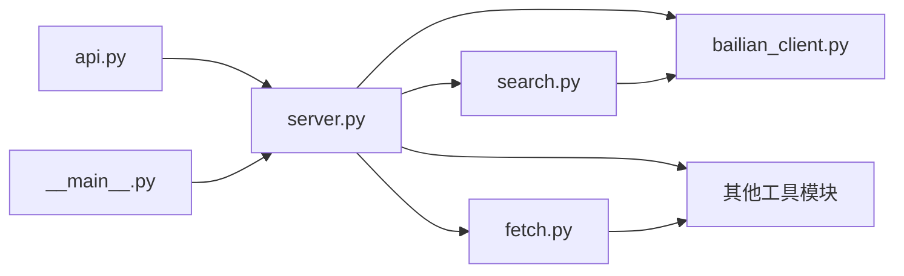
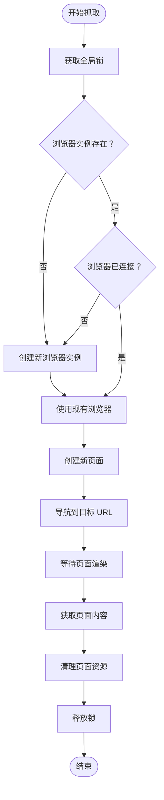
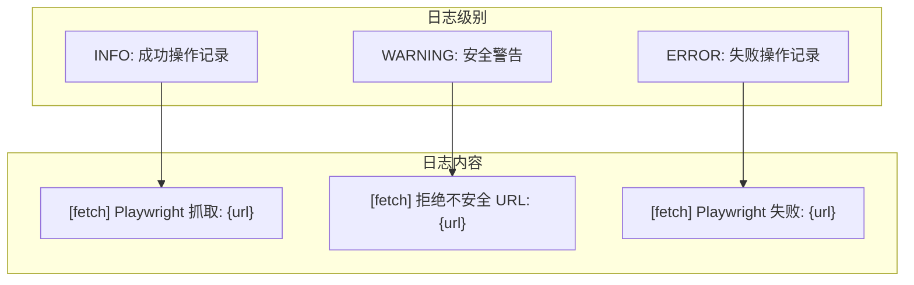

# 安全防护工具接口

<cite>
**本文档引用的文件**
- [bailian_client.py](file://nano-search-mcp/src/nano_search_mcp/tools/bailian_client.py)
- [fetch.py](file://nano-search-mcp/src/nano_search_mcp/tools/fetch.py)
- [search.py](file://nano-search-mcp/src/nano_search_mcp/tools/search.py)
- [server.py](file://nano-search-mcp/src/nano_search_mcp/server.py)
- [api.py](file://nano-search-mcp/src/nano_search_mcp/api.py)
- [__main__.py](file://nano-search-mcp/src/nano_search_mcp/__main__.py)
- [test_fetch.py](file://nano-search-mcp/tests/test_fetch.py)
- [README.md](file://nano-search-mcp/README.md)
- [pyproject.toml](file://nano-search-mcp/pyproject.toml)
</cite>

## 目录
1. [简介](#简介)
2. [项目结构](#项目结构)
3. [核心组件](#核心组件)
4. [架构概览](#架构概览)
5. [详细组件分析](#详细组件分析)
6. [安全机制实现](#安全机制实现)
7. [依赖分析](#依赖分析)
8. [性能考虑](#性能考虑)
9. [故障排除指南](#故障排除指南)
10. [结论](#结论)

## 简介

NanoSearchMCP 是一个面向 A 股公告采集场景的标准 MCP 服务，专门设计用于为外部证据取证链路提供安全可靠的搜索与抓取能力。本项目的核心安全防护工具包括 `bailian_client` 工具，实现了全面的安全机制，包括 URL 安全验证、SSRF 防护、请求限制和错误处理。

该项目采用模块化设计，通过 12 个 MCP 工具提供从通用检索到专业数据源的完整能力集，所有工具都遵循统一的安全基线和错误契约。

## 项目结构

NanoSearchMCP 项目采用清晰的模块化架构，主要包含以下核心组件：



**图表来源**
- [server.py:1-91](file://nano-search-mcp/src/nano_search_mcp/server.py#L1-L91)
- [bailian_client.py:1-93](file://nano-search-mcp/src/nano_search_mcp/tools/bailian_client.py#L1-L93)
- [fetch.py:1-245](file://nano-search-mcp/src/nano_search_mcp/tools/fetch.py#L1-L245)

**章节来源**
- [server.py:1-91](file://nano-search-mcp/src/nano_search_mcp/server.py#L1-L91)
- [README.md:178-198](file://nano-search-mcp/README.md#L178-L198)

## 核心组件

### MCP 服务器核心

MCP 服务器作为整个系统的入口点，负责管理 12 个功能模块化的工具，并提供统一的流式 HTTP 接口。

### 工具注册机制

服务器通过 `FastMCP` 实例注册所有工具，确保每个工具都能在 MCP 协议下正常工作：

- **通用检索工具**：`search`、`fetch_page`、`search_deferred_topic`
- **定期报告工具**：`get_company_report`
- **临时公告工具**：`list_announcements`、`get_announcement_text`
- **行业研报工具**：`list_industry_reports`、`get_report_text`
- **监管处罚工具**：`list_regulatory_penalties`
- **投资者关系工具**：`list_ir_meetings`、`get_ir_meeting_text`
- **行业政策工具**：`list_industry_policies`

**章节来源**
- [server.py:18-70](file://nano-search-mcp/src/nano_search_mcp/server.py#L18-L70)
- [README.md:28-49](file://nano-search-mcp/README.md#L28-L49)

## 架构概览

NanoSearchMCP 采用分层架构设计，确保安全性和可维护性：



**图表来源**
- [server.py:19-22](file://nano-search-mcp/src/nano_search_mcp/server.py#L19-L22)
- [api.py:6](file://nano-search-mcp/src/nano_search_mcp/api.py#L6)

## 详细组件分析

### BailianMCP 客户端分析

`bailian_client` 模块提供了与阿里云百炼 MCP 服务的安全交互能力，实现了完整的安全机制。

#### 类图设计



**图表来源**
- [bailian_client.py:24-93](file://nano-search-mcp/src/nano_search_mcp/tools/bailian_client.py#L24-L93)

#### 核心功能实现

1. **认证机制**：通过环境变量 `DASHSCOPE_API_KEY` 获取 API 密钥
2. **请求构建**：标准化 JSON-RPC 2.0 协议格式
3. **响应处理**：严格的 JSON 解析和错误检查
4. **超时控制**：可配置的请求超时时间

**章节来源**
- [bailian_client.py:28-93](file://nano-search-mcp/src/nano_search_mcp/tools/bailian_client.py#L28-L93)

### 页面抓取工具分析

`fetch` 模块实现了强大的 SSRF 防护机制，确保所有外部请求都是安全的。

#### SSRF 防护算法



**图表来源**
- [fetch.py:24-74](file://nano-search-mcp/src/nano_search_mcp/tools/fetch.py#L24-L74)

#### 安全检查参数配置

| 参数名称 | 默认值 | 配置方式 | 作用 |
|---------|--------|----------|------|
| `_ALLOWED_SCHEMES` | `{"http", "https"}` | 硬编码 | 协议白名单 |
| `_MAX_CONTENT_LEN` | `500,000` 字符 | 硬编码 | 内容长度限制 |
| `_PLAYWRIGHT_WAIT_MS` | `2000` ms | 硬编码 | 页面渲染等待时间 |
| `_DEFAULT_TIMEOUT` | `30.0` 秒 | 环境变量 `BAILIAN_MCP_TIMEOUT` | 请求超时 |

**章节来源**
- [fetch.py:16-85](file://nano-search-mcp/src/nano_search_mcp/tools/fetch.py#L16-L85)
- [bailian_client.py:20-21](file://nano-search-mcp/src/nano_search_mcp/tools/bailian_client.py#L20-L21)

### 搜索工具分析

`search` 模块提供了基于阿里云百炼 WebSearch 的搜索能力，集成了完整的安全机制。

#### 搜索流程序列图



**图表来源**
- [search.py:41-70](file://nano-search-mcp/src/nano_search_mcp/tools/search.py#L41-L70)
- [bailian_client.py:63-93](file://nano-search-mcp/src/nano_search_mcp/tools/bailian_client.py#L63-L93)

**章节来源**
- [search.py:17-70](file://nano-search-mcp/src/nano_search_mcp/tools/search.py#L17-L70)

## 安全机制实现

### URL 安全验证

#### 防护向量识别

系统针对以下 SSRF 攻击向量进行全面防护：

1. **协议攻击**：拒绝 `file://`、`ftp://`、`gopher://`、`data:` 等非 HTTP 协议
2. **本地访问**：阻止 `127.0.0.1`、`localhost`、`[::1]` 等回环地址
3. **私网地址**：拦截 RFC1918 私有网络范围
4. **链路本地**：拒绝 `169.254.0.0/16` 链路本地网络
5. **云元数据**：阻止云服务商元数据服务端点
6. **保留地址**：拒绝 IPv4 保留地址范围

#### 验证规则详解



**图表来源**
- [fetch.py:24-74](file://nano-search-mcp/src/nano_search_mcp/tools/fetch.py#L24-L74)

### SSRF 防护策略

#### 多层防护机制

1. **协议白名单**：仅允许 `http` 和 `https` 协议
2. **DNS 解析验证**：对主机名进行 DNS 查询，确保解析结果有效
3. **IP 地址范围检查**：使用 `ipaddress` 模块验证 IP 地址类别
4. **地址类型过滤**：拒绝所有内网、本地和保留地址

#### 防护配置参数

| 配置项 | 值 | 说明 |
|--------|----|------|
| `_ALLOWED_SCHEMES` | `frozenset({"http", "https"})` | 协议白名单集合 |
| `UnsafeURLError` | 自定义异常类 | SSRF 防护失败时抛出的异常 |
| `_MAX_CONTENT_LEN` | `500,000` 字符 | 内容长度上限，防止内存攻击 |
| `_PLAYWRIGHT_WAIT_MS` | `2000` ms | 页面渲染等待时间，平衡性能与安全性 |

**章节来源**
- [fetch.py:16-22](file://nano-search-mcp/src/nano_search_mcp/tools/fetch.py#L16-L22)
- [fetch.py:24-74](file://nano-search-mcp/src/nano_search_mcp/tools/fetch.py#L24-L74)

### 请求限制机制

#### 超时控制

系统实现了多层次的超时控制机制：

1. **环境变量配置**：通过 `BAILIAN_MCP_TIMEOUT` 设置默认超时时间
2. **函数参数覆盖**：支持在调用时指定自定义超时
3. **HTTP 客户端超时**：使用 `httpx.Client` 的内置超时机制

#### 内容长度限制

为防止内存溢出和资源耗尽攻击，系统设置了严格的内容长度限制：

- **最大内容长度**：`500,000` 字符
- **自动截断**：超过限制的内容会被自动截断
- **截断标记**：返回结果包含 `truncated` 标记

**章节来源**
- [bailian_client.py:20-21](file://nano-search-mcp/src/nano_search_mcp/tools/bailian_client.py#L20-L21)
- [fetch.py:77-78](file://nano-search-mcp/src/nano_search_mcp/tools/fetch.py#L77-L78)
- [fetch.py:113-117](file://nano-search-mcp/src/nano_search_mcp/tools/fetch.py#L113-L117)

### 错误处理机制

#### 统一错误类型

系统定义了专门的错误类型来处理不同类型的异常情况：

1. **`BailianMCPError`**：百炼 MCP 服务调用失败
2. **`UnsafeURLError`**：URL 安全检查失败
3. **`RuntimeError`**：运行时异常

#### 错误传播策略



**图表来源**
- [bailian_client.py:24-26](file://nano-search-mcp/src/nano_search_mcp/tools/bailian_client.py#L24-L26)
- [fetch.py:20-22](file://nano-search-mcp/src/nano_search_mcp/tools/fetch.py#L20-L22)

**章节来源**
- [bailian_client.py:82-92](file://nano-search-mcp/src/nano_search_mcp/tools/bailian_client.py#L82-L92)
- [fetch.py:189-217](file://nano-search-mcp/src/nano_search_mcp/tools/fetch.py#L189-L217)

## 依赖分析

### 外部依赖关系

NanoSearchMCP 项目依赖以下核心库：

```mermaid
graph TB
subgraph "核心依赖"
MCP[mcp[cli] >= 1.0.0<br/>MCP 协议支持]
HTTPX[httpx >= 0.27.0<br/>HTTP 客户端]
Playwright[playwright >= 1.40.0<br/>浏览器自动化]
end
subgraph "解析库"
BS4[beautifulsoup4 >= 4.12.0<br/>HTML 解析]
Markdown[markdownify >= 0.13.0<br/>Markdown 转换]
end
subgraph "开发依赖"
PyTest[pytest >= 8.3.0<br/>测试框架]
Uvicorn[uvicorn >= 0.30.0<br/>ASGI 服务器]
YAML[pyyaml >= 6.0<br/>YAML 处理]
end
subgraph "项目模块"
Server[server.py]
Tools[tools/]
Tests[tests/]
end
MCP --> Server
HTTPX --> Tools
Playwright --> Tools
BS4 --> Tools
Markdown --> Tools
PyTest --> Tests
Uvicorn --> Server
YAML --> Server
```

**图表来源**
- [pyproject.toml:6-14](file://nano-search-mcp/pyproject.toml#L6-L14)
- [pyproject.toml:16-19](file://nano-search-mcp/pyproject.toml#L16-L19)

### 内部模块依赖

系统内部模块之间的依赖关系相对简单，主要通过 `server.py` 进行统一管理：



**图表来源**
- [server.py:8-16](file://nano-search-mcp/src/nano_search_mcp/server.py#L8-L16)
- [search.py:8-13](file://nano-search-mcp/src/nano_search_mcp/tools/search.py#L8-L13)

**章节来源**
- [pyproject.toml:1-44](file://nano-search-mcp/pyproject.toml#L1-L44)

## 性能考虑

### 并发处理

系统采用了异步编程模式来提高并发处理能力：

1. **异步页面抓取**：使用 `asyncio` 和 `playwright.async_api` 实现非阻塞抓取
2. **浏览器复用**：通过全局变量复用 Chromium 实例，减少启动开销
3. **锁机制**：使用 `asyncio.Lock` 确保浏览器实例的线程安全

### 资源管理



**图表来源**
- [fetch.py:133-175](file://nano-search-mcp/src/nano_search_mcp/tools/fetch.py#L133-L175)

### 性能优化策略

1. **浏览器实例复用**：避免每次抓取都启动新的浏览器进程
2. **页面生命周期管理**：及时清理页面资源，防止内存泄漏
3. **超时合理设置**：平衡响应时间和资源消耗
4. **内容长度限制**：防止大页面占用过多内存

**章节来源**
- [fetch.py:120-161](file://nano-search-mcp/src/nano_search_mcp/tools/fetch.py#L120-L161)

## 故障排除指南

### 常见问题诊断

#### API 密钥相关问题

**问题症状**：`BailianMCPError: 缺少环境变量 DASHSCOPE_API_KEY`

**解决方案**：
1. 确认 `DASHSCOPE_API_KEY` 环境变量已正确设置
2. 验证 API 密钥的有效性和权限
3. 检查网络连接是否正常

#### URL 安全验证失败

**问题症状**：`UnsafeURLError: 禁止的协议: 'file'`

**解决方案**：
1. 确认 URL 使用 `http://` 或 `https://` 协议
2. 检查目标地址是否为公网可访问
3. 验证 DNS 解析是否正常

#### 超时问题

**问题症状**：请求超时或响应缓慢

**解决方案**：
1. 检查网络连接质量
2. 调整 `BAILIAN_MCP_TIMEOUT` 环境变量
3. 优化目标网站的可达性

### 日志分析

系统提供了详细的日志记录机制：



**图表来源**
- [fetch.py:186-217](file://nano-search-mcp/src/nano_search_mcp/tools/fetch.py#L186-L217)

**章节来源**
- [fetch.py:186-217](file://nano-search-mcp/src/nano_search_mcp/tools/fetch.py#L186-L217)

### 测试验证

系统提供了全面的测试套件来验证安全机制：

#### SSRF 防护测试

测试覆盖了以下场景：

1. **合法 URL 放行**：`http://example.com/a`、`https://www.sina.com.cn/news`
2. **协议攻击防护**：`file:///etc/passwd`、`ftp://example.com/a`
3. **本地地址防护**：`http://127.0.0.1/admin`、`http://localhost:8080/`
4. **私网地址防护**：`http://10.0.0.5/`、`http://192.168.1.1/`
5. **链路本地防护**：`http://169.254.169.254/latest/meta-data/`

**章节来源**
- [test_fetch.py:19-98](file://nano-search-mcp/tests/test_fetch.py#L19-L98)

## 结论

NanoSearchMCP 的安全防护工具接口设计体现了现代 Web 应用安全的最佳实践。通过多层防护机制、严格的输入验证和完善的错误处理，系统能够有效抵御各种常见的安全威胁。

### 主要安全特性

1. **全面的 URL 验证**：针对所有已知的 SSRF 攻击向量进行防护
2. **严格的访问控制**：仅允许安全的 HTTP/HTTPS 协议访问
3. **资源限制机制**：防止内存溢出和资源耗尽攻击
4. **统一的错误处理**：提供一致的错误响应和日志记录
5. **异步并发处理**：在保证安全性的同时提高系统性能

### 集成建议

对于需要集成安全防护功能的项目，建议：

1. **正确配置环境变量**：确保 API 密钥和超时参数设置合理
2. **实施输入验证**：在应用层也实施相应的输入验证
3. **监控和日志**：建立完善的监控和日志记录机制
4. **定期安全审计**：定期审查和更新安全配置

通过遵循这些最佳实践，可以确保系统在生产环境中保持高度的安全性和可靠性。