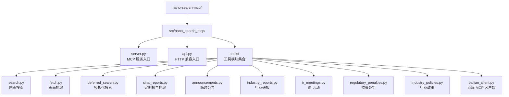
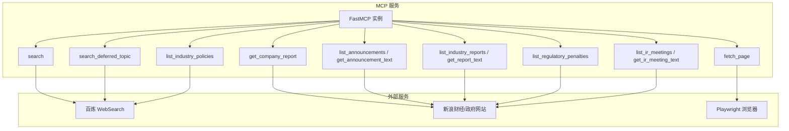
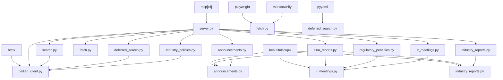

# 工具接口规范

<cite>
**本文档引用的文件**
- [README.md](file://nano-search-mcp/README.md)
- [pyproject.toml](file://nano-search-mcp/pyproject.toml)
- [server.py](file://nano-search-mcp/src/nano_search_mcp/server.py)
- [api.py](file://nano-search-mcp/src/nano_search_mcp/api.py)
- [__init__.py](file://nano-search-mcp/src/nano_search_mcp/tools/__init__.py)
- [bailian_client.py](file://nano-search-mcp/src/nano_search_mcp/tools/bailian_client.py)
- [search.py](file://nano-search-mcp/src/nano_search_mcp/tools/search.py)
- [fetch.py](file://nano-search-mcp/src/nano_search_mcp/tools/fetch.py)
- [deferred_search.py](file://nano-search-mcp/src/nano_search_mcp/tools/deferred_search.py)
- [announcements.py](file://nano-search-mcp/src/nano_search_mcp/tools/announcements.py)
- [industry_reports.py](file://nano-search-mcp/src/nano_search_mcp/tools/industry_reports.py)
- [regulatory_penalties.py](file://nano-search-mcp/src/nano_search_mcp/tools/regulatory_penalties.py)
- [ir_meetings.py](file://nano-search-mcp/src/nano_search_mcp/tools/ir_meetings.py)
- [industry_policies.py](file://nano-search-mcp/src/nano_search_mcp/tools/industry_policies.py)
- [sina_reports.py](file://nano-search-mcp/src/nano_search_mcp/tools/sina_reports.py)
</cite>

## 目录
1. [简介](#简介)
2. [项目结构](#项目结构)
3. [核心组件](#核心组件)
4. [架构概览](#架构概览)
5. [详细组件分析](#详细组件分析)
6. [依赖分析](#依赖分析)
7. [性能考虑](#性能考虑)
8. [故障排除指南](#故障排除指南)
9. [结论](#结论)
10. [附录](#附录)

## 简介
本文件为 NanoSearchMCP 项目的 12 个 MCP 工具提供完整的接口规范文档。项目基于 MCP 协议，面向中国 A 股市场提供结构化文本检索与抓取能力，涵盖通用检索、定期报告、临时公告、行业研报、监管处罚、投资者关系活动、行业政策等能力域。

- 工具总数：12 个
- 服务类型：MCP Server（支持 streamable HTTP 与 stdio 传输）
- 安全特性：域名白名单、SSRF 防护、指数退避重试、请求限频
- 错误契约：除特定工具外，其余工具失败时统一返回包含错误信息的字典，不抛异常

**章节来源**
- [README.md: 1-198:1-198](file://nano-search-mcp/README.md#L1-L198)
- [server.py: 1-91:1-91](file://nano-search-mcp/src/nano_search_mcp/server.py#L1-L91)

## 项目结构
项目采用模块化设计，按能力域划分工具模块，统一通过 FastMCP 注册为 MCP 工具。核心目录与文件如下：

**图表来源**
- [server.py: 18-69:18-69](file://nano-search-mcp/src/nano_search_mcp/server.py#L18-L69)
- [api.py: 1-12:1-12](file://nano-search-mcp/src/nano_search_mcp/api.py#L1-L12)
- [__init__.py: 1-48:1-48](file://nano-search-mcp/src/nano_search_mcp/tools/__init__.py#L1-L48)

**章节来源**
- [README.md: 178-198:178-198](file://nano-search-mcp/README.md#L178-L198)
- [pyproject.toml: 1-44:1-44](file://nano-search-mcp/pyproject.toml#L1-L44)

## 核心组件
- FastMCP 服务实例：负责注册工具、提供指令说明与运行时配置
- 工具注册器：每个工具模块提供 register_*_tools 函数，将工具注册到 MCP 服务
- 百炼 MCP 客户端：封装 DashScope WebSearch 调用，提供同步调用与 JSON 解析
- Playwright 抓取引擎：用于 fetch_page 工具的页面渲染与正文提取

**章节来源**
- [server.py: 19-69:19-69](file://nano-search-mcp/src/nano_search_mcp/server.py#L19-L69)
- [bailian_client.py: 12-93:12-93](file://nano-search-mcp/src/nano_search_mcp/tools/bailian_client.py#L12-L93)
- [fetch.py: 120-161:120-161](file://nano-search-mcp/src/nano_search_mcp/tools/fetch.py#L120-L161)

## 架构概览
MCP 服务启动后，按能力域注册 12 个工具。调用方通过 MCP 客户端发起工具调用，工具根据职责执行相应的搜索或抓取逻辑，并返回结构化的结果。

**图表来源**
- [server.py: 61-69:61-69](file://nano-search-mcp/src/nano_search_mcp/server.py#L61-L69)
- [bailian_client.py: 63-93:63-93](file://nano-search-mcp/src/nano_search_mcp/tools/bailian_client.py#L63-L93)
- [fetch.py: 133-175:133-175](file://nano-search-mcp/src/nano_search_mcp/tools/fetch.py#L133-L175)

## 详细组件分析

### 搜索工具

#### 工具：search
- 功能：基于百炼 WebSearch 的网页搜索，返回标题、URL、摘要
- 参数
  - query: 搜索关键词（必填，非空字符串）
  - max_results: 最大返回结果数，取值范围 [1, 30]，默认 5
  - region: 搜索区域代码，常用值 "zh-cn"/"us-en"/"uk-en"/"wt-wt"，默认 "zh-cn"
  - timelimit: 时间范围过滤，可选 "d"/"w"/"m"/"y"，None 表示不限
- 返回
  - list[SearchItem]: 每项含 title/url/snippet 三个字段的字符串；无结果时返回空列表
- 错误
  - RuntimeError：百炼 MCP 调用失败
- 性能
  - 结果数裁剪到 [1, 30]，timelimit 通过查询提示词降级实现
- 使用示例
  - 搜索关键词并限制结果数
  - 指定区域与时效过滤

**章节来源**
- [search.py: 79-119:79-119](file://nano-search-mcp/src/nano_search_mcp/tools/search.py#L79-L119)
- [search.py: 73-77:73-77](file://nano-search-mcp/src/nano_search_mcp/tools/search.py#L73-L77)

#### 工具：fetch_page
- 功能：抓取任意 HTTP/HTTPS 页面正文，自动清理导航/页脚/广告/侧边栏等噪声
- 参数
  - url: 需要抓取的绝对 URL
- 返回
  - dict:
    - url: 实际抓取的 URL
    - content: 正文 Markdown；失败时为空字符串
    - method: "playwright"|"blocked"
    - truncated: 是否因超长被截断
    - error: 失败时的错误信息（仅失败场景出现）
- 错误
  - 不抛异常；失败时返回包含 error 字段的字典
- 安全
  - 仅允许 http/https；拒绝 file://、loopback、RFC1918 私网、链路本地等 SSRF 向量
- 性能
  - Playwright 浏览器复用，降低冷启动开销；正文最大字符数 50 万

**章节来源**
- [fetch.py: 220-245:220-245](file://nano-search-mcp/src/nano_search_mcp/tools/fetch.py#L220-L245)
- [fetch.py: 178-184:178-184](file://nano-search-mcp/src/nano_search_mcp/tools/fetch.py#L178-L184)

#### 工具：search_deferred_topic
- 功能：基于命名模板或自由查询的百炼 WebSearch 检索，支持 context 变量填充
- 参数
  - topic_id: 主题标识符；自由查询模式下可传任意字符串作为结果标签
  - query_override: 非空时覆盖主题模板，直接作为搜索词使用
  - max_results: 返回结果上限，取值范围 [1, 30]，默认 10
  - region: 地区提示，默认 "cn-zh"，其它常用值 "wt-wt"/"us-en"/"uk-en"
  - context: 模板变量字典，用于填充主题查询模板中的占位符
- 返回
  - dict:
    - 成功：包含 topic_id/query/source/results/fetch_time
    - 失败：包含 topic_id/source/error/fetch_time
- 错误
  - 不抛异常；未知 topic_id、模板缺失、WebSearch 重试耗尽等错误经由返回字典的 error 字段传递
- 性能
  - 3 次指数退避重试；max_results 裁剪到 [1, 30]

**章节来源**
- [deferred_search.py: 145-238:145-238](file://nano-search-mcp/src/nano_search_mcp/tools/deferred_search.py#L145-L238)

### 金融数据工具

#### 工具：list_announcements / get_announcement_text
- 功能：获取 A 股上市公司临时公告列表与单条公告正文
- 参数（list_announcements）
  - ts_code: Tushare 格式股票代码，如 "688270.SH"
  - start_date: 起始日期（含），格式 YYYY-MM-DD；默认当年 1 月 1 日
  - end_date: 结束日期（含），格式 YYYY-MM-DD；默认今日
  - ann_types: 过滤公告类型列表，默认全部返回。可选值：
    - inquiry、audit、accountant_change、litigation、penalty、restatement、other
- 返回（list_announcements）
  - dict:
    - ts_code: 输入的股票代码
    - source: "sina"
    - announcements: 列表，每项含 ann_date/title/ann_type/source_url/pdf_url
- 参数（get_announcement_text）
  - source_url: 由 list_announcements 返回条目的 source_url
- 返回（get_announcement_text）
  - dict:
    - 成功：包含 source_url/full_text/extracted_at
    - 失败：同上结构，full_text 为 "" 且附带 error 字段
- 错误
  - 不抛异常；所有错误经由返回字典的 error 字段传递
- 性能
  - 列表页缓存 1 小时；详情页缓存 7 天；自动翻页最多 10 页

**章节来源**
- [announcements.py: 404-535:404-535](file://nano-search-mcp/src/nano_search_mcp/tools/announcements.py#L404-L535)

#### 工具：list_industry_reports / get_report_text
- 功能：列出券商发布的行业研究报告与单条研报正文
- 参数（list_industry_reports）
  - industry_sw_l2: 申万二级行业名，如 "汽车零部件"/"光伏设备"
  - keywords: 标题关键词白名单，任一命中即保留
  - start_date: 起始日期（含），格式 YYYY-MM-DD；默认近 1 年
  - end_date: 结束日期（含），格式 YYYY-MM-DD；默认今日
  - limit: 返回条数上限，范围 [1, 200]，默认 50
  - ts_code: Tushare 格式股票代码，如 "603129.SH"；若提供，则忽略 industry_sw_l2
- 返回（list_industry_reports）
  - dict:
    - industry_sw_l2: 输入的行业名
    - source: "sina"
    - reports: 列表，每项含 report_date/publisher/title/industry_tags/source_url/summary
- 参数（get_report_text）
  - source_url: 由 list_industry_reports 返回条目的 source_url
- 返回（get_report_text）
  - dict:
    - 成功：包含 source_url/full_text/extracted_at
    - 失败：同上结构，full_text 为 "" 且附带 error 字段
- 错误
  - 不抛异常；所有错误经由返回字典的 error 字段传递
- 性能
  - 列表页缓存 1 小时；详情页缓存 7 天；最多 5 页

**章节来源**
- [industry_reports.py: 384-495:384-495](file://nano-search-mcp/src/nano_search_mcp/tools/industry_reports.py#L384-L495)

#### 工具：list_regulatory_penalties
- 功能：列出 A 股上市公司的监管处罚/违规处理记录
- 参数
  - ts_code: Tushare 格式股票代码，如 "688270.SH"/"000001.SZ"
  - start_date: 起始日期（含），格式 YYYY-MM-DD；默认不限
  - end_date: 结束日期（含），格式 YYYY-MM-DD；默认不限
- 返回
  - dict:
    - ts_code: 输入的股票代码
    - source: "sina"
    - penalties: 列表，每项含 punish_date/event_type/title/reason/content/issuer/source_url
- 错误
  - 不抛异常；所有错误经由返回字典的 error 字段传递
- 性能
  - 列表页缓存 1 小时

**章节来源**
- [regulatory_penalties.py: 393-447:393-447](file://nano-search-mcp/src/nano_search_mcp/tools/regulatory_penalties.py#L393-L447)

#### 工具：list_ir_meetings / get_ir_meeting_text
- 功能：列出投资者关系活动记录与单条 IR 纪要正文
- 参数（list_ir_meetings）
  - ts_code: Tushare 格式股票代码，如 "000001.SZ"
  - start_date: 起始日期（含），格式 YYYY-MM-DD；默认近 6 个月
  - end_date: 结束日期（含），格式 YYYY-MM-DD；默认今日
  - meeting_types: 过滤会议类型列表，默认全部返回。可选值：
    - research、earnings_call、site_visit、other
- 返回（list_ir_meetings）
  - dict:
    - ts_code: 输入的股票代码
    - source: "sina"
    - meetings: 列表，每项含 meeting_date/meeting_type/participants/title/summary/source_url
- 参数（get_ir_meeting_text）
  - source_url: 由 list_ir_meetings 返回条目的 source_url
- 返回（get_ir_meeting_text）
  - dict:
    - 成功：包含 source_url/full_text/participants/extracted_at
    - 失败：同上结构，full_text 为 ""、participants 为 []，附带 error 字段
- 错误
  - 不抛异常；所有错误经由返回字典的 error 字段传递
- 性能
  - 列表页缓存 1 小时；详情页缓存 7 天；最多 20 页

**章节来源**
- [ir_meetings.py: 489-618:489-618](file://nano-search-mcp/src/nano_search_mcp/tools/ir_meetings.py#L489-L618)

#### 工具：list_industry_policies
- 功能：检索中国政府机构（*.gov.cn）发布的行业政策文件
- 参数
  - industry_sw_l2: 申万二级行业名，如 "汽车零部件"/"光伏设备"
  - keywords: 主营业务关键词列表，如 ["锂电池","新能源"]
- 返回
  - dict：
    - 成功：包含 industry_sw_l2/source/policies/fetch_time
    - 未命中：同上但 policies 为空列表，并附 coverage_note
    - 异常：{"industry_sw_l2","source":"unavailable","error","fetch_time"}
- 错误
  - 不抛异常；所有错误经由返回字典的 error 字段传递
- 性能
  - 使用百炼 WebSearch 检索政策相关页面并去重，返回前 5 条

**章节来源**
- [industry_policies.py: 185-246:185-246](file://nano-search-mcp/src/nano_search_mcp/tools/industry_policies.py#L185-L246)

#### 工具：get_company_report
- 功能：获取 A 股上市公司指定年份定期报告的全文正文
- 参数
  - stockid: 股票代码，6 位数字字符串
  - year: 报告所属年份，例如 2023
  - report_type: 报告类型，默认 annual（年报），可选 semi/q1/q3 或中文别名
- 返回
  - 目标年份指定定期报告的正文全文，正文前附带标题、发布日期与来源链接
- 错误
  - ValueError：stockid 非法、year 非法、report_type 非法，或找不到该年份报告
  - RuntimeError：找到了目标报告，但正文抓取失败
- 性能
  - 列表页缓存 1 小时；详情页缓存 7 天

**章节来源**
- [sina_reports.py: 314-369:314-369](file://nano-search-mcp/src/nano_search_mcp/tools/sina_reports.py#L314-L369)

### 安全工具

#### 工具：bailian_client（百炼 MCP 客户端）
- 功能：封装 DashScope WebSearch 调用，提供同步调用与 JSON 解析
- 参数
  - endpoint: MCP 端点，默认从环境变量读取
  - tool_name: 工具名称，如 "bailian_web_search"
  - arguments: 工具参数字典
  - timeout: 超时时间（秒），可选
- 返回
  - dict: MCP 原始响应体
- 错误
  - BailianMCPError：缺少 API Key、HTTP 错误、JSON 解析失败、MCP error 等
- 环境变量
  - DASHSCOPE_API_KEY: DashScope API Key
  - BAILIAN_WEBSEARCH_ENDPOINT: MCP 端点（可选）
  - BAILIAN_MCP_TIMEOUT: 默认超时时间（秒）

**章节来源**
- [bailian_client.py: 12-93:12-93](file://nano-search-mcp/src/nano_search_mcp/tools/bailian_client.py#L12-L93)

## 依赖分析
- 外部依赖
  - mcp[cli]: MCP 协议实现
  - httpx: HTTP 客户端
  - playwright: 页面渲染与抓取
  - beautifulsoup4/markdownify: HTML 解析与转换
  - pyyaml: YAML 解析（deferred_search）
- 内部依赖
  - bailian_client：被 search、deferred_search、industry_policies 等工具调用
  - fetch：被 search_deferred_topic（兜底抓取）间接使用

**图表来源**
- [pyproject.toml: 6-14:6-14](file://nano-search-mcp/pyproject.toml#L6-L14)
- [server.py: 8-16:8-16](file://nano-search-mcp/src/nano_search_mcp/server.py#L8-L16)
- [bailian_client.py: 10-15:10-15](file://nano-search-mcp/src/nano_search_mcp/tools/bailian_client.py#L10-L15)

**章节来源**
- [pyproject.toml: 1-44:1-44](file://nano-search-mcp/pyproject.toml#L1-L44)
- [server.py: 8-16:8-16](file://nano-search-mcp/src/nano_search_mcp/server.py#L8-L16)

## 性能考虑
- 指数退避重试：所有网络请求均采用指数退避重试，减少瞬时错误影响
- 请求限频：各工具均实现请求间隔控制，避免对目标站点造成压力
- 缓存策略：多处实现本地缓存（列表页/详情页/政策结果），显著降低重复请求成本
- Playwright 复用：fetch_page 使用浏览器复用，降低冷启动开销
- 结果裁剪：search、deferred_search、industry_policies 对返回数量进行裁剪，控制响应大小
- 字符串截断：fetch_page 对正文长度进行截断，避免超大响应

## 故障排除指南
- 环境变量缺失
  - 症状：BailianMCPError 提示缺少 DASHSCOPE_API_KEY
  - 处理：设置环境变量 DASHSCOPE_API_KEY
- 网络错误
  - 症状：工具返回 {source:"unavailable", error, fetch_time}
  - 处理：检查网络连通性、代理设置、防火墙规则
- 参数非法
  - 症状：部分工具抛出 ValueError
  - 处理：检查日期格式、股票代码格式、报告类型别名
- SSRF 防护
  - 症状：fetch_page 返回 blocked 并包含 error
  - 处理：确认 URL 协议为 http/https，且不在禁止列表内
- 百炼服务不可用
  - 症状：industry_policies 返回 unavailable 或抛出 RuntimeError
  - 处理：检查 BAILIAN_WEBSEARCH_ENDPOINT 与网络连通性

**章节来源**
- [bailian_client.py: 24-36:24-36](file://nano-search-mcp/src/nano_search_mcp/tools/bailian_client.py#L24-L36)
- [fetch.py: 186-218:186-218](file://nano-search-mcp/src/nano_search_mcp/tools/fetch.py#L186-L218)
- [industry_policies.py: 162-166:162-166](file://nano-search-mcp/src/nano_search_mcp/tools/industry_policies.py#L162-L166)

## 结论
本接口规范文档系统性地梳理了 NanoSearchMCP 的 12 个 MCP 工具，覆盖了参数规范、返回值格式、错误处理与性能特征。工具按能力域分组，具备完善的错误契约与安全基线，适合在 MCP 生态中作为稳定的外部证据采集能力使用。建议在生产环境中合理设置超时时间、监控缓存命中率，并结合工具组合实现更复杂的检索与分析流程。

## 附录

### 工具组合使用最佳实践
- 定期报告场景
  1. 使用 search 搜索关键词获取候选 URL
  2. 使用 fetch_page 抓取候选页面正文，提取报告详情页链接
  3. 使用 get_company_report 直接获取目标年份报告正文
- 临时公告与研报联动
  1. 使用 list_announcements 获取公告列表
  2. 使用 get_announcement_text 获取公告正文
  3. 使用 list_industry_reports 获取行业研报
  4. 使用 get_report_text 获取研报正文
- 监管与政策跟踪
  1. 使用 list_regulatory_penalties 获取处罚记录
  2. 使用 list_industry_policies 获取政策文件
  3. 使用 search_deferred_topic 进行模板化检索

### 常见应用场景
- 公司尽职调查：结合公告、研报、IR 活动与监管处罚
- 行业研究：利用行业政策与研报数据构建行业画像
- 风险监控：实时跟踪监管处罚与负面新闻
- 投资决策：整合定期报告与临时公告形成证据链