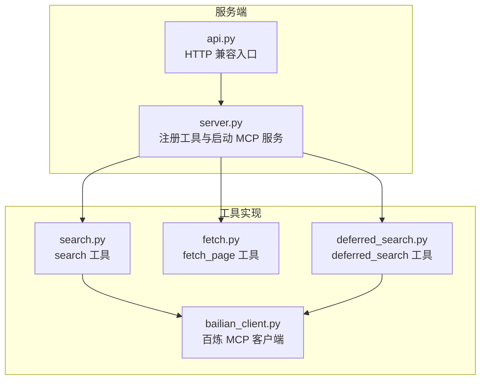
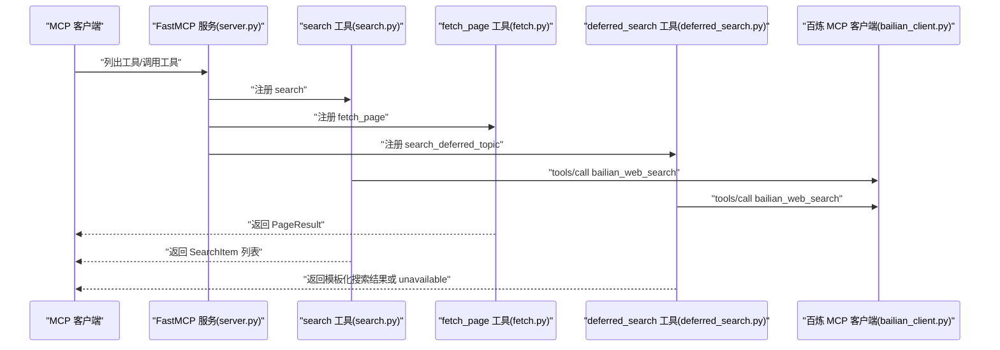
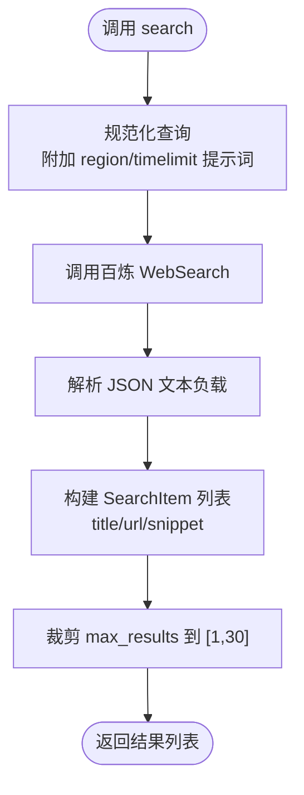
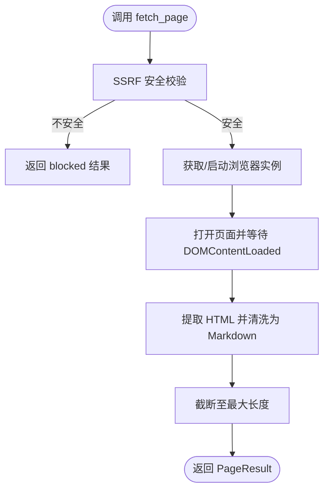
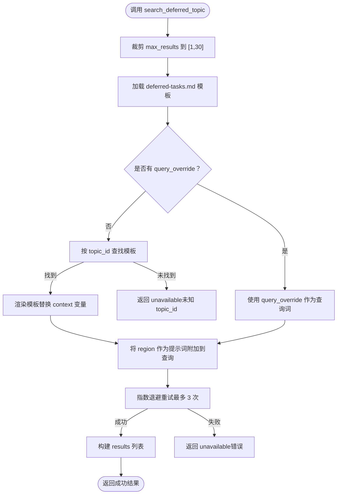
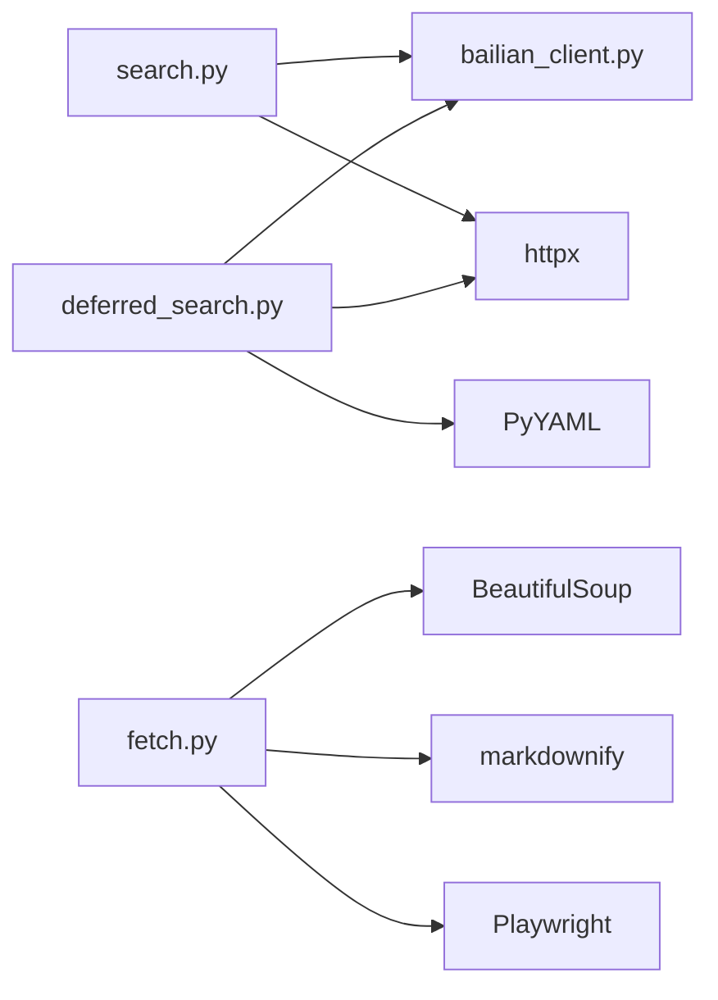

# 搜索工具接口

<cite>
**本文引用的文件**
- [search.py](file://nano-search-mcp/src/nano_search_mcp/tools/search.py)
- [fetch.py](file://nano-search-mcp/src/nano_search_mcp/tools/fetch.py)
- [deferred_search.py](file://nano-search-mcp/src/nano_search_mcp/tools/deferred_search.py)
- [bailian_client.py](file://nano-search-mcp/src/nano_search_mcp/tools/bailian_client.py)
- [server.py](file://nano-search-mcp/src/nano_search_mcp/server.py)
- [api.py](file://nano-search-mcp/src/nano_search_mcp/api.py)
- [README.md](file://nano-search-mcp/README.md)
- [test_fetch.py](file://nano-search-mcp/tests/test_fetch.py)
- [test_deferred_search.py](file://nano-search-mcp/tests/test_deferred_search.py)
- [test_deferred_tasks_parser.py](file://nano-search-mcp/tests/test_deferred_tasks_parser.py)
</cite>

## 目录
1. [简介](#简介)
2. [项目结构](#项目结构)
3. [核心组件](#核心组件)
4. [架构总览](#架构总览)
5. [详细组件分析](#详细组件分析)
6. [依赖分析](#依赖分析)
7. [性能考虑](#性能考虑)
8. [故障排查指南](#故障排查指南)
9. [结论](#结论)
10. [附录](#附录)

## 简介
本文件为搜索工具组的接口规范文档，覆盖以下三大工具：
- search：网页搜索工具，基于百炼 WebSearch MCP，返回标题、URL、摘要三项的搜索结果列表。
- fetch_page：页面内容抓取工具，基于 Playwright 异步渲染，输出 Markdown 正文，并内置 SSRF 防护。
- deferred_search：延迟搜索模板工具，支持从主题模板加载查询语句或直接使用自定义查询，具备指数退避重试与兜底返回。

文档详细说明每个工具的参数规范、返回值结构、错误处理机制、性能特征，并提供使用示例与最佳实践，帮助在 A 股外部证据采集场景中高效、安全地组合使用这些工具。

## 项目结构
- 工具实现位于 nano-search-mcp/src/nano_search_mcp/tools/，包含 search、fetch、deferred_search 以及百炼客户端封装 bailian_client。
- 服务入口位于 nano-search-mcp/src/nano_search_mcp/server.py，负责注册工具并提供 MCP 服务。
- HTTP 兼容入口位于 nano-search-mcp/src/nano_search_mcp/api.py，导出可复用的 ASGI 应用。
- README.md 提供整体能力说明、环境要求、安装与启动方式、典型调用流程等。

图表来源
- [server.py:18-69](file://nano-search-mcp/src/nano_search_mcp/server.py#L18-L69)
- [api.py:1-12](file://nano-search-mcp/src/nano_search_mcp/api.py#L1-L12)
- [search.py:79-119](file://nano-search-mcp/src/nano_search_mcp/tools/search.py#L79-L119)
- [fetch.py:220-245](file://nano-search-mcp/src/nano_search_mcp/tools/fetch.py#L220-L245)
- [deferred_search.py:145-238](file://nano-search-mcp/src/nano_search_mcp/tools/deferred_search.py#L145-L238)
- [bailian_client.py:12-93](file://nano-search-mcp/src/nano_search_mcp/tools/bailian_client.py#L12-L93)

章节来源
- [server.py:18-69](file://nano-search-mcp/src/nano_search_mcp/server.py#L18-L69)
- [README.md:178-198](file://nano-search-mcp/README.md#L178-L198)

## 核心组件
- search 工具：接收 query、max_results、region、timelimit 参数，内部对查询进行轻量规范化，调用百炼 WebSearch，返回 SearchItem 列表。
- fetch_page 工具：接收 url，进行 SSRF 安全校验，使用 Playwright 渲染页面并提取正文，返回 PageResult；失败时返回包含错误信息的字典。
- deferred_search 工具：根据 topic_id 加载模板或使用 query_override，支持 context 变量填充，执行百炼 WebSearch 并带指数退避重试，失败时返回 source: "unavailable" 的兜底结构。

章节来源
- [search.py:73-119](file://nano-search-mcp/src/nano_search_mcp/tools/search.py#L73-L119)
- [fetch.py:178-245](file://nano-search-mcp/src/nano_search_mcp/tools/fetch.py#L178-L245)
- [deferred_search.py:145-238](file://nano-search-mcp/src/nano_search_mcp/tools/deferred_search.py#L145-L238)

## 架构总览
以下序列图展示 MCP 服务如何注册并暴露三个搜索工具，以及工具间对百炼 MCP 的依赖关系。

图表来源
- [server.py:61-69](file://nano-search-mcp/src/nano_search_mcp/server.py#L61-L69)
- [search.py:79-119](file://nano-search-mcp/src/nano_search_mcp/tools/search.py#L79-L119)
- [fetch.py:220-245](file://nano-search-mcp/src/nano_search_mcp/tools/fetch.py#L220-L245)
- [deferred_search.py:145-238](file://nano-search-mcp/src/nano_search_mcp/tools/deferred_search.py#L145-L238)
- [bailian_client.py:63-93](file://nano-search-mcp/src/nano_search_mcp/tools/bailian_client.py#L63-L93)

## 详细组件分析

### search 工具接口规范
- 工具名称：search
- 功能：网页搜索，返回标题、URL、摘要三项的列表。
- 输入参数
  - query: 搜索关键词（必填，非空字符串）
  - max_results: 最大返回结果数，取值范围 [1, 30]，默认 5；超出范围会被截断到边界。
  - region: 搜索区域代码，常用值 "zh-cn"（中文）、"us-en"、"uk-en"、"wt-wt"（全球）；默认 "zh-cn"。
  - timelimit: 时间范围过滤，可选 "d"（近 1 天）/ "w"（近 1 周）/ "m"（近 1 月）/ "y"（近 1 年）；None 表示不限。
- 返回值类型：list[SearchItem]
  - SearchItem 字段：title（字符串）、url（字符串）、snippet（字符串）
- 错误处理
  - 当百炼 MCP 调用失败时，抛出 RuntimeError。
- 性能特征
  - 查询预处理：将 region/timelimit 以提示词形式拼接到 query，提升上游模型理解的可控性。
  - 结果裁剪：max_results 限定在 [1, 30]。
- 使用示例
  - 基本搜索：search(query="宁德时代 年报", max_results=5, region="zh-cn", timelimit="y")
  - 全球搜索：search(query="Tesla 10-K", max_results=10, region="wt-wt", timelimit="m")

图表来源
- [search.py:17-38](file://nano-search-mcp/src/nano_search_mcp/tools/search.py#L17-L38)
- [search.py:41-70](file://nano-search-mcp/src/nano_search_mcp/tools/search.py#L41-L70)
- [search.py:79-119](file://nano-search-mcp/src/nano_search_mcp/tools/search.py#L79-L119)
- [bailian_client.py:54-61](file://nano-search-mcp/src/nano_search_mcp/tools/bailian_client.py#L54-L61)

章节来源
- [search.py:73-119](file://nano-search-mcp/src/nano_search_mcp/tools/search.py#L73-L119)
- [bailian_client.py:12-93](file://nano-search-mcp/src/nano_search_mcp/tools/bailian_client.py#L12-L93)

### fetch_page 工具接口规范
- 工具名称：fetch_page
- 功能：抓取任意 HTTP/HTTPS 页面正文，输出 Markdown 格式正文，内置 SSRF 防护。
- 输入参数
  - url: 需要抓取的绝对 URL。
- 返回值类型：PageResult
  - 字段：url（实际抓取的 URL）、content（正文 Markdown；失败时为空字符串）、method（"playwright" | "blocked"）、truncated（是否因超长被截断）、error（失败时的错误信息，仅失败场景出现）。
- 错误处理
  - URL 不安全：返回 {method: "blocked", error: "...unsafe_url..."}。
  - 渲染/解析异常：返回 {method: "playwright", error: "..."}。
- 性能特征
  - 使用 Playwright 无头浏览器渲染页面，等待固定时长后提取正文。
  - 正文最大长度约 50 万字符，超长截断。
  - 浏览器实例惰性创建并复用，降低冷启动开销。
- 使用示例
  - 正常抓取：fetch_page(url="https://www.sina.com.cn/news")
  - 非法 URL：fetch_page(url="http://127.0.0.1/secret") → {method: "blocked"}

图表来源
- [fetch.py:24-74](file://nano-search-mcp/src/nano_search_mcp/tools/fetch.py#L24-L74)
- [fetch.py:133-175](file://nano-search-mcp/src/nano_search_mcp/tools/fetch.py#L133-L175)
- [fetch.py:186-245](file://nano-search-mcp/src/nano_search_mcp/tools/fetch.py#L186-L245)

章节来源
- [fetch.py:178-245](file://nano-search-mcp/src/nano_search_mcp/tools/fetch.py#L178-L245)
- [test_fetch.py:16-98](file://nano-search-mcp/tests/test_fetch.py#L16-L98)

### deferred_search 工具接口规范
- 工具名称：search_deferred_topic
- 功能：按主题模板或自由查询执行百炼 WebSearch，支持上下文变量填充，具备指数退避重试与兜底返回。
- 输入参数
  - topic_id: 主题标识符；自由查询模式下可传任意字符串作为结果标签。
  - query_override: 非空时覆盖主题模板，直接作为搜索词使用。
  - max_results: 返回结果上限，取值范围 [1, 30]，默认 10；越界自动截断。
  - region: 地区提示，默认 "cn-zh"（中文简体）；其它常用值 "wt-wt"（全球）、"us-en"、"uk-en"。
  - context: 模板变量字典，用于填充主题查询模板中的占位符。
- 返回值类型：统一字典结构
  - 成功：包含 topic_id、query、source（固定为 "bailian_web_search"）、results（SearchItem 列表）、fetch_time（ISO8601 UTC 时间戳）。
  - 失败：包含 topic_id、source（固定为 "unavailable"）、error（错误信息）、fetch_time。
- 错误处理
  - unknown topic_id 且无 query_override：返回 unavailable。
  - 模板缺失：返回 unavailable。
  - WebSearch 连续失败：返回 unavailable，并在 error 中包含最后一次异常。
- 性能特征
  - 指数退避重试：最多 3 次，每次退避时间包含随机抖动。
  - 查询合并：将 region 作为提示词附加到最终查询。
- 使用示例
  - 模板模式：search_deferred_topic(topic_id="m3b-gov-cn-policy", context={"industry": "光伏设备", "date_range": "2025-01-01"}, max_results=10)
  - 自由查询：search_deferred_topic(topic_id="adhoc", query_override="特斯拉 2023 年报", region="us-en")

图表来源
- [deferred_search.py:45-85](file://nano-search-mcp/src/nano_search_mcp/tools/deferred_search.py#L45-L85)
- [deferred_search.py:91-96](file://nano-search-mcp/src/nano_search_mcp/tools/deferred_search.py#L91-L96)
- [deferred_search.py:102-139](file://nano-search-mcp/src/nano_search_mcp/tools/deferred_search.py#L102-L139)
- [deferred_search.py:145-238](file://nano-search-mcp/src/nano_search_mcp/tools/deferred_search.py#L145-L238)

章节来源
- [deferred_search.py:145-238](file://nano-search-mcp/src/nano_search_mcp/tools/deferred_search.py#L145-L238)
- [test_deferred_search.py:119-142](file://nano-search-mcp/tests/test_deferred_search.py#L119-L142)
- [test_deferred_tasks_parser.py:16-155](file://nano-search-mcp/tests/test_deferred_tasks_parser.py#L16-L155)

## 依赖分析
- 组件耦合
  - search 与 deferred_search 均依赖 bailian_client 进行百炼 MCP 调用。
  - fetch_page 为独立工具，不依赖百炼，但依赖 Playwright 生态。
- 外部依赖
  - httpx：发起 HTTP 请求。
  - PyYAML：解析 deferred-tasks.md 中的 YAML 代码块。
  - Playwright：fetch_page 的页面渲染与正文提取。
  - BeautifulSoup + markdownify：HTML 清洗与 Markdown 转换。
- 接口契约
  - search：参数非法或网络彻底失败时抛异常。
  - 其余工具：失败时统一返回 {source: "unavailable", error, fetch_time}，不抛异常。

图表来源
- [search.py:8-13](file://nano-search-mcp/src/nano_search_mcp/tools/search.py#L8-L13)
- [deferred_search.py:23-27](file://nano-search-mcp/src/nano_search_mcp/tools/deferred_search.py#L23-L27)
- [fetch.py:10-12](file://nano-search-mcp/src/nano_search_mcp/tools/fetch.py#L10-L12)
- [bailian_client.py:10-11](file://nano-search-mcp/src/nano_search_mcp/tools/bailian_client.py#L10-L11)

章节来源
- [server.py:55-56](file://nano-search-mcp/src/nano_search_mcp/server.py#L55-L56)
- [README.md:47-48](file://nano-search-mcp/README.md#L47-L48)

## 性能考虑
- search
  - 查询预处理：将 region/timelimit 作为提示词拼接，减少上游模型理解偏差，提高检索质量。
  - 结果裁剪：限制 max_results，避免过多结果带来的解析与传输开销。
- fetch_page
  - 浏览器复用：惰性创建并复用 Chromium 实例，降低冷启动成本。
  - 正文截断：限制最大字符数，避免超长正文导致内存与传输压力。
  - 渲染等待：固定等待时间确保动态内容加载完成。
- deferred_search
  - 指数退避：在不稳定网络环境下提升成功率，同时控制重试频率。
  - 模板解析：一次性加载 deferred-tasks.md，避免频繁 IO。

章节来源
- [search.py:17-38](file://nano-search-mcp/src/nano_search_mcp/tools/search.py#L17-L38)
- [fetch.py:120-161](file://nano-search-mcp/src/nano_search_mcp/tools/fetch.py#L120-L161)
- [deferred_search.py:102-139](file://nano-search-mcp/src/nano_search_mcp/tools/deferred_search.py#L102-L139)

## 故障排查指南
- search 失败
  - 现象：抛出 RuntimeError。
  - 排查：确认百炼 MCP 端点与鉴权配置正确，检查网络连通性。
- fetch_page 返回 blocked
  - 现象：{method: "blocked", error: "...unsafe_url..."}。
  - 排查：检查 URL 协议是否为 http/https，目标主机是否为内网/回环/保留地址。
- deferred_search 返回 unavailable
  - 现象：{source: "unavailable", error, fetch_time}。
  - 排查：确认 topic_id 是否存在且模板有效；检查网络与百炼 MCP 可用性；观察重试日志。

章节来源
- [search.py:55-56](file://nano-search-mcp/src/nano_search_mcp/tools/search.py#L55-L56)
- [fetch.py:189-217](file://nano-search-mcp/src/nano_search_mcp/tools/fetch.py#L189-L217)
- [deferred_search.py:204-229](file://nano-search-mcp/src/nano_search_mcp/tools/deferred_search.py#L204-L229)
- [test_fetch.py:82-98](file://nano-search-mcp/tests/test_fetch.py#L82-L98)
- [test_deferred_search.py:201-251](file://nano-search-mcp/tests/test_deferred_search.py#L201-L251)

## 结论
搜索工具组提供了从“搜索—抓取—模板化检索”的完整链路，满足 A 股外部证据采集场景的需求。search 适合快速检索，fetch_page 提供高质量正文抽取并内置安全防护，deferred_search 则通过模板与重试机制提升稳定性与一致性。配合 MCP 服务化部署，可在各类 Agent 场景中稳定复用。

## 附录

### 参数与返回值速查
- search
  - 输入：query（必填）、max_results（1-30，默认 5）、region（如 "zh-cn"）、timelimit（可选 "d"/"w"/"m"/"y"）
  - 输出：list[SearchItem(title, url, snippet)]
  - 错误：RuntimeError（百炼 MCP 调用失败）
- fetch_page
  - 输入：url（绝对 HTTP/HTTPS）
  - 输出：PageResult（url、content、method、truncated、error）
  - 错误：blocked 或 playwright 失败时返回 error 字段
- deferred_search
  - 输入：topic_id、query_override、max_results（1-30，默认 10）、region、context
  - 输出：成功或 unavailable（包含 source、results、fetch_time、error）

章节来源
- [search.py:82-119](file://nano-search-mcp/src/nano_search_mcp/tools/search.py#L82-L119)
- [fetch.py:223-245](file://nano-search-mcp/src/nano_search_mcp/tools/fetch.py#L223-L245)
- [deferred_search.py:148-238](file://nano-search-mcp/src/nano_search_mcp/tools/deferred_search.py#L148-L238)

### 最佳实践
- 搜索查询优化
  - 使用 region/timelimit 提示词增强检索意图表达，必要时在 query 中显式限定。
  - 控制 max_results，避免过多结果影响后续处理效率。
- 结果过滤
  - 对 search 结果先做标题/摘要关键词过滤，再决定是否 fetch_page。
  - 对 deferred_search 的 results 进行二次筛选，优先命中模板预期领域。
- 页面解析策略
  - fetch_page 默认清洗 header/footer/nav/aside 与广告类元素，保留 article/main/body 中的正文。
  - 对超长正文注意 truncated 标记，必要时分段处理或转存到外部存储。
- 安全与稳定性
  - 严格遵守 SSRF 防护，仅访问公网可访问的 URL。
  - 在不稳定网络环境中优先使用 deferred_search 的重试机制。
  - 设置合理的请求超时，避免被反向代理或网关提前中断。

章节来源
- [fetch.py:100-110](file://nano-search-mcp/src/nano_search_mcp/tools/fetch.py#L100-L110)
- [deferred_search.py:102-139](file://nano-search-mcp/src/nano_search_mcp/tools/deferred_search.py#L102-L139)
- [README.md:149-159](file://nano-search-mcp/README.md#L149-L159)