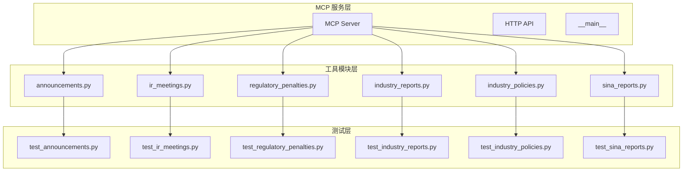
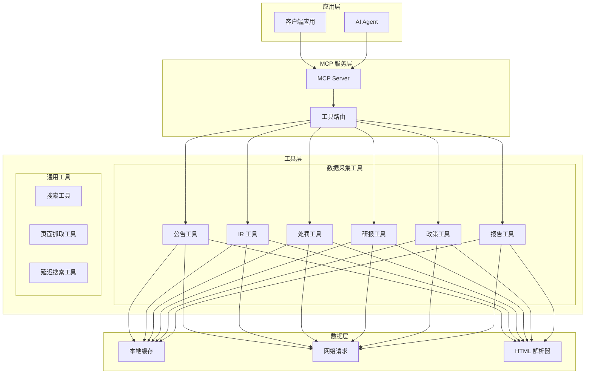
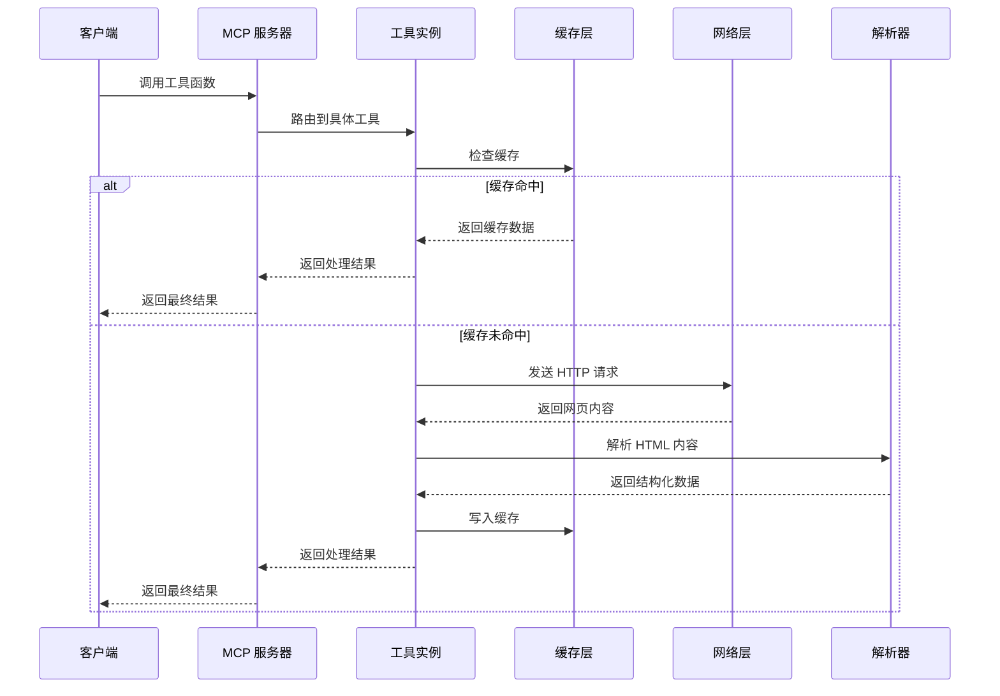
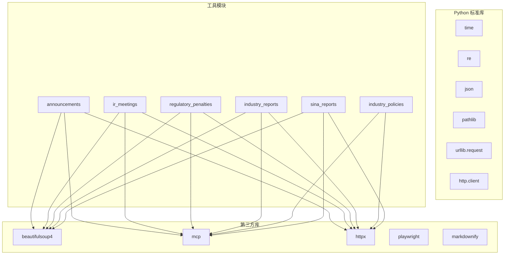

# 金融数据工具接口

<cite>
**本文档引用的文件**
- [announcements.py](file://nano-search-mcp/src/nano_search_mcp/tools/announcements.py)
- [industry_reports.py](file://nano-search-mcp/src/nano_search_mcp/tools/industry_reports.py)
- [regulatory_penalties.py](file://nano-search-mcp/src/nano_search_mcp/tools/regulatory_penalties.py)
- [ir_meetings.py](file://nano-search-mcp/src/nano_search_mcp/tools/ir_meetings.py)
- [industry_policies.py](file://nano-search-mcp/src/nano_search_mcp/tools/industry_policies.py)
- [sina_reports.py](file://nano-search-mcp/src/nano_search_mcp/tools/sina_reports.py)
- [test_announcements.py](file://nano-search-mcp/tests/test_announcements.py)
- [test_industry_reports.py](file://nano-search-mcp/tests/test_industry_reports.py)
- [test_regulatory_penalties.py](file://nano-search-mcp/tests/test_regulatory_penalties.py)
- [test_ir_meetings.py](file://nano-search-mcp/tests/test_ir_meetings.py)
- [test_industry_policies.py](file://nano-search-mcp/tests/test_industry_policies.py)
- [test_sina_reports.py](file://nano-search-mcp/tests/test_sina_reports.py)
- [README.md](file://nano-search-mcp/README.md)
- [pyproject.toml](file://nano-search-mcp/pyproject.toml)
</cite>

## 目录
1. [简介](#简介)
2. [项目结构](#项目结构)
3. [核心组件](#核心组件)
4. [架构概览](#架构概览)
5. [详细组件分析](#详细组件分析)
6. [依赖分析](#依赖分析)
7. [性能考虑](#性能考虑)
8. [故障排除指南](#故障排除指南)
9. [结论](#结论)
10. [附录](#附录)

## 简介

本文档为金融数据工具组创建详细的接口规范文档，涵盖以下六个核心工具：

- **announcements 工具**：公司公告查询接口
- **industry_reports 工具**：行业研究报告获取接口  
- **regulatory_penalties 工具**：监管处罚记录查询接口
- **ir_meetings 工具**：投资者关系活动查询接口
- **industry_policies 工具**：行业政策法规查询接口
- **sina_reports 工具**：新浪财经研报获取接口

这些工具基于 MCP（Model Context Protocol）协议构建，提供标准化的金融数据查询能力，支持 A 股上市公司相关信息的采集和分析。

## 项目结构

金融数据工具组位于 `nano-search-mcp` 项目中，采用模块化设计，每个工具都是独立的 Python 模块，通过 MCP 工具注册机制集成到统一的服务框架中。



**图表来源**
- [README.md:178-198](file://nano-search-mcp/README.md#L178-L198)
- [pyproject.toml:16-22](file://nano-search-mcp/pyproject.toml#L16-L22)

**章节来源**
- [README.md:178-198](file://nano-search-mcp/README.md#L178-L198)
- [pyproject.toml:16-22](file://nano-search-mcp/pyproject.toml#L16-L22)

## 核心组件

金融数据工具组包含六个专门的数据采集工具，每个工具都实现了完整的数据获取、解析、缓存和错误处理机制：

### 工具功能概览

| 工具名称 | 数据源 | 主要功能 | 输出格式 |
|---------|--------|----------|----------|
| announcements | 新浪财经 vCB_AllBulletin | 临时公告列表查询 | JSON 结构化数据 |
| industry_reports | 新浪财经行业研报 | 行业研究报告获取 | 研报列表 + 正文 |
| regulatory_penalties | 新浪财经违规处理 | 监管处罚记录查询 | 处罚记录列表 |
| ir_meetings | 新浪财经临时公告 | 投资者关系活动 | 会议记录 + 参会机构 |
| industry_policies | 百炼 WebSearch gov.cn | 行业政策法规 | 政策文件列表 |
| sina_reports | 新浪财经定期报告 | 公司定期报告获取 | 报告正文内容 |

### 安全与可靠性特性

所有工具都具备以下安全和可靠性特性：
- **SSRF 防护**：严格的域名白名单验证
- **输入验证**：参数格式和范围检查
- **缓存机制**：智能缓存策略减少重复请求
- **重试机制**：指数退避重试处理网络异常
- **错误处理**：统一的错误响应格式

**章节来源**
- [README.md:47-54](file://nano-search-mcp/README.md#L47-L54)

## 架构概览

金融数据工具组采用分层架构设计，确保了良好的可维护性和扩展性。



**图表来源**
- [README.md:28-49](file://nano-search-mcp/README.md#L28-L49)

### 数据流处理



**图表来源**
- [announcements.py:336-376](file://nano-search-mcp/src/nano_search_mcp/tools/announcements.py#L336-L376)
- [industry_reports.py:308-369](file://nano-search-mcp/src/nano_search_mcp/tools/industry_reports.py#L308-L369)

## 详细组件分析

### announcements 工具接口规范

#### 功能概述
announcements 工具用于查询 A 股上市公司的临时公告信息，支持按日期范围过滤和公告类型分类。

#### 参数规范

| 参数名 | 类型 | 必填 | 默认值 | 说明 |
|--------|------|------|--------|------|
| ts_code | string | 是 | 无 | Tushare 格式股票代码，如 "688270.SH" |
| start_date | string | 否 | 当年1月1日 | 起始日期，格式 YYYY-MM-DD |
| end_date | string | 否 | 今日 | 结束日期，格式 YYYY-MM-DD |
| ann_types | list[string] | 否 | 全部类型 | 公告类型过滤器 |

#### 公告类型分类

| 类型标识 | 语义描述 | 关键词示例 |
|----------|----------|------------|
| inquiry | 问询函 | 问询函、监管工作函、关注函 |
| audit | 审计报告 | 审计报告、审计意见、关键审计事项 |
| accountant_change | 会计师事务所变更 | 会计师事务所变更、更换会计师 |
| litigation | 诉讼 | 诉讼、仲裁、法律纠纷 |
| penalty | 监管处罚 | 行政处罚、纪律处分、监管措施 |
| restatement | 差错更正 | 差错更正、财报重述、追溯调整 |
| other | 其他公告 | 未归类的其他公告 |

#### 返回结构

```json
{
  "ts_code": "688270.SH",
  "source": "sina",
  "announcements": [
    {
      "ann_date": "2025-04-15",
      "title": "关于收到行政处罚事先告知书的公告",
      "ann_type": "penalty",
      "source_url": "http://vip.stock.finance.sina.com.cn/...",
      "pdf_url": null
    }
  ]
}
```

#### 错误处理
当输入参数无效或网络请求失败时，返回统一的错误格式：
```json
{
  "ts_code": "INVALID",
  "source": "unavailable",
  "error": "错误信息",
  "fetch_time": "2025-01-01T00:00:00Z"
}
```

**章节来源**
- [announcements.py:404-535](file://nano-search-mcp/src/nano_search_mcp/tools/announcements.py#L404-L535)
- [announcements.py:58-71](file://nano-search-mcp/src/nano_search_mcp/tools/announcements.py#L58-L71)

### industry_reports 工具接口规范

#### 功能概述
industry_reports 工具用于获取券商发布的行业研究报告，支持按申万行业分类和关键词过滤。

#### 参数规范

| 参数名 | 类型 | 必填 | 默认值 | 说明 |
|--------|------|------|--------|------|
| industry_sw_l2 | string | 否 | 空 | 申万二级行业名，如 "汽车零部件" |
| keywords | list[string] | 否 | 空 | 标题关键词白名单 |
| start_date | string | 否 | 一年前 | 起始日期，格式 YYYY-MM-DD |
| end_date | string | 否 | 今日 | 结束日期，格式 YYYY-MM-DD |
| limit | integer | 否 | 50 | 返回条数上限，范围 [1, 200] |
| ts_code | string | 否 | 空 | Tushare 格式股票代码，自动路由行业 |

#### 返回结构

```json
{
  "industry_sw_l2": "汽车零部件",
  "source": "sina",
  "reports": [
    {
      "report_date": "2026-04-18",
      "publisher": "中信证券",
      "title": "汽车玻璃行业深度报告",
      "industry_tags": ["汽车零部件"],
      "source_url": "https://stock.finance.sina.com.cn/...",
      "summary": ""
    }
  ]
}
```

#### 行业标签规则
工具会自动为报告添加行业标签，规则如下：
1. 如果提供了 `industry_sw_l2` 参数，自动添加该行业标签
2. 如果报告标题包含关键词，自动添加相应标签
3. 标签去重并保持唯一性

**章节来源**
- [industry_reports.py:384-495](file://nano-search-mcp/src/nano_search_mcp/tools/industry_reports.py#L384-L495)
- [industry_reports.py:195-207](file://nano-search-mcp/src/nano_search_mcp/tools/industry_reports.py#L195-L207)

### regulatory_penalties 工具接口规范

#### 功能概述
regulatory_penalties 工具用于查询 A 股上市公司的监管处罚记录，包括行政处罚、监管措施等违规处理信息。

#### 参数规范

| 参数名 | 类型 | 必填 | 默认值 | 说明 |
|--------|------|------|--------|------|
| ts_code | string | 是 | 无 | Tushare 格式股票代码，如 "688270.SH" |
| start_date | string | 否 | 无限制 | 起始日期，格式 YYYY-MM-DD |
| end_date | string | 否 | 无限制 | 结束日期，格式 YYYY-MM-DD |

#### 返回结构

```json
{
  "ts_code": "688270.SH",
  "source": "sina",
  "penalties": [
    {
      "punish_date": "2026-04-18",
      "event_type": "处罚决定",
      "title": "关于收到行政处罚事先告知书的公告",
      "reason": "信息披露违规",
      "content": "责令改正，警告并处罚款50万元",
      "issuer": "浙江证监局",
      "source_url": "https://vip.stock.finance.sina.com.cn/..."
    }
  ]
}
```

#### 处理机构标准化
工具会将原始处理机构文本标准化为简短标识：
- "上海证券交易所" → "上交所"
- "深圳证券交易所" → "深交所" 
- "北京证券交易所" → "北交所"
- 地方监管局 → "省份+证监局"
- 证监会 → "证监会"

**章节来源**
- [regulatory_penalties.py:393-447](file://nano-search-mcp/src/nano_search_mcp/tools/regulatory_penalties.py#L393-L447)
- [regulatory_penalties.py:236-266](file://nano-search-mcp/src/nano_search_mcp/tools/regulatory_penalties.py#L236-L266)

### ir_meetings 工具接口规范

#### 功能概述
ir_meetings 工具用于查询投资者关系活动记录，包括机构调研、业绩说明会、实地调研等活动。

#### 参数规范

| 参数名 | 类型 | 必填 | 默认值 | 说明 |
|--------|------|------|--------|------|
| ts_code | string | 是 | 无 | Tushare 格式股票代码，如 "000001.SZ" |
| start_date | string | 否 | 6个月前 | 起始日期，格式 YYYY-MM-DD |
| end_date | string | 否 | 今日 | 结束日期，格式 YYYY-MM-DD |
| meeting_types | list[string] | 否 | 全部类型 | 会议类型过滤器 |

#### 会议类型分类

| 类型标识 | 语义描述 | 关键词示例 |
|----------|----------|------------|
| research | 机构调研 | 调研、机构投资者、活动记录表 |
| earnings_call | 业绩说明会 | 业绩说明会、业绩交流会、电话会 |
| site_visit | 实地调研 | 实地调研、现场参观、参观 |
| other | 其他 IR 活动 | 未归类的其他 IR 活动 |

#### 返回结构

```json
{
  "ts_code": "000001.SZ",
  "source": "sina",
  "meetings": [
    {
      "meeting_date": "2026-03-20",
      "meeting_type": "research",
      "participants": ["中信证券", "高瓴资本"],
      "title": "投资者关系活动记录表",
      "summary": "",
      "source_url": "http://vip.stock.finance.sina.com.cn/..."
    }
  ]
}
```

#### 参会机构提取
工具会从会议纪要正文中提取参会机构信息，支持多种格式：
- "参会机构：中信证券、高瓴资本"
- "接待机构：易方达基金"
- "与会人员：中金公司、博时基金"

**章节来源**
- [ir_meetings.py:489-618](file://nano-search-mcp/src/nano_search_mcp/tools/ir_meetings.py#L489-L618)
- [ir_meetings.py:279-308](file://nano-search-mcp/src/nano_search_mcp/tools/ir_meetings.py#L279-L308)

### industry_policies 工具接口规范

#### 功能概述
industry_policies 工具用于搜索中国政府机构发布的行业政策法规，基于百炼 WebSearch 实现。

#### 参数规范

| 参数名 | 类型 | 必填 | 默认值 | 说明 |
|--------|------|------|--------|------|
| industry_sw_l2 | string | 否 | 空 | 申万二级行业名，如 "汽车零部件" |
| keywords | list[string] | 否 | 空 | 主营业务关键词列表 |

#### 政策搜索策略
工具会根据输入参数构造多种搜索查询：
1. 仅行业关键词查询：`"汽车零部件" 产业政策 site:gov.cn`
2. 仅关键词查询：`"新能源" 政策 site:gov.cn`
3. 组合查询：行业关键词 + 关键词组合

#### 返回结构

```json
{
  "industry_sw_l2": "汽车零部件",
  "source": "bailian_web_search_gov_cn",
  "policies": [
    {
      "pub_date": "",
      "issuer": "国家发展改革委",
      "title": "关于促进汽车零部件产业发展的指导意见",
      "level": "ministry",
      "source_url": "https://www.ndrc.gov.cn/...",
      "summary": "支持汽车零部件技术创新..."
    }
  ],
  "fetch_time": "2025-01-01T00:00:00Z"
}
```

#### 政策级别分类
- **central**：中央机构（如中国人民银行）
- **ministry**：部委级机构（如工业和信息化部）
- **local**：地方政府机构

**章节来源**
- [industry_policies.py:185-246](file://nano-search-mcp/src/nano_search_mcp/tools/industry_policies.py#L185-L246)
- [industry_policies.py:33-52](file://nano-search-mcp/src/nano_search_mcp/tools/industry_policies.py#L33-L52)

### sina_reports 工具接口规范

#### 功能概述
sina_reports 工具用于获取 A 股上市公司的定期报告全文，包括年报、半年报、一季报、三季报。

#### 参数规范

| 参数名 | 类型 | 必填 | 默认值 | 说明 |
|--------|------|------|--------|------|
| stockid | string | 是 | 无 | 6位数字股票代码，不含交易所前缀 |
| year | integer | 是 | 无 | 报告所属年份 |
| report_type | string | 否 | "annual" | 报告类型 |

#### 报告类型映射

| 输入值 | 内部键 | 报告类型 | 中文名称 |
|--------|--------|----------|----------|
| "annual" | "annual" | 年度报告 | 年报 |
| "年报" | "annual" | 年度报告 | 年报 |
| "semi" | "semi" | 半年度报告 | 半年报 |
| "中报" | "semi" | 半年度报告 | 半年报 |
| "q1" | "q1" | 第一季度报告 | 一季报 |
| "一季报" | "q1" | 第一季度报告 | 一季报 |
| "q3" | "q3" | 第三季度报告 | 三季报 |
| "三季报" | "q3" | 第三季度报告 | 三季报 |

#### 返回内容
工具返回完整的报告正文，包含报告标题、发布日期和来源链接：
```
【2023年年度报告】
发布日期：2024-04-10
来源：http://vip.stock.finance.sina.com.cn/...

报告正文内容...
```

#### 错误处理
- 股票代码格式错误：抛出 ValueError
- 年份格式错误：抛出 ValueError  
- 报告类型不支持：抛出 ValueError
- 未找到目标报告：抛出 ValueError
- 正文抓取失败：抛出 RuntimeError

**章节来源**
- [sina_reports.py:314-369](file://nano-search-mcp/src/nano_search_mcp/tools/sina_reports.py#L314-L369)
- [sina_reports.py:46-68](file://nano-search-mcp/src/nano_search_mcp/tools/sina_reports.py#L46-L68)

## 依赖分析

金融数据工具组的依赖关系相对简单，主要依赖于标准库和第三方库。



**图表来源**
- [pyproject.toml:6-14](file://nano-search-mcp/pyproject.toml#L6-L14)

### 外部依赖

| 依赖库 | 版本要求 | 用途 |
|--------|----------|------|
| mcp | >=1.0.0 | MCP 协议支持 |
| beautifulsoup4 | >=4.12.0 | HTML 解析 |
| httpx | >=0.27.0 | HTTP 请求 |
| playwright | >=1.40.0 | 页面渲染（可选） |
| markdownify | >=0.13.0 | Markdown 转换（可选） |

**章节来源**
- [pyproject.toml:6-14](file://nano-search-mcp/pyproject.toml#L6-L14)

## 性能考虑

### 缓存策略

所有工具都实现了智能缓存机制，以提高性能和减少网络负载：

| 工具 | 缓存类型 | TTL（小时） | 缓存键 |
|------|----------|-------------|--------|
| announcements | 列表页 | 1 | stockid + page |
| announcements | 详情页 | 168 | 公告ID |
| industry_reports | 列表页 | 1 | 查询参数哈希 |
| industry_reports | 详情页 | 168 | URL 哈希 |
| regulatory_penalties | 列表页 | 1 | 股票代码 |
| ir_meetings | 列表页 | 1 | stockid + page |
| ir_meetings | 详情页 | 168 | 公告ID |
| sina_reports | 列表页 | 1 | stockid + report_type |
| sina_reports | 详情页 | 168 | report_id |

### 请求限速

工具实现了请求节流机制，确保不会对目标服务器造成过大压力：
- **请求间隔**：至少 1 秒间隔
- **重试策略**：指数退避（2^attempt + 随机抖动）
- **最大重试次数**：3 次

### 内存优化

- **分页处理**：限制最大翻页数，避免内存溢出
- **数据过滤**：在获取过程中实时过滤不需要的数据
- **缓存清理**：定期清理过期缓存文件

## 故障排除指南

### 常见错误类型

#### 参数验证错误
```python
# 示例：股票代码格式错误
ValueError: stockid 必须是 6 位纯数字字符串，收到: "INVALID"

# 示例：日期格式错误  
ValueError: start_date 格式应为 YYYY-MM-DD，收到: "2026/01/01"
```

#### 网络请求错误
```python
# 示例：HTTP 请求失败
RuntimeError: 抓取新浪公告页失败，已重试 3 次: https://... 最后错误: Connection refused
```

#### 数据解析错误
```python
# 示例：页面结构变更
Warning: 未找到 div.datelist，页面结构可能已变更
```

### 排查步骤

1. **检查输入参数**
   - 确认股票代码格式正确（6位数字）
   - 验证日期格式为 YYYY-MM-DD
   - 检查过滤条件的有效性

2. **网络连接检查**
   - 确认能够访问目标网站
   - 检查防火墙设置
   - 验证代理配置

3. **缓存问题排查**
   - 清理缓存目录：`~/.cache/nano_search_mcp/`
   - 检查磁盘空间
   - 验证文件权限

4. **日志分析**
   - 查看工具日志输出
   - 检查重试记录
   - 分析错误堆栈

### 最佳实践

#### 参数验证
```python
# 建议的参数验证流程
def validate_parameters(ts_code, start_date, end_date):
    # 验证股票代码
    if not re.match(r'^\d{6}$', ts_code):
        raise ValueError("股票代码必须是6位数字")
    
    # 验证日期格式
    for date_param in [start_date, end_date]:
        if date_param and not re.match(r'^\d{4}-\d{2}-\d{2}$', date_param):
            raise ValueError("日期格式必须为 YYYY-MM-DD")
```

#### 错误处理
```python
# 建议的错误处理模式
try:
    result = tool_function(parameters)
except ValueError as e:
    # 参数错误，立即返回
    return {"source": "unavailable", "error": str(e)}
except RuntimeError as e:
    # 网络错误，稍后重试
    logger.warning(f"网络错误: {e}")
    return {"source": "unavailable", "error": str(e)}
```

#### 性能优化
```python
# 建议的缓存使用策略
def get_cached_data(key, ttl_hours):
    cache_file = get_cache_path(key)
    if is_fresh(cache_file, ttl_hours):
        return read_cache(cache_file)
    return None

# 建议的请求限速
def rate_limit():
    global last_request_time
    elapsed = time.monotonic() - last_request_time
    if elapsed < 1.0:  # 至少1秒间隔
        time.sleep(1.0 - elapsed)
    last_request_time = time.monotonic()
```

**章节来源**
- [announcements.py:85-124](file://nano-search-mcp/src/nano_search_mcp/tools/announcements.py#L85-L124)
- [industry_reports.py:50-53](file://nano-search-mcp/src/nano_search_mcp/tools/industry_reports.py#L50-L53)
- [regulatory_penalties.py:79-82](file://nano-search-mcp/src/nano_search_mcp/tools/regulatory_penalties.py#L79-L82)

## 结论

金融数据工具组提供了完整的 A 股上市公司信息查询能力，具有以下特点：

### 优势
- **标准化接口**：统一的 MCP 工具接口，便于集成和使用
- **安全可靠**：完善的 SSRF 防护和错误处理机制
- **高效性能**：智能缓存和请求限速，减少网络负载
- **灵活配置**：支持多种过滤条件和自定义参数

### 适用场景
- 金融数据分析平台
- AI Agent 辅助决策系统  
- 公司研究和尽职调查
- 监管合规监控

### 改进建议
- 增加更多数据源支持
- 优化缓存策略
- 扩展错误恢复机制
- 提供更详细的统计信息

## 附录

### 工具注册与使用

所有工具都通过 MCP 服务器注册，可以在启动后直接调用：

```bash
# 启动 MCP 服务器
nano-search-mcp

# 或使用 Python 直接导入
python -c "from nano_search_mcp.server import mcp; print(mcp)"
```

### 测试覆盖率

单元测试覆盖了以下方面：
- 参数验证和错误处理
- HTML 解析和数据提取
- 缓存机制和性能优化
- 网络请求和重试逻辑
- 工具集成和 API 兼容性

### 版本兼容性

- **Python 版本**：3.10+
- **MCP 协议**：>=1.0.0
- **操作系统**：Linux、macOS、Windows

**章节来源**
- [README.md:160-177](file://nano-search-mcp/README.md#L160-L177)