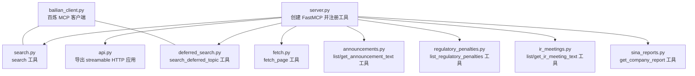
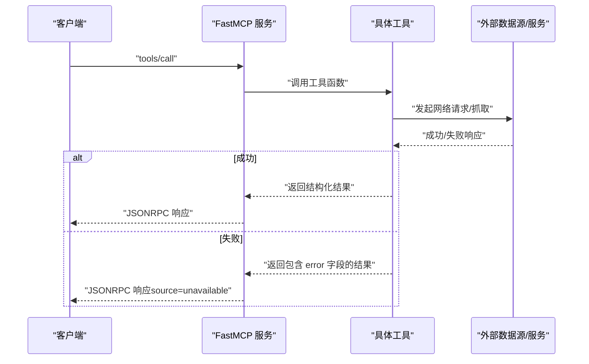
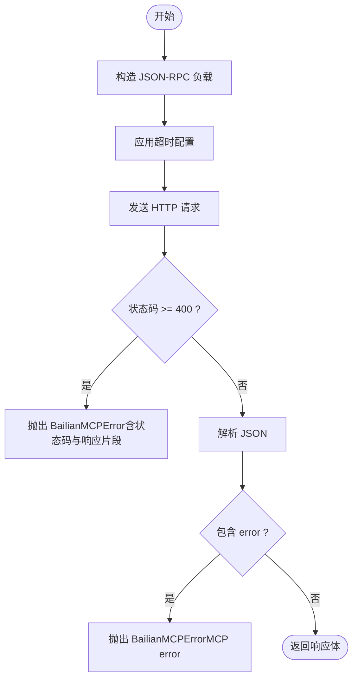
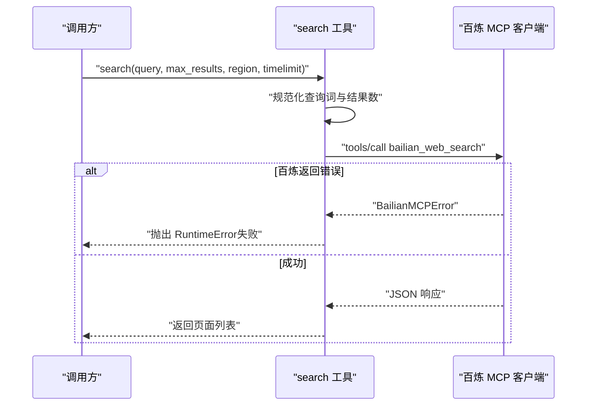
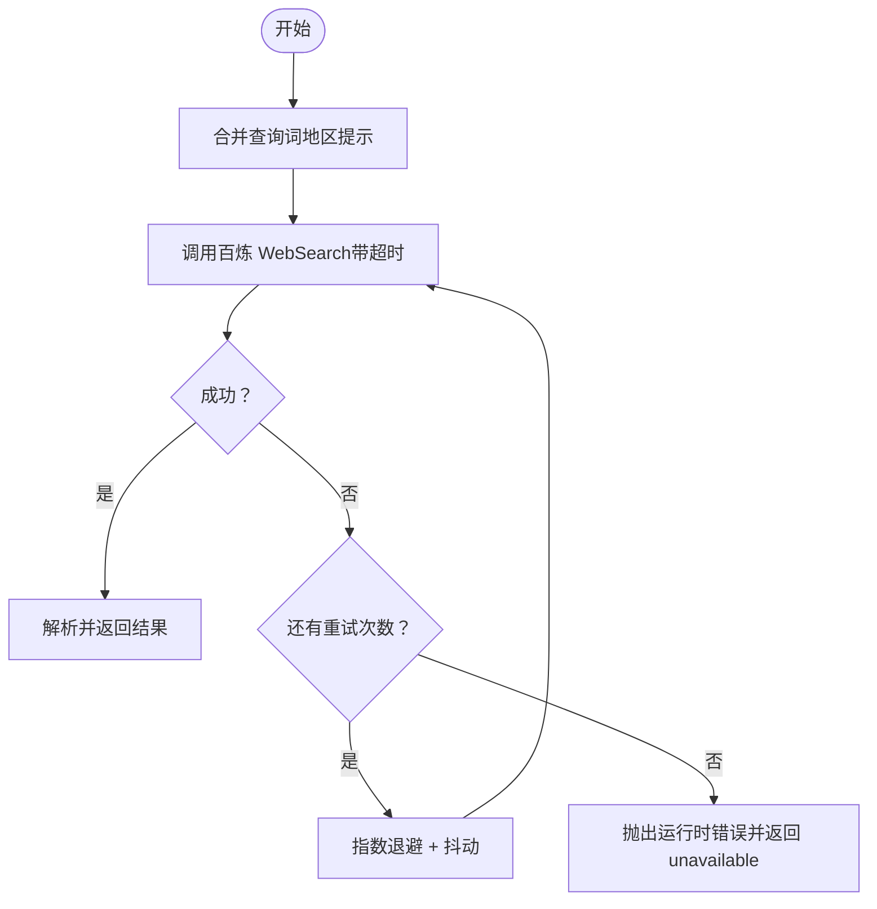
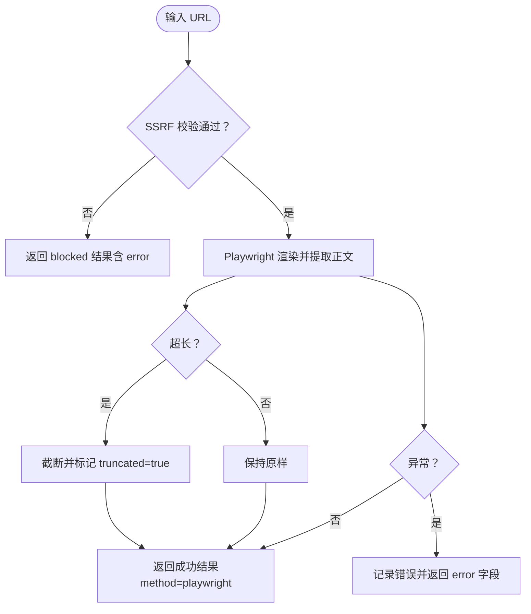
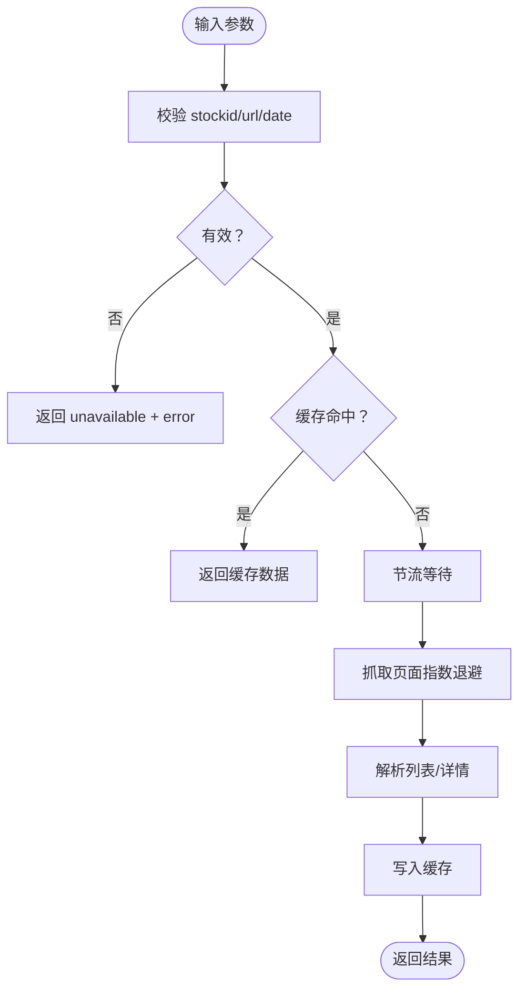
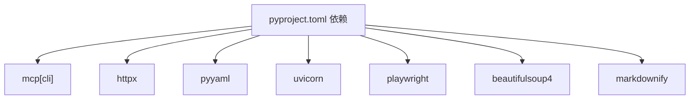

# 错误处理与诊断

<cite>
**本文引用的文件**
- [server.py](file://nano-search-mcp/src/nano_search_mcp/server.py)
- [api.py](file://nano-search-mcp/src/nano_search_mcp/api.py)
- [bailian_client.py](file://nano-search-mcp/src/nano_search_mcp/tools/bailian_client.py)
- [search.py](file://nano-search-mcp/src/nano_search_mcp/tools/search.py)
- [deferred_search.py](file://nano-search-mcp/src/nano_search_mcp/tools/deferred_search.py)
- [fetch.py](file://nano-search-mcp/src/nano_search_mcp/tools/fetch.py)
- [announcements.py](file://nano-search-mcp/src/nano_search_mcp/tools/announcements.py)
- [regulatory_penalties.py](file://nano-search-mcp/src/nano_search_mcp/tools/regulatory_penalties.py)
- [ir_meetings.py](file://nano-search-mcp/src/nano_search_mcp/tools/ir_meetings.py)
- [sina_reports.py](file://nano-search-mcp/src/nano_search_mcp/tools/sina_reports.py)
- [test_server.py](file://nano-search-mcp/tests/test_server.py)
- [pyproject.toml](file://nano-search-mcp/pyproject.toml)
</cite>

## 目录
1. [简介](#简介)
2. [项目结构](#项目结构)
3. [核心组件](#核心组件)
4. [架构总览](#架构总览)
5. [详细组件分析](#详细组件分析)
6. [依赖分析](#依赖分析)
7. [性能考量](#性能考量)
8. [故障排查指南](#故障排查指南)
9. [结论](#结论)
10. [附录](#附录)

## 简介
本文件聚焦于本仓库中 API 的错误处理与诊断机制，涵盖网络错误、上游限流与错误、数据验证错误、系统内部错误的处理策略，以及重试策略、超时配置、降级处理、日志与监控建议、客户端错误处理建议与最佳实践。文档基于实际源码进行梳理，帮助开发者与运维人员快速定位问题、优化健壮性与可观测性。

## 项目结构
- 服务入口与主服务：server.py 创建 FastMCP 实例并注册各类工具；api.py 暴露可复用的 streamable HTTP 应用。
- 工具模块：围绕不同数据源（百炼 MCP、新浪财经、百炼 WebSearch）实现搜索、抓取、报告、公告、监管处罚、IR 会议等工具。
- 测试与配置：test_server.py 确认工具注册与传输方式；pyproject.toml 提供依赖与构建信息。

图表来源
- [server.py:18-69](file://nano-search-mcp/src/nano_search_mcp/server.py#L18-L69)
- [api.py:3-6](file://nano-search-mcp/src/nano_search_mcp/api.py#L3-L6)
- [search.py:79-119](file://nano-search-mcp/src/nano_search_mcp/tools/search.py#L79-L119)
- [deferred_search.py:145-238](file://nano-search-mcp/src/nano_search_mcp/tools/deferred_search.py#L145-L238)
- [fetch.py:220-245](file://nano-search-mcp/src/nano_search_mcp/tools/fetch.py#L220-L245)
- [announcements.py:404-535](file://nano-search-mcp/src/nano_search_mcp/tools/announcements.py#L404-L535)
- [regulatory_penalties.py:393-447](file://nano-search-mcp/src/nano_search_mcp/tools/regulatory_penalties.py#L393-L447)
- [ir_meetings.py:489-618](file://nano-search-mcp/src/nano_search_mcp/tools/ir_meetings.py#L489-L618)
- [sina_reports.py:314-369](file://nano-search-mcp/src/nano_search_mcp/tools/sina_reports.py#L314-L369)
- [bailian_client.py:63-93](file://nano-search-mcp/src/nano_search_mcp/tools/bailian_client.py#L63-L93)

章节来源
- [server.py:18-69](file://nano-search-mcp/src/nano_search_mcp/server.py#L18-L69)
- [api.py:3-6](file://nano-search-mcp/src/nano_search_mcp/api.py#L3-L6)

## 核心组件
- FastMCP 服务与工具注册：server.py 构建 FastMCP 实例，注册搜索、抓取、报告、公告、监管处罚、IR 会议、行业研报等工具，并声明错误契约。
- 百炼 MCP 客户端：bailian_client.py 封装 HTTP 调用、超时、认证、错误解析与统一异常类型。
- 工具实现：各工具模块负责参数校验、重试、退避、缓存、日志与错误返回结构，遵循统一的错误处理契约。

章节来源
- [server.py:18-69](file://nano-search-mcp/src/nano_search_mcp/server.py#L18-L69)
- [bailian_client.py:24-93](file://nano-search-mcp/src/nano_search_mcp/tools/bailian_client.py#L24-L93)

## 架构总览
服务采用“MCP 工具 + 外部数据源”的组合模式：
- 搜索类工具通过百炼 MCP 客户端调用外部 WebSearch 接口。
- 抓取类工具通过 HTTP/HTTPS 抓取第三方站点内容，部分工具使用 Playwright。
- 工具在失败时返回结构化的错误字段，不抛出异常，保证调用方稳定处理。

图表来源
- [server.py:55-56](file://nano-search-mcp/src/nano_search_mcp/server.py#L55-L56)
- [bailian_client.py:63-93](file://nano-search-mcp/src/nano_search_mcp/tools/bailian_client.py#L63-L93)
- [deferred_search.py:221-229](file://nano-search-mcp/src/nano_search_mcp/tools/deferred_search.py#L221-L229)
- [announcements.py:453-470](file://nano-search-mcp/src/nano_search_mcp/tools/announcements.py#L453-L470)
- [ir_meetings.py:537-556](file://nano-search-mcp/src/nano_search_mcp/tools/ir_meetings.py#L537-L556)
- [regulatory_penalties.py:344-353](file://nano-search-mcp/src/nano_search_mcp/tools/regulatory_penalties.py#L344-L353)

## 详细组件分析

### 错误契约与总体策略
- 错误契约：除特定工具在参数非法或网络彻底失败时抛出异常外，其余工具失败时返回包含 source 与 error 字段的结果，不抛异常，便于调用方统一处理。
- 统一日志：各工具模块广泛使用 logging 记录警告与错误，便于定位问题。

章节来源
- [server.py:55-56](file://nano-search-mcp/src/nano_search_mcp/server.py#L55-L56)

### 百炼 MCP 客户端（bailian_client.py）
- 功能要点
  - 认证头组装与环境变量校验。
  - HTTP 超时可配置（默认值来自环境变量）。
  - 统一错误类型与错误消息截断，便于日志与告警。
  - JSON 解析与 MCP 返回体校验，异常路径清晰。
- 错误类型
  - BailianMCPError：封装 HTTP 错误、非 JSON 响应、MCP error 字段等。
- 超时与重试
  - 单次请求超时由调用方传入或使用默认值。
  - 未内置重试；工具层自行控制重试策略。

图表来源
- [bailian_client.py:63-93](file://nano-search-mcp/src/nano_search_mcp/tools/bailian_client.py#L63-L93)

章节来源
- [bailian_client.py:24-93](file://nano-search-mcp/src/nano_search_mcp/tools/bailian_client.py#L24-L93)

### 搜索工具（search.py）
- 参数校验与预处理：规范化查询词（地区、时间限制），限制最大结果数。
- 失败处理：捕获百炼 MCP 错误并转换为运行时错误，向上抛出。
- 错误契约：该工具在失败时抛异常，不返回 error 字段。

图表来源
- [search.py:41-70](file://nano-search-mcp/src/nano_search_mcp/tools/search.py#L41-L70)
- [search.py:82-118](file://nano-search-mcp/src/nano_search_mcp/tools/search.py#L82-L118)
- [bailian_client.py:63-93](file://nano-search-mcp/src/nano_search_mcp/tools/bailian_client.py#L63-L93)

章节来源
- [search.py:17-119](file://nano-search-mcp/src/nano_search_mcp/tools/search.py#L17-L119)

### 延迟搜索工具（deferred_search.py）
- 重试策略：指数退避 + 随机抖动，最多重试固定次数；失败时返回 source=unavailable 与 error 字段。
- 查询模板：支持从任务定义文件加载模板，或直接使用覆盖查询词。
- 错误契约：不抛异常，失败返回 error 字段。

图表来源
- [deferred_search.py:102-139](file://nano-search-mcp/src/nano_search_mcp/tools/deferred_search.py#L102-L139)
- [deferred_search.py:148-237](file://nano-search-mcp/src/nano_search_mcp/tools/deferred_search.py#L148-L237)

章节来源
- [deferred_search.py:1-238](file://nano-search-mcp/src/nano_search_mcp/tools/deferred_search.py#L1-L238)

### 页面抓取工具（fetch.py）
- SSRF 防护：严格校验 URL 协议与目标地址，拒绝 loopback、私网、链路本地等。
- Playwright 渲染：异步启动浏览器实例，复用以降低冷启动成本。
- 截断与日志：正文超长截断，记录成功/失败日志。
- 失败处理：返回包含 error 字段的结果，不抛异常。

图表来源
- [fetch.py:24-74](file://nano-search-mcp/src/nano_search_mcp/tools/fetch.py#L24-L74)
- [fetch.py:163-217](file://nano-search-mcp/src/nano_search_mcp/tools/fetch.py#L163-L217)
- [fetch.py:220-245](file://nano-search-mcp/src/nano_search_mcp/tools/fetch.py#L220-L245)

章节来源
- [fetch.py:1-245](file://nano-search-mcp/src/nano_search_mcp/tools/fetch.py#L1-L245)

### 公告工具（announcements.py）
- 输入校验：严格校验股票代码、公告 ID、URL 与日期格式，防止 SSRF 与注入。
- 重试与节流：指数退避 + 请求间隔，命中缓存时直接返回。
- 错误处理：参数错误返回 unavailable+error；网络错误记录并返回 unavailable+error。

图表来源
- [announcements.py:85-178](file://nano-search-mcp/src/nano_search_mcp/tools/announcements.py#L85-L178)
- [announcements.py:312-376](file://nano-search-mcp/src/nano_search_mcp/tools/announcements.py#L312-L376)
- [announcements.py:407-535](file://nano-search-mcp/src/nano_search_mcp/tools/announcements.py#L407-L535)

章节来源
- [announcements.py:1-535](file://nano-search-mcp/src/nano_search_mcp/tools/announcements.py#L1-L535)

### 监管处罚工具（regulatory_penalties.py）
- 输入校验：股票代码、日期格式校验。
- 缓存与解析：命中缓存直接返回；解析表格并标准化处理人与原因关键词。
- 错误处理：参数错误返回 unavailable+error；网络错误记录并返回 unavailable+error。

章节来源
- [regulatory_penalties.py:1-447](file://nano-search-mcp/src/nano_search_mcp/tools/regulatory_penalties.py#L1-L447)

### IR 会议工具（ir_meetings.py）
- 输入校验：股票代码、公告 ID、URL、日期、会议类型集合校验。
- IR 标题过滤与会议类型分类：仅提取 IR 相关公告，按关键词分类。
- 参会机构抽取：从正文提取机构名称并清洗。
- 错误处理：参数错误返回 unavailable+error；网络错误记录并返回 unavailable+error。

章节来源
- [ir_meetings.py:1-618](file://nano-search-mcp/src/nano_search_mcp/tools/ir_meetings.py#L1-L618)

### 新浪定期报告工具（sina_reports.py）
- URL 拼接与 HTTPS/HTTP 回退：优先 HTTPS，握手失败回退 HTTP。
- 报告类型映射与标题匹配：支持年报/半年报/一季报/三季报，按标题与年份筛选。
- 错误处理：参数错误抛出异常；正文抓取失败记录警告并返回错误信息。

章节来源
- [sina_reports.py:1-369](file://nano-search-mcp/src/nano_search_mcp/tools/sina_reports.py#L1-L369)

## 依赖分析
- 运行时依赖：mcp、httpx、playwright、beautifulsoup4、markdownify、pyyaml、uvicorn 等。
- 传输方式：默认 streamable HTTP，支持 stdio。

图表来源
- [pyproject.toml:6-14](file://nano-search-mcp/pyproject.toml#L6-L14)

章节来源
- [pyproject.toml:1-44](file://nano-search-mcp/pyproject.toml#L1-L44)

## 性能考量
- Playwright 复用：通过全局锁与上下文复用降低冷启动开销。
- 指数退避与抖动：减少对上游的冲击，提高成功率。
- 请求节流：限制相邻请求间隔，避免触发目标站点限流。
- 缓存：列表页与详情页缓存，显著降低重复请求与解析成本。
- 超时配置：百炼 MCP 客户端支持超时可配置；各工具模块内部也设置超时与重试。

章节来源
- [fetch.py:126-161](file://nano-search-mcp/src/nano_search_mcp/tools/fetch.py#L126-L161)
- [deferred_search.py:102-139](file://nano-search-mcp/src/nano_search_mcp/tools/deferred_search.py#L102-L139)
- [announcements.py:121-158](file://nano-search-mcp/src/nano_search_mcp/tools/announcements.py#L121-L158)
- [ir_meetings.py:193-230](file://nano-search-mcp/src/nano_search_mcp/tools/ir_meetings.py#L193-L230)
- [sina_reports.py:117-153](file://nano-search-mcp/src/nano_search_mcp/tools/sina_reports.py#L117-L153)

## 故障排查指南

### 通用排查步骤
- 检查日志：定位 warning/error 日志，确认失败阶段（SSRF 校验、网络请求、解析、缓存）。
- 核对参数：确认输入参数格式（日期、股票代码、报告类型、地区、时间限制等）。
- 观察重试：查看指数退避与重试记录，判断是否为瞬时网络波动。
- 缓存影响：确认是否命中缓存导致数据陈旧，必要时清理缓存目录。

章节来源
- [announcements.py:156-178](file://nano-search-mcp/src/nano_search_mcp/tools/announcements.py#L156-L178)
- [ir_meetings.py:207-230](file://nano-search-mcp/src/nano_search_mcp/tools/ir_meetings.py#L207-L230)
- [sina_reports.py:127-153](file://nano-search-mcp/src/nano_search_mcp/tools/sina_reports.py#L127-L153)

### 常见错误与定位
- 参数非法
  - 现象：返回 unavailable+error 或抛出异常。
  - 定位：检查输入校验分支（日期格式、股票代码、URL、会议类型等）。
- 网络错误
  - 现象：日志记录网络异常，最终返回 unavailable+error。
  - 定位：查看指数退避与重试日志，确认是否为上游限流或目标站点不稳定。
- 上游 MCP 错误
  - 现象：百炼 MCP 返回错误或非 JSON。
  - 定位：检查 BailianMCPError 消息与响应片段截断，核对认证与超时配置。
- Playwright 渲染失败
  - 现象：抓取页面失败，返回 error 字段。
  - 定位：检查 SSRF 校验、目标站点可达性、超时与渲染等待时间。

章节来源
- [announcements.py:453-470](file://nano-search-mcp/src/nano_search_mcp/tools/announcements.py#L453-L470)
- [ir_meetings.py:537-556](file://nano-search-mcp/src/nano_search_mcp/tools/ir_meetings.py#L537-L556)
- [bailian_client.py:82-92](file://nano-search-mcp/src/nano_search_mcp/tools/bailian_client.py#L82-L92)
- [fetch.py:163-217](file://nano-search-mcp/src/nano_search_mcp/tools/fetch.py#L163-L217)

### 重试策略与超时配置
- 重试策略
  - deferred_search：指数退避 + 抖动，最多固定次数重试。
  - announcements/ir_meetings/sina_reports：指数退避 + 抖动，最多固定次数重试。
- 超时配置
  - 百炼 MCP：通过环境变量设置默认超时，工具可覆盖。
  - 其他 HTTP：各工具设置超时与重试，Playwright 设置渲染等待时间。
- 退避参数
  - 基础退避系数与抖动范围在各工具模块中集中定义，便于统一调整。

章节来源
- [deferred_search.py:38-40](file://nano-search-mcp/src/nano_search_mcp/tools/deferred_search.py#L38-L40)
- [announcements.py:48-51](file://nano-search-mcp/src/nano_search_mcp/tools/announcements.py#L48-L51)
- [ir_meetings.py:69-72](file://nano-search-mcp/src/nano_search_mcp/tools/ir_meetings.py#L69-L72)
- [sina_reports.py:37-44](file://nano-search-mcp/src/nano_search_mcp/tools/sina_reports.py#L37-L44)
- [bailian_client.py:20-21](file://nano-search-mcp/src/nano_search_mcp/tools/bailian_client.py#L20-L21)

### 降级处理机制
- 搜索工具：在 MCP 失败时抛出异常，建议调用方捕获并降级为本地缓存或替代数据源。
- 其他工具：失败时返回 source=unavailable+error，调用方可据此降级或提示用户稍后重试。

章节来源
- [search.py:55-56](file://nano-search-mcp/src/nano_search_mcp/tools/search.py#L55-L56)
- [deferred_search.py:221-229](file://nano-search-mcp/src/nano_search_mcp/tools/deferred_search.py#L221-L229)
- [announcements.py:453-470](file://nano-search-mcp/src/nano_search_mcp/tools/announcements.py#L453-L470)
- [ir_meetings.py:537-556](file://nano-search-mcp/src/nano_search_mcp/tools/ir_meetings.py#L537-L556)
- [regulatory_penalties.py:344-353](file://nano-search-mcp/src/nano_search_mcp/tools/regulatory_penalties.py#L344-L353)

### 客户端错误处理建议
- 统一错误结构：优先处理 source=unavailable+error 的场景，避免异常穿透。
- 重试与退避：对可恢复的网络错误采用指数退避，避免雪崩效应。
- 超时与熔断：为不同工具设置合理超时，必要时引入熔断策略。
- 缓存与回退：优先使用缓存，失败时回退到本地数据或替代来源。
- 日志与追踪：记录请求 ID、工具名、阶段与错误摘要，便于定位。

章节来源
- [server.py:55-56](file://nano-search-mcp/src/nano_search_mcp/server.py#L55-L56)
- [deferred_search.py:102-139](file://nano-search-mcp/src/nano_search_mcp/tools/deferred_search.py#L102-L139)

### 错误监控与告警最佳实践
- 指标建议
  - 失败率：按工具与错误类型统计失败率。
  - 响应时间：P50/P95/P99 的抓取/搜索耗时。
  - 重试次数：累计重试次数与退避分布。
  - 缓存命中率：列表页与详情页缓存命中率。
- 告警阈值
  - 失败率超过阈值持续一段时间。
  - 响应时间超过阈值的比例上升。
  - 重试次数异常增长。
- 日志结构
  - 包含工具名、阶段（校验/请求/解析/缓存）、错误类型、错误摘要、耗时等字段。

章节来源
- [announcements.py:156-178](file://nano-search-mcp/src/nano_search_mcp/tools/announcements.py#L156-L178)
- [ir_meetings.py:207-230](file://nano-search-mcp/src/nano_search_mcp/tools/ir_meetings.py#L207-L230)
- [sina_reports.py:127-153](file://nano-search-mcp/src/nano_search_mcp/tools/sina_reports.py#L127-L153)

## 结论
本项目在错误处理方面遵循“失败即返回、不抛异常”的契约，结合指数退避、请求节流、缓存与日志，形成较为稳健的错误处理与诊断体系。建议在客户端侧进一步完善重试与熔断策略、细化监控指标与告警阈值，并统一错误结构以便于上层系统稳定处理。

## 附录

### 工具注册一致性测试
- 测试目标：确保所有承诺的工具均已注册，防止遗漏。
- 测试方法：启动 MCP 并列出工具，比对期望集合。

章节来源
- [test_server.py:49-83](file://nano-search-mcp/tests/test_server.py#L49-L83)