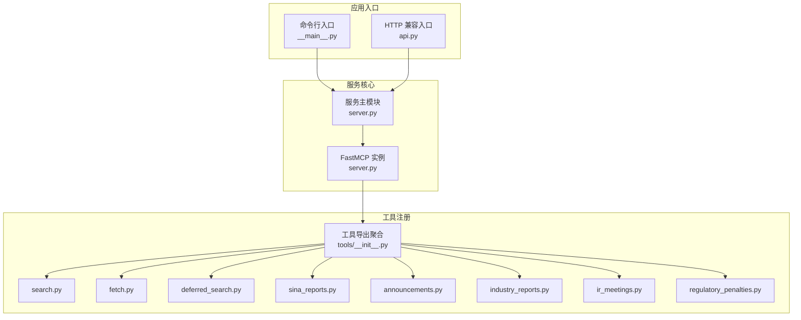
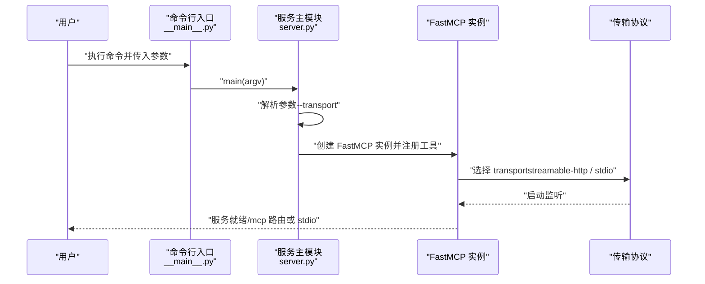
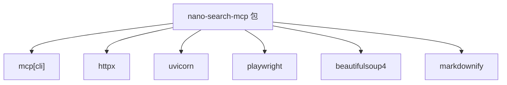

# MCP 协议实现

<cite>
**本文引用的文件**
- [nano_search_mcp/__main__.py](file://nano-search-mcp/src/nano_search_mcp/__main__.py)
- [nano_search_mcp/server.py](file://nano-search-mcp/src/nano_search_mcp/server.py)
- [nano_search_mcp/api.py](file://nano_search_mcp/src/nano_search_mcp/api.py)
- [nano_search_mcp/tools/__init__.py](file://nano-search-mcp/src/nano_search_mcp/tools/__init__.py)
- [nano_search_mcp/tools/search.py](file://nano_search_mcp/src/nano_search_mcp/tools/search.py)
- [nano_search_mcp/tools/fetch.py](file://nano_search_mcp/src/nano_search_mcp/tools/fetch.py)
- [nano_search_mcp/tools/deferred_search.py](file://nano_search_mcp/src/nano_search_mcp/tools/deferred_search.py)
- [nano_search_mcp/tools/sina_reports.py](file://nano_search_mcp/src/nano_search_mcp/tools/sina_reports.py)
- [nano_search_mcp/tools/announcements.py](file://nano_search_mcp/src/nano_search_mcp/tools/announcements.py)
- [nano_search_mcp/tools/industry_reports.py](file://nano_search_mcp/src/nano_search_mcp/tools/industry_reports.py)
- [nano_search_mcp/tools/ir_meetings.py](file://nano_search_mcp/src/nano_search_mcp/tools/ir_meetings.py)
- [nano_search_mcp/tools/regulatory_penalties.py](file://nano_search_mcp/src/nano_search_mcp/tools/regulatory_penalties.py)
- [tests/test_server.py](file://nano-search-mcp/tests/test_server.py)
- [pyproject.toml](file://nano-search-mcp/pyproject.toml)
- [README.md](file://nano-search-mcp/README.md)
</cite>

## 目录
1. [简介](#简介)
2. [项目结构](#项目结构)
3. [核心组件](#核心组件)
4. [架构总览](#架构总览)
5. [详细组件分析](#详细组件分析)
6. [依赖分析](#依赖分析)
7. [性能考虑](#性能考虑)
8. [故障排除指南](#故障排除指南)
9. [结论](#结论)
10. [附录](#附录)

## 简介
本项目实现了一个基于 MCP（Model Context Protocol）协议的服务端，名为 NanoSearchMCP，专注于为中国 A 股市场提供结构化文本检索与抓取能力。服务通过 FastMCP 实例对外暴露 12 个 MCP 工具，涵盖通用检索、定期报告、临时公告、行业研报、监管处罚、投资者关系（IR）活动与政策等能力域。项目既可作为命令行服务启动，也可作为 Python 包被其他模块导入复用。

## 项目结构
- 顶层入口与服务启动
  - 命令行入口：通过脚本入口调用服务主函数，转发参数。
  - 服务主模块：创建 FastMCP 实例，注册工具，解析命令行参数，选择传输协议并启动服务。
  - 兼容 HTTP 入口：复用标准 MCP streamable HTTP 应用，便于在现有网关或 ASGI 服务器中部署。
- 工具模块
  - 搜索与抓取：提供基于百炼 WebSearch 的搜索、基于 Playwright 的页面抓取、模板化检索等工具。
  - 数据源工具：针对新浪财经定期报告、临时公告、行业研报、IR 活动、监管处罚等数据源的专用抓取与解析工具。
- 测试与配置
  - 测试：覆盖服务启动、工具注册契约、抓取路径与 SSRF 防护等。
  - 配置：项目元信息、依赖、可选开发依赖、控制台脚本与构建配置。

图表来源
- [nano_search_mcp/__main__.py:1-15](file://nano-search-mcp/src/nano_search_mcp/__main__.py#L1-L15)
- [nano_search_mcp/api.py:1-12](file://nano_search_mcp/src/nano_search_mcp/api.py#L1-L12)
- [nano_search_mcp/server.py:1-91](file://nano-search-mcp/src/nano_search_mcp/server.py#L1-L91)
- [nano_search_mcp/tools/__init__.py:1-48](file://nano-search-mcp/src/nano_search_mcp/tools/__init__.py#L1-L48)

章节来源
- [nano_search_mcp/server.py:1-91](file://nano-search_mcp/src/nano_search_mcp/server.py#L1-L91)
- [nano_search_mcp/api.py:1-12](file://nano_search_mcp/src/nano_search_mcp/api.py#L1-L12)
- [nano_search_mcp/__main__.py:1-15](file://nano-search-mcp/src/nano_search_mcp/__main__.py#L1-L15)
- [nano_search_mcp/tools/__init__.py:1-48](file://nano-search_mcp/src/nano_search_mcp/tools/__init__.py#L1-L48)

## 核心组件
- FastMCP 服务实例
  - 名称与指令：服务实例命名为 NanoSearch，并设置服务说明与工具能力清单。
  - HTTP 路径：Streamable HTTP 路由前缀为 /mcp。
- 工具注册
  - 服务启动时依次注册 12 个工具模块，确保工具清单与说明一致。
- 命令行与传输协议
  - 默认通过 streamable HTTP 启动，监听本地地址；可通过参数切换为 stdio 传输，适配直接连接或支持 stdio 的 MCP 客户端。
- HTTP 兼容入口
  - 暴露 ASGI 应用，复用标准 MCP streamable HTTP 服务，便于在现有网关中部署。

章节来源
- [nano_search_mcp/server.py:18-58](file://nano-search_mcp/src/nano_search_mcp/server.py#L18-L58)
- [nano_search_mcp/server.py:60-70](file://nano-search_mcp/src/nano_search_mcp/server.py#L60-L70)
- [nano_search_mcp/server.py:72-87](file://nano-search_mcp/src/nano_search_mcp/server.py#L72-L87)
- [nano_search_mcp/api.py:1-12](file://nano_search_mcp/src/nano_search_mcp/api.py#L1-L12)

## 架构总览
服务启动流程分为两部分：命令行入口与服务主模块。命令行入口负责参数透传，服务主模块负责创建 FastMCP 实例、注册工具、解析传输协议并启动服务。工具模块按能力域划分，分别实现搜索、抓取与数据源解析逻辑。

图表来源
- [nano_search_mcp/__main__.py:9-14](file://nano-search-mcp/src/nano_search_mcp/__main__.py#L9-L14)
- [nano_search_mcp/server.py:72-87](file://nano-search_mcp/src/nano_search_mcp/server.py#L72-L87)

章节来源
- [nano_search_mcp/__main__.py:1-15](file://nano-search_mcp/src/nano_search_mcp/__main__.py#L1-L15)
- [nano_search_mcp/server.py:72-87](file://nano-search_mcp/src/nano_search_mcp/server.py#L72-L87)

## 详细组件分析

### FastMCP 服务实例与配置
- 实例创建
  - 通过 FastMCP 构造函数创建服务实例，设置服务名称与说明，定义工具能力清单。
  - 配置 Streamable HTTP 路由前缀为 /mcp。
- 工具注册
  - 服务启动时调用各工具模块的注册函数，将工具方法绑定到 FastMCP 实例。
- 传输协议选择
  - 命令行参数 --transport 支持 "streamable-http" 与 "stdio"，默认 streamable-http。
  - 通过 mcp.run(transport=...) 启动对应传输。

章节来源
- [nano_search_mcp/server.py:18-58](file://nano-search_mcp/src/nano_search_mcp/server.py#L18-L58)
- [nano_search_mcp/server.py:60-70](file://nano-search_mcp/src/nano_search_mcp/server.py#L60-L70)
- [nano_search_mcp/server.py:72-87](file://nano-search_mcp/src/nano_search_mcp/server.py#L72-L87)

### 命令行参数解析与启动流程
- 参数解析
  - 使用 argparse 定义 --transport 选项，支持 "streamable-http" 与 "stdio"。
- 启动流程
  - main(argv) 解析参数后调用 mcp.run(transport=...)。
  - 测试覆盖了默认传输与 stdio 传输的行为。

章节来源
- [nano_search_mcp/server.py:72-87](file://nano-search_mcp/src/nano_search_mcp/server.py#L72-L87)
- [tests/test_server.py:4-27](file://nano-search-mcp/tests/test_server.py#L4-L27)

### 工具注册机制与生命周期
- 注册机制
  - 服务启动时依次调用各工具模块的 register_*_tools(mcp) 函数，将工具方法注册到 FastMCP 实例。
  - 工具清单在服务说明与测试契约中保持一致。
- 生命周期
  - 工具方法在请求到达时执行，部分工具包含异步抓取与缓存逻辑，但未实现显式的优雅关闭钩子。
  - 测试契约确保所有承诺的工具均已注册。

章节来源
- [nano_search_mcp/server.py:60-70](file://nano-search_mcp/src/nano_search_mcp/server.py#L60-L70)
- [tests/test_server.py:49-84](file://nano-search-mcp/tests/test_server.py#L49-L84)

### 搜索工具（百炼 WebSearch）
- 功能概述
  - 提供网页搜索能力，返回标题、URL 与摘要列表。
  - 对查询进行轻量预处理，支持区域与时限过滤提示词。
- 错误处理
  - 调用上游失败时抛出运行时异常。
- 参数与返回
  - 支持查询词、最大结果数、区域与时间限制等参数。
  - 返回结构包含 title、url、snippet 字段。

章节来源
- [nano_search_mcp/tools/search.py:79-119](file://nano-search_mcp/src/nano_search_mcp/tools/search.py#L79-L119)

### 页面抓取工具（Playwright）
- 功能概述
  - 基于 Playwright 异步渲染页面并提取正文，输出 Markdown。
- SSRF 防护
  - 严格校验 URL 协议与目标主机，拒绝 loopback、私网、链路本地等地址。
- 性能与缓存
  - 惰性创建并复用浏览器实例，降低冷启动成本。
  - 截断过长内容，避免内存膨胀。
- 错误处理
  - 不抛异常，失败时返回包含错误信息的字典。

章节来源
- [nano_search_mcp/tools/fetch.py:24-74](file://nano-search_mcp/src/nano_search_mcp/tools/fetch.py#L24-L74)
- [nano_search_mcp/tools/fetch.py:133-161](file://nano-search_mcp/src/nano_search_mcp/tools/fetch.py#L133-L161)
- [nano_search_mcp/tools/fetch.py:186-245](file://nano-search_mcp/src/nano_search_mcp/tools/fetch.py#L186-L245)

### 模板化检索工具（deferred_search）
- 功能概述
  - 支持从任务模板文件加载查询模板，结合上下文变量生成最终查询词。
  - 提供自由查询模式，直接使用自定义查询词。
- 重试与退避
  - 失败时进行指数退避重试，最多三次。
- 错误处理
  - 不抛异常，失败时返回包含错误信息的字典。

章节来源
- [nano_search_mcp/tools/deferred_search.py:45-85](file://nano-search_mcp/src/nano_search_mcp/tools/deferred_search.py#L45-L85)
- [nano_search_mcp/tools/deferred_search.py:102-140](file://nano-search_mcp/src/nano_search_mcp/tools/deferred_search.py#L102-L140)
- [nano_search_mcp/tools/deferred_search.py:145-238](file://nano-search_mcp/src/nano_search_mcp/tools/deferred_search.py#L145-L238)

### 定期报告工具（新浪财经）
- 功能概述
  - 根据股票代码与报告类型拼接列表页 URL，解析报告条目并抓取详情页正文。
  - 支持年报、半年报、一季报、三季报等类型，以及中文别名。
- 校验与错误
  - 对股票代码、报告 ID、年份等进行严格校验，非法输入抛出异常。
  - 未找到目标报告时抛出异常。

章节来源
- [nano_search_mcp/tools/sina_reports.py:78-101](file://nano-search_mcp/src/nano_search_mcp/tools/sina_reports.py#L78-L101)
- [nano_search_mcp/tools/sina_reports.py:103-115](file://nano-search_mcp/src/nano_search_mcp/tools/sina_reports.py#L103-L115)
- [nano_search_mcp/tools/sina_reports.py:249-305](file://nano-search_mcp/src/nano_search_mcp/tools/sina_reports.py#L249-L305)
- [nano_search_mcp/tools/sina_reports.py:314-369](file://nano-search_mcp/src/nano_search_mcp/tools/sina_reports.py#L314-L369)

### 临时公告工具（新浪财经）
- 功能概述
  - 支持按日期区间过滤公告列表，自动翻页并缓存。
  - 提供公告正文提取与缓存。
- 类型分类
  - 基于标题关键词对公告类型进行分类，支持过滤。
- 错误处理
  - 不抛异常，失败时返回包含错误信息的字典。

章节来源
- [nano_search_mcp/tools/announcements.py:312-377](file://nano-search_mcp/src/nano_search_mcp/tools/announcements.py#L312-L377)
- [nano_search_mcp/tools/announcements.py:379-398](file://nano-search_mcp/src/nano_search_mcp/tools/announcements.py#L379-L398)
- [nano_search_mcp/tools/announcements.py:404-535](file://nano-search_mcp/src/nano_search_mcp/tools/announcements.py#L404-L535)

### 行业研报工具（新浪财经）
- 功能概述
  - 支持按申万二级行业或关键词过滤行业研报，自动路由到公司所属行业。
  - 提供研报正文提取与缓存。
- 查询策略
  - 支持 ts_code 自动解析行业代码，或直接指定行业与关键词。
- 错误处理
  - 不抛异常，失败时返回包含错误信息的字典。

章节来源
- [nano_search_mcp/tools/industry_reports.py:273-370](file://nano-search_mcp/src/nano_search_mcp/tools/industry_reports.py#L273-L370)
- [nano_search_mcp/tools/industry_reports.py:372-382](file://nano-search_mcp/src/nano_search_mcp/tools/industry_reports.py#L372-L382)
- [nano_search_mcp/tools/industry_reports.py:384-495](file://nano-search_mcp/src/nano_search_mcp/tools/industry_reports.py#L384-L495)

### 投资者关系（IR）活动工具
- 功能概述
  - 从临时公告中筛选 IR 活动记录，支持按会议类型分类。
  - 提取会议纪要正文并解析参会机构。
- 查询策略
  - 支持按日期区间过滤，自动翻页并缓存。
- 错误处理
  - 不抛异常，失败时返回包含错误信息的字典。

章节来源
- [nano_search_mcp/tools/ir_meetings.py:394-463](file://nano-search_mcp/src/nano_search_mcp/tools/ir_meetings.py#L394-L463)
- [nano_search_mcp/tools/ir_meetings.py:465-483](file://nano-search_mcp/src/nano_search_mcp/tools/ir_meetings.py#L465-L483)
- [nano_search_mcp/tools/ir_meetings.py:489-618](file://nano-search_mcp/src/nano_search_mcp/tools/ir_meetings.py#L489-L618)

### 监管处罚工具（新浪财经）
- 功能概述
  - 从违规处理页面抓取处罚记录，支持日期过滤。
  - 对处理机构与违规原因进行标准化提取。
- 错误处理
  - 不抛异常，失败时返回包含错误信息的字典。

章节来源
- [nano_search_mcp/tools/regulatory_penalties.py:295-367](file://nano-search_mcp/src/nano_search_mcp/tools/regulatory_penalties.py#L295-L367)
- [nano_search_mcp/tools/regulatory_penalties.py:393-447](file://nano-search_mcp/src/nano_search_mcp/tools/regulatory_penalties.py#L393-L447)

### 服务初始化、健康检查与优雅关闭
- 初始化
  - 服务实例创建、工具注册、参数解析与传输协议选择。
- 健康检查
  - 未实现专门的健康检查端点或心跳机制。
- 优雅关闭
  - 未实现显式的优雅关闭钩子；页面抓取工具提供浏览器资源关闭函数，供测试或外部调用时使用。

章节来源
- [nano_search_mcp/server.py:18-58](file://nano-search_mcp/src/nano_search_mcp/server.py#L18-L58)
- [nano_search_mcp/server.py:60-70](file://nano-search_mcp/src/nano_search_mcp/server.py#L60-L70)
- [nano_search_mcp/tools/fetch.py:145-161](file://nano-search_mcp/src/nano_search_mcp/tools/fetch.py#L145-L161)

### 与标准 MCP 协议的兼容性与扩展点
- 兼容性
  - 使用 FastMCP 提供的标准 MCP 接口，支持 streamable HTTP 与 stdio 两种传输。
  - 通过 HTTP 兼容入口暴露标准 MCP 路由 /mcp。
- 扩展点
  - 工具注册函数可扩展新的能力域与工具。
  - 传输协议可按需扩展，当前支持 streamable-http 与 stdio。

章节来源
- [nano_search_mcp/server.py:18-58](file://nano-search_mcp/src/nano_search_mcp/server.py#L18-L58)
- [nano_search_mcp/server.py:72-87](file://nano-search_mcp/src/nano_search_mcp/server.py#L72-L87)
- [nano_search_mcp/api.py:1-12](file://nano-search_mcp/src/nano_search_mcp/api.py#L1-L12)

## 依赖分析
- 项目依赖
  - mcp[cli]：提供 FastMCP 与 MCP 协议支持。
  - httpx、playwright、beautifulsoup4、markdownify：HTTP 客户端、浏览器自动化、HTML 解析与 Markdown 转换。
  - uvicorn：ASGI 服务器，用于 HTTP 传输。
- 可选依赖
  - pytest：开发测试框架。
- 控制台脚本
  - nano-search-mcp：命令行入口。

图表来源
- [pyproject.toml:6-14](file://nano-search-mcp/pyproject.toml#L6-L14)
- [pyproject.toml:16-19](file://nano-search-mcp/pyproject.toml#L16-L19)
- [pyproject.toml:21-22](file://nano-search-mcp/pyproject.toml#L21-L22)

章节来源
- [pyproject.toml:1-44](file://nano-search-mcp/pyproject.toml#L1-L44)

## 性能考虑
- 异步与并发
  - 页面抓取工具采用异步 Playwright，减少阻塞，提高吞吐。
- 资源复用
  - 惰性创建并复用浏览器实例，降低冷启动开销。
- 限流与退避
  - 各数据源工具普遍采用指数退避与请求间隔控制，缓解目标站点压力。
- 缓存策略
  - 列表页与详情页缓存分别设定 TTL，减少重复抓取。
- 内容截断
  - 对过长正文进行截断，避免内存与响应体积膨胀。

章节来源
- [nano_search_mcp/tools/fetch.py:133-161](file://nano-search-mcp/src/nano_search_mcp/tools/fetch.py#L133-L161)
- [nano_search_mcp/tools/announcements.py:146-179](file://nano-search_mcp/src/nano_search_mcp/tools/announcements.py#L146-L179)
- [nano_search_mcp/tools/industry_reports.py:129-159](file://nano-search_mcp/src/nano_search_mcp/tools/industry_reports.py#L129-L159)
- [nano_search_mcp/tools/ir_meetings.py:201-231](file://nano-search_mcp/src/nano_search_mcp/tools/ir_meetings.py#L201-L231)
- [nano_search_mcp/tools/regulatory_penalties.py:98-133](file://nano-search_mcp/src/nano_search_mcp/tools/regulatory_penalties.py#L98-L133)

## 故障排除指南
- 启动问题
  - 确认已安装可执行脚本并具备权限。
  - 检查是否正确激活 Python 环境与安装依赖。
- 传输协议问题
  - 若使用 stdio 传输，确保 MCP 客户端支持 stdio。
  - 若使用 HTTP 传输，确认端口未被占用，路由前缀为 /mcp。
- 工具调用失败
  - 搜索与定期报告工具在参数非法或网络失败时可能抛异常；其他工具返回包含错误信息的字典。
  - 检查网络连通性、目标站点结构变化与上游服务状态。
- SSRF 与安全
  - 页面抓取工具对 URL 进行严格校验，拒绝不安全协议与内网地址；如遇拒绝，检查输入 URL 是否符合要求。
- 缓存与性能
  - 若发现数据陈旧，可清理缓存目录或等待 TTL 过期。
  - 调整请求间隔与重试次数以平衡性能与稳定性。

章节来源
- [README.md:79-104](file://nano-search-mcp/README.md#L79-L104)
- [nano_search_mcp/tools/fetch.py:24-74](file://nano-search_mcp/src/nano_search_mcp/tools/fetch.py#L24-L74)
- [tests/test_server.py:4-27](file://nano-search-mcp/tests/test_server.py#L4-L27)

## 结论
本项目以 FastMCP 为基础，提供了面向 A 股市场的结构化检索与抓取能力，具备清晰的模块化设计与完善的工具注册机制。服务支持多种传输协议，易于在不同环境中部署与集成。通过异步抓取、资源复用、限流与缓存等手段，系统在性能与稳定性方面表现良好。未来可在健康检查、优雅关闭与扩展点方面进一步增强。

## 附录
- 安装与启动
  - 安装开发依赖与 Playwright 浏览器。
  - 通过命令行启动服务，默认 streamable HTTP；可切换为 stdio。
- 配置示例
  - 传输协议：--transport streamable-http 或 --transport stdio。
  - 路由前缀：/mcp。
- 工具清单
  - 通用检索：search、fetch_page、search_deferred_topic。
  - 定期报告：get_company_report。
  - 临时公告：list_announcements、get_announcement_text。
  - 行业研报：list_industry_reports、get_report_text。
  - 监管处罚：list_regulatory_penalties。
  - 投资者关系：list_ir_meetings、get_ir_meeting_text。
  - 行业政策：list_industry_policies。

章节来源
- [README.md:17-125](file://nano-search-mcp/README.md#L17-L125)
- [nano_search_mcp/server.py:18-58](file://nano-search_mcp/src/nano_search_mcp/server.py#L18-L58)
- [tests/test_server.py:49-84](file://nano-search-mcp/tests/test_server.py#L49-L84)