# NanoSearch MCP 搜索服务

<cite>
**本文档引用的文件**
- [README.md](file://nano-search-mcp/README.md)
- [pyproject.toml](file://nano-search-mcp/pyproject.toml)
- [__main__.py](file://nano-search-mcp/src/nano_search_mcp/__main__.py)
- [server.py](file://nano-search-mcp/src/nano_search_mcp/server.py)
- [__init__.py](file://nano-search-mcp/src/nano_search_mcp/__init__.py)
- [api.py](file://nano-search-mcp/src/nano_search_mcp/api.py)
- [tools/__init__.py](file://nano-search-mcp/src/nano_search_mcp/tools/__init__.py)
- [search.py](file://nano-search-mcp/src/nano_search_mcp/tools/search.py)
- [fetch.py](file://nano-search-mcp/src/nano_search_mcp/tools/fetch.py)
- [deferred_search.py](file://nano-search-mcp/src/nano_search_mcp/tools/deferred_search.py)
- [sina_reports.py](file://nano-search-mcp/src/nano_search_mcp/tools/sina_reports.py)
- [announcements.py](file://nano-search-mcp/src/nano_search_mcp/tools/announcements.py)
- [industry_reports.py](file://nano-search-mcp/src/nano_search_mcp/tools/industry_reports.py)
- [ir_meetings.py](file://nano-search-mcp/src/nano_search_mcp/tools/ir_meetings.py)
- [regulatory_penalties.py](file://nano-search-mcp/src/nano_search_mcp/tools/regulatory_penalties.py)
- [industry_policies.py](file://nano-search-mcp/src/nano_search_mcp/tools/industry_policies.py)
</cite>

## 目录
1. [简介](#简介)
2. [项目结构](#项目结构)
3. [核心组件](#核心组件)
4. [架构总览](#架构总览)
5. [详细组件分析](#详细组件分析)
6. [依赖关系分析](#依赖关系分析)
7. [性能考虑](#性能考虑)
8. [故障排查指南](#故障排查指南)
9. [结论](#结论)
10. [附录](#附录)

## 简介
NanoSearch MCP 搜索服务是一个基于 MCP（Model Context Protocol）协议的搜索与抓取服务，专注于为中国 A 股市场提供外部证据采集能力。服务通过 12 个 MCP 工具覆盖通用检索、定期报告、临时公告、行业研报、监管处罚、投资者关系活动以及行业政策等能力域，既可作为独立 MCP 服务运行，也可作为 Python 包被其他模块导入。

- 服务定位：为“七看八问”外部证据取证链路提供标准化搜索与抓取能力
- 交付形态：MCP 服务包，支持 streamable HTTP 与 stdio 传输
- 安全基线：严格的 URL 白名单与 SSRF 防护、指数退避重试、请求限频
- 错误契约：除部分工具在极端情况下抛异常外，其余工具失败时统一返回包含错误信息的字典

**章节来源**
- [README.md:1-198](file://nano-search-mcp/README.md#L1-L198)

## 项目结构
项目采用“包模块 + 工具模块”的组织方式，核心入口位于 server.py，工具注册集中在 tools 目录下的各个模块并通过 tools/__init__.py 汇总导出。

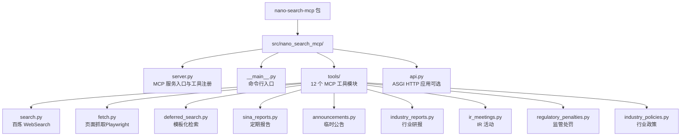

**图表来源**
- [server.py:1-91](file://nano-search-mcp/src/nano_search_mcp/server.py#L1-L91)
- [__main__.py:1-15](file://nano-search-mcp/src/nano_search_mcp/__main__.py#L1-L15)
- [tools/__init__.py:1-48](file://nano-search-mcp/src/nano_search_mcp/tools/__init__.py#L1-L48)

**章节来源**
- [README.md:178-198](file://nano-search-mcp/README.md#L178-L198)
- [pyproject.toml:1-44](file://nano-search-mcp/pyproject.toml#L1-L44)

## 核心组件
- MCP 服务实例：由 FastMCP 创建并配置指令与工具集合
- 工具注册：通过 register_*_tools 函数将各领域工具注册到 mcp 实例
- 命令行入口：支持 streamable HTTP 与 stdio 两种传输模式
- 工具模块：按能力域划分，提供稳定的接口与错误契约

**章节来源**
- [server.py:18-70](file://nano-search-mcp/src/nano_search_mcp/server.py#L18-L70)
- [__main__.py:9-15](file://nano-search-mcp/src/nano_search_mcp/__main__.py#L9-L15)

## 架构总览
NanoSearch MCP 服务采用“MCP 服务 + 工具模块”的分层架构。MCP 服务负责协议适配与工具注册，工具模块负责具体的数据抓取与解析。服务支持两种传输方式：streamable HTTP（默认）与 stdio，便于与不同类型的 MCP 客户端集成。

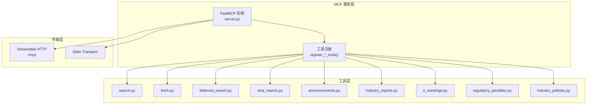

**图表来源**
- [server.py:18-70](file://nano-search-mcp/src/nano_search_mcp/server.py#L18-L70)
- [__main__.py:72-86](file://nano-search-mcp/src/nano_search_mcp/__main__.py#L72-L86)

## 详细组件分析

### 搜索工具（search）
- 功能：基于百炼 WebSearch 的网页搜索，返回标题、URL、摘要
- 参数：query、max_results、region、timelimit
- 返回：SearchItem 列表
- 错误：调用失败时抛出异常
- 安全：查询词进行预处理，增强可控性

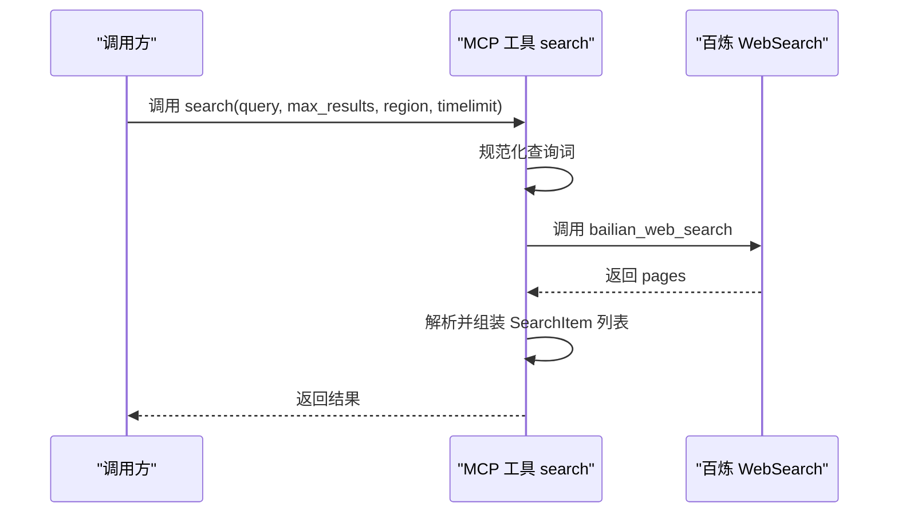

**图表来源**
- [search.py:17-70](file://nano-search-mcp/src/nano_search_mcp/tools/search.py#L17-L70)

**章节来源**
- [search.py:79-119](file://nano-search-mcp/src/nano_search_mcp/tools/search.py#L79-L119)

### 页面抓取工具（fetch_page）
- 功能：使用 Playwright 抓取任意 URL 正文，自动清理导航/页脚/广告等噪声
- 安全：严格的 URL 白名单与 SSRF 防护，拒绝 file://、loopback、RFC1918、云元数据等
- 性能：浏览器实例惰性创建与复用，降低冷启动开销
- 返回：PageResult（包含 url、content、method、truncated、error）

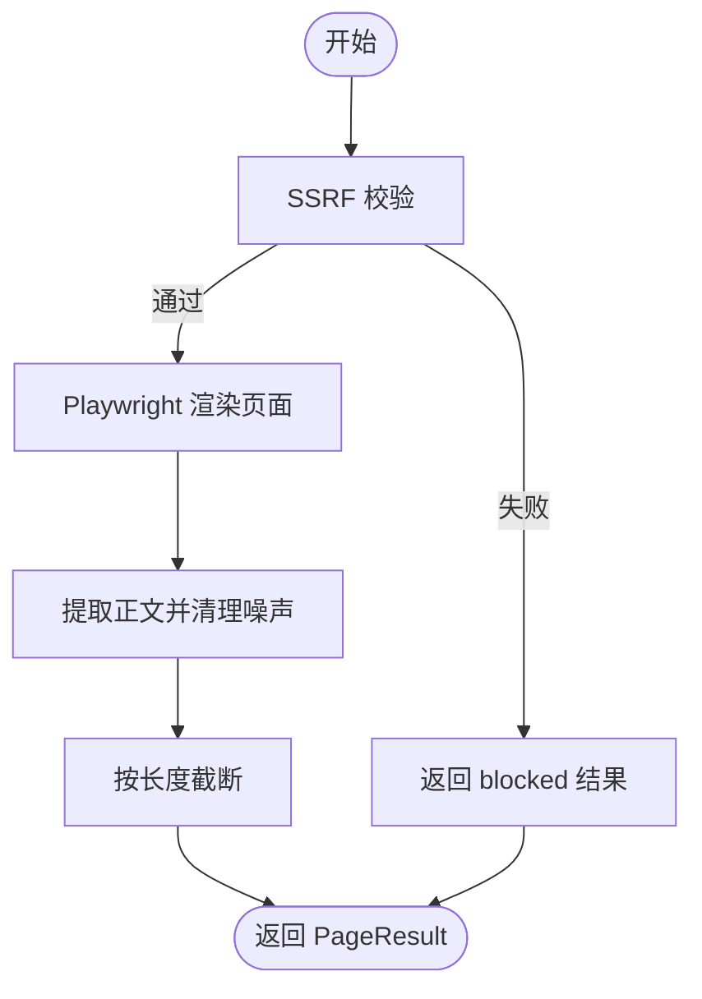

**图表来源**
- [fetch.py:24-74](file://nano-search-mcp/src/nano_search_mcp/tools/fetch.py#L24-L74)
- [fetch.py:163-175](file://nano-search-mcp/src/nano_search_mcp/tools/fetch.py#L163-L175)

**章节来源**
- [fetch.py:220-245](file://nano-search-mcp/src/nano_search_mcp/tools/fetch.py#L220-L245)

### 模板化检索工具（search_deferred_topic）
- 功能：支持从 deferred-tasks.md 加载查询模板，结合上下文变量渲染后执行搜索
- 特性：3 次指数退避重试；max_results 裁剪到 [1,30]；失败返回 source: "unavailable"
- 接口：topic_id、query_override、max_results、region、context

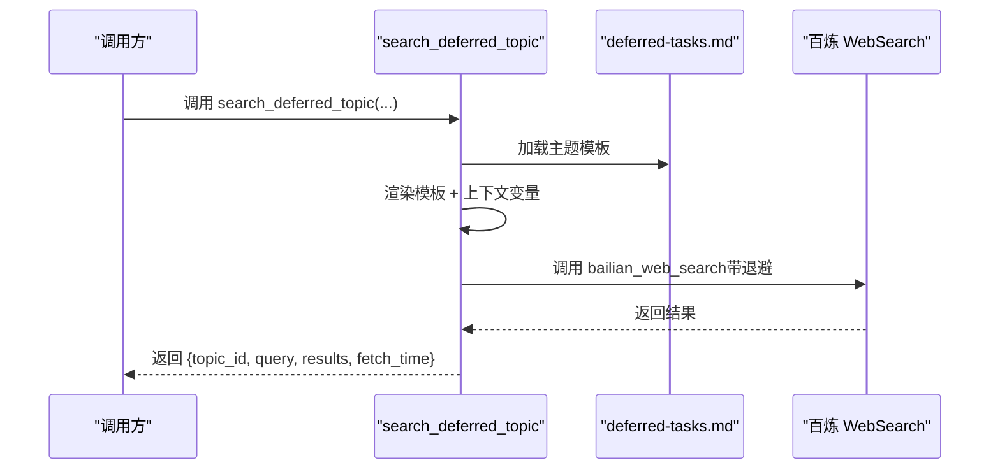

**图表来源**
- [deferred_search.py:45-85](file://nano-search-mcp/src/nano_search_mcp/tools/deferred_search.py#L45-L85)
- [deferred_search.py:148-237](file://nano-search-mcp/src/nano_search_mcp/tools/deferred_search.py#L148-L237)

**章节来源**
- [deferred_search.py:145-238](file://nano-search-mcp/src/nano_search_mcp/tools/deferred_search.py#L145-L238)

### 定期报告工具（get_company_report）
- 功能：获取指定年份的年报/半年报/一季报/三季报全文正文
- 输入：stockid（6 位数字）、year（四位年份）、report_type（annual/semi/q1/q3 或中文别名）
- 输出：包含标题、发布日期与来源链接的正文文本
- 错误：找不到目标报告或正文抓取失败时抛出异常

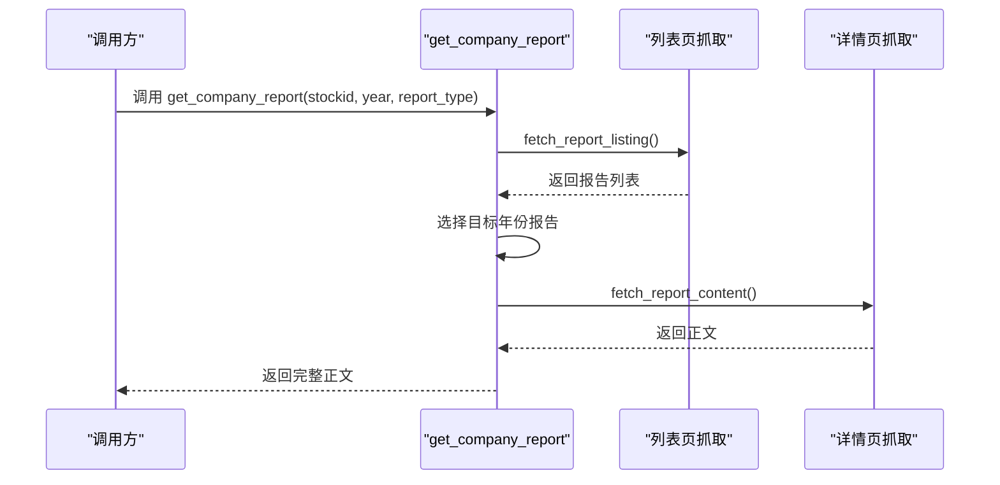

**图表来源**
- [sina_reports.py:317-368](file://nano-search-mcp/src/nano_search_mcp/tools/sina_reports.py#L317-L368)
- [sina_reports.py:249-304](file://nano-search-mcp/src/nano_search_mcp/tools/sina_reports.py#L249-L304)

**章节来源**
- [sina_reports.py:314-369](file://nano-search-mcp/src/nano_search_mcp/tools/sina_reports.py#L314-L369)

### 临时公告工具（list_announcements、get_announcement_text）
- list_announcements：按 ts_code 与日期区间过滤，支持 ann_types 分类过滤
- get_announcement_text：抓取单条公告正文，带缓存与错误处理
- 安全：严格的域名白名单与参数校验，防止 SSRF

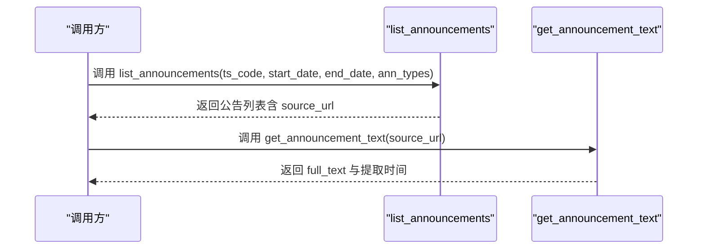

**图表来源**
- [announcements.py:404-490](file://nano-search-mcp/src/nano_search_mcp/tools/announcements.py#L404-L490)
- [announcements.py:491-535](file://nano-search-mcp/src/nano_search_mcp/tools/announcements.py#L491-L535)

**章节来源**
- [announcements.py:404-535](file://nano-search-mcp/src/nano_search_mcp/tools/announcements.py#L404-L535)

### 行业研报工具（list_industry_reports、get_report_text）
- list_industry_reports：支持 ts_code 自动路由至申万二级行业，或直接指定行业名与关键词
- get_report_text：抓取单条研报正文，带缓存
- 默认返回近一年内的研报，可按日期区间过滤

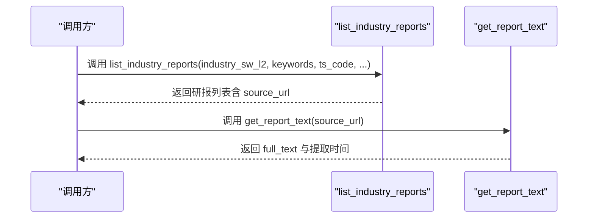

**图表来源**
- [industry_reports.py:384-457](file://nano-search-mcp/src/nano_search_mcp/tools/industry_reports.py#L384-L457)
- [industry_reports.py:459-495](file://nano-search-mcp/src/nano_search_mcp/tools/industry_reports.py#L459-L495)

**章节来源**
- [industry_reports.py:384-495](file://nano-search-mcp/src/nano_search_mcp/tools/industry_reports.py#L384-L495)

### 投资者关系工具（list_ir_meetings、get_ir_meeting_text）
- list_ir_meetings：按 ts_code 与日期区间过滤，支持 meeting_types 分类过滤
- get_ir_meeting_text：抓取单条 IR 纪要正文并抽取参会机构
- 安全：严格的域名白名单与参数校验

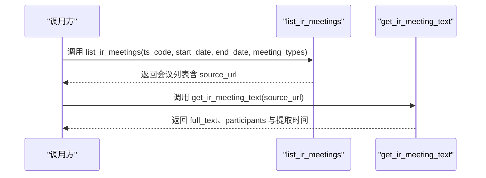

**图表来源**
- [ir_meetings.py:489-568](file://nano-search-mcp/src/nano_search_mcp/tools/ir_meetings.py#L489-L568)
- [ir_meetings.py:570-618](file://nano-search-mcp/src/nano_search_mcp/tools/ir_meetings.py#L570-L618)

**章节来源**
- [ir_meetings.py:489-618](file://nano-search-mcp/src/nano_search_mcp/tools/ir_meetings.py#L489-L618)

### 监管处罚工具（list_regulatory_penalties）
- 功能：从新浪财经违规处理页面抓取监管处罚记录
- 输入：ts_code、start_date、end_date
- 输出：包含处罚日期、事件类型、标题、原因、内容、处理机构等字段

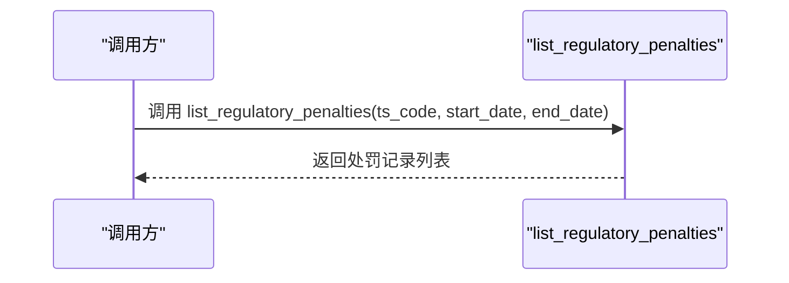

**图表来源**
- [regulatory_penalties.py:393-447](file://nano-search-mcp/src/nano_search_mcp/tools/regulatory_penalties.py#L393-L447)

**章节来源**
- [regulatory_penalties.py:393-447](file://nano-search-mcp/src/nano_search_mcp/tools/regulatory_penalties.py#L393-L447)

### 行业政策工具（list_industry_policies）
- 功能：基于百炼 WebSearch 检索 *.gov.cn 近一年内的行业政策文件
- 输入：industry_sw_l2、keywords
- 输出：最多 5 条去重后的政策结果，包含发布机构层级、标题、摘要与来源链接

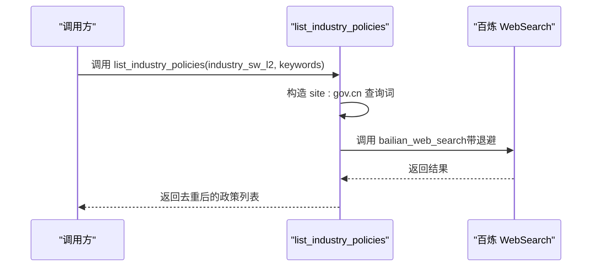

**图表来源**
- [industry_policies.py:72-91](file://nano-search-mcp/src/nano_search_mcp/tools/industry_policies.py#L72-L91)
- [industry_policies.py:94-167](file://nano-search-mcp/src/nano_search_mcp/tools/industry_policies.py#L94-L167)

**章节来源**
- [industry_policies.py:185-246](file://nano-search-mcp/src/nano_search_mcp/tools/industry_policies.py#L185-L246)

## 依赖关系分析
- 服务依赖：mcp[cli]、httpx、pyyaml、uvicorn、playwright、beautifulsoup4、markdownify
- 工具模块依赖：FastMCP（MCP 协议）、百炼工具调用接口、BeautifulSoup、markdownify、Playwright
- 传输依赖：uvicorn（HTTP）、mcp CLI（stdio）

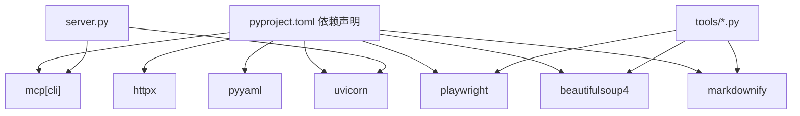

**图表来源**
- [pyproject.toml:6-14](file://nano-search-mcp/pyproject.toml#L6-L14)
- [server.py:6-16](file://nano-search-mcp/src/nano_search_mcp/server.py#L6-L16)

**章节来源**
- [pyproject.toml:1-44](file://nano-search-mcp/pyproject.toml#L1-L44)

## 性能考虑
- 浏览器实例复用：Playwright 实例惰性创建并复用，降低冷启动开销
- 请求限频与退避：各抓取工具内置指数退避与最小请求间隔，缓解目标站点压力
- 缓存策略：公告、研报、IR、处罚等模块均提供本地缓存，减少重复抓取
- 内容截断：抓取正文设置最大长度，避免超长文本影响性能
- 传输超时：建议将 MCP 客户端/网关/反代的请求超时设置为足以覆盖最慢抓取操作

**章节来源**
- [fetch.py:120-161](file://nano-search-mcp/src/nano_search_mcp/tools/fetch.py#L120-L161)
- [announcements.py:74-76](file://nano-search-mcp/src/nano_search_mcp/tools/announcements.py#L74-L76)
- [industry_reports.py:43-45](file://nano-search-mcp/src/nano_search_mcp/tools/industry_reports.py#L43-L45)
- [ir_meetings.py:126-128](file://nano-search-mcp/src/nano_search_mcp/tools/ir_meetings.py#L126-L128)
- [regulatory_penalties.py:56](file://nano-search-mcp/src/nano_search_mcp/tools/regulatory_penalties.py#L56)
- [README.md:104](file://nano-search-mcp/README.md#L104)

## 故障排查指南
- SSRF 防护失败：检查 URL 协议与主机是否在允许范围内，确认未使用 file://、loopback、RFC1918、云元数据等
- 百炼 WebSearch 失败：查看重试日志，确认网络连通性与凭据；必要时放宽查询条件或增加重试次数
- 抓取超时：适当提高 MCP 客户端/网关/反代的请求超时时间；检查 Playwright 浏览器状态
- 缓存问题：清理 ~/.cache/nano_search_mcp 下对应目录，重新抓取验证
- 参数校验错误：核对 stockid、report_type、日期格式等输入参数

**章节来源**
- [fetch.py:24-74](file://nano-search-mcp/src/nano_search_mcp/tools/fetch.py#L24-L74)
- [deferred_search.py:102-139](file://nano-search-mcp/src/nano_search_mcp/tools/deferred_search.py#L102-L139)
- [README.md:160-177](file://nano-search-mcp/README.md#L160-L177)

## 结论
NanoSearch MCP 搜索服务通过标准化的 MCP 工具集，为 A 股外部证据采集提供了可靠、安全与高性能的基础设施。服务在安全、稳定性与易用性方面做了充分设计，适合在自动化 Agent 与数据流水线中作为稳定的数据源。

## 附录

### 启动与配置
- 安装与环境准备：参见 README 的安装与环境要求
- 启动 MCP 服务：支持 streamable HTTP（默认）与 stdio 两种传输
- 作为 Python 包导入：可直接导入 server.mcp 或 api.app

**章节来源**
- [README.md:55-125](file://nano-search-mcp/README.md#L55-L125)
- [__main__.py:72-102](file://nano-search-mcp/src/nano_search_mcp/__main__.py#L72-L102)

### 工具注册机制
- server.py 中集中注册 12 个工具模块
- 各工具模块通过 register_*_tools 函数暴露工具接口

**章节来源**
- [server.py:60-69](file://nano-search-mcp/src/nano_search_mcp/server.py#L60-L69)

### 安全防护措施
- URL 白名单与 SSRF 防护：严格限制协议与主机范围
- 指数退避与请求限频：降低对目标站点的压力
- 缓存与内容截断：减少资源消耗与风险暴露

**章节来源**
- [fetch.py:16-74](file://nano-search-mcp/src/nano_search_mcp/tools/fetch.py#L16-L74)
- [announcements.py:137-179](file://nano-search-mcp/src/nano_search_mcp/tools/announcements.py#L137-L179)
- [industry_reports.py:121-158](file://nano-search-mcp/src/nano_search_mcp/tools/industry_reports.py#L121-L158)
- [ir_meetings.py:193-231](file://nano-search-mcp/src/nano_search_mcp/tools/ir_meetings.py#L193-L231)
- [regulatory_penalties.py:89-133](file://nano-search-mcp/src/nano_search_mcp/tools/regulatory_penalties.py#L89-L133)

### API 参考（概要）
- 搜索工具：search(query, max_results, region, timelimit) → List[SearchItem]
- 页面抓取：fetch_page(url) → PageResult
- 模板化检索：search_deferred_topic(topic_id, query_override, max_results, region, context)
- 定期报告：get_company_report(stockid, year, report_type) → str
- 临时公告：list_announcements(ts_code, start_date, end_date, ann_types) → dict；get_announcement_text(source_url) → dict
- 行业研报：list_industry_reports(...) → dict；get_report_text(source_url) → dict
- 投资者关系：list_ir_meetings(...) → dict；get_ir_meeting_text(source_url) → dict
- 监管处罚：list_regulatory_penalties(ts_code, start_date, end_date) → dict
- 行业政策：list_industry_policies(industry_sw_l2, keywords) → dict

**章节来源**
- [search.py:79-119](file://nano-search-mcp/src/nano_search_mcp/tools/search.py#L79-L119)
- [fetch.py:220-245](file://nano-search-mcp/src/nano_search_mcp/tools/fetch.py#L220-L245)
- [deferred_search.py:145-238](file://nano-search-mcp/src/nano_search_mcp/tools/deferred_search.py#L145-L238)
- [sina_reports.py:314-369](file://nano-search-mcp/src/nano_search_mcp/tools/sina_reports.py#L314-L369)
- [announcements.py:404-535](file://nano-search-mcp/src/nano_search_mcp/tools/announcements.py#L404-L535)
- [industry_reports.py:384-495](file://nano-search-mcp/src/nano_search_mcp/tools/industry_reports.py#L384-L495)
- [ir_meetings.py:489-618](file://nano-search-mcp/src/nano_search_mcp/tools/ir_meetings.py#L489-L618)
- [regulatory_penalties.py:393-447](file://nano-search-mcp/src/nano_search_mcp/tools/regulatory_penalties.py#L393-L447)
- [industry_policies.py:185-246](file://nano-search-mcp/src/nano_search_mcp/tools/industry_policies.py#L185-L246)

### 使用示例与最佳实践
- 典型流程：先用 search 搜索，再用 fetch_page 抓取详情页，最后解析正文
- 参数约束：定期报告调用必须显式提供 year 与 report_type
- 错误处理：多数工具失败时返回包含 error 字段的字典，避免异常传播

**章节来源**
- [README.md:126-159](file://nano-search-mcp/README.md#L126-L159)