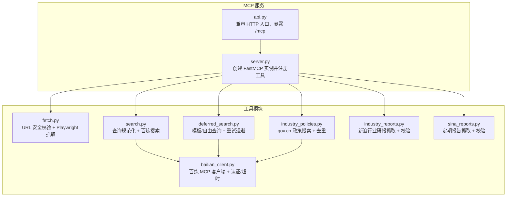
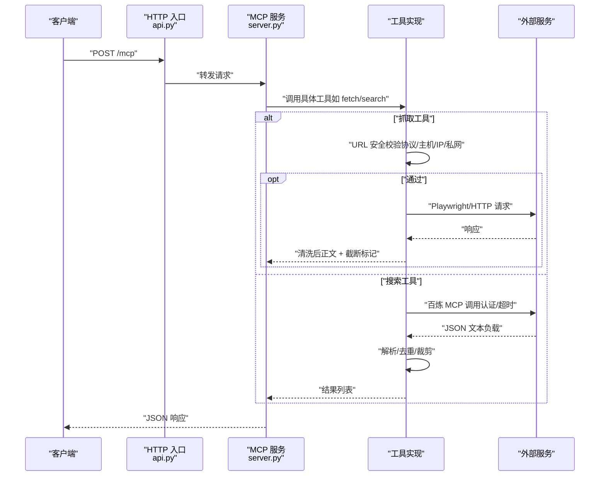
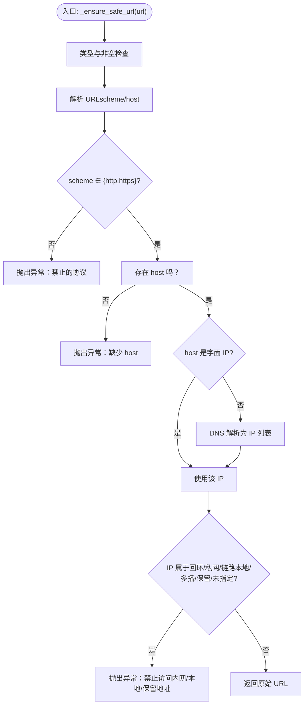
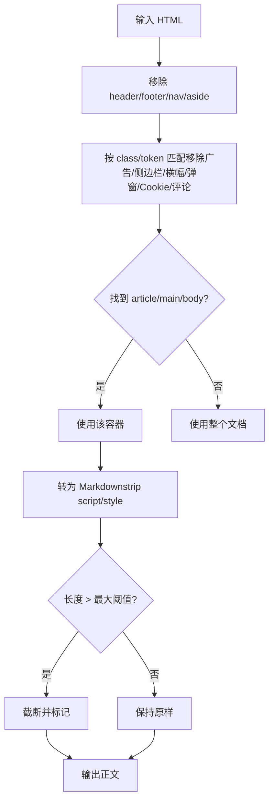
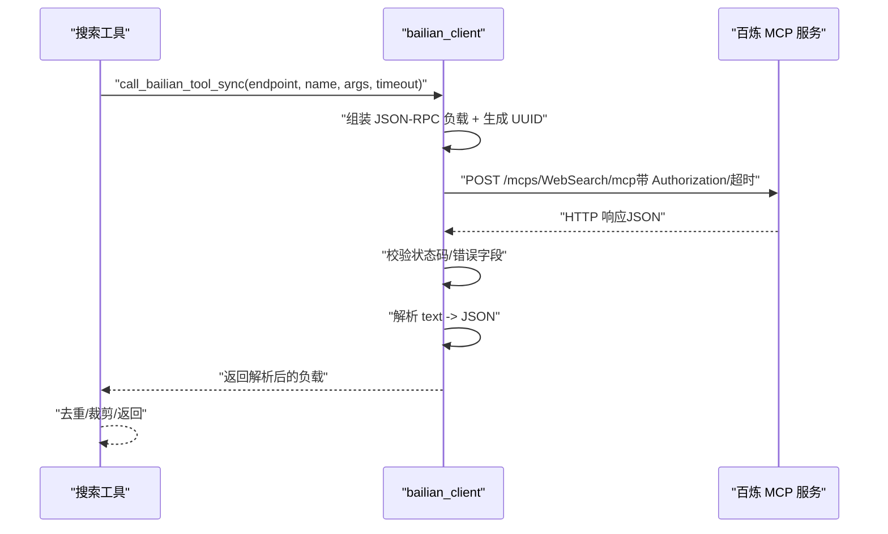
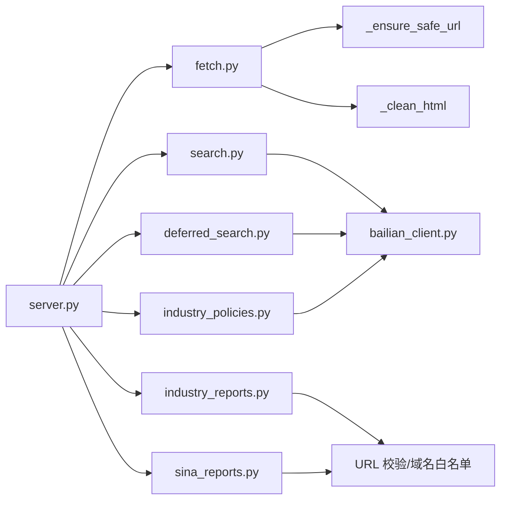

# 安全防护机制

<cite>
**本文引用的文件**
- [fetch.py](file://nano-search-mcp/src/nano_search_mcp/tools/fetch.py)
- [search.py](file://nano-search-mcp/src/nano_search_mcp/tools/search.py)
- [bailian_client.py](file://nano-search-mcp/src/nano_search_mcp/tools/bailian_client.py)
- [deferred_search.py](file://nano-search-mcp/src/nano_search_mcp/tools/deferred_search.py)
- [industry_policies.py](file://nano-search-mcp/src/nano_search_mcp/tools/industry_policies.py)
- [industry_reports.py](file://nano-search-mcp/src/nano_search_mcp/tools/industry_reports.py)
- [sina_reports.py](file://nano-search-mcp/src/nano_search_mcp/tools/sina_reports.py)
- [server.py](file://nano-search-mcp/src/nano_search_mcp/server.py)
- [api.py](file://nano-search-mcp/src/nano_search_mcp/api.py)
- [test_fetch.py](file://nano-search-mcp/tests/test_fetch.py)
- [test_server.py](file://nano-search-mcp/tests/test_server.py)
- [pyproject.toml](file://nano-search-mcp/pyproject.toml)
</cite>

## 目录
1. [简介](#简介)
2. [项目结构](#项目结构)
3. [核心组件](#核心组件)
4. [架构总览](#架构总览)
5. [详细组件分析](#详细组件分析)
6. [依赖分析](#依赖分析)
7. [性能考虑](#性能考虑)
8. [故障排查指南](#故障排查指南)
9. [结论](#结论)
10. [附录](#附录)

## 简介
本文件系统化梳理并文档化本仓库中的安全防护机制，重点覆盖以下方面：
- URL 安全验证与 SSRF 防护：统一的 URL 白名单与私网地址过滤，阻断内网/保留地址访问。
- 内容解析安全：HTML/正文提取的白名单与黑名单策略，限制噪声与潜在注入影响面。
- 外部服务交互安全：认证头管理、超时控制、错误解析与重试退避策略。
- 安全配置与自定义规则：环境变量、超时、最大结果数、重试次数等可调参数。
- 安全审计与日志记录：统一的日志级别与关键事件记录，便于审计与排障。

## 项目结构
本项目围绕 MCP 服务框架构建，核心安全逻辑集中在抓取与搜索工具模块中，配合统一的服务器入口与 HTTP 兼容入口。

**图表来源**
- [server.py:19-69](file://nano-search-mcp/src/nano_search_mcp/server.py#L19-L69)
- [api.py:6-11](file://nano-search-mcp/src/nano_search_mcp/api.py#L6-L11)
- [fetch.py:24-74](file://nano-search-mcp/src/nano_search_mcp/tools/fetch.py#L24-L74)
- [search.py:17-38](file://nano-search-mcp/src/nano_search_mcp/tools/search.py#L17-L38)
- [deferred_search.py:102-139](file://nano-search-mcp/src/nano_search_mcp/tools/deferred_search.py#L102-L139)
- [industry_policies.py:94-167](file://nano-search-mcp/src/nano_search_mcp/tools/industry_policies.py#L94-L167)
- [industry_reports.py:129-158](file://nano-search-mcp/src/nano_search_mcp/tools/industry_reports.py#L129-L158)
- [sina_reports.py:117-153](file://nano-search-mcp/src/nano_search_mcp/tools/sina_reports.py#L117-L153)
- [bailian_client.py:63-92](file://nano-search-mcp/src/nano_search_mcp/tools/bailian_client.py#L63-L92)

**章节来源**
- [server.py:19-69](file://nano-search-mcp/src/nano_search_mcp/server.py#L19-L69)
- [api.py:6-11](file://nano-search-mcp/src/nano_search_mcp/api.py#L6-L11)

## 核心组件
- URL 安全校验与 SSRF 防护：在抓取入口对 URL 进行协议白名单、主机解析、IP 类型判定与私网/保留地址拦截。
- 内容解析安全：基于 BeautifulSoup 的标签/属性选择器进行噪声清理，限制广告、侧边栏、页头页脚等干扰元素。
- 外部服务安全交互：百炼 MCP 客户端统一处理认证头、超时、错误解析与重试退避。
- 工具注册与契约一致性：服务启动时集中注册工具，测试保障工具清单与契约一致。

**章节来源**
- [fetch.py:24-74](file://nano-search-mcp/src/nano_search_mcp/tools/fetch.py#L24-L74)
- [fetch.py:100-117](file://nano-search-mcp/src/nano_search_mcp/tools/fetch.py#L100-L117)
- [bailian_client.py:28-92](file://nano-search-mcp/src/nano_search_mcp/tools/bailian_client.py#L28-L92)
- [server.py:60-69](file://nano-search-mcp/src/nano_search_mcp/server.py#L60-L69)
- [test_server.py:49-83](file://nano-search-mcp/tests/test_server.py#L49-L83)

## 架构总览
下图展示 MCP 服务如何通过统一入口暴露工具，并在抓取与搜索路径中实施安全控制。

**图表来源**
- [api.py:6-11](file://nano-search-mcp/src/nano_search_mcp/api.py#L6-L11)
- [server.py:19-69](file://nano-search-mcp/src/nano_search_mcp/server.py#L19-L69)
- [fetch.py:186-217](file://nano-search-mcp/src/nano_search_mcp/tools/fetch.py#L186-L217)
- [search.py:41-70](file://nano-search-mcp/src/nano_search_mcp/tools/search.py#L41-L70)
- [bailian_client.py:63-92](file://nano-search-mcp/src/nano_search_mcp/tools/bailian_client.py#L63-L92)

## 详细组件分析

### URL 安全验证与 SSRF 防护
- 协议白名单：仅允许 http/https，拒绝 file、ftp、gopher 等高风险方案。
- 主机解析与 IP 校验：对字面 IP 或 DNS 解析结果逐一检查，拒绝回环、私网、链路本地、多播、保留与未指定地址。
- 失败处理：抛出自定义异常并记录警告/错误日志，抓取入口返回 blocked 方法与错误信息。

**图表来源**
- [fetch.py:24-74](file://nano-search-mcp/src/nano_search_mcp/tools/fetch.py#L24-L74)

**章节来源**
- [fetch.py:24-74](file://nano-search-mcp/src/nano_search_mcp/tools/fetch.py#L24-L74)
- [fetch.py:186-217](file://nano-search-mcp/src/nano_search_mcp/tools/fetch.py#L186-L217)
- [test_fetch.py:19-80](file://nano-search-mcp/tests/test_fetch.py#L19-L80)

### 内容解析安全
- 标签级噪声清理：移除 header、footer、nav、aside 等结构性噪声。
- 属性级精确匹配：使用 class/id 的 token 精确匹配，避免通配导致的误伤。
- 正文提取：优先 article/main/body，最终回退到 body，转换为 Markdown 并按长度截断。

**图表来源**
- [fetch.py:100-117](file://nano-search-mcp/src/nano_search_mcp/tools/fetch.py#L100-L117)

**章节来源**
- [fetch.py:100-117](file://nano-search-mcp/src/nano_search_mcp/tools/fetch.py#L100-L117)

### 外部服务安全交互与错误处理
- 百炼 MCP 客户端
  - 环境变量驱动：通过 DASHSCOPE_API_KEY 设置 Authorization 头。
  - 超时控制：支持环境变量 BAILIAN_MCP_TIMEOUT 覆盖默认超时。
  - 错误解析：统一解析 text 字段为 JSON，处理 HTTP 错误与 JSON 非法情况。
  - 重试退避：搜索工具普遍采用指数退避与随机抖动，降低瞬时拥塞影响。
- 定向抓取工具的安全约束
  - 新浪行业研报：仅允许新浪域名，防止 SSRF；对 stockid/report_id 进行正则校验。
  - 新浪定期报告：仅允许目标 HTTPS/HTTP 基础地址，回退策略与指数退避。
  - 政策搜索：仅 gov.cn 相关站点查询，去重与时间窗口控制。

**图表来源**
- [bailian_client.py:63-92](file://nano-search-mcp/src/nano_search_mcp/tools/bailian_client.py#L63-L92)
- [search.py:41-70](file://nano-search-mcp/src/nano_search_mcp/tools/search.py#L41-L70)
- [deferred_search.py:102-139](file://nano-search-mcp/src/nano_search_mcp/tools/deferred_search.py#L102-L139)
- [industry_policies.py:94-167](file://nano-search-mcp/src/nano_search_mcp/tools/industry_policies.py#L94-L167)

**章节来源**
- [bailian_client.py:12-21](file://nano-search-mcp/src/nano_search_mcp/tools/bailian_client.py#L12-L21)
- [bailian_client.py:28-92](file://nano-search-mcp/src/nano_search_mcp/tools/bailian_client.py#L28-L92)
- [industry_reports.py:129-158](file://nano-search-mcp/src/nano_search_mcp/tools/industry_reports.py#L129-L158)
- [sina_reports.py:117-153](file://nano-search-mcp/src/nano_search_mcp/tools/sina_reports.py#L117-L153)

### 安全配置与自定义规则
- 环境变量
  - DASHSCOPE_API_KEY：百炼 MCP 认证密钥（必需）。
  - BAILIAN_MCP_TIMEOUT：百炼 MCP 调用超时（秒），默认 30。
  - BAILIAN_WEBSEARCH_ENDPOINT：百炼 MCP 端点，默认 dashscope.aliyuncs.com。
- 工具级参数
  - 搜索工具：max_results 裁剪到 [1, 30]；region/timelimit 作为查询提示词附加。
  - 抓取工具：返回正文最大字符数阈值、Playwright 渲染后等待时间。
  - 重试与退避：搜索工具普遍使用指数退避与随机抖动，最大重试次数可配置。

**章节来源**
- [bailian_client.py:12-21](file://nano-search-mcp/src/nano_search_mcp/tools/bailian_client.py#L12-L21)
- [search.py:112-118](file://nano-search-mcp/src/nano_search_mcp/tools/search.py#L112-L118)
- [deferred_search.py:36-40](file://nano-search-mcp/src/nano_search_mcp/tools/deferred_search.py#L36-L40)
- [fetch.py:77-78](file://nano-search-mcp/src/nano_search_mcp/tools/fetch.py#L77-L78)

### 安全审计与日志记录最佳实践
- 日志级别建议
  - 信息级：成功抓取/搜索、模板渲染、缓存命中。
  - 警告级：SSRF 拦截、DNS 解析失败、重试退避、非关键错误。
  - 错误级：外部服务不可用、解析失败、工具异常。
- 关键审计点
  - 拦截的 URL（协议/主机/IP/私网）与原因。
  - 外部服务调用状态码、错误片段截断与超时。
  - 搜索/抓取失败的重试次数与最终结果。
- 日志字段建议
  - 时间戳、工具名、输入参数摘要、响应状态、错误码/消息、耗时。

**章节来源**
- [fetch.py:186-217](file://nano-search-mcp/src/nano_search_mcp/tools/fetch.py#L186-L217)
- [deferred_search.py:102-139](file://nano-search-mcp/src/nano_search_mcp/tools/deferred_search.py#L102-L139)
- [industry_policies.py:113-167](file://nano-search-mcp/src/nano_search_mcp/tools/industry_policies.py#L113-L167)

## 依赖分析
- 组件耦合
  - 抓取工具依赖统一的 URL 安全校验与内容清洗流程。
  - 搜索工具共享百炼 MCP 客户端，具备一致的认证、超时与错误处理。
  - 服务入口集中注册工具，测试保障契约一致性。
- 外部依赖
  - httpx、playwright、beautifulsoup4、markdownify 等第三方库承担网络与解析职责。

**图表来源**
- [fetch.py:24-74](file://nano-search-mcp/src/nano_search_mcp/tools/fetch.py#L24-L74)
- [fetch.py:100-117](file://nano-search-mcp/src/nano_search_mcp/tools/fetch.py#L100-L117)
- [search.py:8-13](file://nano-search-mcp/src/nano_search_mcp/tools/search.py#L8-L13)
- [bailian_client.py:63-92](file://nano-search-mcp/src/nano_search_mcp/tools/bailian_client.py#L63-L92)
- [deferred_search.py:23-27](file://nano-search-mcp/src/nano_search_mcp/tools/deferred_search.py#L23-L27)
- [industry_policies.py:20-24](file://nano-search-mcp/src/nano_search_mcp/tools/industry_policies.py#L20-L24)
- [industry_reports.py:129-158](file://nano-search-mcp/src/nano_search_mcp/tools/industry_reports.py#L129-L158)
- [sina_reports.py:117-153](file://nano-search-mcp/src/nano_search_mcp/tools/sina_reports.py#L117-L153)
- [server.py:60-69](file://nano-search-mcp/src/nano_search_mcp/server.py#L60-L69)

**章节来源**
- [pyproject.toml:6-14](file://nano-search-mcp/pyproject.toml#L6-L14)
- [server.py:60-69](file://nano-search-mcp/src/nano_search_mcp/server.py#L60-L69)
- [test_server.py:49-83](file://nano-search-mcp/tests/test_server.py#L49-L83)

## 性能考虑
- 抓取性能
  - Playwright 浏览器复用：全局锁与惰性初始化降低冷启动成本。
  - 渲染后等待时间与正文截断：平衡准确性与体积。
- 搜索性能
  - 指数退避与随机抖动：缓解上游限流与瞬时拥塞。
  - 结果去重与时间窗口：减少重复与无效数据传输。
- 网络与解析
  - 统一超时与错误处理：避免长时间阻塞与资源泄漏。
  - HTML 解析与 Markdown 转换：在噪声清理后进行，减少无效工作量。

**章节来源**
- [fetch.py:126-161](file://nano-search-mcp/src/nano_search_mcp/tools/fetch.py#L126-L161)
- [deferred_search.py:102-139](file://nano-search-mcp/src/nano_search_mcp/tools/deferred_search.py#L102-L139)
- [industry_policies.py:113-167](file://nano-search-mcp/src/nano_search_mcp/tools/industry_policies.py#L113-L167)

## 故障排查指南
- SSRF 拦截
  - 现象：抓取返回 blocked，error 包含 unsafe_url。
  - 排查：确认 URL 协议为 http/https，host 不为私网/回环/保留地址；检查 DNS 解析是否成功。
- 外部服务错误
  - 现象：搜索/抓取失败，返回 unavailable 或抛出运行时错误。
  - 排查：检查 DASHSCOPE_API_KEY 是否设置；确认 BAILIAN_MCP_TIMEOUT 是否合理；查看错误片段截断与状态码。
- 工具清单不一致
  - 现象：新增工具后测试失败。
  - 排查：核对 server.py 的工具注册与契约声明，确保测试用例同步更新。

**章节来源**
- [test_fetch.py:85-98](file://nano-search-mcp/tests/test_fetch.py#L85-L98)
- [test_server.py:49-83](file://nano-search-mcp/tests/test_server.py#L49-L83)

## 结论
本项目在抓取与搜索路径中实现了完善的 SSRF 防护与内容解析安全策略，并通过统一的百炼 MCP 客户端与重试退避机制提升了外部交互的鲁棒性。建议在生产环境中：
- 明确环境变量与超时配置，定期审查日志与告警。
- 对新增工具进行安全校验与测试覆盖，确保契约一致。
- 在网络与解析层面持续优化，平衡性能与安全性。

## 附录
- 关键实现路径参考
  - URL 安全校验：[fetch.py:24-74](file://nano-search-mcp/src/nano_search_mcp/tools/fetch.py#L24-L74)
  - 内容清洗与截断：[fetch.py:100-117](file://nano-search-mcp/src/nano_search_mcp/tools/fetch.py#L100-L117)
  - 百炼 MCP 客户端：[bailian_client.py:28-92](file://nano-search-mcp/src/nano_search_mcp/tools/bailian_client.py#L28-L92)
  - 搜索工具注册与调用：[search.py:79-118](file://nano-search-mcp/src/nano_search_mcp/tools/search.py#L79-L118)
  - Deferred 搜索与重试：[deferred_search.py:102-139](file://nano-search-mcp/src/nano_search_mcp/tools/deferred_search.py#L102-L139)
  - 政策搜索与去重：[industry_policies.py:94-167](file://nano-search-mcp/src/nano_search_mcp/tools/industry_policies.py#L94-L167)
  - 新浪研报抓取与校验：[industry_reports.py:129-158](file://nano-search-mcp/src/nano_search_mcp/tools/industry_reports.py#L129-L158)
  - 新浪定期报告抓取与校验：[sina_reports.py:117-153](file://nano-search-mcp/src/nano_search_mcp/tools/sina_reports.py#L117-L153)
  - 服务注册与入口：[server.py:60-69](file://nano-search-mcp/src/nano_search_mcp/server.py#L60-L69)、[api.py:6-11](file://nano-search-mcp/src/nano_search_mcp/api.py#L6-L11)