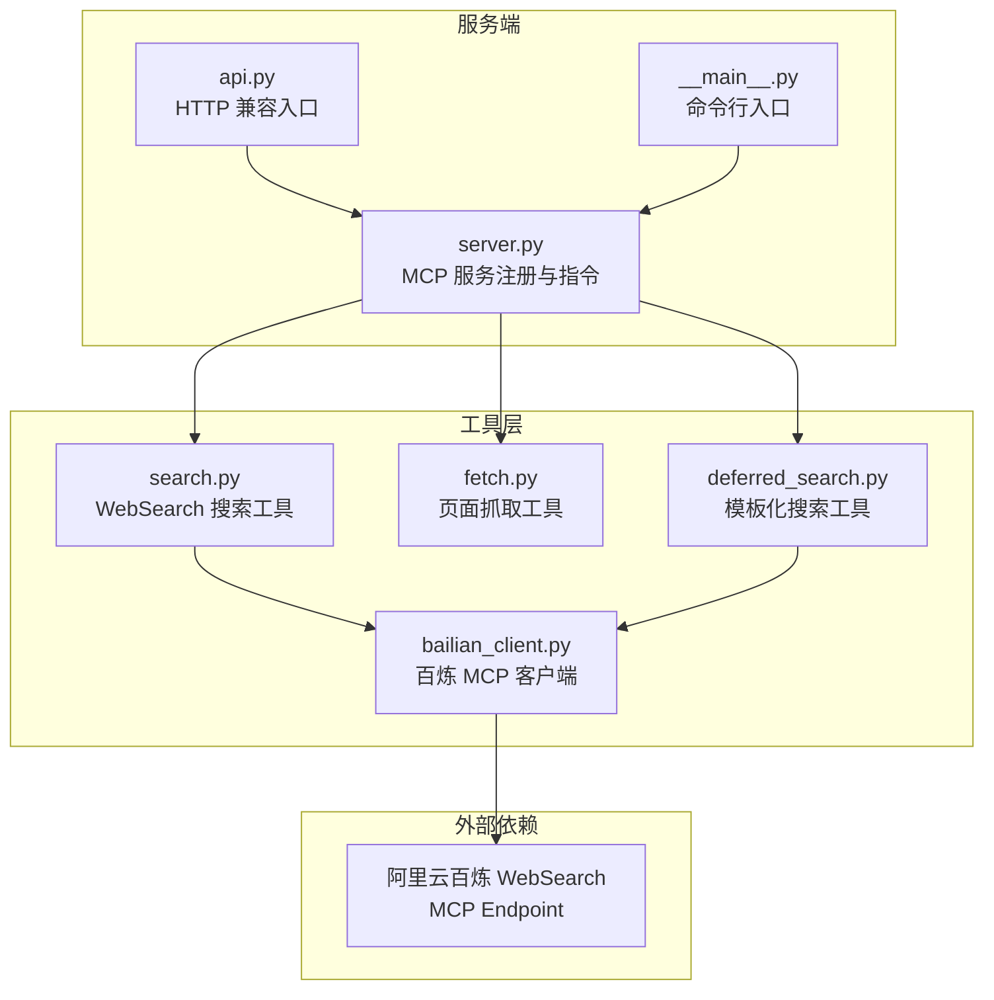
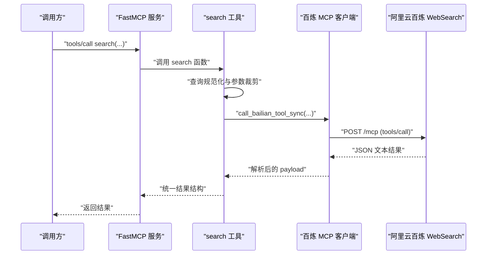
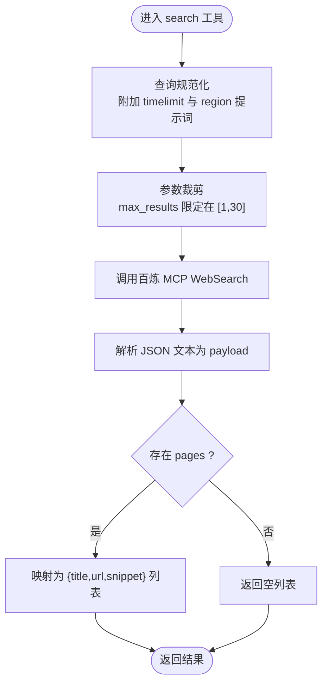
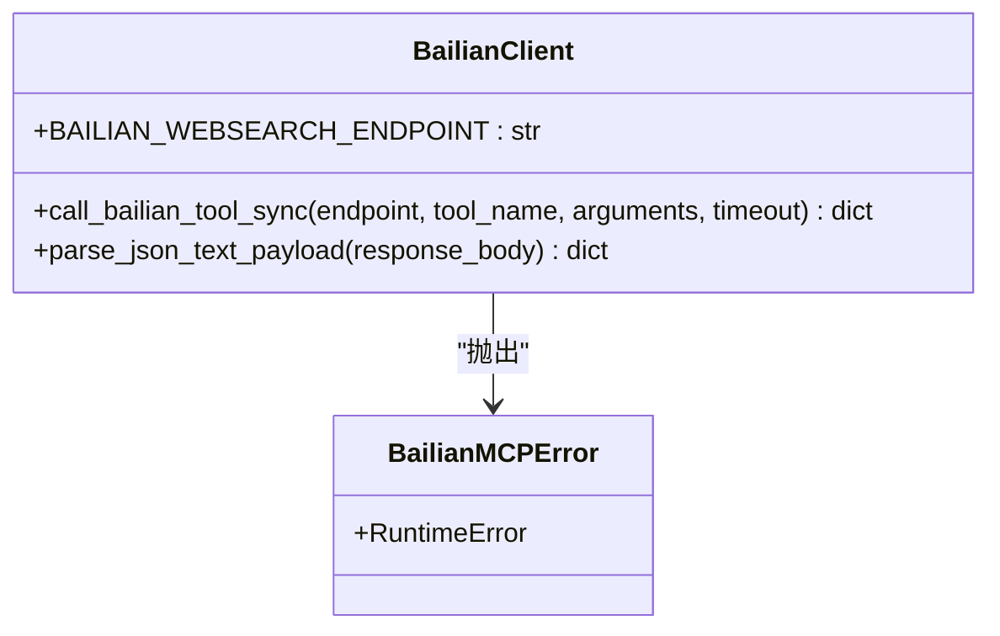
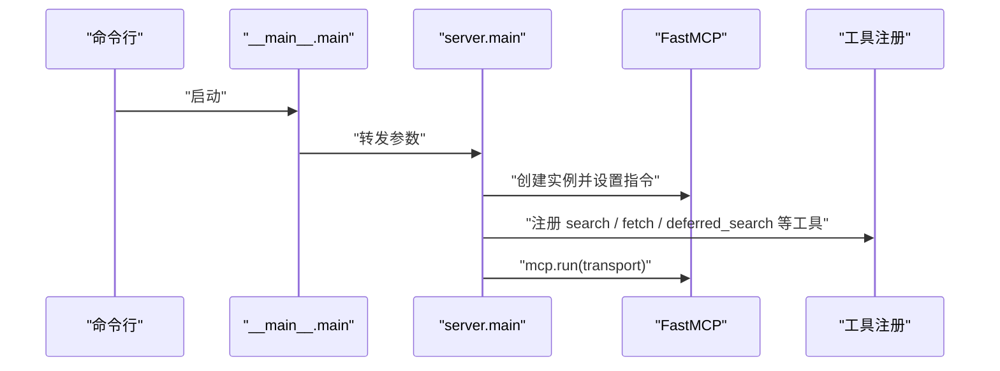
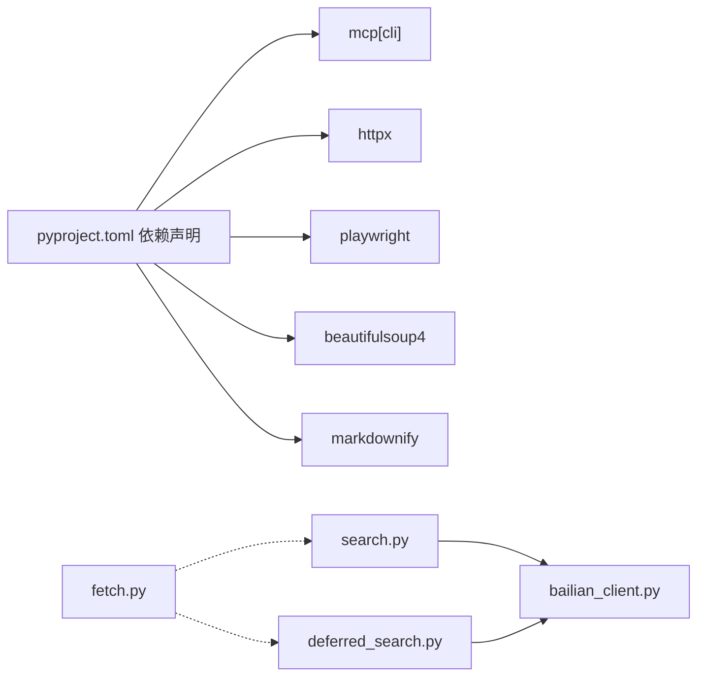

# WebSearch 搜索工具

<cite>
**本文引用的文件**
- [search.py](file://nano-search-mcp/src/nano_search_mcp/tools/search.py)
- [bailian_client.py](file://nano-search-mcp/src/nano_search_mcp/tools/bailian_client.py)
- [server.py](file://nano-search-mcp/src/nano_search_mcp/server.py)
- [api.py](file://nano-search-mcp/src/nano_search_mcp/api.py)
- [__main__.py](file://nano-search-mcp/src/nano_search_mcp/__main__.py)
- [README.md](file://nano-search-mcp/README.md)
- [pyproject.toml](file://nano-search-mcp/pyproject.toml)
- [test_server.py](file://nano-search-mcp/tests/test_server.py)
- [test_deferred_search.py](file://nano-search-mcp/tests/test_deferred_search.py)
- [fetch.py](file://nano-search-mcp/src/nano_search_mcp/tools/fetch.py)
- [deferred_search.py](file://nano-search-mcp/src/nano_search_mcp/tools/deferred_search.py)
</cite>

## 目录
1. [简介](#简介)
2. [项目结构](#项目结构)
3. [核心组件](#核心组件)
4. [架构总览](#架构总览)
5. [详细组件分析](#详细组件分析)
6. [依赖关系分析](#依赖关系分析)
7. [性能考虑](#性能考虑)
8. [故障排查指南](#故障排查指南)
9. [结论](#结论)
10. [附录](#附录)

## 简介
本文件为基于阿里云百炼 WebSearch 的搜索工具技术文档，聚焦于工具注册、参数处理、查询规范化与结果解析的实现细节。文档详细说明 search 函数的参数（query、max_results、region、timelimit）及其约束条件，解释查询预处理机制如何提升检索稳定性和可控性，并给出使用示例、错误处理策略与性能优化建议。同时说明与其他搜索工具的协作关系与典型应用场景。

## 项目结构
该项目是一个基于 MCP 协议的服务包，提供多种数据检索与抓取工具。WebSearch 搜索工具位于 tools/search.py，通过 bailian_client.py 与阿里云百炼 MCP WebSearch 服务交互；server.py 负责注册工具并暴露 MCP 服务；api.py 提供兼容的 HTTP 入口；__main__.py 提供命令行入口；README.md 提供安装与使用说明；tests/ 目录包含契约与功能测试。

图表来源
- [server.py:19-69](file://nano-search-mcp/src/nano_search_mcp/server.py#L19-L69)
- [api.py:3-6](file://nano-search-mcp/src/nano_search_mcp/api.py#L3-L6)
- [__main__.py:6-11](file://nano-search-mcp/src/nano_search_mcp/__main__.py#L6-L11)
- [search.py:8-13](file://nano-search-mcp/src/nano_search_mcp/tools/search.py#L8-L13)
- [bailian_client.py:12-15](file://nano-search-mcp/src/nano_search_mcp/tools/bailian_client.py#L12-L15)

章节来源
- [server.py:1-91](file://nano-search-mcp/src/nano_search_mcp/server.py#L1-L91)
- [api.py:1-12](file://nano-search-mcp/src/nano_search_mcp/api.py#L1-L12)
- [__main__.py:1-15](file://nano-search-mcp/src/nano_search_mcp/__main__.py#L1-L15)
- [README.md:1-198](file://nano-search-mcp/README.md#L1-L198)

## 核心组件
- WebSearch 搜索工具（search）：提供 MCP 工具接口，封装查询规范化、参数裁剪与结果解析，最终调用百炼 MCP WebSearch。
- 百炼 MCP 客户端（bailian_client）：负责构建请求、鉴权、发送 HTTP 请求、解析响应与错误处理。
- MCP 服务注册（server）：集中注册工具并提供服务指令与运行入口。
- HTTP 兼容入口（api）：暴露 streamable HTTP 接口，便于外部客户端通过 HTTP 访问 MCP。
- 命令行入口（__main__）：提供便捷启动方式。
- 页面抓取工具（fetch）：与搜索结果配合，抓取详情页正文。
- 模板化搜索工具（deferred_search）：支持主题模板与上下文变量的兜底搜索，具备重试与错误返回策略。

章节来源
- [search.py:79-119](file://nano-search-mcp/src/nano_search_mcp/tools/search.py#L79-L119)
- [bailian_client.py:24-92](file://nano-search-mcp/src/nano_search_mcp/tools/bailian_client.py#L24-L92)
- [server.py:19-69](file://nano-search-mcp/src/nano_search_mcp/server.py#L19-L69)
- [api.py:3-6](file://nano-search-mcp/src/nano_search_mcp/api.py#L3-L6)
- [__main__.py:6-11](file://nano-search-mcp/src/nano_search_mcp/__main__.py#L6-L11)
- [fetch.py:1-200](file://nano-search-mcp/src/nano_search_mcp/tools/fetch.py#L1-L200)
- [deferred_search.py:102-139](file://nano-search-mcp/src/nano_search_mcp/tools/deferred_search.py#L102-L139)

## 架构总览
WebSearch 搜索工具通过 FastMCP 注册为工具，接收调用参数后进行规范化与裁剪，随后调用百炼 MCP WebSearch 接口，解析返回的 JSON 文本并映射为统一的结果结构。服务端提供 streamable HTTP 与 stdio 两种传输方式，便于不同客户端集成。

图表来源
- [search.py:82-118](file://nano-search-mcp/src/nano_search_mcp/tools/search.py#L82-L118)
- [bailian_client.py:63-92](file://nano-search-mcp/src/nano_search_mcp/tools/bailian_client.py#L63-L92)
- [server.py:19-58](file://nano-search-mcp/src/nano_search_mcp/server.py#L19-L58)

## 详细组件分析

### WebSearch 搜索工具（search）
- 工具注册：通过装饰器注册为 MCP 工具，名称为 search。
- 参数处理：
  - query：必填，非空字符串。
  - max_results：整数，范围 [1, 30]，超出范围自动裁剪。
  - region：字符串，常用值包括 zh-cn、us-en、uk-en、wt-wt，默认 zh-cn。
  - timelimit：可选字符串，支持 d/w/m/y，表示过去 1 天/周/月/年，None 表示不限。
- 查询规范化：
  - 基于 timelimit 映射为中文时间提示词并拼接到查询。
  - 当 region 不等于 zh-cn/cn-zh 时，附加 region: 提示词。
  - 规范化后的查询作为最终搜索词发送给百炼。
- 结果解析：
  - 从响应中提取 pages 数组，逐项映射为包含 title/url/snippet 的字典列表。
  - 无结果时返回空列表。
- 错误处理：
  - 百炼 MCP 调用失败时抛出 RuntimeError，包含原始错误信息。
- 使用注意：
  - 百炼原生不支持 DDG 风格的 region/timelimit 过滤参数，本工具将其降级为查询提示词附加到 query，精确度取决于上游模型理解；如需严格过滤请在 query 中显式表达。

图表来源
- [search.py:17-38](file://nano-search-mcp/src/nano_search_mcp/tools/search.py#L17-L38)
- [search.py:112-118](file://nano-search-mcp/src/nano_search_mcp/tools/search.py#L112-L118)
- [search.py:41-70](file://nano-search-mcp/src/nano_search_mcp/tools/search.py#L41-L70)

章节来源
- [search.py:79-119](file://nano-search-mcp/src/nano_search_mcp/tools/search.py#L79-L119)
- [search.py:17-38](file://nano-search-mcp/src/nano_search_mcp/tools/search.py#L17-L38)
- [search.py:41-70](file://nano-search-mcp/src/nano_search_mcp/tools/search.py#L41-L70)

### 百炼 MCP 客户端（bailian_client）
- 环境配置：
  - BAILIAN_WEBSEARCH_ENDPOINT：百炼 MCP WebSearch 端点，默认值来自环境变量。
  - DASHSCOPE_API_KEY：鉴权密钥，缺失时抛出错误。
  - BAILIAN_MCP_TIMEOUT：默认 HTTP 超时，秒，可被调用方覆盖。
- 请求流程：
  - 构建 JSON-RPC 2.0 请求体，包含方法 tools/call 与参数 name/arguments。
  - 设置鉴权头 Authorization、Content-Type、Accept。
  - 发送 POST 请求，处理 HTTP 状态码与 JSON 解析错误。
  - 从响应中提取 result.content[0].text，并解析为 JSON。
- 错误类型：
  - BailianMCPError：统一包装底层错误，包含状态码、响应片段与 JSON 解析失败信息。

图表来源
- [bailian_client.py:24-26](file://nano-search-mcp/src/nano_search_mcp/tools/bailian_client.py#L24-L26)
- [bailian_client.py:63-92](file://nano-search-mcp/src/nano_search_mcp/tools/bailian_client.py#L63-L92)
- [bailian_client.py:54-61](file://nano-search-mcp/src/nano_search_mcp/tools/bailian_client.py#L54-L61)

章节来源
- [bailian_client.py:12-21](file://nano-search-mcp/src/nano_search_mcp/tools/bailian_client.py#L12-L21)
- [bailian_client.py:24-92](file://nano-search-mcp/src/nano_search_mcp/tools/bailian_client.py#L24-L92)

### MCP 服务注册与运行（server）
- 服务实例：FastMCP，提供名称、HTTP 路径与系统指令。
- 工具注册：集中注册 search、fetch_page、search_deferred_topic 等工具。
- 运行方式：支持 streamable-http 与 stdio 两种传输，默认 streamable-http。
- 指令说明：描述工具能力域与错误契约，强调 search 与 get_company_report 在参数非法或网络失败时抛异常，其它工具失败时返回统一格式。

图表来源
- [__main__.py:6-11](file://nano-search-mcp/src/nano_search_mcp/__main__.py#L6-L11)
- [server.py:19-69](file://nano-search-mcp/src/nano_search_mcp/server.py#L19-L69)
- [server.py:83-86](file://nano-search-mcp/src/nano_search_mcp/server.py#L83-L86)

章节来源
- [server.py:19-69](file://nano-search-mcp/src/nano_search_mcp/server.py#L19-L69)
- [server.py:83-86](file://nano-search-mcp/src/nano_search_mcp/server.py#L83-L86)

### HTTP 兼容入口与命令行入口
- HTTP 兼容入口：通过 api.py 暴露 streamable HTTP ASGI 应用，路由为 /mcp。
- 命令行入口：__main__.py 提供便捷启动，转发到 server.main。

章节来源
- [api.py:3-6](file://nano-search-mcp/src/nano_search_mcp/api.py#L3-L6)
- [__main__.py:6-11](file://nano-search-mcp/src/nano_search_mcp/__main__.py#L6-L11)

### 与其他搜索工具的协作关系
- 与模板化搜索（deferred_search）：两者均基于百炼 WebSearch，但 deferred_search 支持主题模板与上下文变量填充，并内置指数退避重试；search 更偏向直接参数化调用。
- 与页面抓取（fetch）：search 返回的 URL 可交由 fetch 抓取详情页正文，二者配合形成“搜索-抓取”的证据链路。
- 与定期报告、公告、研报、IR、监管处罚、行业政策等工具：共同构成 A 股外部证据采集能力域，按领域提供 MCP 工具。

章节来源
- [deferred_search.py:102-139](file://nano-search-mcp/src/nano_search_mcp/tools/deferred_search.py#L102-L139)
- [fetch.py:178-200](file://nano-search-mcp/src/nano_search_mcp/tools/fetch.py#L178-L200)
- [server.py:23-56](file://nano-search-mcp/src/nano_search_mcp/server.py#L23-L56)

## 依赖关系分析
- 语言与框架：Python 3.10+，依赖 mcp[cli]、httpx、playwright、beautifulsoup4、markdownify 等。
- 工具间耦合：search 与 deferred_search 共享 bailian_client，二者通过相同的百炼 MCP 接口交互；fetch 独立于搜索工具，但与搜索结果 URL 协作。
- 外部依赖：阿里云百炼 WebSearch MCP 服务，需配置 DASHSCOPE_API_KEY 与 BAILIAN_WEBSEARCH_ENDPOINT。

图表来源
- [pyproject.toml:6-14](file://nano-search-mcp/pyproject.toml#L6-L14)
- [search.py:8-13](file://nano-search-mcp/src/nano_search_mcp/tools/search.py#L8-L13)
- [deferred_search.py:23-27](file://nano-search-mcp/src/nano_search_mcp/tools/deferred_search.py#L23-L27)

章节来源
- [pyproject.toml:1-44](file://nano-search-mcp/pyproject.toml#L1-L44)

## 性能考虑
- 参数裁剪：max_results 限定在 [1,30]，避免过大请求导致响应延迟或资源浪费。
- 查询规范化：将 timelimit 与 region 以提示词形式附加到 query，减少上游模型理解偏差带来的无效检索。
- HTTP 超时：默认超时可由环境变量覆盖，建议根据网络状况与下游客户端超时设置合理调整。
- 重试策略：模板化搜索工具提供指数退避重试，search 工具未内置重试，建议在调用侧根据业务需求增加重试逻辑。
- 结果映射：仅提取必要字段，避免不必要的序列化与传输开销。

章节来源
- [search.py:112-118](file://nano-search-mcp/src/nano_search_mcp/tools/search.py#L112-L118)
- [bailian_client.py:20-21](file://nano-search-mcp/src/nano_search_mcp/tools/bailian_client.py#L20-L21)
- [deferred_search.py:102-139](file://nano-search-mcp/src/nano_search_mcp/tools/deferred_search.py#L102-L139)

## 故障排查指南
- 缺少鉴权：当 DASHSCOPE_API_KEY 未设置时，百炼 MCP 客户端会抛出错误，需检查环境变量。
- HTTP 错误：当百炼服务返回 4xx/5xx 时，客户端会抛出包含状态码与响应片段的错误。
- JSON 解析失败：当响应 text 非合法 JSON 时，客户端会抛出错误，包含截断的响应片段。
- 参数非法：search 在参数非法或网络彻底失败时抛出异常；其它工具失败时返回统一的 unavailable 结构。
- 工具注册契约：通过测试断言确保所有承诺的工具均已注册，避免遗漏。

章节来源
- [bailian_client.py:28-36](file://nano-search-mcp/src/nano_search_mcp/tools/bailian_client.py#L28-L36)
- [bailian_client.py:82-92](file://nano-search-mcp/src/nano_search_mcp/tools/bailian_client.py#L82-L92)
- [bailian_client.py:54-61](file://nano-search-mcp/src/nano_search_mcp/tools/bailian_client.py#L54-L61)
- [server.py:55-56](file://nano-search-mcp/src/nano_search_mcp/server.py#L55-L56)
- [test_server.py:49-83](file://nano-search-mcp/tests/test_server.py#L49-L83)

## 结论
WebSearch 搜索工具通过查询规范化与参数裁剪提升了检索的稳定性与可控性，借助百炼 MCP WebSearch 实现统一的结果结构输出。服务端提供灵活的传输方式与清晰的工具注册契约，便于在不同客户端环境中集成。与 fetch、deferred_search 等工具协同，可形成完整的外部证据采集链路，满足 A 股市场研究与分析场景的需求。

## 附录

### 使用示例
- 基本搜索：调用 search，传入 query、max_results、region、timelimit，返回包含 title/url/snippet 的列表。
- 与 fetch 协作：先调用 search 获取 URL 列表，再调用 fetch 抓取详情页正文。
- 模板化搜索：使用 deferred_search 的主题模板与上下文变量生成查询，适合标准化检索场景。

章节来源
- [search.py:82-118](file://nano-search-mcp/src/nano_search_mcp/tools/search.py#L82-L118)
- [fetch.py:186-200](file://nano-search-mcp/src/nano_search_mcp/tools/fetch.py#L186-L200)
- [deferred_search.py:145-189](file://nano-search-mcp/src/nano_search_mcp/tools/deferred_search.py#L145-L189)

### 参数定义与约束
- query：必填，非空字符串。
- max_results：整数，范围 [1, 30]，超出范围自动裁剪。
- region：字符串，常用值 zh-cn/us-en/uk-en/wt-wt，默认 zh-cn。
- timelimit：可选字符串，支持 d/w/m/y，None 表示不限。

章节来源
- [search.py:82-118](file://nano-search-mcp/src/nano_search_mcp/tools/search.py#L82-L118)

### 错误处理策略
- 百炼 MCP 调用失败：抛出 RuntimeError，包含原始错误信息。
- 其它工具失败：返回统一结构 {source: "unavailable", error, fetch_time}，不抛异常。
- 工具注册契约：通过测试断言确保工具注册完整性。

章节来源
- [search.py:55-56](file://nano-search-mcp/src/nano_search_mcp/tools/search.py#L55-L56)
- [server.py:55-56](file://nano-search-mcp/src/nano_search_mcp/server.py#L55-L56)
- [test_server.py:49-83](file://nano-search-mcp/tests/test_server.py#L49-L83)

### 典型应用场景
- 定期报告检索：先用 search 搜索报告列表页，再用 fetch 抓取详情页正文。
- 政策与公告跟踪：使用 deferred_search 的主题模板与上下文变量，定期生成标准化查询。
- 外部证据采集：结合 fetch 与各类报告工具，构建完整的证据链路。

章节来源
- [README.md:126-158](file://nano-search-mcp/README.md#L126-L158)
- [server.py:23-56](file://nano-search-mcp/src/nano_search_mcp/server.py#L23-L56)