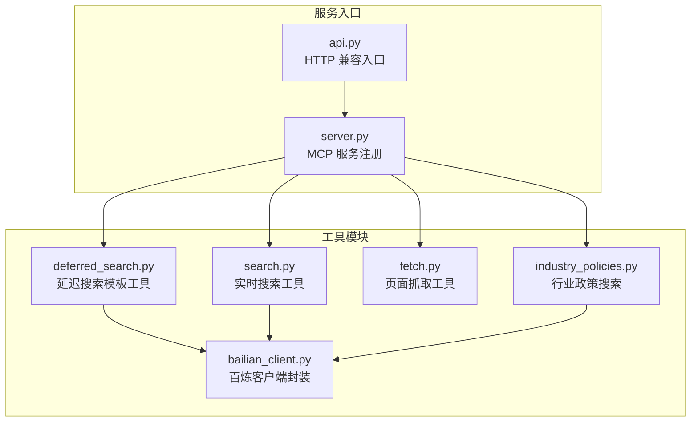
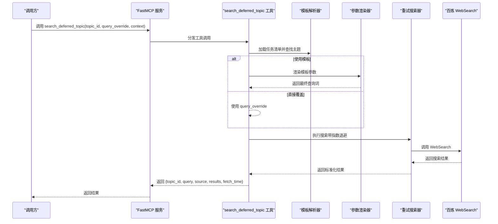
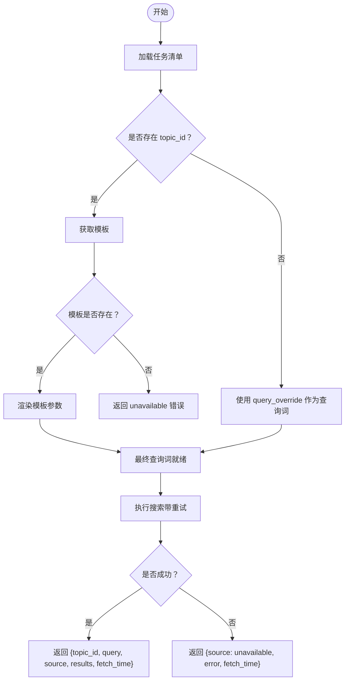
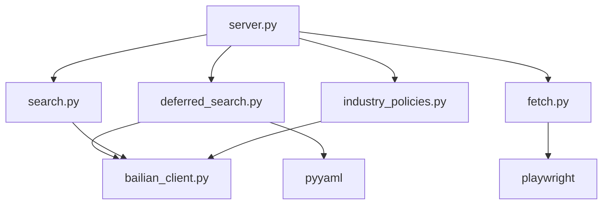

# 延迟搜索模板工具

<cite>
**本文引用的文件**
- [deferred_search.py](file://nano-search-mcp/src/nano_search_mcp/tools/deferred_search.py)
- [test_deferred_search.py](file://nano-search-mcp/tests/test_deferred_search.py)
- [test_deferred_tasks_parser.py](file://nano-search-mcp/tests/test_deferred_tasks_parser.py)
- [search.py](file://nano-search-mcp/src/nano_search_mcp/tools/search.py)
- [bailian_client.py](file://nano-search-mcp/src/nano_search_mcp/tools/bailian_client.py)
- [server.py](file://nano-search-mcp/src/nano_search_mcp/server.py)
- [api.py](file://nano-search-mcp/src/nano_search_mcp/api.py)
- [fetch.py](file://nano-search-mcp/src/nano_search_mcp/tools/fetch.py)
- [industry_policies.py](file://nano-search-mcp/src/nano_search_mcp/tools/industry_policies.py)
- [README.md](file://nano-search-mcp/README.md)
- [pyproject.toml](file://nano-search-mcp/pyproject.toml)
</cite>

## 目录
1. [简介](#简介)
2. [项目结构](#项目结构)
3. [核心组件](#核心组件)
4. [架构概览](#架构概览)
5. [详细组件分析](#详细组件分析)
6. [依赖关系分析](#依赖关系分析)
7. [性能考虑](#性能考虑)
8. [故障排查指南](#故障排查指南)
9. [结论](#结论)
10. [附录](#附录)

## 简介
本文件为延迟搜索模板工具的技术文档，聚焦于基于命名模板与参数绑定的延迟搜索机制。该工具通过解析外部任务清单中的查询模板，结合上下文参数进行占位符替换，最终调用百炼 WebSearch 执行异步检索，并在失败时采用指数退避重试策略。文档涵盖模板定义、参数绑定、异步执行、配置选项、执行时机与结果处理，以及与实时搜索工具的区别与适用场景。

## 项目结构
该模块属于 NanoSearchMCP 服务的一部分，提供 MCP 工具注册与 HTTP 兼容入口。核心文件与职责如下：
- tools/deferred_search.py：延迟搜索工具实现，包含模板解析、参数渲染与重试搜索
- tests/test_deferred_search.py：延迟搜索工具的单元测试
- tests/test_deferred_tasks_parser.py：任务清单解析器的单元测试
- tools/search.py：实时搜索工具（对比参考）
- tools/bailian_client.py：百炼 MCP 客户端封装
- server.py：MCP 服务入口，注册所有工具
- api.py：HTTP 兼容入口，复用标准 MCP HTTP 服务
- tools/fetch.py：页面抓取工具（安全与性能相关）
- tools/industry_policies.py：行业政策搜索工具（同为基于百炼 WebSearch 的检索）

图表来源
- [server.py:19-69](file://nano-search-mcp/src/nano_search_mcp/server.py#L19-L69)
- [api.py:3-6](file://nano-search-mcp/src/nano_search_mcp/api.py#L3-L6)
- [deferred_search.py:145-237](file://nano-search-mcp/src/nano_search_mcp/tools/deferred_search.py#L145-L237)
- [search.py:79-118](file://nano-search-mcp/src/nano_search_mcp/tools/search.py#L79-L118)
- [bailian_client.py:63-92](file://nano-search-mcp/src/nano_search_mcp/tools/bailian_client.py#L63-L92)
- [fetch.py:186-200](file://nano-search-mcp/src/nano_search_mcp/tools/fetch.py#L186-L200)
- [industry_policies.py:185-200](file://nano-search-mcp/src/nano_search_mcp/tools/industry_policies.py#L185-L200)

章节来源
- [server.py:19-69](file://nano-search-mcp/src/nano_search_mcp/server.py#L19-L69)
- [api.py:3-6](file://nano-search-mcp/src/nano_search_mcp/api.py#L3-L6)

## 核心组件
- 延迟搜索工具：提供按主题 ID 加载模板并渲染参数的搜索能力，支持自由查询覆盖模式
- 模板解析器：从任务清单中提取 YAML 代码块，构建主题映射，过滤已解决状态与占位符 ID
- 参数渲染器：将模板中的占位符替换为上下文字典中的值
- 搜索执行器：调用百炼 WebSearch，支持指数退避重试与区域提示词增强
- MCP 工具注册：将延迟搜索工具注册到 FastMCP 服务，暴露为可调用工具
- 百炼客户端：封装 HTTP 调用、鉴权头生成、JSON 文本解析与错误处理

章节来源
- [deferred_search.py:45-85](file://nano-search-mcp/src/nano_search_mcp/tools/deferred_search.py#L45-L85)
- [deferred_search.py:91-96](file://nano-search-mcp/src/nano_search_mcp/tools/deferred_search.py#L91-L96)
- [deferred_search.py:102-139](file://nano-search-mcp/src/nano_search_mcp/tools/deferred_search.py#L102-L139)
- [deferred_search.py:145-237](file://nano-search-mcp/src/nano_search_mcp/tools/deferred_search.py#L145-L237)
- [bailian_client.py:24-92](file://nano-search-mcp/src/nano_search_mcp/tools/bailian_client.py#L24-L92)

## 架构概览
延迟搜索工具的调用流程分为两阶段：
- 模板阶段：解析任务清单，根据 topic_id 获取模板，渲染上下文参数
- 搜索阶段：调用百炼 WebSearch，执行带重试的搜索，返回标准化结果

图表来源
- [deferred_search.py:148-237](file://nano-search-mcp/src/nano_search_mcp/tools/deferred_search.py#L148-L237)
- [deferred_search.py:45-85](file://nano-search-mcp/src/nano_search_mcp/tools/deferred_search.py#L45-L85)
- [deferred_search.py:91-96](file://nano-search-mcp/src/nano_search_mcp/tools/deferred_search.py#L91-L96)
- [deferred_search.py:102-139](file://nano-search-mcp/src/nano_search_mcp/tools/deferred_search.py#L102-L139)
- [bailian_client.py:63-92](file://nano-search-mcp/src/nano_search_mcp/tools/bailian_client.py#L63-L92)

## 详细组件分析

### 延迟搜索工具（search_deferred_topic）
- 功能特性
  - 支持两种模式：主题模板模式与自由查询覆盖模式
  - 模板模式：按 topic_id 从任务清单加载模板，结合 context 渲染参数
  - 自由查询模式：直接使用 query_override 作为搜索词
  - 结果标准化：统一返回 {topic_id, query, source, results, fetch_time}
  - 失败处理：统一返回 {source: "unavailable", error, fetch_time}，不抛异常
- 参数与约束
  - topic_id：主题标识符；自由查询模式下可传任意字符串
  - query_override：非空时覆盖模板，直接作为搜索词
  - max_results：取值范围 [1, 30]，越界自动截断
  - region：地区提示，默认 "cn-zh"，支持 "wt-wt"（全球）、"us-en"、"uk-en"
  - context：模板变量字典，如 {"industry": "光伏设备", "ts_code": "600660.SH"}
- 执行流程
  - 解析任务清单，加载主题映射
  - 确定查询词（模板渲染或直接覆盖）
  - 执行搜索（带重试），标准化结果
  - 返回统一格式的结果字典

图表来源
- [deferred_search.py:148-237](file://nano-search-mcp/src/nano_search_mcp/tools/deferred_search.py#L148-L237)

章节来源
- [deferred_search.py:148-237](file://nano-search-mcp/src/nano_search_mcp/tools/deferred_search.py#L148-L237)

### 模板解析器（load_deferred_topics）
- 功能：从任务清单中提取 YAML 代码块，构建主题映射
- 解析规则
  - 忽略注释与占位符 ID（以 "<" 开头）
  - 跳过 status 为 "resolved" 的条目
  - 支持单条与多条 YAML 列表
  - 重复 ID 时后者覆盖前者
- 输出：{id: {...}} 字典，包含主题元信息与模板字段

章节来源
- [deferred_search.py:45-85](file://nano-search-mcp/src/nano_search_mcp/tools/deferred_search.py#L45-L85)
- [test_deferred_tasks_parser.py:16-36](file://nano-search-mcp/tests/test_deferred_tasks_parser.py#L16-L36)
- [test_deferred_tasks_parser.py:39-65](file://nano-search-mcp/tests/test_deferred_tasks_parser.py#L39-L65)
- [test_deferred_tasks_parser.py:68-94](file://nano-search-mcp/tests/test_deferred_tasks_parser.py#L68-L94)
- [test_deferred_tasks_parser.py:96-124](file://nano-search-mcp/tests/test_deferred_tasks_parser.py#L96-L124)
- [test_deferred_tasks_parser.py:126-128](file://nano-search-mcp/tests/test_deferred_tasks_parser.py#L126-128)
- [test_deferred_tasks_parser.py:131-136](file://nano-search-mcp/tests/test_deferred_tasks_parser.py#L131-L136)
- [test_deferred_tasks_parser.py:139-155](file://nano-search-mcp/tests/test_deferred_tasks_parser.py#L139-L155)
- [test_deferred_tasks_parser.py:158-185](file://nano-search-mcp/tests/test_deferred_tasks_parser.py#L158-L185)

### 参数渲染器（render_query_template）
- 功能：将模板字符串中的 {variable} 替换为 context 中的值
- 行为：未提供的占位符保留原样，便于上游进一步处理

章节来源
- [deferred_search.py:91-96](file://nano-search-mcp/src/nano_search_mcp/tools/deferred_search.py#L91-L96)
- [test_deferred_search.py:84-94](file://nano-search-mcp/tests/test_deferred_search.py#L84-L94)

### 搜索执行器（_search_with_retry）
- 功能：调用百炼 WebSearch，支持指数退避重试
- 重试策略：最多 3 次，每次退避时间 = 2^attempt + 随机扰动
- 区域增强：将 region 作为提示词附加到查询词
- 错误处理：累计失败后抛出 RuntimeError

章节来源
- [deferred_search.py:102-139](file://nano-search-mcp/src/nano_search_mcp/tools/deferred_search.py#L102-L139)
- [test_deferred_search.py:119-141](file://nano-search-mcp/tests/test_deferred_search.py#L119-L141)

### MCP 工具注册
- 功能：将 search_deferred_topic 注册为 MCP 工具，供外部调用
- 服务：FastMCP 实例，支持 streamable HTTP 与 stdio 传输

章节来源
- [deferred_search.py:145-237](file://nano-search-mcp/src/nano_search_mcp/tools/deferred_search.py#L145-L237)
- [server.py:60-69](file://nano-search-mcp/src/nano_search_mcp/server.py#L60-L69)

### 百炼客户端封装（bailian_client）
- 功能：封装百炼 MCP 调用，包括鉴权头、超时控制、JSON 文本解析与错误处理
- 环境变量：DASHSCOPE_API_KEY、BAILIAN_WEBSEARCH_ENDPOINT、BAILIAN_MCP_TIMEOUT

章节来源
- [bailian_client.py:12-21](file://nano-search-mcp/src/nano_search_mcp/tools/bailian_client.py#L12-L21)
- [bailian_client.py:24-92](file://nano-search-mcp/src/nano_search_mcp/tools/bailian_client.py#L24-L92)

### 与实时搜索工具的对比
- 实时搜索（search）：直接接收用户查询，进行轻量预处理后调用百炼 WebSearch，返回标准化结果列表
- 延迟搜索（search_deferred_topic）：通过模板与上下文参数生成查询词，支持失败时统一返回 unavailable 字典

章节来源
- [search.py:79-118](file://nano-search-mcp/src/nano_search_mcp/tools/search.py#L79-L118)
- [deferred_search.py:148-237](file://nano-search-mcp/src/nano_search_mcp/tools/deferred_search.py#L148-L237)

## 依赖关系分析
- 组件耦合
  - 延迟搜索工具依赖模板解析器、参数渲染器与搜索执行器
  - 搜索执行器依赖百炼客户端封装
  - 服务入口统一注册所有工具
- 外部依赖
  - mcp.server.fastmcp：MCP 服务框架
  - httpx：HTTP 客户端
  - pyyaml：YAML 解析
  - playwright：页面抓取（与延迟搜索工具解耦）

图表来源
- [deferred_search.py:20-27](file://nano-search-mcp/src/nano_search_mcp/tools/deferred_search.py#L20-L27)
- [bailian_client.py:10-14](file://nano-search-mcp/src/nano_search_mcp/tools/bailian_client.py#L10-L14)
- [server.py:8-16](file://nano-search-mcp/src/nano_search_mcp/server.py#L8-L16)
- [search.py:6-13](file://nano-search-mcp/src/nano_search_mcp/tools/search.py#L6-L13)
- [fetch.py:10-12](file://nano-search-mcp/src/nano_search_mcp/tools/fetch.py#L10-L12)
- [industry_policies.py:20-24](file://nano-search-mcp/src/nano_search_mcp/tools/industry_policies.py#L20-L24)

章节来源
- [pyproject.toml:6-14](file://nano-search-mcp/pyproject.toml#L6-L14)

## 性能考虑
- 搜索重试与退避
  - 最多重试 3 次，退避时间呈指数增长，减少对上游服务的压力
  - 建议在高并发场景下合理设置客户端超时，避免请求堆积
- 结果数量控制
  - max_results 截断到 [1, 30]，避免过大响应影响性能
- 模板渲染复杂度
  - 渲染过程为 O(n)（n 为占位符数量），通常开销较小
- 网络与超时
  - 百炼客户端支持超时配置，可通过环境变量调整
- 页面抓取性能
  - fetch 工具使用浏览器复用与异步渲染，降低冷启动成本

章节来源
- [deferred_search.py:36-40](file://nano-search-mcp/src/nano_search_mcp/tools/deferred_search.py#L36-L40)
- [deferred_search.py:192-194](file://nano-search-mcp/src/nano_search_mcp/tools/deferred_search.py#L192-L194)
- [bailian_client.py:20-21](file://nano-search-mcp/src/nano_search_mcp/tools/bailian_client.py#L20-L21)
- [fetch.py:120-142](file://nano-search-mcp/src/nano_search_mcp/tools/fetch.py#L120-L142)

## 故障排查指南
- 常见问题与定位
  - unknown topic_id：检查任务清单路径与主题 ID 是否正确
  - 模板缺失：确认任务清单中存在 search_query_template 字段
  - 百炼服务不可用：查看重试日志与错误信息，确认 API Key 与网络连通性
  - 参数渲染异常：检查 context 是否包含必要键值
- 调试建议
  - 使用单元测试验证解析器与渲染器行为
  - 在开发环境中开启更详细的日志级别
  - 通过 HTTP 兼容入口进行快速验证
- 错误契约
  - 失败时统一返回 {source: "unavailable", error, fetch_time}，便于上层处理

章节来源
- [test_deferred_search.py:201-221](file://nano-search-mcp/tests/test_deferred_search.py#L201-L221)
- [test_deferred_search.py:224-250](file://nano-search-mcp/tests/test_deferred_search.py#L224-L250)
- [deferred_search.py:186-188](file://nano-search-mcp/src/nano_search_mcp/tools/deferred_search.py#L186-L188)

## 结论
延迟搜索模板工具通过任务清单驱动的模板机制，实现了灵活、可扩展的查询生成与异步执行。其设计强调失败时的稳健性与统一错误契约，适合在需要标准化查询语义与可维护性的场景中使用。与实时搜索工具相比，延迟搜索更注重模板化与可配置性，适用于周期性、批量化的外部证据采集任务。

## 附录

### 配置选项与环境变量
- BAILIAN_WEBSEARCH_ENDPOINT：百炼 WebSearch 端点地址
- DASHSCOPE_API_KEY：百炼 API 密钥
- BAILIAN_MCP_TIMEOUT：百炼客户端超时（秒）

章节来源
- [bailian_client.py:12-21](file://nano-search-mcp/src/nano_search_mcp/tools/bailian_client.py#L12-L21)

### 使用场景与最佳实践
- 适用场景
  - 需要标准化查询语义的行业政策、监管动态跟踪等
  - 批量生成查询词并统一执行的外部证据采集
- 最佳实践
  - 将查询模板集中管理在任务清单中，便于版本控制与团队协作
  - 在 context 中提供最小必要的参数，避免过度复杂的模板
  - 对于高风险失败场景，结合重试与降级策略

章节来源
- [README.md:28-48](file://nano-search-mcp/README.md#L28-L48)

### 与实时搜索工具的区别
- 实时搜索（search）：直接接收用户查询，返回标准化结果列表
- 延迟搜索（search_deferred_topic）：通过模板与上下文参数生成查询词，支持失败时统一返回 unavailable 字典

章节来源
- [search.py:79-118](file://nano-search-mcp/src/nano_search_mcp/tools/search.py#L79-L118)
- [deferred_search.py:148-237](file://nano-search-mcp/src/nano_search_mcp/tools/deferred_search.py#L148-L237)